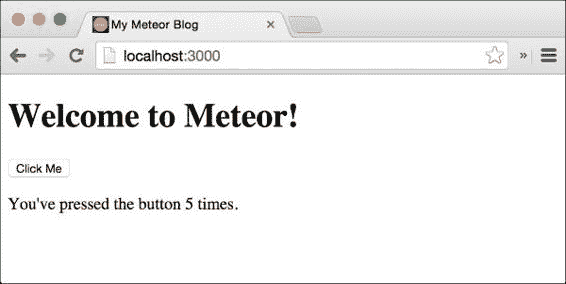

# 第一章：开始使用 Meteor

欢迎来到关于 Meteor 的这本书。Meteor 是一个令人兴奋的新 JavaScript 框架，我们将很快看到如何用更少的代码实现真实且令人印象深刻的结果。

在本章中，我们将学习系统要求以及我们开始需要使用哪些额外的工具。我们将了解如何轻松地运行我们的第一个 Meteor 应用程序，以及一个 Meteor 应用程序可能的良好基本文件夹结构。我们还将了解 Meteor 的自动构建过程及其特定的文件加载方式。

我们还将了解如何使用 Meteor 官方的包管理系统添加包。在本章末尾，我们将简要查看 Meteor 的命令行工具及其一些功能。

为了总结，我们将涵盖以下主题：

+   Meteor 的全栈框架

+   Meteor 的系统要求

+   安装 Meteor

+   添加基本包

+   Meteor 的文件夹约定和加载顺序

+   Meteor 的命令行工具

# Meteor 的全栈框架

Meteor 不仅仅是一个像 jQuery 或 AngularJS 这样的 JavaScript 库。它是一个包含前端库、基于 Node.js 的服务器和命令行工具的全栈解决方案。所有这些加在一起让我们可以用 JavaScript 编写大规模的网络应用程序，无论是在服务器端还是客户端，都可以使用一致的 API。

尽管 Meteor 还相当年轻，但已经有几家公司，如[`lookback.io`](https://lookback.io)、[`respond.ly`](https://respond.ly)和[`madeye.io`](https://madeye.io)，在其生产环境中使用 Meteor。

如果你想亲自看看用 Meteor 制作的东西，请查看[`madewith.meteor.com`](http://madewith.meteor.com)。

Meteor 使我们能够快速构建网络应用程序，并处理诸如文件链接、文件压缩和文件合并等无聊的过程。

以下是在 Meteor 下可以实现的一些亮点：

+   我们可以使用模板来构建复杂的网络应用程序，这些模板在数据更改时会自动更新，从而大大提高速度。

+   在我们应用程序运行的同时，我们可以将新代码推送到所有客户端。

+   Meteor 的核心包带有一个完整的账户解决方案，允许与 Facebook、Twitter 等无缝集成。

+   数据将自动在客户端之间同步，几乎实时地保持每个客户端在相同的状态。

+   延迟补偿将使我们的界面在服务器响应后台进行时看起来超级快速。

使用 Meteor 时，我们永远不需要在 HTML 的`<script>`标签中链接文件。Meteor 的命令行工具会自动收集我们应用程序文件夹中的 JavaScript 或 CSS 文件，并在初始页面加载时将它们链接到`index.html`文件中。这使得将我们的代码结构化到单独的文件中变得像创建它们一样简单。

Meteor 的命令行工具还会监控我们应用程序文件夹内的所有文件，如有更改，就会在文件更改时实时重建它们。

此外，它还会启动一个 Meteor 服务器，为客户端提供应用文件。当文件发生变化时，Meteor 会重新加载每个客户端的网站，同时保留其状态。这被称为**热代码重载**。

在生产环境中，构建过程还会对我们的 CSS 和 JavaScript 文件进行合并和压缩。

仅仅通过添加`less`和`coffee`核心包，我们甚至可以不费吹灰之力地用 LESS 写所有样式和用 CoffeeScript 写代码。

命令行工具也是用于部署和捆绑我们的应用的工具，这样我们就可以在远程服务器上运行它。

听起来很棒吗？让我们看看使用 Meteor 需要什么。

# Meteor 的要求

Meteor 不仅仅是 JavaScript 框架和服务器。正如我们之前所看到的，它也是一个命令行工具，为我们整个构建过程做好准备。

目前，官方支持的操作系统如下：

+   Mac OS X 10.6 及以上

+   Linux x86 和 x86_64 系统

+   Windows

    ### 注意

    在撰写本书时，Windows 安装程序仍在开发中。请关注[`github.com/meteor/meteor/wiki/Preview-of-Meteor-on-Windows`](https://github.com/meteor/meteor/wiki/Preview-of-Meteor-on-Windows)的 wiki 页面。

本书和所有示例都使用*Meteor 1.0*。

## 使用 Chrome 的开发者工具

我们还需要安装了 Firebug 插件的 Google Chrome 或 Firefox 来跟随需要控制台的示例。本书中的示例、屏幕截图和解释将使用 Google Chrome 的开发者工具。

## 使用 Git 和 GitHub

我强烈推荐在使用我们将在本书中工作的网页项目时使用**GitHub**。Git 和 GitHub 帮助我们备份我们的进度，并让我们总能回到之前的阶段，同时看到我们的更改。

Git 是一个版本控制系统，由 Linux 的发明者、Linus Torvalds 于 2005 年创建。

使用 Git，我们可以*提交*我们代码的任何状态，并稍后回到那个确切的状态。它还允许多个开发者在同一代码库上工作，并通过自动化过程合并他们的结果。如果在合并过程中出现冲突，合并开发者可以通过删除不需要的代码行来解决这些*合并冲突*。

我还建议在[`github.com`](http://github.com)注册一个账户，这是浏览我们代码历史的最简单方式。他们有一个易于使用的界面，以及一个很棒的 Windows 和 Mac 应用。

要跟随本书中的代码示例，你可以从本书的网页[`www.packtpub.com/books/content/support/17713`](https://www.packtpub.com/books/content/support/17713)下载每个章节的全部代码示例。

此外，您将能够从[`github.com/frozeman/book-building-single-page-web-apps-with-meteor`](http://github.com/frozeman/book-building-single-page-web-apps-with-meteor)克隆本书的代码。这个仓库中的每个标签等于书中的一个章节，提交历史将帮助您查看每个章节所做的更改。

# 安装 Meteor

安装 Meteor 就像在终端中运行以下命令一样简单：

```js
$ curl https://install.meteor.com/ | sh

```

就这样！这将安装 Meteor 命令行工具（`$ meteor`），Meteor 服务器，MongoDB 数据库和 Meteor 核心包（库）。

### 注意

所有命令行示例都在 Mac OS X 上运行和测试，可能会在 Linux 或 Windows 系统上有所不同。

## 安装 Git

要安装 Git，我建议从[`mac.github.com`](https://mac.github.com)或[`windows.github.com`](https://windows.github.com)安装 GitHub 应用程序。然后我们只需进入应用程序，点击**首选项**，并在**高级**选项卡内点击**安装命令行工具**按钮。

如果我们想手动安装 Git 并通过命令行进行设置，我们可以从[`git-scm.com`](http://git-scm.com)下载 Git 安装程序，并遵循[`help.github.com/articles/set-up-git`](https://help.github.com/articles/set-up-git)这个很好的指南。

现在，我们可以通过打开终端并运行以下命令来检查一切是否成功安装：

```js
$ git

```

### 提示

**下载示例代码**

您可以从您在[`www.packtpub.com`](http://www.packtpub.com)账户中购买的所有 Packt 书籍的示例代码文件。如果您在其他地方购买了这本书，您可以访问[`www.packtpub.com/support`](http://www.packtpub.com/support)并注册，以便将文件直接通过电子邮件发送给您。

这将返回 Git 选项的列表。如果我们得到`command not found: git`，我们需要检查`git`二进制文件是否已正确添加到我们的`PATH`环境变量中。

如果一切顺利，我们就可以准备创建我们的第一个 Meteor 应用了。

# 创建我们的第一个应用

为了创建我们的第一个应用程序，我们打开终端，前往我们希望创建新项目的文件夹，并输入以下命令：

```js
$ cd my/developer/folder
$ meteor create my-meteor-blog

```

Meteor 现在将创建一个名为`my-meteor-blog`的文件夹。Meteor 为我们在这个文件夹内创建的 HTML、CSS 和 JavaScript 文件已经是一个完整的 Meteor 应用程序。为了看到它的实际效果，运行以下命令：

```js
$ cd my-meteor-blog
$ meteor

```

Meteor 现在将在端口`3000`上为我们启动一个本地服务器。现在，我们可以打开我们的网页浏览器，导航到`http://localhost:3000`。我们将看到应用程序正在运行。

这个应用程序除了显示一个简单的反应式示例外，没有什么作用。如果你点击**点击我**按钮，它会增加计数器：



对于后面的示例，我们将需要 Google Chrome 的开发者工具。要打开控制台，我们可以在 Mac OS X 上按*Alt* + *command* + *I*，或者在 Chrome 的右上角点击菜单按钮，选择**更多工具**，然后选择**开发者工具**。

**开发者工具**允许我们查看我们网站的 DOM 和 CSS，以及有一个控制台，我们可以在其中与我们的网站的 JavaScript 进行交互。

## 创建一个好的文件夹结构

对于这本书，我们将从头开始构建自己的应用程序。这也意味着我们必须建立一个可持续的文件夹结构，这有助于我们保持代码的整洁。

在使用 Meteor 时，我们对文件夹结构非常灵活。这意味着我们可以把我们的文件放在任何我们想要的地方，只要它们在应用程序的文件夹内。Meteor 以不同的方式处理特定的文件夹，允许我们只在外部客户端、服务器或两者上都暴露文件。我们稍后会看看这些特定的文件夹。

但是，首先让我们通过删除我们新创建的应用程序文件夹中所有的预添加文件，并创建以下的文件夹结构：

```js
- my-meteor-blog
  - server
  - client
    - styles
    - templates
```

## 预添加样式文件

为了能完全专注于 Meteor 代码但仍然拥有一个漂亮的博客，我强烈建议从书籍的网页上下载本章伴随的代码，网址为[`packtpub.com/books/content/support/17713`](http://packtpub.com/books/content/support/17713)。它们将包含两个已经可以替换的样式文件（`lesshat.import.less`和`styles.less`），这将使你在接下来的章节中的示例博客看起来很漂亮。

你也可以直接从 GitHub 下载这些文件，网址为[`github.com/frozeman/book-building-single-page-web-apps-with-meteor/tree/chapter1/my-meteor-blog/client/styles`](https://github.com/frozeman/book-building-single-page-web-apps-with-meteor/tree/chapter1/my-meteor-blog/client/styles)，然后手动将它们复制到`my-meteor-blog/client/styles`文件夹中。

接下来，我们需要添加一些基本包，这样我们就可以开始构建我们的应用程序了。

# 添加基本包

Meteor 中的包是可以在我们的项目中添加的库。Meteor 包的好处是它们是开箱即用的自包含单元。它们主要提供一些模板功能，或者在项目的全局命名空间中提供额外的对象。

包还可以为 Meteor 的构建过程添加功能，比如`stylus`包，它让我们可以使用`stylus`预处理器语法来编写我们应用程序的样式文件。

对于我们的博客，我们首先需要两个包：

`less`：这是一个 Meteor 核心包，它将我们的样式文件实时编译成 CSS。

`jeeeyul:moment-with-langs`：这是一个用于日期解析和格式化的第三方库。

## 添加一个核心包

要添加`less`包，我们只需打开终端，前往我们的项目文件夹，并输入以下命令：

```js
$ meteor add less

```

现在，我们可以在我们的项目中使用任何`*.less`文件，Meteor 将在其构建过程中自动将它们编译为我们。

## 添加第三方包

要添加第三方包，我们可以在[`atmospherejs.com`](https://atmospherejs.com)上搜索包，这是 Meteor 打包系统的前端，或者使用命令行工具`$ meteor search <package name>`。

对于我们的博客，我们将需要`jeeeyul:moment-with-langs`包，它允许我们稍后简单地操作和格式化日期。

包使用作者名加上冒号进行命名空间。

要添加`moment`包，我们只需输入以下命令：

```js
$ meteor add jeeeyul:moment-with-langs

```

进程完成后，我们使用`$ meteor`重新启动应用程序，我们将在应用程序的全局命名空间中拥有`moment`对象，我们可以在接下来的章节中使用它。

如果我们想要添加某个包的特定版本，我们可以使用以下命令：

```js
$ meteor add jeeeyul:moment-with-langs@=2.8.2

```

如果您想要 1.0.0 范围内的版本（而不是 2.0.0），请使用以下命令：

```js
$ meteor add jeeeyul:moment-with-langs@1.0.0

```

要仅更新包，我们可以简单地运行以下命令：

```js
$ meteor update –-packages-only

```

此外，我们可以使用以下命令仅更新特定的包：

```js
$ meteor update jeeeyul:moment-with-langs

```

就是这样！现在我们完全准备好开始创建我们的第一个模板。您可以直接进入下一章，但请确保您回来阅读，因为我们将详细讨论 Meteor 的构建过程。

# 变量作用域

为了理解 Meteor 的构建过程及其文件夹约定，我们需要快速了解一下变量作用域。

Meteor 在提供代码之前，将每个代码文件包裹在匿名函数中。因此，使用`var`关键字声明的变量将仅在该文件的作用域内可用，这意味着这些变量无法被您应用程序中的其他任何文件访问。然而，当我们不使用这个关键字声明一个变量时，我们将其变成了一个全局可用的变量，这意味着它可以从我们应用程序中的任何文件访问。为了理解这一点，我们可以看一下以下示例：

```js
// The following files content
var myLocalVariable = 'test';
myGlobalVariable = 'test';
```

在 Meteor 的构建过程之后，前面的代码行将如下所示：

```js
(function(){
  var myLocalVariable = 'test';
  myGlobalVariable = 'test';
})();
```

这样，使用*var*创建的变量是匿名函数的局部变量，而另一个变量可以全局访问，因为它可能是在此之前在其他地方创建的。

# Meteor 的文件夹约定和加载顺序

虽然 Meteor 没有对我们的文件夹名称或结构施加限制，但是有一些命名约定可以帮助 Meteor 的构建过程确定文件需要加载的顺序。

以下表格描述了文件夹及其特定的加载顺序：

| 文件夹名称 | 加载行为 |
| --- | --- |
| `client` | 此文件仅在客户端加载。 |
| `client/compatibility` | 此文件不会被包裹在匿名函数中。这是为使用`var`声明顶级变量的库设计的。此外，这个文件夹中的文件将在客户端上的其他文件之前加载。 |
| `server` | 此文件夹中的文件仅在服务器上提供。 |
| `public` | 这个文件夹可以包含在客户端上使用的资产，例如图片、`favicon.ico` 或 `robots.txt`。公共文件夹内的文件夹和文件可以从根目录 `/` 在客户端上直接访问。 |
| `private` | 这个文件夹可以包含只有服务器上可用的资产。这些文件可以通过 `Assets` API 访问。 |
| `lib` | `lib` 文件夹内的文件和子文件夹将在其他文件之前加载，其中更深层次的 `lib` 文件夹将在其父文件夹的 `lib` 文件夹之前加载。 |
| `tests` | 此文件夹内的文件将完全不被 Meteor 触摸或加载。 |
| `packages` | 当我们想要使用本地包时，我们可以将它们添加到这个文件夹中，Meteor 将使用这些包，即使有一个与之一样的名字存在于 Meteor 的官方包系统中。（然而，我们仍然需要使用 `$ meteor add ....` 添加包） |

下面的表格描述了创建特定加载顺序的文件名：

| 文件名 | 加载行为 |
| --- | --- |
| `main.*` | 具有此名称的文件最后加载，而更深层次的文件夹则在它们的父文件夹的文件之前加载 |
| `*.*` | 表中提到的前面文件夹之外的文件将在客户端和服务器上一起加载 |

因此，我们看到 Meteor 收集了所有文件，除了 `public`、`private` 和 `tests` 中的文件。

此外，文件总是按照字母顺序加载，子文件夹中的文件会在父文件夹中的文件之前加载。

如果我们有位于 `client` 或 `server` 文件夹之外的文件，并希望确定代码应该在哪里执行，我们可以使用以下变量：

```js
if(Meteor.isClient) {
  // Some code executed on the client
}

if(Meteor.isServer) {
  // Some code executed on the server. 
}
```

我们还看到，`main.*` 文件中的代码是最后加载的。为了确保特定代码只在所有文件加载完毕且客户端的 DOM 准备就绪后加载，我们可以使用 Meteor 的 `startup()` 函数：

```js
Meteor.startup(function(){
  /*
  This code runs on the client when the DOM is ready,
  and on the server when the server process is finished starting.
  */
});
```

## 服务器上加载资产

要从服务器上的 `private` 文件夹加载文件，我们可以如下使用 `Assets` API：

```js
Assets.getText(assetPath, [asyncCallback]);
// or
Assets.getBinary(assetPath, [asyncCallback])
```

在这里，`assetPath` 是相对于 `private` 文件夹的文件路径，例如，'`subfolder/data.txt'`。

如果我们提供一个回调函数作为第二个参数，`Assets()` 方法将异步运行。因此，我们有两种获取资产文件内容的方法：

```js
// Synchronously
var myData = Assets.getText('data.txt');

// Or asynchronously
Assets.getText('data.txt', function(error, result){
  // Do somthing with the result.
  // If the error parameter is not NULL, something went wrong
});
```

### 注意

如果第一个例子返回一个错误，我们当前的服务器代码将会失败。在第二个例子中，我们的代码仍然可以工作，因为错误包含在 `error` 参数中。

既然我们已经了解了 Meteor 的基本文件夹结构，那么现在让我们简要地看看 Meteor 的命令行工具。

# Meteor 的命令行工具

既然我们已经了解了 Meteor 的构建过程和文件夹结构，我们将更详细地看看 Meteor 提供命令行工具能做什么。

正如我们在使用 `meteor` 命令时所见，我们需要在 Meteor 项目中才能执行所有操作。例如，当我们运行 `meteor add xxx`，我们就会向当前所在的项目中添加一个包。

## 更新 Meteor

如果 Meteor 发布了一个新版本，我们可以通过运行以下命令简单地更新我们的项目：

```js
$ meteor update

```

如果我们想要回到之前的版本，我们可以通过运行以下命令来实现：

```js
$ meteor update –-release 0.9.1

```

这将使我们的项目回退到发布版本 0.9.1。

## 部署 Meteor

将我们的 Meteor 应用程序部署到公共服务器，只需运行以下命令即可：

```js
$ meteor deploy my-app-name

```

这将要求我们注册一个 Meteor 开发者账户，并在[](http://my-app-name.meteor.com)部署我们的应用程序。

要了解如何部署一个 Meteor 应用程序的完整介绍，请参考第十章，*部署我们的应用程序*。

在附录中，你可以找到 Meteor 命令及其解释的完整列表。

# 总结

在本章中，我们学习了 Meteor 运行所需要的内容、如何创建一个 Meteor 应用程序，以及构建过程是如何工作的。

我们知道 Meteor 的文件结构相当灵活，但有一些特殊的文件夹，如`client`、`server`和`lib`文件夹，它们在不同的位置和顺序被加载。我们还了解了如何添加包以及如何使用 Meteor 命令行工具。

如果你想更深入地了解我们迄今为止学到的内容，请查看 Meteor 文档的以下部分：

+   [](https://www.meteor.com/projects)

+   [](https://www.meteor.com/tool)

+   [](https://docs.meteor.com/#/full/whatismeteor)

+   [](https://docs.meteor.com/#/full/structuringyourapp)

+   [](https://docs.meteor.com/#/full/usingpackages)

+   [](https://docs.meteor.com/#/full/assets)

+   [](https://docs.meteor.com/#/full/commandline)

你可以在[](https://www.packtpub.com/books/content/support/17713)找到本章的代码示例，或者在 GitHub 上找到[](https://github.com/frozeman/book-building-single-page-web-apps-with-meteor/tree/chapter1)。

现在我们已经设置了我们项目的基本文件夹结构，我们准备开始 Meteor 的有趣部分——模板。
