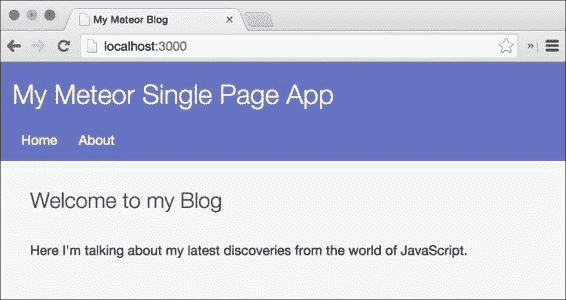
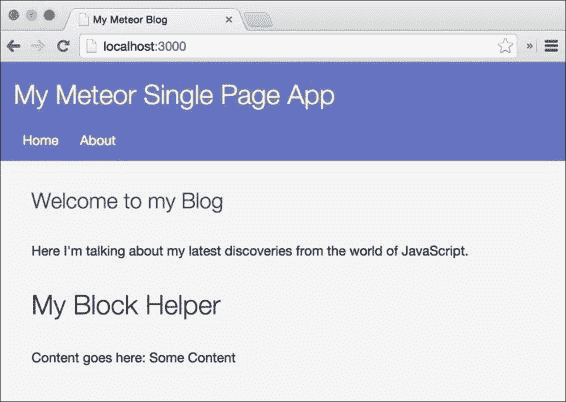
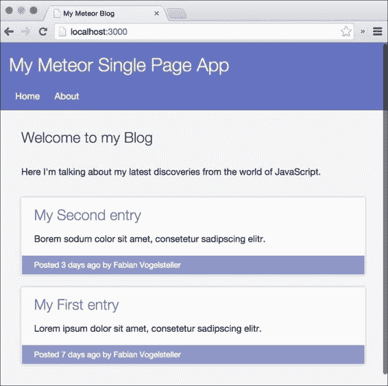

# 第二章： 构建 HTML 模板

在我们成功安装 Meteor 并设置好我们的文件夹结构之后，我们现在可以开始为我们的博客构建基本模板了。

在本章中，我们将学习如何构建模板。我们将了解如何显示数据以及如何使用助手函数更改某些部分。我们将查看如何添加事件、使用条件以及理解数据上下文，都在模板中。

以下是对本章将涵盖内容的概述：

+   基本模板结构

+   显示数据

+   编写模板助手函数

+   在模板中使用条件

+   数据上下文以及如何设置它们

+   嵌套模板和数据上下文继承

+   添加事件

+   构建块助手

    ### 注意

    如果你跳过第一章*Meteor 入门*直接进入本章，请从以下任一位置下载前一章的代码示例：书籍网页在[`www.packtpub.com/books/content/support/17713`](https://www.packtpub.com/books/content/support/17713)或 GitHub 仓库在[`github.com/frozeman/book-building-single-page-web-apps-with-meteor/tree/chapter1`](https://github.com/frozeman/book-building-single-page-web-apps-with-meteor/tree/chapter1)。

    这些代码示例还将包含所有样式文件，因此我们不必担心在过程中添加 CSS 代码。

# 在 Meteor 中编写模板

通常当我们构建网站时，我们在服务器端构建完整的 HTML。这很简单；每个页面都是在服务器上构建的，然后发送到客户端，最后 JavaScript 添加了一些额外的动画或动态行为。

这在单页应用中不是这样，因为在单页应用中，每个页面都需要已经存在于客户端浏览器中，以便可以随时显示。Meteor 通过提供存在于 JavaScript 中的模板来解决这个问题，可以在某个时刻将它们放置在 DOM 中。这些模板可以包含嵌套模板，使得轻松重用和结构化应用的 HTML 布局变得容易。

由于 Meteor 在文件和文件夹结构方面非常灵活，任何`*.html`页面都可以包含一个模板，并在 Meteor 的构建过程中进行解析。这允许我们将所有模板放在我们在第第一章*Meteor 入门*中创建的`my-meteor-blog/client/templates`文件夹中，这种文件夹结构的选择是因为它帮助我们组织模板，当应用增长时。

Meteor 的模板引擎称为**Spacebars**，它是 handlebars 模板引擎的派生。Spacebars 建立在**Blaze**之上，后者是 Meteor 的响应式 DOM 更新引擎。

### 注意

Blaze 可以使用其 API 直接生成反应式 HTML，尽管使用 Meteor 的 Spacebars 或建立在 Blaze 之上的第三方模板语言（如为 Meteor 设计的 Jade）更为方便。

有关 Blaze 的更多详细信息，请访问[`docs.meteor.com/#/full/blaze`](https://docs.meteor.com/#/full/blaze)和[`github.com/mquandalle/meteor-jade`](https://github.com/mquandalle/meteor-jade)。

使 Spacebars 如此激动人心的是它的简单性和反应性。反应式模板意味着模板的某些部分可以在底层数据变化时自动更改。无需手动操作 DOM，不一致的界面已成为过去。为了更好地了解 Meteor，我们将从为我们的应用创建的基本 HTML 文件开始：

1.  让我们在我们`my-meteor-blog/client`文件夹中创建一个`index.html`文件，并输入以下代码行：

    ```js
    <head>
      <title>My Meteor Blog</title>
    </head>
    <body>
      Hello World
    </body>
    ```

    ### 注意

    请注意，我们的`index.html`文件不包含`<html>...</html>`标签，因为 Meteor 会收集任何文件中的`<head>`和`<body>`标签，并构建自己的`index.html`文件，该文件将交付给用户。实际上，我们还可以将此文件命名为`myapp.html`。

1.  接下来，我们通过在命令行中输入以下命令来运行我们的 Meteor 应用：

    ```js
    $ cd my-meteor-blog
    $ meteor

    ```

    这将启动一个带有我们应用的 Meteor 服务器。

1.  就这样！现在我们可以打开浏览器，导航到`http://localhost:3000`，我们应该能看到**Hello World**。

这里发生的是，Meteor 将查看我们应用文件夹中可用的所有 HTML 文件，合并所有找到的`<head>`和`<body>`标签的内容，并将其作为索引文件提供给客户端。

如果我们查看我们应用的源代码，我们会看到`<body>`标签是空的。这是因为 Meteor 将`<body>`标签的内容视为自己的模板，在 DOM 加载时，将与相应的 JavaScript 模板一起注入。

### 注意

要查看源代码，不要使用开发者工具的**元素面板**，因为这将显示 JavaScript 执行后的源代码。在 Chrome 中，右键单击网站，而选择**查看页面源代码**。

我们还会看到 Meteor 已经在我们的`<head>`标签中链接了各种各样的 JavaScript 文件。这些都是 Meteor 的核心包和我们的第三方包。在生产环境中，这些文件将被合并成一体。为了看到这个效果，打开终端，使用*Ctrl* + *C*退出我们运行中的 Meteor 服务器，并运行以下命令：

```js
$ meteor --production

```

如果我们现在查看源代码，我们会看到只有一个神秘的 JavaScript 文件被链接。

接下来，最好是通过简单地退出 Meteor 并再次运行`meteor`命令回到我们的开发者模式，因为这样在文件发生变化时可以更快地重新加载应用。

# 构建基本模板

现在，让我们通过在我们`my-meteor-blog/client/templates`文件夹中创建一个名为`layout.html`的文件，将基本模板添加到我们的博客中。这个模板将作为我们博客布局的包装模板。要构建基本模板，请执行以下步骤：

1.  在刚刚创建的`layout.html`中添加以下代码行：

    ```js
    <template name="layout">
      <header>
        <div class="container">
          <h1>My Meteor Single Page App</h1>
          <ul>
            <li>
              <a href="/">Home</a>
            </li>
            <li>
              <a href="/about">About</a>
            </li>
          </ul>
        </div>
      </header>

      <div class="container">
        <main>
        </main>
      </div>
    </template>
    ```

1.  接下来，我们将创建主页模板，稍后列出我们所有的博客文章。在`layout.html`相同的模板文件夹中，我们将创建一个名为`home.html`的文件，并包含以下代码行：

    ```js
    <template name="home">
    {{#markdown}}
    ## Welcome to my Blog
    Here I'm talking about my latest discoveries from the world of JavaScript.
    {{/markdown}}
    </template>
    ```

1.  下一个文件将是一个简单的**关于**页面，我们将其保存为`about.html`，并包含以下代码片段：

    ```js
    <template name="about">
    {{#markdown}}
    ## About me
    Lorem ipsum dolor sit amet, consectetur adipisicing elit, sed do eiusmod
    tempor incididunt ut labore et dolore magna aliqua. Ut enim ad minim veniam,
    quis nostrud **exercitation ullamco** laboris nisi ut aliquip ex ea commodo
    consequat.

    Link to my facebook: [facebook.com][1]

    [1]: http://facebook.com
    {{/markdown}}
    </template>
    ```

    正如您所见，我们使用了一个`{{#markdown}}`块助手来包装我们的文本。大括号是 Blaze 用来将逻辑带到 HTML 的处理程序语法。`{{#markdown}}...{{/markdown}}`块在模板渲染时将所有的 Markdown 语法转换成 HTML。

    ### 注意

    由于 Markdown 语法将缩进解释为代码，因此 Markdown 文本不能像我们对 HTML 标签那样进行缩进。

1.  为了能够使用`{{#markdown}}`块助手，我们首先需要将`markdown`核心包添加到我们的应用程序中。为此，我们使用*Ctrl* + *C*在终端中停止正在运行的应用程序，并输入以下命令：

    ```js
    $ meteor add markdown

    ```

1.  现在我们可以再次运行`meteor`命令来启动我们的服务器。

然而，当我们现在打开浏览器时，我们仍然会看到**Hello World**。那么我们如何使我们的模板现在变得可见呢？

# 添加模板和部分

为了在应用程序中显示主页模板，我们需要打开之前创建的`index.html`，并执行以下步骤：

1.  我们将`Hello World`替换为以下模板包含助手：

    ```js
    {{> layout}}
    ```

1.  如果我们现在回到浏览器，我们会看到文本消失了，而我们之前创建的`layout`模板以及其标题和菜单出现了。

1.  为了完成页面，我们需要在`layout`模板中显示`home`模板。我们只需在`layout`模板的`main`部分添加另一个模板包含助手，如下所示：

    ```js
    <main>
      {{> home}}
    </main>
    ```

1.  如果我们回到浏览器，我们应该看到以下截图：

如果我们现在将`{{> home}}`替换为`{{> about}}`，我们将会看到我们的`about`模板。

# 使用模板助手显示数据

每个模板都可以有函数，这些函数被称为`template`助手，它们可以在模板及其子模板中使用。

除了我们自定义的助手函数外，还有三个回调函数在模板创建、渲染和销毁时被调用。要使用模板助手显示数据，请执行以下步骤：

1.  为了看到这三个回调函数的作用，让我们创建一个名为`home.js`的文件，并将其保存到我们的`my-meteor-blog/client/templates/`文件夹中，并包含以下代码片段：

    ```js
    Template.home.created = function(){
      console.log('Created the home template');
    };
    Template.home.rendered = function(){
      console.log('Rendered the home template');
    };

    Template.home.destroyed = function(){
      console.log('Destroyed the home template');
    };
    ```

    如果我们现在打开浏览器的控制台，我们会看到前两个回调被触发。最后一个只有在动态移除模板时才会触发。

1.  为了在`home`模板中显示数据，我们将创建一个助手函数，该函数将返回一个简单的字符串，如下所示：

    ```js
    Template.home.helpers({
      exampleHelper: function(){
        return 'This text came from a helper with some <strong>HTML</strong>.';
      }
    });
    ```

1.  现在如果我们去我们的`home.html`文件，在`{{markdown}}`块助手之后添加`{{exampleHelper}}`助手，并保存文件，我们将在浏览器中看到出现的字符串，但我们注意到 HTML 被转义了。

1.  为了使 Meteor 正确渲染 HTML，我们可以简单地将双花括号替换为三花括号，如下代码行所示，Blaze 不会让 HTML 转义：

    ```js
    {{{exampleHelper}}}
    ```

    ### 注意

    注意，在我们的大多数模板助手中，我们*不应该*使用三花括号`{{{...}}}`，因为这将打开 XSS 和其他攻击的大门。只有当返回的 HTML 安全可渲染时才使用它。

1.  此外，我们可以使用双花括号返回未转义的 HTML，但我们需要返回通过`SpaceBars.SafeString`函数传递的字符串，如下例所示：

    ```js
    Template.home.helpers({
      exampleHelper: function(){
        return new Spacebars.SafeString('This text came from a helper with some <strong>HTML</strong>.');
      }
    });
    ```

# 为模板设置数据上下文

+   现在我们已经有了`contextExample`模板，我们可以通过传递一些数据将其添加到我们的`home`模板中，如下所示：

    ```js
    {{> contextExample someText="I was set in the parent template's helper, as an argument."}}
    ```

    这将在`contextExample`模板中显示文本，因为我们使用`{{someText}}`来显示它。

    ### 提示

    记住，文件名实际上并不重要，因为 Meteor 会无论如何收集并连接它们；然而，模板名称很重要，因为我们用这个来引用模板。

    在 HTML 中设置上下文不是非常动态，因为它是有硬编码的。为了能够动态地改变上下文，最好使用`template`助手函数来设置它。

    +   为此，我们必须首先将助手添加到我们的`home`模板助手中，该助手返回数据上下文，如下所示：

    ```js
    Template.home.helpers({
      // other helpers ...
      dataContextHelper: function(){
        return {
          someText: 'This text was set using a helper of the parent template.',
          someNested: {
            text: 'That comes from "someNested.text"'
          }
        };
      }
    });
    ```

    +   现在我们可以将此助手作为数据上下文添加到我们的`contextExample`模板包含助手中，如下所示：

    ```js
    {{> contextExample dataContextHelper}}
    ```

    +   另外，为了显示我们返回的嵌套数据对象，我们可以在`contextExample`模板中使用 Blaze 点语法，通过在模板中添加以下代码行来实现：

    ```js
    <p>{{someNested.text}}</p>
    ```

这现在将显示`someText`和`someNested.text`，后者是由我们的助手函数返回的。

## 使用`{{#with}}`块助手

设置数据上下文的一种另一种方法是使用`{{#with}}`块助手。以下代码片段与之前使用助手函数的包含助手具有相同的结果：

```js
{{#with dataContextHelper}}
  {{> contextExample}}
{{/with}}
```

我们甚至在浏览器中得到同样的结果，当我们不使用子模板，只是将`contextExample`模板的内容添加到`{{#with}}`块助手中，如下所示：

```js
{{#with dataContextHelper}}
  <p>{{someText}}</p>
  <p>{{someNested.text}}</p>
{{/with}}
```

# 模板助手和模板回调中的"this"

在 Meteor 中，模板助手中的`this`在模板回调（如`created()`、`rendered()`和`destroyed()`）中的使用方式不同。

如前所述，模板有三个回调函数，在模板的不同状态下触发：

+   `created`：当模板初始化但尚未插入 DOM 时触发

+   `rendered`：当模板及其所有子模板附加到 DOM 时触发

+   `destroyed`：当模板从 DOM 中移除并在模板实例被销毁之前触发

在这些回调函数中，`this` 指的是当前模板实例。实例对象可以访问模板的 DOM 并带有以下方法：

+   `this.$(selectorString)`：这个方法找到所有匹配 `selectorString` 的元素，并返回这些元素的 jQuery 对象。

+   `this.findAll(selectorString)`：这个方法找到所有匹配 `selectorString` 的元素，但返回普通的 DOM 元素。

+   `this.find(selectorString)`：这个方法找到匹配 `selectorString` 的第一个元素，并返回一个普通的 DOM 元素。

+   `this.firstNode`：这个对象包含模板中的第一个元素。

+   `this.lastNode`：这个对象包含模板中的最后一个元素。

+   `this.data`：这个对象包含模板的数据上下文

+   `this.autorun(runFunc)`：一个在模板实例被销毁时停止的反应式 `Tracker.autorun()` 函数。

+   `this.view`：这个对象包含这个模板的 `Blaze.View` 实例。`Blaze.View` 是反应式模板的构建块。

在辅助函数内部，`this` 仅指向当前的数据上下文。

为了使这些不同的行为变得可见，我们将查看一些示例：

+   当我们想要访问模板的 DOM 时，我们必须在渲染回调中进行，因为只有在这一点上，模板元素才会出现在 DOM 中。为了看到它的工作原理，我们按照以下方式编辑我们的 `home.js` 文件：

    ```js
    Template.home.rendered = function(){
      console.log('Rendered the home template');

     this.$('p').html('We just replaced that text!');
    };
    ```

    这将用我们设置的字符串替换由 `{{#markdown}}` 块辅助函数创建的第一个 `<p>` 标签。现在当我们检查浏览器时，我们会发现包含我们博客介绍文本的第一个 `<p>` 标签已经被替换。

+   对于下一个示例，我们需要为我们的 `contextExample` 模板创建一个额外的模板 JavaScript 文件。为此，我们在 `templates` 文件夹中创建一个名为 `examples.js` 的新文件，并使用以下代码片段保存它：

    ```js
    Template.contextExample.rendered = function(){
      console.log('Rendered Context Example', this.data);
    };

    Template.contextExample.helpers({
      logContext: function(){
        console.log('Context Log Helper', this);
      }
    });
    ```

    这将把渲染回调以及一个名为 `logContext` 的辅助函数添加到我们的 `contextExample` 模板辅助函数中。为了使这个辅助函数运行，我们还需要将其添加到我们的 `contextExample` 模板中，如下所示：

    ```js
    <p>{{logContext}}</p>
    ```

当我们现在回到浏览器的控制台时，我们会发现数据上下文对象已经被返回给所有我们的已渲染的 `contextTemplates` 模板的 `rendered` 回调和辅助函数。我们还可以看到辅助函数将在渲染回调之前运行。

### 注意

如果您需要从模板辅助函数内部访问模板的实例，您可以使用 `Template.instance()` 来获取它。

现在让我们使用事件使我们的模板变得交互式。

# 添加事件

为了使我们的模板更具动态性，我们将添加一个简单的事件，这将使之前创建的 `logContext` 辅助函数重新反应式地运行。

首先，然而，我们需要在我们的 `contextExample` 模板中添加一个按钮：

```js
<button>Get some random number</button>
```

为了捕获点击事件，打开 `examples.js` 并添加以下 `event` 函数：

```js
Template.contextExample.events({
  'click button': function(e, template){
    Session.set('randomNumber', Math.random(0,99));
  }
});
```

这将设置一个名为 `randomNumber` 的会话变量到一个随机数。

### 注意

在下一章中，我们将深入讨论会话。现在，我们只需要知道当会话变量发生变化时，所有使用`Session.get('myVariable')`获取该会话变量的函数将重新运行。

为了看到这个效果，我们将向`logContext`助手添加一个`Session.get()`调用，并像以下方式返回先前设置的随机数：

```js
Template.contextExample.helpers({
  logContext: function(){
    console.log('Context Log Helper',this);

    return Session.get('randomNumber');
  }
});
```

如果我们打开浏览器，我们会看到**获取一些随机数**按钮。当我们点击它时，我们会看到一个随机数出现在按钮上方。

### 注意

当我们在我们`home`模板中多次使用`contextTemplates`模板时，我们会发现该模板助手每次都会显示相同的随机数。这是因为会话对象将重新运行其所有依赖项，其中所有依赖项都是`logHelper`助手的实例。

既然我们已经介绍了模板助手，那么让我们创建一个自定义的块助手。

# 块助手

```js
example.html file:
```

```js
<template name="blockHelperExample">
  <div>
    <h1>My Block Helper</h1>
    {{#if this}}
      <p>Content goes here: {{> Template.contentBlock}}</p>
    {{else}}
      <p>Else content here: {{> Template.elseBlock}}</p>
    {{/if}}
  </div>
</template>
```

`{{> Template.contentBlock}}`是为块内容预定义的占位符。同样适用于`{{> Template.elseBlock}}`。

当`this`（在这个例子中，我们使用模板的上下文作为一个简单的布尔值）为`true`时，它将显示给定的`Template.contentBlock`。否则，它将显示`Template.elseBlock`的内容。

为了看到我们可以如何将最近创建的模板作为块助手使用，请查看以下示例，我们可以将其添加到`home`模板中：

```js
{{#blockHelperExample true}}
  <span>Some Content</span>
{{else}}
  <span>Some Warning</span>
{{/blockHelperExample}}
```

现在我们应该看到以下截图：



现在我们将`true`更改为`false`，我们传递给`{{#blockHelperExample}}`，我们应该看到`{{else}}`之后的内容。

我们还可以使用助手函数来替换布尔值，这样我们就可以动态地切换块助手。此外，我们可以传递键值对参数，并通过它们的键在块助手模板内部访问它们，如下面的代码示例所示：

```js
{{#blockHelperExample myValue=true}}
...
{{/blockHelperExample}}
```

我们还可以按照以下方式通过其名称访问给定参数：

```js
<template name="blockHelperExample">
  <div>
    <h1>My Block Helper</h1>
    {{#if myValue}}
    ...
    {{/if}}
  </div>
</template>
```

### 注意

请注意，块内容的上下文将是出现块的模板的上下文，而不是块助手模板本身的上下文。

块助手是一种强大的工具，因为它们允许我们编写自包含组件，当打包成包时，其他可以使用它们作为即插即用的功能。这个特性有潜力允许一个充满活力的市场，就像我们在 jQuery 插件市场中看到的那样。

# 列出帖子

此模板将用于在主页上显示每个帖子。

+   为了使其出现，我们需要在`home`模板中添加一个`{{#each}}`助手，如下所示：

    ```js
    {{#each postsList}}
      {{> postInList}}
    {{/each}}
    ```

    当我们传递给`{{#each}}`块助手时，如果`postsList`助手返回一个数组，`{{#each}}`的内容将针对数组中的每个项目重复，将数组项目设置为数据上下文。

    +   为了看到这个效果，我们在`home.js`文件中添加了`postsList`助手，如下所示：

    ```js
    Template.home.helpers({
      // other helpers ...
      postsList: function(){
        return [
          {
            title: 'My Second entry',
            description: 'Borem sodum color sit amet, consetetur sadipscing elitr.',
            author: 'Fabian Vogelsteller',
            timeCreated: moment().subtract(3, 'days').unix()
          },
          {
            title: 'My First entry',
            description: 'Lorem ipsum dolor sit amet, consetetur sadipscing elitr.',
            author: 'Fabian Vogelsteller',
            timeCreated: moment().subtract(7, 'days').unix()
          }
        ];
      }
    });
    ```

    +   正如我们可以看到的，我们返回一个数组，每个项目都是一个包含我们文章数据上下文的对象。对于 `timeCreated`，我们使用我们之前添加的第三方包的 `moment` 函数。这将生成过去几天的时间戳。如果我们现在去浏览器，我们会看到列出的两篇文章，如下截图所示：*   为了以正确的格式显示我们的文章项中的 `timeCreated`，我们需要创建一个助手函数来格式化时间戳。然而，因为我们想要在后面的其他模板中使用这个助手，我们需要让它成为一个全局助手，任何模板都可以访问。为此，我们创建一个名为 `template-helpers.js` 的文件，并将其保存到我们的 `my-meteor-blog/client` 文件夹中，因为它不属于任何特定的模板.*   为了注册一个全局助手，我们可以使用 Meteor 的 `Template.registerHelper` 函数：

    ```js
    Template.registerHelper('formatTime', function(time, type){
      switch(type){
        case 'fromNow': 
          return moment.unix(time).fromNow();
        case 'iso':
          return moment.unix(time).toISOString();
        default:
          return moment.unix(time).format('LLLL');
      }
    });
    ```

    +   现在，我们只需通过用以下代码段替换 `postInList` 模板的底部内容来添加助手：

    ```js
    <div class="footer">
      <time datetime="{{formatTime timeCreated "iso"}}">Posted {{formatTime timeCreated "fromNow"}} by {{author}}</time>
    </div>
    ```

现在，如果我们保存这两个文件并回到浏览器，我们会看到博客文章底部添加了一个相对日期。这之所以有效，是因为我们把时间和一个类型字符串传递给助手，如下所示：

```js
{{formatTime timeCreated "fromNow"}}
```

助手然后使用一个 `moment` 函数返回格式化的日期。

有了这个全局助手，我们现在可以格式化任何 Unix 时间戳，在任何模板中将时间转换为相对时间、ISO 时间字符串和标准日期格式（使用 LLLL 格式，转换为 1986 年 9 月 4 日星期四晚上 8:30）。

既然我们已经使用了 `{{#with}}` 和 `{{#each}}` 块助手，让我们来看看 Blaze 使用的其他默认助手和语法。

# Spacebars 语法

来总结一下 Spacebars 的语法：

| 助手 | 描述 |
| --- | --- |
| `{{myProperty}}` | 模板助手可以是模板数据上下文中的属性或模板助手函数。如果存在具有相同名称的助手函数和属性，模板助手将使用助手函数。 |
| `{{> myTemplate}}` | 包含助手用于模板，并且总是期待一个模板对象或者 null。 |
| `{{> Template.dynamic template=templateName [data=dataContext]}}` | 使用 `{{> Template.dynamic ...}}` 助手，你可以通过提供返回模板名称的模板助手来动态渲染模板。当助手重新运行并返回不同的模板名称时，它将用新模板替换此位置的模板。 |
| `{{#myBlockHelper}}`...`{{/myBlockHelper}}` | 包含 HTML 和 Spacebars 语法的块助手。 |

默认情况下，Spacebars 带有以下四个默认块助手：

+   `{{#if}}..{{/if}}`

+   `{{#unless}}..{{/unless}}`

+   `{{#with}}..{{/with}}`

+   `{{#each}}..{{/each}}`

`{{#if}}` 块助手允许我们创建简单的条件，如下所示：

```js
{{#if myHelperWhichReturnsABoolean}}
  <h1>Show me this</h1>
{{else}}
  <strong>If not<strong> show this.
{{/if}}
```

`{{#unless}}` 块助手的工作方式与 `{{#if}}` 相同，但逻辑相反。

如前所见，`{{#with}}`块将为其内容和包含的模板设置新的数据上下文，而`{{#each}}`块帮助器将多次渲染，为每次迭代设置不同的数据上下文。

## 访问父数据上下文

为了完成对 Spacebars 语法的探索，让我们更仔细地看看我们用来显示数据的模板帮助器语法。正如我们已经在前面看到的，我们可以使用双花括号语法显示数据，如下所示：

```js
{{myData}}
```

在此帮助器内部，我们可以使用点语法访问对象属性：

```js
{{myObject.myString}}
```

我们还可以使用路径样式的语法访问父数据上下文：

```js
{{../myParentsTemplateProperty}}
```

此外，我们可以移动更多的上下文：

```js
{{../../someParentProperty}}
```

这一特性使我们能够非常灵活地设置数据上下文。

### 注意

如果我们想从一个模板帮助器内部做同样的事情，我们可以使用模板 API 的`Template.parentData(n)`，其中`n`是要访问父模板数据上下文所需的步骤数。

`Template.parentData(0)`与`Template.currentData()`相同，或者如果我们处于模板帮助器中，则为`this`。

## 向帮助器传递数据

向帮助器传递数据可以通过两种不同的方式完成。我们可以如下向帮助器传递参数：

```js
{{myHelper "A String" aContextProperty}}
```

然后，我们可以在帮助器中按照以下方式访问它：

```js
Template.myTemplate.helpers({
   myHelper: function(myString, myObject){
     // And we get:
     // myString = 'aString'
     // myObject = aContextProperty
   }
});
```

除了这个，我们还可以以键值的形式传递数据：

```js
{{myHelper myString="A String" myObject=aDataProperty}}
```

然而，这次我们需要按照以下方式访问它们：

```js
Template.myTemplate.helpers({
   myHelper: function(Parameters){
     // And we can access them:
     // Parameters.hash.myString = 'aString'
     // Parameters.hash.myObject = aDataProperty
   }
});
```

请注意，块帮助器和包含帮助器的行为不同，因为它们总是期望对象或键值作为参数：

```js
{{> myTemplate someString="I will be available inside the template"}}

// Or

{{> myTemplate objectWithData}}
```

如果我们想在帮助器函数中使用它，那么我们需要对传递的参数进行类型转换，如下所示：

```js
Template.myBlock.helpers({
   doSomethingWithTheString: function(){
     // Use String(this), to get the string
     return this;
   }
});
```

此外，我们还可以在我们的块帮助器模板中简单地显示字符串，使用`{{Template.contentBlock}}`如下所示：

```js
<template name="myBlock">
  <h1>{{this}}</h1>
  {{Template.contentBlock}}
</template>
```

我们还可以将另一个模板帮助器作为参数传递给包含或块帮助器，如下例所示：

```js
{{> myTemplate myHelperWhichReturnsAnObject "we pass a string and a number" 300}}
```

尽管向模板帮助器传递数据和向包含/块帮助器传递数据略有不同，但在生成帮助器时参数可以非常灵活。

# 总结

反应式模板是 Meteor 最令人印象深刻的功能之一，一旦我们习惯了它们，我们可能就不会再回到手动操作 DOM 了。

阅读这一章之后，我们应该知道如何在 Meteor 中编写和使用模板。我们还应该理解其基本语法以及如何添加模板。

我们看到了如何在模板中访问和设置数据，以及如何使用帮助器。我们学习了不同类型的帮助器，例如包含帮助器和块帮助器。我们还构建了我们自己的自定义块帮助器并使用了 Meteor 的默认帮助器。

我们了解到模板有三种不同的回调，分别用于模板创建、渲染和销毁时。

我们学习了如何向帮助器传递数据，以及这在普通帮助器和块帮助器之间的区别。

为了深入了解，请查看以下文档：

+   [`docs.meteor.com/#/full/templates_api`](https://docs.meteor.com/#/full/templates_api)

+   [`www.meteor.com/blaze`](https://www.meteor.com/blaze)

+   [`docs.meteor.com/#/full/blaze`](https://docs.meteor.com/#/full/blaze)

+   [`atmospherejs.com/meteor/spacebars`](https://atmospherejs.com/meteor/spacebars)

+   [`momentjs.com`](http://momentjs.com)

你可以在这个章节找到代码示例，网址为[`www.packtpub.com/books/content/support/17713`](https://www.packtpub.com/books/content/support/17713)，或者在 GitHub 上查看[`github.com/frozeman/book-building-single-page-web-apps-with-meteor/tree/chapter2`](https://github.com/frozeman/book-building-single-page-web-apps-with-meteor/tree/chapter2)。

关于模板的新知识让我们准备好向我们的数据库添加数据，并看看我们如何在主页上显示它。
