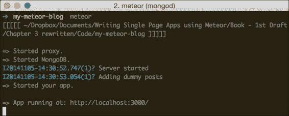
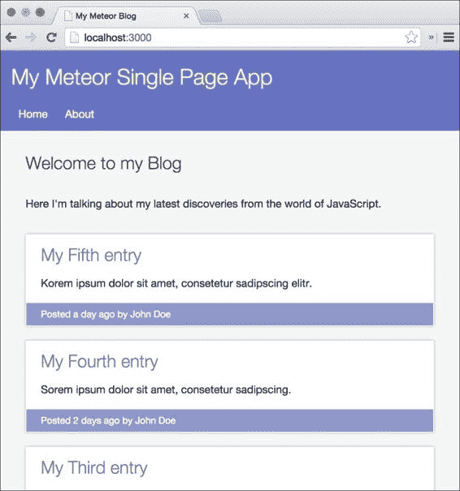

# 第三章：存储数据和处理集合

在上一章中，我们学习了如何构建模板并在其中显示数据。我们建立了我们应用程序的基本布局并在首页列出了一些后续示例。

在本章中，我们将持续向服务器上的数据库添加后续示例。我们将学习如何稍后在客户端访问这些数据，以及 Meteor 如何在客户端和服务器之间同步数据。

在本章中，我们将涵盖以下主题：

+   在 Meteor 中存储数据

+   创建集合

+   向集合中添加数据

+   从集合中查询数据

+   在集合中更新数据

+   “无处不在的数据库”意味着什么

+   服务器数据库与客户端数据库的区别

    ### 注意

    如果你直接跳到这一章并想跟随示例，请从以下任一位置下载上一章的代码示例：[`www.packtpub.com/books/content/support/17713`](https://www.packtpub.com/books/content/support/17713) 或 [`github.com/frozeman/book-building-single-page-web-apps-with-meteor/tree/chapter2`](https://github.com/frozeman/book-building-single-page-web-apps-with-meteor/tree/chapter2)。

    这些代码示例还将包含所有样式文件，因此我们无需担心在过程中添加 CSS 代码。

# Meteor 和数据库

Meteor 目前默认使用 MongoDB 在服务器上存储数据，尽管还计划有用于关系型数据库的驱动程序。

### 注意

如果你有冒险精神，可以尝试一下社区构建的 SQL 驱动程序，例如来自 [`atmospherejs.com/numtel/mysql`](https://atmospherejs.com/numtel/mysql) 的 `numtel:mysql` 包。

MongoDB 是一个**NoSQL** 数据库。这意味着它基于平面文档结构，而不是关系表结构。它对文档的处理方式使它成为 JavaScript 的理想选择，因为文档是用 BJSON 编写的，这与 JSON 格式非常相似。

Meteor 采用了一种*无处不在的数据库*的方法，这意味着我们有一个相同的 API 来在客户端和服务器上查询数据库。然而，当我们在客户端查询数据库时，我们只能访问我们*发布*给客户端的数据。

**MongoDB** 使用一种称为**集合**的数据结构，这在 SQL 数据库中相当于一个表。集合包含文档，每个文档都有自己的唯一 ID。这些文档是类似 JSON 的结构，可以包含具有值的属性，甚至是多维属性，如下所示：

```js
{
  "_id": "W7sBzpBbov48rR7jW",
  "myName": "My Document Name",
  "someProperty": 123456,
  "aNestedProperty": {
    "anotherOne": "With another string"
  }
}
```

这些集合用于在服务器上的 MongoDB 以及客户端的`minimongo`集合中存储数据，后者是一个模仿真实 MongoDB 行为的内存数据库。

### 注意

我们将在本章末尾更多地讨论`minimongo`。

MongoDB API 允许我们使用简单的基于 JSON 的查询语言从集合中获取文档。我们可以传递其他选项，只询问*特定字段*或*对返回的文档进行排序*。这些功能在客户端尤其强大，可以以各种方式显示数据。

# 设置集合

为了亲眼看到这一切，让我们通过创建我们的第一个集合来开始。

我们在`my-meteor-blog`文件夹内创建一个名为`collections.js`的文件。我们需要在根目录中创建它，这样它才能在客户端和服务器上都可用。现在让我们将以下代码行添加到`collections.js`文件中：

```js
Posts = new Mongo.Collection('posts');
```

这将使`Posts`变量在全球范围内可用，因为我们没有使用`var`关键字，这会将它们限制为该文件的范围。

`Mongo.Collection`是查询数据库的 API，它带有以下基本方法：

+   `insert`：此方法用于将文档插入数据库

+   `update`：此方法用于更新文档或它们的部分内容

+   `upsert`：此方法用于插入或更新文档或它们的部分内容

+   `remove`：此方法用于从数据库中删除文档

+   `find`：此方法用于查询数据库中的文档

+   `findOne`：此方法用于只返回第一个匹配的文档

# 添加帖子示例

要查询数据库中的帖子，我们需要添加一些帖子示例。这必须在服务器上完成，因为我们希望它们持久存在。要添加一个示例帖子，请执行以下步骤：

1.  我们在`my-meteor-blog/server`文件夹内创建一个名为`main.js`的文件。在这个文件中，我们将使用`Meteor.startup()`函数在服务器启动时执行代码。

1.  我们然后添加帖子示例，但只有在集合为空时。为了防止这种情况，我们每次重启服务器时都添加它们，如下所示：

    ```js
    Meteor.startup(function(){

      console.log('Server started');

      // #Storing Data -> Adding post examples
      if(Posts.find().count() === 0) {

        console.log('Adding dummy posts');
        var dummyPosts = [
          {
            title: 'My First entry',
            slug: 'my-first-entry',
            description: 'Lorem ipsum dolor sit amet.',
            text: 'Lorem ipsum dolor sit amet...',
            timeCreated: moment().subtract(7,'days').unix(),
            author: 'John Doe'
          },
          {
            title: 'My Second entry',
            slug: 'my-second-entry',
            description: 'Borem ipsum dolor sit.',
            text: 'Lorem ipsum dolor sit amet...',
            timeCreated: moment().subtract(5,'days').unix(),
            author: 'John Doe'
          },
          {
            title: 'My Third entry',
            slug: 'my-third-entry',
            description: 'Dorem ipsum dolor sit amet.',
            text: 'Lorem ipsum dolor sit amet...',
            timeCreated: moment().subtract(3,'days').unix(),
            author: 'John Doe'
          },
          {
            title: 'My Fourth entry',
            slug: 'my-fourth-entry',
            description: 'Sorem ipsum dolor sit amet.',
            text: 'Lorem ipsum dolor sit amet...',
            timeCreated: moment().subtract(2,'days').unix(),
            author: 'John Doe'
          },
          {
            title: 'My Fifth entry',
            slug: 'my-fifth-entry',
            description: 'Korem ipsum dolor sit amet.',
            text: 'Lorem ipsum dolor sit amet...',
            timeCreated: moment().subtract(1,'days').unix(),
            author: 'John Doe'
          }
        ];
        // we add the dummyPosts to our database
        _.each(dummyPosts, function(post){
          Posts.insert(post);
        });
      }
    });
    ```

现在，当我们检查终端时，我们应该看到与以下屏幕截图类似的某些内容：



### 注意

我们还可以使用 Mongo 控制台添加虚拟数据，而不是在代码中编写它们。

要使用 Mongo 控制台，我们首先使用`$ meteor`启动 Meteor 服务器，然后在第二个终端运行`$ meteor mongo`，这将我们带到 Mongo shell。

在这里，我们可以简单地使用 MongoDB 的语法添加文档：

```js
db.posts.insert({title: 'My First entry',
 slug: 'my-first-entry',
 description: 'Lorem ipsum dolor sit amet.',
 text: 'Lorem ipsum dolor sit amet...',
 timeCreated: 1405065868,
 author: 'John Doe'
}
)

```

# 查询集合

当我们保存我们的更改时，服务器确实重新启动了。在此阶段，Meteor 在我们的数据库中添加了五个帖子示例。

### 注意

如果服务器没有重新启动，这意味着我们在代码中的某个地方犯了语法错误。当我们手动重新加载浏览器或检查终端时，我们会看到 Meteor 给出的错误，然后我们可以进行修复。

如果我们数据库中出了什么问题，我们总是可以使用终端中的`$ meteor reset`命令来重置它。

我们只需在浏览器中打开控制台并输入以下命令即可查看这些帖子：

```js
Posts.find().fetch();

```

这将返回一个包含五个项目的数组，每个项目都是我们的示例帖子之一。

为了在我们前端页面上列出这些新插入的帖子，我们需要在 `home.js` 文件中替换我们 `postsList` 帮助器的內容，如下面的代码行所示：

```js
Template.home.helpers({
  postsList: function(){
    return Posts.find({}, {sort: {timeCreated: -1}});
  }
});
```

正如我们所看到的，我们直接在帮助器中返回了集合游标。这个返回值然后传递到我们的 `home` 模板中的 `{{#each}}` 块帮助器，该帮助器将在渲染 `postInList` 模板时遍历每个帖子。

### 注意

请注意，`Posts.find()` 返回一个游标，在 `{{#each}}` 块帮助器中使用时效率更高，而 `Posts.find().fetch()` 将返回一个包含文档对象的数组。使用 `fetch()`，我们可以在返回之前操纵文档。

我们将一个选项对象作为 `find()` 函数的第二个参数。我们传递的选项将根据 `timeCreated` 进行排序，并使用 `-1`。`-1` 的值意味着它将按降序排序（`1` 表示升序）。

现在，当我们查看我们的浏览器时，我们会看到我们的五篇帖子全部列出，如下面的截图所示：



# 更新集合

现在我们已经知道如何插入和获取数据，让我们来看看如何在我们的数据库中更新数据。

正如我们之前所见，我们可以使用浏览器的光标来玩转数据库。对于我们接下来的例子，我们将只使用控制台来了解当我们在数据更改时，Meteor 如何反应性地改变模板。

为了能够在我们的数据库中编辑一篇帖子，我们首先需要知道其条目的 `_id` 字段。为了找出这个，我们需要输入以下命令：

```js
Posts.find().fetch();

```

这将返回 `Posts` 集合中的所有文档，因为我们没有传递任何特定的查询对象。

在返回的数组中，我们需要查看最后一个项目，标题为 **My Fifth entry** 的项目，并使用 *Cmd* + *C*（或者如果我们在 Windows 或 Linux 上，使用 *Ctrl* + *C*）将 `_id` 字段复制到剪贴板。

### 注意

我们也可以简单地使用 `Posts.findOne()`，这将给我们找到的第一个文档。

现在我们已经有了 `_id`，我们可以通过输入以下命令简单地更新我们第五篇帖子的标题：

```js
Posts.update('theCopied_Id', {$set: {title: 'Wow the title changed!'}});

```

一旦我们执行这个命令，我们就会注意到第五篇帖子的标题已经变成了我们新的标题，如果我们现在重新加载页面，我们会看到标题保持不变。这意味着更改已经持久地保存到了数据库中。

为了看到 Meteor 的响应性跨客户端，打开另一个浏览器窗口，导航到 `http://localhost:3000`。现在我们再次通过执行以下命令更改我们的标题，我们会看到所有客户端实时更新：

```js
Posts.update('theCopied_Id', {$set: {title: 'Changed the title again'}});

```

# 数据库无处不在

在 Meteor 中，我们可以使用浏览器的控制台来更新数据，这意味着我们可以从客户端更新数据库。这之所以有效，是因为 Meteor 会自动将这些更改同步到服务器，并相应地更新数据库。

这之所以发生，是因为我们的项目默认添加了 `autopublish` 和 `insecure` 核心包。`autopublish` 包会自动将所有文档发布给每个客户端，而 `insecure` 包允许每个客户端通过其 `_id` 字段更新数据库记录。显然，这对于原型设计来说很好，但对于生产环境来说是不切实际的，因为每个客户端都可以操作我们的数据库。

如果我们移除了 `insecure` 包，我们将需要添加“允许和拒绝”规则来确定客户端可以更新哪些内容以及不可以更新哪些内容；否则，所有更新都将被拒绝。我们将在后面的章节中查看这些规则的设置，但现在这个包对我们很有用，因为我们可以立即操作数据库。

在下一章中，我们将了解如何手动将某些文档发布给客户端。我们将从移除 `autopublish` 包开始。

# 客户端与服务器集合之间的差异

Meteor 采用了一种*无处不在的数据库*方法。这意味着它为客户端和服务器端提供了相同的 API。数据流动是通过发布订阅模型来控制的。

服务器上运行着真正的 MongoDB 数据库，它负责持久化存储数据。在客户端，Meteor 包含一个名为 `minimongo` 的包，它是一个纯内存数据库，模仿了 MongoDB 的大部分查询和更新功能。

每次客户端连接到其 Meteor 服务器时，Meteor 都会下载客户端订阅的文档并将它们存储在其本地的 `minimongo` 数据库中。从这里，它们可以在模板中显示，或者由函数处理。

当客户端更新一个文档时，Meteor 会将其同步回服务器，在那里它将穿过任何允许/拒绝函数，然后被永久存储在数据库中。这也适用于反向操作；当服务器端数据库中的文档发生变化时，它将自动同步到所有订阅它的客户端，使每个连接的客户端保持最新。

# 概要

在本章中，我们学习了如何在 Meteor 的 MongoDB 数据库中持久化存储数据。我们还看到了如何查询集合和更新文档。我们理解了“无处不在的数据库”方法意味着什么，以及 Meteor 如何使每个客户端保持最新。

为了更深入地了解 MongoDB 以及如何查询和更新集合，请查看以下资源：

+   [Meteor 完整栈数据库驱动](https://www.meteor.com/full-stack-db-drivers)

+   [Meteor 迷你数据库](https://www.meteor.com/mini-databases)

+   [Meteor 文档：集合](https://docs.meteor.com/#/full/collections)

+   [MongoDB 手册：CRUD 简介](http://docs.mongodb.org/manual/core/crud-introduction/)

+   [MongoDB 手册：查询操作符](http://docs.mongodb.org/manual/reference/operator/query/)

你可以在这个章节找到代码示例，网址为[`www.packtpub.com/books/content/support/17713`](https://www.packtpub.com/books/content/support/17713)，或者在 GitHub 上查看[`github.com/frozeman/book-building-single-page-web-apps-with-meteor/tree/chapter3`](https://github.com/frozeman/book-building-single-page-web-apps-with-meteor/tree/chapter3)。

在下一章中，我们将了解如何使用发布和订阅控制数据流，从而只将必要的文档发送给客户端。
