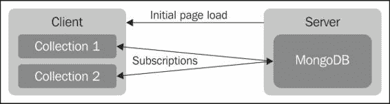
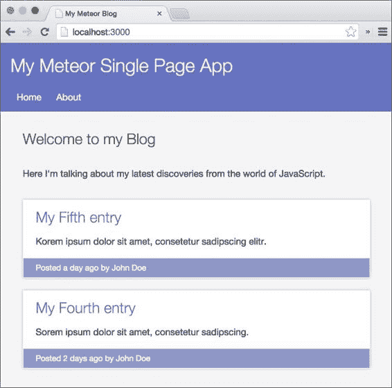
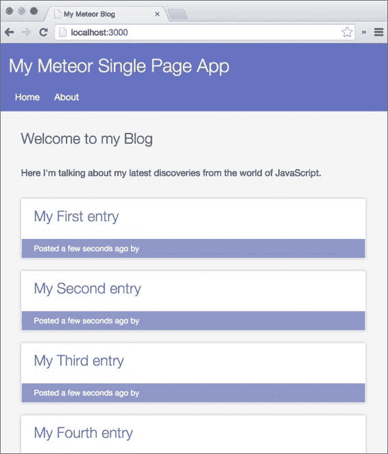
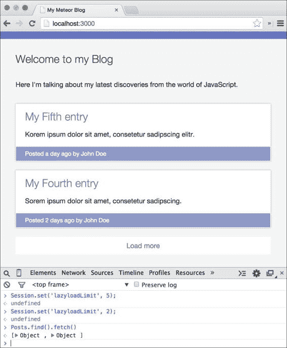

# 第四章：控制数据流

在前一章节中，我们学习了如何将数据持久化地存储在我们的数据库中。在本章中，我们将了解如何告诉 Meteor 应该向客户端发送什么数据。

到目前为止，所有这些都是因为使用了`autopublish`包而神奇地工作的，该包将与每个客户端同步所有数据。现在，我们将手动控制这个流程，只向客户端发送必要的数据。

在本章中，我们将介绍以下主题：

+   与服务器同步数据

+   向客户端发布数据

+   发布部分集合

+   只发布文档的特定字段

+   延迟加载更多帖子

    ### 注意

    如果你想要直接进入章节并跟随示例，可以从书籍的网页 [`www.packtpub.com/books/content/support/17713`](https://www.packtpub.com/books/content/support/17713) 或者从 GitHub 仓库 [`github.com/frozeman/book-building-single-page-web-apps-with-meteor/tree/chapter3`](https://github.com/frozeman/book-building-single-page-web-apps-with-meteor/tree/chapter3) 下载前一章节的代码示例。

    这些代码示例还将包含所有样式文件，因此我们不需要在过程中担心添加 CSS 代码。

# 数据同步 – 当前的 Web 与新的 Web

在当前的 Web 中，大多数页面要么是托管在服务器上的静态文件，要么是由服务器在请求时生成的动态页面。这对于大多数服务器端渲染的网站来说是真的，例如用 PHP、Rails 或 Django 编写的网站。这两种技术除了被客户端显示外不需要任何努力；因此，它们被称为*薄*客户端。

在现代网络应用程序中，浏览器的概念已经从薄客户端转移到*厚*客户端。这意味着网站的大部分逻辑都存在于客户端，并且客户端请求它需要的数据。

目前，这主要是通过调用 API 服务器实现的。这个 API 服务器然后返回数据，通常以 JSON 格式返回，给客户端一个轻松处理和使用数据的方式。

大多数现代网站都是薄客户端和厚客户端的混合体。普通页面是服务器端渲染的，只有如聊天框或新闻提要等功能通过 API 调用进行更新。

Meteor，然而，建立在这样一个理念上，即使用所有客户端的计算能力比使用一个单一服务器的计算能力要好。一个纯厚客户端或者一个单页应用包含了一个网站前端的所有逻辑，在初始页面加载时发送下来。

服务器随后仅仅作为数据源，只向客户端发送数据。这可以通过连接到 API 并利用 AJAX 调用实现，或者像 Meteor 一样，使用一种名为**发布/订阅**的模型。在这个模型中，服务器提供一系列发布物，每个客户端决定它想订阅哪个数据集。

与 AJAX 调用相比，开发者无需处理任何下载或上传逻辑。Meteor 客户端在订阅特定数据集后自动后台同步所有数据。当服务器上的数据发生变化时，服务器将更新后的文档发送给客户端，反之亦然，如下面的图表所示：



### 注意

如果这听起来确实不安全，请放心，我们可以设置规则，在服务器端过滤更改。我们将在第八章，*使用允许和拒绝规则进行安全设置*中查看这些可能性。

# 移除 autopublish 包

为了使用 Meteor 的发布/订阅，我们需要移除`autopublish`包，这个包是我们项目默认添加的。

这个包适用于快速原型设计，但在生产环境中不可行，因为我们的数据库中的所有数据都将同步到所有客户端。这不仅不安全，而且还会减慢数据加载过程。

我们只需在我们`my-meteor-blog`文件夹内的终端上运行以下命令：

```js
$ meteor remove autopublish

```

现在我们可以再次运行`meteor`来启动我们的服务器。当我们检查网站时，我们会发现我们上一章的所有帖子都消失了。

然而，它们实际上并没有消失。当前的服务器只是还没有发布任何内容，客户端也只是没有订阅任何内容；因此，我们看不到它们。

# 发布数据

为了在客户端再次访问帖子，我们需要告诉服务器将其发布给订阅的客户端。

为此，我们将在`my-meteor-blog/server`文件夹中创建一个名为`publications.js`的文件，并添加以下代码行：

```js
Meteor.publish('all-posts', function () {
  return Posts.find();
});
```

`Meteor.publish`函数将创建一个名为`all-posts`的发布，并返回一个包含`Post`集合中所有帖子的游标。

现在，我们只需告诉客户端订阅这个发布，我们就会再次看到我们的帖子。

我们在`my-meteor-blog/client`文件夹中创建一个名为`subscriptions.js`的文件，内容如下：

```js
Meteor.subscribe('all-posts');
```

现在，当我们检查我们的网站时，我们可以看到我们的博客文章已经重新出现。

这是因为当执行`subsciptions.js`文件时，客户端会订阅`all-posts`发布，这发生在页面完全加载之前，因为 Meteor 自动将`subsciptions.js`文件添加到文档的头部为我们。

这意味着 Meteor 服务器首先发送网站，然后 JavaScript 在客户端构建 HTML；随后，所有订阅都会同步，填充客户端的集合，并且模板引擎**Blaze**能够显示帖子。

现在我们已经恢复了我们的帖子，让我们看看我们如何告诉 Meteor 只发送集合中的一部分文档。

# 只发布数据的一部分

为了使我们的首页更具未来感，我们需要限制在上面显示的文章数量，因为随着时间的推移，我们可能会添加很多文章。

为此，我们将创建一个名为`limited-posts`的新发布，其中我们可以向文章的`find()`函数传递一个`limit`选项，并将其添加到我们的`publications.js`文件中，如下所示：

```js
Meteor.publish('limited-posts', function () {
  return Posts.find({}, {
    limit: 2,
    sort: {timeCreated: -1}
  });
});
```

我们添加一个`sort`选项，通过它按`timeCreated`字段降序排列文章。这是必要的，以确保我们获取最新的文章并然后限制输出。如果我们只在客户端上对数据进行排序，可能会发生我们省略了较新的文章，因为服务器发布只会发送它找到的第一个文档，不管它们是否是最新的。

现在我们只需去到`subscriptions.js`文件，将订阅更改为以下代码行：

```js
Meteor.subscribe('limited-posts');
```

如果我们现在查看我们的浏览器，我们会看到只有最后两篇文章出现在我们的首页上，因为我们只订阅了两个，如下面的屏幕截图所示：



### 注意

我们必须意识到，如果我们保留旧订阅的代码并与新订阅的代码并列，我们将同时订阅两个。这意味着 Meteor 合并了两个订阅，因此在我们客户端集合中保留了所有订阅的文档。

在添加新订阅之前，我们必须注释掉旧的订阅或删除它。

# 发布特定字段

为了优化发布，我们还可以确定要从文档中发布哪些字段。例如，我们只要求`title`和`text`属性，而不是其他所有属性。

这样做可以加快我们订阅的同步速度，因为我们不需要整个文章，只需要在首页上列出文章时必要的数据和简短描述。

让我们在`publications.js`文件中添加另一个发布：

```js
Meteor.publish('specificfields-posts', function () {
  return Posts.find({}, {
    fields: {
      title: 1
    }
  });
});
```

由于这只是一个示例，我们传递一个空对象作为一个查询来查找所有文档，作为`find()`的第二个参数，我们传递一个包含`fields`对象的选项对象。

我们给每个字段一个值为`1`的属性，该属性将被包含在返回的文档中。如果我们想通过排除字段来工作，我们可以使用字段名称并将值设置为`0`。然而，我们不能同时包含和排除字段，因此我们需要根据文档大小选择哪个更适合。

现在我们可以在`subscriptions.js`文件中简单地将订阅更改为以下代码行：

```js
Meteor.subscribe('specificfields-posts');
```

现在，当我们打开浏览器时，它将向我们展示一个文章列表。只有标题存在，而描述、时间和作者字段为空：



# 懒加载文章

既然我们已经浏览了这些简单的示例，那么现在让我们将它们结合起来，并为首页上的文章列表添加一个优美的懒加载功能。

懒加载是一种技术，只有在用户需要或滚动到末尾时才加载附加数据。这可以用来增加页面加载，因为要加载的数据是有限的。为此，让我们执行以下步骤：

1.  我们需要向首页文章列表的底部添加一个懒加载按钮。我们打开我们的`home.html`文件，在`home`模板的末尾，在我们`{{#each postsList}}`块助手下面添加以下按钮：

    ```js
    <button class="lazyload">Load more</button>
    ```

1.  接下来，我们将向我们的`publications.js`文件中添加一个发布，以发送灵活数量的文章，如下所示：

    ```js
    Meteor.publish('lazyload-posts', function (limit) {
      return Posts.find({}, {
        limit: limit,
        fields: {
          text: 0
        },
        sort: {timeCreated: -1}
      });
    });
    ```

基本上，这是我们之前学到的内容的组合。

+   我们使用了`limit`选项，但不是设置一个固定的数字，而是使用了`limit`参数，我们稍后将其传递给这个发布函数。

+   以前，我们使用了`fields`选项并排除了`text`字段。

+   我们可以只包含`fields`来获得相同的结果。这将更安全，因为它确保我们在文档扩展时不会获取任何额外的字段：

    ```js
    fields: {
      title: 1,
      slug: 1,
      timeCreated: 1,
      description: 1,
      author: 1
    }
    ```

+   我们对输出进行了排序，以确保我们总是返回最新的文章。

现在我们已经设置了我们的发布，让我们添加一个订阅，这样我们就可以接收其数据。

### 注意

请注意，我们需要先删除任何其他订阅，这样我们就不会订阅任何其他发布。

为此，我们需要利用 Meteor 的`session`对象。这个对象可以在客户端用来设置反应性的变量。这意味着每次我们改变这个会话变量时，它都会再次运行使用它的每个函数。在下面的示例中，我们将使用会话来在点击懒加载按钮时增加文章列表的数量：

1.  首先，在`subscription.js`文件中，我们添加以下代码行：

    ```js
    Session.setDefault('lazyloadLimit', 2);
    Tracker.autorun(function(){
    Meteor.subscribe('lazyload-posts', Session.get('lazyloadLimit'));
    });
    ```

1.  然后我们将`lazyloadLimit`会话变量设置为`2`，这将是我们前端页面最初显示的文章数量。

1.  接下来，我们创建一个`Tracker.autorun()`函数。这个函数将在开始时运行，后来在我们改变`lazyloadLimit`会话变量到另一个值时随时运行。

1.  在这个函数内部，我们订阅了`lazyload-posts`，将`lazyloadLimit`值作为第二个参数。这样，每次会话变量改变时，我们都用一个新的值改变我们的订阅。

1.  现在，我们只需要通过点击懒加载按钮来增加会话值，订阅就会改变，发送给我们额外的文章。为此，我们在`home.js`文件的末尾添加以下代码行：

    ```js
    Template.home.events({
      'click button.lazyload': function(e, template){
      var currentLimit = Session.get('lazyloadLimit');

      Session.set('lazyloadLimit', currentLimit + 2);
      }
    });
    ```

    这段代码将为懒加载按钮附加一个`click`事件。每次我们点击这个按钮时，我们都会获取`lazyloadLimit`会话，并增加两倍。

1.  当我们检查浏览器时，我们应该能够点击文章列表底部的懒加载按钮，它应该再添加两篇文章。每次我们点击按钮时，都应该发生这种情况，直到我们达到五个示例文章。

当我们只有五篇文章时，这看起来并不太有意义，但当文章超过 50 篇时，将最初显示的文章限制为 10 篇将显著提高页面加载时间。

然后我们只需要将会话的默认值更改为 10 并增加 10，就可以实现一个很好的懒加载效果。

# 切换订阅

现在我们已经有了很好的懒加载逻辑，让我们来看看这里的底层发生了什么。

我们之前创建的`.autorun()`函数将在代码首次执行时运行，订阅`lazyload-posts`发布。Meteor 然后发送`Posts`集合的最初两个文档，因为我们的第一个`limit`值是`2`。

下次我们更改`lazyloadLimit`会话时，它通过更改发布函数中的限制值来更改订阅。

Meteor 然后在后台检查我们客户端数据库中存在的文档，并请求下载缺失的文档。

当我们减少会话值时，这个方法也会起作用。Meteor 会删除与当前订阅/订阅不匹配的文档。

因此，我们可以尝试这样做；我们打开浏览器控制台，将会话限制设置为`5`：

```js
Session.set('lazyloadLimit', 5);
```

这将立即在我们的列表中显示所有五个示例文章。现在如果我们将其设置为更小的值，我们将看到它们是如何被移除的：

```js
Session.set('lazyloadLimit', 2);
```

为了确保它们已经消失，我们可以查询我们本地数据库，如下所示：

```js
Posts.find().fetch();
```

这将返回一个包含两个项目的数组，显示 Meteor 已经删除了我们不再订阅的文章，如下图所示：



# 关于数据发布的一些说明

```js
Posts collection changes:
```

```js
Meteor.publish('comments', function (postId) {
    var post = Posts.find({_id: postId});

    return Comments.find({_id: {$in: post.comments}});
});
```

为了解决这个问题，你可以将文章和评论分开发布并在客户端连接它们，或者使用第三方包，如在[`atmospherejs.com/reywood/publish-composite`](https://atmospherejs.com/reywood/publish-composite)提供的允许有反应性发布的`reywood:publish-composite`包。

### 注意

请注意，`Meteor.publish()`函数重新运行的唯一情况是当前用户发生变化，使得`this.userId`在函数中可访问。

# 总结

在本章中，我们创建了几篇发布文章并订阅了它们。我们使用了`fields`和`limit`选项来修改发布的文档数量，并为博客首页实现了一个简单的懒加载逻辑。

为了更深入地了解我们学到的内容，我们可以查看第三章, *存储数据和处理集合*。以下 Meteor 文档将详细介绍我们可以在集合`find()`函数中使用的选项：

+   [`www.meteor.com/livequery`](https://www.meteor.com/livequery)

+   [`www.meteor.com/ddp`](https://www.meteor.com/ddp)

+   [`docs.meteor.com/#/full/publishandsubscribe`](https://docs.meteor.com/#/full/publishandsubscribe)

+   关于 Meteor 的集合，可以参考[`docs.meteor.com/#/full/collections`](https://docs.meteor.com/#/full/collections)。

你可以在这个章节代码示例的[`www.packtpub.com/books/content/support/17713`](https://www.packtpub.com/books/content/support/17713)找到，或者在 GitHub 上找到[`github.com/frozeman/book-building-single-page-web-apps-with-meteor/tree/chapter4`](https://github.com/frozeman/book-building-single-page-web-apps-with-meteor/tree/chapter4)。

在下一章节，我们将给我们的应用添加一个真正应用的元素——不同的页面和路由。
