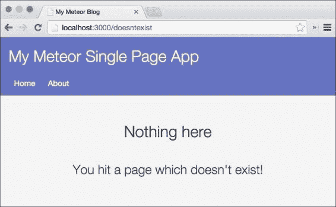
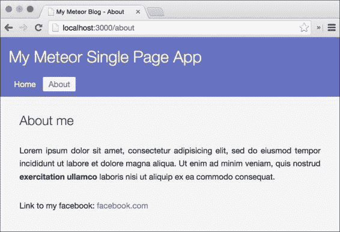
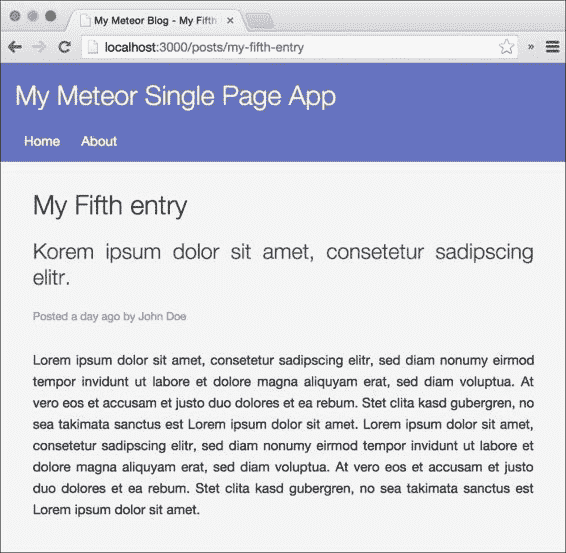
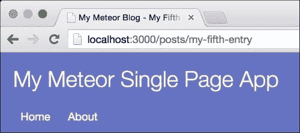

# 第五章：使用路由使我们的应用具有灵活性

既然我们已经到了这一章节，我们应该已经对 Meteor 的模板系统有一个很好的理解，并且了解服务器与客户端之间数据同步的工作原理。在消化了这些知识后，让我们回到有趣的部分，把我们的博客变成一个具有不同页面的真正网站。

你可能会问，“在单页应用中页面做什么？” “单页”这个术语有点令人困惑，因为它并不意味着我们的应用只由一个页面组成。它更是一个从当前做事方式衍生出来的术语，因为只有一页是从服务器发送下来的。在那之后，所有的路由和分页都在浏览器中完成。再也不需要从服务器本身请求任何页面了。在这里更好的术语应该是“客户端 web 应用程序”，尽管**单页**是目前使用的名称。

在本章中，我们将涵盖以下主题：

+   为我们的静态和动态页面编写路由。

+   根据路由更改订阅

+   为每个页面更改网站的标题。

那么，我们不要浪费时间，先添加`iron:router`包。

### 注意

如果你直接跳到这一章节并且想跟随示例，从以下网址下载前一章节的代码示例：书的网页[`www.packtpub.com/books/content/support/17713`](https://www.packtpub.com/books/content/support/17713) 或 GitHub 仓库[`github.com/frozeman/book-building-single-page-web-apps-with-meteor/tree/chapter4`](https://github.com/frozeman/book-building-single-page-web-apps-with-meteor/tree/chapter4)。

这些代码示例还将包含所有样式文件，因此我们不必担心在过程中添加 CSS 代码。

# 添加 iron:router 包

路由是应用中特定页面的 URL。在服务器端渲染的应用中，路由要么由服务器的/框架配置定义，要么由服务器上的文件夹结构定义。

在客户端应用中，路由仅仅是应用将用来确定要渲染哪些页面的路径。

客户端内要执行的步骤如下：

1.  网站被发送到客户端。

1.  JavaScript 文件（或文件）被加载并解析。

1.  路由器代码将检查当前它是哪个 URL，并运行正确的路由函数，然后渲染正确的模板。

    ### 提示

    为了在我们的应用中使用路由，我们将使用`iron:router`包，这是一个为 Meteor 编写的路由器，它使得设置路由和将它们与订阅结合变得容易。

1.  要添加包，我们取消任何正在运行的 Meteor 实例，前往我们的`my-meteor-blog`文件夹，并输入以下命令：

    ```js
    $ meteor add iron:router

    ```

1.  如果我们完成了这些，我们可以通过运行`$ meteor`命令再次启动 Meteor。

当我们回到浏览器的控制台时，我们会看到一个错误，说：`Error: Oh no! No route found for path: "/"`。不用担心；我们将在下一节处理这个问题。

# 设置路由器

为了使用路由器，我们需要对其进行设置。为了保持我们的代码组织有序，我们将在`my-meteor-blog`文件夹的根目录下创建一个名为`routes.js`的文件，并输入以下代码：

```js
Router.configure({
    layoutTemplate: 'layout'
});
```

路由配置允许您定义以下默认模板：

| ` | layoutTemplate` | 布局模板将作为主包装器。在这里，子模板将在`{{> yield}}`占位符中渲染，该占位符必须放在模板的某个位置。 |
| --- | --- | --- |
| ` | notFoundTemplate` | 如果当前 URL 没有定义路由，将渲染此模板。 |
| ` | loadingTemplate` | 当当前路由的订阅正在加载时，将显示此模板。 |

对于我们的博客，我们现在只需定义`layoutTemplate`属性。

执行以下步骤以设置路由器：

1.  要创建我们的第一个路由，我们需要在`route.js`文件中添加以下代码行：

    ```js
    Router.map(function() {

        this.route('Home', {
            path: '/',
            template: 'home'
        });

    });
    ```

    ### 注意

    您还可以将`Home`路由命名为`home`（小写）。然后我们可以省略手动模板定义，因为`iron:router`将自动查找名为`home`的模板。

    为了简单起见，我们手动定义模板，以保持全书中的所有路由一致。

1.  如果我们现在保存这个文件并回到浏览器，我们将看到`layout`模板被渲染两次。这并不是因为`iron:router`默认将`layoutTemplate`添加到我们应用程序的正文中，而是因为我们手动添加了它，以及在`index.html`中使用了`{{> layout}}`，所以它被渲染了两次。

为了防止`layout`模板的重复出现，我们需要从`index.html`文件中的`<body>`标签中删除`{{> layout}}`助手。

当我们检查浏览器时，现在只会看到`layout`模板被渲染一次。

# 切换到布局模板

尽管我们通过`template: home`向我们的`Home`路由传递了一个模板，但我们并没有动态地渲染这个模板；我们只是显示了带有其*硬编码*子模板的布局模板。

为了改变这一点，我们需要将布局模板内的`{{> home}}`包含助手替换为`{{> yield}}`。

`{{> yield}}`助手是`iron:router`提供的占位符助手，在此处渲染路由模板。

完成此操作后，当我们检查浏览器时，我们不应该看到任何变化，因为我们仍然在渲染`home`模板，但这次是动态的。然后我们按照以下步骤进行操作：

1.  为了验证这一点，我们将向我们的应用程序添加一个未找到的模板，通过在`layout.html`文件中的布局模板之后添加以下模板：

    ```js
    <template name="notFound">
      <div class="center">
        <h1>Nothing here</h1><br>
        <h2>You hit a page which doesn't exist!</h2>
      </div>
    </template>
    ```

1.  现在我们需要向`route.js`中的`Router.configure()`函数添加`notFoundTemplate`属性：

    ```js
    Router.configure({
        layoutTemplate: 'layout',
        notFoundTemplate: 'notFound'
    });
    ```

现在，当我们导航到`http://localhost:3000/doesntexist`时，我们将看到`notFound`模板被渲染，而不是我们的`home`模板：



如果我们点击主菜单中的**首页**链接，我们会回到我们的首页，因为此链接导航到"``/``"。我们已经成功添加了我们的第一个路由。现在让我们继续创建第二个路由。

# 添加另一个路由

拥有一个首页并不意味着是一个真正的网站。让我们添加一个到我们的**关于**页面的链接，该页面自从第二章 *构建 HTML 模板*以来就在我们的抽屉里。

要这样做，只需复制`Home`路由，并将值更改为创建一个`About`路由，如下所示：

```js
Router.map(function() {

    this.route('Home', {
        path: '/',
        template: 'home'
    });
    this.route('About', {
        path: '/about',
        template: 'about'
    });
});
```

完成！

现在，当我们回到浏览器时，我们可以点击主菜单中的两个链接来切换我们的**首页**和**关于**页面，甚至输入`http://localhost:3000/about`也会直接带我们到相应的页面，如下截图所示：



# 将帖子订阅移动到首页路由

为了为每个页面加载正确的数据，我们需要在路由中拥有订阅，而不是将其保存在单独的`subscriptions.js`文件中。

`iron:router`有一个特殊的函数叫做`subscriptions()`，这正是我们需要的。使用这个函数，我们可以反应性地更新特定路由的订阅。

为了看到它的实际应用，将`subscriptions()`函数添加到我们的`Home`路由中：

```js
this.route('Home', {
    path: '/',
    template: 'home',
    subscriptions
: function(){
 return Meteor.subscribe("lazyload-posts", Session.get('lazyloadLimit'));
 }
});
```

`subscriptions.js`文件中的**Session.setDefault('lazyloadLimit', 2)**行需要在`routes.js`文件的开头，并在`Router.configure()`函数之前：

```js
if(Meteor.isClient) {
    Session.setDefault('lazyloadLimit', 2);
}
```

这必须包裹在`if(Meteor.isClient){}`条件内，因为会话对象仅在客户端可用。

`subscriptions()`函数和之前使用的`Tracker.autorun()`函数一样是*响应式的*。这意味着当`lazyloadLimit`会话变量发生变化时，它会重新运行并更改订阅。

为了看到它的工作情况，我们需要删除`my-meteor-blog/client/subscriptions.js`文件，这样我们就不会有两个订阅相同发布物的点。

当我们现在检查浏览器并刷新页面时，我们会看到`home`模板仍然显示所有示例帖子。点击懒加载按钮会增加列出的帖子数量，但这次一切都是在我们的反应式`subscriptions()`函数中完成的。

### 注意

`iron:router`带有更多的钩子，您可以在附录中找到简短的列表。

为了完成我们的路由，我们只需要添加帖子路由，这样我们就可以点击一个帖子并详细阅读。

# 设置帖子路由

为了能够显示一个完整的帖子页面，我们需要创建一个帖子模板，当用户点击一个帖子时可以加载。

我们在`my-meteor-blog/client/templates`文件夹中创建一个名为`post.html`的文件，并使用以下模板代码：

```js
<template name="post">
  <h1>{{title}}</h1>
  <h2>{{description}}</h2>

  <small>
    Posted {{formatTime timeCreated "fromNow"}} by {{author}}
  </small>

  <div class="postContent">
    {{#markdown}}
{{text}}
    {{/markdown}}
  </div>
</template>
```

这个简单的模板显示了博客文章的所有信息，甚至重用了我们在这本书中早些时候从`template-helper.js`文件创建的`{{formatTime}}`助手。我们用这个助手来格式化文章创建的时间。

我们暂时还看不到这个模板，因为我们必须先为这个页面创建发布和路由。

## 创建一个单篇博文发布

为了在这个模板中显示完整文章的数据，我们需要创建另一个发布，该发布将完整的文章文档发送到客户端。

为了实现这一点，我们打开`my-meteor-blog/server/publication.js`文件，并添加以下发布内容：

```js
Meteor.publish("single-post", function(slug) {
  return Posts.find({slug: slug});
});
```

这里使用的`slug`参数将在稍后的订阅方法中提供，以便我们可以使用`slug`参数来引用正确的文章。

### 注意

缩略词是文档标题，以一种适合 URL 使用的方式格式化。缩略词比简单地在 URL 后附加文档 ID 更好，因为它们可读性强，易于访问者理解，也是良好 SEO 的重要组成部分。

为了使用缩略词，每个缩略词都必须是唯一的。我们在创建文章时会照顾到这一点。

假设我们传递了正确的斜杠，比如`my-first-entry`，这个发布将发送包含此斜杠的文章。

## 添加博文路由

为了让这个路由工作，它必须是动态的，因为每个链接的 URL 对于每篇文章都必须是不同的。

我们还将渲染一个加载模板，直到文章被加载。首先，我们在`my-meteor-blog/client/templates/layout.html`中添加以下模板：

```js
<template name="loading">
  <div class="center">
    <h1>Loading</h1>
  </div>
</template>
```

此外，我们还需要将此模板作为默认加载模板添加到`routes.js`中的`Router.configure()`调用中：

```js
Router.configure({
    layoutTemplate: 'layout',
    notFoundTemplate: 'notFound',
    loadingTemplate: 'loading',
    ...
```

然后，我们将以下代码行添加到我们的`Router.map()`函数中，以创建一个动态路由：

```js
this.route('Post', {
    path: '/posts/:slug',
    template: 'post',

    waitOn: function() {
        return Meteor.subscribe('single-post', this.params.slug);
    },
    data: function() {
        return Posts.findOne({slug: this.params.slug});
    }
});
```

`'/posts/:slug'`路径是一个动态路由，其中`:slug`可以是任何内容，并将传递给路由函数作为`this.params.slug`。这样我们只需将给定的 slug 传递给`single-post`订阅，并检索与这个 slug 匹配的文章的正确文档。

`waitOn()`函数的工作方式类似于`subscriptions()`函数，不过它会自动渲染我们在`Router.configure()`中设置的`loadingTemplate`，直到订阅准备好。

这个路由的`data()`函数将设置`post`模板的数据上下文。我们基本上在我们的本地数据库中查找包含来自 URL 的给定 slug 的文章。

### 注意

`Posts`集合的`findOne()`方法与`find()`方法类似，但只返回找到的第一个结果作为 JavaScript 对象。

让我们总结一下这里发生的事情：

1.  路由被调用（通过点击链接或页面重新加载）。

1.  然后`waitOn()`函数将订阅由给定的`slug`参数标识的正确文章，该参数是 URL 的一部分。

1.  由于`waitOn()`函数，`loadingTemplate`将在订阅准备好之前渲染。由于这在我们的本地机器上会非常快，所以我们可能根本看不到加载模板。

1.  一旦订阅同步，模板就会渲染。

1.  然后`data()`函数将重新运行，设置模板的数据上下文为当前文章文档。

现在发布和路由都准备好了，我们只需导航到`http://localhost:3000/posts/my-first-entry`，我们应该看到`post`模板出现。

## 文章链接

虽然我们已经设置了路由和订阅，但我们看不到它工作，因为我们需要正确的文章链接。由于我们之前添加的每个示例文章都包含一个`slug`属性，所以我们只需将它们添加到`postInList`模板中的文章链接。打开`my-meteor-blog/client/templates/postInList.html`文件，按照以下方式更改链接：

```js
<h2><a href="posts/{{slug}}">{{title}}</a></h2>
```

最后，当我们打开浏览器并点击博客文章的标题时，我们会被重定向到一个显示完整文章条目的页面，如下面的屏幕截图所示：



# 更改网站标题

如今我们的文章路由已经运行，我们只缺少为每个页面显示正确的标题。

遗憾的是，`<head></head>`在 Meteor 中不是一个响应式模板，我们本可以让 Meteor 自动更改标题和元标签。

### 注

计划将`head`标签变成一个响应式模板，但可能在 1.0 版本之前不会实现。

为了更改文档标题，我们需要找到一种基于当前路由来更改它的不同方法。

幸运的是，`iron:router`有一个`onAfterAction()`函数，也可以在`Router.configure()`函数中用于每个路由之前运行。在这个函数中，我们有权访问当前路由的数据上下文，所以我们可以简单地使用原生 JavaScript 设置标题：

```js
Router.configure({
    layoutTemplate: 'layout',
    notFoundTemplate: 'notFound',

    onAfterAction: function() {
 var data = Posts.findOne({slug: this.params.slug});

 if(_.isObject(data) && !_.isArray(data))
 document.title = 'My Meteor Blog - '+ data.title;
 else
 document.title = 'My Meteor Blog - '+ this.route.getName();
 }
});
```

使用**Posts.findOne({slug: this.params.slug})**，我们获取当前路由的文章。然后我们检查它是否是一个对象；如果是，我们将文章标题添加到`title`元标签。否则，我们只取路由名称。

在`Router.configure()`中这样做将为每个路由调用**onAfterAction**。

现在如果我们看看我们浏览器的标签页，我们会发现当我们浏览网站时，我们网站的标题会发生变化：



### 提示

如果我们想要让我们的博客更酷，我们可以添加`mrt:iron-router-progress`包。这将在切换路由时在页面的顶部添加一个进度条。我们只需从我们的应用程序文件夹中运行以下命令：

```js
$ meteor add mrt:iron-router-progress

```

# 摘要

就这样！现在我们的应用程序是一个功能完整的网站，有不同的页面和 URL。

在本章中，我们学习了如何设置静态和动态路由。我们将我们的订阅移到了路由中，这样它们就可以根据路由的需要自动更改。我们还使用了 slugs 来订阅正确的文章，并在`post`模板中显示它们。最后，我们更改了网站的标题，使其与当前路由相匹配。

要了解更多关于`iron:router`的信息，请查看其文档在[`github.com/EventedMind/iron-router`](https://github.com/EventedMind/iron-router)。

你可以在这个章节的代码示例在[`www.packtpub.com/books/content/support/17713`](https://www.packtpub.com/books/content/support/17713)找到，或者在 GitHub 上找到[`github.com/frozeman/book-building-single-page-web-apps-with-meteor/tree/chapter5`](https://github.com/frozeman/book-building-single-page-web-apps-with-meteor/tree/chapter5)。

在下一章中，我们将深入探讨 Meteor 的会话对象。
