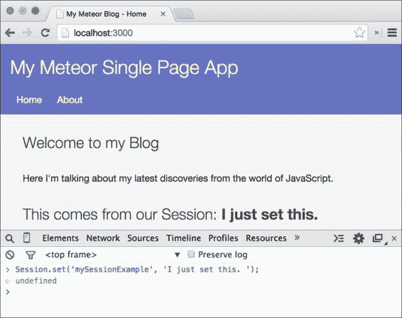
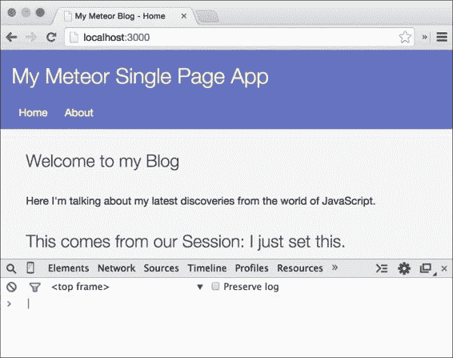
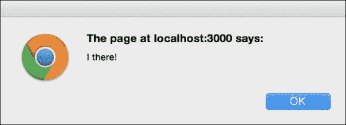
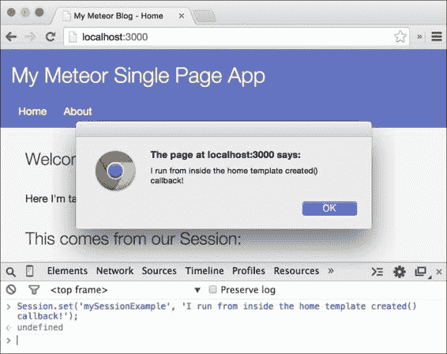

# 第六章：使用会话保持状态

我们在之前的章节中实现懒加载技术时已经使用了 Meteor 的 session 对象。在本章中，我们想要更深入地了解它，并学习如何使用它来创建特定模板的反应式函数。

本章将涵盖以下主题：

+   会话是什么

+   热代码推送如何影响 session

+   使用 session 重新运行模板助手

+   重新运行函数

+   创建特定模板的反应式函数

    ### 注意

    如果你直接跳到这一章节并想要跟随示例，可以从书籍的网页上[`www.packtpub.com/books/content/support/17713`](https://www.packtpub.com/books/content/support/17713)或从 GitHub 仓库[`github.com/frozeman/book-building-single-page-web-apps-with-meteor/tree/chapter5`](https://github.com/frozeman/book-building-single-page-web-apps-with-meteor/tree/chapter5)下载上一章节的代码示例。

    这些代码示例还将包含所有的样式文件，因此我们不必担心在过程中添加 CSS 代码。

# Meteor 的 session 对象

Meteor 提供的`Session`对象是一个反应式数据源，主要用于在热代码重载过程中维护全局状态，尽管它不会在页面手动重载时保存其数据，这使得它与 PHP 会话不同。

### 注意

当我们上传新代码时，服务器会将这些更新推送给所有客户端，这时就会发生热代码重载。

`Session`对象是一个反应式数据源。这意味着无论这个 session 变量在反应式函数中如何使用，当它的值发生变化时，它都会重新运行那个函数。

session 变量的一个用途可以是维护我们应用的全局状态，例如，检查用户是否显示侧边栏。

session 对象对于模板和其他应用部分之间的简单数据通信并不有用，因为维护这会很快变得令人痛苦，并且可能发生命名冲突。

## 实现简单反应性的更好方法

如果我们想要用于应用内通信，最好使用 Meteor 的`reactive-var`包，它带有一个类似于`ReactiveVar`对象的`Session`。

使用它时，我们可以简单地通过`$ meteor add reactive-var`来添加它。

然后需要实例化这个对象，并带有反应式的`get()`和`set()`函数，类似于`session`对象：

```js
Var myReactiveVar = new ReactiveVar('my initial value');

// now we can get it in any reactive function
myReactiveVar.get();

// and set it, to rerun depending functions
myReactiveVar.set('my new value');
```

为了实现更自定义的反应性，我们可以使用 Meteor 的`Tracker`包构建我们自己的自定义反应式对象。有关更多信息，请参阅第九章，*高级反应性*。

### 提示

对于与特定模板实例绑定的反应式变量，请查看我的`frozeman:template-var`包在[`atmospherejs.com/frozeman/template-var`](https://atmospherejs.com/frozeman/template-var)。

# 在模板助手使用 session

由于所有模板助手函数都是反应式函数，因此在这样的助手内部使用 session 对象是一个好地方。

反应式意味着当我们在这个函数内部使用反应式对象时，该函数会在反应式对象发生变化时重新运行，同时重新渲染模板的这部分。

### 注意

模板助手不是唯一的反应式函数；我们还可以使用`Tracker.autorun(function(){…})`创建自己的，正如我们早先章节中看到的那样。

为了展示在模板助手中美使用会话的方法，请执行以下步骤：

1.  打开我们的`my-meteor-blog/client/templates/home.js`文件，并在文件中的任何位置添加以下助手代码：

    ```js
    Template.home.helpers({
      //...
      sessionExample: function(){
        return Session.get('mySessionExample');
      }
    });
    ```

    这创建了`sessionExample`助手，它返回`mySessionExample`会话变量的值。

1.  接下来，我们需要把我们这个助手添加到我们的`home`模板本身，通过打开`my-metepr-blog/client/templates/home.html`文件，在我们`{{#each postsList}}`块助手上面加上助手：

    ```js
    <h2>This comes from our Session: <strong>{{sessionExample}}</strong></h2>
    ```

1.  现在，打开浏览器窗口，输入`http://localhost:3000`。我们会看到我们添加的静态文本出现在博客的主页上。然而，为了看到 Meteor 的反应式会话在起作用，我们需要打开浏览器的控制台并输入以下代码行：

    ```js
    Session.set('mySessionExample', 'I just set this.');
    ```

    以下屏幕截图说明了这一点：

    

在我们按下*Enter*键的那一刻，我们就看到了文字被添加到了我们的模板中。这是因为当我们调用`Session.set('mySessionExample', ...)`时，Meteor 会在我们之前调用`Session.get('mySessionExample')`的每个反应式函数中重新运行。对于模板助手，这只会重新运行这个特定的模板助手，只重新渲染模板的这部分。

我们可以通过为`mySessionExample`会话变量设置不同的值来尝试，这样我们就可以看到文字如何随时变化。

## 会话和热代码推送

热代码推送是指当我们更改文件时，Meteor 服务器将这些更改推送到客户端。Meteor 足够智能，可以重新加载页面，而不会丢失 HTML 表单或会话的值。因此，会话可以用来在热代码推送过程中保持用户状态的一致性。

为了看到这一点，我们将`mySessionExample`的值设置为我们想要的任何东西，并看到网站更新为此值。

现在，我们打开我们的`home.html`文件，进行一点小修改，例如移除`{{sessionExample}}`助手周围的`<strong>`标签并保存文件，我们会发现尽管页面随着新更改的模板重新加载，我们的会话状态仍然保持。这在以下屏幕截图中得到证明：



### 注意

如果我们手动使用浏览器的刷新按钮重新加载页面，会话将无法保持更改，文字将消失。

为了克服这个限制，Meteor 的包仓库中有许多包，它们反应式地将数据存储在浏览器的本地存储中，以在页面重新加载时保持数据。其中一个包叫做`persistent-session`，可以在[`atmospherejs.com/package/persistent-session`](http://atmospherejs.com/package/persistent-session)找到。

# 反应性地重新运行函数

为了根据会话更改重新运行函数，Meteor 提供了`Tracker.autorun()`函数，我们之前用它来改变懒加载订阅。

`Tracker.autorun()`函数将使传递给它的每个函数都具有反应性。为了看到一个简单的例子，我们将创建一个函数，每次函数重新运行时都会警告一个文本。

### 注意

`Tracker`包是会话在幕后使用的东西，以使反应性工作。在第九章，*高级反应性*，我们将深入研究这个包。

执行以下步骤以反应性地重新运行函数：

1.  让我们创建一个名为`main.js`的新文件，但这次在`my-meteor-blog`目录的根目录中，内容如下：

    ```js
    if(Meteor.isClient) {

        Tracker.autorun(function(){
            var example = Session.get('mySessionExample'); 
            alert(example);
        });
    }
    ```

    ### 注意

    在后面的章节中我们将会需要`main.js`文件。因此，我们在根目录中创建了它，使其可以在客户端和服务器上访问。

    然而，由于 Meteor 的 session 对象只存在于客户端，我们将使用`if(Meteor.isClient)`条件，以便只在客户端执行代码。

    现在当我们查看浏览器时，我们会看到一个显示`undefined`的警告。这是因为传递给`Tracker.autorun()`的函数在代码执行时也会运行，在这个时候我们还没有设置我们的会话。

1.  要设置会话变量的默认值，我们可以使用`Session.setDefault('mySessionExample', 'My Text')`。这将在不运行任何反应性函数的情况下设置会话，当会话值未定义时。如果会话变量的值已经设置，`setDefault`将根本不会更改变量。

1.  在我们的示例中，当页面加载时我们可能不希望出现一个警告窗口。为了防止这种情况，我们可以使用`Tracker.Computation`对象，它作为我们函数的第一个参数传递给我们，并为我们提供了一个名为`firstRun`的属性。这个属性将在函数的第一次运行时设置为`true`。当我们使用这个属性时，我们可以在开始时防止显示警告：

    ```js
    Tracker.autorun(function(c){
        var example = Session.get('mySessionExample'); 

        if(!c.firstRun) {
            alert(example);
        }
    });
    ```

1.  现在让我们打开浏览器的控制台，将会话设置为任何值以查看警告窗口出现：

    ```js
    Session.set('mySessionExample','Hi there!');
    ```

此代码的输出在下方的屏幕截图中展示：



### 注意

当我们再次运行相同的命令时，我们不会看到警告窗口出现，因为 Meteor 足够智能，可以防止在会话值不变时重新运行。如果我们将其设置为另一个值，警告将再次出现。

## 停止反应式函数

作为第一个参数传递的`Tracker.Computation`对象还为我们提供了一种完全停止函数反应性的方法。为了尝试这个，我们将更改函数，使其在我们传递`stop`字符串给会话时停止其反应性：

```js
Tracker.autorun(function(c){
    var example = Session.get('mySessionExample'); 

    if(!c.firstRun) {
        if(Session.equals('mySessionExample', 'stop')) {
            alert('We stopped our reactive Function');
            c.stop();
        } else {
            alert(example);
        }
    }
});
```

现在，当我们进入浏览器的控制台并运行`Session.set('mySessionExample', 'stop')`时，响应式函数将停止变得响应式。为了测试这一点，我们可以尝试运行`Session.set('mySessionExample', 'Another text')`，我们会发现警告窗口不会出现。

### 注意

如果我们对代码进行更改并且发生了热代码重载，响应式函数将再次变为响应式，因为代码被执行了 again。

前面的示例还使用了一个名为`Session.equals()`的函数。这个函数可以比较两个标量值，同时防止不必要的重新计算，与使用`Session.get('mySessionExample) === 'stop'`相比。使用`Session.equals()`只有在会话变量改变*到*或*从*那个值时才会重新运行这个函数。

### 注意

在我们的示例中，然而，这个函数并没有什么区别，因为我们之前也调用了`Session.get()`。

# 在模板中使用 autorun

虽然在某些情况下在我们的应用程序中全局使用`Tracker.autorun()`可能很有用，但随着我们应用程序的增长，这些全局响应式函数很快变得难以维护。

因此，将响应式函数绑定到它们执行操作的模板是一个好的实践。

幸运的是，Meteor 提供了一个特殊的`Tracker.autorun()`版本，它与模板实例相关联，并在模板被销毁时自动停止。

为了利用这一点，我们可以在`created()`或渲染回调中启动响应式函数。首先，让我们注释掉`main.js`文件中的上一个示例，这样我们就不会得到两个警告窗口。

打开我们的`home.js`文件，添加以下代码行：

```js
Template.home.created = function(){

    this.autorun(function(){
        alert(Session.get('mySessionExample'));
    });
};
```

这将在主页模板创建时创建响应式函数。当我们进入浏览器的控制台并设置`mySessionExample`会话为新值时，我们会看到警告窗口出现，如下面的屏幕截图所示：



现在，当我们通过点击菜单中的**关于**链接切换模板，并将`mySessionExample`会话变量再次设置为另一个值时，我们不会看到警告窗口出现，因为当模板被销毁时，响应式的`this.autorun()`已经停止。

### 注意

注意所有的`Tracker.autorun()`函数都返回一个`Tracker.Computation`对象，可以使用`Tracker.Computation.stop()`随时停止 autorun 的响应性：

```js
Var myReactiveFunction = Tracker.autorun(function(){...});
// Do something which needs to stop the autorun
myReactiveFunction.stop();
```

# 响应式的会话对象

我们看到了会话对象可以在其值改变时重新运行函数。这和集合的`find()`和`findOne()`函数的行为一样，这些函数在集合的底层数据改变时会重新运行函数。

我们可以使用会话来在热代码推送之间保持用户状态，比如下拉菜单或弹出的状态。但是，请注意，如果没有明确的命名约定，这些会话变量很快就会变得难以维护。

为了实现更具体的反应式行为，最好使用 Meteor 的`Tracker`核心包构建一个自定义的反应式对象，这将在第九章，*高级反应性*中介绍。

# 总结

在本章中，我们了解了 Meteor 的反应式会话对象能做什么。我们用它来重新运行模板助手和我们自己的自定义函数，并且我们通过`created()`和`destroyed()`回调创建了一个特定的反应式函数模板。

要深入了解，请查看 Meteor 关于会话和反应性的文档，具体资源如下：

+   [Meteor 的反应性](https://docs.meteor.com/#/full/reactivity)

+   [Meteor 的反应式会话对象](https://docs.meteor.com/#/full/session)

+   [Meteor 的反应式变量包](https://docs.meteor.com/#/full/reactivevar_pkg)

+   [Meteor 的 Tracker](https://www.meteor.com/tracker)

你可以在[`www.packtpub.com/books/content/support/17713`](https://www.packtpub.com/books/content/support/17713)找到本章的代码示例，或者在 GitHub 上查看[`github.com/frozeman/book-building-single-page-web-apps-with-meteor/tree/chapter6`](https://github.com/frozeman/book-building-single-page-web-apps-with-meteor/tree/chapter6)。

在下一章中，我们将为我们的博客创建管理员用户和后端，为创建和编辑帖子打下基础。
