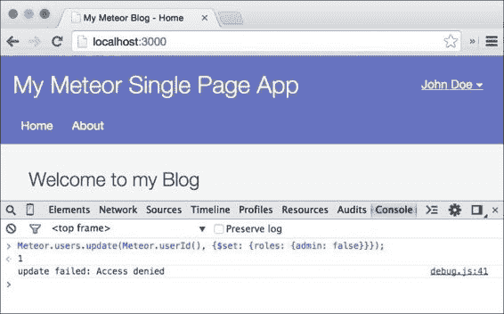
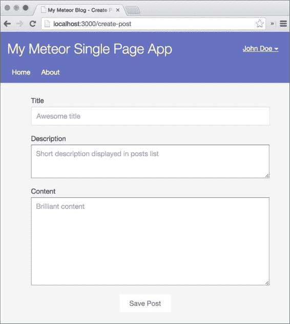

# 第七章：用户和权限

通过对前一章的内容进行操作，我们应该现在有一个运行中的博客了。我们可以点击所有的链接和帖子，甚至可以延迟加载更多的帖子。

在本章中，我们将添加我们的后端登录并创建管理员用户。我们还将创建一个编辑帖子的模板，并使管理员用户能够看到编辑按钮，以便他们可以编辑和添加新内容。

在本章中，我们将学习以下概念：

+   Meteor 的 `accounts` 包

+   创建用户和登录

+   如何限制某些路由仅供已登录用户使用

    ### 注意

    你可以删除前一章中的所有会话示例，因为我们在推进应用时不需要它们。从 `my-meteor-blog/main.js`、`my-meteor-blog/client/templates/home.js` 和 `my-meteor-blog/client/templates/home.html` 中删除会话的代码，或者下载前一章代码的新副本。

    如果你直接跳到这一章并且想跟随示例，可以从以下网址下载前一章的代码示例：[`www.packtpub.com/books/content/support/17713`](https://www.packtpub.com/books/content/support/17713) 或从 GitHub 仓库 [`github.com/frozeman/book-building-single-page-web-apps-with-meteor/tree/chapter6`](https://github.com/frozeman/book-building-single-page-web-apps-with-meteor/tree/chapter6) 下载。

    这些代码示例还将包含所有的样式文件，所以我们不需要在过程中添加 CSS 代码。

# Meteor 的 accounts 包

Meteor 使得通过其 `accounts` 包向我们的网络应用添加身份验证变得非常容易。`accounts` 包是一个与 Meteor 的核心紧密相连的完整的登录解决方案。创建的用户可以在许多 Meteor 的服务器端函数中通过 ID 进行识别，例如，在一个出版物中：

```js
Meteor.publish("examplePublication", function () {
  // the current loggedin user id can be accessed via
  this.userId;
}
```

此外，我们还可以通过简单地添加一个或多个 `accounts-*` 核心包来添加通过 Facebook、GitHub、Google、Twitter、Meetup 和 Weibo 登录的支持。

Meteor 还提供了一个简单的登录界面，一个可以通过使用 `{{> loginButtons}}` 助手添加的额外模板。

所有注册的用户资料都将存储在一个名为 `Users` 的集合中，Meteor 为我们创建了这个集合。所有的认证过程和通信过程都使用 **Secure Remote Password** (**SRP**) 协议，大多数外部服务都使用 OAuth。

对于我们的博客，我们只需创建一个管理员用户，当登录后，他们可以创建和编辑帖子。

### 注意

如果我们想要使用第三方服务之一进行登录，我们可以先完成本章的内容，然后添加前面提到的其中一个包。

添加额外包后，我们可以打开 **登录** 表单。我们将看到一个按钮，我们可以配置第三方服务以供我们的应用使用。

# 添加 accounts 包

要开始使用登录系统，我们需要将 `accounts-ui` 和 `accounts-password` 包添加到我们的应用中，如下所示：

1.  为了做到这一点，我们打开终端，导航到我们的`my-meteor-blog`文件夹，并输入以下命令：

    ```js
    $ meteor add accounts-ui accounts-password

    ```

1.  在我们成功添加包之后，我们可以使用`meteor`命令再次运行我们的应用程序。

1.  因为我们想要阻止我们的访客创建额外的用户账户，所以我们需要在我们的`accounts`包中禁止这个功能。首先，我们需要打开我们在前一章节中创建的`my-meteor-blog/main.js`文件，并删除所有代码，因为我们不再需要会话示例。

1.  然后在这个文件中添加以下代码行，但一定要确保不要使用`if(Meteor.isClient)`，因为这次我们希望在客户端和服务器上都执行代码：

    ```js
    Accounts.config({
        forbidClientAccountCreation: true
    });
    ```

    这将禁止在客户端调用`Accounts.createUser()`，并且`accounts-ui`包将不会向我们的访客显示**注册**按钮。

    ### 注意

    这个选项似乎对第三方服务不起作用。所以，当使用第三方服务时，每个人都可以注册并编辑文章。为了防止这种情况，我们将在服务器端创建“拒绝”规则以禁止用户创建，这超出了本章节的范围。

# 为我们的模板添加管理功能

允许编辑我们文章的最佳方式是在我们文章的页面上添加一个**编辑文章**链接，这个链接只有在登录后才能看到。这样，我们节省了为另一个后端重建类似基础设施的工作，并且使用起来很方便，因为前端和后端之间没有严格的分离。

首先，我们将向我们的`home`模板添加一个**创建新文章**链接，然后将**编辑文章**链接添加到文章的`pages`模板中，最后在主菜单中添加登录按钮和表单。

## 添加新文章的链接

让我们先添加一个**创建新文章**链接。打开`my-meteor-blog/clients/templates/home.html`中的`home`模板，并在`{{#each postsList}}`块助手之上添加以下代码行：

```js
{{#if currentUser}}
    <a href="/create-post" class="createNewPost">Create new post</a>
{{/if}}
```

`{{currentUser}}`助手随`accounts-base`包一起提供，当我们安装我们的`accounts`包时安装了它。它会返回当前登录的用户，如果没有用户登录，则返回 null。将其用于`{{#if}}`块助手内部允许我们只向登录用户显示内容。

## 添加编辑文章的链接

要编辑文章，我们只需在我们的`post`模板中添加一个**编辑文章**链接。打开同一文件夹中的`post.html`，并在`{{author}}`之后添加`{{#if currentUser}}..{{/if}}`，如下所示：

```js
<small>
    Posted {{formatTime timeCreated "fromNow"}} by {{author}}

    {{#if currentUser}}
        | <a href="/edit-post/{{slug}}">Edit post</a>
    {{/if}}
</small>
```

## 添加登录表单

现在我们已经有了添加和编辑文章的链接，让我们添加登录表单。我们可以创建自己的表单，但 Meteor 已经包含了一个简单的登录表单，我们可以将其样式修改以符合我们的设计。

由于我们之前添加了`accounts-ui`包，Meteor 为我们提供了`{{> loginButtons}}`模板助手，它作为一个即插即用的模板工作。为了添加这个功能，我们将打开我们的`layout.html`模板，并在菜单的`<ul></ul>`标签内添加以下助手，如下所示：

```js
<h1>My Meteor Single Page App</h1>
<ul>
    <li>
        <a href="/">Home</a>
    </li>
    <li>
        <a href="/about">About</a>
    </li>

</ul>

{{> loginButtons}}

```

# 创建编辑文章的模板

现在我们只缺少编辑帖子的模板。为了添加这个模板，我们将在`my-meteor-blog/client/templates`文件夹中创建一个名为`editPost.html`的文件，并填入以下代码行：

```js
<template name="editPost">
  <div class="editPost">
     <form>
        <label>
          Title
          <input type="text" name="title" placeholder="Awesome title" value="{{title}}">
        </label>

        <label>
          Description
          <textarea name="description" placeholder="Short description displayed in posts list" rows="3">{{description}}</textarea>
        </label>

        <label>
          Content
          <textarea name="text" rows="10" placeholder="Brilliant content">{{text}}</textarea>
        </label>

        <button type="submit" class="save">Save Post</button>
    </form>
  </div>
</template>
```

正如我们所看到的，我们添加了`{{title}}`、`{{description}}`和`{{text}}`帮助器，这些将从帖子数据中稍后获取。这个简单的模板，带有它的三个文本字段，将允许我们以后编辑和创建新帖子。

如果我们现在查看浏览器，我们会注意到我们看不到到目前为止所做的任何更改，除了网站角落里的**登录**链接。为了能够登录，我们首先需要添加我们的管理员用户。

# 创建管理员用户

由于我们已禁用客户端创建用户，作为一种安全措施，我们将在服务器上以创建示例帖子的方式创建管理员用户。

打开`my-meteor-blog/server/main.js`文件，在`Meteor.startup(function(){...})`内的某个位置添加以下代码行：

```js
if(Meteor.users.find().count() === 0) {

    console.log('Created Admin user');

    Accounts.createUser({
        username: 'johndoe',
        email: 'johndoe@example.com',
        password: '1234',
        profile: {
            name: 'John Doe'
        }
    });
}
```

如果我们现在打开浏览器，我们应该能够使用我们刚才创建的用户登录，我们会立即看到所有编辑链接出现。

然而，当我们点击任何编辑链接时，我们会看到`notFound`模板出现，因为我们还没有创建任何管理员路由。

## 添加权限

Meteor 的`account`包默认并不带有对用户可配置权限的支持。

为了添加权限控制，我们可以添加第三方包，比如`deepwell:authorization`包，可以在 Atmosphere 上找到，网址为[`atmospherejs.com/deepwell/authorization`](http://atmospherejs.com/deepwell/authorization)，它带有复杂的角色模型。

如果我们想手动完成，我们可以在创建用户时向用户文档添加简单的`roles`属性，然后在创建或更新帖子时在允许/拒绝角色中检查这些角色。我们将在下一章学习允许/拒绝规则。

如果我们使用`Accounts.createUser()`函数创建用户，我们就不能添加自定义属性，因此我们需要在创建用户后更新用户文档，如下所示：

```js
var userId = Accounts.createUser({
  username: 'johndoe',
  email: 'johndoe@example.com',
  password: '1234',
  profile: {
    name: 'John Doe'
  }
});
// add the roles to our user
Meteor.users.update(userId, {$set: {
  roles: {admin: true},
}})
```

默认情况下，Meteor 会发布当前登录用户`username`、`emails`和`profile`属性。要添加其他属性，比如我们的自定义`roles`属性，我们需要添加一个发布功能，以便在客户端访问`roles`属性，如下所示：

1.  打开`my-meteor/blog/server/publications.js`文件，添加以下发布功能：

    ```js
    Meteor.publish("userRoles", function () {
     if (this.userId) {
      return Meteor.users.find({_id: this.userId}, {fields: {roles: 1}});
     } else {
      this.ready();
     }
    });
    ```

1.  在`my-meteor-blog/main.js`文件中，我们像下面这样添加订阅：

    ```js
    if(Meteor.isClient){
      Meteor.subscribe("userRoles");
    }
    ```

1.  现在既然我们在客户端已经有了`roles`属性，我们可以把`home`和`post`模板中的`{{#if currentUser}}..{{/if}}`改为`{{#if currentUser.roles.admin}}..{{/if}}`，这样只有管理员才能看到按钮。

## 有关安全性的说明

用户只能使用以下命令更新自己的`profile`属性：

```js
Meteor.users.update(ownUserId, {$set: {profiles:{myProperty: 'xyz'}}})

```

如果我们想要更新`roles`属性，我们将失败。为了看到这一点，我们可以打开浏览器的控制台并输入以下命令：

```js
Meteor.users.update(Meteor.user()._id, {$set:{ roles: {admin: false}}});

```

这将给我们一个错误，指出：**更新失败：拒绝访问**，如下面的屏幕截图所示：



### 注意

如果我们想要允许用户编辑其他属性，例如他们的`roles`属性，我们需要为此添加一个`Meteor.users.allow()`规则。

# 为管理员创建路由

现在我们已经有了一个管理员用户，我们可以添加那些指向`editPost`模板的路由。尽管从理论上讲`editPost`模板对每个客户端都是可用的，但它不会造成任何风险，因为允许和拒绝规则才是真正的安全层，我们将在下一章中查看这些规则。

要添加创建文章的路由，让我们打开我们的`my-meteor-blog/routes.js`文件，并向`Router.map()`函数添加以下路由：

```js
this.route('Create Post', {
    path: '/create-post',
    template: 'editPost'
});
```

这将在我们点击主页上的**创建新文章**链接后立即显示`editPost`模板，如下面的屏幕截图所示：



我们发现表单是空的，因为我们没有为模板设置任何数据上下文，因此模板中显示的`{{title}}`、`{{description}}`和`{{text}}`占位符都是空的。

为了使编辑文章的路由工作，我们需要添加类似于为`Post`路由本身所做的订阅。为了保持事物的**DRY**（这意味着**不要重复自己**），我们可以创建一个自定义控制器，这个控制器将被两个路由使用，如下所示：

1.  在`Router.configure(...);`调用之后添加以下代码行：

    ```js
    PostController = RouteController.extend({
        waitOn: function() {
            return Meteor.subscribe('single-post', this.params.slug);
        },

        data: function() {
            return Posts.findOne({slug: this.params.slug});
        }
    });
    ```

1.  现在我们可以简单地编辑`Post`路由，删除`waitOn()`和`data()`函数，并添加`PostController`：

    ```js
    this.route('Post', {
        path: '/posts/:slug',
        template: 'post',
        controller: 'PostController'
    });
    ```

1.  现在我们还可以通过简单地更改`path`和`template`属性来添加`编辑文章`路由：

    ```js
    this.route('Edit Post', {
        path: '/edit-post/:slug',
        template: 'editPost',
        controller: 'PostController'
    });
    ```

1.  这就完成了！现在当我们打开浏览器时，我们将能够访问任何文章并点击**编辑**按钮，然后我们将被引导到`editPost`模板。

如果您想知道为什么表单会填充文章数据，请查看我们刚刚创建的`PostController`。在这里，我们在`data()`函数中返回文章文档，将模板的数据上下文设置为文章的数据。

现在我们已经设置了这些路由，我们应该完成了。难道不是吗？

还不是，因为任何知道`/create-post`和`/edit-post/my-title`路由的人都可以简单地看到`editPost`模板，即使他或她不是管理员。

## 防止访客看到管理路由

```js
routes.js file:
```

```js
var requiresLogin = function(){
    if (!Meteor.user() ||
        !Meteor.user().roles ||
        !Meteor.user().roles.admin) {
        this.render('notFound');

    } else {
        this.next();
    }
}; 

Router.onBeforeAction(requiresLogin, {only: ['Create Post','Edit Post']});
```

在这里，首先我们创建了`requiresLogin()`函数，它将在`创建文章`和`编辑文章`路由之前执行，因为我们将其作为第二个参数传递给`Router.onBeforeAction()`函数。

在`requiresLogin()`内部，我们检查用户是否已登录，当调用`Meteor.user()`时，这将返回用户文档，并且检查他们是否有`admin`角色。如果没有，我们简单地渲染`notFound`模板，并不再继续路由。否则，我们运行`this.next()`，这将继续渲染当前路由。

就这样！如果我们现在登出并导航到`/create-post`路由，我们将看到`notfound`模板。

如果我们登录，模板将切换并立即显示`editPost`模板。

这是因为一旦我们将`requiresLogin()`函数传递给`Router.onBeforeAction()`，它就会变得具有反应性，而`Meteor.user()`是一个反应式对象，所以用户状态的任何变化都会重新运行这个函数。

现在我们已经创建了管理员用户和所需的模板，我们可以继续实际创建和编辑帖子。

# 总结

在本章中，我们学习了如何创建和登录用户，如何仅向已登录用户显示内容和模板，以及如何根据登录状态更改路由。

要了解更多，请查看以下链接：

+   在[`www.meteor.com/accounts`](https://www.meteor.com/accounts)

+   在[`docs.meteor.com/#/full/accounts_api`](https://docs.meteor.com/#/full/accounts_api)

+   在[`docs.meteor.com/#/full/meteor_users`](https://docs.meteor.com/#/full/meteor_users)

+   [`en.wikipedia.org/wiki/Secure_Remote_Password_protocol`](http://en.wikipedia.org/wiki/Secure_Remote_Password_protocol)

+   [`github.com/EventedMind/iron-router/blob/devel/Guide.md#using-hooks`](https://github.com/EventedMind/iron-router/blob/devel/Guide.md#using-hooks)

您可以在[`www.packtpub.com/books/content/support/17713`](https://www.packtpub.com/books/content/support/17713)或 GitHub 上的[`github.com/frozeman/book-building-single-page-web-apps-with-meteor/tree/chapter7`](https://github.com/frozeman/book-building-single-page-web-apps-with-meteor/tree/chapter7)找到本章的代码示例。

在下一章中，我们将学习如何创建和更新帖子以及如何从客户端控制数据库的更新。
