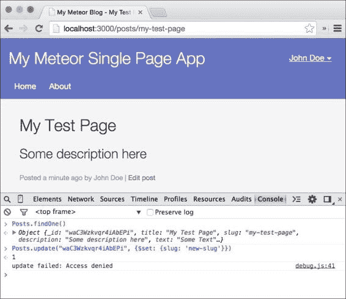

# 第八章：使用允许和拒绝规则进行安全设置

在前一章中，我们创建了我们的管理员用户并准备了`editPost`模板。在本章中，我们将使这个模板工作，以便我们可以使用它创建和编辑帖子。

为了使插入和更新数据库中的文档成为可能，我们需要设置约束，使不是每个人都可以更改我们的数据库。在 Meteor 中，这是使用允许和拒绝规则完成的。这些函数将在文档被插入数据库前检查它们。

在本章中，您将涵盖以下主题：

+   添加和更新帖子

+   使用允许和拒绝规则来控制数据库的更新

+   在服务器上使用方法以获得更多灵活性

+   使用方法桩来增强用户体验

    ### 注意

    如果您直接跳到这一章节并希望跟随示例，请从书籍的网页[`www.packtpub.com/books/content/support/17713`](https://www.packtpub.com/books/content/support/17713)或 GitHub 仓库[`github.com/frozeman/book-building-single-page-web-apps-with-meteor/tree/chapter7`](https://github.com/frozeman/book-building-single-page-web-apps-with-meteor/tree/chapter7)下载前一章节的代码示例。

    这些代码示例还将包含所有的样式文件，所以我们不需要担心在过程中添加 CSS 代码。

# 添加一个生成 slug 的函数

为了从我们的帖子标题生成 slugs，我们将使用带有简单`slugify()`函数的`underscore-string`库。幸运的是，这个库的一个包装包已经在 Meteor 包服务器上存在。要添加它，我们请在终端中运行以下命令，位于我们的`my-meteor-blog`文件夹中：

```js
$ meteor add wizonesolutions:underscore-string

```

这将使用默认在 Meteor 中使用的`underscore`扩展一些额外的字符串函数，如`_.slugify()`，从字符串生成一个 slug。

# 创建新帖子

现在我们已经可以为每个创建的页面生成 slugs，我们可以继续将保存过程添加到`editPost`模板中。

为此，我们需要为我们的`editPost`模板创建一个 JavaScript 文件，通过将一个名为`editPost.js`的文件保存到`my-meteor-blog/client/templates`文件夹中来实现。在这个文件中，我们将为模板的**保存**按钮添加一个事件：

```js
Template.editPost.events({
  'submit form': function(e, template){
    e.preventDefault();
    console.log('Post saved');
  }
});
```

现在，如果我们前往`/create-post`路由并点击**保存帖子**按钮，**帖子已保存**日志应该在浏览器控制台中出现。

## 保存帖子

为了保存帖子，我们只需取表单的内容并将其存储在数据库中。稍后，我们将重定向到新创建的帖子页面。为此，我们将我们的点击事件扩展为以下几行代码：

```js
Template.editPost.events({
  'submit form': function(e, tmpl){
    e.preventDefault();
    var form = e.target,
        user = Meteor.user();
```

我们获取当前用户，以便稍后将其作为帖子的作者添加。然后使用我们的`slugify()`函数从帖子标题生成一个 slug：

```js
        var slug = _.slugify(form.title.value);
```

接着，我们使用所有其他表单字段将帖子文档插入到`Posts`集合中。对于`timeCreated`属性，我们使用在第一章，*Meteor 入门*中添加的`moment`包获取当前的 Unix 时间戳。

`owner`字段将帮助我们确定是由哪个用户创建了此帖子：

```js
Posts.insert({
            title:          form.title.value,
            slug:           slug,
            description:    form.description.value,
            text:           form.text.value,
            timeCreated:    moment().unix(),
            author:         user.profile.name,
            owner:          user._id

        }, function(error) {
            if(error) {
                // display the error to the user
                alert(error.reason);
            } else {
                // Redirect to the post
                Router.go('Post', {slug: slug});
            }
        });
    }
});
```

我们传递给`insert()`函数的第二个参数是一个由 Meteor 提供的回调函数，如果出错，它将接收到一个错误参数。如果发生错误，我们警告它，如果一切顺利，我们使用生成的 slug 将用户重定向到新插入的帖子。

由于我们的路由控制器将会订阅这个 slug 的帖子，它将能够加载我们新创建的帖子并在帖子模板中显示它。

现在，如果我们打开浏览器，填写表单，并点击**保存**按钮，我们应该已经创建了我们的第一个帖子！

# 编辑帖子

所以保存是可行的。编辑呢？

当我们点击帖子中的**编辑**按钮时，我们将再次显示`editPost`模板。这次，表单字段填充了帖子的数据。到目前为止还不错，但如果我们现在点击**保存**按钮，我们将创建另一个帖子，而不是更新当前帖子。

## 更新当前帖子

由于我们设置了`editPost`模板的数据上下文，我们可以简单地使用帖子`_id`字段的存在作为更新的指示器，而不是插入帖子数据：

```js
Template.editPost.events({
    'submit form': function(e, tmpl){
        e.preventDefault();
        var form = e.target,
            user = Meteor.user(),
            _this = this; // we need this to reference the slug in the callback

        // Edit the post
        if(this._id) {

            Posts.update(this._id, {$set: {
                title:          form.title.value,
                description:    form.description.value,
                text:           form.text.value

            }}, function(error) {
                if(error) {
                    // display the error to the user
                    alert(error.reason);
                } else {
                    // Redirect to the post
                    Router.go('Post', {slug: _this.slug});
                }
            });

        // SAVE
        } else {

            // The insertion process ...

        }
    }
});
```

知道了`_id`，我们可以简单地使用`$set`属性来更新当前文档。使用`$set`只会覆盖`title`、`description`和`text`字段。其他字段将保持原样。

请注意，我们现在还需要在函数顶部创建`_this`变量，以便在回调 later 中访问当前数据上下文的`slug`属性。这样，我们稍后可以将用户重定向到我们编辑的帖子页面。

现在，如果我们保存文件并回到浏览器，我们可以编辑帖子并点击**保存**，所有更改都将如预期般保存到我们的数据库中。

现在，我们可以创建和编辑帖子。在下一节中，我们将学习如何通过添加允许和拒绝规则来限制对数据库的更新。

# 限制数据库更新

到目前为止，我们只是将插入和更新功能添加到了我们的`editPost`模板中。然而，如果有人在他们浏览器的控制台输入一个`insert`语句，任何人都可以插入和更新数据。

为了防止这种情况，我们需要在服务器端正确检查插入和更新权限，然后再更新数据库。

Meteor 的集合带有允许和拒绝函数，这些函数在每次插入或更新之前运行，以确定该操作是否被允许。

允许规则让我们允许某些文档或字段被更新，而拒绝规则覆盖任何允许规则，并肯定地拒绝对其集合的任何操作。

为了使这更加明显，让我们想象一个例子，我们定义了两个允许规则；其中一个将允许某些文档的`title`字段被更改，另一个只允许编辑`description`字段，但还有一个额外的拒绝规则可以防止某个特定文档在任何情况下被编辑。

## 删除不安全的包

为了开始使用允许和拒绝规则，我们需要从我们的应用程序中删除`insecure`包，这样客户端就不能简单地不通过我们的允许和拒绝规则就对我们的数据库进行更改。

使用终端中的*Ctrl* + *C* 停止运行中的`meteor`实例，并运行以下命令：

```js
$ meteor remove insecure

```

成功删除包后，我们可以使用`meteor`命令再次运行 Meteor。

当我们现在打开浏览器尝试编辑任何帖子时，我们将看到一个提示窗口，显示**访问被拒绝**。记得我们之前在更新或插入操作失败时添加了这个`alert()`调用吗？

## 添加我们的第一个允许规则

为了使我们的帖子再次可编辑，我们需要添加允许规则以重新启用数据库更新。

为此，我们将在我们的`my-meteor-blog/collections.js`文件中添加以下允许规则，但在这个例子中，我们通过检查 Meteor 的`isServer`变量，使它们只在服务器端执行：

```js
if(Meteor.isServer) {

    Posts.allow({
        insert: function (userId, doc) {
            // The user must be logged in, and the document must be owned by the user
            return userId && doc.owner === userId && Meteor.user().roles.admin;
        },
```

在插入*允许*规则中，我们只会在帖子所有者与当前用户匹配时插入文档，如果用户是管理员，我们可以在上一章中添加的`roles.admin`属性来确定。

如果允许规则返回`false`，将拒绝文档的插入。否则，我们将成功添加一个新帖子。更新也是一样，只是我们只检查当前用户是否是管理员：

```js
        update: function (userId, doc, fields, modifier) {
            // User must be an admin
            return Meteor.user().roles.admin;
        },
        // make sure we only get this field from the documents
        fetch: ['owner']
    });
}
```

传递给`update`函数的参数如下表所示：

| ```Field``` | 描述 |
| --- | --- |
| ```---``` | ```---``` |
| ```userId``` | 执行`update`操作的当前登录用户的用户 ID |
| ```doc``` | 数据库中的文档，不包括拟议的更改 |
| ```fields``` | 包含将要更新的字段参数的数组 |
| ```modifier``` | 用户传递给`update`函数的修改器，例如`{$set: {'name.first': "Alice"}, $inc: {score: 1}}` |

我们最后在允许规则的对象中指定的`fetch`属性，决定了当前文档的哪些字段应该传递给更新规则。在我们这个例子中，我们只需要`owner`属性用于我们的更新规则。`fetch`属性存在是为了性能原因，以防止不必要的巨大文档被传递到规则函数中。

### 注意

此外，我们可以指定`remove()`规则和`transform()`函数。`remove()`规则将获得与`insert()`规则相同的参数，并允许或阻止文档的删除。

`transform()`函数可以用来在传递给允许或拒绝规则之前转换文档，例如，使其规范化。然而，要注意的是，这不会改变插入数据库的文档。

现在如果我们尝试在我们的网站上编辑一个帖子，我们应该能够编辑所有帖子以及创建新的帖子。

# 添加拒绝规则

为了提高安全性，我们可以修复帖子的所有者和创建时间。我们可以通过向我们的`Posts`集合中添加一个额外的拒绝规则来防止对所有者以及`timeCreated`和`slug`字段的更改，如下所示：

```js
if(Meteor.isServer) {

  // Allow rules

  Posts.deny({
    update: function (userId, docs, fields, modifier) {
      // Can't change owners, timeCreated and slug
      return _.contains(fields, 'owner') || _.contains(fields, 'timeCreated') || _.contains(fields, 'slug');
    }
  });
}
```

这个规则将简单地检查`fields`参数是否包含受限制的字段之一。如果包含，我们就拒绝更新这篇帖子。所以，即使我们之前的允许规则已经通过，我们的拒绝规则也确保了文档不会发生变化。

我们可以在浏览器的控制台中尝试拒绝规则，当我们处于一个帖子页面时，输入以下命令：

```js
Posts.update(Posts.findOne()._id, {$set: {'slug':'test'}}); 

```

这应该会给你一个错误，提示**更新失败：访问被拒绝**，如下面的截图所示：



虽然我们现在可以添加和更新帖子，但还有一种比简单地将它们从客户端插入到我们的`Posts`集合中更好的添加新帖子的方法。

# 使用方法调用来添加帖子

方法是可以在客户端调用并在服务器上执行的函数。

## 方法存根和延迟补偿

方法的优势在于它们可以在服务器上执行代码，同时拥有完整的数据库和客户端上的存根方法。

例如，我们可以有一个方法在服务器上执行某些操作，并在客户端的存根方法中模拟预期的结果。这样，用户不必等待服务器的响应。存根还可以调用界面更改，例如添加一个加载指示器。

一个原生方法调用的例子是 Meteor 的`Collection.insert()`函数，它将执行客户端侧的函数，立即将文档插入到本地`minimongo`数据库中，同时发送一个请求在服务器上执行真正的`insert`方法。如果插入成功，客户端已经有了插入的文档。如果出现错误，服务器将响应并从客户端再次移除插入的文档。

在 Meteor 中，这个概念被称为**延迟补偿**，因为界面会立即对用户的响应做出反应，从而补偿延迟，而服务器的往返将在后台发生。

使用方法调用来插入帖子，使我们能够简单地检查我们想要为帖子使用的 slug 是否已经在另一篇帖子中存在。此外，我们还可以使用服务器的时间来为`timeCreated`属性确保我们没有使用错误的用户时间戳。

## 更改按钮

在我们的示例中，我们将简单地使用方法存根功能，在服务器上运行方法时将**保存**按钮的文本更改为`Saving…`。为此，执行以下步骤：

1.  首先，让我们通过模板助手更改**保存**按钮的静态文本，以便我们可以动态地更改它。打开`my-meteor-blog/client/templates/editPost.html`，用以下代码替换**保存**按钮的代码：

    ```js
    <button type="submit" class="save">{{saveButtonText}}</button>
    ```

1.  现在打开`my-meteor-blog/client/templates/editPost.js`，在文件开头添加以下模板助手函数：

    ```js
    Session.setDefault('saveButton', 'Save Post');
    Template.editPost.helpers({
      saveButtonText: function(){
        return Session.get('saveButton');
      }
    });
    ```

    在这里，我们返回名为`saveButton`的会话变量，我们之前将其设置为默认值`Save Post`。

更改会话将允许我们在保存文档的同时稍后更改**保存**按钮的文本。

## 添加方法

现在我们有了一个动态的**保存**按钮，让我们在我们的应用中添加实际的方法。为此，我们将创建一个名为`methods.js`的新文件，直接位于我们的`my-meteor-blog`文件夹中。这样，它的代码将在服务器和客户端加载，这是在客户端作为存根执行方法所必需的。

添加以下代码以添加方法：

```js
Meteor.methods({
    insertPost: function(postDocument) {

        if(this.isSimulation) {
            Session.set('saveButton', 'Saving...');
        }
    }
});
```

这将添加一个名为`insertPost`的方法。在这个方法内部，存根功能已经通过使用`isSimulation`属性添加，该属性是通过 Meteor 在函数的`this`对象中提供的。

`this`对象还具有以下属性：

+   `unblock()`：当调用此函数时，将防止该方法阻塞其他方法调用

+   `userId`：这包含当前用户的 ID

+   `setUserId()`：这个函数用于将当前客户端连接到某个用户

+   `connection`：这是通过该方法在服务器上调用的连接

如果`isSimulation`设置为`true`，该方法不会在服务器端运行，而是作为存根在客户端运行。在这个条件下，我们简单地将`saveButton`会话变量设置为`Saving…`，以便按钮文本会更改：

```js
Meteor.methods({
  insertPost: function(postDocument) {

    if(this.isSimulation) {

      Session.set('saveButton', 'Saving...');

    } else {
```

为了完成方法，我们将添加帖子插入的服务器端代码：

```js
       var user = Meteor.user();

       // ensure the user is logged in
       if (!user)
       throw new Meteor.Error(401, "You need to login to write a post");
```

在这里，我们获取当前用户以添加作者名称和所有者 ID。

如果用户没有登录，我们就抛出异常，用`new Meteor.Error`。这将阻止方法的执行并返回我们定义的错误信息。

我们还查找具有给定 slug 的帖子。如果我们找到一个，我们在 slug 前添加一个随机字符串，以防止重复。这确保了每个 slug 都是唯一的，我们可以成功路由到我们新创建的帖子：

```js
      if(Posts.findOne({slug: postDocument.slug}))
      postDocument.slug = postDocument.slug +'-'+ Math.random().toString(36).substring(3);
```

在我们插入新创建的帖子之前，我们使用`moment`库和`author`和`owner`属性添加`timeCreated`：

```js
      // add properties on the serverside
      postDocument.timeCreated = moment().unix();
      postDocument.author      = user.profile.name;
      postDocument.owner       = user._id;

      Posts.insert(postDocument);
```

在我们插入文档之后，我们返回修正后的 slug，然后在该方法调用的回调中作为第二个参数接收：

```js
       // this will be received as the second argument of the method callback
       return postDocument.slug;
    }
  }
});
```

# 调用方法

现在我们已经创建了`insertPost`方法，我们可以改变在`editPost.js`文件中之前插入帖子时的提交事件代码，用我们的方法进行调用：

```js
var slug = _.slugify(form.title.value);

Meteor.call('insertPost', {
  title:          form.title.value
  slug:           slug,
  description:    form.description.value
  text:           form.text.value,

}, function(error, slug) {
  Session.set('saveButton', 'Save Post');

  if(error) {
    return alert(error.reason);
  }

  // Here we use the (probably changed) slug from the server side method
  Router.go('Post', {slug: slug});
});
```

正如我们在方法调用的回调中看到的那样，我们使用在回调中作为第二个参数接收到的`slug`变量路由到新创建的帖子。这确保了如果`slug`变量在服务器端被修改，我们使用修改后的版本来路由到帖子。此外，我们将`saveButton`会话变量重置为将文本更改为`Save Post`。

就这样！现在，我们可以使用我们新创建的`insertPost`方法创建并保存新的帖子。然而，编辑仍然会在客户端使用`Posts.update()`进行，因为我们现在有了允许和拒绝规则，以确保只有允许的数据被修改。

# 总结

在本章中，我们学习了如何允许和拒绝数据库的更新。我们设置了自己的允许和拒绝规则，并了解了方法如何通过将敏感过程移动到服务器端来提高安全性。我们还通过检查 slug 是否已存在并在其中添加了一个简单的进度指示器来改进发帖过程。

如果您想更深入地了解允许和拒绝规则或方法，请查看以下 Meteor 文档：

+   [`docs.meteor.com/#/full/allow`](http://docs.meteor.com/#/full/allow)

+   [`docs.meteor.com/#/full/deny`](http://docs.meteor.com/#/full/deny)

+   [`docs.meteor.com/#/full/methods_header`](https://docs.meteor.com/#/full/methods_header)

您可以在[`www.packtpub.com/books/content/support/17713`](https://www.packtpub.com/books/content/support/17713)找到本章的代码示例，或者在 GitHub 上找到[`github.com/frozeman/book-building-single-page-web-apps-with-meteor/tree/chapter8`](https://github.com/frozeman/book-building-single-page-web-apps-with-meteor/tree/chapter8)。

在下一章中，我们将通过不断更新帖子的时间戳来使我们的界面实现实时更新。
