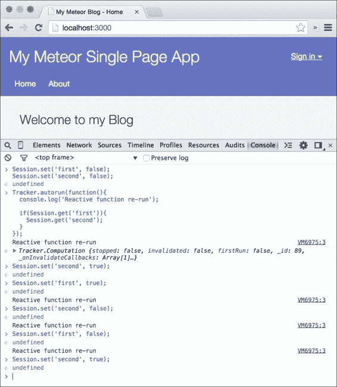
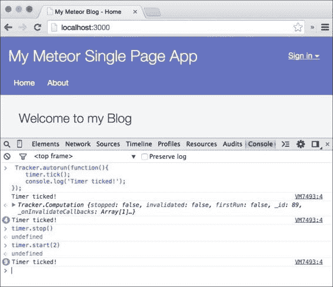
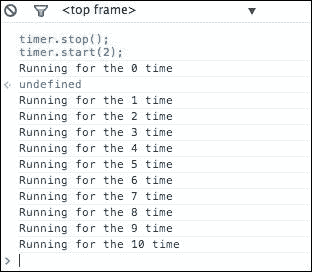

# 第九章：高级响应式

现在我们的博客基本上已经完成了，因为我们能够创建和编辑文章。在本章中，我们将利用 Meteor 的响应式模板来使我们的界面时间戳自动更新。我们将构建一个响应式对象，该对象将重新运行模板助手，显示博客文章创建的时间。这样，它们总是显示正确的相对时间。

在本章中，我们将介绍以下内容：

+   响应式编程

+   手动重新运行函数

+   使用`Tracker`包构建响应式对象

+   停止响应式函数

    ### 注意

    如果你直接跳到这一章并想跟随示例，请从以下网址下载上一章的代码示例：[`www.packtpub.com/books/content/support/17713`](https://www.packtpub.com/books/content/support/17713) 或从 GitHub 仓库：[`github.com/frozeman/book-building-single-page-web-apps-with-meteor/tree/chapter8`](https://github.com/frozeman/book-building-single-page-web-apps-with-meteor/tree/chapter8)。

    这些代码示例还将包含所有的样式文件，所以我们不需要担心在过程中添加 CSS 代码。

# 响应式编程

如我们已经在全书中看到的，Meteor 使用某种称为**响应性**的东西。

开发者在构建软件应用程序时必须解决的一个问题是指界面中表示数据的的一致性。大多数现代应用程序使用某种称为**模型-视图-控制器**（**MVC**）的东西，其中视图的控制器确保它始终表示模型的当前状态。模型通常是服务器 API 或浏览器内存中的 JSON 对象。

保持界面一致的最常见方法如下（来源：[`manual.meteor.com`](http://manual.meteor.com)）：

+   **轮询和差异**：定期（例如，每秒一次）获取事物的当前值，看看它是否发生变化，如果是，执行更新。

+   **事件**：可以变化的事物在变化时发出事件。程序的另一部分（通常称为控制器）安排监听这个事件，获取当前值，并在事件触发时执行更新。

+   **绑定**：值由实现某些接口的对象表示，例如`BindableValue`。然后，使用“绑定”方法将两个`BindableValues`连接在一起，这样当一个值发生变化时，另一个值会自动更新。有时，作为设置绑定的一部分，可以指定一个转换函数。例如，可以将`Foo`与`Bar`绑定，并使用`toUpperCase`转换函数。

这些模式很好，但它们仍然需要大量的代码来维护所表示数据的的一致性。

另一种模式，尽管还不是那么常用，那就是**响应式编程**。这种模式是一种声明式的数据绑定方式。这意味着当我们使用一个响应式数据源，如一个`Session`变量或`Mongo.Collection`时，我们可以确信，一旦其值发生变化，使用这些值的响应式函数或模板助手将重新运行，总是保持基于这些值的用户界面或计算更新。

米托尔手册为我们提供了一个响应式编程用法的实例：

> 响应式编程非常适合构建用户界面，因为它不是试图用一段统一的代码来模拟所有的交互，而是让程序员表达在特定变化发生时应该发生的事情。响应变化的范式比显式地建模哪些变化会影响程序状态更容易理解。
> 
> 例如，假设我们正在编写一个 HTML5 应用程序，有一个项目表，用户可以点击一个项目来选择它，或者按 Ctrl 点击来选择多个项目。我们可能有一个`<h1>`标签，并希望该标签的内容等于当前选定项目的大写名称，如果有多个项目被选中，则为“Multiple selection”。而且，我们可能有一组`<tr>`标签，并希望每个`<tr>`标签的 CSS 类为“selected”，如果该项目对应的行在选定项目的集合中，否则为空字符串。

为了使这个例子在上述模式中实现，我们可以很快地看到，与响应式编程相比，它变得多么复杂（来源：[`manual.meteor.com`](http://manual.meteor.com)）：

+   如果我们使用轮询和差分，UI 将会变得不可接受地卡顿。用户点击后，屏幕实际上直到下一次轮询周期才会更新。此外，我们必须存储旧的选定集合，并与新的选定集合进行差分，这有点麻烦。

+   如果我们使用事件，我们就必须编写一些相当复杂的控制器代码，手动将选择的变化或选定项目的名称映射到 UI 的更新。例如，当选择发生变化时，我们必须记住更新`<h1>`标签和（通常）两个受影响的`<tr>`标签。更重要的是，当选择发生变化时，我们必须自动在新生成的选定项目上注册一个事件处理程序，以便我们记住要更新`<h1>`。尤其是当 UI 被扩展和重新设计时，很难构建干净的代码并维护它。

+   如果我们使用绑定，我们就必须使用一个复杂的**领域特定语言**（**DSL**）来表达变量之间复杂的 relationships。这个 DSL 必须包括间接性（将`<h1>`的内容绑定到当前选择的任何固定项目的名称，而是绑定到由当前选择指示的项目）、转换（将名称首字母大写）和条件（如果有多个项目被选择，显示一个占位符字符串）。

使用米托尔的反应式模板引擎 Blaze，我们可以简单地使用`{{#each}}`块助手来遍历一个元素列表，并根据用户交互或根据项目的属性添加一些条件以添加一个选中类。

如果用户现在更改数据或从服务器接收的数据发生变化，界面将自动更新以表示相应的数据，节省我们大量时间并避免不必要的复杂代码。

## 无效化周期

理解反应式依赖的关键部分是无效化周期。

当我们在一个反应式函数中使用反应式数据源，例如`Tracker.autorun(function(){…})`，反应式数据源本身看到它在一个反应式函数中，并将当前函数作为依赖项添加到其依赖存储中。

然后，当数据源的值发生变化时，它会无效化（重新运行）所有依赖的函数，并将它们从其依赖存储中移除。

在反应式函数的重新运行中，它会将反应式函数重新添加到其依赖存储中，这样在下次无效化（值变化）时它们会再次运行。

这是理解反应性的关键，正如我们在以下示例中所看到的。

想象我们有三个`Session`变量设置为`false`：

```js
Session.set('first', false);
Session.set('second', false);
```

此外，我们还有`Tracker.autorun()`函数，它使用了这两个变量：

```js
Tracker.autorun(function(){
    console.log('Reactive function re-run');
    if(Session.get('first')){
        Session.get('second');
    }
});
```

现在我们可以调用`Session.set('second', true)`，但是反应式函数不会重新运行，因为在第一次运行中它从未被调用，因为`first`会话变量被设置为`false`。

如果我们现在调用`Session.set(first, true)`，该函数将重新运行。

此外，如果我们现在设置`Session.set('second', false)`，它也会重新运行，因为在第二次重新运行中，`Session.get('second')`可以添加这个反应式函数作为依赖项。

由于反应式数据源在每次无效化时都会从其存储中移除所有依赖项，并在反应式函数的重新运行中重新添加它们，因此我们可以设置`Session.set(first, false)`并尝试将其更改为`Session.set('second', true)`。函数将不再重新运行，因为在这个运行中从未调用过`Session.get('second')`！

一旦我们理解了这一点，我们就可以实现更细粒度的反应性，将反应式更新保持在最小。解释的控制台输出与以下屏幕截图类似：



# 构建一个简单的反应式对象

正如我们所看到的，**反应式对象**是一个在反应式函数中使用的对象，当它的值发生变化时，它会重新运行函数。米托尔的`Session`对象是反应式对象的一个例子。

在本章中，我们将构建一个简单的反应式对象，它将在时间间隔内重新运行我们的`{{formatTime}}`模板助手，以便所有相对时间都能正确更新。

米托尔的反应性是通过`Tracker`包实现的。这个包是所有反应性的核心，允许我们跟踪依赖项并在需要时重新运行它们。

执行以下步骤以构建简单的反应式对象：

1.  让我们开始吧，让我们将以下代码添加到`my-meteor-blog/main.js`文件中：

    ```js
    if(Meteor.isClient) {
        ReactiveTimer = new Tracker.Dependency;
    }
    ```

    这将在客户端创建一个名为`ReactiveTimer`的变量，带有`Tracker.Dependency`的新实例。

1.  在`ReactiveTimer`变量下方，但仍在`if(Meteor.isClient)`条件下，我们将添加以下代码，每 10 秒重新运行一次我们`ReactiveTimer`对象的的所有依赖项：

    ```js
    Meteor.setInterval(function(){
        // re-run dependencies every 10s
        ReactiveTimer.changed();
    }, 10000);
    ```

    `Meteor.setInterval`将每 10 秒运行一次函数。

    ### 注意

    Meteor 自带了`setInterval`和`setTimeout`的实现。尽管它们与原生 JavaScript 等效，但 Meteor 需要这些来引用服务器端特定用户的确切超时/间隔。

Meteor 自带了`setInterval`和`setTimeout`的实现。尽管它们与原生 JavaScript 等效，但 Meteor 需要这些来引用服务器端特定用户的确切超时/间隔。

在这个区间内，我们调用`ReactiveTimer.changed()`。这将使每个依赖函数失效，并重新运行。

## 重新运行函数

到目前为止，我们还没有创建依赖项，所以让我们这样做。在`Meteor.setInterval`下方添加以下代码：

```js
Tracker.autorun(function(){
    ReactiveTimer.depend();
    console.log('Function re-run');
});
```

如果我们现在回到浏览器控制台，我们应该会看到每 10 秒**函数重新运行**一次，因为我们的反应式对象重新运行了函数。

我们甚至可以在浏览器控制台中调用`ReactiveTimer.changed()`，函数也会重新运行。

这些例子很好，但不会自动更新我们的时间戳。

为此，我们需要打开`my-meteor-blog/client/template-helpers.js`并在我们的`formatTime`助手函数顶部添加以下行：

```js
ReactiveTimer.depend();
```

这样，我们应用中的每个`{{formatTime}}`助手每 10 秒就会重新运行一次，更新流逝时的相对时间。要看到这一点，请打开浏览器，创建一篇新博客文章。现在保存博客文章，并观察创建时间文本，你会发现过了一会儿它会发生变化：


# 创建高级计时器对象

之前的示例是一个自定义反应式对象的简单演示。为了使其更有用，最好创建一个单独的对象，隐藏`Tracker.Dependency`函数并添加其他功能。

Meteor 的反应性和依赖跟踪允许我们从另一个函数内部调用`depend()`函数时创建依赖项。这种依赖链允许更复杂的反应式对象。

在下一个示例中，我们将取我们的`timer`对象并为其添加`start`和`stop`函数。此外，我们还将使其能够选择一个时间间隔，在该时间间隔内计时器将重新运行：

1.  首先，让我们从`main.js`和`template-helpers.js`文件中删除之前添加的代码示例，并在`my-meteor-blog/client`内创建一个名为`ReactiveTimer.js`的新文件，内容如下：

    ```js
    ReactiveTimer = (function () {

        // Constructor
        function ReactiveTimer() {
            this._dependency = new Tracker.Dependency;
            this._intervalId = null;
        };

        return ReactiveTimer;
    })();
    ```

    这创建了一个经典的 JavaScript 原型类，我们可以使用`new ReactiveTimer()`来实例化它。在其构造函数中，我们实例化了一个`new Tracker.Dependency`并将其附加到该函数。

1.  现在，我们将创建一个`start()`函数，它将启动一个自选的间隔：

    ```js
    ReactiveTimer = (function () {

        // Constructor
        function ReactiveTimer() {
            this._dependency = new Tracker.Dependency;
            this._intervalId = null;
        };
        ReactiveTimer.prototype.start = function(interval){
            var _this = this;
            this._intervalId = Meteor.setInterval(function(){
                // rerun every "interval"
                _this._dependency.changed();
            }, 1000 * interval);
        };

        return ReactiveTimer;
    })();
    ```

    这是我们之前使用的相同代码，不同之处在于我们将间隔 ID 存储在`this._intervalId`中，这样我们可以在`stop()`函数中稍后停止它。传递给`start()`函数的间隔必须是秒；

1.  接下来，我们在类中添加了`stop()`函数，它将简单地清除间隔：

    ```js
    ReactiveTimer.prototype.stop = function(){
        Meteor.clearInterval(this._intervalId);
    };
    ```

1.  现在我们只需要一个函数来创建依赖关系：

    ```js
    ReactiveTimer.prototype.tick = function(){
        this._dependency.depend();
    };
    ```

    我们的反应式定时器准备好了！

1.  现在，要实例化`timer`并使用我们喜欢的间隔启动它，请在文件末尾的`ReactiveTimer`类后添加以下代码：

    ```js
    timer = new ReactiveTimer();
    timer.start(10);
    ```

1.  最后，我们需要回到`template-helper.js`文件中的`{{formatTime}}`助手，并`添加``time.tick()`函数，界面上所有的相对时间都会随着时间流逝而更新。

1.  要看到反应式定时器的动作，可以在浏览器的控制台中运行以下代码片段：

    ```js
    Tracker.autorun(function(){
        timer.tick();
        console.log('Timer ticked!');
    });
    ```

1.  我们应该现在每 10 秒看到一次**Timer ticked!**的日志。如果我们现在运行`time.stop()`，定时器将停止运行其依赖函数。如果我们再次调用`time.start(2)`，我们将看到`Timer ticked!`现在每两秒出现一次，因为我们设置了间隔为`2`：

正如我们所看到的，我们的`timer`对象现在相当灵活，我们可以在整个应用程序中创建任意数量的时间间隔。

# 反应式计算

Meteor 的反应性和`Tracker`包是一个非常强大的特性，因为它允许将事件行为附加到每个函数和每个模板助手。这种反应性正是保持我们界面一致性的原因。

虽然到目前为止我们只接触了`Tracker`包，但它还有几个我们应该查看的属性。

我们已经学习了如何实例化一个反应式对象。我们可以调用`new Tracker.Dependency`，它可以通过`depend()`和`changed()`创建和重新运行依赖关系。

## 停止反应式函数

当我们在一个反应式函数内部时，我们也能够访问到当前的计算对象，我们可以用它来停止进一步的反应式行为。

为了看到这个效果，我们可以在浏览器的控制台中使用我们已经在运行的`timer`，并使用`Tracker.autorun()`创建以下反应式函数：

```js
var count = 0;
var someInnerFunction = function(count){
    console.log('Running for the '+ count +' time');

    if(count === 10)
        Tracker.currentComputation.stop();
};
Tracker.autorun(function(c){
    timer.tick();

    someInnerFunction(count);

    count++;
});

timer.stop();
timer.start(2);
```

在这里，我们创建了`someInnerFunction()`来展示我们如何从嵌套函数中访问当前计算。在这个内部函数中，我们使用`Tracker.currentComputation`获取计算，它给了我们当前的`Tracker.Computation`对象。

我们使用之前在`Tracker.autorun()`函数中创建的`count`变量进行计数。当我们达到 10 时，我们调用`Tracker.currentComputation.stop()`，这将停止内部依赖和`Tracker.autorun()`函数的依赖，使它们失去反应性。

为了更快地看到结果，我们在示例的末尾以两秒的间隔停止和开始`timer`对象。

如果我们把前面的代码片段复制并粘贴到浏览器的控制台并运行它，我们应该看到**Running for the xx time**出现 10 次：



当前计算对象对于从依赖函数内部控制响应式依赖项很有用。

## 防止在启动时运行

`Tracker``.Computation`对象还带有`firstRun`属性，我们在前一章中使用过。

例如，当使用`Tracker.autorun()`创建响应式函数时，它们在首次被 JavaScript 解析时也会运行。如果我们想要防止这种情况，我们可以在检查`firstRun`是否为`true`时简单地停止函数，在执行任何代码之前：

```js
Tracker.autorun(function(c){
    timer.tick();

    if(c.firstRun)
        return;

    // Do some other stuff
});
```

### 注意

我们在这里不需要使用`Tracker.currentComputation`来获取当前计算，因为`Tracker.autorun()`已经将其作为第一个参数。

同样，当我们停止`Tracker.autorun()`函数时，如以下代码所述，它将永远不会为会话变量创建依赖关系，因为第一次运行时从未调用`Session.get()`：

```js
Tracker.autorun(function(c){
  if(c.firstRun)
    return;

  Session.get('myValue');
}):
```

为了确保我们使函数依赖于`myValue`会话变量，我们需要将它放在`return`语句之前。

## 高级响应式对象

`Tracker`包还有一些更高级的属性和函数，允许您控制何时无效化依赖项（`Tracker.flush()`和`Tracker.Computation.invalidate()`）以及允许您在它上面注册额外的回调（`Tracker.onInvalidate()`）。

这些属性允许您构建复杂的响应式对象，这超出了本书的范围。如果您想要更深入地了解`Tracker`包，我建议您查看 Meteor 手册中的[`manual.meteor.com/#tracker`](http://manual.meteor.com/#tracker)。

# 总结

在本章中，我们学习了如何构建我们自己的自定义响应式对象。我们了解了`Tracker.Dependency.depend()`和`Tracker.Dependency.changed()`，并看到了响应式依赖项具有自己的计算对象，可以用来停止其响应式行为并防止在启动时运行。

为了更深入地了解，请查看`Tracker`包的文档，并查看以下资源的`Tracker.Computation`对象的详细属性描述：

+   [`www.meteor.com/tracker`](https://www.meteor.com/tracker)

+   [`docs.meteor.com/#/full/tracker`](https://docs.meteor.com/#/full/tracker)

+   [`docs.meteor.com/#/full/tracker_computation`](https://docs.meteor.com/#/full/tracker_computation)

+   [`docs.meteor.com/#/full/tracker_dependency`](https://docs.meteor.com/#/full/tracker_dependency)

你可以在本章的代码示例在[`www.packtpub.com/books/content/support/17713`](https://www.packtpub.com/books/content/support/17713)或者在 GitHub 上找到[`github.com/frozeman/book-building-single-page-web-apps-with-meteor/tree/chapter9`](https://github.com/frozeman/book-building-single-page-web-apps-with-meteor/tree/chapter9)。

现在我们已经完成了我们的博客，我们将在下一章看看如何将我们的应用程序部署到服务器上。
