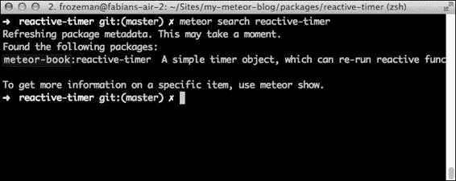

# 第十一章：构建我们自己的包

在本章中，我们将学习如何构建自己的包。编写包允许我们创建可以共享在许多应用中的闭合功能组件。在本章的后半部分，我们将把我们的应用发布到 Atmosphere，Meteor 的第三方包仓库，地址为[`atmospherejs.com`](https://atmospherejs.com)。

在本章中，我们将涵盖以下主题：

+   结构化一个包

+   创建一个包

+   发布自己的包

    ### 注意

    在本章中，我们将包装在第九章，*高级反应性*中构建的`ReactiveTimer`对象。要遵循本章中的示例，请从以下任一位置下载上一章的代码示例：[`www.packtpub.com/books/content/support/17713`](https://www.packtpub.com/books/content/support/17713)（书籍网页）或[`github.com/frozeman/book-building-single-page-web-apps-with-meteor/tree/chapter10`](https://github.com/frozeman/book-building-single-page-web-apps-with-meteor/tree/chapter10）（GitHub 仓库）。

# 包的结构

包是一个包含特定变量暴露给 Meteor 应用的 JavaScript 文件集合。除了在 Meteor 应用中，包文件将按我们指定的加载顺序加载。

每个包都需要一个`package.js`文件，该文件包含该包的配置。在这样的文件中，我们可以添加一个名称、描述和版本，设置加载顺序，并确定哪些变量应该暴露给应用。此外，我们还可以为我们的包指定单元测试来测试它们。

`package.js`文件的一个例子可能看起来像这样：

```js
Package.describe({
  name: "mrt:moment",
  summary: "Moment.js, a JavaScript date library.",
  version: "0.0.1",
  git: "https://..."
});

Package.onUse(function (api, where) {
  api.export('moment');

  api.addFiles('lib/moment-with-langs.min.js', 'client');
});

Package.onTest(function(api){
  api.use(["mrt:moment", "tinytest"], ["client", "server"]);
  api.addFiles("test/tests.js", ["client", "server"]);
});
```

我们可以按照自己的意愿结构包中的文件和文件夹，但以下安排是一个好的基础：


+   `tests`：包含包的单元测试和`tests.js`文件

+   `lib`：包含包使用的第三方库

+   `README.md`：包含使用包的简单说明

+   `package.js`: 此文件包含包的元数据

+   `myPackage.js`：这些是包含包代码的一个或多个文件

要测试一个包，我们可以使用 Meteor 的`tinytest`包，它是一个简单的单元测试包。如果我们有测试，我们可以使用以下命令运行它们：

```js
$ meteor test-packages <my package name>

```

这将启动一个 Meteor 应用，地址为`http://localhost:3000`，它运行我们的包测试。要了解如何编写一个包，请查看下一章。

# 创建自己的包

要创建自己的包，我们将使用我们在第九章，*高级反应性*中构建的`ReactiveTimer`对象：

1.  我们来到终端，在我们的应用文件夹中运行以下命令：

    ```js
    $ meteor create --package reactive-timer

    ```

1.  这将创建一个名为`packages`的文件夹，其中有一个`reactive-timer`文件夹。在`reactive-timer`文件夹内，Meteor 已经创建了一个`package.js`文件和一些示例包文件。

1.  现在我们可以删除`reactive-timer`文件夹内的所有文件，除了`package.js`文件。

1.  然后我们将我们在第九章 *高级反应性*中创建的`my-meteor-blog/client/ReactiveTimer.js`文件移动到我们新创建的`reactive-timer`包文件夹中。

1.  最后，我们打开复制的`ReactiveTimer.js`文件，并删除以下行：

    ```js
    timer = new ReactiveTimer();
    timer.start(10);
    ```

    稍后，我们在应用本身内部实例化`timer`对象，而不是在包文件中。

现在我们应该有一个简单的文件夹，带有默认的`package.js`文件和我们的`ReactiveTimer.js`文件。这几乎就是全部了！我们只需要配置我们的包，就可以在应用中使用它了。

## 添加包元数据

要添加包的元数据，我们打开名为`package.js`的文件，并添加以下代码行：

```js
Package.describe({
  name: "meteor-book:reactive-timer",
  summary: "A simple timer object, which can re-run reactive functions based on an interval",
  version: "0.0.1",
  // optional
  git: "https://github.com/frozeman/meteor-reactive-timer"
});
```

这为包添加了一个名称、一个描述和一个版本。

请注意，包名称与作者的名称命名空间。这样做的目的是，通过它们的作者名称，可以使具有相同名称的包区分开来。在我们这个案例中，我们选择`meteor-book`，这并不是一个真实的用户名。要发布包，我们需要使用我们真实的 Meteor 开发者用户名。

在`Package.describe()`函数之后是实际的包依赖关系：

```js
Package.onUse(function (api) {
  // requires Meteor core packages 1.0
  api.versionsFrom('METEOR@1.0');

  // we require the Meteor core tracker package
  api.use('tracker', 'client');

  // and export the ReactiveTimer variable
  api.export('ReactiveTimer');

  // which we find in this file
  api.addFiles('ReactiveTimer.js', 'client');
});
```

在这里，我们定义了这个包应该使用的 Meteor 核心包的版本：

+   使用`api.use()`，我们定义了这个包依赖的额外包（或包）。请注意，这些依赖不会被使用这个包的应用本身访问到。

    ### 注意

    另外，还存在`api.imply()`，它不仅使另一个包在包的文件中可用，而且还将它添加到 Meteor 应用本身，使其可以被应用的代码访问。

+   如果我们使用第三方包，我们必须指定最低的包版本，如下所示：

    ```js
    api.use('author:somePackage@1.0.0', 'server');

    ```

    ### 注意

    我们还可以传入第三个参数，`{weak: true}`，以指定只有在开发者已经将依赖包添加到应用中时，才会使用该依赖包。这可以用来在有其他包存在时增强一个包。

+   在`api.use()`函数的第二个参数中，我们可以指定是否在客户端、服务器或两者上都加载它，使用数组：

    ```js
    api.use('tracker', ['client', 'server']);

    ```

    ### 提示

    我们实际上不需要导入`Tracker`包，因为它已经是 Meteor 核心`meteor-platform`包的一部分（默认添加到任何 Meteor 应用中）；我们在这里这样做是为了示例。

+   然后我们使用`api.export('ReactiveTimer')`来定义包中应该向使用此包的 Meteor 应用公开哪个变量。记住，我们在`ReactiveTimer.js`文件中使用以下代码行创建了`ReactiveTimer`对象：

    ```js
    ReactiveTimer = (function () {
      ...
    })();
    ```

    ### 注意

    请注意，我们没有使用`var`来创建变量。这样，它在包的所有其他文件中都可以访问，也可以暴露给应用本身。

+   最后，我们使用`api.addFiles()`告诉包系统哪些文件属于这个包。我们可以有`api.addFiles()`的多个调用，一个接一个。这个顺序将指定文件的加载顺序。

    在这里，我们再次告诉 Meteor 将文件加载到哪个地方——客户端、服务器还是两者都加载——使用`['client', 'server']`。

    在这个例子中，我们只在客户端提供了`ReactiveTimer`对象，因为 Meteor 的反应式函数只存在于客户端。

    ### 注意

    如果你想要查看`api`对象的所有方法，请查看 Meteor 的文档[`docs.meteor.com/#packagejs`](http://docs.meteor.com/#packagejs)。

## 添加包

将包文件夹复制到`my-meteor-blog/packages`文件夹中并不足以让 Meteor 使用这个包。我们需要遵循额外的步骤：

1.  为了添加包，我们需要从终端前往我们的应用文件夹，停止任何正在运行的`meteor`实例，并运行以下命令：

    ```js
    $ meteor add meteor-book:reactive-timer

    ```

1.  然后，我们需要在我们的应用中实例化`ReactiveTimer`对象。为此，我们需将以下代码行添加到我们的`my-meteor-blog/main.js`文件中：

    ```js
    if(Meteor.isClient) {
        timer = new ReactiveTimer();
        timer.start(10);
    }
    ```

1.  现在我们可以再次使用`$ meteor`启动 Meteor 应用，并在`http://localhost:3000`打开我们的浏览器。

我们应该看不到任何区别，因为我们只是用我们`meteor-book:reactive-timer`包中的`ReactiveTimer`对象替换了应用中原本的`ReactiveTimer`对象。

为了看到计时器运行，我们可以打开浏览器的控制台并运行以下的代码片段：

```js
Tracker.autorun(function(){
    timer.tick();
    console.log('timer run');
});
```

这应该会每 10 秒记录一次`timer run`，显示我们的包实际上是在工作的。

# 发布我们的包给公众

向世界发布一个包是非常容易的，但为了让人们使用我们的包，我们应该添加一个 readme 文件，这样他们就可以知道如何使用我们的包。

在我们之前创建的包文件夹中创建一个名为`README.md`的文件，并添加以下的代码片段：

```js
# ReactiveTimer

This package can run reactive functions in a given interval.
## Installation

    $ meteor add meteor-book:reactive-timer

## Usage

To use the timer, instantiate a new interval:

    var myTimer = new ReactiveTimer();

Then you can start an interval of 10 seconds using:

    myTimer.start(10);

To use the timer just call the following in any reactive function:

    myTimer.tick();

To stop the timer use:

    myTimer.stop();
```

正如我们所见，这个文件使用了 Markdown 语法。这样，它将在 GitHub 和[`atmospherejs.com`](http://atmospherejs.com)上看起来很不错，这是一个你可以浏览所有可用 Meteor 包的网站。

通过这个 readme 文件，我们将使其他人更容易使用我们的包并欣赏我们的工作。

## 在线发布我们的包

在我们保存了`readme`文件之后，我们可以将这个包推送到 GitHub 或其他的在线 Git 仓库，并将仓库的 URL 添加到`package.js`文件的`Package.describe({git: …})`变量中。将代码托管在 GitHub 上可以保证它的安全性，并允许他人进行分叉和改进。下面让我们来进行将我们的包推送到线上的步骤：

1.  发布我们的包，我们可以在终端的`pages`文件夹内简单地运行以下命令：

    ```js
    $ meteor publish --create

    ```

    这会构建并捆绑包，然后上传到 Meteor 的包服务器上。

1.  如果一切顺利，我们应该能够通过输入以下命令找到我们的包：

    ```js
    $ meteor search reactive-timer

    ```

    这在下面的截图中有所说明：

    

1.  然后，我们可以使用以下命令显示找到的包的所有信息：

    ```js
    $ meteor show meteor-book:reactive-timer

    ```

    这在上面的截图中说明：

    

1.  要使用来自 Meteor 服务器的包版本，我们只需将`packages/reactive-timer`文件夹移到别处，删除`package`文件夹，然后运行`$ meteor`来启动应用程序。

    现在 Meteor 在`packages`文件夹中找不到具有该名称的包，并将在线查找该包。既然我们发布了它，它将被下载并用于我们的应用程序。

1.  如果我们想在我们的应用程序中使用我们包的特定版本，我们可以在终端中从我们应用程序的文件夹内运行以下命令：

    ```js
    $ meteor add meteor-book:reactive-timer@=0.0.1

    ```

现在我们的包已经发布，我们可以在`http://atmospherejs.com/meteor-book/reactive-timer`看到它，如下所示：


### 注意

请注意，这只是一个包的示例，并且从未实际发布过。然而，在[`atmospherejs.com/frozeman/reactive-timer`](http://atmospherejs.com/frozeman/reactive-timer)以我的名义发布的这个包的版本可以找到。

## 更新我们的包

如果我们想发布我们包的新版本，我们只需在`package.js`文件中增加版本号，然后从`packages`文件夹内使用以下命令发布新版本：

```js
$ meteor publish

```

要使我们的应用程序使用我们包的最新版本（只要我们没有指定固定版本），我们只需在终端内从我们的应用程序文件夹中运行以下命令：

```js
$ meteor update meteor-book:reactive-timer

```

如果我们想更新所有包，我们可以运行以下命令：

```js
$ meteor update –-packages-only

```

# 总结

在本章中，我们从我们的`ReactiveTimer`对象创建了自己的包。我们还了解到，在 Meteor 的官方打包系统中发布包是多么简单。

要深入了解，请阅读以下资源中的文档：

+   [`docs.meteor.com/#/full/writingpackages`](https://docs.meteor.com/#/full/writingpackages)

+   [`docs.meteor.com/#packagejs`](https://docs.meteor.com/#packagejs)

+   [Meteor 包服务器](https://www.meteor.com/services/package-server)

+   [`www.meteor.com/isobuild`](https://www.meteor.com/isobuild)

您可以在[`www.packtpub.com/books/content/support/17713`](https://www.packtpub.com/books/content/support/17713)或 GitHub 上[`github.com/frozeman/book-building-single-page-web-apps-with-meteor/tree/chapter11`](https://github.com/frozeman/book-building-single-page-web-apps-with-meteor/tree/chapter11)找到本章的代码示例。

这个代码示例只包含包，所以为了将其添加到应用程序中，请使用前一章的代码示例。

在下一章中，我们将查看测试我们的应用程序和包。
