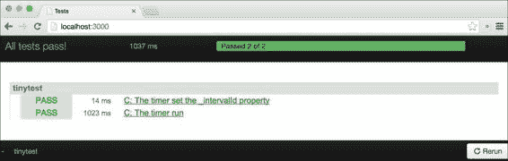
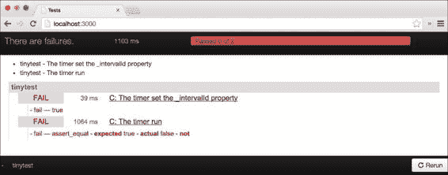
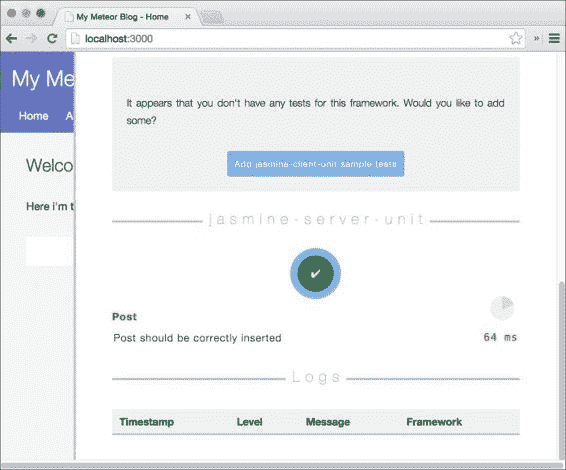
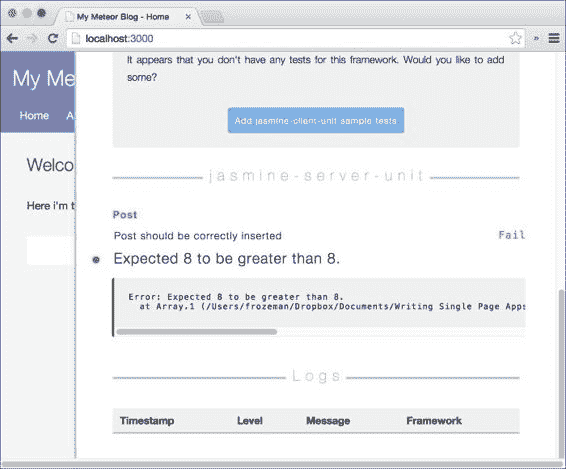
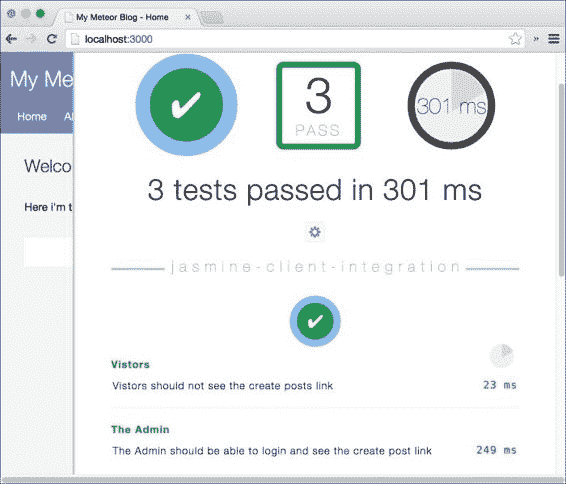

# 第十二章：Meteor 中的测试

在这个最后的章节中，我们将讨论我们如何测试一个 Meteor 应用。

测试是一个广泛的话题，超出了本章的范围。为了简化，我们将简要介绍两种可用的工具，因为它们确实不同，并为每种工具提供一个简单的示例。

在本章中，我们将介绍以下主题：

+   测试 `reactive-timer` 包

+   使用 Jasmine 对我们应用进行单元测试

+   使用 Nightwatch 对我们应用进行验收测试

    ### 注意

    如果你想要直接进入章节并跟随示例，请下载第十章，*部署我们的应用*的代码，它包含了完成的示例应用，可以从书籍的网页[`www.packtpub.com/books/content/support/17713`](https://www.packtpub.com/books/content/support/17713)或从 GitHub 仓库[`github.com/frozeman/book-building-single-page-web-apps-with-meteor/tree/chapter10`](https://github.com/frozeman/book-building-single-page-web-apps-with-meteor/tree/chapter10)获取。

# 测试类型

测试是用来验证其他代码或应用功能的代码片段。

我们可以将测试分为四个主要组：

+   **单元测试**：在这个测试中，我们只测试我们代码的小单元。这可以，例如，是一个函数或一段代码。单元测试不应该调用其他函数，向硬盘或数据库写入，或访问网络。如果需要这样的功能，应该编写桩函数，这些函数返回期望的值而不调用真正的函数。

+   **集成测试**：在这个测试中，我们将多个测试结合起来，在不同的环境中运行它们，以确保它们仍然有效。与单元测试相比，这个测试的不同之处在于，我们实际上是在运行连接的功能，比如调用数据库。

+   **功能测试**：这可以是单元测试或界面测试，但只测试功能特性/函数的功能，而不检查副作用，例如是否适当地清理了变量。

+   **验收测试**：这个测试在完整的系统上运行，例如，一个网络浏览器。想法是尽可能地模仿实际用户。这些测试与定义功能的用户故事非常相似。这种测试的缺点是，它使得追踪错误变得困难，因为测试发生在较高的层次。

在下面的示例中，我们主要会为了简化而编写功能测试。

# 测试包

在上一章中，我们基于 `ReactiveTimer` 对象构建了一个包。一个好的包应该总是包含单元测试，这样人们就可以运行它们，并确信对该包所做的更改不会破坏其功能。

Meteor 为包提供了一个简单的单元测试工具，称为 `TinyTest`，我们将使用它来测试我们的包：

1.  要添加测试，我们需要将我们在上一章中构建的`meteor-book:reactive-timer`包复制到我们应用的`my-meteor-blog/packages`文件夹中。这样，我们可以修改包，因为 Meteor 将优先选择`packages`文件夹中的包而不是其包服务器中的包。如果你移除了包，只需使用以下命令将其重新添加：

    ```js
    $ meteor add meteor-book:reactive-timer

    ```

    ### 注意

    此外，我们需要确保我们删除`my-meteor-blog/client/ReactiveTimer.js`文件，如果我们使用了来自第十章 *部署我们的应用* 的代码示例作为基础的话，我们应该有的。

1.  然后我们打开我们`packages`文件夹中的`package.js`文件，并在文件的末尾添加以下几行代码：

    ```js
    Package.onTest(function (api) {
      api.use('meteor-book:reactive-timer', 'client');
      api.use('tinytest', 'client');

      api.addFiles('tests/tests.js', 'client');
    });
    ```

    这将包括我们的`meteor-book:reactive-timer`包和`tinytest`，在运行测试时。然后它将运行`tests.js`文件，其中将包含我们的单元测试。

1.  现在，我们可以通过在我们的包文件夹中添加一个名为`tests`的文件夹，并在其中创建一个名为`tests.js`的文件来创建测试。

    目前，`tinytest`包没有被 Meteor 文档化，但它很小，这意味着它非常简单。

    基本上，有两个函数，`Tinytest.add(test)`和`Tinytest.addAsync(test, expect)`。它们都运行一个简单的测试函数，我们可以使用`test.equal(x, y)`，`test.isTrue(x)`，或`test.isUndefined(x)`来通过或失败这个函数。

    对于我们的包测试，我们将简单地测试在启动计时器后`ReactiveTimer._intervalId`是否不再为 null，这样我们就可以知道计时器是否运行了。

## 添加包测试

测试首先描述将要测试的内容。

要测试`_intervalId`，我们在我们的`tests.js`文件中添加以下几行代码：

```js
Tinytest.add('The timer set the _intervalId property', function (test) {
    var timer = new ReactiveTimer();
    timer.start(1);

    test.isTrue(timer._intervalId !== null);

    timer.stop();
});
```

然后我们启动一个计时器，并测试其`_intervalId`属性是否不再为 null。最后，我们再次停止计时器以清理测试。

接下来，我们将把我们`tests.js`文件中要添加的下一个测试设置为异步，因为我们需要等待计时器至少运行一次：

```js
Tinytest.addAsync('The timer run', function (test, expect) {
    var run = false,
        timer = new ReactiveTimer();
    timer.start(1);

    Tracker.autorun(function(c){
        timer.tick();

        if(!c.firstRun)
            run = true;
    });

    Meteor.setTimeout(function(){
        test.equal(run, true);
        timer.stop();

        expect();
    }, 1010);
});
```

让我们来看看这个异步测试中发生了什么：

+   首先，我们再次以 1 秒的间隔启动计时器，并创建了一个名为`run`的变量。我们只在我们的反应式`Tracker.autorun()`函数运行时将这个变量切换为`true`。请注意，我们使用了`if(!c.firstRun)`来防止在函数第一次执行时设置`run`变量，因为我们只希望在 1 秒后的“滴答”计数。

+   然后我们使用`Meteor.setTimeout()`函数检查`run`是否被更改为`true`。`expect()`告诉`Tinytest.addAsync()`测试已经结束并输出结果。请注意，我们还停止了计时器，因为我们需要在每个测试后清理。

## 运行包测试

要最终运行测试，我们可以从我们应用的根目录运行以下命令：

```js
$ meteor test-packages meteor-book:reactive-timer

```

这将启动一个 Meteor 应用并运行我们的包测试。要查看它们，我们导航到`http://localhost:3000`：



### 提示

我们也可以通过命名由空格分隔的多个包来同时运行一个以上的包测试：

```js
$ meteor test-packages meteor-book:reactive-timer iron:router

```

为了看看测试是否有效，我们将通过注释掉 `my-meteor-book/packages/reactive-timer/ReactiveTimer.js` 文件中的 `Meteor.setInterval()` 来故意使它失败，如下所示：



我们应该始终尝试使我们的测试失败，因为一个测试也可能是编写成永远不会成功或失败的方式（例如，当 `expect()` 从未被调用时）。这将阻止其他测试的执行，因为当前的测试可能永远不会完成。

一个好的经验法则是，测试功能时要好像我们正在看一个黑箱。如果我们根据函数是如何编写的来过度定制我们的测试，那么在我们改进函数时修复测试会比较困难。

# 测试我们的 Meteor 应用

为了测试应用本身，我们可以使用 Velocity Meteor 的官方测试框架。

Velocity 本身不包含测试工具，而是为诸如 Jasmine 或 Mocha 等测试包提供了一种统一的方式来测试 Meteor 应用，并使用 `velocity:html-reporter` 包在控制台或应用界面本身报告它们的输出。

让我们引用他们自己的话：

> *Velocity 监控您的 tests/ 目录，并将测试文件发送到正确的测试插件。测试插件执行测试，并在完成后将每个测试的结果发送回 Velocity。然后 Velocity 结合所有测试插件的结果，并通过一个或多个报告插件输出它们。当应用或测试发生变化时，Velocity 将重新运行您的测试并反应性地更新结果。*

这段内容来自 [`velocity.meteor.com`](http://velocity.meteor.com)。此外，Velocity 还增加了诸如 Meteor 存根和自动存根等功能。它能够为隔离测试创建镜像应用，并运行设置代码（测试数据）。

现在，我们将查看使用 Jasmine 的单元测试和使用 Nightwatch 的验收测试。

## 使用 Jasmine 测试

为了使用 Jasmine 和 Velocity，我们需要安装 `sanjo:jasmine` 包以及 `velocity:html-reporter` 包。

为此，我们将从我们的 apps 文件夹内运行以下命令：

```js
$ meteor add velocity:html-reporter

```

然后，我们使用以下命令为 Meteor 安装 Jasmine：

```js
$ meteor add sanjo:jasmine

```

为了让 Velocity 能够找到测试，我们需要创建以下文件结构：

```js
- my-meteor-blog
  - tests
    - jasmine
    - client
      - unit
      - integration
    - server
      - unit
```

现在，当我们使用 `$ meteor` 启动 Meteor 服务器时，我们会发现 Jasmine 包已经在 `/my-meteor-blog/tests/jasmine/server/unit` 文件夹中创建了两个文件，其中包含我们包的存根。

### 向服务器添加单元测试

现在我们可以向客户端和服务器添加单元测试。在这本书中，我们将只向服务器添加一个单元测试，稍后向客户端添加集成测试，以保持在本书章节的范围内。这样做步骤如下：

1.  首先，我们在 `/my-meteor-blog/tests/jasmine/server/unit` 文件夹中创建一个名为 `postSpecs.js` 的文件，并添加以下命令：

    ```js
    describe('Post', function () {
    ```

    这将创建一个描述测试内部将涉及什么的测试框架。

1.  在测试框架内，我们调用`beforeEach()`和`afterEach()`函数，这两个函数分别在每个测试之前和之后运行。在其中，我们将使用`MeteorStubs.install()`为所有的 Meteor 函数创建桩，并使用`MeteorStubs.uninstall()`之后清理它们：

    ```js
    beforeEach(function () {
        MeteorStubs.install();
    });

    afterEach(function () {
        MeteorStubs.uninstall();
    });
    ```

    ### 注意

    桩是一个模仿其原始函数或对象的功能或对象，但不会运行实际代码。相反，桩可以用来返回函数我们测试依赖的特定值。

    桩确保单元测试只测试特定的代码单元，而不是它的依赖。否则，依赖函数或对象的一个断裂会导致其他测试链失败，使得找到实际问题变得困难。

1.  现在我们可以编写实际的测试。在这个例子中，我们将测试我们之前在书中创建的`insertPost`方法是否插入了帖子，并确保不会插入重复的 slug：

    ```js
    it('should be correctly inserted', function() {

        spyOn(Posts, 'findOne').and.callFake(function() {
            // simulate return a found document;
            return {title: 'Some Tite'};
        });

        spyOn(Posts, 'insert');

        spyOn(Meteor, 'user').and.returnValue({_id: 4321, profile: {name: 'John'}});

        spyOn(global, 'moment').and.callFake(function() {
            // simulate return the moment object;
            return {unix: function(){
                return 1234;
            }};
        });
    ```

    首先，我们为`insertPost`方法中使用的所有函数创建桩，以确保它们返回我们想要的结果。

    特别是，看看`spyOn(Posts, "findOne")`调用。正如我们可以看到的，我们调用了一个假函数，并返回了一个只有标题的假文档。实际上，我们可以返回任何东西，因为`insertPost`方法只检查是否找到了具有相同 slug 的文档。

1.  接下来，我们实际上调用该方法并给它一些帖子数据：

    ```js
        Meteor.call('insertPost', {
            title: 'My Title',
            description: 'Lorem ipsum',
            text: 'Lorem ipsum',
            slug: 'my-title'
        }, function(error, result){
    ```

1.  在方法的回调内，我们添加了实际的测试：

    ```js
            expect(error).toBe(null);

            // we check that the slug is returned
            expect(result).toContain('my-title');
            expect(result.length).toBeGreaterThan(8);

            // we check that the post is correctly inserted
            expect(Posts.insert).toHaveBeenCalledWith({
                title: 'My Title',
                description: 'Lorem ipsum',
                text: 'Lorem ipsum',
                slug: result,
                timeCreated: 1234,
                owner: 4321,
                author: 'John'
            });
        });
    });
    ```

    首先，我们检查错误对象是否为 null。然后我们检查方法生成的 slug 是否包含`'my-title'`字符串。因为我们在较早的`Posts.findOne()`函数中返回了一个假文档，所以我们期望我们的方法会给 slug 添加一些随机数，比如`'my-title-fotvadydf4rt3xr'`。因此，我们检查其长度是否大于原始`'my-title'`字符串的八个字符。

    最后，我们检查`Post.insert()`函数是否被调用了期望的值。

    ### 注意

    为了完全理解如何测试 Jasmine，请查看文档[`jasmine.github.io/2.0/introduction.html`](https://jasmine.io/2.0/introduction.html)。

    你也可以在[`www.cheatography.com/citguy/cheat-sheets/jasmine-js-testing`](http://www.cheatography.com/citguy/cheat-sheets/jasmine-js-testing)找到一个很好的 Jasmine 函数速查表。

1.  最后，我们关闭开始时的`describe(...`函数：

    ```js
    });
    ```

如果我们现在再次使用`$ meteor`启动我们的 Meteor 应用，过一会儿我们会在右上角看到一个绿色点。

点击这个点可以让我们访问 Velocity 的`html-reporter`，它应该能显示我们的测试已经通过：



为了使我们的测试失败，让我们去到我们的`my-meteor-blog/methods.js`文件，并将以下行注释掉：

```js
if(Posts.findOne({slug: postDocument.slug}))
    postDocument.slug = postDocument.slug +'-'+ Math.random().toString(36).substring(3);
```

这将防止 slug 被更改，即使已经存在具有相同 slug 的文档，也会使我们的测试失败。如果我们回头在浏览器里检查，我们应该会看到测试失败：



我们只需通过添加新的`it('应该是什么', function() {...});`函数来添加更多测试。

### 向客户端添加集成测试

添加集成测试与添加单元测试一样简单。区别在于所有的测试规格文件都放到`my-meteor-blog/tests/jasmine/client/integration`文件夹里。

与单元测试不同，集成测试在实际应用环境中运行。

#### 为访客添加测试

在我们第一个示例测试中，我们将测试确保访客看不到**创建文章**按钮。在第二个测试中，我们将以管理员身份登录，检查我们是否能看到它。

1.  让我们在我们`my-meteor-blog/tests/jasmine/client/integration`文件夹里创建一个名为`postButtonSpecs.js`的文件。

1.  现在我们向文件添加以下代码片段并保存它：

    ```js
    describe('Vistors', function() {
        it('should not see the create posts link', function () {
            var div = document.createElement('DIV');
            Blaze.render(Template.home, div);

            expect($(div).find('a.createNewPost')[0]).not.toBeDefined();
        });
    });
    ```

```js
postButtonSpecs.js file as the one we used before:
```

```js
describe('The Admin', function() {
    afterEach(function (done) {
        Meteor.logout(done);
    })

    it('should be able to login and see the create post link', function (done) {
        var div = document.createElement('DIV');
        Blaze.render(Template.home, div);

        Meteor.loginWithPassword('johndoe@example.com', '1234', function (err) {

            Tracker.afterFlush(function(){

              expect($(div).find('a.createNewPost')[0]).toBeDefined();
                expect(err).toBeUndefined();

                done();
            });

        });
    });
});
```

这里我们再次向一个`div`中添加`home`模板，但这次我们使用管理员凭据以管理员身份登录。登录后，我们调用`Tracker.afterFlush()`给 Meteor 时间重新渲染模板，然后检查按钮是否现在出现。

因为这个测试是异步运行的，我们需要调用`done()`函数，这个函数是作为`it()`函数的参数传递的，告诉 Jasmine 测试结束了。

### 注意

由于 Meteor 不会把文件捆绑在`tests`目录里，我们测试文件里的凭据是安全的。

如果我们现在回到浏览器，我们应该会看到两个集成测试通过了：



创建测试后，我们总是应该确保尝试失败测试以查看它是否真的工作。为此，我们只需在`my-meteor-blog/client/templates/home.html`中注释掉`a.createNewPost`链接。

### 注意

你可以使用 PhantomJS 如下运行 Velocity 测试：

```js
$ meteor run --test

```

首先需要全局安装 PhantomJS，使用`$ npm install -g phantomjs`。请注意，撰写此书时此特性是实验性的，可能运行不了你的所有测试。

# 验收测试

尽管我们可以用这些测试分别测试客户端和服务器代码，但我们不能测试两者之间的交互。为此，我们需要验收测试，如果详细解释，将超出本章节的范围。

在撰写本文的时候，还没有使用 Velocity 实施的验收测试框架，尽管有两个你可以使用。

## Nightwatch

`clinical:nightwatch`包让你能简单地运行验收测试，如下所示：

```js
"Hello World" : function (client) {
     client
        .url("http://127.0.0.1:3000")
        .waitForElementVisible("body", 1000)
        .assert.title("Hello World")
        .end();
}
```

尽管安装过程不像安装 Meteor 包那样直接，但在运行测试之前，你自己需要安装并运行 MongoDB 和 PhantomJS。

如果你想尝试一下，请查看 atmosphere-javascript 网站上的包：[`atmospherejs.com/clinical/nightwatch`](https://atmospherejs.com/clinical/nightwatch)。

## Laika

如果你想测试服务器与客户端之间的通信，可以使用 Laika。它的安装过程与 Nightwatch 相似，因为它需要单独安装 MongoDB 和 PhantomJS。

Laika 启动一个服务器实例并连接多个客户端。然后你可以设置订阅或插入并修改文档。你还可以测试它们在客户端的外观。

要安装 Laika，请访问[`arunoda.github.io/laika/`](http://arunoda.github.io/laika/)。

### 注意

在撰写本文时，Laika 与 Velocity 不兼容，后者试图在 Laika 的环境中运行测试文件夹中的所有文件，导致错误。

# 总结

在这最后一章中，我们学习了如何使用 Meteor 官方测试框架 Velocity 的`sanjo:jasmine`包编写简单的单元测试。我们还简要介绍了可能的验收测试框架。

如果你想更深入地了解测试，可以查看以下资源：

+   [`velocity.meteor.com`](http://velocity.meteor.com)

+   [`jasmine.github.io`](http://jasmine.github.io)

+   [`www.cheatography.com/citguy/cheat-sheets/jasmine-js-testing`](http://www.cheatography.com/citguy/cheat-sheets/jasmine-js-testing)

+   [`doctorllama.wordpress.com/2014/09/22/bullet-proof-internationalised-meteor-applications-with-velocity-unit-testing-integration-testing-and-jasmine/`](http://doctorllama.wordpress.com/2014/09/22/bullet-proof-internationalised-meteor-applications-with-velocity-unit-testing-integration-testing-and-jasmine/)

+   [`arunoda.github.io/laika/`](http://arunoda.github.io/laika/)

+   [`github.com/xolvio/velocity`](https://github.com/xolvio/velocity)

你可以在这本书的代码文件在[`www.packtpub.com/books/content/support/17713`](https://www.packtpub.com/books/content/support/17713)或者在 GitHub 上[`github.com/frozeman/book-building-single-page-web-apps-with-meteor/tree/chapter12`](https://github.com/frozeman/book-building-single-page-web-apps-with-meteor/tree/chapter12)找到。

既然你已经读完了整本书，我假设你对 Meteor 的了解比以前多了很多，对这个框架也和我一样兴奋！

关于 Meteor 的任何问题，你都可以在[`stackoverflow.com`](http://stackoverflow.com)上提问，那里有一个很棒的 Meteor 社区。

我还建议阅读[`www.meteor.com/projects`](https://www.meteor.com/projects)上的所有 Meteor 子项目，并研究[`docs.meteor.com`](https://docs.meteor.com)上的文档。

希望你能享受阅读这本书的过程，现在你已经准备好使用 Meteor 框架来制作伟大的应用程序了！

# 附录 A. 附录

附录中包含 Meteor 命令行工具的命令列表和对`iron:router`钩子的简要描述。

# 命令行工具命令列表

| 选项 | 描述 |
| --- | --- |
| `run` | 使用`meteor run`与使用`meteor`相同。这将为我们应用启动一个 Meteor 服务器并监控文件更改。 |
| `create <名称>` | 这将通过创建一个同名的文件夹来初始化一个 Meteor 项目，并有一些初始文件。 |
| `update` | 这将更新我们当前的 Meteor 应用到最新版本。我们还可以使用`meteor update --release xyz`来将我们的 Meteor 应用修复到一个特定的版本。 |
| `deploy <站点名称>` | 这将把我们的 Meteor 应用部署到`<站点名称>.meteor.com`。我们可以传递`--delete`选项来删除一个已部署的应用 |
| `build <文件夹名称>` | 这将创建一个文件夹，其中包含我们捆绑的应用代码，准备部署到我们自己的服务器。 |
| `add/remove <包名称>` | 这将向/从我们的项目中添加或删除一个 Meteor 核心包。 |
| `list` | 这将列出我们的应用正在使用的所有 Meteor 包。 |
| `mongo` | 这会让我们访问本地 MongoDB shell。我们同时还需要启动我们的应用`meteor run`。如果我们需要访问部署在[meteor.com](http://meteor.com)上的应用的 mongo 数据库，使用`$ meteor mongo yourapp.meteor.com --url`但要小心，这些凭据仅有效 1 分钟。 |
| `reset` | 这将把我们的本地开发数据库重置为空白状态。当我们的应用运行时此操作将无效。注意这将删除我们存储在本地数据库中的所有数据。 |
| `logs <站点名称>` | 这将下载并显示我们在`<站点名称>.meteor.com`部署的应用的日志。 |
| `search` | 这会搜索包含指定正则表达式的 Meteor 包和发布版本。 |
| `show` | 这会显示有关特定包或版本的更多信息：名称、摘要、其维护者的用户名，以及（如果指定）其主页和 Git URL。 |
| `publish` | 这会发布我们的包。我们之前必须使用 cd 命令进入包文件夹，使用`$ meteor login`登录到我们的 Meteor 账户。要第一次发布一个包，我们使用`$ meteor publish --create`。 |
| `publish-for-arch` | 这会从不同的架构发布一个现有包版本的构建。*我们的机器必须有正确的架构才能为特定架构发布。*目前，Meteor 支持的架构有 32 位 Linux、64 位 Linux 和 Mac OS。Meteor `deploy`运行的服务器使用 64 位 Linux。 |
| `publish-release` | 这会发布 Meteor 的一个版本。这需要一个 JSON 配置文件。更多详细信息，请访问[`docs.meteor.com/#/full/meteorpublishrelease`](https://docs.meteor.com/#/full/meteorpublishrelease)。 |
| `claim` | 这会将使用旧 Meteor 版本的站点通过我们的 Meteor 开发者账户进行认领。 |
| `login` | 这会将我们登录到 Meteor 开发者账户。 |
| `logout` | 这会将我们登出 Meteor 开发者账户。 |
| `whoami` | 这会打印我们 Meteor 开发者账户的用户名。 |
| `test-packages` | 这将运行一个或多个包的测试。有关更多信息，请参阅第十二章, *使用 Meteor 进行测试*。 |
| `admin` | 此部分用于捕获需要授权才能使用的各种命令。Meteor `admin`的一些示例用途包括添加和删除包维护者以及为包设置主页。它还包括用于管理 Meteor 版本的各种帮助函数。 |

# 铁轨：路由钩子 |

以下表格包含路由控制器钩子的列表： |

| `action` | 这个函数可以覆盖路由的默认行为。如果我们定义这个函数，我们必须手动使用`this.render()`渲染模板。 |
| --- | --- |
| `onBeforeAction` | 这个函数在路由渲染前运行。在这里，我们可以放置额外的自定义操作。 |
| `onAfterAction` | 这个函数在路由渲染后运行。在这里，我们可以放置额外的自定义操作。 |
| `onRun` | 当路由第一次加载时，此函数运行一次。在热代码重载或再次导航相同的 URL 时，此函数不会再次运行。 |
| `onRerun` | 每次调用此路由时，此函数将被调用。 |
| `onStop` | 当离开当前路由到新路由时，此函数运行一次。 |
| `subscriptions` | 这个函数可以返回影响`this.ready()`在动作钩子中的订阅。 |
| `waitOn` | 这个函数可以返回订阅，但在那些准备好之前会自动渲染`loadingTemplate`。 |
| `data` | 此函数的返回值将设置为此路由模板的数据上下文。 |

这些钩子的完整解释可以在以下资源中找到： |

+   [`github.com/EventedMind/iron-router/blob/devel/Guide.md#layouts`](https://github.com/EventedMind/iron-router/blob/devel/Guide.md#layouts)

+   [`github.com/EventedMind/iron-router/blob/devel/Guide.md#hooks`](https://github.com/EventedMind/iron-router/blob/devel/Guide.md#hooks)

+   [`github.com/EventedMind/iron-router/blob/devel/Guide.md#rendering-templates-with-data`](https://github.com/EventedMind/iron-router/blob/devel/Guide.md#rendering-templates-with-data)
