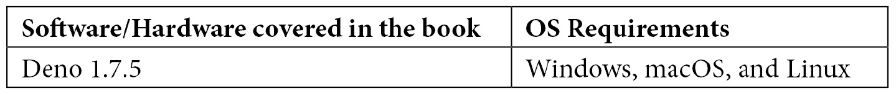

# 序言

Deno 是一个具有安全默认设置和优秀开发者体验的 JavaScript/TypeScript 运行时。

《Deno Web Development》介绍了 Deno 的原生对象、其原则，以及开发者如何使用它们来构建真实世界的应用程序。本书分为三个主要部分：介绍 Deno，从头构建 API，以及测试和部署 Deno 应用程序。到了本书的最后，读者将能够熟练使用 Deno 来创建、维护和部署安全和可靠的 Web 应用程序。

# 本书适合谁阅读

本书面向所有级别的开发者，他们希望在自己的 JavaScript 和 TypeScript 技能中利用一个安全、简单和现代化的运行时，用于 Web 开发。

# 本书涵盖内容

第一章，《什么是 Deno？》，提供了关于 Node.js 的历史背景和导致 Deno 诞生的动机，展示了运行时架构和原则。

第二章，《工具链》，介绍了如何安装 Deno，并探索了包含在运行时二进制文件中的工具。

第三章，《运行时和标准库》，解释了如何使用 Deno 的运行时和标准库函数编写简单的脚本和应用程序。

第四章，《构建 Web 应用程序》，展示了如何使用标准库 HTTP 模块为 Web 应用程序设置基础。

第五章，《添加用户并迁移到 Oak》，讨论了使用流行的 HTTP 库 oak 来构建 REST API，并向应用程序添加持久性和用户。

第六章，《添加身份验证并连接数据库》，讨论了添加对身份验证的支持以及经过身份验证的端点，并连接到 MongoDB 数据库。

第七章，《HTTPS，提取配置和 Deno 在浏览器中》，讨论了启用 HTTPS，基于文件和环境处理配置，以及在浏览器中使用 Deno 代码。

第八章，《测试 – 单元和集成》，涵盖了为前面章节中编写的模块编写和运行单元和集成测试。

第九章，《部署 Deno 应用程序》，介绍了配置容器环境以及自动化部署 Deno 应用程序，使其在云环境中运行。

第十章，《接下来是什么？》，概述了我们在本书中学到的内容，介绍了 Deno 的路线图，解释了如何将模块发布到 Deno 的官方注册表，并带你了解 Deno 的未来和社区。

# 为了最大化本书的收益

本书中的所有代码示例都是在 macOS 上的 Deno 1.7.5 上测试的，但它们应该在 Deno 的未来版本中工作。在本书的过程中还使用了几个第三方包。使用它们的示例也适用于软件的新版本。

本书将为所有使用的软件提供安装说明。



本书的代码是使用 VS Code（[`code.visualstudio.com/`](https://code.visualstudio.com/)）编写的，以便在使用官方 Deno 扩展时获得最佳体验。这不是一个要求，任何代码编辑器都可以跟随本书。

**如果您使用本书的数字版本，我们建议您亲自输入代码或通过 GitHub 存储库访问代码（下一节中有链接）。这样做可以帮助您避免与复制和粘贴代码相关的潜在错误。**

您应该熟悉使用 JavaScript 并具有 TypeScript 的基本知识。不需要 Node.js 知识，但可能会有所帮助。

# 下载示例代码文件

您可以从[www.packt.com](http://www.packt.com)您的账户上下载本书的示例代码文件。如果您在其他地方购买了此书，可以访问[www.packtpub.com/support](http://www.packtpub.com/support)并注册，以便将文件直接发送给您。

您可以按照以下步骤下载代码文件：

1.  登录或注册[www.packt.com](http://www.packt.com)。

1.  选择**支持**标签。

1.  点击**代码下载**。

1.  在**搜索**框中输入书籍名称，并按照屏幕上的指示操作。

下载文件后，请确保使用最新版本解压缩或提取文件夹：

+   对于 Windows，请使用 WinRAR/7-Zip

+   Zipeg/iZip/UnRarX for Mac

+   7-Zip/PeaZip for Linux

本书的代码包也托管在 GitHub 上，地址为[`github.com/PacktPublishing/Deno-Web-Development`](https://github.com/PacktPublishing/Deno-Web-Development)。如果代码有更新，它将在现有的 GitHub 存储库上进行更新。

我们还有其他来自我们丰富的书籍和视频目录的代码包，地址为[`github.com/PacktPublishing/`](https://github.com/PacktPublishing/)。查看它们！

# 使用的约定

本书中使用了多种文本约定。

`文本中的代码`：表示文本中的代码单词，数据库表名，文件夹名，文件名，文件扩展名，路径名，假 URL，用户输入和 Twitter 处理程序。例如："在`deps.ts`文件中添加`oak-middleware-jwt`并导出`jwtMiddleware`函数。"

代码块如下所示设置：

```js
const apiRouter = new Router({ prefix: "/api" })
apiRouter.use(async (_, next) => {
  console.log("Request was made to API Router");
  await next();
}))
…
app.use(apiRouter.routes());
app.use(apiRouter.allowedMethods());
```

当我们希望引起您对代码块中的特定部分的关注时，相关的行或项目将被加粗：

```js
const app = new Application();
app.use(async (ctx, next) => {
  const start = Date.now();
  await next();
  const ms = Date.now() - start;
  ctx.response.headers.set("X-Response-Time", `${ms}ms`);
});
…
app.use(apiRouter.routes());
app.use(apiRouter.allowedMethods());
```

以下写出命令行输入或输出：

```js
$ deno --version 
deno 1.7.5 (release, x86_64-apple-darwin) 
v8 9.0.123 
typescript 4.1.4
```

**粗体**：表示新术语、重要词汇或您在屏幕上看到的词汇。例如，菜单或对话框中的词汇在文本中会以这种方式出现。这是一个示例：“如果您使用过 MongoDB，您可以在 Atlas 界面上通过访问**集合**菜单来查看您创建的用户。”

提示或重要注释

像这样出现。

# 联系我们

读者反馈总是受欢迎的。

**一般反馈**：如果您对本书的任何方面有疑问，请在消息的主题中提及书名，并通过 customercare@packtpub.com 向我们发送电子邮件。

**勘误**：尽管我们已经竭尽全力确保内容的准确性，但错误仍然可能发生。如果您在这本书中发现了错误，我们将非常感激如果您能向我们报告。请访问[www.packtpub.com/support/errata](http://www.packtpub.com/support/errata)，选择您的书籍，点击“勘误表提交表单”链接，并输入详细信息。

**盗版**：如果您在互联网上以任何形式遇到我们作品的非法副本，我们将非常感激如果您能提供位置地址或网站名称。请通过 copyright@packt.com 与我们联系，并提供材料的链接。

**如果您有兴趣成为作者**：如果您在某个主题上有专业知识，并且您有兴趣撰写或贡献一本书，请访问[authors.packtpub.com](http://authors.packtpub.com)。

# 评论

请留下评论。一旦您阅读并使用了这本书，为什么不在这本书购买的网站上留下评论呢？潜在的读者可以看到并使用您公正的意见来做出购买决策，我们 Packt 可以了解您对我们产品的看法，我们的作者可以看到您对他们书籍的反馈。谢谢！

关于 Packt 的更多信息，请访问[packt.com](http://packt.com)。
