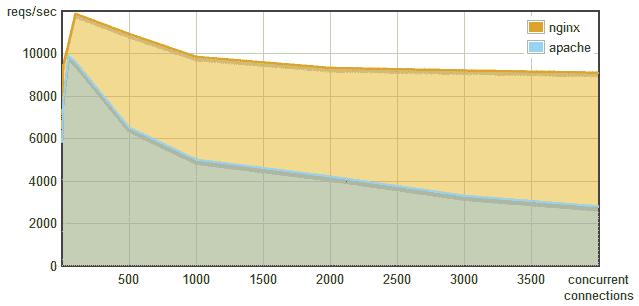
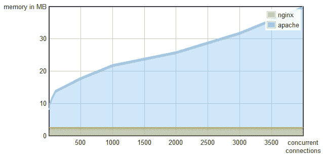
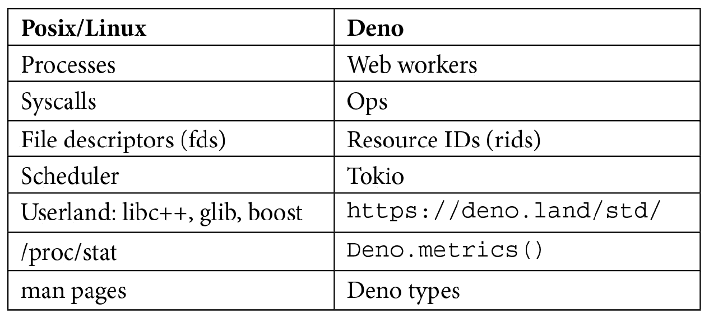
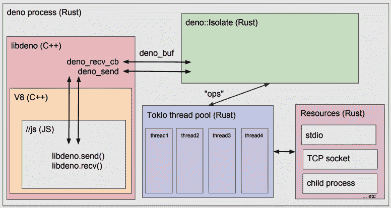

# 第一章：Deno 是什么？

Deno 是一个安全的 JavaScript 和 TypeScript 运行时。我猜你可能对这个实验新工具感到兴奋。你已经使用过 JavaScript 或 TypeScript，至少听说过 Node.js。Deno 对你来说将感觉 novelty 正好合适，同时对于在生态系统中工作的人来说，有些东西听起来会很熟悉。

在我们开始动手之前，我们将了解 Deno 是如何创建的以及它的动机。这样做将帮助我们更好地学习和理解它。

在这本书中，我们将重点关注实际示例。我们将编写代码，然后解释我们做出的一些决策背后的原因。如果你来自 Node.js 背景，有些概念可能对你来说很熟悉。我们还将解释 Deno 并与它的祖先 Node.js 进行比较。

一旦基础知识确立，我们将深入研究 Deno，并通过构建小型工具和实际应用程序来探索其运行时功能。

没有 Node，就没有 Deno。要深入了解后者，我们不能忽视它的 10 多年的祖先，这就是我们将在本章中要探讨的。我们将解释它在 2009 年创建的原因以及在使用十年后检测到的痛点。

之后，我们将介绍 Deno 及其解决的基本差异和挑战。我们将查看其架构、一些运行时的原则和影响以及它擅长的用例。

在了解 Deno 是如何诞生的之后，我们将探讨它的生态系统、标准库以及 Deno 可以发挥重要作用的一些用例。

阅读完这一章后，您将了解 Deno 是什么，它不是什么，为什么它不是 Node.js 的下一个版本，以及当您考虑将 Deno 用于下一个项目时应该考虑什么。

在本章中，我们将涵盖以下主题：

+   一点历史

+   为什么是 Deno？

+   支持 Deno 的架构和技术

+   掌握 Deno 的限制

+   探索 Deno 的使用案例

让我们开始吧！

# 一点历史

Deno 的第一个稳定版本，v1.0.0，于 2020 年 5 月 13 日发布。

瑞安·达尔（Ryan Dahl）--Node.js 的创建者--第一次提到它是在他著名的演讲《关于 node.js 我后悔的 10 件事》中（[`youtu.be/M3BM9TB-8yA`](https://youtu.be/M3BM9TB-8yA)）。除了它展示了 Deno 的第一个非常原始版本之外，这个演讲也是值得一看的，因为它是一堂关于软件如何衰老的课。它很好地反映了决策是如何随着时间演变，即使它们是由开源社区中最聪明的人做出的，并且最终可能会走向与最初计划不同的方向。

在 2020 年 5 月发布后，由于其历史背景、核心团队以及吸引 JavaScript 社区的事实，Deno 受到了很多关注。这可能是你听说的其中一种方式，无论是通过博客文章、推文还是会议演讲。

这种热情对其运行时产生了积极影响，许多人想要贡献和使用它。由于其 Discord 频道（[`discord.gg/deno`](https://discord.gg/deno)）和 Deno 存储库的拉取请求数量（[`github.com/denoland`](https://github.com/denoland)），社区正在增长。目前，它以每月一个次要版本的速度发展，交付了大量修复和改进。路线图展示了一个未来，这同样令人兴奋。凭借明确定义的路径和原则，Deno 拥有发展成为越来越重要角色的所有条件。

让我们回溯一点，回到 2009 年 Node.js 的创建。

当时，Ryan 开始质疑大多数后端语言和框架是如何处理 I/O（输入/输出）的。大多数工具将 I/O 视为一个同步操作，阻塞进程直到完成，然后继续执行代码。

从根本上说，正是这种同步阻塞操作引起了 Ryan 的质疑。

## 处理 I/O

当你编写必须处理每秒数千个请求的服务器时，资源消耗和速度是两个重要的因素。

对于这样的资源关键项目，重要的是基本工具——原语——具有考虑这一点的架构。当扩展时间到来时，最初做出的基本决策支持这一点是有帮助的。

Web 服务器就是这种情况之一。Web 是当今世界的一个重要平台。它从未停止增长，每天都有更多设备和新技术上网，使更多人可以访问它。Web 是世界各地人民的共同、民主、去中心化的基础。有了这个目标，这些应用程序和网站背后的服务器需要处理巨大的负载。像 Twitter、Facebook 和 Reddit 这样的 Web 应用程序以及其他许多应用程序，每分钟处理数千个请求。因此，扩展是必不可少的。

为了激发关于性能和资源效率的讨论，让我们来看看以下图表，该图表比较了最常用的两个开源 Web 服务器：Apache 和 Nginx：



图 1.1 – 每秒请求数与并发连接数 – Nginx 对 Apache

乍一看，这告诉我们 Nginx 几乎每次都能名列前茅。我们还可以理解，随着并发连接数目的增加，Apache 每秒请求数会下降。相比之下，Nginx 每秒请求数保持相对稳定，尽管随着连接数目的增加，每秒请求数也显示出预期的下降。达到一千个并发连接后，Nginx 的每秒请求数几乎达到 Apache 的两倍。

让我们看看 RAM 内存消耗的比较：



图 1.2 – 内存消耗与并发连接数——Nginx 与 Apache 的对比

Apache 的内存消耗随着并发连接数的*线性*增长，而 Nginx 的内存占用是恒定的。

你可能已经在好奇这是为什么。

之所以这样，是因为 Apache 和 Nginx 在处理并发连接的方式上有很大的不同。Apache 每个请求都会创建一个新的线程，而 Nginx 则使用事件循环。

在*每个请求一个线程*架构中，每当有一个新请求进来时，它就会创建一个线程。那个线程负责处理请求直到完成。如果另一个请求在之前的请求还在处理时到来，将会创建一个新的线程。

此外，在多线程环境中处理网络编程并不被认为是特别容易的事情。你可能会遇到文件和资源锁定、线程通信问题以及常见的死锁等问题。对于开发者来说，已经够棘手了，使用线程也不是免费的，因为线程本身就有资源开销。

相比之下，在事件循环架构中，一切都在单个线程上发生。这个决定极大地简化了开发人员的生活。你不需要考虑前面提到的因素，这意味着你可以有更多的时间来处理用户的问题。

通过使用这种模式，Web 服务器只需将事件发送到事件循环。它是一个异步队列，当有可用资源时执行操作，在操作完成后异步返回代码。为了让这工作，所有操作都需要是非阻塞的，意味着它们不应该等待完成，只是发送一个事件并稍后等待响应。

### 阻塞与非阻塞

以读取文件为例。在一个阻塞环境中，你会读取文件，并让进程等待它完成直到执行下一行代码。当操作系统读取文件内容时，程序处于空闲状态，浪费了宝贵的 CPU 周期：

```js
const result = readFile('./README.md');
// Use result
```

程序会等待文件被读取，然后继续执行代码。

使用事件循环执行相同操作的是触发“读取文件”事件并执行其他任务（例如，处理其他请求）。当文件读取操作完成后，事件循环将调用回调函数并返回结果。这次，运行时在操作系统检索文件内容时处理其他请求，更好地利用资源：

```js
const result = readFileAsync('./README.md', function(result) {
  // Use result
});
```

在这个例子中，任务被分配了一个回调。当任务完成（这可能需要几秒或几毫秒）时，它会调用回调函数并返回结果。当这个函数被调用时，里面的代码是线性运行的。

### 为什么事件循环没有被更广泛地使用呢？

既然我们已经理解了事件循环的优势，这是一个非常合理的疑问。尽管在 Python 和 Ruby 中有一些实现，事件循环没有被更广泛地使用的原因之一是，它们需要所有基础架构和代码都是非阻塞的。非阻塞意味着不要同步执行代码。它意味着触发事件，并在稍后的某个时间点处理结果。

除此之外，许多常用的语言和库并不提供异步 API。许多语言中没有回调，像 C 这样的编程语言中也不存在匿名函数。当今软件的至关重要部分，例如 `libmysqlclient`，即使其内部部分可能使用异步任务执行，也不支持异步操作。异步 DNS 解析也是许多系统并非标准的另一个例子。作为另一个例子，你可能认为操作系统的手动页面就是如此。其中大多数甚至不提供了解特定函数是否执行 I/O 的方法。这些都是当今许多基础软件组件中不存在异步 I/O 能力的证据。

甚至提供这些功能的现有工具也要求开发者对异步 I/O 模式有深入的了解才能使用事件循环。像 `libmysqlclient` 示例中那样绕过技术限制来让某物工作是一项艰巨的任务。

### JavaScript 前来救援

JavaScript 是由布兰登·艾 ich（Brendan Eich）在 1995 年为网景工作时创建的。起初它只在浏览器中运行，并允许开发者在网页中添加交互式功能。它由一些揭示为非常适合事件循环的元素组成：

+   它有匿名函数和闭包。

+   它一次只执行一个回调。

+   I/O 通过回调（例如，`addEventListener`）在 DOM 上进行。

结合了语言这三个基本方面使得事件循环对于任何习惯了在浏览器中使用 JavaScript 的人来说都是自然而然的事情。

语言特性最终使得其开发者倾向于事件驱动编程。

## Node.js 登上舞台

在所有关于 I/O 以及应该如何处理它的思考和问题之后，瑞恩·达尔（Ryan Dahl）在 2009 年提出了 Node.js。它是一个基于谷歌 V8 的 JavaScript 运行时 - 一个将 JavaScript 带到服务器的 JavaScript 引擎。

Node.js 设计上是异步和单线程的。它有一个事件循环作为其核心，并以一种可扩展的方式呈现，用于开发可以处理成千上万个并发请求的后端应用程序。

事件循环为我们提供了一种干净的方式来处理并发问题，在这方面 Node.js 与 PHP 或 Ruby 等工具不同，后者使用每个请求一个线程的模型。这个单线程环境让 Node.js 用户可以不必关心线程安全问题。它非常成功地抽象了事件循环以及所有同步工具的问题，用户几乎不需要了解事件循环本身。Node.js 通过利用回调和最近承诺（promises）的运用实现了这一点。

Node.js 将自己定位为为用户提供一个低级别的、纯粹的事件驱动的、非阻塞的基础设施，让他们编程自己的应用程序。

### Node.js 的崛起

告诉公司和开发者们他们可以利用已有的 JavaScript 知识迅速地编写服务器，这导致了 Node.js 的流行度上升。

自从它被发布并开始被不同规模的公司在生产环境中使用以来，这种语言很快地发展进化。

在 2011 年 Node.js 创建后的仅仅两年，Uber 和 LinkedIn 就已经在服务器上运行 JavaScript 了。2012 年，Ryan Dahl 辞去了 Node.js 社区的日常运营工作，以便致力于研究和其它项目。

据估计，到 2017 年，运行 Node.js 的实例超过 880 万个（来源：[`blog.risingstack.com/history-of-node-js/`](https://blog.risingstack.com/history-of-node-js/)）。今天，从**Node 包管理器**（**npm**）下载的包已经超过 1030 亿个，发布的包大约有 146 万 7527 个。

Node.js 是一个很好的平台，这一点毫无疑问。基本上任何使用过它的人都会体验到它的许多优点。流行度和社区在其中扮演了重要的角色。有很多不同经验水平和背景的人一起协作开发某项技术，这只能推动它向前发展。这就是 Node.js 所发生的，并且仍然在发生的事情。

Node.js 让开发者们可以用 JavaScript 去实现很多之前不可能的用途。这从机器人技术，到加密货币，到代码打包器，API 等等都有涉及。它是一个稳定的环境，让开发者们感到高效且速度快。它将继续它的使命，在未来很多年里支持不同规模的公司和企业。

但既然你买了这本书，那说明你相信 Deno 有一些值得探索的东西，我可以保证它确实如此。

你可能会想，既然之前的解决方案已经足够令人满意，为什么还要提出一个新的解决方案呢？我们接下来就会发现答案。

# 为什么是 Deno？

自从 Node.js 创建以来，许多事情已经改变。十多年过去了，JavaScript 也发生了变化，软件基础设施社区也是如此。像 Rust 和 golang 这样的语言诞生了，它们在软件社区中是非常重要的发展。这些语言使得生产本地机器代码变得容易，同时为开发者提供一个严格和可靠的环境。

然而，这种严格性是以生产率为代价的。并不是说开发者写这些语言时不觉得生产率低，因为他们确实觉得有生产力，但你可以很容易地争论，生产率是动态语言明显占优势的领域。

动态语言的开发便捷和速度使它们在脚本和原型设计方面成为非常强劲的竞争者。而当考虑到动态语言时，JavaScript 立刻浮现在脑海中。

JavaScript 是最常用的动态语言，它可以在任何装有网络浏览器的设备上运行。由于它的广泛使用和庞大的社区，人们对它进行了许多优化工作。诸如 ECMA International 等组织的创建确保了该语言稳定而谨慎地发展。

正如我们在上一节所看到的，Node.js 在将 JavaScript 带到服务器上扮演了非常成功的角色，为大量不同的用例打开了大门。它目前用于许多不同的任务，包括网络开发工具、创建网络服务器和脚本，等等。在其创建之初，为了启用这些用例，Node.js 必须为 JavaScript 发明之前不存在概念。后来，这些概念由标准化组织讨论，并以不同的方式添加到语言中，使得 Node.js 的部分内容与其母语言 ECMAScript 不兼容。十年过去了，ECMAScript 也发生了变化，围绕它的生态系统也是如此。

**CommonJS**模块不再是标准；JavaScript 现在有 ES 模块。**TypedArrays**现在已经存在，最终，JavaScript 可以直接处理二进制数据。Promises 和 async/await 是处理异步操作的首选方法。

这些功能在 Node.js 上是可用的，但它们必须与 2009 年创建的非标准功能共存，这些功能仍然需要维护。这些功能以及 Node.js 的大量用户使得系统的发展变得困难且缓慢。

为了解决这些问题，并跟上 JavaScript 语言的发展，许多社区项目被创建出来。这些项目使我们能够使用该语言的最新特性，但在许多 Node.js 项目中加入了诸如构建系统的东西，使得它们变得非常复杂。引用 Dahl 的话，“*夺走了动态语言脚本的美好*。”

超过 10 年的广泛使用也清楚地表明，运行时的一些基本构建设需要改进。缺乏安全沙箱是主要问题之一。在创建 Node.js 的时候，JavaScript 可以通过在 V8（它背后的 JavaScript 引擎）中创建绑定来访问“外部世界”。尽管这些绑定使 JavaScript 能够实现诸如从文件系统读取、访问网络等 I/O 功能，但它们也打破了 JavaScript 沙箱的目的。这个决定使得让开发者控制 Node.js 脚本可以访问的内容变得非常困难。例如，在当前状态下，没有办法阻止 Node.js 脚本中的第三方包读取用户可以访问的所有文件，以及其他恶意行为。

十年后，Ryan Dahl 和 Deno 背后的团队怀念一个既有趣又高效的脚本环境，可以用于执行各种任务。团队还觉得 JavaScript 景观已经发生了足够大的变化，简化是有价值的，因此他们决定创建 Deno。

## 介绍 Deno

"Deno 是一个简单、现代且安全的 JavaScript 和 TypeScript 运行时，它使用了 V8 引擎，并内置了 Rust 构建。" – [`deno.land/`](https://deno.land/)

Deno 的名称是通过反转其前身 no-de 的音节而构成的，即 de-no。从它的前身那里学到了很多教训，Deno 提出了以下主要特性：

+   默认情况下是安全的

+   一等 TypeScript 支持

+   单一的可执行文件

+   提供编写应用程序的基本工具

+   完整且经过审计的标准库

+   与 ECMAScript 和浏览器环境的兼容性

默认情况下，Deno 是安全的，并且是按照设计来创建的。它最终利用了 V8 沙箱，并提供了一个严格的权限模型，使开发者能够精确控制代码可以访问的内容。

TypeScript 也得到了一等支持，这意味着开发者可以选择不进行任何额外配置就使用 TypeScript。Deno 的所有 API 也都是用 TypeScript 编写的，因此具有正确和精确的类型和文档。标准库也是如此。

Deno 带有一个单一的可执行文件，其中包含了编写应用程序所需的所有基本工具；它总是这样。团队努力保持可执行文件的小巧（约 15 MB），以便我们可以在各种情况和环境中使用它，从简单的脚本到完整的应用程序。

不仅仅是执行代码，Deno 二进制文件提供了一整套开发者工具，具体包括一个代码检查器、一个格式化工具和一个测试运行器。

Go 语言精心打磨的标准库激发了 Deno 标准库的灵感。与 Node.js 的标准库相比，Deno 的标准库故意设计得更大、更完整。这个决定是为了应对一些 Node.js 项目中曾经出现的庞大的依赖树。Deno 的核心团队认为，通过提供一个稳定且完整的标准库，可以帮助解决这个问题。通过移除创建第三方包来处理常见用例的需求，该平台默认提供了这些功能，从而旨在减少使用大量第三方包的必要性。

为了与 ES6 和浏览器保持兼容，Deno 努力模仿浏览器 API。执行 HTTP 请求、处理 URL 或编码文本等工作，可以通过使用你在浏览器中会使用的相同 API 来完成。Deno 团队故意努力保持这些 API 与浏览器同步。

旨在提供三者的最佳特性，Deno 提供了 JavaScript 的原型能力和开发者体验，TypeScript 的类型安全和安全性，以及 Rust 的性能和简洁性。

理想情况下，正如 Dahl 在他的一次谈话中提到的，代码应该遵循从原型到生产的以下流程：开发者可以开始写 JavaScript，迁移到 TypeScript，最终得到 Rust 代码。

在撰写本文时，只能运行 JavaScript 和 TypeScript。Rust 只能通过一个（仍然不稳定的）插件 API 来使用，这可能在不太遥远的将来可能会变得稳定。

## 命令行脚本的网络浏览器。

随着时间的推移，Node.js 模块系统演变成现在过于复杂且维护痛苦的东西。它考虑了诸如导入文件夹、搜索依赖项、导入相对文件、搜索 index.js、第三方包和读取`package.json`文件等边缘情况。

它也与**npm**（**Node 包管理器**）紧密耦合，后者最初是 Node.js 的一部分，但在 2014 年分离出来。

拥有一个集中式的包管理器并不非常符合网络化，借用 Dahl 的话来说。数百万应用程序依赖于一个单一的注册表来生存，这是一个负担。

Deno 通过使用 URL 来解决这个问题。它采取了一种与浏览器非常相似的方法，只需要一个到文件的绝对 URL 就可以执行或导入代码。这个绝对 URL 可以是本地、远程或基于 HTTP 的，并包括以下文件扩展名：

```js
import { serve } from 'https://deno.land/std@0.83.0/http/server.ts'
```

前面的代码碰巧就是你在浏览器中在`<script>`标签内想要引入 ES 模块时会写的相同代码。

关于安装和离线使用，Deno 通过使用本地缓存确保用户不必为此担心。当程序运行时，它会安装所有必需的依赖项，从而消除了安装步骤。我们稍后会在第二章更深入地探讨这一点，*工具链*。

现在我们已经熟悉了 Deno 是什么以及它解决的问题，我们就可以深入了解。通过了解幕后发生的事情，我们可以更好地理解 Deno 本身。

在下一节中，我们将探讨支持 Deno 的技术以及它们是如何连接的。

# 支持 Deno 的架构和技术

从架构上讲，Deno 考虑了诸如安全等各种主题，如与底层操作系统通信的干净且高效的通信方式，而不会泄露细节给 JavaScript 端。为了实现这一点，Deno 使用消息传递从 V8 内部与 Deno 后端通信。后端是用 Rust 编写的组件，与事件循环交互，进而与操作系统交互。

Deno 是由四项技术实现的：

+   V8

+   TypeScript

+   Tokio (事件循环)

+   Rust

正是这四个部分的结合，使得它能够在保证代码安全和沙盒化的同时，为开发者提供出色的体验和开发速度。如果你不熟悉这些技术，我会留下一个简短的定义：

**V8** 是谷歌开发的 JavaScript 引擎。它用 C++编写，可以在所有主流操作系统上运行。它还是 Chrome、Node.js 等浏览器的引擎。

**TypeScript** 是微软开发的一种超集 JavaScript，它为语言添加了可选的静态类型，并*编译*成 JavaScript。

**Tokio** 是为 Rust 提供编写任何规模网络应用程序的异步运行时。

**Rust** 是 Mozilla 设计的专注于性能和安全的服务器端语言。

使用快速发展语言 Rust 编写 Deno 的核心，使其比 Node.js 更受开发者欢迎。Node.js 的核心是用 C++编写的，这并不以特别容易处理著称。由于许多陷阱和不太好的开发者体验，C++在 Node.js 核心的发展中显示出是一个小障碍。

`Deno_core`作为 Rust crate（包）分发。Rust 与 Rust 之间的这种联系并非巧合。Rust 提供了许多功能，使与 JavaScript 的连接变得容易，并增加了 Deno 本身的 capabilities. Asynchronous operations in Rust typically use Futures that map very well with JavaScript Promises. Rust is also an embeddable language, and that provides direct embedding capabilities to Deno. This added to Rust being one of the first languages to create a compiler for *WebAssembly*, made the Deno team choose it for its core.

## 来自 POSIX 系统的灵感

POSIX 系统对 Deno 有很大的启发。在他的一次演讲中，Dahl 甚至提到 Deno 处理某些任务*“就像一个操作系统”*。

下面的表格显示了来自 POSIX/Linux 系统的标准术语以及它们如何映射到 Deno 概念：



一些来自 Linux 世界的概念你可能很熟悉。比如说进程。它们代表了一个正在运行的程序的实例，该程序可能使用一个或多个线程执行。Deno 使用 WebWorker 在运行时完成同样的任务。

在第二行，我们有系统调用。如果你不熟悉它们，它们是程序向内核发出请求的方式。在 Deno 中，这些请求并不直接发送到内核；相反，它们从 Rust 核心发送到底层操作系统，但它们的工作方式相似。我们接下来有机会在即将到来的架构图中看到这一点。

这些都是如果你熟悉 Linux/POSIX 系统你可能认出的几个例子。

我们将在本书的剩余部分解释和使用上述大部分 Deno 概念。

## 架构

Deno 的核心最初是用 *golang* 编写的，但后来改用 Rust。这个决定是为了摆脱 *golang*，因为它是一个垃圾收集语言。它与 V8 的垃圾收集器的组合可能会导致未来的问题。

为了了解底层技术如何相互作用形成 Deno 核心，让我们看一下以下架构图：



图 1.3 – Deno 架构

Deno 使用消息传递与 Rust 后端进行通信。作为一个关于权限隔离的决策，Deno 从不向 Rust 暴露 JavaScript 对象句柄。V8 内部和外部的所有通信都使用 `Uint8Array` 实例。

对于事件循环，Deno 使用 Tokio，一个 Rust 线程池。Tokio 负责处理 I/O 工作和回调 Rust 后端，使其能够异步处理所有操作。**操作**（**ops**）是 Rust 和事件循环之间来回传递的消息的名称。

所有从 Deno 代码发送到其核心（用 Rust 编写）的异步消息都会返回**承诺**给 Deno。更准确地说，Rust 中的异步操作通常返回**未来**，Deno 将它们映射到 JavaScript 承诺。每当这些**未来**被解决，JavaScript 的**承诺**也同样被解决。

为了使 V8 能够向 Rust 后端发送消息，Deno 使用 `rusty_v8`，这是由 Deno 团队创建的 Rust 库，它提供了 V8 到 Rust 的绑定。

Deno 还将在 V8 内部包含 TypeScript 编译器。它使用 V8 快照进行启动时间优化。快照用于在特定的执行时间保存 JavaScript 堆，并在需要时恢复它。

自从它首次提出以来，Deno 一直受到迭代、进化过程的制约。如果你好奇它变化了多少，你可以查看 2018 年由 Ryan Dahl 写的最初路线图文档([`github.com/ry/deno/blob/a836c493f30323e7b40e988140ed2603f0e3d10f/Roadmap.md`](https://github.com/ry/deno/blob/a836c493f30323e7b40e988140ed2603f0e3d10f/Roadmap.md))。

现在，我们不仅知道 Deno 是什么，也知道它背后的幕后工作。这些知识将帮助我们在将来运行和调试我们的应用程序。Deno 的创造者做出了许多技术和架构决策，将 Deno 带到今天这个状态。这些决策推动了运行时的进步，并确保 Deno 在几种情况下都能表现出色，其中一些我们稍后会探讨。然而，为了使其在某些用例中表现良好，必须做出一些权衡。这些权衡导致了我们接下来要探讨的限制。

# 掌握 Deno 的限制

正如所有事情一样，选择解决方案是处理权衡的问题。那些最适合我们正在编写的项目和应用程序的解决方案是我们最终会使用的。目前，Deno 有一些限制；有些是由于它短暂的寿命，其他则是因为设计决策。像大多数解决方案一样，Deno 也不是一个万能的工具。在接下来的几页中，我们将探讨 Deno 当前的一些限制以及背后的动机。

## 不如 Node.js 稳定

在当前状态下，Deno 在稳定性方面无法与 Node.js 相提并论，这是显而易见的原因。Node.js 有超过 10 年的发展，而 Deno 只剩下接近两年的寿命。

尽管本书中介绍的大部分核心功能已经被认为是稳定且版本正确的，但仍然有一些功能可能会发生变化，并且标有不稳定标志。

Node.js 多年的经验确保了它经过了实战考验，并且可以在最多样化的环境中工作。这是我们希望 Deno 能够获得的，但时间和采用是关键因素。

## 更好的 HTTP 延迟，但吞吐量更差

Deno 从一开始就保持性能。然而，如基准页面所示（[`deno.land/benchmarks`](https://deno.land/benchmarks)），在某些主题上，它仍然不是 Node.js 的水平。

它的祖先利用了直接与 C++绑定在 HTTP 服务器上，从而提高这个性能分数。由于 Deno 抵制添加本地的 HTTP 绑定并在本地的 TCP 套接字之上构建，它仍然承受着性能上的惩罚。这个决定是团队计划在优化 TCP 套接字通信之后解决的问题。

Deno HTTP 服务器每秒处理大约 25k 个请求，最大延迟为 1.3 毫秒，而 Node.js 处理 34k 个请求，但延迟在 2 到 300 毫秒之间变化。

我们无法说每秒 25k 请求不够，尤其是当我们使用 JavaScript 时。如果你的应用/网站需要的请求量超过这个数字，那么 JavaScript，以及因此 Deno，可能不是这个工作的正确工具。

## 与 Node.js 的兼容性

由于许多已经引入的更改，Deno 不提供与现有 JavaScript 包和工具的兼容性。一个兼容层正在标准库上创建，但它仍然远远没有完成。

由于 Node.js 和 Deno 是两个非常相似的系统，有着共同的目标，我们预计随着时间的推移，Deno 将能够默认执行越来越多的 Node.js 程序。然而，尽管目前有些 Node.js 代码是可以运行的，但目前并非如此。

## TypeScript 编译器速度

如我们之前提到的，Deno 使用 TypeScript 编译器。它作为运行时最慢的部分表现出来，尤其是与 V8 解释 JavaScript 的时间相比。快照在这方面有所帮助，但这还不够。Deno 的核心团队认为他们可能需要将 TypeScript 编译器迁移到 Rust 来解决这个问题。

由于完成这项任务需要做大量的工作，这可能不会很快实现，尽管这应该是使其启动时间快得多的事情之一。

## 缺乏插件/扩展

尽管 Deno 有一个插件系统来支持自定义操作，但它还没有完成，被认为是不稳定的。这意味着将本地功能扩展到比 Deno 提供的更多是几乎不可能的。

到目前为止，我们应该理解 Deno 目前的限制以及这些限制存在的原因。其中一些可能随着 Deno 的成熟和演变而很快得到解决。其他的则是设计决策或路线图优先级的结果。理解这些限制在决定是否在项目中使用 Deno 时至关重要。在下一节中，我们将看看我们认为 Deno 非常适合的用例。

# 探索用例

正如您可能已经意识到的，Deno 本身与 Node.js 有许多共同的用例。大多数所做的更改都是为了确保运行时更安全、更简单，但随着它利用了大多数相同的技术，拥有相同的引擎，以及许多相同的目标，用例之间的差异不会太大。

然而，尽管差异并不大，可能存在一些微小的细微差别，这使得在特定情况下其中一个比另一个稍微更适合。在本节中，我们将探讨一些 Deno 的用例。

## 灵活的脚本语言

脚本编程是那些解释型语言总是闪耀光芒的功能之一。当我们想要快速原型化某件事时，JavaScript 是完美的。这可以包括重命名文件、迁移数据、从 API 中消费内容等等。它似乎是这些用例的正确工具。

Deno 对脚本编程给予了深思熟虑。运行时本身让用户用它来写脚本变得非常容易，从而在这方面的使用场景中提供了许多好处，特别是与 Node.js 相比。这些好处包括仅用一个 URL 就能执行代码，无需管理依赖项，以及基于 Deno 创建可执行文件的能力。

在此之上，你现在可以导入远程代码，同时控制它使用的权限，这在信任和安全方面是一个重大的步骤。

Deno 的**读取-评估-打印循环** (**REPL**) 是进行实验工作的好地方。在我们之前提到的基础上，二进制文件的小巧以及它包含所有所需工具的事实是蛋糕上的樱桃。

## 更安全的桌面应用程序

尽管插件系统还不稳定，允许开发者创建桌面应用程序的包很大程度上依赖于它，但它非常有前景。

在过去的几年里，我们见证了桌面网络应用程序的兴起。Electron 框架的兴起（[`www.electronjs.org/`](https://www.electronjs.org/)）使可以创建像 VS Code 或 Slack 这样的应用程序。这些是运行在 WebView 中的网页，可以访问本地功能，是许多人日常生活的一部分。

然而，对于用户来说安装这些应用程序，他们必须盲目地信任它们。之前，我们讨论了安全性以及 JavaScript 代码曾经可以访问它运行的所有系统。Deno 在这里从根本上不同，因为由于其沙盒和所有的安全特性，这要安全得多，并且解锁的潜力巨大。

在本书中，我们将探讨如何使用 JavaScript 在 Deno 中构建桌面应用程序的大量进展。

## 编写工具的快速而完整的环境

Deno 的功能使它成为一个非常完整、简单且快速的编写工具的环境。当我们说工具时，这不仅仅是针对 JavaScript 或 TypeScript 项目的工具。由于单一的二进制文件包含了开发应用程序所需的所有内容，我们可以将 Deno 用于 JavaScript 世界之外的生态系统。

它的清晰性、通过 TypeScript 自动生成文档、易于运行以及 JavaScript 的普及性，使 Deno 成为编写工具（如代码生成器、自动化脚本或其他开发工具）的正确组合。

## 在嵌入式设备上运行

通过使用 Rust 并将核心作为 Rust crate 分发，Deno 自动启用了在嵌入式设备上的使用，从 IoT 设备到可穿戴设备和 ARM 设备。再次，它的小巧以及包含所有工具的二进制文件可能是一个巨大的胜利。

箱子可以独立提供的事实允许人们在不同地方嵌入 Deno。例如，当用 Rust 编写数据库并且想要添加 Map-Reduce 逻辑时，我们可以使用 JavaScript 和 Deno 来实现。

## 生成浏览器兼容代码

如果你之前没有看过 Deno，那么这可能是个惊喜。我们不是在谈论服务器端运行时吗？是的。但这个服务器端运行时一直在努力保持 API 的浏览器兼容性。它在工具链中提供了特性，使代码可以写在 Deno 中并在浏览器中执行，这将在第七章 *HTTPS、提取配置和 Deno 在浏览器中* 中探索。

所有的这些工作都由 Deno 团队负责，他们使自己的 API 保持与浏览器兼容，并生成可以在浏览器中打开新可能性集的浏览器代码。浏览器兼容性是我们在本书后面将会使用到的内容，在第七章 *HTTPS、提取配置和 Deno 在浏览器中* 中，通过编写一个完整的应用程序、客户端和服务器来构建一个 Deno 应用程序。（注：这里原文中的“in this book”翻译为“在本书后面”，以保持上下文的连贯性。）

## 全面的 API

Deno 和 Node.js 一样，在处理 HTTP 服务器方面投入了大量精力。拥有一个完整的标准库，为框架提供伟大的基础，毫无疑问，API 是 Deno 最强大的用例之一。TypeScript 在文档、代码生成和静态类型检查方面是一个很好的补充，帮助成熟的代码库扩展。

我们将在本书的剩余部分更多地关注这个具体的用例，因为我相信这是最重要的用例之一——Deno 发挥光彩的地方。

这些都是我们认为 Deno 非常适合的用例的几个例子。与 Node.js 一样，我们也知道还有许多新的用途等待发现。我们很高兴能陪伴这个冒险，并看到它还将揭示什么。

# 总结

在本书这一章中，我们穿越回 2009 年，以理解 Node.js 的创建。在那之后，我们意识到与线程模型相比，为什么要使用事件驱动的方法，以及它带来的优势。我们了解到事件驱动、异步代码是什么，以及 JavaScript 如何帮助 Node.js 和 Deno 充分利用服务器的资源。

在那之后，我们快速浏览了 Node.js 的 10 多年的历史、它的演变以及它的采用开始的情况。我们观察到运行时如何与它的基础语言 JavaScript 一起增长，同时帮助数百万企业将其伟大的产品带给客户。

然后，我们用今天的眼光来看 Node.js，生态和语言发生了什么变化？开发者遇到了哪些痛点？我们深入这些痛点，探讨为什么改变 Node.js 来解决这些问题既困难又缓慢。

随着这一章的进展，Deno 的动机变得越来越明显。在查看了 JavaScript 在服务器端的历史之后，出现一些新东西是合理的——一些可以解决以前经历的痛苦同时保留开发者所喜爱的东西的东西。

最后，我们了解了 Deno，它将成为我们这本书的朋友。我们学习了它的愿景、原则以及它如何解决某些问题。在简要介绍了使其成为可能的基础架构和组件之后，我们不禁要谈论一些权衡和当前的限制。

我们通过列举 Deno 适用的一些用例来结束这一章。稍后在本书中，当我们开始编程时，我们会回到这些用例。从这一章开始，我们的方法将更加具体和实用，始终朝着编写可以运行和探索的代码和示例前进。

既然我们已经了解了 Deno 是什么，我们就有了开始使用它的所有必要条件。在下一章中，我们将设置相应的环境并编写一个 Hello World 应用程序，同时做许多其他令人兴奋的事情。

就是这样，激动人心的冒险开始了，对吧？让我们出发吧！
