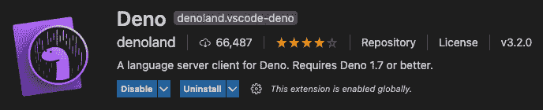
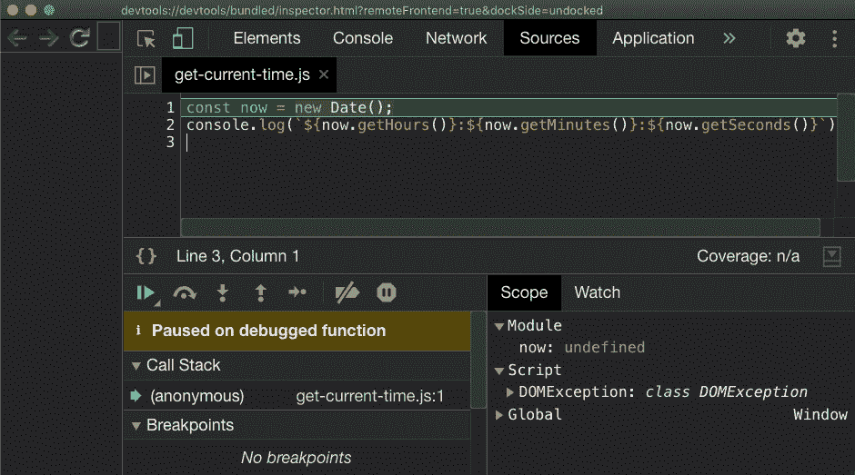
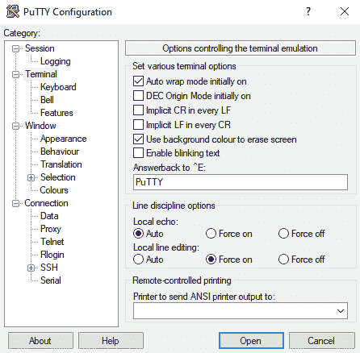
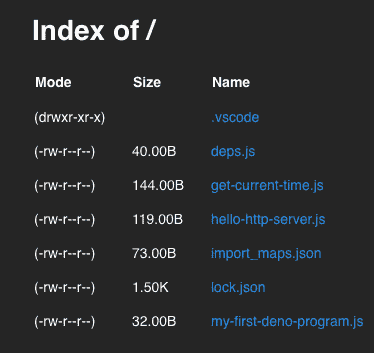

# 第二章：工具链

如今我们熟悉了事件驱动语言，了解了 Node 的历史以及导致 Deno 产生的原因，我们就可以开始写一些代码了。

在本章中，我们首先要做的是设置环境和代码编辑器。我们将通过编写我们的第一个 Deno 程序和使用 REPL 实验运行时 API 来继续。然后，我们将探讨模块系统以及 Deno 缓存和模块解析如何通过实际示例工作。我们将了解版本控制，并将学习如何处理第三方依赖。然后，我们将使用 CLI 探索包及其文档，以及如何安装和重复使用 Deno 脚本。

在运行和安装几个脚本之后，我们将深入研究权限，学习权限系统是如何工作的以及我们如何可以保障我们运行的代码的安全。

在我们了解工具链的过程中，我们不能忽略代码格式化和验尸，所以我们在本章中也将探讨这些主题。我们将通过编写和运行一些简单的测试来探索 Deno 的测试套件，最后介绍 Deno 如何将代码打包成一个自给自足的二进制文件或单个 JavaScript 文件。

在本章中，我们将涵盖以下主题：

+   设置环境

+   安装 VS Code

+   Hello World

+   模块系统和第三方依赖

+   运行和安装脚本

+   使用测试命令

+   使用权限

+   格式化和验尸代码

+   代码打包

+   编译成二进制

+   使用升级命令

让我们开始吧！

# 技术要求

本章中出现的所有代码都可以在 [`github.com/PacktPublishing/Deno-Web-Development/tree/master/Chapter02`](https://github.com/PacktPublishing/Deno-Web-Development/tree/master/Chapter02) 找到。

# 设置环境

Deno 的一个原则是使其单一的可执行文件尽可能完整。这个决定，以及其他决策，大大简化了安装步骤。在本节中，我们将安装 VS Code 和推荐插件，并学习如何在不同的系统上安装 Deno。

## 安装 Deno

在接下来的几页中，我们将学习如何安装 Deno。为了确保本书中写的所有内容都能顺利运行，我们将使用版本 1.7.5。

这是本书中为数不多的部分，根据您的操作系统，事情可能会有所不同。安装完成后，无论您如何安装 Deno，都没有区别。

让我们实际操作并在我们的机器上安装 Deno。下面的子弹点展示了如何在不同的操作系统上安装运行时：

+   **Shell (Mac, Linux)**:

    ```js
    $ curl -fsSL https://deno.land/x/install/install.sh | sh -s v1.7.5
    ```

+   **PowerShell (Windows)**:

    ```js
    $v="1.7.5"; iwr https://deno.land/x/install/install.ps1 -useb | iex
    ```

然后，为了确保一切正常工作，让我们通过运行以下命令来获取当前的 Deno 版本：

```js
$ deno --version
```

我们应该得到以下输出：

```js
$ deno --version 
deno 1.7.5 (release, x86_64-apple-darwin) 
v8 9.0.123 
typescript 4.1.4
```

现在我们已经安装了正确版本的 Deno，我们可以开始编写和执行我们的程序了。然而，为了使我们的体验更加顺畅，我们将安装并配置我们选择的编辑器。

# 安装 VS Code

VS Code 是我们将在这本书中使用的编辑器。这主要是因为它有一个官方的 Deno 插件。还有其他提供 JavaScript 和 TypeScript 愉悦体验的编辑器，所以您可以自由使用它们。

这些步骤不是遵循本书剩余内容的必要步骤，所以请随意跳过它们。要安装它，请按照以下步骤操作：

1.  访问 [`code.visualstudio.com/`](https://code.visualstudio.com/) 并点击 **下载** 按钮。

1.  下载完成后，在您的系统上安装它。

1.  安装 VS Code 后，最后一步是安装 Deno 的 VS Code 插件。

1.  在 `Deno` 上下文中，安装由 Denoland 编写的 Deno 插件，这是官方插件：


](img/Figure_2.1_B16380.jpg)

图 2.1 – VS Code 左侧栏的插件图标

这就是 Deno 的 VS Code 插件的样子：



图 2.2 – Deno 在 VS Code 市场中的扩展

要在你项目中启用 Deno 插件，你必须创建一个本地 VS Code 文件夹，该文件夹将包含工作区配置文件。为此，我们将创建一个名为 `.vscode` 的文件夹，并在其中创建一个名为 `settings.json` 的文件，并在该文件中写入以下内容：

```js
{
 "deno.enable": true
}
```

这将使 VS Code 激活当前文件夹内的扩展。在使用不稳定特性时，我们还可以启用 `deno.unstable` 设置，这也在插件文档中提到。

## 壳牌补全

Deno 还为我们提供了一种生成壳牌补全的方法。这样，在终端中编写 Deno 命令时，我们将获得自动完成建议。我们可以通过运行以下命令来实现：

```js
$ deno completions <shell>
```

`shell` 的可能值有 `zsh`、`bash`、`fish`、`powershell` 和 `elvish`。确保你选择你正在使用的那个。此命令将输出补全内容到标准输出。然后你可以将内容粘贴到你的 shell 配置文件中([`deno.land/manual@v1.7.5/getting_started/setup_your_environment#shell-autocomplete`](https://deno.land/manual@v1.6.0/getting_started/setup_your_environment#shell-autocomplete))。

有了这些，我们已经完成了如何安装 Deno 的步骤。我们还安装并配置了运行时和编辑器。现在，让我们用 Deno 编写一个 Hello World 程序！

# Hello World

一切准备就绪后，让我们编写我们的第一个程序！

首先，我们需要创建一个名为 `my-first-deno-program.js` 的文件，并写一些我们熟悉的内容。我们将使用 `console` API 将消息写入控制台：

```js
console.log('Hello from deno');
```

要执行此操作，让我们使用前面章节中安装的 CLI。我们必须使用名为 `run` 的命令来执行程序：

```js
$ deno run my-first-deno-program.js
Hello from deno
```

提示

所有 Deno CLI 命令都可以使用 `--help` 标志执行，这将详细说明命令的所有可能行为。

至此，我们实际上并没有做任何我们不知道该做什么的事情。我们只是用我们熟悉的 JavaScript 语言编写了一个 `console.log` 文件。

有趣的是，我们已经学会了使用`run`命令来执行程序。我们稍后在本书中详细探讨这个。

### 重新加载

**阅读-评估-打印循环**，也称为**REPL**，是在解释型语言中常用的工具。它允许用户运行代码行并获得即时输出。Node.js、Ruby 和 Python 是几个大量使用它的语言例子。Deno 也不例外。

要打开它，你只需要运行以下命令：

```js
$ deno
```

你现在可以花些时间去探索这门语言（提示：有标签完成功能）。如果你好奇有哪些 API 可以使用，这里是尝试它们的好地方。我们稍后会深入那些内容，但为了给你一些建议，你可以看看*Deno*命名空间，与 Web API 兼容的函数如`fetch`，或者如`Math`或`window`的对象，这些都在 Deno 的文档中列出（[`doc.deno.land/builtin/stable`](https://doc.deno.land/builtin/stable)）。

试试它们吧！

### 评估

另一种执行不在文件中的代码的方法是使用`eval`命令：

```js
$ deno eval "console.log('Hello from eval')"
Hello from eval
```

`eval`命令可以用来运行简单的内联脚本。

到目前为止，我们所编写的程序相当简单。我们只是以几种不同的方式将值输出到控制台。然而，当我们开始接近现实世界时，我们知道我们将编写更复杂的逻辑。更复杂的逻辑意味着更多的错误，因此需要调试我们的代码。这是我们接下来要学习的内容。

# 在 Deno 中调试代码

即使在我们遵循最佳实践并尽力编写简单、干净的代码时，任何相关的程序都很有可能会偶尔需要调试。

掌握快速运行和调试代码的能力是提高任何技术学习曲线的最佳方法之一。这项技能使得通过尝试和错误以及快速实验来测试和理解事物变得容易。

让我们学习一下如何调试我们的代码。

第一步是创建一个第二个程序。让我们添加几个变量，稍后可以检查。这个程序的主要目标是返回当前时间。我们将使用已知的`Date`对象来完成这个任务。让我们将这个文件命名为`get-current-time.js`，像这样：

```js
const now = new Date();
console.log(`${now.getHours()}:${now.getMinutes()}:  ${now.getSeconds()}`);
```

如果我们想在它打印到控制台之前调试`now`变量的值，这就是调试发挥作用的地方。让我们用`--inspect-brk`标志运行同一个程序：

```js
$ deno run --inspect-brk get-current-time.js
Debugger listening on ws://127.0.0.1:9229/ws/32e48d8a-5c9c-4300-8e09-ee700ab79648
```

我们现在可以打开 Google Chrome 浏览器，输入`chrome://inspect/`。在 localhost 上运行的远程目标 called `deno` 将会列出。点击`inspect`后，Chrome DevTools 检查器窗口将打开，并且执行将暂停在第一行：



图 2.3 – Chrome 在要调试的第一行停止

在此阶段，我们可以添加断点、记录某些值、检查变量等等。它使得我们可以像在 Node 上或浏览器中调试时做的那样做相同的事情。

其实也可以使用`--inspect`标志来进行这个操作。然而，我们在这里使用了`--inspect-brk`以方便起见。这两个选项行为相似，但`inspect`需要在代码中存在一个*调试器*。当代码执行并解释*调试器*关键字时，它会尝试连接到一个已经运行的检查器实例。

既然我们已经了解了如何运行和调试代码，我们就可以开始编写自己的程序了。还有很多要学的，但我们已经熟悉了最基本的内容。

当我们开始编写程序并随着代码库的增长，我们很可能会开始将逻辑提取到不同的模块中。当这些模块变得可重用时，我们可能会将它们提取成包，以便它们可以在项目之间共享。这就是为什么我们需要了解 Deno 如何处理模块解析，我们将在下一节中进行了解。

# 模块和第三方依赖

Deno 使用与浏览器完全兼容的 ECMAScript 模块和导入。模块的路径是绝对的，所以它包括文件扩展名，这也是浏览器世界中的一个标准。

Deno 非常认真地采取了作为一个为脚本提供*浏览器*的方法。它与网络浏览器共有的一个特点是它深刻地利用了 URL。它们是分享资源最灵活的方式，在网络上表现得很美丽。为什么不用它们进行模块解析呢？浏览器就是这么做的。

模块路径是绝对的这个事实使得我们不需要依赖像 npm 这样的第三方实体，或者复杂的模块解析策略。有了绝对导入，我们可以直接从 GitHub、私有服务器，甚至从一个 gist 导入代码。唯一的要求是它有一个 URL。

这个决定使得可以采用完全去中心化的模块分布，并使得 Deno 内部的模块解析简单且与浏览器兼容。这是在 Node 上不会发生的事情。

Deno 甚至利用 URL 进行版本控制。例如，要导入标准库中 0.83.0 版本的 HTTP 服务器，我们将使用以下代码：

```js
import { serve } from 
'https://deno.land/std@0.83.0/http/server.ts'
```

这就是导入一个模块有多么简单。在这里，代码是从[`deno.land/`](https://deno.land/)加载的，但模块可以从任何其他地方加载。唯一的要求是有一个链接指向它。

例如，如果您有自己的服务器，文件可以通过 URL 访问，您可以在 Deno 中直接使用它们。之前，我们了解到 Deno 会自动安装并缓存依赖项，那么让我们了解更多关于它是如何工作的。

## 本地缓存的依赖项

我们已经了解到 Deno 没有像`node_modules`这样的约定。对于来自 Node 的人来说，这可能听起来很奇怪。这意味着你的代码总是从互联网上获取模块吗？不是。你仍然可以离线工作吗？可以。

让我们在实践中看看这个。

创建一个名为`hello-http-server.js`的文件，并添加以下代码：

```js
import { serve } from
"https://deno.land/std@0.84.0/http/server.ts";
for await (const req of serve(":8080")) {
  req.respond({ body: "Hello deno" });
}
```

正如你可能猜到的那样，这个程序在端口`8080`上启动一个 HTTP 服务器，并对每个请求响应`Hello deno`。

如果你觉得这仍然很奇怪，不用担心——我们将在下一章更深入地介绍标准库。

让我们运行程序，并注意 Deno 在执行代码之前做了什么：

```js
$ deno run hello-http-server.js
Download https://deno.land/std@0.83.0/http/server.ts
Download https://deno.land/std@0.83.0/encoding/utf8.ts
Download https://deno.land/std@0.83.0/io/bufio.ts
Download https://deno.land/std@0.83.0/_util/assert.ts
Download https://deno.land/std@0.83.0/async/mod.ts
Download https://deno.land/std@0.83.0/http/_io.ts
Download https://deno.land/std@0.83.0/textproto/mod.ts
Download https://deno.land/std@0.83.0/http/http_status.ts
Download https://deno.land/std@0.83.0/async/deferred.ts
Download https://deno.land/std@0.83.0/async/delay.ts
Download https://deno.land/std@0.83.0/async/mux_async_iterator.ts
Download https://deno.land/std@0.83.0/async/pool.ts
Download https://deno.land/std@0.83.0/bytes/mod.ts
error: Uncaught PermissionDenied: network access to "0.0.0.0:8080", run again with the --allow-net flag
```

发生了什么事？在运行代码之前，Deno 查看代码的导入，下载任何依赖项，编译它们，并将它们存储在本地缓存中。最后仍然有一个错误，但我们稍后再解决这个问题。

为了了解 Deno 如何处理下载的文件，我们将使用另一个名为`info`的命令：

```js
$ deno info
DENO_DIR location: "/Users/alexandre/Library/Caches/deno"
Remote modules cache: "/Users/alexandre/Library/Caches/deno/deps"
TypeScript compiler cache: "/Users/alexandre/Library/Caches/deno/gen"
```

这会打印有关 Deno 安装的信息。注意`DENO_DIR`，这是 Deno 存储其本地缓存的路径。如果我们导航到那里，我们可以访问`.js`文件和相应的源映射。

在第一次下载并缓存模块之后，Deno 将不会重新下载它们，并将一直使用本地缓存，直到明确要求它不要这样做。

### 不运行代码的缓存

为了确保你有一个本地副本，而不必运行你的代码的依赖项，你可以使用以下命令：

```js
$ deno cache hello-http-server.js
```

这将做与 Deno 在运行你的代码之前完全相同的事情；唯一的区别是它不会运行。由于这个原因，我们可以建立`deno cache`命令和 Node 上`npm install`所做的操作之间的并行性。

### 重新加载缓存

`cache`和`run`命令可以使用`--reload`标志来强制下载依赖项。可以使用`--reload`标志的参数发送需要重新加载的模块的逗号分隔列表：

```js
$ deno cache hello-http-server.js --reload=https://deno.land/std@0.83.0/http/server.ts
Download https://deno.land/std@0.83.0/http/server.ts
```

在前面的示例中，只有来自[`deno.land/std@0.83.0/http/server.ts`](https://deno.land/std@0.83.0/http/server.ts)的模块会被重新下载，正如我们可以通过查看命令的输出确认的那样。

### 最后运行服务器

既然依赖项已经下载，那么阻止我们运行服务器的东西就是一个`PermissionDenied`错误：

```js
error: Uncaught PermissionDenied: network access to "0.0.0.0:8080", run again with the --allow-net flag
```

现在，让我们遵循建议并添加`--allow-net`标志，这将授予我们的程序完全的网络访问权限。我们将在本章后面讨论权限：

```js
$ deno run --allow-net hello-http-server.js
```

提示（Windows）

请注意，如果你使用的是 Windows，你可能会遇到 Windows 本地的网络授权弹窗，通知你有一个程序（Deno）正在尝试访问网络。如果你想让这个 Web 服务器能够运行，你应该点击**允许访问**。

现在，我们的服务器应该正在运行。如果我们用`curl`访问端口`8080`，它会显示`Hello` `Deno`：

```js
$ curl localhost:8080
Hello deno
```

这是我们最简单的 Web 服务器的结束；我们将在几页后回到这个话题。

## 管理依赖项

如果你曾经使用过其他工具，甚至是 Node.js 本身，你可能会觉得代码中到处都是 URL 不太直观。我们也可以争论说，通过直接在代码中写入 URL，我们可能会造成一些问题，比如同一个依赖项有两个不同的版本，或者 URL 有拼写错误。

Deno 通过摒弃复杂的模块解析策略，使用 plain JavaScript 和绝对导入来解决这个问题。

跟踪依赖项的提议解决方案，不过就是一个建议，那就是使用一个导出所有所需依赖项的文件，并将其放在一个包含 URL 的单一文件中。让我们看看它是如何工作的。

创建一个名为`deps.js`的文件，并在其中添加我们的依赖项，导出我们需要的那些：

```js
export { serve } from 
"https://deno.land/std@0.83.0/http/server.ts";
```

使用前面的语法，我们从标准库的 HTTP 服务器中导入了`serve`方法。

回到我们的`hello-http-server.js`文件，我们现在可以更改导入，以便我们可以从`deps.js`文件中使用导出的函数：

```js
import { serve } from "./deps.js";
for await (const req of serve(":8080")) {
  req.respond({ body: "Hello deno" });
}
```

现在，每当我们添加一个依赖项时，我们可以运行`deno cache deps.js`来保证我们有一个模块的本地副本。

这是 Deno 管理依赖项的方式。就是这么简单——没有魔法，没有复杂的标准，只是一个导入和导出符号的文件。

### 完整性检查

既然你知道了如何导入和管理第三方依赖项，你可能觉得还缺少了一些东西。

*怎样才能保证下次我们、同事，甚至是 CI 在尝试安装项目时，我们的依赖项没有发生变化呢？*

这是一个公平的问题，而且因为这是一个 URL，这可能会发生。

我们可以通过使用完整性检查来解决这个问题。

#### 生成锁文件

Deno 具有一种可以通过使用 JSON 文件存储和检查子资源完整性的特性，这与使用锁文件方法的其他技术类似。

要创建我们的第一个锁文件，请运行以下命令：

```js
$ deno cache --lock=lock.json --lock-write deps.js 
```

使用`--lock`标志，我们选择文件的名称，通过使用`--lock-write`，我们正在给 Deno 创建或更新该文件的权限。

查看生成的`lock.json`文件，我们会在那里找到以下内容：

```js
{
    "https://deno.land/std@0.83.0/_util/assert.ts":    "e1f76e77c5ccb5a8e0dbbbe6cce3a56d2556c8cb5a9a8802fc9565 af72462149",
    "https://deno.land/std@0.83.0/async/deferred.ts":    "ac95025f46580cf5197928ba90995d87f26e202c19ad961bc4e317 7310894cdc",
    "https://deno.land/std@0.83.0/async/delay.ts":    "35957d585a6e3dd87706858fb1d6b551cb278271b03f52c5a2cb70 e65e00c26a",
```

它生成一个 JSON 对象，其中键是依赖项的路径，值是 Deno 用来保证资源完整性的哈希值。

这个文件应该随后被提交到你的版本控制系统。

在下一节中，我们将学习如何安装依赖项，并确保每个人都运行着完全相同的代码版本。

#### 使用锁文件安装依赖项

一旦锁文件被创建，任何想要下载代码的人都可以运行带有`--lock`标志的 cache 命令。这在你下载依赖项时启用完整性检查：

```js
$ deno cache --reload --lock=lock.json deps.js
```

还可以使用`run`命令的`--lock`标志来启用运行时验证：

```js
$ deno run --lock=lock.json --allow-net hello-http-server.js
```

重要提示

当使用`run`命令的锁标志时，包含尚未缓存的依赖关系的代码将不会与锁文件进行核对。

为了确保在运行时检查新的依赖关系，我们可以使用`--cached-only`标志。

这样，如果任何不在`lock.json`文件中的依赖关系被我们的代码使用，Deno 将会抛出一个错误。

这就是我们确保运行我们想要的依赖关系的确切版本，消除可能由于版本更改而出现的问题的所有工作。

## 导入映射

Deno 支持导入映射（[`github.com/WICG/import-maps`](https://github.com/WICG/import-maps)）。

如果你不熟悉它们是什么，我会为你简要解释一下：它们用于控制 JavaScript 导入。如果你之前用过像 webpack 这样的 JavaScript 代码打包工具，那么这是一个类似于你所知的“别名”的功能。

重要提示

这个特性目前是不稳定的，因此必须使用`--unstable`标志来启用。

让我们创建一个 JSON 文件。这里文件的名字无关紧要，但为了简单起见，我们将它命名为`import-maps.json`。

在这个文件中，我们将创建一个带有`imports`键的 JavaScript 对象。在这个对象中，任何键将是模块名称，任何值将是真实的导入路径。我们第一个*导入映射*将是将`http`单词映射到标准库 HTTP 模块的根部的映射：

```js
{
  "imports": {
    "http/": "https://deno.land/std@0.83.0/http/"
  }
}
```

这样做后，我们现在可以在我们的`deps.js`文件中导入标准库的 HTTP 模块，像这样：

```js
export { serve } from "http/server.ts"; 
```

运行它时，我们将使用`--import-map`标志。这样做时，我们可以选择包含导入映射的文件。然后，因为这个特性仍然不稳定，我们必须使用`--unstable`标志：

```js
$ deno run --allow-net --import-map=import-maps.json --unstable hello-http-server.js
```

正如我们所看到的，我们的代码运行得非常完美。

这是一个轻松定制模块解析，且不依赖于任何外部工具的方法。它也已经被提议作为添加到浏览器中的内容。希望这个功能能在不久的将来被接受。

## 检查模块

我们刚刚使用了标准库的 HTTP 模块来创建一个服务器。如果你还不是非常熟悉标准库，不用担心；我们将在下一章更详细地解释它。现在，我们只需要知道我们可以在其网站上探索它的模块（[`deno.land/std`](https://deno.land/std)）。

让我们看看前一个脚本中使用的模块，HTTP 模块，并使用 Deno 了解更多关于它的信息。

我们可以使用`info`命令来完成这个：

```js
$ deno info https://deno.land/std@0.83.0/http/server.ts
local:/Users/alexandre/Library/Caches/deno/deps/https/deno.land/2d926cfeece184c4e5686c4a94b44c9d9a3ee01c98bdb4b5e546dea4 e0b25e49
type: TypeScript
compiled: /Users/alexandre/Library/Caches/deno/gen/https/deno.land/2d926cfeece184c4e5686c4a94b44c9d9a3ee01c98bdb4b5e546dea4 e0b25e49.js
deps: 12 unique (total 63.31KB)
https://deno.land/std@0.83.0/http/server.ts (10.23KB)
├── https://deno.land/std@0.83.0/_util/assert.ts *
├─┬ https://deno.land/std@0.83.0/async/mod.ts (202B)
│ ├── https://deno.land/std@0.83.0/async/deferred.ts *
│ ├── https://deno.land/std@0.83.0/async/delay.ts (279B)
│ ├─┬ 
…
│    └── https://deno.land/std@0.83.0/encoding/utf8.ts *
└─┬ https://deno.land/std@0.83.0/io/bufio.ts (21.15KB)
    https://deno.land/std@0.83.0/_util/assert.ts (405B)
    https://deno.land/std@0.83.0/bytes/mod.ts (4.34KB)
```

这个命令列出了关于 HTTP 模块的大量信息。让我们逐一分析。

在第一行，我们获取脚本的缓存版本的路径。在那之后的一行，我们看到文件的类型。我们已经知道标准库是用 TypeScript 编写的，所以这应该不会让我们感到惊讶。下一行也是一个路径，这次是模块的编译版本的路径，因为 TypeScript 模块在下载步骤中编译为 JavaScript。

命令输出的最后部分是依赖树。通过查看它，我们可以快速识别它只是链接到标准库中的其他模块。

提示

我们可以使用`--unstable`和`--json`标志与`deno info`一起使用，以获得一个可以通过编程方式访问的 JSON 输出。

当使用第三方模块时，我们不仅需要知道它们依赖什么，还需要知道模块提供了哪些函数和对象。我们将在下一节学习这一点。

# 探索文档

文档是任何软件项目的一个重要方面。Deno 在这方面做得很好，所有 API 的文档都维护得很好，TypeScript 在这方面提供了很大的帮助。由于标准库和运行时函数都是用 TypeScript 编写的，因此大部分文档都是自动生成的。

文档可在[`doc.deno.land/`](https://doc.deno.land/)找到。

如果你不能访问互联网并且想要访问你本地安装模块的文档，Deno 可以为你提供帮助。

许多编辑器，尤其是 VS Code，允许你这样做，著名的*Cmd/Ctrl* + 点击就是一个例子。然而，Deno 不依赖编辑器特性来实现这一点，因为`doc`命令提供了你将需要的所有基本功能。

让我们来看看标准库的 HTTP 模块的文档：

```js
$ deno doc https://deno.land/std@0.83.0/http/server.ts
function _parseAddrFromStr(addr: string): HTTPOptions
    Parse addr from string
async function listenAndServe(addr: string | HTTPOptions, handler: (req: ServerRequest) => void): Promise<void>
    Start an HTTP server with given options and request handler
async function listenAndServeTLS(options: HTTPSOptions, handler: (req: ServerRequest) => void): Promise<void>
    Start an HTTPS server with given options and request 
      handler
function serve(addr: string | HTTPOptions): Server
    Create a HTTP server
...
```

我们现在可以看到暴露的方法和类型。

在我们之前的某个程序中，我们使用了`serve`方法。为了了解更多关于这个特定方法的信息，我们可以将方法（或任何其他符号）名称作为第二个参数发送：

```js
$ deno doc https://deno.land/std@0.83.0/http/server.ts serve
Defined in https://deno.land/std@0.83.0/http/server.ts:282:0
function serve(addr: string | HTTPOptions): Server
    Create a HTTP server
        import { serve } from         "https://deno.land/std/http/server.ts";
        const body = "Hello World\n";
        const server = serve({ port: 8000 });
        for await (const req of server) {
          req.respond({ body }); add 
        }
```

这是一个非常有用的功能，它使开发者能够在不依赖编辑器的情况下浏览本地安装模块的文档。

正如我们在下一章将要学习的那样，通过使用 REPL，你可能会注意到 Deno 有一个内置的 API。要查看其文档，我们可以运行以下命令：

```js
$ deno doc --builtin
```

输出的内容将会非常庞大，因为它列出了所有的公共方法和类型。

在*nix 系统中，这可以很容易地通过管道传送到像`less`这样的应用程序：

```js
$ deno doc --builtin | less
```

与远程模块类似，也可以通过方法名进行过滤。例如，Deno 命名空间中存在的`writeFile`函数：

```js
$ deno doc --builtin Deno.writeFile
Defined in lib.deno.d.ts:1558:2
function writeFile(path: string | URL, data: Uint8Array, options?: WriteFileOptions): Promise<void>
  Write `data` to the given `path`, by default creating a new file if needed,
  else overwriting.
  ```ts

const encoder = new TextEncoder();

const data = encoder.encode("Hello world\n");

await Deno.writeFile("hello1.txt", data);  // 覆盖"hello1.txt"或创建它

await Deno.writeFile("hello2.txt", data, {create: false});  // 只有当"hello2.txt"存在时才有效

await Deno.writeFile("hello3.txt", data, {mode: 0o777});  // 设置新文件的权限

await Deno.writeFile("hello4.txt", data, {append: true});  // 将数据添加到文件的末尾

```js
 Requires `allow-write` permission, and `allow-read` if `options.create` is `false`.
```

`doc`命令是开发工作流程中的一个有用部分。然而，如果你能访问互联网并且想要以更易消化和视觉化的方式访问它，应该去[`doc.deno.land/`](https://doc.deno.land/)。

你可以使用文档网站了解更多关于内置 API 或标准库模块的信息。此外，它还允许你显示任何可用的模块的文档。为此，我们只需将模块 URL 的`://`部分替换为一个反斜杠`\`，并在 URL 前加上[`doc.deno.land/`](https://doc.deno.land/)。

例如，要访问 HTTP 模块的文档，URL 将是 [`doc.deno.land/https/deno.land/std@0.83.0/http/server.ts`](https://doc.deno.land/https/deno.land/std@0.83.0/http/server.ts)。

如果你导航到那个 URL，将显示一个干净的界面，包含模块的文档。

现在我们知道如何使用和探索第三方模块。然而，当我们开始编写我们的应用程序时，可能有一些工具我们要在各个项目中共享。我们可能还想让那个特定的包在我们系统的每个地方都可用。下一节将帮助我们做到这一点。

# 运行和安装脚本

在他最早的几次演讲中，在 Deno 的第一个版本发布说明中（[`deno.land/posts/v1#a-web-browser-for-command-line-scripts`](https://deno.land/posts/v1#a-web-browser-for-command-line-scripts)），Dahl 使用了我非常喜欢的一句话：

“Deno 是命令行脚本的网络浏览器。”

每当我使用 Deno 时，这句话变得越来越有意义。我确信随着本书的进行，它也会对你有意义。让我们更深入地探索一下。

在浏览器中，当你访问一个 URL 时，它会运行那里的代码。它解释 HTML 和 CSS，然后执行一些 JavaScript。

Deno，遵循其作为脚本浏览器的前提，只需要一个 URL 来运行代码。让我们看看它是如何工作的。

老实说，这与我们之前已经做过的事情并没有太大区别。作为复习，上次我们执行简单的 Web 服务器时，我们做了以下事情：

```js
$ deno run --allow-net --import-map=import-maps.json --unstable hello-http-server.js
```

在这里，`hello-http-server.js`只是一个当前文件夹中的文件。

让我们尝试用一个远程文件来做同样的事情——一个通过 HTTP 提供服务的文件。

我们将从 Deno 标准库的示例集中执行一个“回声服务器”。你可以在这里查看这个代码([`deno.land/std@0.83.0/examples/echo_server.ts`](https://deno.land/std@0.83.0/examples/echo_server.ts))。这是一个回声服务器，无论发送给它什么都会回显：

```js
$ deno run --allow-net https://deno.land/std@0.83.0/examples/ echo_server.ts
Download https://deno.land/std@0.83.0/examples/echo_server.ts
Check https://deno.land/std@0.83.0/examples/echo_server.ts
Listening on 0.0.0.0:8080
```

重要提示

如果你使用的是 Windows 系统，可能无法访问`0.0.0.0:8080`；你应该访问`localhost:8080` instead. 它们都指的是你本地机器上的同一件事。然而，当`0.0.0.0`出现在本书的其他部分时，如果你正在运行 Windows，你应该尝试访问`localhost`。

碰巧的是，每次文件没有被缓存时，Deno 都会下载并执行它们。

它与网络浏览器区别有多大？我认为没有太大区别。我们给了它一个 URL，它运行了代码。

为了确保它正常工作，我们可以建立一个 Telnet 连接（[`en.wikipedia.org/wiki/Telnet`](https://en.wikipedia.org/wiki/Telnet)）并发送服务器回显的消息：

```js
$ telnet 0.0.0.0 8080
Trying 0.0.0.0...
Connected to 0.0.0.0.
Escape character is '^]'.
hello buddy
hello buddy
```

您可以使用任何可用的 Telnet 客户端；在这里，我们使用了一个通过 Homebrew（[`brew.sh/`](https://brew.sh/)）安装的 macOS 客户端。第一个“hello buddy”是我们发送的消息，而后一个是回显的消息。通过这个，我们可以验证回显服务器是否正常工作。

重要说明

如果您使用任何其他的 telnet 客户端，请确保您启用了“本地行编辑”设置。一些客户端默认不启用此设置，并且在你输入字符时发送字符，导致消息中出现重复的字符。下面的图片展示了如何在 Windows 上的 PuTTY 中配置这个设置。



图 2.4 – PuTTY 本地行编辑设置

这证实了我们之前所说的，即 Deno 用相同的方法运行代码和解决模块：它以类似的方式处理本地和远程代码。

## 安装实用脚本

有些实用程序我们写一次，而有些我们多次使用。有时，为了方便重用，我们只是将那些脚本从一个项目复制到另一个项目。对于其他的，我们保存在一个 GitHub 仓库中，并且一直去那里获取它们。我们最常使用的可能需要被包装在 shell 脚本中，添加到`/usr/local/bin`（在*nix 系统上）并在我们的系统上使其可用。

为此，Deno 提供了`install`命令。

这个命令将一个程序包装在一个薄的壳脚本中，并将其放入安装的 bin 目录中。脚本的权限在安装时设置，此后不再询问：

```js
$ deno install --allow-net --allow-read https://deno.land/std@0.83.0/http/file_server.ts
```

在这里，我们使用了标准库中的另一个模块叫做`file_server`。它创建了一个 HTTP 服务器来服务当前目录。您可以通过访问导入 URL（[`deno.land/std@0.83.0/http/file_server.ts`](https://deno.land/std@0.83.0/http/file_server.ts)）看到它的代码。

安装命令将在您的系统上使`file_server`脚本可用。

为了给它一个除了`file_server`之外的名称，我们可以使用`-n`标志，如下所示：

```js
$ deno install --allow-net --allow-read -n serve https://deno.land/std@0.83.0/http/file_server.ts 
```

现在，让我们服务当前目录：

```js
$ serve
HTTP server listening on http://0.0.0.0:4507/
```

如果我们访问`http://localhost:4507`，我们会得到以下内容：



图 2.5 – Deno 文件服务器网页

这适用于远程 URL，但也可以用于本地 URL。如果您有一个用 Deno 编写的程序，您想要将其转换为可执行文件，您也可以使用`install`命令来完成。

我们可以用我们简单的 Web 服务器来做这件事，例如：

```js
$ deno install --allow-net --unstable hello-http-server.js
```

通过运行前面的代码，创建了一个名为`hello-http-server`的脚本，并在我们的系统中可用。

这就是我们执行本地和远程脚本所需的一切。Deno 使这非常容易，因为它以非常直接的方式处理导入和模块，非常类似于浏览器。

以前，我们使用权限允许脚本访问网络或文件系统等资源。在本节中，我们使用权限与`install`命令一起使用，但我们之前也这样使用过`run`命令。

到现在，你可能已经理解了它们是如何工作的，但我们在下一节会更详细地了解它们。

# 权限

当我们几页前编写我们的第一个 HTTP 服务器时，我们第一次遇到了 Deno 的权限。当时，我们必须给我们的脚本授予访问网络的权限。从那时起，我们多次使用它们，但并不太了解它们是如何工作的。

在本节中，我们将探讨权限是如何工作的。我们将了解存在哪些权限以及如何配置它们。

如果我们运行`deno run --help`，我们将获得`run`命令的帮助输出，其中列出了某些权限。为了使这更方便您，我们将列出所有现有的权限并提供每个的简要说明。

### -A, --allow-all

这关闭了所有权限检查。带有此标志运行代码意味着它将拥有用户所有的访问权限，与 Node.js 默认行为非常相似。

在运行此代码时请小心，尤其是当代码不是你自己的时候。

### --allow-env

这赋予了访问环境的能力。它用于程序可以访问环境变量。

### --allow-hrtime

这赋予了访问高分辨率时间管理的能力。它可以用于精确的基准测试。给予错误的脚本这个权限可能会允许指纹识别和时序攻击。

### --allow-net=<域名>

这赋予了访问网络的能力。如果没有参数，它允许所有的网络访问。如果有参数，它允许我们传递一个由逗号分隔的列表的域名，其中网络通信将被允许。

### --allow-plugin

这允许加载插件。请注意，这仍然是一个不稳定的特性。

### --allow-read=<路径>

这赋予了文件系统的读取权限。如果没有参数，它授予用户可以访问的一切。如果有参数，这只允许访问由逗号分隔的列表提供的文件夹。

### --allow-run

这赋予了运行子进程的能力（例如，使用`Deno.run`）。请记住，子进程不是沙盒化的，应该谨慎使用。

### --allow-write=<路径>

这赋予了文件系统的写入权限。如果没有参数，它授予用户可以访问的一切。如果有参数，它只允许访问由逗号分隔的列表提供的文件夹。

每次程序运行且没有正确的权限时，都会抛出一个`PermissionError`。

权限在`run`和`install`命令中使用。它们之间的唯一区别是授予权限的时刻。对于`run`，您必须在运行时授予权限，而对于`install`，您在安装脚本时授予权限。

对于 Deno 程序，还有一种获取权限的方式。它不需要预先授予权限，而是会在需要时请求它们。我们将在下一章中探讨这一特性，届时我们将学习 Deno 的命名空间。

就这样！除了权限之外，真的没有太多可以添加的内容，因为它是 Deno 中的一个非常重要的功能，它默认沙盒化我们的代码，并让我们决定我们的代码应该具有哪些访问权限。我们将在本书中编写应用程序时继续使用权限。

到目前为止，我们已经学习了如何运行、安装和缓存模块，以及如何使用权限。随着我们编写和运行更复杂的程序，开始需要对它们进行测试。我们可以使用`test`命令来实现，正如我们将在下一节中学到的。

# 使用测试命令

作为主二进制文件的一部分，Deno 还提供了一个测试运行器。这个命令的名字意料之中地叫做`test`。在本节中，我们将探索它并运行几个测试。

在本节中，我们将主要探索命令本身，而不是测试语法。我们将更详细地探讨该语法的语法和最佳实践，这将是在本书后面的一个专章中进行。

`test`命令根据`{*_,*.,}test.{js,mjs,ts,jsx,tsx}`通配符表达式查找要运行的文件。

由于通配符表达式可能不太直观，我们将简要解释它们。

它匹配任何具有`js`、`mjs`、`ts`、`jsx`和`tsx`扩展名的文件，并且文件名中包含`test`，前面有一个下划线（`_`）或点（`.`）

以下是一些将匹配表达式并被认为是要测试的文件示例：

+   `example.test.ts`

+   `example_test.js`

+   `example.test.jsx`

+   `example_test.mjs`

Deno 测试也在沙盒环境中运行，因此它们需要权限。查看上一节以了解更多关于如何做到这一点的信息。

在运行测试时，也可以使用我们在本章前面学到的调试命令。

## 过滤测试

当你有一个完整的测试套件时，一个常见的需求是只运行其中的特定部分。为此，`test`命令提供了`--filter`标志。

想象我们有一个以下文件，其中定义了两个测试：

```js
Deno.test("first test", () => {});
Deno.test("second test", () => {});
```

如果我们只想运行其中的一个，我们可以使用`--filter`标志，并通过传递一个字符串或模式来匹配测试名称：

```js
$ deno test --filter second
running 1 tests
test second test ... ok (3ms)
test result: ok. 1 passed; 0 failed; 0 ignored; 0 measured; 1 filtered out (3ms)
```

前面的代码只是运行了与过滤器匹配的测试。当我们在开发代码库的小部分测试时，这个特性非常有用，我们希望能够快速反馈关于这个过程的信息。

## 快速失败

在诸如持续集成服务器等环境中，如果真的不关心有多少测试失败，我们可能希望快速失败，只要测试阶段结束即可。

要做到这一点，我们可以使用 `--fail-fast` 标志。

这就是我们现在所需要了解的所有关于测试的内容。正如我们之前提到的，我们将在第八章*，测试 - 单元和集成*中回到测试主题。我们只是想在这里熟悉一下 CLI 命令。

我们认为测试是一个保证我们的代码正在运行的工具，同时也是记录我们代码行为的手段。测试是任何正在运行和发展的代码库的基础，Deno 通过在其二进制文件中包含一个测试运行器，使它们成为一等公民。然而，测试只是更大工具集的一部分——一个包括诸如代码审查和格式化等开发者需求的部分。

在下一节中，我们将了解 Deno 如何解决这些问题。

# 代码审查和格式化

代码审查和格式化是维护代码一致性和强制执行良好实践的两个被认为至关重要的能力。怀着这样的想法，Deno 在其 CLI 中集成了这两个工具。我们将在这一节中了解它们。

## 格式化

要格式化 Deno 的代码，CLI 提供了 `fmt` 命令。这是一个有观点的格式化器，旨在解决任何关于代码格式化的疑问。主要目标是让开发者在编写代码时不必关心代码的格式，在审查拉取请求时也不必关心。

运行以下命令（无参数）将格式化当前目录中的所有文件：

```js
$ deno fmt
/Users/alexandre/Deno-Web-Development/Chapter02/my-first-deno-program.js
/Users/alexandre/Deno-Web-Development/Chapter02/bundle.js
```

如果我们想要格式化一个单独的文件，我们可以把它作为一个参数发送。

要检查文件的格式化错误，我们可以使用这个与 `--check` 标志一起，它将把我们文件中找到的错误输出到 stdout。

### 忽略行和文件

要使格式化器忽略一行或整个文件，我们可以使用 `ignore` 注释：

```js
// deno-fmt-ignore
const book = 'Deno 1.x – Web Development'; 
```

使用 `deno-fmt-ignore` 忽略了注释后面的行：

```js
// deno-fmt-ignore-file
const book = 'Deno 1.x – Web Development';
const editor = 'PacktPub'
```

使用`deno-fmt-ignore-file`将忽略整个文件。

## 代码审查

仍然在 unstable 标志下，`lint` 命令将我们在代码中找到的警告和错误打印到 stdout。

让我们通过运行名为 `to-lint.js` 的脚本的代码审查器来实际看看它。你可以对任何你想要的东西运行它。在这里，我们只是用一个会抛出错误的文件，因为它包含了一个 `debugger`:

```js
$ deno lint --unstable to-lint.js
(no-debugger) `debugger` statement is not allowed
  debugger;
    ~~~~~~~~~
    at /Users/alexandre/dev/personal/Deno-Web-Development/Chapter02/to-lint.js:4:2
Found 1 problems
```

在这一节中，我们学习了如何使用 `fmt` 和 `lint` 命令来维护代码一致性和最佳实践。

这些是 Deno CLI 提供的命令之一，在我们编写 Deno 程序的日常生活中将会使用到。它们两个都碰巧是非常有观点的，所以没有空间支持不同的标准。这应该不足为奇，因为 Deno 深受*golang*的启发，这种方法与*gofmt*等工具所能做到的相一致。

有了这个，我们知道如何格式化和检查我们的代码以遵循最佳实践。将这个添加到我们前几部分所学习的内容，没有什么能阻止我们在生产环境中运行我们的代码。

当我们进入生产环境时，我们显然希望我们的服务器尽可能快。在前一章节中，我们了解到 Deno 最慢的部分之一是 TypeScript 解析。当我们编写 TypeScript 代码时，我们不希望每次服务器启动时都牺牲时间去解析它。同时，由于我们编写干净、独立的模块，我们不希望将它们分别发送到生产环境。

这就是为什么 Deno 提供了一个允许我们将代码捆绑到单个文件的功能。我们将在下一节了解这个功能。

# 捆绑代码

在前一章节中，当我们介绍 Deno 时，我们选择了捆绑代码作为一个激动人心的特性，原因有很多。这个特性有巨大的潜力，我们将在第七章中更详细地探索这个特性，*HTTPS、提取配置和 Deno 在浏览器中*。但由于我们现在正在探索 CLI，我们将了解适当的命令。

它被称为`bundle`，它将代码捆绑成单个、自包含的 ES 模块。

不依赖于 Deno 命名空间的捆绑代码也可以在浏览器中使用`<script type="module">`和在 Node.js 中运行。

让我们用它来构建我们的`get-current-time.js`脚本：

```js
$ deno bundle get-current-time.js bundle.js
Bundle file:///Users/alexandre/dev/deno-web-development/Chapter02/2-hello-world/get-current-time.js
Emit "bundle.js" (2.33 KB)
```

现在，我们可以运行生成的`bundle.js`：

```js
$ deno run bundle.js
0:11:4
```

这将打印当前时间。

由于它兼容 ES6 的 JavaScript（你需要安装 Node.js 才能运行下面的命令），我们也可以用 Node.js 来执行它：

```js
$ node bundle.js
0:11:4
```

为了在浏览器中使用同样的代码，我们可以创建一个名为`index-bundle.html`的文件，并导入我们生成的捆绑包：

```js
<!DOCTYPE html>
<html>
  <head>
    <title>Deno bundle</title>
  </head>
  <body>
    <script type="module" src="img/bundle.js"></script>
  </body>
</html>
```

有了前一部分所获得的知识，我们可以在当前文件夹中运行标准库的文件服务器：

```js
$ deno run --allow-net --allow-read https://deno.land/std@0.83.0/http/file_server.ts
HTTP server listening on http://0.0.0.0:4507/ 
```

现在，如果你导航到`http://localhost:4507/index-bundle.html`，并打开浏览器控制台，你会发现当前时间已经被打印出来了。

捆绑是一个非常有前途的功能，我们将在第七章、*HTTPS、提取配置和 Deno 在浏览器中*中进一步探索。它允许我们将应用程序创建成单个 JavaScript 文件。

我们稍后会回到这个问题，并在本书的后面部分向你展示它所启发的功能。捆绑是一个很好的分发你的 Deno 应用程序的方式，正如我们在这个章节所看到的。但是如果你想要将你的应用程序分发到可以运行在非你的电脑上呢？`bundle`命令是否为我们实现了这个功能？

嗯，实际上并不是。如果代码将要执行的地方安装了 Node、Deno 或一个浏览器，它就会这样做。

但如果它没有呢？这就是我们接下来要学习的内容。

# 编译成二进制

当 Deno 最初推出时，Dahl 表示其目标之一是能够将 Deno 代码作为单个二进制文件发货，类似于 golang 的做法，从第一天开始。这与 nexe ([`github.com/nexe/nexe`](https://github.com/nexe/nexe)) 或 pkg ([`github.com/vercel/pkg`](https://github.com/vercel/pkg)) 的工作非常相似，后者为 Node 提供服务。

这与捆绑功能不同，后者会生成一个 JavaScript 文件。当你将 Deno 代码编译成二进制文件时，所有的运行时和代码都包含在那个二进制文件中，使其自给自足。一旦你编译好了，你就可以把这个二进制文件发送到任何地方，然后就能执行它。

重要提示

在撰写本文时，这仍然是一个具有许多限制的不稳定功能，如其在 https://deno.land/posts/v1.7#improvements-to-codedeno-compilecode 中所述。

这个过程非常简单。让我们看看我们是如何做到的。

我们只需要使用`compile`命令。对于这个例子，我们将使用前面章节中使用的脚本，即`get-current-time.js`：

```js
$ deno compile --unstable get-current-time.js
Bundle file:///Users/alexandre/dev/Deno-Web-Development/Chapter02/get-current-time.js
Compile file:///Users/alexandre/dev/Deno-Web-Development/Chapter02/get-current-time.js
Emit get-current-time
```

这会生成一个名为`get-current-time`的二进制文件，我们可以现在执行它：

```js
$ ./get-current-time
16:10:8
```

这正在工作！这个功能使我们能够轻松地分发应用程序。这是可能的，因为它包括了代码及其所有依赖项，包括 Deno 运行时，使其自给自足。

随着 Deno 的不断发展，新的功能、bug 修复和改进将会被添加。以每个季度发布几个版本的速度，你可能会想要升级我们使用的 Deno 版本是非常常见的。CLI 也提供了这个命令。我们将在下一节学习这个。

# 使用升级命令

我们开始这一章的学习是如何安装 Deno，我们安装了运行时的单个版本。但 Deno 在不断地发布 bug 修复和改进——尤其是在这些早期版本中。

当有新的更新时，我们可以使用安装 Deno 时使用的相同包管理器来升级它。然而，Deno CLI 提供了一个命令，它可以用来升级自己。该命令称为`upgrade`，可以与`--version`标志一起使用，以选择我们要升级到的版本：

```js
$ deno upgrade --version=1.7.4
```

如果没有提供版本，默认为最新版本。要在另一个位置安装新版本，而不是替换当前安装，可以使用`--output`标志，如下所示：

```js
$ deno upgrade --output $HOME/my_deno
```

就是这样——`upgrade`是遵循 Deno 哲学提供编写和维护应用程序所需的一切的另一个工具，而那个周期中肯定包括更新我们的运行时。

# 总结

在本章中，我们的主要焦点是了解 Deno 提供的工具，包括其主二进制文件中的那些工具。这些工具将在我们的日常生活中和本书的其余部分被大量使用。

我们首先安排了我们的环境和编辑器，然后深入了解了工具链。

然后，我们编写了并执行了一个`eval`命令，作为启用实验和无需文件运行代码的方式。之后，我们查看了模块系统。我们不仅导入了并使用了模块，还深入了解了 Deno 如何下载并在本地缓存依赖。

在熟悉了模块系统之后，我们学习了如何管理外部依赖，即锁文件和完整性检查。我们不得不在这个部分稍微提一下一个仍然不稳定但很有前景的功能：导入映射。

之后，我们利用`info`命令的帮助，探索了一些第三方模块及其代码和依赖。Deno 没有忽视文档，我们还学会了如何使用`documentation`命令和相应的网站查看第三方代码文档。

由于脚本在 Deno 中是第一公民，我们探索了允许我们从 URL 直接运行代码并全局安装实用脚本的命令。

整本书中，我们都提到了权限是 Deno 的一大特色。在这一章，我们学习了如何在运行代码时使用权限来微调其权限。

接下来，我们学习了测试运行器，以及如何运行和筛选测试。我们还了解了一个功能，即如何根据 Deno 的标准格式化和校对我们的代码。我们了解了`fmt`和`lint`命令，这两个带有观点的工具确保开发者不必担心格式化和校验，因为它们是自动处理的。

最后，我们介绍了`bundle`和`compile`命令。我们学会了如何将我们的代码打包成一个 JavaScript 文件，以及如何生成一个包含我们的代码和 Deno 运行时的二进制文件，使其自给自足。

这一章涵盖了大量的有趣内容。我保证接下来会更令人兴奋。在下一章，我们将了解标准库，并学会使用它来编写简单的应用程序，同时了解 Deno 的 API。

兴奋吗？让我们开始吧！
