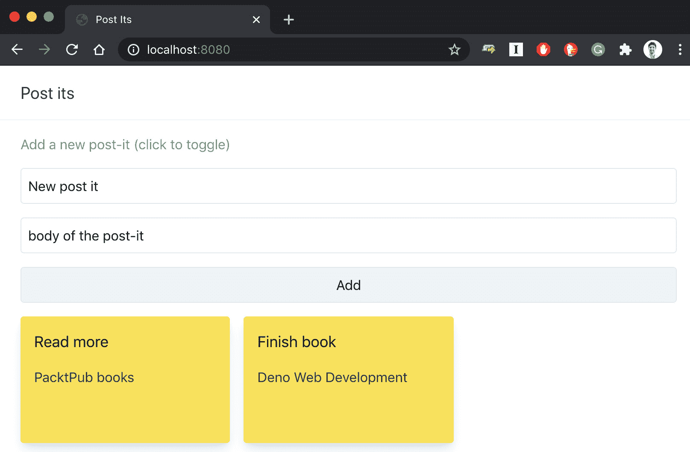

# 第三章：运行时和标准库

既然我们已经足够了解 Deno，那么我们就可以用它来编写一些真正的应用程序。在本章中，我们将不使用任何库，因为其主要目的是介绍运行时 API 和标准库。

我们将编写小型 CLI 工具、Web 服务器等，始终利用官方 Deno 团队创建的力量，没有外部依赖。

我们将从 Deno 命名空间开始，因为我们认为首先探索运行时包含的内容是有意义的。按照这个想法，我们还将查看 Deno 与浏览器共享的 Web API。我们将使用`setTimeout`到`addEventListener`、`fetch`等。

仍然在 Deno 命名空间中，我们将了解程序的生命周期，与文件系统交互，并构建小型命令行程序。后来，我们将了解缓冲区，并理解它们如何用于异步读写。

我们将简要介绍标准库，并浏览一些有用的模块。这一章并不旨在取代标准库的文档；它将展示标准库的一些功能和用例。在编写小型程序的过程中，我们将了解它。

在穿越标准库的旅程中，我们将使用与文件系统、ID 生成、文本格式化和 HTTP 通信相关的模块。其中一部分将是我们稍后深入探索的介绍。您将通过编写您的第一个 JSON API 并连接到它来完成本章。

以下是我们将在本章中涵盖的主题：

+   **Deno 运行时**

+   探索 Deno 命名空间

+   使用标准库

+   使用 HTTP 模块构建 Web 服务器

## 技术要求

本章的所有代码文件可以在以下 GitHub 链接找到：[`github.com/PacktPublishing/Deno-Web-Development/tree/master/Chapter03`](https://github.com/PacktPublishing/Deno-Web-Development/tree/master/Chapter03)。

# **Deno 运行时**

Deno 提供了一组函数，这些函数作为全局变量包含在`Deno`命名空间中。运行时 API 在[`doc.deno.land/`](https://doc.deno.land/)上进行文档化，可以用来做最基本的、底层的事情。

在 Deno 中，无需导入即可使用两种类型的函数：Web API 和`Deno`命名空间。每当 Deno 中存在与浏览器中相同的行为时，Deno 会模仿浏览器 API——这些是 Web API。由于您来自 JavaScript 世界，您可能对这些大部分都很熟悉。我们谈论的是诸如`fetch`、`addEventListener`、`setTimeout`等函数，以及`window`、`Event`、`console`等对象 among others.

使用 Web API 编写的代码可以捆绑并在浏览器中运行，无需任何转换。

运行时暴露的 API 的大部分位于一个名为`Deno`的全局命名空间中。你可以使用 REPL 和文档，这两者我们在第二章中探讨过，*工具链*，来探索它并快速了解它包括哪些函数。在本章后面，我们还将尝试一些最常用的函数。

如果你想要访问 Deno 中包含的所有符号的文档，你可以使用带有`--builtin`标志的`doc`命令。

## 稳定性

`Deno`命名空间内的函数从版本 1.0.0 开始被认为是稳定的。这意味着 Deno 团队将努力在 newer versions 中支持它们，并将尽最大努力使它们与未来的变化保持兼容。

仍不稳定 features live under the `--unstable` flag，正如你可能会想到的那样，因为我们已经在之前的示例中使用过它们。

不稳定模块的文档可以通过使用`doc`命令的`--unstable`标志或通过访问[`doc.deno.land/builtin/unstable`](https://doc.deno.land/builtin/unstable)来获取。

标准库尚未被 Deno 团队认为是稳定的，因此它们的版本与 CLI 不同（在撰写本文时，它是版本 0.83.0）。

与`Deno`命名空间函数相比，标准库通常不需要`--unstable`标志来运行，除非标准库中的任何模块正在使用来自`Deno`命名空间的 unstable functions。

## 程序生命周期

Deno 支持浏览器兼容的`load`和`unload`事件，可以用来运行设置和清理代码。

处理器可以以两种不同的方式编写：使用`addEventListener`和通过重写`window.onload`和`window.onunload`函数。`load`事件可以是异步的，但`unload`事件却不能取消，因此这是不正确的。

使用`addEventListener`可以注册无限数量的处理器；例如：

```js
addEventListener("load", () => {
  console.log("loaded 1");
});
addEventListener("unload", () => {
  console.log("unloaded 1");
});
addEventListener("load", () => {
  console.log("loaded 2");
});
addEventListener("unload", () => {
  console.log("unloaded 2");
});
console.log("Exiting...");
```

如果我们运行前面的代码，我们得到以下输出：

```js
$ deno run program-lifecycle/add-event-listener.js
Exiting...
loaded 1
loaded 2
unloaded 1
unloaded 2
```

另一种在设置和拆除阶段安排代码运行的方法是重写`window`对象的`onload`和`onunload`函数。这些函数的特点是只有最后一个分配的运行。这是因为它们互相覆盖；例如，请参见以下代码：

```js
window.onload = () => {
  console.log("onload 1");
};
window.onunload = () => {
  console.log("onunload 1");
};
window.onload = () => {
  console.log("onload 2");
};
window.onunload = () => {
  console.log("onunload 2");
};
console.log("Exiting");
```

运行前面的程序后，我们得到了以下输出：

```js
$ deno run program-lifecycle/window-on-load.js
Exiting
onload 2
onunload 2
```

如果我们然后查看我们最初编写的代码，我们可以理解前两个声明被跟在它们后面的两个声明覆盖了。当我们覆盖`onunload`和`onload`时，就会发生这种情况。

## 网络 API

为了展示我们可以像在浏览器中一样使用 Web API，我们将编写一个简单的程序，获取 Deno 网站的标志，将其转换为 base64，并在控制台打印一个包含图像 base64 的 HTML 页面。让我们按照以下步骤进行操作：

1.  从[`deno.land/logo.svg`](https://deno.land/logo.svg)开始请求：

    ```js
    fetch("https://deno.land/logo.svg")
    ```

1.  将其转换为`blob`：

    ```js
    fetch("https://deno.land/logo.svg")
      .then(r =>r.blob())
    ```

1.  从`blob`对象中获取文本并将其转换为`base64`：

    ```js
    fetch("https://deno.land/logo.svg ")
      .then(r =>r.blob())
      .then(async (img) => {
        const base64 = btoa(
          await img.text()
        )
    });
    ```

1.  向控制台打印一个包含图片标签的 HTML 页面，使用 Base64 图片：

    ```js
    fetch("https://deno.land/logo.svg ")
      .then(r =>r.blob())
      .then(async (img) => {
    const base64 = btoa(
          await img.text()
        )
        console.log(`<html>
    
    </html>
        `
        )
      })
    ```

    当我们运行这个时，我们得到了预期的输出：

    ```js
    $ deno run --allow-net web-apis/fetch-deno-logo.js
    <html>
       web-apis/deno-logo.html
```

你现在可以检查这个文件，或者直接在浏览器中打开它来测试它是否有效。

你也可以运用前一章的知识，直接从 Deno 标准库运行一个脚本来服务当前文件夹：

```js
$ deno run --allow-net --allow-read https://deno.land/std@0.83.0/http/file_server.ts web-apis
Check https://deno.land/std@0.65.0/http/file_server.ts
HTTP server listening on http://0.0.0.0:4507
```

然后，通过导航到`http://localhost:4507/deno-logo.html`，我们可以检查图像是否在那里并且有效：


图 3.1 - 使用 Base64 图像的 Deno.land 网页

这些都是 Deno 支持的 Web API 的例子。在这个特定例子中，我们使用了`fetch`和`btoa`，但本章还将使用更多。

请随意实验这些熟悉的 API， either by writing simple scripts or by using the REPL。在本书的其余部分，我们将使用来自 Web APIs 的已知函数。在下一节中，我们将了解 Deno 命名空间，那些只在内置 Deno 中工作的函数，以及通常提供更多低级行为的功能。

# 探索 Deno 命名空间

所有未通过 Web API 覆盖的功能都位于 Deno 命名空间下。这些功能是 Deno 独有的，例如，不能被捆绑以在 Node 或浏览器中运行。

在本节中，我们将探索一些这个功能。我们将构建一些小工具，模仿你每天使用的程序。

如果你想在我们动手之前探索一下可用的函数，它们可以在[`doc.deno.land/builtin/stable`](https://doc.deno.land/builtin/stable)找到。

## 构建一个简单的 ls 命令

如果你曾经使用过*nix 系统的终端或者 Windows PowerShell，你可能对`ls`命令不陌生。简而言之，它列出了一个目录内的文件和文件夹。我们将要做的就是创建一个 Deno 工具，模仿`ls`的一些功能，也就是列出目录中的文件，并显示它们的一些详细信息。

原始命令有无数的标志，出于简洁原因，我们在这里不会实现。

我们决定显示的文件信息包括文件名、大小和最后修改日期。让我们开始动手：

1.  创建一个名为`list-file-names.js`的文件，并使用`Deno.readDir`获取当前目录中的所有文件和文件夹的列表：

    ```js
    for await (const dir of Deno.readDir(".")) {
      console.log(dir.name)
    }
    ```

    这将把当前目录中的文件打印在不同行上：

    ```js
    readDir (https://doc.deno.land/builtin/stable#Deno.readDir) from the Deno namespace.As is mentioned in the documentation, it returns `AsyncInterable`, which we're looping through and printing the name of the file. As the runtime is written in TypeScript, we have very useful type completion and we know exactly what properties are present in every `dir` entry.Now, we want to get the current directory as a command-line argument.
    ```

1.  使用`Deno.args`（https://doc.deno.land/builtin/stable#Deno.args）来获取命令行参数。如果没有发送参数，使用当前目录作为默认值：

    ```js
    const [path = "."] = Deno.args;
    for await (const dir of Deno.readDir(path)) {
      console.log(dir.name)
    }
    ```

    我们利用数组解构来获取`Deno.args`的第一个值，同时使用默认属性来设置`path`变量的默认值。

1.  导航到`demo-files`文件夹（[`github.com/PacktPublishing/Deno-Web-Development/tree/master/Chapter03/ls/demo-files`](https://github.com/PacktPublishing/Deno-Web-Development/tree/master/Chapter03/ls/demo-files)）并运行以下命令：

    ```js
    $ deno run --allow-read ../list-file-names.ts            
    file-with-no-content.txt
    .hidden-file
    lorem-ipsum.txt
    ```

    看起来它正在工作。它正在获取当前所在的文件夹中的文件并列出它们。

    现在我们需要获取文件信息以便显示它。

1.  使用`Deno.stat`（[`doc.deno.land/builtin/stable#Deno.stat`](https://doc.deno.land/builtin/stable#Deno.stat)）来获取有关文件的信息：

    ```js
    padEnd so that the output is aligned. By running the program we just wrote, while in the Chapter03/Is folder (https://github.com/PacktPublishing/Deno-Web-Development/tree/master/Chapter03/ls/demo-files), we get the following output:

    ```

    `deno run --allow-read index.ts ./demo-files`

    12   7/4  .hidden

    96   7/4  folder

    96   7/4  second-folder

    5    7/4  my-best-file

    20   7/4  .file1

    0    7/4  .hidden-file

    ```js

    ```

我们得到了作为参数发送的`deno-files`目录中的文件和文件夹列表，以及字节大小和创建的月份和日期。

在这里，我们使用已经知的必需的`--allow-read`标志来赋予 Deno 访问文件系统的权限。然而，在上一章中，我们提到了 Deno 程序请求权限的不同方式，我们称之为“动态权限”。接下来我们将学习这方面的内容。

## 使用动态权限

当我们自己编写 Deno 程序时，我们通常事先知道所需的权限。然而，当编写可能需要或不需要的权限的代码，或者编写交互式 CLI 工具时，一次性请求所有权限可能没有意义。这就是动态权限的目的。

动态权限允许程序在需要时请求权限，从而使得执行代码的人可以交互式地给予或拒绝特定的权限。

这是一个仍然不稳定的功能，因此其 API 可能会发生变化，但由于它所启用的潜在可能性，我认为它仍然值得提及。

您可以在[`doc.deno.land/builtin/unstable#Deno.permissions`](https://doc.deno.land/builtin/unstable#Deno.permissions)查看 Deno 的权限 API。

接下来我们要确保我们的`ls`程序请求文件系统的读取权限。让我们按照以下步骤进行：

1.  在使用程序之前，使用`Deno.permissions.request`来请求读取权限：

    ```js
    …
    const [path = "."] = Deno.args;
    await Deno.permissions.request({
      name: "read",
      path,
    });
    for await (const dir of Deno.readDir(path)) {
    …
    ```

    这请求了对程序将要运行的目录的权限。

1.  在当前目录下运行程序并授予权限：

    ```js
    g to the permission request command, we're granting it access to the current directory (.).We can now try to run the same program but denying the permissions this time.
    ```

1.  运行程序并在当前目录下拒绝读取权限：

    ```js
    $ deno run --unstable list-file-names-interactive-permissions.ts .
    Deno requests read access to ".". Grant? [g/d (g = grant, d = deny)] d
    error: Uncaught (in promise) PermissionDenied: read access to ".", run again with the --allow-read flag
        at processResponse (deno:core/core.js:223:11)
        at Object.jsonOpAsync (deno:core/core.js:240:12)
        at async Object.[Symbol.asyncIterator] (deno:cli/rt/30_fs.js:125:16)
        at async list-file-names-interactive-permissions.ts:10:18
    ```

    这就是动态权限的工作方式！

在这里，我们使用它们来控制文件系统的读取权限，但它们也可以用来请求运行时所有可用的权限（如第二章 *工具链*中所述）。在编写 CLI 应用程序时，它们非常有用，允许您交互式地调整正在运行的程序可以访问的权限。

## 使用文件系统 API

访问文件系统是我们编写程序时所需的基本需求之一。正如您在文档中可能已经看到的那样，Deno 提供了执行这些常见任务的 API。

决定与 Rust 核心标准化通信后，所有这些 API 都返回`Uint8Array`，解码和编码应由其消费者完成。这与 Node.js 有很大的不同，在 Node.js 中，一些函数返回转换后的格式，而其他函数则返回 blob、缓冲区等。

让我们探索这些文件系统 API 并读取一个文件的内容。

我们将使用`TextDecoder`和`Deno.readFile` API 读取位于[`github.com/PacktPublishing/Deno-Web-Development/tree/master/Chapter03/file-system/sentence.txt`](https://github.com/PacktPublishing/Deno-Web-Development/tree/master/Chapter03/file-system/sentence.txt)的示例文件，如下脚本所示：

```js
const decoder = new TextDecoder()
const content = await Deno.readFile('./sentence.txt');
console.log(decoder.decode(content))
```

您可以注意到我们使用了`TextDecoder`类，这是浏览器中存在的另一个 API。

不要忘记在运行脚本时使用`--allow-read`权限，以便它可以从文件系统中读取。

如果我们想将这个文件的内容写入另一个文件，我们可以使用`writeFile`：

```js
const content = await Deno.readFile("./sentence.txt");
await Deno.writeFile("./copied-sentence.txt", content)
```

请注意，由于我们使用从`readFile`获得的`Uint8Array`直接发送到`writeFile`方法，所以我们不再需要`TextEncoder`。记住在运行时使用`--allow-write`标志，因为它现在正在向文件系统写入。

正如你可能猜到的或在文档中读到的，Deno 正好提供了这样一个 API，即`copyFile`：

```js
await Deno.copyFile("./copied-sentence.txt", 
  "./using-copy-command.txt");
```

现在，你可能注意到了，我们在调用 Deno 命名空间函数时总是使用`await`。

Deno 上的所有异步操作都返回一个承诺，这是我们这样做的主要原因。我们本可以使用等效的`then`语法在那里处理结果，但我们认为这样更易读。

其他用于删除、重命名、更改权限等的 API 也包含在 Deno 命名空间中，您可以在文档中找到它们。

重要提示

Deno 中的许多异步 API 都有一个等效的*同步*API，可以用于特定用例，在这些用例中，您希望阻塞进程并获取结果（例如，`readFileSync`、`writeFileSync`等）。

## 使用缓冲区

缓冲区代表用于存储临时二进制数据的内存区域。它们通常用于处理 I/O 和网络操作。由于异步操作是 Deno 的优势之一，因此我们将在本节中探索缓冲区。

Deno 缓冲区与 Node 缓冲区不同。这是因为当 Node 被创建时，直到版本 4，JavaScript 中都没有对`ArrayBuffers`的支持。由于 Node 针对异步操作进行了优化（缓冲区真正闪耀的地方），其背后的团队不得不创建一个 Node 缓冲区来模拟本地缓冲区的行为。后来，`ArrayBuffers`被添加到语言中，Node 团队将现有的缓冲区迁移到利用它。目前它只是一个`ArrayBuffers`的子类。这个相同的缓冲区然后在 Node v10 中被弃用。由于 Deno 是最近创建的，它的缓冲区深度利用了`ArrayBuffer`。

## 从 Deno.Buffer 读写

Deno 提供了一个动态长度的缓冲区，它是基于`ArrayBuffer`的固定内存分配实现的。缓冲区提供了类似队列的功能，其中数据可以被不同的消费者写入和读取。正如我们最初提到的，它们在网络和 I/O 等任务中得到了广泛应用，因为它们允许异步读写。

举个例子，假设你有一个正在写一些日志的应用程序，你想处理这些日志。你可以同步地处理它们，也可以让这个应用程序将日志写入一个缓冲区，然后有一个消费者异步地处理这些日志。

让我们为那种情况写一个小的程序。我们将写两个简短的程序。第一个将模拟一个产生日志的应用程序；第二个将使用缓冲区来消费这些日志。

我们首先编写模拟应用程序产生日志的代码。在[`github.com/PacktPublishing/Deno-Web-Development/blob/master/Chapter03/buffers/logs/example-log.txt`](https://github.com/PacktPublishing/Deno-Web-Development/blob/master/Chapter03/buffers/logs/example-log.txt)，有一个文件，里面有一些示例日志我们将使用：

```js
const encoder = new TextEncoder();
const fileContents = await Deno.readFile("./example-log.txt ");
const decoder = new TextDecoder();
const logLines = decoder.decode(fileContents).split("\n");
export default function start(buffer: Deno.Buffer) {
  setInterval(() => {
     const randomLine = Math.floor(Math.min(Math.random() *        1000, logLines.length));
     buffer.write(encoder.encode(logLines[randomLine]));
  },   100)
}
```

这段代码从示例文件中读取内容并将其分割成行。然后，它获取一个随机的行号，每 100 毫秒将那一行写入一个缓冲区。这个文件然后导出一个函数，我们可以调用它来开始“生成随机日志”。我们将在下一个脚本中使用这个功能来模拟一个产生日志的应用程序。

现在来到了有趣的部分：我们将按照这些步骤编写一个基本的*日志处理器*：

1.  创建一个缓冲区，并将其发送给我们刚刚编写的日志生产者的`start`函数：

    ```js
    import start from "./logCreator.ts";
    const buffer = new Deno.Buffer();
    start(buffer);
    ```

1.  调用`processLogs`函数来开始处理缓冲区中的日志条目：

    ```js
    …
    start(buffer);
    processLogs();
    async function processLogs() {}
    ```

    正如你所看到的，`processLogs`函数会被调用，但是什么也不会发生，因为我们还没有实现一个程序来执行它。

1.  在`processLogs`函数内部创建一个`Uint8Array`对象类型，并在那里读取缓冲区的内容：

    ```js
    …
    async function processLogs() {
      const destination = new Uint8Array(100);
      const readBytes = await buffer.read(destination);
      if (readBytes) {
        // Something was read from the buffer
      }
    }
    ```

    文档（[`doc.deno.land/builtin/stable#Deno.Buffer`](https://doc.deno.land/builtin/stable#Deno.Buffer)）指出，当有东西要读取时，`Deno.Buffer`的`read`函数返回读取的字节数。当没有东西可读时，缓冲区为空，它返回 null。

1.  现在，在`if`内部，我们可以直接解码读取的内容，因为我们都知道它以`Uint8Array`格式存在：

    ```js
    const decoder = new TextDecoder();
    …  
    if (readBytes) {
      const read = decoder.decode(destination);
    }
    ```

1.  要在控制台上打印解码值，我们可以使用已知的`console.log`。我们还可以用不同的方式来实现，通过使用`Deno.stdout`（[`doc.deno.land/builtin/stable#Deno.stdout`](https://doc.deno.land/builtin/stable#Deno.stdout)）向标准输出写入。

    `Deno.stdout`是 Deno 中的一个`writer`对象([`doc.deno.land/builtin/stable#Deno.Writer`](https://doc.deno.land/builtin/stable#Deno.Writer))。我们可以使用它的`write`方法将文本发送到那里：

    ```js
    const decoder = new TextDecoder();
    const encoder = new TextEncoder();
    …  
    if (readBytes) {
      const read = decoder.decode(destination);
      await Deno.stdout.write(encoder.encode(`${read}\n`));
    }
    ```

    通过这样做，我们正在向`Deno.stdout`写入刚刚读取的值，并且在末尾添加一个换行符（`\n`），以便在控制台上更具可读性。

    如果我们保持这种方式，这个`processLogs`函数将只运行一次。由于我们希望在稍后再次运行此函数以检查`buffer`中是否还有更多日志，我们需要安排它稍后再次运行。

1.  使用`setTimeout`在 100 毫秒后调用相同的`processLogs`函数：

    ```js
    async function processLogs() {
      const destination = new Uint8Array(100);
      const readBytes = await buffer.read(destination);
      if (readBytes) {
        …
      }
      setTimeout(processLogs, 10);
    }
    ```

例如，如果我们打开`example-log.txt`文件，我们可以看到包含以下格式的日期的行：`Thu Aug 20 22:14:31 WEST 2020`。

让我们想象我们只是想打印出带有`Tue`的日志。让我们来写一下实现这个功能的逻辑：

```js
async function processLogs() {
  const destination = new Uint8Array(100);
  const readBytes = await buffer.read(destination);
  if (readBytes) {
    const read = decoder.decode(destination);
    if (read.includes("Tue")) {
      await Deno.stdout.write(encoder.encode(`${read}\n`));
    }
  }
  setTimeout(processLogs, 10);
}  
```

然后，我们在包含`example-logs.txt`文件的文件夹内执行程序：

```js
$ deno run --allow-read index.ts
Tue Aug 20 17:12:05 WEST 2019
Tue Sep 17 02:19:56 WEST 2019
Tue Dec  3 14:02:01 CET 2019
Tue Jul 21 10:37:26 WEST 2020
```

带有日期的日志行如实地从缓冲区中读取并符合我们的条件。

这是一个关于缓冲区可以做什么的简短演示。我们能够异步地从缓冲区读取和写入。这种方法允许，例如，消费者在应用程序读取其他部分的同时处理文件的一部分。

Deno 命名空间提供了比这里尝试的更多功能。在本节中，我们决定挑选几个部分给你一个启示，看看它启用了多少功能。

在*第四章*，*构建 Web 应用程序*及以后，我们将使用这些函数，以及第三方模块和标准库来编写我们的 Web 服务器。

# 使用标准库

在本节中，我们将探讨由 Deno 的标准库提供的行为。目前，这个标准库不被运行时认为是稳定的，因此模块是单独版本化的。在我们撰写本文时，标准库处于*版本 0.83.0*。

如我们之前提到的，Deno 在向标准库添加内容方面非常慎重。核心团队希望它提供足够的行为，这样人们就不需要依赖数百万个外部包来完成某些事情，但同时也不想添加过多的 API 表面。这是一个难以达到的微妙平衡。

受到 golang 的启发，Deno 标准库的大部分函数模仿了谷歌创建的语言。这是因为 Deno 团队真心相信*golang*如何发展其标准库，一个以打磨得非常好而闻名的库。作为一个有趣的注解，Ryan Dahl（Deno 和 Node 的创建者）在他的某次演讲中提到，当拉取请求向标准库添加新的 API 时，会要求提供相应的*golang*实现。

我们不会遍历整个库，原因与我们没有遍历整个 Deno 命名空间一样。我们将通过构建一些有用的程序来学习它所能提供的功能。我们将从生成 ID、日志记录、HTTP 通信等知名用例开始。

## 为我们的简单 ls 添加颜色

几页之前，我们在*nix 系统中构建了一个非常粗糙简单的`ls`命令的“克隆”。当时我们列出了文件，以及它们的大小和修改日期。

为了开始探索标准库，我们打算给该程序的终端输出添加一些着色。让我们使文件夹名称以红色打印，这样我们就可以轻松地区分它们。

我们将创建一个名为`list-file-names-color.ts`的文件。这次我们将使用 TypeScript，因为我们将得到更好的补全功能，因为标准库和 Deno 命名空间函数都是为了这个目的而编写的。

让我们探索一下标准库函数，它们允许我们给文本着色（https://deno.land/std@0.83.0/fmt/colors.ts）。

如果我们想查看一个模块的文档，我们可以直接查看代码，但我们也可以使用`doc`命令或文档网站。我们将使用后者。

导航到 https://doc.deno.land/https/deno.land/std@0.83.0/fmt/colors.ts。屏幕上列出了所有可用的方法：

1.  从标准库的格式化库中导入打印红色文本的方法：

    ```js
    import { red } from "https://deno.land/std@0.83.0/fmt/colors.ts";
    ```

1.  在我们的`async`迭代器中使用它，该迭代器正在遍历当前目录中的文件：

    ```js
    const [path = "."] = Deno.args;
    for await (const item of Deno.readDir(path)) {
      if (item.isDirectory) {
        console.log(red(item.name));
      } else {
        console.log(item.name);
      }
    }
    ```

1.  在`demo-files`文件夹内运行它（[`github.com/PacktPublishing/Deno-Web-Development/tree/master/Chapter03/ls`](https://github.com/PacktPublishing/Deno-Web-Development/tree/master/Chapter03/ls)），我们得到的文件夹以红色显示（这在打印的书里看不到，但你可以本地运行它）：

    ```js
    $ deno run –allow-read list-file-names-color.ts
    file-with-no-content.txt
    demo-folder
    .hidden-file
    lorem-ipsum.txt
    ```

现在我们有一个更好的`ls`命令，它让我们能够通过标准库的着色函数区分文件夹和文件。在本书的过程中，我们将查看标准库提供的许多其他模块。其中一些将在我们开始编写自己的应用程序时使用。

我们将特别关注的一个模块是 HTTP 模块，从下一节开始我们将大量使用它。

# 使用 HTTP 模块构建 Web 服务器

本书的主要内容，以及介绍 Deno 以及如何使用它，是学习如何使用它来构建 Web 应用程序。在这里，我们将创建一个简单的 JSON API 来向您介绍 HTTP 模块。

我们将构建一个 API，用于保存和列出便签。我们将这些便签称为 post-its。想象一下，这个 API 将喂养你的 post-its 板。

我们将使用 Web API 和 Deno 标准库 HTTP 模块中的函数创建一个非常简单的路由系统。记住，我们这样做是为了探索 API 本身，所以这并不是生产就绪的代码。

让我们先创建一个名为`post-it-api`的文件夹和一个名为`index.ts`的文件。再次，我们将使用 TypeScript，因为我们相信自动完成和类型检查功能可以大大提高我们的体验并减少可能的错误数量。

本节最终的代码可以在[`github.com/PacktPublishing/Deno-Web-Development/blob/master/Chapter03/post-it-api/steps/7.ts`](https://github.com/PacktPublishing/Deno-Web-Development/blob/master/Chapter03/post-it-api/steps/7.ts)找到：

1.  首先，将标准库 HTTP 模块导入我们的文件中：

    ```js
    import { serve } from
      "https://deno.land/std@0.83.0/http/server.ts";
    ```

1.  使用`AsyncIterator`编写处理请求的逻辑，就像我们之前的例子中所做的那样：

    ```js
    console.log("Server running at port 8080");
    for await (const req of serve({ port: 8080 })) {
      req.respond({ body: "post-it api", status: 200 });
    }
    ```

    如果我们现在运行它，这就是我们会得到的。记住，为了让它具有网络访问权限，我们需要使用在权限部分提到的`--allow-net`标志：

    ```js
    deno run --allow-net index.ts
    Server running at port 8080
    ```

1.  为了清晰起见，我们可以将端口和服务器实例提取到单独的变量中：

    ```js
    const PORT = 8080;
    const server = serve({ port: PORT });
    console.log("Server running at port", PORT);
    for await (const req of serve({ port: PORT })) {
    …
    ```

我们现在有了一个运行中的服务器，和之前一样，唯一的区别是现在代码（可以说）因为将配置变量放在文件顶部而更加可读。我们稍后会学习如何从代码中提取这些变量。

### 返回便签列表

我们的第一个要求是我们有一个返回便签列表的 API。这些便签将包括名称、标题和创建日期。在我们到达那里之前，为了使我们能够有多个路由，我们需要一个路由系统。

为了进行这个练习，我们将自己构建一个。这是我们了解 Deno 中一些内置 API 的方式。稍后我们会同意，在编写生产应用程序时，有时最好重用经过测试和广泛使用的软件，而不是不断重新发明轮子。然而，为了学习目的，完全重新发明轮子是可以的。

为了创建我们的基本路由系统，我们将使用一些您可能在浏览器中知道的 API。例如`URL`、`UrlSearchParams`等对象。

我们的目标是能够通过其 URL 和路径定义一个路由。类似`GET /api/post-its`这样的东西会很好。让我们这样做！

1.  首先，创建一个`URL`对象（[`developer.mozilla.org/en-US/docs/Web/API/URL`](https://developer.mozilla.org/en-US/docs/Web/API/URL)）来帮助我们解析 URL 和其参数。我们将`HOST`和`PROTOCOL`提取到另一个变量中，这样我们就不用重复了：

    ```js
    const PORT = 8080;
    const HOST = "localhost";
    const PROTOCOL = "http";
    const server = serve({ port: PORT, hostname: HOST });
    console.log(`Server running at ${HOST}:${PORT}`);
    for await (const req of server) {
      const url = new
        URL(`${PROTOCOL}://${HOST}${req.url}`);
      req.respond({ body: "post-it api", status: 200 });
    }
    ```

1.  使用创建的`URL`对象进行一些路由。我们将使用`switch case`来实现。当没有匹配的路由时，应该向客户端发送`404`：

    ```js
      const pathWithMethod = `${req.method} ${url.pathname}`;
      switch (pathWithMethod) {
        case "GET /api/post-its":
          req.respond({ body: "list of all the post-its",
            status: 200 });
          continue;
        default:
          req.respond({ status: 404 });
      } 
    ```

    提示

    您可以同时在运行脚本时使用`--unstable`和`--watch`标志，以在文件更改时重新启动它：`deno run --allow-net --watch --unstable index.ts`。

1.  访问`http://localhost:8080/api/post-its`，并确认我们得到了正确的响应。其他任何路由都会得到 404 响应。

    请注意，我们使用`continue`关键字让 Deno 在响应请求后跳出当前迭代（记住我们正在`for`循环内）。

    您可能已经注意到，目前我们只是按路径路由，而不是按方法路由。这意味着对`/api/post-its`的任何请求，无论是`POST`还是`GET`，都会得到相同的响应。让我们通过前进来解决这个问题。

1.  创建一个包含请求方法和路径名的变量：

    ```js
      const pathWithMethod = `${req.method} ${url.pathname}`
      switch (pathWithMethod) {
    ```

    现在我们可以定义我们想要的路线，`GET /api/post-its`。现在我们已经有了我们路由系统的基本知识，我们将编写返回便签的逻辑。

1.  创建一个 TypeScript 接口，以帮助我们保持便签的结构：

    ```js
    interface PostIt {
      title: string,
      id: string,
      body: string,
      createdAt: Date
    }
    ```

1.  创建一个变量，作为我们这次练习的*内存数据库*。

    我们将使用一个 JavaScript 对象，其中键是 ID，值是刚刚定义的`PostIt`类型的对象：

    ```js
    let postIts: Record<PostIt["id"], PostIt> = {}
    ```

1.  向我们的数据库添加几个测试数据：

    ```js
    let postIts: Record<PostIt["id"], PostIt> = {
      '3209ebc7-b3b4-4555-88b1-b64b33d507ab': { title: 'Read more', body: 'PacktPub books', id: 3209ebc7-b3b4-4555-88b1-b64b33d507ab ', createdAt: new Date() },
      'a1afee4a-b078-4eff-8ca6-06b3722eee2c': { title: 'Finish book', body: 'Deno Web Development', id: '3209ebc7-b3b4-4555-88b1-b64b33d507ab ', createdAt: new Date() }
    }
    ```

    请注意，我们目前是*手动生成*ID 的。稍后，我们将使用标准库的另一个模块来完成。让我们回到我们的 API，并更改处理路由的`case`。

1.  更改返回所有便签的`case`，而不是硬编码的消息。

    由于我们的数据库是一个键/值存储，我们需要使用`reduce`来构建一个包含所有便签的数组（删除代码块中高亮的行）：

    ```js
    case GET "/api/post-its":
      req.respond({ body: "list of all the post-its", status:     200 });
      const allPostIts = Object.keys(postIts).
        reduce((allPostIts: PostIt[], postItId) => {
            return allPostIts.concat(postIts[postItId]);
          }, []);
      req.respond({ body: JSON.stringify({ postIts:     allPostIts }) });
      continue;
    ```

1.  运行代码并访问`/api/post-its`。我们应该在那里看到我们的便签列表！

    您可能已经注意到，这仍然不是 100%正确的，因为我们的 API 返回的是 JSON，而其头部与载荷不匹配。

1.  我们将通过使用我们来自浏览器的 API——`Headers`对象——来添加`content-type`（https://developer.mozilla.org/en-US/docs/Web/API/Headers）。删除以下代码块中高亮的行：

    ```js
    const headers = new Headers();
    headers.set("content-type", "application/json");
    const pathWithMethod = `${req.method} ${url.pathname}`
    switch (pathWithMethod) {
      case "GET /api/post-its":
    …
        req.respond({ body: JSON.stringify({ postIts: 
          allPostIts }) });
        req.respond({ headers, body: JSON.stringify({ 
          postIts: allPostIts }) });
        continue;
    ```

我们已经创建了一个`Headers`对象的实例，然后我们在`req.respond`上使用了它。这样，我们的 API 现在变得更加一致、易消化，并遵循标准。

### 向数据库添加一个便签

现在我们已经有了读取便签的方法，我们还需要一种添加新便签的方法，因为拥有一个完全静态内容的 API 并没有多大意义。这就是我们将要做的。

我们将使用我们创建的*路由基础设施*来添加一个允许我们*插入*记录到我们数据库的路由。由于我们遵循 REST 指南，该路由将位于列出`post-its`的路径上，但方法不同：

1.  定义一个总是返回`201`状态码的路由：

    ```js
        case "POST /api/post-its":
          req.respond({ status: 201 });
          continue
    ```

1.  使用`curl`的帮助，测试它，我们可以看到它返回了正确的状态码：

    ```js
    curl but feel free to use your favorite HTTP requests tool, you can even use a graphical client such as Postman (https://www.postman.com/).Let's make the new route do what it is supposed to. It should get a JSON payload and use that to create a new post-it.We know, by looking at the documentation of the standard library's HTTP module (`doc.deno.land/https/deno.land/std@0.83.0/http/server.ts#ServerRequest`) that the body of the request is a *Reader* object. The documentation includes an example on how to read from it.
    ```

1.  按照建议，读取值并打印出来以更好地理解它：

    ```js
    case "POST /api/post-its":
          const body = await Deno.readAll(req.body);
          console.log(body) 
    ```

1.  使用`curl`的帮助，用`body`发送请求：

    ```js
    201 status code. If we look at our running server though, something like this is printed to the console:

    ```

    Uint8Array(25) [

    123,  34, 116, 105, 116, 108, 101,

    34,58,32,34,84,   101, 115,

    116,  32, 112, 111, 115, 116,  45,

    105, 116,  34, 125

    ]

    ```js

    We previously learned that Deno uses `Uint8Array` to do all its communications with the Rust backend, and this is not an exception. However, `Uint8Array` is not what we currently want, we want the actual text of the request body. 
    ```

1.  使用`TextDecoder`将请求体作为可读值获取。这样做之后，我们再次记录输出，然后我们将发送一个新的请求：

    ```js
    $ deno -X POST -d "{\"title\": \"Buy milk\"}" 
    http://localhost:8080/api/post-its
    ```

    这次服务器在控制台打印的内容如下：

    ```js
    {"title": "Buy milk "}
    ```

    我们正在取得进展！

1.  由于主体是一个字符串，我们需要将其解析为 JavaScript 对象。我们将使用我们的一位老朋友，`JSON.parse`：

    ```js
    const decoded = JSON.parse(new 
      TextDecoder().decode(body));
    ```

    现在我们的请求体以一种我们可以操作的格式存在，这就是我们创建新数据库记录所需要做的全部工作。让我们按照以下步骤创建一个：

1.  使用标准库中的`uuid`模块（[`deno.land/std@0.83.0/uuid`](https://deno.land/std@0.83.0/uuid)）为我们的记录生成一个随机的 UUID：

    ```js
    import { v4 } from 
      "https://deno.land/std/uuid/mod.ts";
    ```

1.  在我们的路由的 switch case 中，我们将使用`generate`方法创建一个`id`并将其插入到*数据库*中，在用户在请求负载中发送的内容顶部添加`createdAt`日期。为了这个例子，我们省略了验证：

    ```js
    case "POST /api/post-its":
    …
        const decoded = JSON.parse(new 
          TextDecoder().decode(body));
        const id = v4.generate();
        postIts[id] = {
          ...decoded,
          id,
          createdAt: new Date()
        }
        req.respond({ status: 201, body:
          JSON.stringify(postIts[id]), headers });
    ```

    注意我们在这里使用的是之前定义的同一个`headers`对象（在`GET`路由中），这样我们的 API 就会返回`Content-Type: application/json`。

    然后，再次遵循*REST*指南，我们返回`201` `Created`代码和创建的记录。

1.  保存代码，重新启动服务器，再次运行它：

    ```js
    GET request to the route that lists all the post-its to check if the record was actually inserted into the database:

    ```

    $ curl http://localhost:8080/api/post-its

    {"postIts":[{"title":"Read more","body":"PacktPub books","id":"3209ebc7-b3b4-4555-88b1-b64b33d507ab","createdAt":"2021-01-10T16:28:52.210Z"},{"title":"Finish book","body":"Deno Web Development","id":"a1afee4a-b078-4eff-8ca6-06b3722eee2c","createdAt":"2021-01-10T16:28:52.210Z"},{"title":"Buy groceries","body":"1 x Milk","id":"b35b0a62-4519-4491-9ba9-b5809b4810d5","createdAt":"2021-01-10T16:29:05.519Z"}]}

    ```js

    ```

而且它奏效了！现在我们有一个 API 可以返回并添加 post-its 到列表中。

这基本上结束了我们在这个章节中使用 HTTP 模块进行 API 所做的工作。像我们写的这个 API 一样，大多数 API 都是为了被前端应用程序消费而创建的，我们来做这件事来结束这个章节。

### 服务于前端

由于这超出了本书的范围，我们不会编写与该 API 交互的前端代码。然而，如果你想用它来获取便签并显示在一个单页应用程序上，我在书中的文件中包含了一个（[`github.com/PacktPublishing/Deno-Web-Development/blob/master/Chapter03/post-it-api/index.html`](https://github.com/PacktPublishing/Deno-Web-Development/blob/master/Chapter03/post-it-api/index.html)）。

我们将学习如何使用我们刚刚构建的 Web 服务器来提供 HTML 文件：

1.  首先，我们需要在服务器的根目录下创建一个路由。然后，我们需要设置正确的`Content-Type`，并使用已知的文件系统 API 返回文件内容。

    为了获取当前文件相对于 HTML 文件的路径，我们将使用 URL 对象和 JavaScript 的`import.meta`声明（[`developer.mozilla.org/en-US/docs/Web/JavaScript/Reference/Statements/import.meta`](https://developer.mozilla.org/en-US/docs/Web/JavaScript/Reference/Statements/import.meta)），其中包含当前文件的路径：

    ```js
    resolve, and fromFileUrl methods from Deno's standard-library to get a URL that is relative to the current file.Note that we now need to run this with the `--allow-read` flag since our code is reading from the filesystem. 
    ```

1.  为了让我们更安全，我们将指定程序可以读取的确切文件夹，通过将其传递给`--allow-read`标志：

    ```js
    $ deno run --allow-net --allow-read=. index.ts
    Server running at http://0.0.0.0:8080 
    ```

    这将防止任何可能允许恶意人士读取我们文件系统的错误。

1.  用浏览器访问该 URL，你应该会来到一个可以看到我们添加的便签`post-its`的页面。要添加一个新的，你也可以点击**添加新便签**文字并填写表单：



](img/Figure_3.2_B16380.jpg)

图 3.2 – 前端消费便签 API

重要提示

请记住，在许多生产环境中，不推荐 API 为前端代码提供服务。在这里，我们这样做是为了学习目的，这样我们才能理解标准库 HTTP 模块的一些可能性。

在本节中，我们学习了如何利用标准库提供的模块。我们制作了一个`ls`命令的简单版本，并使用标准库的输出格式化函数给它添加了一些颜色。为了结束这一节，我们制作了一个具有几个端点的 HTTP API，用于列出和持久化记录。我们讨论了不同的需求，并学习了 Deno 如何实现它们。

# 总结

随着我们对本书的阅读，我们对 Deno 的了解变得更加实用，我们开始用它来处理更接近现实世界的用例。这一章就是关于这个的。

我们首先学习了运行时的基本特性，即程序生命周期，以及 Deno 如何看待模块稳定性和版本控制。我们很快转向了 Deno 提供的 Web API，通过编写一个简单的程序，从网站上获取 Deno 徽标，将其转换为 base64，并将其放入 HTML 页面中。

然后，我们进入了`Deno`命名空间，探索了一些其底层功能。我们使用文件系统 API 构建了几个示例，并最终用它构建了一个`ls`命令的简化版。

缓冲区是在 Node.js 世界中大量使用的东西，它们能够执行异步读写行为。正如我们所知，Deno 与 Node.js 有很多相同的用例，这使得在这一章节中不谈论缓冲区变得不可能。我们首先解释了 Deno 缓冲区与 Node.js 的区别，然后构建了一个小应用程序，它能够异步地从它们中读取和写入。

为了结束这一章节，我们更接近了这本书的主要目标之一，即使用 Deno 进行网络开发。我们使用 Deno 创建了第一个 JSON API。在这个过程中，我们了解了多个 Deno API，甚至构建了我们的基本路由系统。然后，我们创建了几个路由，列出并创建了我们的*数据存储*中的记录。在本章即将结束时，我们学习了如何处理 API 中的头部，并将其添加到我们的端点中。

我们结束了这一章节，通过我们的网络服务器直接提供了一个单页应用程序；这个单页应用程序消费并与我们 API 进行了交互。

这一章我们覆盖了很多内容。我们开始构建 API，这些 API 现在比我们之前所做的更接近现实。我们还更清楚地了解了使用 Deno 开发、使用权限和文档的感觉。

当前章节结束了我们的入门之旅，希望它让你对接下来的内容感到好奇。

在接下来的四章中，我们将构建一个网络应用程序，并探索在这一过程中所做的所有决定。到目前为止你所学的的大部分知识将在后面用到，但也有很多新的、令人兴奋的内容。在下一章，我们将开始创建一个 API，随着章节的进行，我们将继续为其添加功能。

我希望你能加入我们！
