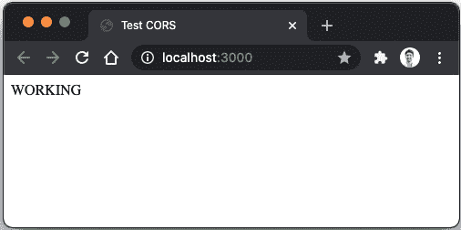

# 第五章：*第七章*：HTTPS，提取配置和 Deno 在浏览器中

在上一章中，我们基本上完成了应用程序的功能。我们添加了授权和持久性，最终得到了一个连接到 MongoDB 实例的应用程序。在本章中，我们将关注一些在生产应用程序中常见的最佳实践：基本的安全实践和处理配置。

首先，我们将为我们的**应用程序编程接口**（**API**）添加一些基本的安全特性，从**跨源资源共享**（**CORS**）保护开始，以使基于它们的来源对请求进行过滤。然后，我们将学习如何在我们的应用程序中启用**安全超文本传输协议**（**HTTPS**），以便它支持加密连接。这将允许用户使用安全的连接对 API 进行请求。

直到现在，我们使用了一些密钥值，但我们没有关注它们在代码中的存在。在本章中，我们将提取配置和密钥，使它们不必存在于代码库中。然后，我们将学习如何安全地存储和注入它们。这样，我们可以确保这些值保持秘密，并且不出现在代码中。通过这样做，我们还将使不同的部署具有不同的配置成为可能。

继续前进，我们将探索由一个特定的 Deno 功能启用的能力：在浏览器中编译和运行代码的能力。通过使用 Deno 对 ECMAScript 6 的兼容性（受现代浏览器支持），我们将在 API 和前端之间共享代码，启用一个全新的可能性世界。

利用这个特定的功能，我们将探索一个特定的场景：为 API 构建一个 JavaScript 客户端。这个客户端将使用在服务器上运行的相同类型和代码部分构建，并探索由此带来的好处。

本章结束了本书的*构建应用程序*部分，我们一步一步地构建了一个应用程序，并用逐步增加的方法添加了一些常见应用程序特性。在学习过程中，我们还确保这个应用程序尽可能接近现实，这是一本介绍性书籍。这使我们能够在创建功能应用程序的同时学习 Deno，它的许多 API 以及一些社区包。

到本章结束时，您将熟悉以下主题：

+   启用 CORS 和 HTTPS

+   提取配置和密钥

+   在浏览器中运行 Deno 代码

# 技术要求

本章所需的所有代码文件都可以在以下 GitHub 链接中找到：

[`github.com/PacktPublishing/Deno-Web-Development/tree/master/Chapter07/sections`](https://github.com/PacktPublishing/Deno-Web-Development/tree/master/Chapter07/sections)

# 启用 CORS 和 HTTPS

跨源资源共享（CORS）和 HTTPS 支持是任何运行中的生产应用程序考虑的两个关键因素。本节将解释我们如何将它们添加到我们正在构建的应用程序中。

还有许多其他安全实践可以添加到任何 API 中。由于这些不是 Deno 特定内容，并且值得单独一本书，我们决定专注于这两个要素。

我们将首先学习关于 CORS 的知识以及我们如何利用我们所知道的 `oak` 和中间件函数特性来实现它。然后，我们将学习如何使用自签名证书，并使我们的 API 处理安全的 HTTP 连接。

让我们开始，从 CORS 开始。

## 启用 CORS

如果你不熟悉 CORS，它是一种机制，使服务器能够指示浏览器允许从哪些来源加载资源。当应用程序在与 API 相同的域上运行时，CORS 甚至是不必要的，因为名称直接使其显而易见。

我将从**Mozilla Developer Network**（**MDN**）提供以下引用，解释 CORS：

"跨源资源共享（CORS）是一个基于 HTTP 头的机制，允许服务器指示浏览器应该允许从哪些其他来源（域、协议或端口）加载资源。CORS 还依赖于一种机制，浏览器向托管跨源资源的服务器发送“预检”请求，以检查服务器将允许实际请求。在预检中，浏览器发送头指示将使用实际请求中的 HTTP 方法和头。"

为了给你一个更具体的例子，想象你有一个运行在 `the-best-deno-api.com` 的 API 并且你想处理来自 `the-best-deno-client.com` 的请求。在这里，你希望你的服务器为 `the-best-deno-client.com` 域启用 CORS。

如果你没有启用它，浏览器将向你的 API 发送一个预检请求（使用 `OPTIONS` 方法），对这个请求的响应将不会有 `Access-Control-Allow-Origin: the-best-deno-client.com` 头，导致请求失败并阻止浏览器进一步请求。

我们将学习如何在我们的应用程序中启用此机制，允许在以下示例中从 `http://localhost:3000` 发起请求。

由于我们的应用程序正在使用 `oak` 框架，我们将学习如何使用这个框架来实现。然而，这与其他任何 HTTP 框架非常相似。我们基本上想要添加一个处理请求并将其来源与允许的域列表进行比较的中间件函数。

我们将使用一个名为 `cors` 的社区包（[`deno.land/x/cors@v1.2.1`](https://deno.land/x/cors@v1.2.1)），但实现非常简单。如果你好奇它做什么，可以查看 [`deno.land/x/cors@v1.2.1/oakCors.ts`](https://deno.land/x/cors@v1.2.1/oakCors.ts)，因为代码非常直接。

重要提示

我们将使用前一章中创建的代码来启动这个实现。这可以在[`github.com/PacktPublishing/Deno-Web-Development/tree/master/Chapter06/sections/4-connecting-to-mongodb/museums-api`](https://github.com/PacktPublishing/Deno-Web-Development/tree/master/Chapter06/sections/4-connecting-to-mongodb/museums-api)找到。您还可以查看本节完成后的代码：

[`github.com/PacktPublishing/Deno-Web-Development/tree/master/Chapter07/sections/3-deno-on-the-browser/museums-api`](https://github.com/PacktPublishing/Deno-Web-Development/tree/master/Chapter07/sections/3-deno-on-the-browser/museums-api)

在这里，我们将`cors`包添加到我们的应用程序中，同时加上我们自己的允许域名列表。最终目标是使我们能够从可信网站对这项 API 执行请求。

让我们这样做。按照以下步骤进行：

1.  通过更新`deps`文件安装`cors`模块（参考第三章，《运行时和标准库》，了解如何进行此操作）。代码如下所示：

    ```js
    export { oakCors } from
      "https://deno.land/x/cors@v1.2.1/oakCors.ts";
    ```

1.  接下来，运行`cache`命令以更新`lock`文件，如下所示：

    ```js
    $ deno cache --lock=lock.json --lock-write --unstable src/deps.ts
    ```

1.  在`src/web/index.ts`中导入`oakCors`，并在注册路由之前在应用程序中注册它，如下所示：

    ```js
    import { Algorithm, oakCors } from "../deps.ts"
    …
    oakCors middleware creator function, by sending it an array of allowed origins—in this case, http://localhost:3000. This will make the API answer to the OPTIONS request with an Access-Control-Allow-Origin: http://localhost:3000 header, which will signal to the browser that if the website making requests is running on http://localhost:3000, it should allow further requests.This will work just fine. However, having this *hardcoded* domain here seems a little bit strange. We've been injecting all the similar configuration to the application. Remember what we did with the `port` configuration? Let's do the same for the allowed domains.
    ```

1.  将`createServer`函数参数更改为接收名为`allowedOrigins`的数组`string` inside `configuration`，稍后将其传递给`oakCors`中间件创建函数。这段代码如下所示：

    ```js
    interface CreateServerDependencies {
      configuration: {
        port: number,
        authorization: {
          key: string,
          algorithm: Algorithm
        },
        oakCors middleware creator.
    ```

1.  不过还有一件事缺失——我们需要从`src/index.ts`发送这个`allowedOrigins`数组。让我们这样做，如下所示：

    ```js
    createServer({
      configuration: {
        port: 8080,
        authorization: {
          key: authConfiguration.key,
          algorithm: authConfiguration.algorithm
        },
        http://localhost:3000. 
    ```

1.  让我们来测试一下，首先运行 API，如下所示：

    ```js
    $ deno run --allow-net --unstable --allow-env --allow-read --allow-write --allow-plugin src/index.ts
    Application running at http://localhost:8080
    ```

1.  要测试它，请在根目录（`museums-api`）中创建一个名为`index.html`的 HTML 文件，其中包含执行`POST`请求到`http://localhost:8080/api/users/register`的脚本。这段代码如下所示：

    ```js
    <!DOCTYPE html>
    <html lang="en">
      <head>
        <meta charset="UTF-8" />
        <meta name="viewport" content="width=device-width,
           initial-scale=1.0" />
        <title>Test CORS</title>
      </head>
      <body>
        <div id="status"></div>
        <script type="module">              
        div tag and altering its inner HTML code in the cases that the request works or fails so that it's easier for us to diagnose.In order for us to serve the HTML file and test this, you can leverage Deno and its ability to run remote scripts.
    ```

1.  在创建了`index.html`文件的同一目录中，让我们运行 Deno 的标准库 Web 服务器，使用`-p`标志将端口设置为`3000`和`--host`将主机设置为`localhost`。这段代码如下所示：

    ```js
    $ deno run --allow-net --allow-read https://deno.land/std@0.83.0/http/file_server.ts -p 3000 --host localhost
    HTTP server listening on http://localhost:3000/
    ```

1.  使用浏览器访问`http://localhost:3000`，您应该看到一个**WORKING**消息，如下图所示：

    图 7.1 – 测试 CORS API 是否正常工作

1.  如果您想测试当源不在`allowedOrigins`列表中时会发生什么，您可以运行相同的命令，但端口（或主机）不同，并检查行为。这段代码如下所示：

    ```js
    $ deno run --allow-net --allow-read https://deno.land/std/http/file_server.ts -p 3001 --host localhost
    HTTP server listening on http://localhost:3001/
    ```

    现在，您可以在浏览器中导航到这个新的**统一资源定位符**（**URL**），并且您应该看到一个**NOT WORKING**消息。如果您查看浏览器的控制台，还可以确认浏览器正在警告您 CORS 预检请求失败。这是期望的行为。

这就是我们启用 API 上的 CORS 所需的一切！

我们使用的第三方模块还有一些其他选项供您探索——例如过滤特定的 HTTP 方法或用不同的状态码回答预检请求。目前，默认选项对我们来说正在工作。现在，我们将看看如何启用用户通过 HTTPS 连接到应用程序，添加一个额外的安全层和加密层。

## 启用 HTTPS

当今的任何面向用户的应用程序不仅应该允许，还应该强制其用户通过 HTTPS 连接。这是在 HTTP 之上添加的一层安全防护，确保所有连接都通过可信证书进行加密。再次强调，我们不会尝试给出定义，而是使用以下来自 MDN 的定义（[`developer.mozilla.org/en-US/docs/Glossary/https`](https://developer.mozilla.org/en-US/docs/Glossary/https)）：

"HTTPS（安全超文本传输协议）是 HTTP 协议的加密版本。它使用 SSL 或 TLS 来加密客户端和服务器之间的所有通信。这种安全连接允许客户端安全地与服务器交换敏感数据，例如执行银行活动或在线购物时。"

通过在我们的应用程序中启用 HTTPS 连接，我们可以确保拦截和解释请求变得更加困难。如果没有这个，恶意用户可以拦截登录请求并访问用户的密码-用户名组合。我们在保护用户的敏感数据。

由于我们在应用程序中使用`oak`，我们将查看其文档以寻找支持 HTTPS 连接的解决方案。通过查看[`doc.deno.land/https/deno.land/x/oak@v6.3.1/mod.ts`](https://doc.deno.land/https/deno.land/x/oak@v6.3.1/mod.ts)，我们可以看到`Application.listen`方法接收一个`configuration`对象，这是我们之前用来发送`port`变量的同一个对象。然而，还有其他选项，正如我们在这里看到的：[`doc.deno.land/https/deno.land/x/oak@v6.3.1/mod.ts#Application`](https://doc.deno.land/https/deno.land/x/oak@v6.3.1/mod.ts#Application)。这就是我们将用来启用 HTTPS 的东西。

让我们看看如何通过以下步骤更改`oak`的配置，使其支持安全连接：

1.  打开`src/web/index.ts`文件，并向`listen`方法调用中添加`secure`、`keyFile`和`certFile`选项，如下所示：

    ```js
    await app.listen({
      port,
    certFile and keyFile properties expect a path to the certificate and the key files. If you don't have a certificate or you don't know how to create a self-signed one, no worries. Since this is only for learning purposes, you can use ours from the book's files at [`github.com/PacktPublishing/Deno-Web-Development/tree/master/Chapter07/sections/1-enabling-cors-and-https/museums-api`](https://github.com/PacktPublishing/Deno-Web-Development/tree/master/Chapter07/sections/1-enabling-cors-and-https/museums-api). Here, you'll find `certificate.pem` and `key.pem` files that you can download and use. You can download them wherever you want in your computer, but we'll assume they're at the project root folder (`museums-api`) in the next code samples.
    ```

1.  为了保持我们的代码整洁且更易于配置，让我们提取这些选项并将它们作为参数发送到`createServer`函数，如下所示：

    ```js
    export async function createServer({
      configuration: {
        …
        secure,
        keyFile,
        certFile,
      },
      …
    }: CreateServerDependencies) {
    ```

1.  这就是`CreateServerDependencies`参数类型应该的样子：

    ```js
    interface CreateServerDependencies {
      configuration: {
        port: number,
        authorization: {
          key: string,
          algorithm: Algorithm
        },
        allowedOrigins: string[],
        secure: boolean,
        keyFile: string,
        certFile: string
      },
      museum: MuseumController,
      user: UserController
    }
    ```

1.  这是之后具有解构参数的`createServer`函数的样子：

    ```js
    export async function createServer({
      configuration: {
        port,
        authorization,
        allowedOrigins,
        secure,
        keyFile,
        certFile,
      },
      museum,
      user
    }: CreateServerDependencies) {
    …
    await app.listen({
      port,
      secure,
      keyFile,
      certFile
    });
    ```

1.  总结一下，现在我们将从`src/index.ts`文件中发送证书和密钥文件的路径，如下所示：

    ```js
    createServer({
      configuration: {
        port: 8080,
        authorization: {
          key: authConfiguration.key,
          algorithm: authConfiguration.algorithm
        },
        allowedOrigins: ['http://localhost:3000'],
        secure: true,
        certFile: './certificate.pem',
        keyFile: './key.pem'
      },
      museum: museumController,
      user: userController
    })
    ```

    现在，为了保持日志的准确性，我们需要修复我们之前创建的日志事件监听器，该监听器记录应用程序正在运行。此处理程序应考虑应用程序可能通过 HTTP 或 HTTPS 运行，并相应地记录。

1.  回到 `src/web/index.ts` 文件，修复监听 `listen` 事件的日志监听器，使其检查连接是否安全。这段代码如下所示：

    ```js
      app.addEventListener('listen', e => {
        console.log(`Application running at 
          ${e.secure ? 'https' : 'http'}://${e.hostname ||
            'localhost'}:${port}`)
      })
    ```

1.  让我们运行应用程序，看看它是否可以正常工作，如下所示：

    ```js
    $ deno run --allow-net --unstable --allow-env --allow-read --allow-plugin src/index.ts
    Application running at https://localhost:8080
    ```

你现在应该能够访问该 URL 并连接到应用程序。

你可能会继续看到安全警告，但不用担心。你可以点击**高级**和**继续访问 localhost（不安全）**，如图所示：


图 7.2 – Chrome 安全警告屏幕

这是因为证书是自签名的，并没有由受信任的证书机构签名。然而，这并不会有很大影响，因为过程与生产证书完全相同。

如果你仍然遇到问题，你可能需要直接访问 API URL 然后再打开这个页面（`https://localhost:8080/`）。从那里，你可以按照以下链接（https://jasonmurray.org/posts/2021/thisisunsafe/）上的程序启用与使用不受信任证书的 API 的通信。之后，访问 `https://localhost:8080` 将正常工作。

一旦你有了一个由受信任的证书机构签名的正确证书，你可以像我们使用这个一样使用它，一切都会继续正常工作。

至此，本节就结束了！我们向现有应用程序添加了 CORS 和 HTTPS 支持，提高了其安全性。

在下一节中，我们将了解如何从我们的代码中提取配置和机密，使其对外部更加灵活和可配置。

开始吧！

# 提取配置和机密

任何应用程序，无论其规模如何，都将有配置参数。通过查看我们在前一章节中构建的应用程序，即使我们查看最简单的版本——*Hello World* Web 服务器，我们也会发现配置值，例如 `port` 值。

同时，我们发送一个名为 `configuration` 的完整对象到 `createServer` 函数中，该函数用于启动 Web 服务器。在这个过程中，我们还知道有一些值应该是应用程序中的机密。目前，这些值存在于代码库中，因为这对于我们的目的（学习）来说是可行的，但我们希望进行更改。

我们考虑像 **JSON Web Token**（**JWT**）加密密钥或 MongoDB 凭据这样的东西。这些绝对不是你想放入版本控制系统的东西。这就是本节要讨论的内容。

我们将查看当前存在于代码库中的配置值和机密。我们将提取它们，以便它们可以保持秘密，并且只在应用程序运行时传递给应用程序。

完成这个过程可能当你有一个应用程序时是一个艰难的工作，在这个应用程序中，配置值散布在多个模块和文件中。然而，由于我们正在遵循一些架构最佳实践，并考虑到保持代码解耦和可配置，我们使我们的生活变得稍微容易了一些。

通过查看`src/index.ts`，你可以确认我们正在使用的所有配置值和机密都保存在那里。这意味着所有其他模块都不知道配置，这才是正确的。

我们将分两个阶段进行这个“迁移”。首先，我们将所有配置值提取到一个名为`configuration`的模块中，然后我们将提取机密。

## 创建配置文件

首先，让我们找出代码中应该保存在配置文件中的硬编码值。以下代码片段突出了我们不想在代码中存在的值：

```js
client.connectWithUri("mongodb+srv://deno-
  api:password@denocluster.wtit0.mongodb.net/
    ?retryWrites=true&w=majority")
const db = client.database("getting-started-with-deno");
…
const authConfiguration = {
  algorithm: 'HS512' as Algorithm,
  key: 'my-insecure-key',
  tokenExpirationInSeconds: 120
}
createServer({
  configuration: {
    port: 8080,
    authorization: {
      key: authConfiguration.key,
      algorithm: authConfiguration.algorithm
    },
    allowedOrigins: ['http://localhost:3000'],
    secure: true,
    certFile: './certificate.pem',
    keyFile: './key.pem'
  },
…
```

通过查看我们应用程序代码中的这段片段，我们可以已经识别出一些东西，如下所示：

+   集群 URL 和数据库名称（用户名和密码是秘密）

+   JWT 算法和过期时间（密钥是一个秘密）

+   网站服务器端口

+   CORS 允许的源

+   HTTPS 证书和密钥文件路径

这些是我们将要提取的内容。我们将从创建包含所有这些值的我们的配置文件开始。

我们将使用**YAML Ain't Markup Language**（**YAML**），因为这是一种常用于配置的文件类型。如果你不熟悉它，不用担心——它是相当简单的。你可以在官方网站上了解它的工作原理，[`yaml.org/`](https://yaml.org/)。

我们还将确保为不同环境有不同的配置文件，从而创建一个在其名称中包含环境的文件。

接下来，我们将实现一个功能，这将允许我们将配置保存在一个文件中，首先是从创建该文件本身开始，如下所示：

1.  在项目根目录下创建一个名为`config.dev.yaml`的文件，并在其中添加所有这些配置，像这样：

    ```js
    web:
      port: 8080
    cors:
      allowedOrigins:
        - http://localhost:3000
    https:
      key: ./key.pem
      certificate: ./certificate.pem
    jwt:
      algorithm: HS512
      expirationTime: 120
    mongoDb:
      clusterURI: deno-cluster.wtit0.mongodb.net/
        ?retryWrites=true&w=majority
      database: getting-started-with-deno
    ```

    现在我们需要一种方法将此文件加载到我们的应用程序中。为此，我们将在`src`文件夹中创建一个名为`config`的模块。

    为了读取配置文件，我们将使用我们在第二章《工具链》中学到的文件系统功能，以及 Deno 标准库中的`encoding`包。

1.  创建一个名为`src/config`的文件夹，里面有一个名为`index.ts`的文件。

    在这里，我们将定义并导出一个名为`load`的函数。这个函数将负责加载配置文件。这段代码如下所示：

    ```js
    export async function load() {
    }
    ```

1.  由于我们正在使用 TypeScript，我们将定义将成为我们的配置文件的类型的配置文件，将此作为 `load` 函数的返回类型。这应该与先前创建的配置文件的结构相匹配。这段代码的显示如下：

    ```js
    import type { Algorithm } from "../deps.ts";
    type Configuration = {
      web: {
        port: number
      },
      cors: {
        allowedOrigins: string[],
      },
      https: {
        key: string,
        certificate: string
      },
      jwt: {
        algorithm: Algorithm,
        expirationTime: number
      },
      mongoDb: {
        clusterURI: string,
        database: string
      },
    }
    export async function load(): Promise<Configuration> {
    …
    ```

1.  在 `load` 函数内部，我们现在应该尝试使用 Deno 文件系统 API 加载我们之前创建的配置文件。由于根据环境可能会有多个文件，我们还将 `env` 作为 `load` 函数的参数，默认值为 `dev`，如下所示：

    ```js
    export async function load(env = 'dev'):
      Promise<Configuration> {
      Object so that we can access it. For this, we'll use the YAML encoding functionality from the standard library.
    ```

1.  使用 Deno 标准库中的 YAML 编码器模块，使用 `deno cache` 确保我们更新 `lock` 文件（参考 第*3*章，*运行时和标准库*)，并在 `src/deps.ts` 上导出它，如下所示：

    ```js
    export { parse } from
      "https://deno.land/std@0.71.0/encoding/yaml.ts"
    ```

1.  在 `src/config/index.ts` 上导入它，并使用它解析读取文件的正文，如下所示：

    ```js
    import { Algorithm, parse } from "../deps.ts";
    …
    export async function load(env = 'dev'):
      Promise<Configuration> {
      src/index.ts and do it.
    ```

1.  导入 `config` 模块，调用其 `load` 函数，并使用先前硬编码的配置值。

    这就是 `src/index.ts` 文件之后的样子：

    ```js
    import { load as loadConfiguration } from
      './config/index.ts';
    const config = await loadConfiguration();
    …
    client.connectWithUri(`mongodb+srv://
      deno-api:password @${config.mongoDb.clusterURI}`);
    …
    const authConfiguration = {
      algorithm: config.jwt.algorithm,
      key: 'my-insecure-key',
      tokenExpirationInSeconds: config.jwt.expirationTime
    }
    …
    createServer({
      configuration: {
        port: config.web.port,
        authorization: {
          key: authConfiguration.key,
          algorithm: authConfiguration.algorithm,
        },
        allowedOrigins: config.cors.allowedOrigins,
        secure: true,
        certFile: config.https.certificate,
        keyFile: config.https.key
      },
    …
    ```

    现在我们应该能够像以前一样运行我们的应用程序，区别在于我们的所有配置现在都保存在一个单独的文件中。

关于配置就是这样！我们将配置从代码中提取到一个 `config` 文件中，使它们更容易阅读和维护。我们还创建了一个模块，它抽象了所有配置文件的读取和解析，确保应用程序的其余部分不关心这一点。

接下来，我们将学习如何扩展这个 `config` 模块，使其还包括从环境中读取的机密值。

## 访问机密值

如我之前提到的，我们使用了几个应该被视为机密的值，但我们最初将它们保留在代码中。这些值可能会根据环境而变化，我们想要将其作为机密出于安全原因。这个要求使得它们无法检出到版本控制中，因此它们必须存在于别处。

这样做的一个常见做法是从环境中获取这些值，使用环境变量。Deno 提供了一个 API，我们将使用它来读取环境变量。我们将扩展 `config` 模块，使其还包括类型 `Configuration` 的导出对象中的机密值。

以下是仍留在代码中的应被视为机密的值：

+   MongoDB 用户名

+   MongoDB 密码

+   JWT 加密密钥

让我们将它们从代码中提取出来，并通过以下步骤将它们添加到 `configuration` 对象中：

1.  在 `src/config/index.ts` 中，将 MongoDB 用户名和密码以及 JWT 密钥添加到配置和配置类型中，如下所示：

    ```js
    type Configuration = {
      web: {…};
      cors: {…};
      https: {…};
      jwt: {
        algorithm: Algorithm;
        expirationTime: number;
        load function so that it extends the configuration object.
    ```

1.  将 `configuration` 对象扩展到包括 `mongoDb` 中的 `username` 和 `password` 缺失属性以及 `jwt` 中的 `key`，如下所示：

    ```js
    export async function load(env = 'dev'):
      Promise<Configuration> {
      const configuration = parse(await Deno.readTextFile
        (`./config.${env}.yaml`)) as Configuration;
      return {
        ...configuration,
        mongoDb: {
          ...configuration.mongoDb,
          username: 'deno-api',
          password: 'password'
        },
        jwt: {
          ...configuration.jwt,
          key: 'my-insecure-key'
        }
      };
    }
    ```

    现在唯一剩下要做的就是从环境变量中获取这些值，而不是在这里硬编码它们。我们将使用 Deno 的 API 来实现这一点，以便访问环境（[`doc.deno.land/builtin/stable#Deno.env`](https://doc.deno.land/builtin/stable#Deno.env)）。

1.  使用`Deno.env.get`从环境变量中获取变量。如果`env`变量不存在，我们还应该设置一个默认值。以下代码片段展示了这一点：

    ```js
    export async function load(env = 'dev'):
     Promise<Configuration> {
      const configuration = parse(await Deno.readTextFile
       (`./config.${env}.yaml`)) as Configuration;
      return {
        ...configuration,
        mongoDb: {
          ...configuration.mongoDb,
          username: Deno.env.get
            ('MONGODB_USERNAME') ||'deno-api',
          password: Deno.env.get
            ('MONGODB_PASSWORD') || 'password'
        },
        jwt: {
          ...configuration.jwt,
          key: Deno.env.get('JWT_KEY') || 'insecure-key'
        }
      }
    }
    ```

1.  让我们回到`src/index.ts`，并使用我们刚刚添加到`configuration`对象中的密钥值，如下所示：

    ```js
    client.connectWithUri
    (`mongodb+srv://${--allow-env permission. Let's try it.Just make sure you add the username and password values you previously created. The code can be seen in the following snippet:
    ```

```js
$ MONGODB_USERNAME=add-your-username MONGODB_PASSWORD=add-your-password JWT_KEY=add-your-jwt-key deno run --allow-net --unstable --allow-env --allow-read --allow-plugin src/index.ts
Application running at https://localhost:8080
```

现在，如果我们尝试注册并登录，我们将验证一切是否正常工作。应用程序连接到了 MongoDB，并且正确地检索到了 JWT 令牌——秘密正在起作用！

Windows 用户的注意

在 Windows 系统中，您可以使用`set`命令（[`docs.microsoft.com/en-us/windows-server/administration/windows-commands/set_1`](https://docs.microsoft.com/en-us/windows-server/administration/windows-commands/set_1)）来设置环境变量。Windows 不支持内联设置环境变量，因此，您必须在运行 API 之前运行这些命令。在整个书籍中，我们将使用*nix 语法，但如果您使用 Windows，您必须使用`set`命令，如下面的代码所示。

以下是针对 Windows 的`set`命令：

```js
C:\Users\alexandre>set MONGODB_USERNAME=your-username
C:\Users\alexandre>set MONGODB_PASSWORD=your-password
C:\Users\alexandre>set JWT_KEY=jwt-key
```

我们刚刚成功将所有的配置和密钥从代码中提取出来！这一步使得通过写入文件来配置更加容易阅读和维护，通过将密钥通过环境发送到应用程序，而不是将它们放在代码库中，从而使密钥更加安全。

我们正在接近一个可以在不同环境中轻松部署和配置的应用程序，我们将在第九章中介绍如何部署 Deno 应用程序。

在下一节中，我们将利用 Deno 的能力为浏览器打包代码，创建一个非常简单的 JavaScript 客户端，该客户端连接到 API。然后，前端客户端可以使用该客户端，使 HTTP 连接抽象化；它还将与 API 代码共享代码和类型。

加入我们吧！

# 在浏览器中运行 Deno 代码

在我们之前的章节中提到的一些事情，也是我们将 Deno 作为卖点之一的是它对 ECMAScript6 的完全兼容性。这使得 Deno 代码可以被编译并在浏览器中运行。这个编译是由 Deno 本身完成的，并且打包器包含在工具链中。

这个功能启用了一系列的可能性。其中许多是由于 API 和客户端之间共享代码的能力，这是我们将在本节中探讨的。

我们将构建一个非常简单的 JavaScript 客户端来与刚刚构建的博物馆 API 交互。这个客户端随后可以被任何想要连接到 API 的浏览器应用程序使用。我们将在 Deno 中编写那个客户端并将其捆绑，以便它可以被客户端使用，甚至可以被应用程序本身提供服务。

我们将编写的客户端是一个非常基础的 HTTP 客户端，因此我们不会过多关注代码。我们这样做是为了展示如何复用 Deno 中的代码和类型来生成在浏览器上运行的代码。同时，我们还将解释将客户端及其 API 放在一起的一些优点。

让我们先在应用程序中创建一个新的模块，我们称之为`client`，如下所示：

1.  在`src`中创建一个名为`client`的文件夹，并在其中创建一个名为`index.ts`的文件。

1.  让我们创建一个导出的方法，`getClient`，它应该返回一个带有三个函数的 API 客户端实例：`login`、`register`和`getMuseums`。这段代码显示在下面的片段中：

    ```js
    interface Config {
      baseURL: string;
    }
    export function getClient(config: Config) {
      return {
        login: () => null,
        register: () => null,
        getMuseums: () => null,
      };
    }
    ```

    注意我们是如何获取一个包含`baseURL`的`config`对象的。

1.  现在，只是实现 HTTP 逻辑以向 API 发送请求的问题。我们不会逐步指导这个实现，因为它相当直接，但你可以访问书中的完整客户端文件([`github.com/PacktPublishing/Deno-Web-Development/blob/master/Chapter07/sections/3-deno-on-the-browser/museums-api/src/client/index.ts`](https://github.com/PacktPublishing/Deno-Web-Development/blob/master/Chapter07/sections/3-deno-on-the-browser/museums-api/src/client/index.ts)).

    这就是`register`方法的样子：

    ```js
    import type { RegisterPayload, LoginPayload,
      UserDto  } from "../users/types.ts";
    …
    const headers = new Headers();
    headers.set("content-type", "application/json");
    …
    register: ({ username, password }: RegisterPayload):
      Promise<UserDto> => {
      return fetch(
        `${config.baseURL}/api/users/register`,
        {
          body: JSON.stringify({ username, password }),
          method: "POST",
          headers,
        },
      ).then((r) => r.json());
    },
    …
    ```

    注意我们是如何从`users`模块导入类型，并将它们添加到我们的应用程序中的。这会使我们的函数更加可读，并允许我们在使用 TypeScript 客户端编写测试时进行类型检查和补全。我们还创建了一个带有`content-type`头部的对象，它将在所有的请求中使用。

    通过创建一个 HTTP 客户端，我们可以自动处理诸如认证之类的事情。在这个特定案例中，我们的客户端可以在用户登录后自动保存令牌并在未来的请求中发送它。

    这就是`login`方法的样子：

    ```js
    export function getClient(config: Config) {
      let token = "";
      …
      return {
        …
        login: (
          { username, password }: LoginPayload,
        ): Promise<{ user: UserDto; token: string }> => {
          return fetch(
            `${config.baseURL}/api/login`,
            {
              body: JSON.stringify({ username, password }),
              method: "POST",
              headers
            },
          ).then((response) => {
            const json = await response.json();
    token = json.token;
    return json;
          });
      },
    ```

目前它正在设置存储在客户端实例上的`token`变量。那个令牌后来会被添加到诸如`getMuseums`函数之类的认证请求中，如下面的片段所示：

```js
getMuseums: (): Promise<{ museums: Museum[] }> => {
  const authenticatedHeaders = new Headers();
authenticatedHeaders.set("authorization", `Bearer
  ${token}`);
  return fetch(
    `${config.baseURL}/api/users/register`,
    {
      headers: authenticatedHeaders,
    },
).then((r) => r.json());
},
```

创建客户端后，我们希望能够分发它。我们可以使用我们在学习第二章*，工具链*中学到的 Deno 打包命令来做到这一点。

如果我们希望由我们的网络服务器来提供这个服务，我们也可以通过添加一个处理器来服务客户端文件的捆绑内容。它看起来像这样：

```js
apiRouter.get("/client.js", async (ctx) => {
    const {
      diagnostics,
      files,
    } = await Deno.emit(
      "./src/client/index.ts",
      { bundle: "esm" },
    );
    if (!diagnostics.length) {
      ctx.response.type = "application/javascript";
      ctx.response.body = files["deno:///bundle.js"];
      return;
    }
  });
```

你可能需要回到你的`./vscode/settings.json`文件，并启用`unstable`属性，以便它认识到我们正在使用不稳定的 API。这如下面的代码段所示：

```js
{
  …
  "deno.unstable": true
}
```

注意我们是如何使用不稳定的`Deno.emit` API 并设置`content-type`为`application/javascript`的。

然后，我们将由 Deno 发出的文件（`deno:///bundle.js`）作为请求体发送。

这样，如果一个客户端对`/api/client.js`执行`GET`请求，它将会打包并服务我们刚刚编写的客户端内容。最终结果将是一个打包的、浏览器兼容的 JavaScript 文件，然后可以被应用程序使用。

最后，我们将在 HTML 文件中使用这个客户端，该文件将进行认证并从 API 获取博物馆信息。按照以下步骤操作：

1.  在项目的根目录中创建一个名为`index-with-client.html`的 HTML 文件，如下面的代码段所示：

    ```js
    <!DOCTYPE html>
    <html lang="en">
      <head>
        <meta charset="UTF-8" />
        <meta name="viewport" content="width=device-width,
          initial-scale=1.0" />
        <title>Testing client</title>
      </head>
      <body>
      </body>
    </html>
    ```

1.  创建一个`script`标签，并直接从 API URL 导入脚本，如下所示：

    ```js
    <script type="module">
      import { getClient } from
        "https://localhost:8080/api/client.js";
    </script>
    ```

1.  现在，只是使用我们构建的客户端的问题。我们将使用它登录（使用你之前创建的用户）并获取博物馆列表。代码如下所示：

    ```js
     async function main() {
      const client = getClient
        ({ baseURL: "https://localhost:8080" });
      const username = window.prompt("Username");
      const password = window.prompt("Password");
      await client.login({ username, password });
      const { museums } = await client.getMuseums();
      museums.forEach((museum) => {
        const node = document.createElement("div");
        node.innerHTML = `${museum.name} –
          ${museum.description}`;
        document.body.appendChild(node);
      });
    }
    ```

    我们将使用`window.prompt`在用户访问页面时获取用户名和密码，然后用这些数据登录并获取博物馆信息。之后，我们只需将其添加到**文档对象模型**（**DOM**）中，创建一个博物馆列表。

1.  让我们再次启动应用程序，如下所示：

    ```js
    $ MONGODB_USERNAME=deno-api MONGODB_PASSWORD=your-password deno run --allow-net --allow-env --unstable --allow-read --allow-plugin --allow-write src/index.ts
    Application running at https://localhost:8080
    ```

1.  然后，这次在前端应用程序中添加`–cert`和`--key`标志，以及各自文件的路径，以使用 HTTPS 运行文件服务器，如下面的代码段所示：

    ```js
    $ deno run --allow-net --allow-read https://deno.land/std@0.83.0/http/file_server.ts -p 3000 --host localhost --key key.pem --cert certificate.pem
    HTTPS server listening on https://localhost:3000/
    ```

1.  我们现在可以访问 https://localhost:3000/index-with-client.html 这个网页，输入用户名和密码，然后在屏幕上获取博物馆列表，如下面的屏幕截图所示：


](img/Figure_7.3_B16380.jpg)

Figure 7.3 – Web page with a JavaScript client getting data from the API

在上一步登录时，你需要使用之前在应用程序上注册的用户。如果没有，你可以使用以下命令创建：

```js
$ curl -X POST -d'{"username": "your-username", "password": "your-password" }' -H 'Content-Type: application/json' https://localhost:8080/api/users/register
```

确保用你想要的用户名替换`your-username`，用你想要密码替换`your-password`。

这样一来，我们就完成了关于在浏览器上使用 Deno 的部分！

我们刚刚所做的可以进一步探索，解锁大量的潜力；这只是适用于我们用例的快速示例。这种实践使得任何浏览器应用程序更容易与我们现在编写的应用程序集成。客户无需处理 HTTP 逻辑，只需调用方法并接收其响应即可。正如我们所看到的，这个客户端也可以自动处理认证和 cookie 等主题。

本节探讨了 Deno 启用的一项功能：为浏览器编译代码。

我们在应用程序的上下文中应用了这个功能，通过创建一个抽象用户与 API 之间的 HTTP 客户端。这个功能可以用来做很多事情，目前正被用于在 Deno 内部编写前端 JavaScript 代码。

正如我们在第二章中解释的，*工具链*，当我们为浏览器编写代码时，需要考虑的唯一事情就是不要使用`Deno`命名空间中的函数。遵循这些限制，我们可以非常容易地在 Deno 中编写代码，利用其所有优势，并将其编译为 JavaScript 以供分发。

这只是对一个非常有望的功能的介绍。这个功能，就像 Deno 一样，仍处于初期阶段，社区将会发现它的许多伟大用途。既然你现在也知道了它，我相信你也会想出很多好主意。

# 总结

这是一个我们重点关注将应用程序带入可部署状态的实践章节。我们首先探索了基本的安全实践，为 API 添加了 CORS 机制和 HTTPS。这两个功能几乎是任何应用程序的标准，它们比我们已有的功能有了很大的安全提升。

此外，考虑到应用程序的部署，我们还从代码库中抽象出了配置和秘密。我们首先创建了一个处理它的抽象，这样配置就不会分散，模块只需接收它们的配置值，而无需了解它们是如何加载的。然后，我们继续在我们的当前代码库中使用这些值，这揭示了自己实际上相当容易。这一步骤将任何配置值从代码中移除，并将它们移动到配置文件中。

一旦完成了配置，我们就使用了同样的抽象来处理应用程序中的秘密。我们实现了一个功能，它从环境变量中加载值并将它们添加到应用程序配置中。然后，我们在需要的地方使用这些秘密值，比如 MongoDB 凭据和令牌签名密钥。

我们以探索 Deno 自第一天起就提供的可能性结束了这个章节：为浏览器捆绑代码。将这个功能应用到我们的应用程序上下文中，我们决定编写一个 JavaScript HTTP 客户端来连接到 API。

这一步骤探讨了 API 和客户端之间共享代码的潜力，解锁了一个充满可能性的世界。通过这个步骤，我们探讨了如何使用 Deno 的捆绑功能在运行时编译一个文件并将其提供给用户。这个功能的优点也将在下一章中探讨，我们将为我们的应用程序编写单元和集成测试。其中一些测试将使用在这里创建的 HTTP 客户端，利用这种实践的一个巨大优势：客户端和服务器在同一个代码库中。

在下一章，我们将深入探讨测试。我们将为书中剩余部分编写的逻辑编写测试，从业务逻辑开始。我们将学习如何通过添加测试来提高代码库的可靠性，以及我们创建的层次结构和架构在编写它们时的关键性。我们将编写的测试从单元测试到集成测试，并探索它们适用的用例。我们将看到测试在编写新功能和维护旧功能时所增加的价值。在这个过程中，我们将了解一些新的 Deno API。

代码没有编写测试就不算完成，因此我们将编写测试来结束我们的 API。

让我们开始吧！
