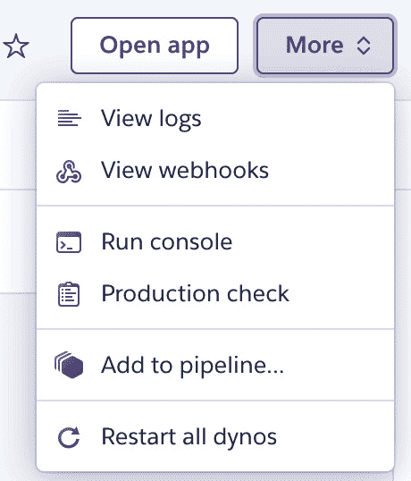

# 第七章：第*9*章：部署 Deno 应用程序

部署是任何应用程序的关键部分。我们可能会构建一个伟大的应用程序，遵循最佳实践，并编写测试，但最终，当它到达用户手中时，它将在这里证明其价值。既然我们希望这本书能带领读者经历应用程序的所有不同阶段，我们将在本章中关于应用程序部署的章节中结束这个循环。

请注意，我们没有——也不会——将部署作为软件开发的最后阶段来提及，而是将其视为将多次运行的一个阶段。我们真心相信部署不应该是每个人都害怕的事件。相反，我们认为它是令人兴奋的时刻，我们正在向用户发送功能。大多数公司就是这样看待现代软件项目中的部署的，我们确实是这种观点的忠实倡导者。部署应该是定期、自动化且容易执行的事情。它们是我们将功能发送给用户的第一步，而不是最后一步。

为了使流程的灵活性和应用程序的迭代速度得到这种敏捷，本章将重点学习关于容器以及如何使用它们部署 Deno 应用程序的知识。

我们将利用容器化的好处，创建一个隔离的环境来安装、运行和分发我们的应用程序。

随着章节的进行，我们将学习如何使用 Docker 和`git`一起创建一个自动化工作流，以便在云环境中部署我们的 Deno 应用程序。然后，我们将调整应用程序加载配置的方式，以支持根据环境不同而有不同的配置。

到本章结束时，我们的应用程序将在云环境中运行，并有一个自动化流程，使我们能够发送它的迭代版本。

在本章中，您将熟悉以下主题：

+   为应用程序准备环境

+   为 Deno 应用程序创建一个`Dockerfile`

+   在 Heroku 中构建和运行应用程序

+   为部署配置应用程序

# 技术要求

本章使用的代码可以在以下 GitHub 链接中找到：

链接：[`github.com/PacktPublishing/Deno-Web-Development/tree/master/Chapter09`](https://github.com/PacktPublishing/Deno-Web-Development/tree/master/Chapter09)

# 为应用程序准备环境

应用程序运行的环境对其有很大影响。这是导致人们常说“*它在我的机器上运行正常*”这一常见说法的一个大原因。多年来，开发者一直在创造尽可能减少这种影响的解决方案。这些解决方案可以从为应用程序自动提供新的干净实例运行，到创建更完整的包，其中包含应用程序依赖的一切。

我们可以将**虚拟机**（**VM**）或容器称为实现这一目标的手段。两者都是为同一问题提供的不同解决方案，但有一个很大的共同点：资源隔离。两者都试图将应用程序与周围的环境隔离。有多种原因，从安全、自动化到可靠性。

容器是提供应用程序包的一种现代方式。现代软件项目使用它们来提供一个几乎包含应用程序所需的所有内容的单一容器镜像。

如果您不知道容器是什么，我将为您提供 Docker（一个容器引擎）官方网站的定义：

*“容器是一个标准的软件单元，它打包了代码及其所有依赖项，以便应用程序从一个计算环境快速且可靠地运行到另一个计算环境。”*

在我们使应用程序容易部署的路径中，我们将使用 Docker 为我们的 Deno 应用程序创建这种隔离层。

最终目标是创建一个开发者可以用来部署和测试应用程序特定版本的镜像。要使用 Docker 做到这一点，我们需要配置应用程序将运行的运行时。这在一个名为`Dockerfile`的文件中定义。

这就是我们接下来要学习的内容。

# 为 Deno 应用程序创建 Dockerfile

一个`Dockerfile`将允许我们指定创建新 Docker 镜像所需的内容。这个镜像将提供一个包含应用程序所有依赖项的环境，该环境可用于开发目的和生产部署。

在本节中，我们将学习如何为 Deno 应用程序创建一个 Docker 镜像。Docker 提供了一个基础镜像，它基本上就是带隔离的容器运行时，称为`alpine`。我们可以使用这个镜像，配置它，安装所有需要的工具和依赖（即 Deno），等等。然而，我相信我们在这里不应该重新发明轮子，因此我们使用一个社区 Docker 镜像。

尽管这个镜像解决了许多我们的问题，我们仍然需要调整它以适应我们的用例。Dockerfile 可以组合，这意味着它们可以扩展其他 Docker 镜像的功能，我们将使用这个功能。

重要说明

如您所想象，我们不会深入讲解 Docker 的基础知识，因为这将是另一本书。如果您对 Docker 感兴趣，您可以从官方文档的*入门指南*开始([`docs.docker.com/get-started/`](https://docs.docker.com/get-started/))。但是，如果您目前对 Docker 不是非常熟悉，也不要担心，因为我们将会解释足够的内容，让您理解我们在这里做什么。

在开始之前，请确保通过以下链接中的步骤在您的机器上安装 Docker Desktop：[`docs.docker.com/get-docker/`](https://docs.docker.com/get-docker/)。安装并启动它之后，我们就有了创建我们的第一个 Docker 镜像所需的一切！按照以下步骤创建它：

1.  在项目的根目录下创建一个`Dockerfile`。

1.  如前所述，我们将使用社区中已经安装了 Deno 的镜像—`hayd/deno` ([`hub.docker.com/r/hayd/deno`](https://hub.docker.com/r/hayd/deno))。

    这个图像的版本号与 Deno 相同，因此我们将使用版本`1.7.5`。Docker 的`FROM`命令允许我们扩展一个图像，指定其名称和版本标签，如下面的代码片段所示：

    ```js
    FROM hayd/alpine-deno:1.7.5
    ```

1.  接下来，我们需要在容器内定义我们将要工作的文件夹。

    Docker 容器提供了一个 Linux 文件系统，默认的`workdir`是它的根（`/`）。Docker 的`WORKDIR`命令将允许我们在这个文件系统内的同一个文件夹中工作，使事情变得更加整洁。该命令可在此处看到：

    ```js
    WORKDIR /app
    ```

1.  现在，我们需要将一些文件复制到我们的容器图像中。在`COPY`命令的帮助下，我们将只复制安装步骤所需的文件。在我们这个案例中，这些是`src/deps.ts`和`lock.json`文件，如下面的片段所示：

    ```js
    COPY command from Docker allows us to specify a file to copy from the local filesystem (the first parameter) into the container image (the last parameter), which is currently the app folder. By dividing our workflows and copying only the files we need, we allow Docker to cache and rerun part of the steps only when the involved files changed. 
    ```

1.  文件在容器内后，我们现在需要安装应用程序依赖。我们将使用`deno cache`来完成此操作，如下所示：

    ```js
    deno-mongo) and also using the lock file, we have to pass additional flags. Docker's `RUN` command enables us to run this specific command inside the container.
    ```

1.  依赖项安装后，我们现在需要将应用程序的代码复制到容器中。再一次，我们将使用 Docker 的`COPY`命令完成此操作，如下所示：

    ```js
    workdir (/app folder) inside the container.
    ```

1.  为了使我们的镜像能够即插即用，我们需要做的最后一件事情是在容器内引入一个命令，该命令将在有人“执行”此镜像时运行。我们将使用 Docker 的`CMD`命令来完成此操作，如下面的片段所示：

    ```js
    CMD ["deno", "run", "--allow-net", "--unstable", "--allow-env", "--allow-read", "--allow-write", "--allow-plugin", "src/index.ts" ]
    ```

    该命令接受一个命令和参数数组，当有人尝试运行我们的图像时将被执行。

这样应该就是我们定义 Deno 应用程序 Docker 图像所需的所有内容了！有了这些功能，我们就能以与生产中相同的方式在本地下运行我们的代码，这对于调试和调查生产问题来说是一个很大的优势。

我们唯一缺少的是生成工件的实际步骤。

我们将使用 Docker `-t`标志的`build`命令来设置标签。按照以下步骤生成工件：

1.  在项目文件夹内，运行以下命令来生成图像的标签：

    ```js
    museums-api in this example) and choose whichever version you want (0.0.1 in the example).This should produce the following output:

    ```

    `museums-api:0.0.1`。我们现在可以在私有镜像仓库中发布它，或者使用公共镜像仓库，如 Docker Hub。我们稍后设置的持续集成（CI）管道将配置为自动执行这个构建步骤。我们现在可以运行这个镜像来验证一切是否按预期工作。

    ```js

    ```

1.  为了在本地运行镜像，我们将使用 Docker CLI 的`run`命令。

    由于我们处理的是一个 web 应用程序，我们需要暴露它正在运行的端口（在应用程序的`configuration`文件中设置）。我们将告诉 Docker 通过使用`-p`标志将容器端口绑定到我们机器的端口，如图以下代码片段所示：

    ```js
    0.0.1 of the museums-api image, binding the 8080 container port to the 8080 host port. We can now go to http://localhost:8080 and see that the application is running.
    ```

我们稍后将在 CI 系统中使用这个镜像定义，每当代码更改时，它都会创建一个镜像并将其推送到生产环境。

拥有包含应用程序的 Docker 镜像可以服务于多个目的。其中之一就是本章的目标：部署它；然而，这个同样的 Docker 镜像也可以用来运行和调试特定版本的某个应用程序。

让我们学习我们如何在应用程序的特定版本中运行一个终端，这是一个非常常见的调试步骤。

## 在容器内运行一个终端

我们还可以使用 Docker 镜像在镜像内执行一个终端。这可能对调试目的或尝试在应用程序的特定版本中测试某事很有用。

我们可以通过使用与以前相同的命令以及几个不同的标志来实现这一点。

我们将使用`-it`标志，这将允许我们与镜像内的终端建立交互式连接。我们还将发送一个参数，即我们希望在镜像内首先执行的命令的名称。在这个例子中，是`sh`，标准的 Unix 壳，正如您在以下示例中可以检查的那样：

```js
$ docker run -p 8080:8080 -it  museums-api:0.0.1 sh
```

这将运行`museums-api:0.0.1`镜像，将其`8080`端口绑定到宿主机的`8080`端口，并在具有交互式终端的其中执行`sh`命令，如图以下代码片段所示：

```js
$ docker run -p 8080:8080 -it  museums-api:0.0.1 sh        
/app # ls
Dockerfile           certificate.pem      config.staging.yaml  index.html           lock.json
README.md            config.dev.yaml      heroku.yml        key.pem              src
```

请注意，初始打开的 shell 文件夹是我们定义为`WORKDIR`的文件夹，我们所有的文件都在那里。在前面的例子中，我们还执行了`ls`命令。

由于我们在这个容器上附加了一个交互式 shell，我们可以使用它来运行一个 Deno 命令，例如，如图以下代码片段所示：

```js
/app # deno --version
deno 1.7.2 (release, x86_64-unknown-linux-gnu)
v8 8.9.255.3
typescript 4.1.3 
/app #
```

这为开发和调试提供了一系列可能性，因为我们将能够查看应用程序在特定版本下是如何运行的。

我们已经到了本节的最后。在这里，我们探讨了容器化，介绍了 Docker 以及它如何让我们创建一个“应用程序包”。这个包将负责应用程序周围的环境，确保它无论在何处只要有 Docker 运行时都能运行。

在下一节中，我们将使用这个相同的包将在本地构建的镜像部署到云环境。让我们开始吧！

# 在 Heroku 上构建和运行应用程序

正如我们在章节开始时提到的，我们的初始目标是实现一个简单、自动化且可复制的应用部署方式。在前一部分，我们创建了我们的容器镜像，它将作为我们部署的基础。下一步是创建一个管道，用于在任何更新发生时构建和部署我们的代码。我们将使用`git`作为我们的真相来源和触发管道构建的机制。

我们将部署代码的平台是 Heroku。这是一个平台，旨在通过提供一套工具来简化开发人员和公司在部署过程中的任务，这些工具消除了常见的障碍，例如配置机器和设置大的 CI 基础架构。使用这样的平台，我们可以更专注于应用程序以及 Deno，这是本书的目的。

在这里，我们将使用我们之前创建的`Dockerfile`，并将其设置为在 Heroku 上部署和运行。我们将了解如何轻松地将应用程序设置为在此处运行，稍后我们还将探索如何通过环境变量定义配置值。

在开始之前，请确保您已经根据这里提供的两个链接创建了账户并安装了 Heroku CLI，然后我们再按照步骤指南进行操作。

+   创建账户：[`signup.heroku.com/dc`](https://signup.heroku.com/dc)。

+   安装 CLI：[`devcenter.heroku.com/articles/heroku-cli`](https://devcenter.heroku.com/articles/heroku-cli)。

现在我们已经创建了账户并安装了 CLI，我们可以开始在 Heroku 中设置我们的项目。

## 在 Heroku 中创建应用程序

在这里，我们将介绍在 Heroku 中进行身份验证并创建应用程序所需的步骤。我们几乎准备好了，但是在我们开始之前，还有另一件事我们必须先弄清楚。

重要提示

由于 Heroku 使用`git`作为真相来源，您将*无法*按照以下过程在本书的文件仓库内进行操作，因为该仓库已经是一个包含应用程序多个阶段的 Git 仓库。

我建议您将应用程序文件复制到不同的文件夹中，*位于本书仓库之外*，并从那里开始流程。

您可以从第八章的*测试 - 单元和集成*中复制工作应用的最新版本，即我们将在这里使用的版本。[`github.com/PacktPublishing/Deno-Web-Development/tree/master/Chapter08/sections/7-final-tested-version/museums-api`](https://github.com/PacktPublishing/Deno-Web-Development/tree/master/Chapter08/sections/7-final-tested-version/museums-api)

现在文件已经复制到一个新的文件夹（主仓库外），让我们按照以下步骤部署`Dockerfile`并在 Heroku 上运行它：

1.  我们将首先做的就是使用 CLI 登录，运行`heroku login`。这应该会打开一个浏览器窗口，您可以在其中输入您的用户名和密码，如下面的代码段所示：

    ```js
    $ heroku login
    heroku: Press any key to open up the browser to login or q to exit:
    Opening browser to https://cli-auth.heroku.com/auth/cli/...
    Logging in... done
    Logged in as your-login-email@gmail.com
    ```

1.  由于 Heroku 的部署基于`git`，而我们当前所在的文件夹并非 Git 仓库，因此我们需要初始化它，步骤如下：

    ```js
    $ git init
    Initialized empty Git repository in /Users/alexandre/dev/ museums-api/.git/
    ```

1.  然后，我们通过使用`heroku create`命令在 Heroku 上创建应用，步骤如下：

    ```js
    heroku, which is where we have to push our code to trigger the deployment process.
    ```

如果你在运行上述命令后访问 Heroku 控制台，你会注意到那里有一个新应用。当应用创建时，Heroku 会在控制台打印一个 URL；然而，由于我们还没有进行任何配置，所以应用目前不可用。

接下来我们需要做的是配置 Heroku，使其知道它应该在每次部署时构建和执行我们的镜像。

## 构建和运行 Docker 镜像

默认情况下，Heroku 试图通过运行代码使你的应用可用。这对于许多语言来说都是可能的，你可以在 Heroku 文档中找到相关指南。由于我们希望使用容器来运行应用，因此需要进行一些额外的配置。

Heroku 提供了一系列特性，使我们能够定义代码发生变化时的行为，通过一个名为`heroku.yml`的文件。我们现在将创建这样的文件，步骤如下：

1.  在仓库根目录下创建一个`heroku.yml`文件，并添加以下代码行，以便使用 Docker 构建我们的镜像，使用我们在上一节中创建的`Dockerfile`：

    ```js
    build:
      docker:
        web: Dockerfile
    ```

1.  现在，在同一个文件中，添加以下代码行以定义 Heroku 将执行以运行应用的命令：

    ```js
    build:
      docker:
        web: Dockerfile
    Dockerfile, and that's true. Normally, Heroku would run the command from the `Dockerfile` to execute the image, and it would work. It happens that Heroku doesn't run these commands as root, as a security best practice. Deno, at its current stage, needs root privileges whenever you want to use plugins (an unstable feature). As our application is using a plugin to connect with MongoDB, we need this command to be explicitly defined on `heroku.yml` so that it is run with root privileges and works when Deno is starting up the application.  
    ```

1.  接下来我们需要做的是将应用类型设置为`container`，告知 Heroku 我们希望以这种方式运行这个应用。这段代码如下所示：

    ```js
    heroku.yml file included) to version control and push it to Heroku so that it starts the build.
    ```

1.  添加所有文件以确保`git`追踪它们：

    ```js
    $ git add .
    ```

1.  提交所有文件并附上信息，步骤如下：

    ```js
    -m flag that we've used is a command that allows us to create a commit with a message with a short syntax.
    ```

1.  现在，需要将文件推送到`heroku`远程仓库。

    这应该触发 Docker 镜像的构建过程，你可以在日志中进行检查。然后，在最后阶段，这个镜像会被推送到 Heroku 内部的镜像仓库，如下代码片段所示：

    ```js
    Dockerfile, following all the steps specified there, as happened when we built the image locally, as illustrated in the following code snippet: 

    ```

    远程仓库：=== 推送 web（Dockerfile）

    远程仓库：将标签为“5c154f3fcb23f3c3c360e16e929c22b62847fcf8”的镜像标记为“registry.heroku.com/boiling-dusk-18477/web”

    远程仓库：使用默认标签：latest

    远程仓库：推送指的是[registry.heroku.com/boiling-dusk-18477/web]仓库

    远程仓库：6f8894494a30: 准备中

    远程仓库：f9b9c806573a: 准备中

    ```js

    And it should be working, right? Well…, not really. We still have a couple of things that we need to configure, but we're almost there.
    ```

请记住，我们的应用依赖于配置，而配置的一部分来自环境。Heroku 肯定知道我们需要哪些配置值。还有一些设置我们需要配置以使应用运行，接下来我们将完成这个任务。

# 配置应用以进行部署

我们现在有一个应用程序，当代码推送到 `git` 时，它开始构建镜像并部署它。我们的应用程序目前被部署了，但它实际上并没有运行，这是因为它缺少配置。

你首先注意到的一件事可能是我们的应用程序总是加载开发环境的配置文件，即 `config.dev.yml`，这是不正确的。

当我们第一次实现这个时，我们认为不同的环境会有不同的配置，我们是对的。当时，我们不需要为多个环境配置多个配置文件，我们使用了 `dev` 作为默认值。让我们来纠正这个。

记得当我们创建加载配置文件的函数时，我们明确使用了一个环境参数？当时我们没有使用它，但我们留下了一个默认值。

查看以下来自 `src/config/index.ts` 的代码片段：

```js
export async function load(
  env = "dev",
): Promise<Configuration> {
```

我们需要做的是将这个改为支持多个环境。所以，让我们按照以下步骤来做到这一点：

1.  回到 `src/index.ts` 文件中，确保我们向 `load` 函数发送了一个名为 `DENO_ENV` 的环境变量，如下面的代码片段所示：

    ```js
    const config = await
      loadConfiguration(DENO_ENV is not defined, and allow us to load a different configuration file in production.
    ```

1.  创建生产环境配置文件 `config.production.yml`。

    现在，它应该与 `config.dev.yml` 没有太大区别，除了 `port` 之外。让我们在生产环境中将其运行在端口 `9001`，如下所示：

    ```js
    web:
      port: 9001
    ```

    为了在本地测试这个，我们可以设置 `DENO_ENV` 变量为 `production` 来运行应用程序，像这样：

    ```js
    DENO_ENV). We mentioned how you can do this in *Chapter 7**, HTTPS, Extracting Configuration, and Deno in the Browser*, in the *Accessing secret values* section.And after running it we can confirm it's loading the correct file, because the application port is now `9001`.
    ```

有了我们刚刚实施的内容，我们现在可以根据环境控制加载哪些配置值。这是我们已经在本地测试过的，但在 Heroku 上还没有做过。

我们已经解决了问题的一部分——我们根据环境加载不同的配置文件，但我们的应用程序依赖的其他配置值来自环境。那些是诸如 **JSON Web Token** (**JWT**) 密钥或 MongoDB 凭据等机密值。

有很多方法可以做到这一点，所有云服务提供商都提供了相应的解决方案。在 Heroku 上，我们可以使用 `config` 命令来实现，如下所示：

1.  定义 MongoDB 凭据变量、JWT 密钥和环境，使用 `heroku config:set` 命令，如下所示：

    ```js
    DENO_ENV variable so that our application knows that, when running in Heroku, it is the production environment.If you are not using your own MongoDB cluster and you have questions about its credentials, you can go back to *Chapter 6*, *Adding Authentication and Connecting to the Database*, where we created a MongoDB cluster in MongoDB Atlas.If you're using a different cluster, remember that it is defined in the configuration file in `config.production.yml` and not in the environment, and thus you need to add your cluster URL and database in the configuration file as follows:

    ```

    …

    mongoDb:

    clusterURI: <添加你的集群 url>

    database: <添加你的数据库名称>

    ```js

    ```

1.  再次，我们将把我们的更改添加到 `git` 中，如下所示：

    ```js
    $ git commit -am "Configure environment variables and DENO_ENV"
    ```

1.  然后，我们将把更改推送到 Heroku 以触发部署过程，如下所示：

    ```js
    $ git push heroku master
    …
    remote: Verifying deploy... done.
    To https://git.heroku.com/boiling-dusk-18477.git
       9340446..36a061e  master -> master
    ```

    它应该能正常工作。如果我们现在访问 Heroku 仪表板 ([`dashboard.heroku.com/`](https://dashboard.heroku.com/)），然后进入我们应用程序的仪表板 ([`dashboard.heroku.com/apps/boiling-dusk-18477`](https://dashboard.heroku.com/apps/boiling-dusk-18477)，在我的案例中) 并点击 **打开应用程序** 按钮，它应该打开我们的应用程序，对吗？

    还没有，但我们快到了——我们还需要解决一件事。

## 从环境中获取应用程序端口

当在 Heroku 上运行 Docker 镜像时，Heroku 有一些特别之处。它不允许我们设置应用程序运行的端口。它所做的是为应用程序分配一个端口，然后将来自应用程序 URL 的**超文本传输协议**（**HTTP**）和**超文本传输协议安全**（**HTTPS**）流量重定向到那里。如果这听起来仍然很奇怪，不用担心——我们会解释清楚。

正如你所知，我们在`config.production.yml`文件中明确定义了应用程序将要运行的端口。我们需要适应这一点。

Heroku 定义应用程序应运行的端口的方式是通过设置`PORT`环境变量。这在以下链接中有文档说明：

[`devcenter.heroku.com/articles/container-registry-and-runtime#dockerfile-commands-and-runtime`](https://devcenter.heroku.com/articles/container-registry-and-runtime#dockerfile-commands-and-runtime)

从标题中你可能知道我们接下来要做什么。我们要更改我们的应用程序，以便来自环境的 Web 服务器端口覆盖配置文件中定义的那个。

回到应用程序中的`src/config/index.ts`，确保它从环境中读取`PORT`变量，覆盖来自文件的配置。代码如下所示：

```js
type Configuration = {
  web: {
    port: number;
  };
  cors: { 
…
export async function load(
  env = "dev",
): Promise<Configuration> {
  const configuration = parse(
    await Deno.readTextFile(`./config.${env}.yaml`),
  ) as Configuration;
  return {
    ...configuration,
    web: {
      ...configuration.web,
      port: Number(Deno.env.get("PORT")) ||
        configuration.web.port,
    },
…
```

这样，我们确保我们从`PORT`环境变量中读取变量，并在配置文件中使用默认值。

这样一来，让我们的应用程序在 Heroku 上顺利运行就应该没问题了！

再次，我们可以通过访问 Heroku 控制台([`dashboard.heroku.com/apps/boiling-dusk-18477`](https://dashboard.heroku.com/apps/boiling-dusk-18477))并点击**打开应用**按钮来测试这一点，或者你可以直接访问 URL——在我的情况下，是[`boiling-dusk-18477.herokuapp.com/`](https://boiling-dusk-18477.herokuapp.com/)。

重要提示

如果你像我们在第六章中使用 MongoDB Atlas，*添加身份验证并连接到数据库*，并希望允许你的应用程序访问数据库，你必须配置它以启用来自“任何地方”的连接。如果你将应用程序暴露给用户，这并不是推荐的做法，而且只因为我们使用 Heroku 的免费层才这样。由于它在一个共享的集群中运行，我们没有办法知道运行应用程序的机器的固定的**互联网协议**（**IP**）地址，我们只能这样做。

以下链接展示了如何配置数据库的网络访问：[`docs.atlas.mongodb.com/security/ip-access-list`](https://docs.atlas.mongodb.com/security/ip-access-list)。确保你在 MongoDB Atlas 网络访问屏幕上点击**允许从任何地方访问**。

网络访问屏幕看起来是这样的：


图 9.1 – MongoDB Atlas 网络访问屏幕

之后，我们的应用应该能如预期般正常工作；你可以尝试执行一个注册用户的请求（它连接到数据库）并检查一切是否正常，如下面的代码片段所示：

```js
$ curl -X POST -d '{"username": "test-username-001", "password": "testpw1" }' -H 'Content-Type: application/json' https://boiling-dusk-18477.herokuapp.com/api/users/register
{"user":{"username":"test-username-001","createdAt":"2020-12-19T16:49:51.809Z"}}%
```

如果你得到的响应与前面的类似，那就大功告成了！我们成功地在云环境中配置并部署了我们的应用，并创建了一种自动化的方式将更新部署给我们的用户。

为了进行最后的测试，以确保代码正在成功部署，我们可以尝试更改代码的一部分并再次触发部署过程。让我们这样做！按照以下步骤进行：

1.  将`src/web/index.ts`中的`"Hello World"`消息更改为`"Hello Deno World!"`，如图所示：

    ```js
    app.use((ctx) => {
      ctx.response.body = "Hello Deno World!";
    });
    ```

1.  将此更改添加到版本控制中，如下所示：

    ```js
    $ git commit -am "Change Hello World message"
    [master 35f7db7] Change Hello World message
     1 file changed, 1 insertion(+), 1 deletion(-)
    ```

1.  将其推送到 Heroku 的`git`远程仓库，像这样：

    ```js
    $ git push heroku master
    Enumerating objects: 9, done.
    Counting objects: 100% (9/9), done.
    Delta compression using up to 8 threads
    Compressing objects: 100% (5/5), done.
    Writing objects: 100% (5/5), 807 bytes | 807.00 KiB/s, done.
    Total 5 (delta 4), reused 0 (delta 0)
    remote: Compressing source files… Done
    …
    remote: Verifying deploy... done.
    To https://git.heroku.com/boiling-dusk-18477.git
    ```

1.  如果你现在访问应用的 URL（在我们的案例中是[`boiling-dusk-18477.herokuapp.com/`](https://boiling-dusk-18477.herokuapp.com/)），你应该会看到`Hello Deno World`的消息。

这意味着我们的应用已成功部署。由于我们使用的是一个提供比我们在这里学到的更多功能的云平台，我们可以探索其他 Heroku 功能，比如日志记录。

在 Heroku 控制面板上的**打开应用**按钮旁边，有一个**更多**按钮。其中一个选项是**查看日志**，正如你在下面的屏幕截图中所看到的：



图 9.2 – Heroku 控制面板中的应用更多选项

如果你点击那里，一个显示实时日志的界面将会出现。你可以尝试通过点击另一个标签页中的**打开应用**按钮来打开你的应用。

你会看到日志立即更新，那里应该会出现类似这样的内容：

```js
2020-12-19T17:04:23.639359+00:00 app[web.1]: GET http://boiling-dusk-18477.herokuapp.com/ - 1ms
```

这对于你想对应用的运行情况进行非常轻量级的监控非常有用。日志记录功能在免费层中提供，但还有许多其他功能供你探索，比如我们在这里不会做的**指标**功能。

如果你想要详细查看你的应用是在何时以及由谁部署的，你也可以使用 Heroku 控制面板上的**活动**部分，如图所示：


图 9.3 – Heroku 控制面板应用选项

然后，你会看到你最近部署的日志，这是 Heroku 的另一个非常有趣的功能，如图所示：


图 9.4 – Heroku 控制面板应用活动标签

这标志着我们在云环境中部署应用程序部分的结束。

我们关注的是应用程序及其可以在不同平台上独立重用的主题。我们迭代了加载配置的应用程序逻辑，使其能够根据环境加载不同的配置。

然后，我们学习了如何将包含机密配置值的环境变量发送到我们的应用程序，最后通过探索本例中选择的平台 Heroku 上的日志记录来结束。

我们成功让应用程序运行起来，并且围绕它创建了一个完整的架构，这将使未来的迭代能够轻松地部署给我们的用户。希望我们经历了一些您下次部署 Deno 应用程序时也会遇到阶段。

# 总结

现在，我们已经完成了大部分工作！本章完成了我们应用程序开发周期的循环，通过部署它。我们从构建一个非常简单的应用程序开始，然后向其中添加功能，再添加测试，最后—部署它。

在这里，我们学习了如何利用容器化的一些优势来应用我们的应用程序。我们开始学习 Docker，我们选择的容器运行时，并迅速转到为我们的应用程序创建镜像。在学习过程中了解一些 Docker 命令，我们也体验了将 Deno 应用程序部署出去有多容易。

创建这个 Docker 镜像使我们能够以一种可复用的方式安装、运行和分发我们的应用程序，创建一个包含应用程序所需的所有内容的包。

随着章节的进行，我们开始探索如何使用这个应用程序包将其部署到云环境中。我们首先配置了本步骤指南中选择的云平台 Heroku，使其每次发生变化时都会重新构建并运行我们的应用程序代码，在`git`和 Heroku 文档的帮助下，我们非常容易地实现了这一点。

由于自动化流水线已经配置完成，我们理解了需要将配置值发送到我们的应用程序。之前在早期章节中实现的这些相同的配置值，需要通过配置文件和环境变量两种不同的方式发送到应用程序中。我们逐一解决了这些需求，首先通过迭代应用程序代码，使其根据环境加载不同的配置，随后学习了如何在 Heroku 上运行的应用程序中设置配置值。

最终，我们的应用程序运行得完美无缺，并完成了本章的目标：为我们的用户提供一种可复用、自动化的部署代码方式。与此同时，我们还了解了一些关于 Docker 以及容器化和自动化在发布代码方面的优势。

这本书的内容基本上已经讲到这里了。我们决定让这个过程成为一个建立应用程序的旅程，分别经历它的所有阶段并在需要时解决它们。这是最后一个阶段——部署，希望这能为您从编写第一行代码到部署的整个周期画上句号。

下一章将重点关注 Deno 接下来的发展，包括运行时和您个人方面。我希望这能让您成为 Deno 的爱好者，并且您对它以及它所开启的无限可能世界像我一样充满热情。
