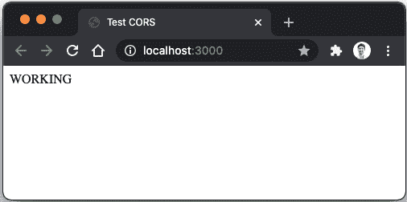
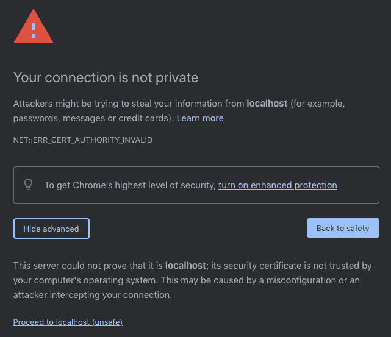
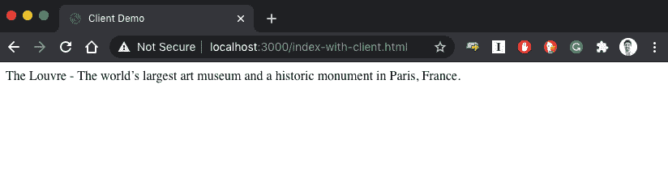

# 第七章：HTTPS，提取配置，Deno 在浏览器中运行

在上一章中，我们基本上完成了应用程序的所有功能。我们添加了授权和持久性，最终得到了一个连接到 MongoDB 实例的应用程序。在本章中，我们将专注于一些已知的最优实践，这些实践在生产应用程序中是标准的：基本安全实践和处理配置。

首先，我们将为我们的**应用程序编程接口**（**API**）添加一些基本的安全特性，从**跨源资源共享**（**CORS**）保护开始，以启用基于来源的请求过滤。然后，我们将学习如何在我们的应用程序中启用**安全超文本传输协议**（**HTTPS**），以便它支持加密连接。这将允许用户使用安全的连接对 API 进行请求。

到目前为止，我们使用了一些秘密值，但我们并不担心它们在代码中。在本章中，我们将提取配置和秘密值，以便它们不必存在于代码库中。我们还将学习如何安全地存储和注入这些值。这样，我们可以确保这些值保持秘密，并且不在代码中。通过这样做，我们还将使不同的部署具有不同的配置成为可能。

接下来，我们将探索由 Deno 的其中一个特定功能启用的能力：在浏览器中编译和运行代码的能力。通过使用 Deno 与 ECMAScript 6（现代浏览器支持的）的兼容性，我们将 API 和前端之间的代码共享，启用一个全新的可能性世界。

利用这个特定功能，我们将探索一个特定的场景：为 API 构建一个 JavaScript 客户端。这个客户端将使用与服务器上运行的相同类型和代码部分构建，并探索由此带来的好处。

本章结束了本书的*构建应用程序*部分，我们一步一步地构建了一个应用程序，用逐步增加的方法添加了一些常见应用程序特性。在学习的同时，我们还确保这个应用程序尽可能接近现实，这是一本介绍性的书籍。这使我们能够在创建功能应用程序的同时学习 Deno，它的许多 API 以及一些社区包。

到本章结束时，您将熟悉以下主题：

+   启用 CORS 和 HTTPS

+   提取配置和秘密值

+   在浏览器中运行 Deno 代码

# 技术要求

本章所需的代码文件可以在以下 GitHub 链接中找到：

链接：[`github.com/PacktPublishing/Deno-Web-Development/tree/master/Chapter07/sections`](https://github.com/PacktPublishing/Deno-Web-Development/tree/master/Chapter07/sections)

# 启用 CORS 和 HTTPS

CORS 保护和 HTTPS 支持是任何运行中的生产应用程序考虑的两个关键因素。本节将解释如何将它们添加到我们正在构建的应用程序中。

还有许多其他的安全实践可以添加到任何 API 中。由于这些不是 Deno 特定内容，并且应该单独成书，所以我们决定专注于这两个要素。

我们将首先了解 CORS 以及如何利用`oak`和我们所知的中间件功能来实现它。然后，我们将学习如何使用自签名证书，并使我们的 API 处理安全 HTTP 连接。

让我们开始吧，从 CORS 开始。

## 启用 CORS

如果你不熟悉 CORS，它是一种机制，使服务器能够指示浏览器它们应该允许从哪些源加载资源。当应用程序在 API 相同的域上运行时，CORS 甚至是不必要的，因为名称直接表明了一切。

以下是从**Mozilla 开发者网络**（**MDN**）摘录的关于 CORS 的解释：

"跨源资源共享（CORS）是一个基于 HTTP 头的机制，允许服务器指示浏览器应该允许从其自身以外的任何其他源（域、协议或端口）加载资源。CORS 还依赖于一种机制，通过这种机制，浏览器向跨源资源所在的服务器发起一个“预检”请求，以检查服务器是否允许实际请求。在预检中，浏览器发送头信息，指示实际请求中将使用的 HTTP 方法和头信息。"

为了给你一个更具体的例子，想象你有一个运行在`the-best-deno-api.com`的 API，并且你想处理从`the-best-deno-client.com`发起的请求。在这里，你希望你的服务器对`the-best-deno-client.com`域启用 CORS。

如果你没有启用它，浏览器将向你的 API 发起一个预检请求（使用`OPTIONS`方法），对这个请求的响应将不会包含`Access-Control-Allow-Origin: the-best-deno-client.com`头，导致请求失败并阻止浏览器进一步请求。

我们将学习如何在我们的应用程序中启用这个机制，允许从`http://localhost:3000`发起请求。

由于我们的应用程序使用了`oak`框架，我们将学习如何使用这个框架来实现。然而，这与其他任何 HTTP 框架非常相似。我们基本上需要添加一个中间件函数，该函数处理请求并将请求的来源与允许的域列表进行比对。

我们将使用一个名为`cors`的社区包：（https://deno.land/x/cors@v1.2.1）

重要提示

我们将使用前一章中创建的代码来启动此实现。这可以在[`github.com/PacktPublishing/Deno-Web-Development/tree/master/Chapter06/sections/4-connecting-to-mongodb/museums-api`](https://github.com/PacktPublishing/Deno-Web-Development/tree/master/Chapter06/sections/4-connecting-to-mongodb/museums-api)找到。你也可以查看本节完成后的代码：

[`github.com/PacktPublishing/Deno-Web-Development/tree/master/Chapter07/sections/3-deno-on-the-browser/museums-api`](https://github.com/PacktPublishing/Deno-Web-Development/tree/master/Chapter07/sections/3-deno-on-the-browser/museums-api)

在这里，我们将向我们的应用程序添加`cors`包，以及我们自己的允许域名列表。最终目标是使我们可以从可信网站向此 API 发送请求。

让我们这样做。按照以下步骤进行：

1.  通过更新`deps`文件安装`cors`模块（参考第三章，《运行时和标准库》，了解如何进行此操作）。代码如下所示：

    ```js
    export { oakCors } from
      "https://deno.land/x/cors@v1.2.1/oakCors.ts";
    ```

1.  接下来，运行`cache`命令以更新`lock`文件，如下所示：

    ```js
    $ deno cache --lock=lock.json --lock-write --unstable src/deps.ts
    ```

1.  在`src/web/index.ts`上导入`oakCors`，并在注册路由之前注册它，如下所示：

    ```js
    import { Algorithm, oakCors } from "../deps.ts"
    …
    oakCors middleware creator function, by sending it an array of allowed origins—in this case, http://localhost:3000. This will make the API answer to the OPTIONS request with an Access-Control-Allow-Origin: http://localhost:3000 header, which will signal to the browser that if the website making requests is running on http://localhost:3000, it should allow further requests.This will work just fine. However, having this *hardcoded* domain here seems a little bit strange. We've been injecting all the similar configuration to the application. Remember what we did with the `port` configuration? Let's do the same for the allowed domains.
    ```

1.  将`createServer`函数的参数更改为在`configuration`内部接收一个名为`allowedOrigins`的字符串数组，并将其传递给`oakCors`中间件创建函数。这段代码如下所示：

    ```js
    interface CreateServerDependencies {
      configuration: {
        port: number,
        authorization: {
          key: string,
          algorithm: Algorithm
        },
        oakCors middleware creator.
    ```

1.  然而，还有一件事缺失——我们需要从`src/index.ts`发送这个`allowedOrigins`数组。让我们这样做，如下所示：

    ```js
    createServer({
      configuration: {
        port: 8080,
        authorization: {
          key: authConfiguration.key,
          algorithm: authConfiguration.algorithm
        },
        http://localhost:3000. 
    ```

1.  让我们来测试一下，首先通过以下方式运行 API：

    ```js
    $ deno run --allow-net --unstable --allow-env --allow-read --allow-write --allow-plugin src/index.ts
    Application running at http://localhost:8080
    ```

1.  要测试它，请在根目录（`museums-api`）中创建一个名为`index.html`的 HTML 文件，其中包含一个执行`POST`请求到`http://localhost:8080/api/users/register`的脚本。这段代码如下所示：

    ```js
    <!DOCTYPE html>
    <html lang="en">
      <head>
        <meta charset="UTF-8" />
        <meta name="viewport" content="width=device-width,
           initial-scale=1.0" />
        <title>Test CORS</title>
      </head>
      <body>
        <div id="status"></div>
        <script type="module">              
        div tag and altering its inner HTML code in the cases that the request works or fails so that it's easier for us to diagnose.In order for us to serve the HTML file and test this, you can leverage Deno and its ability to run remote scripts.
    ```

1.  在创建`index.html`文件的同一目录下，让我们运行 Deno 的标准库 Web 服务器，使用`-p`标志将端口设置为`3000`，`--host`将主机设置为`localhost`。这段代码如下所示：

    ```js
    $ deno run --allow-net --allow-read https://deno.land/std@0.83.0/http/file_server.ts -p 3000 --host localhost
    HTTP server listening on http://localhost:3000/
    ```

1.  用浏览器访问`http://localhost:3000`，你应该会看到一个**WORKING**消息，如下截图所示：

    Figure 7.1 – 测试 CORS API 是否正常工作

1.  如果你想要测试当源不在`allowedOrigins`列表中时会发生什么，你可以运行相同的命令，但使用不同的端口（或主机），并检查行为。这段代码如下所示：

    ```js
    $ deno run --allow-net --allow-read https://deno.land/std/http/file_server.ts -p 3001 --host localhost
    HTTP server listening on http://localhost:3001/
    ```

    现在，你可以在新建的**统一资源定位符**（**URL**）上用浏览器导航，你应该会看到一个**NOT WORKING**消息。如果你查看浏览器的控制台，你还可以确认浏览器正在警告你 CORS 预检请求失败。这是期望的行为。

这就是我们需要的，以便在 API 上启用 CORS！

我们使用的第三方模块还有一些其他选项供您探索-例如过滤特定的 HTTP 方法或用不同的状态码回答预检请求。 目前，默认选项对我们来说已经足够了。 现在，我们将进入并了解如何使用户能够通过 HTTPS 连接到应用程序，添加一个额外的安全层和加密层。

## 启用 HTTPS

如今任何面向用户的应用程序不仅应该允许，还应该强制其用户通过 HTTPS 连接。这是一个在 HTTP 之上添加的安全层，确保所有连接都通过可信证书进行加密。 once again，我们不会尝试给出定义，而是使用以下来自 MDN 的定义([`developer.mozilla.org/en-US/docs/Glossary/https`](https://developer.mozilla.org/en-US/docs/Glossary/https)):

"HTTPS（安全超文本传输协议）是 HTTP 协议的加密版本。 它使用 SSL 或 TLS 来加密客户端和服务器之间的所有通信。 这条安全连接允许客户端安全地与服务器交换敏感数据，例如执行银行活动或在线购物时。"

通过在我们的应用程序中启用 HTTPS 连接，我们可以确保它更难拦截和解释请求。如果没有这个，恶意用户可以拦截登录请求，并获得用户的密码-用户名组合。我们在保护用户的敏感数据。

由于我们在应用程序中使用`oak`，我们将寻找一个解决方案，了解如何在它的文档中支持 HTTPS 连接。通过查看`doc.deno.land/https/deno.land/x/oak@v6.3.1/mod.ts`，我们可以看到`Application.listen`方法接收一个`configuration`对象，与我们之前用来发送`port`变量的对象相同。 还有一些其他选项，正如我们在这里看到的：`doc.deno.land/https/deno.land/x/oak@v6.3.1/mod.ts#Application`。 我们将使用它来启用 HTTPS。

让我们看看如何通过以下步骤更改`oak`的配置，以便它支持安全连接：

1.  打开`src/web/index.ts`，并在`listen`方法调用中添加`secure`、`keyFile`和`certFile`选项，如下所示：

    ```js
    await app.listen({
      port,
    certFile and keyFile properties expect a path to the certificate and the key files. If you don't have a certificate or you don't know how to create a self-signed one, no worries. Since this is only for learning purposes, you can use ours from the book's files at [`github.com/PacktPublishing/Deno-Web-Development/tree/master/Chapter07/sections/1-enabling-cors-and-https/museums-api`](https://github.com/PacktPublishing/Deno-Web-Development/tree/master/Chapter07/sections/1-enabling-cors-and-https/museums-api). Here, you'll find `certificate.pem` and `key.pem` files that you can download and use. You can download them wherever you want in your computer, but we'll assume they're at the project root folder (`museums-api`) in the next code samples.
    ```

1.  为了保持我们的代码整洁且更可配置，让我们提取这些选项并将它们作为参数发送到`createServer`函数中，如下所示：

    ```js
    export async function createServer({
      configuration: {
        …
        secure,
        keyFile,
        certFile,
      },
      …
    }: CreateServerDependencies) {
    ```

1.  这是`CreateServerDependencies`参数类型应该的样子：

    ```js
    interface CreateServerDependencies {
      configuration: {
        port: number,
        authorization: {
          key: string,
          algorithm: Algorithm
        },
        allowedOrigins: string[],
        secure: boolean,
        keyFile: string,
        certFile: string
      },
      museum: MuseumController,
      user: UserController
    }
    ```

1.  这就是之后的`createServer`函数的样子，带有解构的参数：

    ```js
    export async function createServer({
      configuration: {
        port,
        authorization,
        allowedOrigins,
        secure,
        keyFile,
        certFile,
      },
      museum,
      user
    }: CreateServerDependencies) {
    …
    await app.listen({
      port,
      secure,
      keyFile,
      certFile
    });
    ```

1.  最后，我们将从`src/index.ts`文件发送证书和密钥文件的路径，如下所示：

    ```js
    createServer({
      configuration: {
        port: 8080,
        authorization: {
          key: authConfiguration.key,
          algorithm: authConfiguration.algorithm
        },
        allowedOrigins: ['http://localhost:3000'],
        secure: true,
        certFile: './certificate.pem',
        keyFile: './key.pem'
      },
      museum: museumController,
      user: userController
    })
    ```

    现在，为了保持日志的准确性，我们需要修复我们之前创建的日志程序，该程序记录应用程序正在运行。这个处理程序现在应该考虑到应用程序可能通过 HTTP 或 HTTPS 运行，并相应地记录。

1.  回到`src/web/index.ts`，修复监听`listen`事件的监听器，使其检查连接是否安全。这段代码如下：

    ```js
      app.addEventListener('listen', e => {
        console.log(`Application running at 
          ${e.secure ? 'https' : 'http'}://${e.hostname ||
            'localhost'}:${port}`)
      })
    ```

1.  让我们运行这个应用程序，看看它是否工作：

    ```js
    $ deno run --allow-net --unstable --allow-env --allow-read --allow-plugin src/index.ts
    Application running at https://localhost:8080
    ```

你现在应该能够访问该 URL 并连接到应用程序。

你可能仍然会看到安全警告，但不用担心。你可以点击**高级**和**继续访问 localhost (不安全)**，如图所示：



Figure 7.2 – Chrome 安全警告屏幕

这是由于证书是自签名的，并没有被可信任的证书机构签名。然而，这并不会有很大影响，因为过程与生产证书完全相同。

如果你仍然有问题，你可能需要直接访问 API URL，然后打开这个页面（`https://localhost:8080/`）。从那里，你可以按照以下链接（https://jasonmurray.org/posts/2021/thisisunsafe/)的程序，启用与不使用可信任证书的 API 的通信。之后，访问`https://localhost:8080`就会正常工作。

一旦你有一个合适的证书，由可信任的证书机构签名，你可以像我们这样使用它，一切都会正常工作。

这部分就到这里！我们向现有应用程序添加了 CORS 和 HTTPS 支持，提高了其安全性。

在下一节中，我们将了解如何从我们的代码中提取配置和密钥，使其从外部更加灵活和可配置。

出发吧！

# 提取配置和密钥

任何应用，无论其规模如何，都会有配置参数。通过查看我们在前几章中构建的应用程序，即使我们看最简单的版本——*Hello World* Web 服务器——我们也会发现配置值，如`port`值。

同时，我们发送一个名为`configuration`的完整对象到`createServer`函数中，该函数用于启动 Web 服务器。同时，我们还有一些知道应该是密钥的值。它们目前保存在代码库中，因为这对于我们的目的（学习）来说是可行的，但我们希望改变它。

我们考虑的东西比如**JSON Web Token**（**JWT**）加密密钥，或者 MongoDB 的凭据。这些绝对不是你想放进你的版本控制系统的东西。这一节就是讲这个。

我们将查看当前存储在代码库中的配置值和秘密。我们将提取它们，以便它们可以保持机密，并且只在应用程序运行时传递给应用程序。

进行这个过程可能在应用程序中配置值分散在多个模块和文件时是一项艰巨的工作。然而，由于我们遵循一些架构最佳实践，并考虑保持代码解耦和可配置，我们使自己的生活变得稍微容易了一些。

通过查看`src/index.ts`，你可以确认我们正在使用的所有配置值和秘密都存储在那里。这意味着所有其他模块都不知道配置，这才是正确的做法。

我们将分两个阶段进行这个“迁移”。首先，我们将所有配置值提取到一个`configuration`模块中，然后我们将提取秘密。

## 创建配置文件

首先，让我们找出代码中哪些硬编码值应该存储在配置文件中。以下代码片段突出了我们不想在代码中存储的值：

```js
client.connectWithUri("mongodb+srv://deno-
  api:password@denocluster.wtit0.mongodb.net/
    ?retryWrites=true&w=majority")
const db = client.database("getting-started-with-deno");
…
const authConfiguration = {
  algorithm: 'HS512' as Algorithm,
  key: 'my-insecure-key',
  tokenExpirationInSeconds: 120
}
createServer({
  configuration: {
    port: 8080,
    authorization: {
      key: authConfiguration.key,
      algorithm: authConfiguration.algorithm
    },
    allowedOrigins: ['http://localhost:3000'],
    secure: true,
    certFile: './certificate.pem',
    keyFile: './key.pem'
  },
…
```

通过查看我们应用程序代码中的这段代码，我们可以 already 识别出一些东西，如下所示：

+   集群 URL 和数据库名称（用户名和密码是秘密）

+   JWT 算法和过期时间（密钥是秘密）

+   Web 服务器端口

+   CORS 允许的源

+   HTTPS 证书和密钥文件路径

这里是我们将要提取的元素。我们将从创建包含所有这些值的我们的配置文件开始。

我们将使用**YAML Ain't Markup Language**（**YAML**），因为这是一种常用于配置的文件类型。如果你不熟悉它，不用担心——它是相当简单的。你可以在官方网站上获得它的工作方式的概述，网址为：[`yaml.org/`](https://yaml.org/)。

我们还将确保为不同的环境有不同的配置文件，从而创建一个以环境名命名的文件。

接下来，我们将实现一个功能，允许我们将配置存储在文件中，首先创建文件本身，如下所示：

1.  在项目的根目录下创建一个`config.dev.yaml`文件，并添加所有配置，像这样：

    ```js
    web:
      port: 8080
    cors:
      allowedOrigins:
        - http://localhost:3000
    https:
      key: ./key.pem
      certificate: ./certificate.pem
    jwt:
      algorithm: HS512
      expirationTime: 120
    mongoDb:
      clusterURI: deno-cluster.wtit0.mongodb.net/
        ?retryWrites=true&w=majority
      database: getting-started-with-deno
    ```

    我们现在需要一种将此文件加载到我们应用程序中的方法。为此，我们将在`src`文件夹中创建一个名为`config`的模块。

    为了读取配置文件，我们将使用我们在第二章*《工具链》*中学到的文件系统函数，以及 Deno 标准库中的`encoding`包。

1.  在`src`目录下创建一个名为`config`的文件夹，并在其中创建一个名为`index.ts`的文件。

    在这里，我们将定义一个名为`load`的函数，并将其导出。这个函数将负责加载配置文件。这段代码展示了这个功能：

    ```js
    export async function load() {
    }
    ```

1.  由于我们使用 TypeScript，我们将定义将成为我们配置文件的类型，并将其作为`load`函数的返回类型。这应该与之前创建的配置文件的结构相匹配。这段代码如下所示：

    ```js
    import type { Algorithm } from "../deps.ts";
    type Configuration = {
      web: {
        port: number
      },
      cors: {
        allowedOrigins: string[],
      },
      https: {
        key: string,
        certificate: string
      },
      jwt: {
        algorithm: Algorithm,
        expirationTime: number
      },
      mongoDb: {
        clusterURI: string,
        database: string
      },
    }
    export async function load(): Promise<Configuration> {
    …
    ```

1.  在`load`函数内部，我们现在应该尝试加载我们之前创建的配置文件，通过使用 Deno 文件系统 API。由于根据环境可能会有多个文件，我们还将`env`作为`load`函数的参数，默认值为`dev`，如下所示：

    ```js
    export async function load(env = 'dev'):
      Promise<Configuration> {
      Object so that we can access it. For this, we'll use the YAML encoding functionality from the standard library.
    ```

1.  从 Deno 标准库安装 YAML 编码器模块，使用`deno cache`确保我们更新`lock`文件（参考第三章，*运行时和标准库*），并在`src/deps.ts`中导出，如下所示：

    ```js
    export { parse } from
      "https://deno.land/std@0.71.0/encoding/yaml.ts"
    ```

1.  在`src/config/index.ts`中导入它，并使用它解析读取文件的 contents，如下所示：

    ```js
    import { Algorithm, parse } from "../deps.ts";
    …
    export async function load(env = 'dev'):
      Promise<Configuration> {
      src/index.ts and do it.
    ```

1.  导入`config`模块，调用其`load`函数，并使用之前硬编码的配置值。

    这是之后`src/index.ts`文件应该的样子：

    ```js
    import { load as loadConfiguration } from
      './config/index.ts';
    const config = await loadConfiguration();
    …
    client.connectWithUri(`mongodb+srv://
      deno-api:password @${config.mongoDb.clusterURI}`);
    …
    const authConfiguration = {
      algorithm: config.jwt.algorithm,
      key: 'my-insecure-key',
      tokenExpirationInSeconds: config.jwt.expirationTime
    }
    …
    createServer({
      configuration: {
        port: config.web.port,
        authorization: {
          key: authConfiguration.key,
          algorithm: authConfiguration.algorithm,
        },
        allowedOrigins: config.cors.allowedOrigins,
        secure: true,
        certFile: config.https.certificate,
        keyFile: config.https.key
      },
    …
    ```

    现在我们应该能够像之前一样运行我们的应用程序，区别在于我们所有的配置现在都存放在一个单独的文件中。

关于配置就这些！我们将配置从代码中提取到`config`文件中，使它们更容易阅读和维护。我们还创建了一个模块，它抽象了所有配置文件的读取和解析，确保应用程序的其余部分不关心这一点。

接下来，我们将学习如何扩展这个`config`模块，以便它还包括从环境变量中读取的机密值。

## 访问秘密值

如我之前提到的，我们使用了一些应该保密的值，但我们最初把它们放在了代码里。这些值可能会因环境而异，我们想将配置作为机密信息出于安全原因。这个要求使得它们不可能被检出到版本控制中，因此它们必须存在于其他地方。

一个常见的做法是使用环境变量获取这些值。Deno 提供了一个 API，我们将使用它来读取环境变量。我们将扩展`config`模块，使其在导出的`Configuration`对象类型中也包括机密值。

以下是仍然在代码中存在的应该保密的值：

+   MongoDB 用户名

+   MongoDB 密码

+   JWT 加密密钥

让我们将它们从代码中提取出来，并通过以下步骤将它们添加到`configuration`对象中：

1.  在`src/config/index.ts`中，将 MongoDB 用户名和密码以及 JWT 密钥添加到配置中，如下所示：

    ```js
    type Configuration = {
      web: {…};
      cors: {…};
      https: {…};
      jwt: {
        algorithm: Algorithm;
        expirationTime: number;
        load function so that it extends the configuration object.
    ```

1.  在`configuration`对象中扩展`username`和`password`缺失的属性到`mongoDb`，以及在`jwt`上的`key`，如下所示：

    ```js
    export async function load(env = 'dev'):
      Promise<Configuration> {
      const configuration = parse(await Deno.readTextFile
        (`./config.${env}.yaml`)) as Configuration;
      return {
        ...configuration,
        mongoDb: {
          ...configuration.mongoDb,
          username: 'deno-api',
          password: 'password'
        },
        jwt: {
          ...configuration.jwt,
          key: 'my-insecure-key'
        }
      };
    }
    ```

    剩下要做的唯一事情就是从环境中获取这些值，而不是将它们硬编码在这里。我们将使用 Deno 的 API 来实现这一点，以便访问环境（https://doc.deno.land/builtin/stable#Deno.env）。

1.  使用`Deno.env.get`从环境中获取变量。我们还应该设置一个默认值，以防`env`变量不存在。代码如下：

    ```js
    export async function load(env = 'dev'):
     Promise<Configuration> {
      const configuration = parse(await Deno.readTextFile
       (`./config.${env}.yaml`)) as Configuration;
      return {
        ...configuration,
        mongoDb: {
          ...configuration.mongoDb,
          username: Deno.env.get
            ('MONGODB_USERNAME') ||'deno-api',
          password: Deno.env.get
            ('MONGODB_PASSWORD') || 'password'
        },
        jwt: {
          ...configuration.jwt,
          key: Deno.env.get('JWT_KEY') || 'insecure-key'
        }
      }
    }
    ```

1.  让我们回到`src/index.ts`，并使用我们刚刚添加到`configuration`对象中的密钥值，如下所示：

    ```js
    client.connectWithUri
    (`mongodb+srv://${--allow-env permission. Let's try it.Just make sure you add the username and password values you previously created. The code can be seen in the following snippet:
    ```

```js
$ MONGODB_USERNAME=add-your-username MONGODB_PASSWORD=add-your-password JWT_KEY=add-your-jwt-key deno run --allow-net --unstable --allow-env --allow-read --allow-plugin src/index.ts
Application running at https://localhost:8080
```

现在，如果我们尝试注册和登录，我们将验证一切是否正常工作。应用程序连接到 MongoDB，并正确地检索到 JWT 令牌——密钥正在工作！

给 Windows 用户的提示

在 Windows 系统中，您可以使用`set`命令（[`docs.microsoft.com/en-us/windows-server/administration/windows-commands/set_1`](https://docs.microsoft.com/en-us/windows-server/administration/windows-commands/set_1)）来设置环境变量。Windows 不支持内联设置环境变量，因此，您必须在运行 API 之前运行这些命令。在整个书中，我们将使用*nix 语法，但如果您使用 Windows，您必须使用`set`命令，如下面的代码所示。

以下是 Windows 系统的`set`命令：

```js
C:\Users\alexandre>set MONGODB_USERNAME=your-username
C:\Users\alexandre>set MONGODB_PASSWORD=your-password
C:\Users\alexandre>set JWT_KEY=jwt-key
```

我们刚刚成功将所有的配置和密钥从代码中提取出来！这一步通过将它们写入文件使配置更容易阅读和维护，通过将它们通过环境发送到应用程序来使密钥更加安全，而不是将它们放在代码库中。

我们正在接近一个可以在不同环境中轻松部署和配置的应用程序，我们将在第九章中介绍如何部署 Deno 应用程序。

在下一节中，我们将利用 Deno 的功能将代码打包成浏览器可用的格式，创建一个非常简单的 JavaScript 客户端，该客户端可以连接到 API。这个客户端随后可以被前端客户端使用，从而抽象出 HTTP 连接；它还将与 API 代码共享代码和类型。

加入我们吧！

# 在浏览器中运行 Deno 代码

我们在前一章中提到的一个事情，也是我们认为 Deno 的一个卖点，就是它对 ECMAScript6 的完全兼容。这使得 Deno 代码可以被编译并在浏览器中运行。这个编译是由 Deno 本身完成的，打包器包含在工具链中。

这个功能开启了一系列的可能性。其中很多是因为 API 和客户端之间可以共享代码，这是我们将在本节中探讨的。

我们将构建一个非常简单的 JavaScript 客户端来与刚刚构建的博物馆 API 进行交互。这个客户端然后可以被任何想要连接到 API 的浏览器应用程序使用。我们将在 Deno 中编写该客户端并将其捆绑，以便它可以被客户端使用，甚至可以由应用程序本身提供服务。

我们将要编写的客户端是一个非常基础的 HTTP 客户端，因此我们不会过多关注代码。我们这样做是为了展示如何复用 Deno 中的代码和类型来生成在浏览器上运行的代码。同时，我们也将解释将客户端及其 API 放在一起的一些优点。

让我们从创建一个名为`client`的新模块开始，如下所示：

1.  在`src`内部创建一个名为`client`的文件夹，在文件夹内部创建一个名为`index.ts`的文件。

1.  让我们创建一个名为`getClient`的导出方法，它应该返回具有`login`、`register`和`getMuseums`三个函数的 API 客户端实例。以下代码片段显示了此内容：

    ```js
    interface Config {
      baseURL: string;
    }
    export function getClient(config: Config) {
      return {
        login: () => null,
        register: () => null,
        getMuseums: () => null,
      };
    }
    ```

    注意我们是如何获取一个包含`baseURL`的`config`对象的。

1.  现在，只是实现 HTTP 逻辑以向 API 发送请求的问题。我们不会逐步指导如何实现这一点，因为这相当直接，但你可以访问书中的完整客户端文件([`github.com/PacktPublishing/Deno-Web-Development/blob/master/Chapter07/sections/3-deno-on-the-browser/museums-api/src/client/index.ts`](https://github.com/PacktPublishing/Deno-Web-Development/blob/master/Chapter07/sections/3-deno-on-the-browser/museums-api/src/client/index.ts)).

    `register`方法看起来会像这样：

    ```js
    import type { RegisterPayload, LoginPayload,
      UserDto  } from "../users/types.ts";
    …
    const headers = new Headers();
    headers.set("content-type", "application/json");
    …
    register: ({ username, password }: RegisterPayload):
      Promise<UserDto> => {
      return fetch(
        `${config.baseURL}/api/users/register`,
        {
          body: JSON.stringify({ username, password }),
          method: "POST",
          headers,
        },
      ).then((r) => r.json());
    },
    …
    ```

    注意我们是如何从`users`模块导入类型，并将它们添加到我们的应用程序中的。这会使我们的函数更加可读，并允许我们在使用 TypeScript 客户端编写测试时进行类型检查和补全。我们还创建了一个带有`content-type`头的对象，该对象将用于所有请求。

    通过创建一个 HTTP 客户端，我们可以自动处理诸如认证之类的任务。在这种情况下，我们的客户端可以在用户登录后自动保存令牌，并在未来的请求中发送它。

    这就是`login`方法的样子：

    ```js
    export function getClient(config: Config) {
      let token = "";
      …
      return {
        …
        login: (
          { username, password }: LoginPayload,
        ): Promise<{ user: UserDto; token: string }> => {
          return fetch(
            `${config.baseURL}/api/login`,
            {
              body: JSON.stringify({ username, password }),
              method: "POST",
              headers
            },
          ).then((response) => {
            const json = await response.json();
    token = json.token;
    return json;
          });
      },
    ```

它目前设置了客户端实例上的`token`变量。该令牌随后被添加到诸如`getMuseums`函数之类的认证请求中，如下所示：

```js
getMuseums: (): Promise<{ museums: Museum[] }> => {
  const authenticatedHeaders = new Headers();
authenticatedHeaders.set("authorization", `Bearer
  ${token}`);
  return fetch(
    `${config.baseURL}/api/users/register`,
    {
      headers: authenticatedHeaders,
    },
).then((r) => r.json());
},
```

创建客户端后，我们希望分发它。我们可以使用我们在第二章*中学习的 Deno 捆绑命令来做到这一点，《工具链》。

如果我们希望由我们的 Web 服务器提供服务，我们还可以通过添加一个处理我们客户端文件捆绑内容的服务器来完成。它看起来会像这样：

```js
apiRouter.get("/client.js", async (ctx) => {
    const {
      diagnostics,
      files,
    } = await Deno.emit(
      "./src/client/index.ts",
      { bundle: "esm" },
    );
    if (!diagnostics.length) {
      ctx.response.type = "application/javascript";
      ctx.response.body = files["deno:///bundle.js"];
      return;
    }
  });
```

你可能需要回到你的`.vscode/settings.json`文件，并启用`unstable`属性，这样它才能识别我们正在使用不稳定的 API。这在下述代码片段中有所展示：

```js
{
  …
  "deno.unstable": true
}
```

注意我们如何使用不稳定的`Deno.emit`API 并设置`content-type`为`application/javascript`。

然后，我们将 Deno 生成的文件（`deno:///bundle.js`）作为请求体发送。

这样，如果客户端对`/api/client.js`执行`GET`请求，它将打包并服务我们刚刚编写的客户端内容。最终结果将是一个打包的、与浏览器兼容的 JavaScript 文件，该文件可用于应用程序。

最后，我们将在一个 HTML 文件中使用这个客户端进行认证并从 API 获取博物馆信息。按照以下步骤进行：

1.  在项目的根目录下创建一个名为`index-with-client.html`的 HTML 文件，如下代码片段所示：

    ```js
    <!DOCTYPE html>
    <html lang="en">
      <head>
        <meta charset="UTF-8" />
        <meta name="viewport" content="width=device-width,
          initial-scale=1.0" />
        <title>Testing client</title>
      </head>
      <body>
      </body>
    </html>
    ```

1.  创建一个`script`标签，并直接从 API URL 导入脚本，如下所示：

    ```js
    <script type="module">
      import { getClient } from
        "https://localhost:8080/api/client.js";
    </script>
    ```

1.  现在，只需使用我们构建的客户端。我们将使用它登录（使用你之前创建的用户）并获取博物馆列表。代码如下片段所示：

    ```js
     async function main() {
      const client = getClient
        ({ baseURL: "https://localhost:8080" });
      const username = window.prompt("Username");
      const password = window.prompt("Password");
      await client.login({ username, password });
      const { museums } = await client.getMuseums();
      museums.forEach((museum) => {
        const node = document.createElement("div");
        node.innerHTML = `${museum.name} –
          ${museum.description}`;
        document.body.appendChild(node);
      });
    }
    ```

    我们将在用户访问页面时使用`window.prompt`获取用户名和密码，然后使用这些数据登录并获取博物馆信息。在此之后，我们只需将其添加到**文档对象模型**（**DOM**）中，创建一个博物馆列表。

1.  让我们再次启动应用程序，如下所示：

    ```js
    $ MONGODB_USERNAME=deno-api MONGODB_PASSWORD=your-password deno run --allow-net --allow-env --unstable --allow-read --allow-plugin --allow-write src/index.ts
    Application running at https://localhost:8080
    ```

1.  然后，此次为前端应用程序提供服务，这次添加了`–cert`和`--key`标志，带有各自文件的路径，以使用 HTTPS 运行文件服务器，如下代码片段所示：

    ```js
    $ deno run --allow-net --allow-read https://deno.land/std@0.83.0/http/file_server.ts -p 3000 --host localhost --key key.pem --cert certificate.pem
    HTTPS server listening on https://localhost:3000/
    ```

1.  现在，我们可以访问 https://localhost:3000/index-with-client.html 的网页，输入用户名和密码，并在屏幕上获取博物馆列表，如下截图所示：



图 7.3 – 使用 JavaScript 客户端从 API 获取数据的网页

在上一步登录时，你需要使用一个之前在应用程序上注册的用户。如果你没有，你可以使用以下命令创建：

```js
$ curl -X POST -d'{"username": "your-username", "password": "your-password" }' -H 'Content-Type: application/json' https://localhost:8080/api/users/register
```

确保将`your-username`替换为所需的用户名，将`your-password`替换为所需的密码。

至此，我们关于在浏览器上使用 Deno 的部分就结束了！

我们刚刚所做的可以进一步探索，解锁大量的潜力；这只是适用于我们用例的快速示例。这种实践使得任何浏览器应用程序更容易与刚刚编写的应用程序集成。客户端无需处理 HTTP 逻辑，只需调用方法并接收其响应。正如我们所看到的，这个客户端还可以自动处理诸如认证和 cookies 等主题。

本节探讨了 Deno 所启用的一项功能：为浏览器编译代码。

我们在应用程序的上下文中应用了它，通过创建一个抽象了用户和 API 之间关系的 HTTP 客户端。这个特性可以用来做很多事情，目前正被用于在 Deno 内部编写前端 JavaScript 代码。

正如我们在第二章《工具链》中解释的那样，当我们为浏览器编写代码时，需要考虑的唯一事情就是不要使用`Deno`命名空间中的函数。遵循这些限制，我们可以非常容易地在 Deno 中使用其所有优势编写代码，并将其编译为 JavaScript 进行分发。

这只是一个非常具有前景特性的介绍。这个特性，就像 Deno 一样，还处于起步阶段，社区将会发现它有很多用途。现在你也有了这方面的认识，我相信你也会想出很多好主意。

# 总结

这是一个我们重点关注将应用程序实践带入可部署到生产环境状态的章节。我们首先探索了基本的安全实践，向 API 添加了 CORS 机制和 HTTPS。这两个功能几乎是任何应用程序的标准，在现有基础上提供了很大的安全性提升。

另外，考虑到应用程序的部署，我们还从代码库中抽象出了配置和机密信息。我们首先创建了一个抽象概念，它将处理配置，使配置不会分散，模块只需接收它们的配置值，而无需了解它们是如何加载的。然后，我们继续在我们的当前代码库中使用这些值，这实际上变得非常简单。这一步骤将配置值从代码中移除，并将它们移动到配置文件中。

完成配置后，我们使用了同样的抽象概念来处理应用程序中的机密信息。我们实现了一个功能，它从环境变量中加载值并将它们添加到应用程序配置中。然后，我们在需要的地方使用这些机密值，比如 MongoDB 凭据和令牌签名密钥。

我们通过探索 Deno 自第一天起就提供的可能性结束了这一章节：为浏览器打包代码。将这个特性应用到我们的应用程序上下文中，我们决定编写一个 JavaScript HTTP 客户端来连接到 API。

这一步骤探讨了 API 和客户端之间共享代码的潜力，解锁了无数的可能性。借助这个功能，我们探讨了如何在 Deno 的捆绑功能下，将文件在运行时编译并服务于用户。这个功能的部分优势也将在下一章中探讨，我们将为我们的应用程序编写单元和集成测试。其中一些测试将使用在这里创建的 HTTP 客户端，利用这种实践的一个巨大优势：客户端和服务器在同一个代码库中。

在下一章，我们将深入探讨测试。我们将为书中剩余部分编写的逻辑编写测试，从业务逻辑开始。我们将学习如何通过添加测试来提高代码库的可靠性，以及我们创建的层次结构和架构在编写它们时的关键性。我们将编写的测试从单元测试到集成测试，并探索它们适用的用例。我们将看到测试在编写新功能和维护旧功能方面所增加的价值。在这个过程中，我们将了解一些新的 Deno API。

代码编写完成的标准是测试是否完成，因此我们将编写测试来结束我们的 API。

让我们开始吧！
