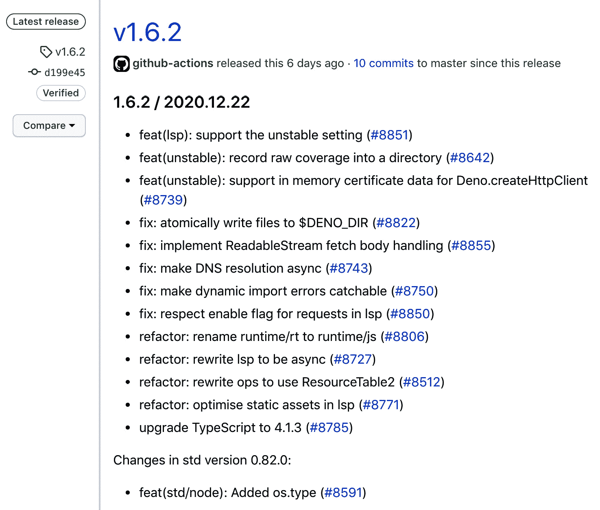

# 第八章：*第十章*：接下来是什么？

我们已经走了很长的路。我们首先了解 Deno 的基本知识，然后构建并部署了一个完整的应用程序。到现在为止，你应该已经熟悉 Deno，并对它解决的问题有一个很好的了解。希望我们经历的所有阶段都有助于澄清你可能有关于 Deno 的许多问题。

我们故意选择让这本书成为一段旅程，从我们的第一个脚本开始，到完成一个部署的应用程序结束，我们在书中边编写边迭代这个应用程序。与此同时，我们解决了许多应用程序开发者可能会遇到的挑战，并提出了解决方案。

到现在为止，你应该已经掌握了可以帮助你决定 Deno 是否将成为你下一个项目解决方案一部分的知识。

本章将首先回顾我们已经学到的内容，包括所有阶段和学习点。然后，正如章节标题所暗示的，我们的重点将转向未来。本章将关注接下来会发生什么，既包括 Deno 作为一个运行时的未来，也包括作为一名开发者，你将掌握一个新工具的情况。

我们将简要查看 Deno 核心团队当前的优先事项，他们正在做什么，以及提议的未来功能是什么。随着章节的进行，我们还将查看社区中正在发生的事情，突出一些有趣的倡议。

本章将通过展示我们如何将包发布到 Deno 的官方注册表，以及其他回馈 Deno 社区的方式，来结束。

到本章结束时，你将熟悉以下领域：

+   回顾我们的旅程

+   丹诺的发展路线图

+   丹诺的未来和社区

+   将包发布到 Deno 的官方注册表

# 回顾我们的旅程

我们已经覆盖了大量的知识点。相信这本书对您来说（希望如此）是一次有趣的旅程，从不知道 Deno 到用它构建东西，最后部署一个应用程序。

我们首先了解这个工具本身，首先了解它提供的功能，然后使用标准库编写简单的程序。随着我们的知识积累，我们很快就有足够的能力用它构建一个真正的应用程序，这就是我们做的。

冒险始于使用标准库构建最简单的 Web 服务器。我们大量使用 TypeScript 来帮助明确指定应用程序的边界，并成功运行了一个非常简单的应用程序，达到了我们第一个检查点：**你好世界**。

我们的应用程序不断进化，随着需求的复杂性增加，我们需要深入研究 Deno 社区中可用的网络框架。在所有这些框架中进行了高层次的比较后，根据我们的应用需求，我们选择了`oak`。下一步是把我们仍然简单的 Web 服务器迁移到我们选择的框架，这轻而易举。使用网络框架让我们的代码更简洁，并允许我们将真的不想自己处理的事情委派出去，这样我们就能专注于应用程序本身。

下一步是向我们的应用程序中添加用户。我们创建了应用程序端点以启用用户注册，随着存储用户的需求出现，我们将应用程序连接到 MongoDB。有了用户之后，实现用户认证就是一小步。

随着应用程序的增长，对更复杂配置的需求也在增长。从它运行的服务器端口到证书文件的存放位置，或者数据库凭据，所有这些都需要独立处理。我们将配置从应用程序中抽象出来，并集中管理。在此过程中，我们增加了对配置存储在文件中或环境变量中的支持。这使得可以根据环境运行具有不同配置的应用程序，同时保持敏感值远离代码库，保持安全。

随着我们的旅程即将结束，我们想要确保我们的代码足够可靠。这引导我们进入了一个测试章节，在那里我们学习了 Deno 的基本测试知识，并为我们所创建的应用程序的几个用例创建了不同的测试。我们从简单的单元测试做到了跨模块测试，再到启动应用程序并对其进行几次请求的测试。在这个过程中，我们对我们的代码能按预期工作有了更多的信心，并将测试能力添加到我们的工具链中。

为了结束，我们把写的代码变成了现实，并部署了它。

我们在 Heroku 的容器化环境中运行了应用程序。与此同时，我们学习了关于 Docker 的知识，以及它是如何让开发者更容易运行和部署代码的。我们用一种自动化的方式部署了 Deno 应用程序，结束了从代码到部署的这一循环。

这是一次经历，我们经历了应用程序开发的许多常见阶段，遇到挑战并使用适合我们用例的解决方案解决它们。我希望我已经涵盖了你们的一些主要关切和问题，给你们提供一个坚实的基础来帮助你们在未来。

我们不知道接下来会发生什么，但我们知道它取决于 Deno 及其社区，我们希望您认为自己也是这个社区的一部分。在下一节中，我们将看看 Deno 的未来路线图，计划的内容以及他们的短期努力方向。

# Deno 的路线图

自从 Ryan 在 JSConf 上首次介绍 Deno 以来，很多事情都发生了变化；已经迈出了几大步。随着运行时的第一个稳定版本的发布，社区爆发了，许多来自其他 JavaScript 社区的人都加入其中，带来了许多热情洋溢的想法。

Deno 的核心团队目前大部分精力都投入到推动 Deno 的发展上。这种贡献不仅体现在代码、问题和帮助人们上，还体现在规划和勾勒下一步行动上。

对于短期路线图，核心团队确保它正在跟踪倡议。以下两个在 GitHub 上提出的问题已用于跟踪 2020 年第四季度和 2021 年第一季度的努力：

+   [`github.com/denoland/deno/issues/7915`](https://github.com/denoland/deno/issues/7915)

+   [`github.com/denoland/deno/issues/8824`](https://github.com/denoland/deno/issues/8824)

如果您仔细查看这些内容，可以跟踪有关这些功能的所有讨论、代码和决策。我在这里列出一些当前的倡议，让您预览一下正在发生的事情：

+   **Deno 语言服务器协议**（**LSP**）和语言服务器

+   编译为二进制文件（Deno 应用程序的单个可执行文件）

+   数据、blob、WebAssembly 和**JavaScript 对象表示法**（**JSON**）导入

+   改进对**Web Crypto 应用程序编程接口**（**APIs**）的支持

+   支持**立即执行的函数表达式**（**IIFE**）捆绑

+   支持 WebGPU

+   HTTP/2 支持

这些只是 Deno 进行的一些重要倡议的例子。正如您所能想象的，由于 Deno 目前处于早期阶段，目前有很多努力致力于修复漏洞和重构代码，我没有将这些添加到这个列表中。

请随意深入查看前面提到的 GitHub 问题，以获取有关任何倡议的更多详细信息。

所有这些都是 Deno 核心团队的贡献。记住，Deno 之所以存在，是因为有人在他们的业余时间致力于它。回馈社区有很多方式，无论是通过提交错误报告、代码贡献、在通讯渠道上帮助，还是通过捐赠。

如果 Deno 能帮助您和您的公司将想法变为现实，请考虑成为赞助商，以保持其健康并持续发展。您可以在 GitHub 上通过以下链接进行赞助：[`github.com/sponsors/denoland`](https://github.com/sponsors/denoland)。

还有其他也为 Deno、围绕它的热情以及它的演变负责的人，这些人就是 Deno 的社区。在下一节中，我们将介绍 Deno 的社区、那里发生的一些有趣的事情，以及您可以如何积极参与其中。

# Deno 的未来和社区

Deno 社区正在快速增长——它充满了对此感到兴奋的人，他们急于帮助它成长。随着你开始使用它，正如在这本书的过程中你所做的那样，你将能够为它做出非常重要的贡献。这可能是一个你遇到的 bug，一个对你有意义的功能，或者你只是想更好地理解的东西。

为了成为其中的一员，我建议你加入 Deno 的 Discord 频道([`discord.gg/deno`](https://discord.gg/deno)).这是一个非常活跃的地方，你可以找到对 Deno 感兴趣的其他人，如果你想要找到包的作者、自己构建包，或者帮助 Deno 核心，这里很有用。根据我的经验，我只能说我在那里遇到的人都非常友好和乐于助人。这也是了解正在发生的事情的好方法。

另一种贡献方式是关注 Deno 在 GitHub 上的仓库([`github.com/denoland`](https://github.com/denoland)).主仓库可以在[`github.com/denoland/deno`](https://github.com/denoland/deno)找到，那里你可以找到 Deno**命令行界面**（**CLI**）和 Deno 核心，而标准库则在其自己的仓库中([`github.com/denoland/deno_std`](https://github.com/denoland/deno_std))。还有其他仓库，如[`github.com/denoland/rusty_v8`](https://github.com/denoland/rusty_v8)，它托管了用于 V8 JavaScript 引擎的 Deno 创建的 Rust 绑定，或者[`github.com/denoland/deno_lint`](https://github.com/denoland/deno_lint)，Deno linter 托管在其中，等等。在 GitHub 上随意关注你感兴趣的仓库。

提示

了解 Deno 上正在发生的事情，而又不会收到太多通知的好方法是，只关注 Deno 的主要仓库的发布更新。每次发布你都会收到通知，你可以跟随非常详尽的发布说明。我留下一个发布说明的例子，让你知道它们长什么样。

这就是一个版本更新通知的样子：



Figure 10.1 – Deno 的 v1.6.2 发布说明

在前面截图显示的 GitHub 发布之外，Deno 团队还努力在他们的网站上编写详尽的发布说明，这是保持更新的另一种好方法([`deno.land/posts`](https://deno.land/posts)).

要成为 Deno 社区的重要一员，你可以做的是使用它、报告 bug 和结识新朋友，其余的将会水到渠成。

社区不仅由核心成员和帮助 Deno 的人组成，还包括用它构建的包和项目。

在接下来的部分，我将突出一些我认为很棒且正在推动社区前进的倡议。这是一个个人清单，把它当作推荐而不是更多，因为我相信还有其他倡议也可以添加进来。

## 社区中发生的一些有趣的事情

在过去的两年里，我一直关注 Deno，发生了很多事情。在 v1.0.0 发布后，随着更多的人加入，涌现了许多想法。我会列出一些我认为特别有趣，不仅因为它们提供功能，而且也是学习的好来源的倡议。

### Denon

作为 Node.js 开发时的首选解决方案，Nodemon 是 Deno 开发者最常用的工具之一。如果你还没听说过它，它基本上会监控你的文件，并在你更改任何内容时重新运行你的 Deno 应用程序。它是那些在开发 Deno 时你很可能会保留在工具链中的工具之一。你可以查看他们的 GitHub 页面：[`github.com/denosaurs/denon`](https://github.com/denosaurs/denon)。

### Aleph.js

虽然在这里我们没有足够的空间去探讨，但 Deno 在浏览器上运行的能力开启了一整套新的功能，这导致了像 Aleph.js 这样的倡议。这个倡议自称是 Deno 中的*React 框架*，并且已经得到了相当多的使用和热情。如果你还没听说过，它从 Next.js 框架([`nextjs.org/`](https://nextjs.org/))中拿了许多方面，实现在 Deno 中，并添加了一些其他的东西。它虽然很新，但已经有了服务器端渲染、热模块重载和文件系统及 API 路由等功能。你可以在这里了解更多：[`alephjs.org/`](https://alephjs.org/)。

### Nest.land

尽管 Deno 有自己的注册表（我们将在下一节中使用），但社区还是创造了其他的注册表。Nest.land 是其中之一；它是一个基于区块链技术的模块注册表，确保托管在那里的模块不会被删除。它是免费的、去中心化的，不需要 Git 就能工作，是许多包作者的首选解决方案。了解更多关于它的信息：[`nest.land/`](https://nest.land/)。

### Pagic

随着静态网站生成器越来越受欢迎，迟早会有一些用 Deno 制作的。Pagic 就是这样一个静态网站生成器，它支持 React、Vue 和 M 等有趣的功能，以及其他特性。它采用约定优于配置的方式，这意味着它非常容易启动你的第一个网站。了解更多关于它的信息：[`pagic.org/`](https://pagic.org/)。

### Webview_deno

由于现在人们使用的许多应用程序都是用 JavaScript 编写的，并且运行在网页视图中，它们迟早会出现在 Deno 上。这个模块包括一个 Deno 插件，因此仍然被认为是稳定的。然而，尽管它有局限性，并且是一个正在进行的项目，它已经提供了许多与 Electron（Node.js 的替代品）一样有趣的功能。

除了前面提到的所有包之外，第四章 *构建一个网页应用* 中提到的所有包都值得一看。它们是快速发展的网页框架，正如我们之前探索的那样，为使用它们的开发者提供了不同的好处。如果你正在用 Deno 开发网页应用，务必关注它们。查看它们的 GitHub 页面[`github.com/webview/webview_deno`](https://github.com/webview/webview_deno)。

你认为 Deno 上仍然缺少什么功能吗？你开发了什么你认为对更多人有益的东西吗？开源的核心依赖于那些有趣的软件片段和背后的人。

你制作了什么想要分享的东西吗？不用担心——我们已经为你准备好了。在下一节，你将学会如何做到这一点！

# 将包发布到 Deno 的官方注册表

开源，从根本上说，是由使用免费软件的个人和公司组成的，他们有回馈的愿望。当你创建了一段你认为有趣的代码时，你很可能会想要分享它。这不仅是帮助其他人的一种方式，也是改进你自己的代码的一种方式。

开源和这种分享的文化是使 Deno、Node.js 和许多其他你可能使用的技术成为现实的原因。既然这本书都是关于 Deno 的，不讨论这个话题就没有意义。

Deno 有一个官方的模块注册表，我们之前使用过。这是一个任何有 GitHub 账户的人都可以与社区分享自己模块的地方，它还提供了自动化和缓存机制，以保持模块的不同版本。

我们接下来要做的就是将我们自己的模块发布到这个相同的注册表中。

我们将使用一种软件，到目前为止，我们通过直接链接到 GitHub 提供它。这可行，但它既没有清晰的版本控制，也没有任何类型的缓存，如果代码从 GitHub 上删除，它就无法使用。

记得我们曾经使用过一个叫`jwt-auth`的包里的`AuthRepository`吗？当时，出于实际原因，我们使用了一个直接的 GitHub 链接，但从现在开始，我们将把它发布到 Deno 的模块注册表中。

我们将使用托管在 GitHub 上的完全相同的代码，但以`deno_web_development_jwt_auth`的名字发布。我们选择这个名字是为了让它非常清楚地表明它是这本书旅程的一部分。我们也不希望为用于学习的包 grab 注册表中的有意义的名称。

让我们开始吧！按照以下步骤进行：

1.  为要发布的模块创建一个仓库。如前所述，我们将使用来自第六章的*添加认证和连接数据库*部分的`jwt-auth`模块([`github.com/PacktPublishing/Deno-Web-Development/tree/master/Chapter06/jwt-auth`](https://github.com/PacktPublishing/Deno-Web-Development/tree/master/Chapter06/jwt-auth))，但请随意使用您选择的任何其他模块。

1.  按照 GitHub 的说明克隆最近创建的`git`仓库。确保将您的模块文件复制到此仓库文件夹中，并运行以下命令（这些与 GitHub 的说明中呈现的命令相同）：

    ```js
    $ echo "# <Name of your package>" >> README.md
    $ git init
    $ git add .
    $ git commit -m "first commit"
    $ git branch -M main
    $ git remote add origin git@github.com:<your-username>/ <your_package_name>.git
    $ git push -u origin main
    ```

1.  前往[`deno.land/x`](https://deno.land/x)并点击**添加模块**按钮（您可能需要滚动一点才能找到它），如下所示：

    图 10.2 – Deno 模块注册表中的**添加模块**按钮

1.  在出现的框中输入模块名称，并点击`deno_web_development_jwt_auth`作为包名称，但出于显而易见的原因，你不能这样做。

    请记住，如果您是为了测试目的而发布模块，您应该使用一个测试名称。我们不希望使用用于测试目的的“真实”模块名称。

1.  在出现的下一个框中，选择代码存放的目录。

    对于我们即将包含来自第六章的*添加认证和连接数据库*部分的`jwt-auth`代码的模块，我们将留空，因为它位于步骤 1 中创建的新仓库的根目录下。

1.  现在，只需按照说明添加 webhook。

    Deno 模块注册表使用 GitHub webhook 来获取包的更新。这些 webhook 应由新分支或标签触发，Deno 的模块注册表然后将这些 GitHub 标签创建为一个版本。

    接下来的说明将出现在 Deno 的页面上，但我在这里列出它们是因为实际原因：

    导航到您想要添加到 GitHub 的仓库。

    前往`https://api.deno.land/webhook/gh/<package_name>`（包名称应与步骤 4 中选择的名称相同）。

    选择`application/json`作为内容类型。

    选择**让我选择个别事件**。

    只选择**分支或标签创建**事件。

    点击**添加 webhook**。

1.  现在，只需创建一个发布，正如我们提到的，这是通过`git`标签完成的。假设您已经在步骤 2 中提交了您的包代码，我们只需要创建并推送此标签，如下所示：

    ```js
    $ git tag v0.0.1
    $ git push origin --tags 
    Enumerating objects: 5, done.
    Counting objects: 100% (5/5), done.
    Delta compression using up to 8 threads
    Compressing objects: 100% (3/3), done.
    Writing objects: 100% (3/3), 748 bytes | 748.00 KiB/s, done.
    Total 3 (delta 1), reused 0 (delta 0)
    remote: Resolving deltas: 100% (1/1), completed with 1 local object.
    To github.com:asantos00/deno_web_development_jwt_auth.git
     * [new tag]         v0.0.1 -> v0.0.1
    ```

1.  现在，如果我们导航到[`deno.land/x`](https://deno.land/x)并搜索您的包名称（在我们的示例中为`deno_web_development_jwt_auth`），它应该出现在那里，正如您在以下屏幕截图中所看到的：


图 10.3 – Deno 模块注册表上的一个已发布包

就是这样——这就是你们开始与社区分享惊人 Deno 代码所需的一切！从现在开始，你们不仅可以使用 Deno 构建应用，还可以创建包，回馈社区。

这一节以及整本书的内容就到这里，感谢大家坚持到最后。我们希望对你们有所帮助，帮助你们学习 Deno，也希望你们对它充满热情，就像我们一样。

如果你们认为我在某些方面能提供帮助，我非常乐意联系你们。可以通过书中前言提供的联系方式，通过 GitHub 或 Twitter 与我取得联系。

# 摘要

首先，感谢所有坚持读到这本书最后的人！希望它对你们来说是一次有趣的旅程，满足你们的期望，并回答了你们关于 Deno 的许多问题和担忧。

这只是（希望是巨大的）旅程的开始。Deno 在成长，而你们现在成为了其中的一部分。你们越使用它并回馈社区，它就会变得越好。如果，像我一样，你们认为它为编写 JavaScript 应用提供了很多好处，可以让它成为一个游戏改变者，那就不要等待，立即分享你们的热情。

像我们这样很多人都在推动 Deno 的发展，帮助社区，开发模块，提交拉取请求。归根结底，在你项目中恰当使用 Deno，是你能给出的最佳推荐。

贯穿全书，我不仅试图突出 Deno 的优势，还试图清楚地表明，它绝非（而且永远不会是）一劳永逸的解决方案。它有一系列的优势，尤其是在与 Node.js 相同的用例中（你们可以在第一章 *Deno 是什么？* 中查看）。正如我们在这章所讨论的，有很多功能正在加入，使 Deno 能应用于越来越多的用例，但我相信还有很多我们尚不知道的功能将加入。

从这里开始，一切就靠你了。希望这本书让你充满激情，迫不及待想写 Deno 应用。

下一步最好的做法就是亲自编写应用。这将使你进行研究，与人交流，解决问题。我尽量让你们的前行之路尽可能平坦，通过回答一些最常见的问题。

我相信网上有很多资源、文章和书籍，但要想真正提高 Deno 技能，最好的途径仍然是 Discord 频道和 GitHub 仓库。这些地方可以让你第一时间获取最新消息！

我迫不及待想看到你们接下来会构建什么。
