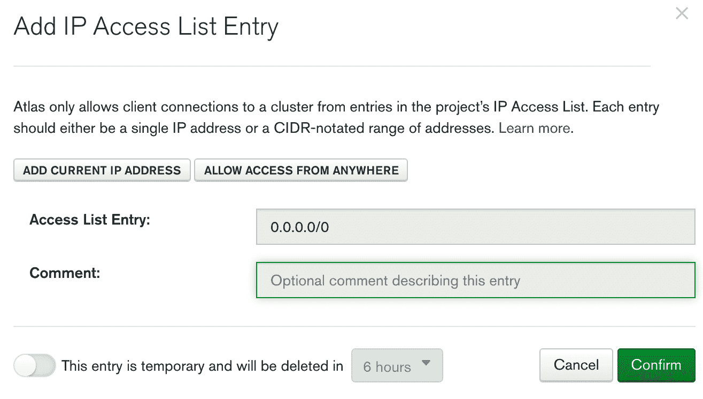

# 第九章：部署 Deno 应用程序

部署是任何应用程序的关键部分。我们可能构建了一个伟大的应用程序，遵循最佳实践，并编写测试，但最终，当它到达用户手中时，它将在这里证明其价值。由于我们希望这本书能带领读者经历应用程序的所有不同阶段，因此我们将使用关于应用程序部署的这一章节来结束整个周期。

请注意，我们没有—也不会—将部署视为软件开发的最后阶段，而是视为将多次运行的周期中的一个阶段。我们坚信部署不应该是一个让大家害怕的事件。相反，我们认为它们是我们向用户发送功能的高兴时刻。这是大多数公司在现代软件项目中看待部署的方式，我们确实是这种观点的忠实倡导者。部署应该是定期、自动化且容易执行的事情。它们是我们将功能带给用户的第一步，而不是最后一步。

为了使流程具有这种灵活性并在应用程序中实现快速迭代，本章将重点学习有关容器以及如何使用它们部署 Deno 应用程序的知识。

我们将利用容器化的好处，创建一个隔离的环境来安装、运行和分发我们的应用程序。

随着章节的进行，我们将学习如何使用 Docker 和`git`创建一个自动化工作流程，以在云环境中部署我们的 Deno 应用程序。然后，我们将调整应用程序加载配置的方式，以支持根据环境不同而有不同的配置。

到本章结束时，我们的应用程序将在云环境中运行，并有一个自动化过程，使我们能够发送它的迭代版本。

在本章中，您将熟悉以下主题：

+   为应用程序准备环境

+   为 Deno 应用程序创建一个`Dockerfile`

+   在 Heroku 中构建和运行应用程序

+   配置应用程序以进行部署

# 技术要求

本章中使用的代码可以在以下 GitHub 链接中找到：

`https://github.com/PacktPublishing/Deno-Web-Development/tree/master/Chapter09`

# 为应用程序准备环境

应用程序运行的环境总是对其产生很大影响。这是导致常见说法“*在我的机器上工作*”的其中一个重要原因。多年来，开发者一直在创造尽可能减少这种影响的解决方案。这些解决方案可以从为应用程序自动提供新的干净实例，到创建更完整的包，其中包含应用程序依赖的一切。

我们可以将**虚拟机**（**VMs**）或容器视为实现这一目标的途径。两者都是为同一问题提供的不同解决方案，但有一个很大的共同点：资源隔离。两者都试图将应用程序与周围的环境隔离。这有许多原因，从安全、自动化到可靠性。

容器是提供应用程序包的一种现代方式。现代软件项目使用它们来提供一个包含应用程序运行所需的大多数内容的单一容器镜像。

如果你不清楚容器是什么，我给你提供一下来自 Docker（一个容器引擎）官方网站的定义：

容器是“一种标准的软件单元，它将代码及其所有依赖打包在一起，使得应用程序能够从一个计算环境快速、可靠地运行到另一个计算环境。”

在我们使应用程序容易部署的路径中，我们将使用 Docker 为我们的 Deno 应用程序创建这一层隔离。

最终目标是创建一个开发者可以用来部署和测试应用程序特定版本的镜像。要使用 Docker 完成这个目标，我们需要配置应用程序将运行的运行时。这个配置定义在一个叫做`Dockerfile`的文件中。

这是我们接下来要学习的内容。

# 为 Deno 应用程序创建 Dockerfile

`Dockerfile`将允许我们指定创建新 Docker 镜像所需的内容。这个镜像将提供包含应用程序所有依赖的环境，既可用于开发目的，也可用于生产部署。

在本节中，我们将学习如何为 Deno 应用程序创建 Docker 镜像。Docker 提供了一个基本上只包含容器运行时和隔离的基镜像，叫做`alpine`。我们可以使用这个镜像，配置它，安装所有需要的工具和依赖（即 Deno），等等。然而，我认为我们在这里不应该重新发明轮子，因此我们使用一个社区 Docker 镜像。

尽管这个镜像解决了许多我们的问题，我们仍然需要调整它以适应我们的用例。Dockerfile 可以组合，这意味着它们可以扩展其他 Docker 镜像的功能，我们将使用这个特性。

重要提示

如你所想象的，我们不会深入讲解 Docker 的基础知识，因为那将是一本书的内容。如果你对 Docker 感兴趣，你可以从官方文档的*入门指南*开始([`docs.docker.com/get-started/`](https://docs.docker.com/get-started/))。然而，如果你目前对 Docker 不是非常熟悉，也不用担心，我们会解释足够让你理解我们在这里做什么的内容。

在开始之前，请确保通过以下链接中列出的步骤在您的机器上安装了 Docker Desktop：[`docs.docker.com/get-docker/`](https://docs.docker.com/get-docker/)。安装并启动它之后，我们就有了创建我们第一个 Docker 镜像所需的一切。让我们通过以下步骤来创建它：

1.  在我们项目的根目录下创建一个`Dockerfile`。

1.  正如提到的，我们将使用一个社区中已经安装了 Deno 的镜像——`hayd/deno` ([`hub.docker.com/r/hayd/deno`](https://hub.docker.com/r/hayd/deno))。

    此图像的版本管理方式与 Deno 相同，因此我们将使用版本`1.7.5`。Docker 的`FROM`命令允许我们扩展一个镜像，指定其名称和版本标签，如下面的代码片段所示：

    ```js
    FROM hayd/alpine-deno:1.7.5
    ```

1.  我们需要做的下一件事是在容器内部定义我们将工作的文件夹。

    Docker 容器提供了一个 Linux 文件系统，默认的`workdir`是它的根（`/`）。Docker 的`WORKDIR`命令将允许我们在这个文件系统内的同一个文件夹中工作，使事情变得更有条理。该命令可在此处查看：

    ```js
    WORKDIR /app
    ```

1.  现在，我们需要将一些文件复制到我们的容器镜像中。在`COPY`命令的帮助下，我们将只复制安装步骤所需的文件。在我们的案例中，这些是`src/deps.ts`和`lock.json`文件，如下所示：

    ```js
    COPY command from Docker allows us to specify a file to copy from the local filesystem (the first parameter) into the container image (the last parameter), which is currently the app folder. By dividing our workflows and copying only the files we need, we allow Docker to cache and rerun part of the steps only when the involved files changed. 
    ```

1.  在容器内部拥有文件后，我们现在需要安装应用程序的依赖项。我们将使用`deno cache`来完成此操作，如下所示：

    ```js
    deno-mongo) and also using the lock file, we have to pass additional flags. Docker's `RUN` command enables us to run this specific command inside the container.
    ```

1.  依赖项安装完成后，我们现在需要将应用程序的代码复制到容器中。再一次，我们将使用 Docker 的`COPY`命令来完成此操作，如下所示：

    ```js
    workdir (/app folder) inside the container.
    ```

1.  我们需要为我们的镜像做最后一件事情，以便它能够即插即用，那就是引入一个在任何人都“执行”这个镜像时都会运行的命令。我们将使用 Docker 的`CMD`命令来完成此操作，如下所示：

    ```js
    CMD ["deno", "run", "--allow-net", "--unstable", "--allow-env", "--allow-read", "--allow-write", "--allow-plugin", "src/index.ts" ]
    ```

    这个命令接受一个命令和参数数组，当有人尝试运行我们的镜像时将被执行。

这就是我们定义我们 Deno 应用程序的 Docker 镜像所需要的一切！拥有这些功能将使我们可以像在生产环境中一样在本地上运行我们的代码，这对于调试和调查生产问题来说是一个很大的优势。

我们唯一缺少的是生成工件的实际步骤。

我们将使用 Docker `-t`标志的`build`命令来设置标签。按照以下步骤生成工件：

1.  在项目文件夹内，运行以下命令为镜像生成标签：

    ```js
    museums-api in this example) and choose whichever version you want (0.0.1 in the example).This should produce the following output:

    ```

    museums-api:0.0.1。我们现在可以在私有镜像仓库中发布它，或者使用公共的，比如 Docker Hub。我们稍后设置的持续集成（CI）管道将配置为自动执行这个构建步骤。我们现在可以做的就是在本地下载这个镜像，以验证一切是否按预期工作。

    ```js

    ```

1.  为了在本地运行镜像，我们将使用 Docker CLI 的`run`命令。

    由于我们正在处理一个网络应用程序，我们需要暴露它正在运行的端口（在应用程序的`configuration`文件中设置）。我们将通过使用`-p`标志告诉 Docker 将容器端口绑定到我们机器的端口，如下代码段所示：

    ```js
    0.0.1 of the museums-api image, binding the 8080 container port to the 8080 host port. We can now go to http://localhost:8080 and see that the application is running.
    ```

稍后，我们将使用这个镜像定义在 CI 系统中，每当代码更改时，它都会创建一个镜像并将其推送到生产环境。

拥有一个包含应用程序的 Docker 镜像可以服务于多个目的。其中之一就是本章的目标：部署它；然而，这个同样的 Docker 镜像也可以用来在特定版本上运行和调试一个应用程序。

让我们学习如何在特定版本的某个应用程序中运行一个终端，这是一个非常常见的调试步骤。

## 在容器内运行终端

我们可以使用 Docker 镜像在容器内执行一个终端。这可能在调试或尝试特定应用程序版本的某事物时很有用。

我们可以通过使用之前相同的命令和几个不同的标志来实现这一点。

我们将使用`-it`标志，这将允许我们有一个与镜像内的终端的交互式连接。我们还将发送一个参数，即我们希望在镜像内首先执行的命令的名称。在这个例子中是`sh`，标准的 Unix 外壳，正如你在以下示例中可以看到的：

```js
$ docker run -p 8080:8080 -it  museums-api:0.0.1 sh
```

这将运行`museums-api:0.0.1`镜像，将其`8080`端口绑定到宿主机的`8080`端口，并在带有交互式终端的其中执行`sh`命令，如下代码段所示：

```js
$ docker run -p 8080:8080 -it  museums-api:0.0.1 sh        
/app # ls
Dockerfile           certificate.pem      config.staging.yaml  index.html           lock.json
README.md            config.dev.yaml      heroku.yml        key.pem              src
```

请注意，初始打开的目录是我们定义为`WORKDIR`的目录，我们的所有文件都在那里。在前面的例子中，我们还执行了`ls`命令。

由于我们在这个容器上附加了一个交互式外壳，我们可以用它来运行 Deno 命令，例如，如下代码段所示：

```js
/app # deno --version
deno 1.7.2 (release, x86_64-unknown-linux-gnu)
v8 8.9.255.3
typescript 4.1.3 
/app #
```

这将使我们在开发和调试方面具备一整套可能性，因为我们将有能力查看应用程序在特定版本上的运行情况。

我们已经完成了这一节的讨论。在这里，我们探讨了容器化，介绍了 Docker 以及它是如何让我们创建一个“应用程序包”的。这个包将负责应用程序周围的环境，确保它无论在何处只要有 Docker 运行时就可以运行。

在下一节中，我们将使用这个相同的包，在云环境中部署我们本地构建的镜像。让我们开始吧！

# 在 Heroku 中构建和运行应用程序

正如我们在章节开始时提到的，我们的初步目标是有一种简单、自动化且可复制的部署应用程序的方法。在上一节中，我们创建了将作为该基础的容器镜像。下一步是创建一个管道，以便在有更新时构建和部署我们的代码。我们将使用`git`作为我们的真相来源和触发管道构建的机制。

我们将代码部署的平台是 Heroku。这是一个旨在通过提供一套工具简化开发人员和公司部署过程的平台，这些工具消除了诸如配置机器和设置大型 CI 基础架构等常见障碍。使用这样的平台，我们可以更专注于应用程序以及 Deno，这是本书的目的。

在这里，我们将使用我们之前创建的`Dockerfile`，并设置它在 Heroku 上部署并运行。我们将了解如何轻松地在那里设置应用程序，稍后我们还将探索如何通过环境变量定义配置值。

在开始之前，请确保您已经创建了账户并安装了 Heroku CLI，然后按照这里提供的两个链接进行步骤指南：

+   创建账户：[`signup.heroku.com/dc`](https://signup.heroku.com/dc)。

+   安装 CLI：[`devcenter.heroku.com/articles/heroku-cli`](https://devcenter.heroku.com/articles/heroku-cli)。

现在我们已经创建了账户并安装了 CLI，我们可以开始在 Heroku 上设置我们的项目。

## 在 Heroku 上创建应用程序

在这里，我们将了解在 Heroku 上进行身份验证并创建应用程序所需的步骤。我们几乎准备好了，但还有一件事我们必须先弄清楚。

重要提示

由于 Heroku 使用`git`作为真相来源，您将*无法*在书籍的文件仓库内执行以下过程，因为它已经是一个包含应用程序多个阶段的 Git 仓库。

我建议您将应用程序文件复制到另一个不同的文件夹中，*位于书籍仓库外部*，并从那里开始这个过程。

您可以从*第八章*，*测试 – 单元和集成*([`github.com/PacktPublishing/Deno-Web-Development/tree/master/Chapter08/sections/7-final-tested-version/museums-api`](https://github.com/PacktPublishing/Deno-Web-Development/tree/master/Chapter08/sections/7-final-tested-version/museums-api))复制最新版本的运行中应用程序，这是我们将在这里使用的版本。

现在文件已经被复制到了一个新的文件夹（主仓库外部），接下来通过以下步骤在 Heroku 上部署`Dockerfile`并运行它：

1.  我们首先要做的就是使用 CLI 登录，运行`heroku login`。这应该会打开一个浏览器窗口，您可以在其中输入您的用户名和密码，如下面的代码片段所示：

    ```js
    $ heroku login
    heroku: Press any key to open up the browser to login or q to exit:
    Opening browser to https://cli-auth.heroku.com/auth/cli/...
    Logging in... done
    Logged in as your-login-email@gmail.com
    ```

1.  由于 Heroku 部署是基于`git`的，而我们现在在一个不是 Git 仓库的文件夹中，我们需要初始化它，如下所示：

    ```js
    $ git init
    Initialized empty Git repository in /Users/alexandre/dev/ museums-api/.git/
    ```

1.  然后，我们通过使用`heroku create`来创建 Heroku 上的应用程序，如下所示：

    ```js
    heroku, which is where we have to push our code to trigger the deployment process.
    ```

如果您在运行前面的命令后访问 Heroku 仪表板，您会发现那里有一个新的应用程序。当应用程序创建时，Heroku 在控制台打印一个 URL；然而，由于我们还没有配置任何内容，我们的应用程序目前还不可用。

我们接下来需要做的是配置 Heroku，以便它在每次部署时知道它应该构建和执行我们的镜像。

## 构建和运行 Docker 镜像

默认情况下，Heroku 试图通过运行代码使您的应用程序可用。这对于许多语言来说都是可能的，您可以在 Heroku 文档中找到相关指南。由于我们想要使用容器来运行我们的应用程序，因此该过程需要一些额外的配置。

Heroku 提供了一组功能，允许我们定义当代码发生更改时会发生什么，通过一个名为`heroku.yml`的文件。我们现在将创建该文件，如下所示：

1.  在仓库根目录下创建一个`heroku.yml`文件，并添加以下代码行，以便使用我们在上一节中创建的`Dockerfile`使用 Docker 构建我们的镜像：

    ```js
    build:
      docker:
        web: Dockerfile
    ```

1.  现在，在同一个文件中，添加以下代码行以定义 Heroku 将执行以运行应用程序的命令：

    ```js
    build:
      docker:
        web: Dockerfile
    Dockerfile, and that's true. Normally, Heroku would run the command from the `Dockerfile` to execute the image, and it would work. It happens that Heroku doesn't run these commands as root, as a security best practice. Deno, at its current stage, needs root privileges whenever you want to use plugins (an unstable feature). As our application is using a plugin to connect with MongoDB, we need this command to be explicitly defined on `heroku.yml` so that it is run with root privileges and works when Deno is starting up the application.  
    ```

1.  接下来我们需要做的就是将应用程序类型设置为`container`，告知 Heroku 我们希望应用程序以这种方式运行。以下代码片段显示了此操作的代码：

    ```js
    heroku.yml file included) to version control and push it to Heroku so that it starts the build.
    ```

1.  添加所有文件以确保`git`正在跟踪它们：

    ```js
    $ git add .
    ```

1.  提交所有文件，并附上如下信息：

    ```js
    -m flag that we've used is a command that allows us to create a commit with a message with a short syntax.
    ```

1.  现在，关键是要把文件推送到`heroku`远程。

    这应该触发 Docker 镜像的构建过程，您可以在日志中进行检查。然后，在最后阶段，这个镜像被推送到 Heroku 的内部镜像注册表中，如下代码片段所示：

    ```js
    Dockerfile, following all the steps specified there, as happened when we built the image locally, as illustrated in the following code snippet: 

    ```

    remote: === 正在推送 web (Dockerfile)

    remote: 标记镜像 "5c154f3fcb23f3c3c360e16e929c22b62847fcf8" 为 "registry.heroku.com/boiling-dusk-18477/web"

    remote: 使用默认标签: latest

    remote: 推送指的是仓库 [registry.heroku.com/boiling-dusk-18477/web]

    remote: 6f8894494a30: 正在准备

    remote: f9b9c806573a: 正在准备

    ```js

    And it should be working, right? Well…, not really. We still have a couple of things that we need to configure, but we're almost there.
    ```

请记住，我们的应用程序依赖于配置，而配置的一部分来自环境。Heroku 不可能不知道我们需要哪些配置值。还有一些设置我们需要配置以使我们的应用程序运行，接下来我们就做这件事。

# 为部署配置应用程序

现在我们有一个应用程序，当代码推送到`git`时，它会启动构建镜像并部署它。我们目前的应用程序已经部署了，但实际上并没有运行，这是因为缺少配置。

您可能首先注意到的是，我们的应用程序总是从开发环境加载配置文件，`config.dev.yml`，它不应该这样做。

当我们第一次实现这个功能时，我们以为不同的环境会有不同的配置，我们是对的。当时，我们不需要为多个环境设置配置，所以我们使用了`dev`作为默认值。让我们解决这个问题。

记得我们创建加载配置文件的函数时，明确使用了环境参数吗？当时我们没有使用它，但我们留下了一个默认值。

请查看`src/config/index.ts`中的以下代码片段：

```js
export async function load(
  env = "dev",
): Promise<Configuration> {
```

我们需要做的是将此更改为支持多个环境。所以，让我们按照以下步骤来做到这一点：

1.  回到`src/index.ts`，确保我们将名为`DENO_ENV`的环境变量发送到`load`函数，如下所示：

    ```js
    const config = await
      loadConfiguration(DENO_ENV is not defined, and allow us to load a different configuration file in production.
    ```

1.  创建生产配置文件，`config.production.yml`。

    目前，它应该与`config.dev.yml`没有太大区别，除了`port`。让我们在生产环境中以端口`9001`运行它，如下所示：

    ```js
    web:
      port: 9001
    ```

    为了在本地测试这一点，我们可以使用`DENO_ENV`变量设置为`production`来运行应用程序，像这样：

    ```js
    DENO_ENV). We mentioned how you can do this in *Chapter 7**, HTTPS, Extracting Configuration, and Deno in the Browser*, in the *Accessing secret values* section.And after running it we can confirm it's loading the correct file, because the application port is now `9001`.
    ```

有了我们刚刚实现的内容，我们现在可以根据环境控制加载哪些配置值。这是我们已经在本地测试过的，但在 Heroku 上还没有做过。

我们已经解决了部分问题——我们根据环境加载不同的配置文件，但我们的应用程序依赖的其他配置值来自环境。这些是诸如**JSON Web Token**（**JWT**）密钥或 MongoDB 凭据等秘密值。

有许多方法可以做到这一点，所有云服务提供商都提供了相应的解决方案。在 Heroku 上，我们可以通过使用`config`命令来实现，如下所示：

1.  使用`heroku config:set`命令定义 MongoDB 凭据变量、JWT 密钥和环境，如下所示：

    ```js
    DENO_ENV variable so that our application knows that, when running in Heroku, it is the production environment.If you are not using your own MongoDB cluster and you have questions about its credentials, you can go back to *Chapter 6*, *Adding Authentication and Connecting to the Database*, where we created a MongoDB cluster in MongoDB Atlas.If you're using a different cluster, remember that it is defined in the configuration file in `config.production.yml` and not in the environment, and thus you need to add your cluster URL and database in the configuration file as follows:

    ```

    …

    MongoDB:

    集群 URL: <添加您的集群 URL>

    数据库: <添加您的数据库名称>

    ```js

    ```

1.  再次，我们将我们的更改添加到`git`中，如下所示：

    ```js
    $ git commit -am "Configure environment variables and DENO_ENV"
    ```

1.  然后，我们将更改推送到 Heroku 以触发部署过程，如下所示：

    ```js
    $ git push heroku master
    …
    remote: Verifying deploy... done.
    To https://git.heroku.com/boiling-dusk-18477.git
       9340446..36a061e  master -> master
    ```

    然后它应该能正常工作。如果我们现在前往 Heroku 控制台([`dashboard.heroku.com/`](https://dashboard.heroku.com/)），然后进入我们应用程序的控制台([`dashboard.heroku.com/apps/boiling-dusk-18477`](https://dashboard.heroku.com/apps/boiling-dusk-18477)，在我的案例中)并点击**打开应用程序**按钮，它应该能打开我们的应用程序，对吧？

    还不是，但我们快了——我们还需要解决一件事情。

## 从环境中获取应用程序端口

Heroku 在运行 Docker 镜像时有一些特别之处。它不允许我们设置应用程序运行的端口。它所做的是分配一个应用程序应该运行的端口，然后将来自应用程序 URL 的**超文本传输协议**（**HTTP**）和**安全的超文本传输协议**（**HTTPS**）流量重定向到那里。如果这听起来仍然很奇怪，不用担心——我们会搞定的。

正如你所知，我们明确地在`config.production.yml`文件中定义了应用程序将要运行的端口。我们需要适应这个。

Heroku 定义应用程序应该运行在哪个端口的方式是通过设置`PORT`环境变量。这在以下链接中有文档记录：

[Heroku 容器注册表和运行时](https://devcenter.heroku.com/articles/container-registry-and-runtime#dockerfile-commands-and-runtime)

你可能从标题中知道我们接下来要做什么。我们要更改我们的应用程序，以便来自环境的 Web 服务器端口覆盖配置文件中定义的那个。

回到应用程序中的`src/config/index.ts`，确保它正在从环境中读取`PORT`变量，覆盖来自文件的配置。代码可以在以下片段中看到：

```js
type Configuration = {
  web: {
    port: number;
  };
  cors: { 
…
export async function load(
  env = "dev",
): Promise<Configuration> {
  const configuration = parse(
    await Deno.readTextFile(`./config.${env}.yaml`),
  ) as Configuration;
  return {
    ...configuration,
    web: {
      ...configuration.web,
      port: Number(Deno.env.get("PORT")) ||
        configuration.web.port,
    },
…
```

这样，我们确保我们从`PORT`环境变量中读取变量，使用配置文件中的值作为默认值。

这样应该就足够让我们的应用程序在 Heroku 中顺利运行了！

再次，我们可以通过访问 Heroku 仪表板（[`dashboard.heroku.com/apps/boiling-dusk-18477`](https://dashboard.heroku.com/apps/boiling-dusk-18477)）并点击**打开应用**按钮来测试这一点，或者你可以直接访问 URL——在我的情况下，它是[`boiling-dusk-18477.herokuapp.com/`](https://boiling-dusk-18477.herokuapp.com/)。

重要提示

如果你正在使用 MongoDB Atlas，正如我们在第六章中*添加身份验证并连接到数据库*所做的那样，并且想要允许你的应用程序访问数据库，你必须配置它使其能够从"任何地方"进行连接。这不是一个推荐的做法，如果你将应用程序暴露给你的用户，而且这只发生因为我们正在使用 Heroku 的免费层。由于它在共享集群中运行，我们没有办法知道运行应用程序的机器的固定的**互联网协议**（**IP**）地址是什么，我们只能这样做。

以下链接展示了如何配置数据库的网络访问： [`docs.atlas.mongodb.com/security/ip-access-list`](https://docs.atlas.mongodb.com/security/ip-access-list)。确保你在 MongoDB Atlas 网络访问屏幕上点击**允许从任何地方访问**。

网络访问屏幕就是这样子的：



图 9.1 – MongoDB Atlas 网络访问屏幕

在此之后，我们的应用程序应该按预期工作；您可以尝试执行一个注册用户的请求（该请求连接到数据库）并检查一切是否正常，如下面的代码片段所示：

```js
$ curl -X POST -d '{"username": "test-username-001", "password": "testpw1" }' -H 'Content-Type: application/json' https://boiling-dusk-18477.herokuapp.com/api/users/register
{"user":{"username":"test-username-001","createdAt":"2020-12-19T16:49:51.809Z"}}%
```

如果您得到的响应与前面的类似，那就大功告成了！我们成功地在云环境中配置并部署了我们的应用程序，并创建了一种自动化的方式将更新推送给我们的用户。

为了进行最后的测试，以确认代码是否成功部署，我们可以尝试更改代码的一部分并再次触发部署过程。让我们这样做！按照以下步骤进行：

1.  将`src/web/index.ts`中的`"Hello World"`消息更改为`"Hello Deno World!"`，如下面的代码片段所示：

    ```js
    app.use((ctx) => {
      ctx.response.body = "Hello Deno World!";
    });
    ```

1.  按照以下步骤将此更改添加到版本控制中：

    ```js
    $ git commit -am "Change Hello World message"
    [master 35f7db7] Change Hello World message
     1 file changed, 1 insertion(+), 1 deletion(-)
    ```

1.  将其推送到 Heroku 的`git`远程仓库，如下所示：

    ```js
    $ git push heroku master
    Enumerating objects: 9, done.
    Counting objects: 100% (9/9), done.
    Delta compression using up to 8 threads
    Compressing objects: 100% (5/5), done.
    Writing objects: 100% (5/5), 807 bytes | 807.00 KiB/s, done.
    Total 5 (delta 4), reused 0 (delta 0)
    remote: Compressing source files… Done
    …
    remote: Verifying deploy... done.
    To https://git.heroku.com/boiling-dusk-18477.git
    ```

1.  如果我们现在访问应用程序的 URL（在我们的情况下是[`boiling-dusk-18477.herokuapp.com/`](https://boiling-dusk-18477.herokuapp.com/)），您应该会看到`Hello Deno World`消息。

这意味着我们的应用程序已成功部署。由于我们使用的是提供比这里学到的更多功能的云平台，我们可以探索 Heroku 的其他功能，例如日志记录。

在 Heroku 控制面板上的**打开应用**按钮旁边，有一个**更多**按钮。其中一个选项是**查看日志**，正如您在下面的屏幕截图中所看到的：


](img/Figure_9.2_B16380.jpg)

图 9.2 – Heroku 控制面板中的应用更多选项

如果您点击那里，将出现一个实时显示日志的界面。您可以尝试通过点击**打开应用**按钮在另一个标签页中打开您的应用程序来尝试它。

您会看到日志立即更新，那里应该会出现类似这样的内容：

```js
2020-12-19T17:04:23.639359+00:00 app[web.1]: GET http://boiling-dusk-18477.herokuapp.com/ - 1ms
```

这对于您想要对应用程序的运行情况进行非常轻量级的监控非常有用。日志记录功能在免费层中提供，但还有许多其他功能供您探索，例如我们在这里不会进行的**指标**功能。

如果您想详细了解您的应用程序何时以及由谁部署，您还可以使用 Heroku 控制面板的**活动**部分，如下面的屏幕截图所示：


图 9.3 – Heroku 控制面板应用程序选项

然后，您将看到您最近部署日志的记录，这是 Heroku 的另一个非常有趣的功能，如下面的屏幕截图所示：


](img/Figure_9.4_B16380.jpg)

图 9.4 – Heroku 控制面板应用程序的活动标签

这结束了我们在云环境中部署应用程序的部分。

我们关注的是应用程序以及可以在您的代码运行的平台独立重复使用的主题。我们迭代了加载配置的应用程序逻辑，使其能够根据环境加载不同的配置。

然后，我们学习了如何将包含机密配置值的环境变量发送到我们的应用程序，最后我们探索了在 Heroku 这个示例选择的平台上进行日志记录——就此结束。

我们成功让我们的应用程序运行起来，并且围绕它建立了一个完整的架构，这将使未来的迭代能够轻松地部署给我们的用户。希望我们经历了一些你们下次决定部署 Deno 应用程序时也会遇到阶段。

# 摘要

差不多完成了！本章通过部署完成了我们应用程序开发阶段的循环。我们从构建一个非常简单的应用程序开始，到向其中添加功能，到添加测试，最后——部署它。

在这里，我们学习了如何在我们的应用程序中使用一些容器化的好处。我们开始了解 Docker，我们选择的容器运行时，并迅速地创建了我们应用程序的镜像。在学习的过程中了解一些 Docker 命令，我们也体验了准备 Deno 应用程序部署是多么的容易。

创建这个 Docker 镜像使我们能够有一种可复现的方式来安装、运行和分发我们的应用程序，创建一个包含应用程序所需一切的包。

当章节进行时，我们开始探索如何使用这个应用程序包将其部署在云环境中。我们首先配置了本指南的分步指南选择的云平台 Heroku，使其每次发生变化时都会重新构建并运行我们应用程序的代码，在`git`和 Heroku 文档的帮助下，我们非常容易地实现了它。

当配置自动化流水线时，我们理解了需要将配置值发送到我们的应用程序。我们之前在早期章节中实现的一些相同的配置值，需要以两种不同的方式发送到应用程序，通过配置文件和通过环境变量。我们逐一解决了这些需求，首先通过迭代应用程序代码使其根据环境加载不同的配置，后来学习如何在 Heroku 上设置配置值。

最终，我们让我们的应用程序无缝运行，并完成了本章的目标：拥有一个可复现、自动化的方式将代码部署给我们的用户。与此同时，我们了解了一些关于 Docker 以及当涉及到发布代码时容器化和自动化的好处。

这本书的内容基本上已经讲到这里了。我们决定让这个过程成为一个建立应用程序的旅程，分别经历它的所有阶段并在需要时解决它们。这是最后一个阶段——部署，希望这能为您从编写第一行代码到部署的整个周期画上句号。

下一章将重点关注 Deno 接下来的发展，包括运行时和您个人方面。我希望这能让您成为 Deno 的爱好者，并且您对它以及它所开启的无限可能世界像我一样充满热情。
