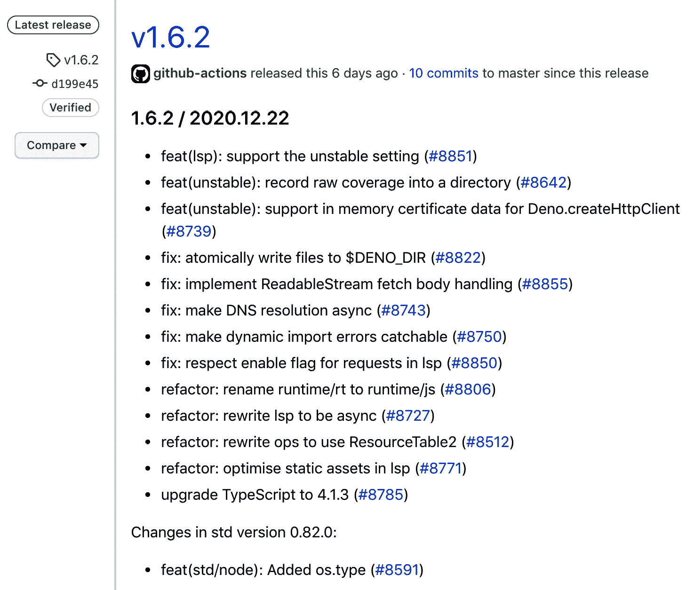
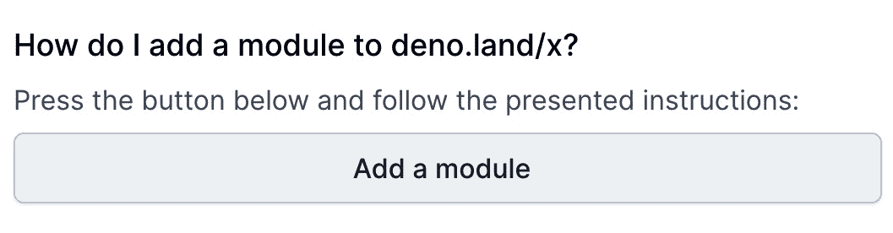
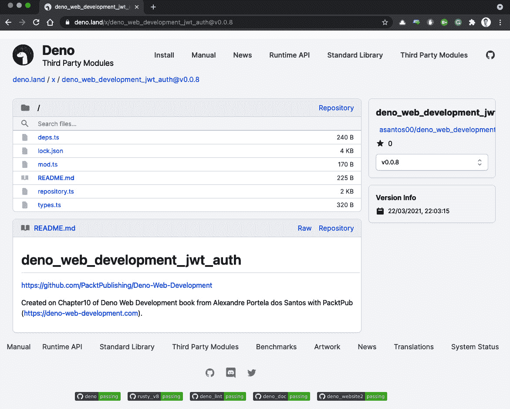

# 第十章：接下来是什么？

我们已经走了一段很长的路。我们开始了解 Deno 的基本知识，然后构建并部署了一个完整的应用程序。到目前为止，你应该已经对 Deno 感到舒适，并且对它解决的问题有很好的了解。希望我们经历的所有阶段都有助于澄清你可能有关于 Deno 的许多问题。

我们故意选择让这本书成为一段旅程，从我们的第一个脚本开始，到完成部署的应用程序结束，我们在书中边编写边迭代这个应用程序。与此同时，我们解决了许多应用程序开发者可能会遇到的挑战，并提出了解决方案。

到现在为止，你应该已经具备了帮助您决定 Deno 是否将成为您下一个项目解决方案一部分的知识。

本章将首先回顾我们已经学到的内容，包括所有阶段和学习点。然后，正如章节标题所暗示的，我们的重点将转向未来。本章将关注接下来会发生什么，既包括作为运行时的 Deno，也包括作为一名配备了新工具的开发人员。

我们会快速查看 Deno 核心团队当前的优先事项，他们正在做什么，以及提议的未来功能是什么。随着章节的进行，我们还将查看社区中正在发生的事情，突出一些有趣的倡议。

本章将通过展示我们如何将包发布到 Deno 的官方注册表等方式，结束对 Deno 社区的回馈。

到本章结束时，你将在以下领域感到舒适：

+   回顾我们的旅程

+   Deno 的路线图

+   Deno 的未来和社区

+   将包发布到 Deno 的官方注册表

# 回顾我们的旅程

我们已经覆盖了大量的地面。我们相信这本书（希望）是从不了解 Deno 到用它建造东西，最后部署一个应用程序的有趣旅程。

我们首先了解这个工具本身，首先了解它提供的功能，然后使用标准库编写简单的程序。随着我们的知识积累，我们很快就有足够的知识用它来构建一个真正的应用程序，这就是我们接下来要做的。

冒险始于使用标准库构建最简单的可能的 Web 服务器。我们大量使用 TypeScript 来帮助明确指定应用程序的边界，并成功运行了一个非常简单的应用程序，达到了我们第一个检查点：**hello world**。

我们的应用程序在进化，随着它开始拥有更复杂的需求，我们需要深入研究 Deno 社区上可用的网络框架。在我们对所有它们进行了高层次的比较之后，根据我们的应用程序需求，我们选择了`oak`。下一步是将我们（仍然）简单的 Web 服务器迁移到使用我们选择的框架，这轻而易举。使用网络框架使我们的代码更简单，并允许我们将我们真的不想自己处理的事情委托出去，让我们能够专注于应用程序本身。

下一步是向我们的应用程序添加用户。我们创建了应用程序端点以实现用户注册，随着存储用户的需求出现，我们将应用程序连接到了 MongoDB。有了用户之后，实现用户认证就是一步之遥。

随着应用程序的增长，对更复杂配置的需求也在增长。从它运行的服务器端口到证书文件的位置，或者到数据库凭据，所有这些都需要独立处理。我们将配置从应用程序中抽象出来，并集中管理。在此过程中，我们添加了支持，允许配置存在于文件中或环境变量中。这使得可以根据环境运行具有不同配置的应用程序，同时将敏感值安全地保持在代码之外。

当我们的旅程即将结束时，我们想确保我们的代码足够可靠。这让我们想到了一个测试章节，在那里我们学习了 Deno 中测试的基础知识，并为我们所创建的应用程序的不同用例创建了不同的测试。我们从简单的单元测试走到了跨模块测试，再到启动应用程序并进行一些请求的测试。通过这个过程的最后，我们对我们的代码按预期工作更有信心，并将测试能力添加到我们的工具链中。

为了结束本章，我们将编写的代码变成了现实，并将其部署了出去。

我们在 Heroku 上的容器化环境中运行了应用程序。与此同时，我们学习了关于 Docker 的知识，以及如何使用它让开发者更容易运行和部署他们的代码。我们用一种自动化方式部署了一个 Deno 应用程序，结束了从代码到部署的循环。

这是我们经历了一个应用程序开发过程中的许多常见阶段，遇到挑战并使用适合我们用例的解决方案解决问题的旅程。我希望我已经涵盖了你们的一些主要关切和问题，为你们提供了坚实的基础，帮助你们在未来。

我们不知道接下来会发生什么，但我们确实知道它取决于 Deno 及其社区，我们希望您认为自己也是这个的一部分。在下一节中，我们将看看 Deno 的未来路线图，计划的内容以及他们的短期努力方向。

# Deno 的路线图

自从瑞恩在 JSConf 上首次介绍 Deno 以来，很多事情都发生了变化；已经迈出了几大步。随着第一个稳定版本的运行时发布，社区爆发了，很多来自其他 JavaScript 社区的人都加入其中，带来了许多热情洋溢的想法。

目前 Deno 的核心团队正在投入大量精力推动 Deno 的发展。这种贡献不仅以代码、问题和帮助他人的形式出现，还体现在规划和界定下一步行动上。

对于短期路线图，核心团队确保其正在追踪倡议。下面两个在 GitHub 上提出的问题已经用来追踪 2020 年第四季度和 2021 年第一季度的工作：

+   [`github.com/denoland/deno/issues/7915`](https://github.com/denoland/deno/issues/7915)

+   [`github.com/denoland/deno/issues/8824`](https://github.com/denoland/deno/issues/8824)

如果您仔细查看这些内容，可以跟踪有关这些功能的每个讨论、代码和决策。我在这里列出一些当前的倡议，让您预览一下正在发生的事情：

+   Deno 的**语言服务器协议**（**LSP**）和语言服务器

+   编译成二进制文件（Deno 应用程序的单个可执行文件）

+   数据、blob、WebAssembly 和**JavaScript 对象表示法**（**JSON**）导入

+   对**Web Crypto**应用编程接口（**APIs**）的支持进行了改进

+   支持**立即执行函数表达式**（**IIFE**）捆绑包

+   WebGPU 支持

+   HTTP/2 支持

这些都是 Deno 正在进行的一些重要倡议的几个例子。正如您能想象的那样，由于它还处于早期阶段，目前有很多努力旨在修复漏洞和重构代码，我没有把这些加入到这个列表中。

请随意深入查看之前提到的 GitHub 问题，以获取关于任何倡议的更多详细信息。

所有这些都是 Deno 的核心团队努力。记住，Deno 之所以存在，是因为有人在他们的业余时间致力于此。回馈社区有很多方式，无论是通过提交错误报告、代码贡献、在通讯渠道上帮助他人，还是通过捐赠。

如果 Deno 帮助您和您的公司把想法变成现实，请考虑成为赞助商，以保持其健康并继续发展。您可以在以下链接上在 GitHub 上进行赞助：[`github.com/sponsors/denoland`](https://github.com/sponsors/denoland)。

还有其他也为 Deno 负责的人，他们为 Deno 的热情、其发展以及那些人就是 Deno 社区。在下一节中，我们将介绍 Deno 社区、那里发生的一些有趣的事情以及你可以如何积极参与其中。

# Deno 的未来和社区

Deno 社区正在快速增长——充满了对它感到兴奋并渴望帮助它成长的人。正如你在本书中一直所做的，当你开始使用它时，你可以为它做出非常重要的贡献。这可能是一个你遇到的错误，一个对你有意义的功能，或者只是你想更好地理解的东西。

为了让你成为其中的一员，我建议你加入 Deno 的 Discord 频道([`discord.gg/deno`](https://discord.gg/deno)).这是一个非常活跃的地方，你可以找到其他对 Deno 感兴趣的人，如果你想要寻找包的作者，自己构建包，或者帮助 Deno 核心，这里非常有用。根据我的经验，我只能说我在那里遇到的所有人都非常友好和乐于助人。这也是了解正在发生的事情的好方法。

另一种贡献方式是关注 Deno 在 GitHub 上的仓库([`github.com/denoland`](https://github.com/denoland)).主仓库可以在[`github.com/denoland/deno`](https://github.com/denoland/deno)找到，那里你可以找到 Deno**命令行界面** (**CLI**)和 Deno 核心，而标准库则在其自己的仓库中([`github.com/denoland/deno_std`](https://github.com/denoland/deno_std))。还有其他仓库，如[`github.com/denoland/rusty_v8`](https://github.com/denoland/rusty_v8)，它托管了用于 V8 JavaScript 引擎的 Deno 的 Rust 绑定，或者[`github.com/denoland/deno_lint`](https://github.com/denoland/deno_lint)，Deno linter 托管在其中，还有其他一些仓库。请在 GitHub 上关注你感兴趣的仓库。

提示

在没有收到太多通知的情况下了解 Deno 上正在发生的事情的一个很好的方法是只关注 Deno 的主要仓库的发布。你会对每一个发布收到通知，你可以跟随非常全面的发布说明。我留下一个发布说明的示例，以便你知道它们看起来是什么样子。

这就是版本更新通知的样子：




图 10.1 – Deno 的 v1.6.2 发布笔记

除了前面截图中显示的 GitHub 发布版本外，Deno 团队还努力在他们的网站上编写全面的发布说明，这是保持更新的另一种好方法([`deno.land/posts`](https://deno.land/posts))。

要成为 Deno 社区的重要一员，你可以做的事情就是使用它，报告错误，结识新朋友，其余的就会随之而来。

社区不仅由核心成员和帮助 Deno 的人组成，还包括用它构建的包和项目。

在接下来的部分，我会突出一些我认为很棒且正在推动社区前进的倡议。这是一个个人清单；把它当作一个推荐，而不是更多，因为我相信还有其他可以添加的倡议。

## 社区中正在发生的有趣事情

在我关注 Deno 的过去两年里，发生了许多事情。在 v1.0.0 发布后，随着更多的人加入，涌现了许多想法。我会列出一些我认为特别有趣的倡议，不仅因为它们提供功能性，而且因为它们也是学习的伟大来源。

### Denon

正如在开发 Node 时 Nodemon 是首选解决方案一样，Deno 在 Deno 领域中最常被使用的工具之一。如果你还没听说过，它基本上会监视你的文件，并在你更改任何内容时重新运行你的 Deno 应用程序。它是那些在开发 Deno 时你很可能会保留在工具链中的工具之一。你可以查看他们的 GitHub 页面：[`github.com/denosaurs/denon`](https://github.com/denosaurs/denon)。

### Aleph.js

尽管我们在这里没有足够的空间去探讨它，但 Deno 在浏览器上运行的能力解锁了一整套新的功能性，这导致了像 Aleph.js 这样的倡议。这个倡议称自己为 Deno 中的*React 框架*，并且已经得到了相当多的使用和热情。如果你还没听说过，它从 Next.js 框架([`nextjs.org/`](https://nextjs.org/))中采取了诸多方面，在 Deno 中实现它们，并添加了一些其他的东西。它虽然很新，但已经有了服务器端渲染、热模块重载和文件系统及 API 路由等功能。你可以在这里了解更多：[`alephjs.org/`](https://alephjs.org/)。

### Nest.land

尽管 Deno 有自己的注册表（我们将在下一节中使用），但社区还是创造了其他的注册表。Nest.land 是其中的一个；它是一个基于区块链技术的模块注册表，确保托管在那里的模块不会被删除。它是免费的、去中心化的，不需要 Git 就能工作，是许多包作者的首选解决方案。关于它的更多信息，请访问：[`nest.land/`](https://nest.land/)。

### Pagic

随着静态网站生成器越来越受欢迎，制作一些用 Deno 的静态网站生成器只是时间问题。这就是 Pagic 所做的事情——它是一个支持 React、Vue 和 M 等有趣功能的静态网站生成器。它采用约定优于配置的方式，这意味着让你的第一个网站运行起来相当简单。关于它的更多信息，请访问：[`pagic.org/`](https://pagic.org/)。

### Webview_deno

由于现在许多人使用的应用程序都是用 JavaScript 编写的，并存在于网页视图中，它们最终会来到 Deno 只是时间问题。这个模块包括一个 Deno 插件，因此仍然被认为是稳定的。然而，尽管它有局限性，并且是一个正在进行的项目，它已经提供了许多由 Electron（Node.js 的替代品）提供的有趣功能。

除了上述所有的包之外，所有在第四章 *构建网页应用* 中提到的包都值得一看。它们是快速发展的网页框架，正如我们之前探索过的，为使用它们的开发者提供了不同的好处。如果您正在使用 Deno 开发网页应用，请确保您关注它们。查看它们的 GitHub 页面[`github.com/webview/webview_deno`](https://github.com/webview/webview_deno)。

你认为 Deno 上仍然缺少什么功能吗？你开发了什么你认为对更多人都有用东西吗？开源的核心依赖于这些有趣的软件和背后的人。

制作了想要分享的东西吗？不用担心——我们帮您搞定。在下一节中，您将学习如何做到这一点！

# 将包发布到 Deno 的官方注册表

开源的核心是由使用免费软件的个人和企业组成的，他们有回馈的愿望。当你创造了一段你认为足够有趣的代码时，你很可能会想要分享它。这不仅是帮助其他人的方式，也是改进自己代码的方式。

开源以及这种分享文化是使 Deno、Node.js 以及许多你可能使用的其他技术成为现实的原因。既然这本书都是关于 Deno 的，不提这个话题是没有意义的。

Deno 有一个官方的模块注册表，我们之前已经使用过了。这是一个任何人只要有 GitHub 账户就可以与社区分享自己模块的地方，它提供了自动化和缓存机制来保持不同版本的模块。

我们接下来要做的就是将我们自己的模块发布到这个注册表中。

我们将使用一段软件，到目前为止，我们通过直接链接到 GitHub 提供。这可以工作，但它既没有清晰的版本控制，也没有任何类型的缓存，如果代码从 GitHub 上删除，它就无法使用。

记得我们曾经使用过一个叫做`jwt-auth`的包内的`AuthRepository`吗？当时，出于实际原因，我们使用了一个直接到 GitHub 的链接，但从现在开始，我们将在 Deno 的模块注册表中发布它。

我们将使用在 GitHub 上托管的完全相同的代码，但以`deno_web_development_jwt_auth`的名字发布它。我们选择这个名称是为了非常清楚地表明它是这本书旅程的一部分。我们还不想为用于学习目的的包 grab 注册表中有意义的名称。

让我们开始吧！按照以下步骤进行：

1.  为你想发布的模块创建一个仓库。如前所述，我们将使用来自第六章的`jwt-auth`模块，*添加认证并连接到数据库* ([`github.com/PacktPublishing/Deno-Web-Development/tree/master/Chapter06/jwt-auth`](https://github.com/PacktPublishing/Deno-Web-Development/tree/master/Chapter06/jwt-auth))，但请随意使用你选择的任何其他模块。

1.  克隆最近创建的`git`仓库，按照 GitHub 的说明操作。确保将你的模块文件复制到这个仓库文件夹中，并运行以下命令（这些命令与 GitHub 的说明相同）：

    ```js
    $ echo "# <Name of your package>" >> README.md
    $ git init
    $ git add .
    $ git commit -m "first commit"
    $ git branch -M main
    $ git remote add origin git@github.com:<your-username>/ <your_package_name>.git
    $ git push -u origin main
    ```

1.  前往[`deno.land/x`](https://deno.land/x) 并点击“添加模块”按钮（你可能需要滚动一点才能找到它），如下所示：

    图 10.2 – Deno 模块注册表中的“添加模块”按钮

1.  在出现的框中输入模块名称，并点击将`deno_web_development_jwt_auth`作为包名称，但由于明显的原因，你不能这样做。

    记住，如果你发布模块是为了测试原因，你应该使用一个测试名称。我们不希望使用“真实”的模块名称来使用用于测试目的的模块。

1.  在出现的下一个框中，选择代码将要发布的目录。

    对于我们的模块，将包含来自第六章的`jwt-auth`代码，*添加认证并连接到数据库*，我们将留空，因为它位于步骤 1 中创建的新仓库的根目录下。

1.  现在，只需按照说明添加 webhook 即可。

    Deno 模块注册表使用 GitHub webhook 来获取包的更新。这些 webhook 应该由新分支或标签触发，Deno 的模块注册表然后将这些 GitHub 标签创建为一个版本。

    接下来的说明出现在 Deno 的页面上，但由于实际原因，我会在这里列出它们：

    a. 导航到你想在 GitHub 上添加的仓库。

    b. 前往`https://api.deno.land/webhook/gh/<package_name>`（包名称应与步骤 4 中选择的名称相同）。

    f. 选择`application/json`作为内容类型。

    g. 选择**让我选择个别事件**。

    h. 只选择**分支或标签创建**事件。

    i. 点击**添加 webhook**。

1.  现在，只需创建一个版本，正如我们提到的，这是通过`git`标签完成的。假设您已经在步骤 2 中提交了您的包代码，我们只需要创建并推送此标签，如下所示：

    ```js
    $ git tag v0.0.1
    $ git push origin --tags 
    Enumerating objects: 5, done.
    Counting objects: 100% (5/5), done.
    Delta compression using up to 8 threads
    Compressing objects: 100% (3/3), done.
    Writing objects: 100% (3/3), 748 bytes | 748.00 KiB/s, done.
    Total 3 (delta 1), reused 0 (delta 0)
    remote: Resolving deltas: 100% (1/1), completed with 1 local object.
    To github.com:asantos00/deno_web_development_jwt_auth.git
     * [new tag]         v0.0.1 -> v0.0.1
    ```

1.  如果我们现在导航到[`deno.land/x`](https://deno.land/x) 并搜索你包的名称（在我们的例子中是`deno_web_development_jwt_auth`），它应该出现在那里，正如你在以下屏幕截图中所看到的：



图 10.3 – 在 Deno 的模块注册表上发布的包

就这样——这就是你开始与社区分享你的 Deno 代码所需的一切！从现在开始，你不仅可以使用 Deno 构建应用程序，还可以创建包并回馈社区。

这一节以及这本书就到此结束——感谢你跟进并读到了最后。我们希望它对你有用，帮助你学习了 Deno，也希望你对它像我们一样充满热情。

如果你认为有什么我能帮忙的，我会非常乐意联系。可以通过书中前言中提供的联系方式，通过 GitHub 或 Twitter 随时联系我。

# 总结

首先，感谢所有坚持读到书末的人！我希望这是一段有趣旅程，满足你的期望，并回答了你关于 Deno 的许多问题和疑虑。

这只是（希望是大的）旅程的开始。Deno 正在成长，你现在成为了其中的一部分。你越使用它并回馈，它就会变得越好。如果你，像我一样，认为它为编写 JavaScript 应用程序提供了许多好处，可以使之作翻天覆地的变化，不要等待，立即分享你的热情。

像我们这样有很多人正在帮助推动 Deno 的发展，帮助社区，开发模块，提交拉取请求。归根结底，在你项目中恰当使用它，是你能做出的最好推荐。

在整本书中，我不仅试图突出 Deno 的优势，还试图非常清楚地表明，它不是，也不会是 silver bullet。它在很多方面都有很大的优势，尤其是在与 Node.js 相同的用例中（正如你在第一章 *Deno 是什么？*中可以检查到的）。正如我们在这章中提到的，有许多功能正在增加，这将使 Deno 能够用于越来越多的用例，但我相信还有很多我们甚至不知道的东西即将到来。

从这里开始，一切都取决于你。我希望这本书让你充满热情，迫不及待地想写 Deno 应用程序。

下一步最好的做法是亲自编写应用程序。这将使你进行研究，与人们交谈，并解决你自己的问题。我尽可能地简化你前进的路径，通过回答一些最常见的问题。

我相信网上有很多资源、文章和书籍，但真正提高 Deno 技能的地方仍然是 Discord 频道和 GitHub 仓库。这些地方是最新消息的第一手来源！

我迫不及待想看到你接下来会构建什么。
