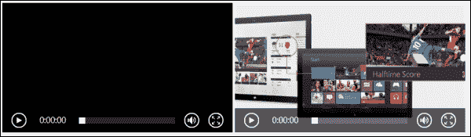

# 一、HTML5 结构

HTML5 引入了新的元素和属性，以实现更整洁的结构、更智能的形式和更丰富的媒体；这使开发人员的生活更加轻松。HTML5 功能根据其功能分为几个组，新的结构元素属于组语义，包括结构元素、媒体元素、属性、表单类型、链接关系类型、国际化语义和附加语义的微数据。HTML5 中有大量的添加和增强，所有这些都是为了更好地在 web 上呈现内容。在为 Windows 8 开发应用时，您将使用其中的许多功能；将其用于 Windows 8 开发的区别和优势在于，您不必担心浏览器的兼容性，至少在 Windows 应用商店应用级别上是这样，因为 Windows 8 是一个使用最新 web 标准的 HTML5 平台。HTML5 和 CSS3 中使用的所有内容都在代码中为您提供，并保证在应用中正常工作。最新版本的 VisualStudio（VS2012）包含了一个新的 HTML 和 CSS 编辑器，它提供了对 HTML5 和 CSS3 元素和片段的全面支持。

在本章中，我们将介绍以下主题：

*   语义要素
*   媒体元素
*   形式元素
*   自定义数据属性

# 理解语义要素

HTML5 标记比之前的标记更具语义，这是因为有了新的语义元素来描述页面内容的结构。语义元素列表包括以下内容：

*   `<header>`标记定义文档或节的标题。它将标题或一组标题包装在一个页面或一个章节中，还可以包含标识、横幅和主要导航链接等信息。一个页面中可以有多个`<header>`标记。
*   `<nav>`标签代表主要的导航链接。通常，它绑定到标头。
*   `<section>`标签包装了可按主题分组的相关内容。`<section>`标签可以包括`<header>`和`<footer>`标签。
*   `<footer>`标签表示关于页面或部分的内容，例如，相关链接、隐私条款和版权信息。一个页面中可以有多个`<footer>`，它与`<header>`标记相同。
*   `<article>`标记表示独立于文档整体使用的自包含内容，例如博客条目。`<article>`和`<section>`非常相似，因为它们都是独立的标签，并保存相关内容；然而，如果它的内容可以联合（通过 atom 或 RSS 提要），那么`<article>`元素更合适。
*   `<aside>`标记表示页面中与其周围内容切向相关的部分，也与该内容分离，因为可以在不影响页面主要内容的情况下删除该部分。典型用法可以是侧边栏。
*   `<address>`标记表示最近的`<article>`父元素（如果存在）或父`<body>`元素的联系人信息，在这种情况下，该父元素适用于整个文档。

将所有这些新元素放在一个页面中会产生以下标记：

```js
<!DOCTYPE html>
<html lang="en">
<head>
  <meta charset="UTF-8">
  <title>Developing for Windows 8</title>
</head>
<body>
  <header>
    <a href="default.html">
      <h1>The Courses</h1>
      
    </a>
    <nav>
      <ul>
        <li><a href="home.html">Home</a></li>
        <li><a href="about.html">About</a></li>
      </ul>
    </nav>
  </header>
  <section>
    <article>
      <h2></h2>
      <p></p>
      <address>
        Written by <a href="mailto:xyz@abc.com">Demo Author</a>.<br>
        Found at: Demo.com <br>
        Address, Street<br>
        UK
      </address>
    </article>
    <article>
      <h2></h2>
      <p>content</p>
    </article>
  </section>
  <aside>
    <h2></h2>
    <ul>
      <li></li>
      <li></li>
      <li></li>
    </ul>
    <p></p>
  </aside>
  <footer>
    <p></p>
    <p>Copyright &copy; 2013 Packt</p>
  </footer>
</body>
</html>
```

# 引入内置媒体元素

HTML5 引入了`<audio>`和`<video>`等新媒体元素，可以认为这是继 HTML 早期版本中的图像之后媒体类型的一次新革命。这两个元素使得在 HTML 页面/文档中嵌入媒体变得非常容易，并通过**HTML5 媒体元素 API**提供内置媒体支持。根据 W3C 最新规范，我们可以定义`<video>`和`<audio>`如下：

*   `<video>`标签是一种媒体元素，用于播放带有字幕的视频或电影以及音频文件
*   `<audio>`标签是其媒体数据为音频的媒体元素，即声音或音频流

`<audio>`和`<video>`元素分别播放音频和视频文件。它们之间唯一的区别在于`<audio>`元素没有视觉内容的播放区域，与`<video>`元素相反。

在 HTML5 之前，我们需要一个插件来播放音频或视频文件，这需要编写大量的标记。没有 HTML5，嵌入媒体元素从未如此容易；只需放置一个`<audio>`标记，生成两行代码，您就可以获得一个带有播放控件的媒体播放器。与之前的``标签几乎相同。请参阅以下代码：

```js
<audio src="audio.mp3" controls>
</audio>
```

上一个示例生成的媒体播放器类似于 Internet Explorer 9（IE9）上的以下屏幕截图，并且可能因浏览器而异：


前面的代码以最简单的形式显示了`<audio>`标记，但是`<audio>`标记有更多的属性和选项。请参阅以下代码：

```js
<audio controls autoplay loop>
  <p>Your browser does not support the audio element. Click <a href="content/Elsie.mp3"> here </a> to download the file instead.
  </p>
  <source src="audio.mp3" type="audio/mp3" />
  <source src="audio.ogg" type="audio/ogg" />
</audio>
```

首先，注意包装在`<audio>`元素内的`<p>`标记中的内容。此内容为回退文本，仅在浏览器不支持`<audio>`标记时使用。它通过向用户通知此问题，为较旧的 web 浏览器提供了一个优雅的回退，我们可以添加一个链接来允许下载此音频文件。这样，用户就不会只是站在那里想发生了什么。这是最简单的退路；您也可以将 JavaScript 用于同样的目的。

前面的代码片段还显示了`<audio>`元素的一些属性。根据 W3C 规范，`src`、`controls`、`autoplay`、`loop`、`preload`、`mediagroup`和`muted`是媒体元素的共同属性，即`<audio>`和`<video>`。

*   `controls`属性显示网页音频的标准 HTML5 控件，控件的设计因浏览器代理而异。
*   DOM 加载完成后，`autoplay`属性会自动播放音频文件。
*   `loop`属性自动启用重复。
*   `mediagroup`属性使用媒体控制器将多个媒体元素链接在一起。
*   `muted`属性将音频文件的默认状态设置为静音。
*   `preload`属性向用户代理提供了一个提示，提示作者认为什么会带来最佳的用户体验。其值可以是`none`、`metadata`或`auto`。
    *   `none`：该值向浏览器提示该网页并不期望用户需要该媒体资源。
    *   `metadata`：该值提示浏览器获取资源元数据（维度、曲目列表、持续时间等）。
    *   `auto`：此值提示浏览器将用户需求放在首位，不会给服务器带来任何风险。空值（如仅添加属性`preload`时）映射到`auto`值。

您可以为`controls="controls"`中的属性指定一个值，该值具有相同的行为。但是为了简单和代码更少，您可以简单地省略该属性的值；同样适用于`loop`、`autoplay`和`muted`。您可以使用`src`属性或元素`<source>`指定媒体资源。

### 注

该属性覆盖元素。

媒体资源（音频或视频）具有 MIME 类型，另外还有一个编解码器，如以下代码所示：

```js
<source src="video.ogv" type="video/ogg; codecs="theora, vorbis" />
```

必须在`<source>`元素中设置`type`属性的值。如果资源不支持其类型，浏览器/用户代理将避免下载资源。您可以添加多种格式的音频/视频，以确保跨不同浏览器的播放支持。浏览器代理将遍历`<source>`元素；如果无法呈现第一个类型，则会跳到下一个`<source>`验证其类型，以此类推。为此，您必须检查不同浏览器中的`<audio>`和`<video>`元素支持的 MIME 类型列表。浏览器不仅检查 MIME 类型，还检查指定的编解码器。因此，即使浏览器代理可以呈现资源类型，如果不支持编解码器，视频/音频也不会加载。

以下表列出了跨主要浏览器对 3 种主要视频格式的支持：

<colgroup><col style="text-align: left"> <col style="text-align: left"> <col style="text-align: left"> <col style="text-align: left"> <col style="text-align: left"> <col style="text-align: left"></colgroup> 
| 

总体安排

 | 

IE9+

 | 

铬

 | 

火狐

 | 

歌剧

 | 

游猎

 |
| --- | --- | --- | --- | --- | --- |
| WebM（VP8 编解码器） | 对 | 对 | 对 | 对 | 不 |
| MP4（H.264 编解码器） | 对 | 对 | 不 | 不 | 对 |
| OGV（OGG THEORA 编解码器） | 不 | 对 | 对 | 对 | 不 |

从上表中的列表中，我们可以得出结论，在 HTML5 视频中同时提供 WebM 和 MP4 格式的媒体资源将保证在所有主要浏览器的最新版本中加载。这一理论在 VisualStudio2012 中得到了强化，它为 HTML5 标签提供了全面的智能感知支持。当您为 HTML5`<video>`元素插入以下代码片段时，会在`<video>`标记中列出 3 个`<source>`元素：

```js
<video controls="controls">
  <source src="file.mp4" type="video/mp4" />
  <source src="file.webm" type="video/webm" />
  <source src="file.ogv" type="video/ogg" />
</video>
```

`<video>`元素还包括`poster`属性，该属性用于指定当没有视频数据可用时或在用户单击播放按钮之前，要在视觉内容区域中显示的图像的路径。出于广告目的，您可以使用视频中的图像或帧，让用户了解视频的内容。如果未指定海报图像且未设置`autoplay`属性，则浏览器可能仅显示填充`<video>`元素尺寸的黑框。例如，以下代码显示了两个类似视频的代码示例之间的差异，并为第二个视频指定了海报：

```js
<video id="video" controls width="400">
  <source src="http://ie.microsoft.com/testdrive/Videos/BehindIE9AllAroundFast/video.mp4" type="video/mp4" />
</video>
<video id="videoWithPoster" controls width="400" poster="http://msdn.microsoft.com/br211386.5_GetStarted_484x272px.jpg">
  <source src="http://ie.microsoft.com/testdrive/Videos/BehindIE9AllAroundFast/video.mp4" type="video/mp4" />
</video>
```

此标记的输出将在屏幕上产生以下内容：



您可能已经注意到，在前面的示例中，我们为两个视频指定了`width`值`400`。`<video>`元素接受标准的 HTML`width`和`height`属性。如果`width`和`height`没有设置值，则视觉内容区域会延伸到视频的原始大小。建议在`<video>`元素上设置`width`和`height`属性，从而避免拉伸到全尺寸，并以所需的观看尺寸对视频进行编码。

### 注

宽度和高度属性的值不接受单位。该值表示 CSS 像素，例如，`width=400`与`width=400px`相同。

有一些 JavaScript 方法、属性和 DOM 事件是与这些新元素相关联的 HTML5 标准的一部分。您可以通过编程方式读取和设置属性，例如`src`路径和`<video>`标记的尺寸（`width`和`height`。您可以使用 JavaScript 方法加载音频和视频，然后播放和暂停媒体资源。您还可以编写代码来处理媒体元素引发的不同 DOM 事件，例如`onplaying`、`onprogress`（加载进度）、`onplay`和`onpause`。例如，通过移除`controls`属性，并通过从单独的按钮调用播放和暂停媒体资源的功能，可以禁用元素显示的默认控件。

下面的代码清单显示了如何使用 JavaScript 播放和暂停视频。我们首先需要通过调用布尔属性`.paused`来检测视频文件的当前状态，如果为 true，则调用相应的方法`play()`或`pause()`：

```js
var testVideo = document.getElementById('myVideo');
if (testVideo.paused)
  testVideo.play();
else
  testVideo.pause();
```

在前面的代码中，我们声明了一个变量`testVideo`，并将其分配给 DOM 中的`myVideo`元素。假设元素被分配了一个 ID，您可以使用名称、标记名或元素在 DOM 层次结构中的位置来检索元素。

## 使用 JavaScript 的高级媒体

媒体元素有一个丰富的 API，可以使用纯 JavaScript 访问。使用 JavaScript，我们可以向媒体元素添加很多功能。您可以操作媒体资源、设置其样式、旋转视频、同步播放两个或更多媒体元素、在加载媒体资源时显示进度条、动态调整视频大小，等等。

下面的代码示例为`timeupdate`事件添加了功能，该事件以秒为单位获取视频的当前播放时间，并将其显示在单独的 div 中。

以下是 HTML 代码：

```js
<div id="tInfo"></div>
<video id="myVideo" autoplay controls>
  <source src="w8.mp4" type="video/mp4" />
</video>
```

以下是 JavaScript 代码：

```js
var video = document.getElementsById('myVideo');
var tInfo = document.getElementById('tInfo');
video.addEventListener('timeupdate',function(event){
tInfo.innerHTML = parseInt(video.currentTime);
}, false);
```

JavaScript`addEventListener`方法用于为`timeupdate`事件提供处理程序。它有三个参数，基本语法如下：

```js
WinJS.Application.addEventListener(type, listener, capture);
```

`type`参数指定要注册的事件类型，`listener`是要与事件关联的事件处理程序函数，第三个参数`capture`是一个布尔值，指定是否为捕获阶段注册事件处理程序。

此外，您可以将`<video>`元素的功能与画布相结合，允许您实时操作视频数据并添加各种视觉效果。

# 引入功能丰富的形态元素

表格和`<form>`元素是任何申请或网站不可分割的一部分，从登录表格到完整的联系人或注册表格。在 HTML4 中，元素非常空闲，对于任何功能或高级样式，JavaScript 都是必不可少的。对于任何交互，或数据提交和验证，都需要服务器端和客户端脚本，如果在浏览器中禁用脚本，则其功能将被禁用。HTML5 通过新的属性和输入类型对`<form>`元素进行了重大改进，并添加了基于浏览器的验证和 CSS 样式等功能，为用户提供了更好的填充体验，并为开发人员提供了所有可能的简单性。

## 丰富的<输入>标签

`type`属性的新值被引入`<input>`元素。

HTML5 在我们已经熟悉的 HTML4 中增加了 13 种新的`<input>`类型，例如`text`和`checkbox`。通过此添加，`<input>`控件现在支持`range`、`date`、`number`、`telephone`、`email`和`URL`等类型。这些新的`<input>`类型为元素本身添加了智能行为。

下表列出了这些类型：

<colgroup><col style="text-align: left"> <col style="text-align: left"></colgroup> 
| 

`<input>`类型

 | 

描述

 |
| --- | --- |
| `tel` | 它需要一个电话号码。 |
| `search` | 它提示用户输入他们想要搜索的文本，并在输入元素中添加一个搜索图标（在支持它的浏览器上）。 |
| `url` | 它需要一个 URL。 |
| `email` | 它需要一个电子邮件地址或电子邮件地址列表（用逗号分隔）。 |
| `datetime` | 它希望有 UTC 时区的日期和时间。 |
| `date` | 它期待一个日期。 |
| `month` | 它希望日期为一年零一个月，但没有时区。 |
| `week` | 它期望一个日期由一周、一年号和一周号组成。 |
| `time` | 它需要一个时间值，如小时、分钟、秒和分数秒。 |
| `datetime-local` | 它期望日期和时间没有时区。 |
| `number` | 需要数字输入。 |
| `range` | 它需要一个数字输入，并显示一个滑块。 |
| `color` | 它需要颜色值，并显示可供选择的颜色调色板。 |

随着`<input>`类型的增加，已经存在的特性也增加了新的特性，例如文件输入元素，它现在支持使用和`multiple`属性进行多文件选择。**浏览**按钮将显示文件对话框，然后您可以从本地磁盘或`SkyDrive`中选择文件；提交表单时，这些文件可以作为表单数据的一部分发送到服务器。

您还可以利用 W3C 指定的表示任务进度的`progress`元素。它可用于显示正在上载的大型文件或正在加载的媒体资源的进度。任务的进度由该元素的两个属性决定：

*   `value`属性表示取得了多大进展
*   `max`属性，表示任务完成前所需的总工作量

下面的代码使用一个`progress`元素和一个按钮，脚本将 JavaScript 函数参数中指定的值添加到其现有值中。当您加载示例并尝试它时，您将看到进度条直观地更新完成进度。

以下是 HTML 代码：

```js
<button id="clickBtn" onclick="updateProgress(10)">Update Progress</button>Progress: <progress id="prog" max="100"></progress>
```

以下是 JavaScript 代码：

```js
<script>
//get the progress element and add the value to it with every click var progressBar = document.getElementById('prog');
function updateProgress(newValue){ 
progressBar.value = progressBar.value + newValue;
}
</script>
```

## 容易验证

HTML5 新的`<input>`类型以及`required`和`pattern`等验证属性和伪 CSS3 选择器允许基于浏览器的验证，您可以在不使用一行代码或脚本的情况下捕获表单的输入错误。这以前是不可能的，需要自定义 JavaScript 代码或 JavaScript 库。基本上，它不使用 JavaScript 提供客户端表单验证。

我们将从最简单的验证开始，填充一个必填字段。为了实现这一点，我们需要向`<input>`元素添加`required`属性。

可以在类型为`text`、`URL`、`email`、`checkbox`或`radio`的`<input>`元素上以及`select`和`textarea`元素上设置`required`属性。它是一个布尔属性，只能在元素上设置。

我们通过简单地添加`required`属性来指定为字段填充值是必需的。在下面的代码清单中，您将找到两个具有`required`属性的`<input>`元素：

```js
<form action="/" method="post">
  <label>Checkbox:</label>
    <input type="checkbox" required />
  <label>Radio:</label>
    <select>
      …
    </select>
  <label>Text:</label>
    <input type="search" required />
  <label>Range:</label>
    <input type="range" min="5" max="10" step="5" />
  <label>URL:</label>
    <input type="url"  required />
  <label>File:</label>
    <input type="file" accept=".mp3" />
    <input type="submit" name="submit" value=" Submit " />
</form>
```

一旦添加了`required`属性，然后点击**提交**按钮，表单中的所有字段都将被验证；如果任何字段不正确，则返回错误。必填字段将突出显示，此外，还会提供默认消息，通知用户表单中需要这些字段。

您可以看到显示上述代码输出的以下屏幕截图：


我们可以使用 CSS3 伪选择器`required`应用一个或多个样式（下一章将详细介绍）。例如，下面的样式添加了一个 CSS3 伪类`required`，它将查找文档中所有具有`required`属性的`input`元素，并将其样式设置为`yellow``border-color`。

```js
input:required {
  border-color: Yellow;
}
```

如果你想应用一种影响表单中所有非必需的元素的样式，那很容易；只需添加`optional`伪类并为其提供一种样式，就像我们对`required`类所做的那样。在下面的代码中，我们对所有没有`required`属性的`input`元素应用`LightGray``border-color`。

```js
input:optional {
  border-color: LightGray; 
}
```

HTML5 表单不仅验证必填字段，还检查字段值的内容，并自动验证，如 URL 和`email`输入类型，或使用`pattern`属性。`pattern`属性使用正则表达式定义元素值必须匹配的有效格式，例如电话号码或社会保险号码。

以下示例显示了`password`字段的语法，该字段是必需的，并且必须具有最小长度为 8 个字符的有效输入。在这里，默认验证消息由`title`属性中提供的文本替换：

```js
<input type="password" required pattern="[^\s]{8}[^\s]*" title="Passwords must be at least 8 characters long."/>
```

有更多的属性添加到验证技术中，例如`placeholder`，它向用户提供一条以浅文本显示的提示消息，直到用户开始在元素内键入；提示可能是关于他们应该在字段中输入的值。例如，您可以在`email`字段中添加演示电子邮件地址，例如：

```js
<input type="email" placeholder="email@example.com" />
```

您可以使用`maxlength`属性检查`text`或`textarea`输入中允许的最大字符数。此外，我们还有与`range`元素一起使用的`min`、`max`和`step`属性，用于验证为该元素输入的值。`min`和`max`属性检查可以输入的最小值和最大值，`step`属性检查允许的值。

您还可以使用`accept`属性指定可接受的文件 MIME 类型。正如您在前面的代码清单中所注意到的，`accept`属性被添加到`<input type="file" />`元素中，这是唯一一个与之一起使用的元素。一旦您将其添加到文件控件，然后尝试使用 Windows 8 文件资源管理器浏览文件时，将仅显示`accept`列表中的类型。

HTML5 表单验证是默认行为；不需要代码来激活它，但您可以通过向**提交**按钮或任何 `<input>`元素添加`formnovalidate`属性来关闭它。此属性允许在未经验证的情况下提交表单。

# 分配自定义数据属性

有了 HTML5，我们现在可以为任何 HTML5 元素分配自定义数据属性。W3C 将其定义为：

> *用于存储页面或应用专用的自定义数据的属性，该属性没有更合适的属性或元素。*

这些新的自定义数据属性由两部分组成：

*   **属性名称**：属性名称必须以前缀数据开头，后面至少要跟一个字符，不能包含大写字符
*   **属性值**：必须为字符串值

让我们为`<div>`标记添加一个自定义属性，如下代码所示：

```js
<div id="bookList" data-category="TechnicalBooks">
Developing for windows 8
</div>
```

您可以看到自定义属性名称`data-category`和分配给`<div>`元素的属性值`TechnicalBooks`。您的 JavaScript 代码可以使用本机`getAttribute`和`setAttribute`方法检索和更新此数据，因为自定义数据属性被视为使用它们的页面的一部分。以下是代码示例，演示如何使用本机 JavaScript 操纵自定义属性：

```js
function getSetCategory() {
  var bookList = document.getElementById("bookList");
//get the value of the attribute
  var bookCategory = bookList.getAttribute('data-category');
//set the value for the attribute
  bookList.setAttribute('data-category', 'HealthBooks');
//remove the attribute
  bookList.removeAttribute('data-category');
}
```

HTML5 规范明确规定，数据属性不应用于替换现有属性或语义上更合适的元素。例如，添加数据时间属性来指定`span`元素中的时间值是不合适的，如下代码所示：

```js
<span data-time="08:00">8am<span>
```

最合适、更具语义的元素是`time`元素，如下代码所示：

```js
<time datetime="08:00">8am</time>
```

在开发 Windows8 应用时，我们可以使用 WindowsLibraryforJavaScript（`WinJS`）来实现更高级的数据到 HTML 元素的绑定。Win8 JavaScript 库利用 HTML`data-*`属性提供了一种以编程方式实现数据绑定的简单方法。

# 总结

在 HTML5 中，有一些新的语义丰富的元素可以传达它们的使用目的。有一些媒体元素可以让您轻松地将音频和视频添加到应用中，还有一些新的输入类型和属性，您可以使用这些类型和属性创建智能和交互式表单，并动态地将它们绑定到数据，所有这些都比以前少了标记和代码。

在下一章中，我们将了解在为 Windows 8 开发时可以使用的新的、丰富的 CSS3 功能，以及如何使用这些功能为 HTML 设计样式和应用布局。