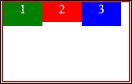
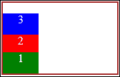

# 二、CSS3 的样式

HTML 定义文档/页面结构并列出其中包含的元素。但是定义这些元素的布局、定位和样式是 CSS 的唯一责任。顾名思义，级联样式表（CSS）基本上是一个包含样式规则列表的表。每个 CSS 样式规则都将一个**选择器**链接到一个声明块，该声明块定义了要设置的样式，该声明块包括一个或一组样式，而该声明块又定义了要应用于该关联选择器的效果。基本样式规则的语法如下所示

```js
selector { property: value; property: value; }
```

在本章中，我们将回顾以下主题：CSS3 选择器、网格和 Flexbox、动画和变换以及媒体查询。这些主题涵盖了使用 JavaScript 开发 Windows 应用商店应用时经常使用的一些 CSS3 功能。

# CSS3 选择器的功能

CSS 选择器非常强大，在格式化 HTML 文档时非常方便。使用选择器有时很棘手，因为选择您想要的内容，然后确保应用的样式规则只影响您想要的元素，这是一项乏味的任务。但是，如果使用正确的选择器，结果是非常有益的。掌握选择器的使用将减少 CSS 的复杂性，最大限度地减少样式冗余和使用类和 ID 过度定义 HTML 的可能性，从而确保更好的性能。选择器可以是 HTML 元素、类、元素 ID，甚至可以是元素在 DOM 中的位置。

以下是 CSS 选择器列表；我们将从基础知识开始，了解 CSS3 中引入的新选择器：

*   **星号（*）符号**：此为`catch-all`选择器，称为通用类型选择器，用于针对文档中的每个元素。它通常与 CSS 重置一起使用，以重置所有默认样式。

    ```js
    * { margin: 0; }
    ```

*   **The HTML element**: It is called the type selector and is used to select all the elements in the document according to their type. For example, the following selector will target every `<p>` element in the DOM, change the color of the text to red, and underline it.

    ```js
    p { color: red; text-decoration: underline; }
    ```

    ### 提示

    使用`<body>`元素作为选择器将以文档正文为目标，从而像使用星号（*）一样选择每个元素。

*   **The ID selector**: It is specified by the value in the id attribute of the element prefixed with the hash (`#`) symbol. The ID should be the element's name and, more importantly, it must be unique. The name should be a clear reference to the element. For instance, it would be quite clear to have an `id` value of `mainMenu` for a `nav` element. For example:

    ```js
    <nav id="mainMenu"></nav>

    ```

    此外，唯一性意味着在逻辑上，页面上不应该有其他具有`id`值`mainMenu`的元素。由于`id`应该始终是唯一的，因此选择器将只针对 HTML 文档中的一个元素。例如，如果您有一个`<div>`元素，其`id`值为`logo`，如下所示：

    ```js
    <div id="logo"></div>
    ```

    那么相应的选择器将是：

    ```js
    #logo { float: left; width: 200px; } 
    ```

*   **类选择器**：它由一个以句点（`.`为前缀的类的名称指定，并以匹配类名的所有元素为目标。此选择器的基本语法如下：

    ```js
    .highlighted { font-weight: bold; background-color:yellow; }
    ```

具有此类名的任何元素都将具有黄色背景色的粗体文本。当您想要为多个元素（特别是具有共同点的一组元素）设置样式时，应该应用类。请记住，与`id`属性相反，类名永远不能用于唯一标识元素。此外，`class`属性可以具有多个单一值；类似地，同一类可以应用于多个元素。尽管类选择器的使用看起来很普遍，但您可以通过在其前面加上类型选择器来以更具体的方式使用它。例如，下面的代码段将只针对突出显示了类**的`<div>`元素：**

```js
div.highlighted { font-weight: bold; background-color: yellow; } 
```

此外，还可以将类选择器链接到具有所有指定类的所有元素。

## 属性选择器

属性选择器用于根据的属性选择元素。它检查属性是否存在；如果是，则检查属性的值。属性应包含在方括号内。如果方括号仅包含属性的名称，它将检查元素上是否存在该属性。这就是为什么它也被称为存在选择器。在下面的代码段中，选择器将只针对具有`title`属性的锚元素：

```js
a[title] { text-decoration: none; color: #000; }
```

在检查不包含值的属性时，前面的语法很有用。如果您还记得，在上一章中，我们提到了一些属性不需要值，例如带有`<input>`元素的`required`属性，或者带有音频和视频元素的`loop`属性。以下选择器将查找所有具有`loop`属性的音频元素并将其隐藏：

```js
audio[loop] { display: none; }
```

为了定位与指定属性值完全匹配的元素，我们将使用用相等符号（`=`标记的相等属性和用引号括起来的值。因此，如果我们想要针对所有在其`type`属性中具有值`email`的输入元素，语法如下所示：

```js
input[type="email"] { text-decoration: none; color: #000; }
```

此外，在属性选择器类别下，我们有**前缀**或“开始于”属性选择器，用于检查属性是否具有以某个值开始的值。以下语法将匹配所有具有以`home`开头的`id`值的图像。例如，如果您希望将主页中的所有图像作为目标，您可以将`home`添加到`id`，从而具有`homeLogo`、`homeBanner`等，并对其应用 10 像素的边距：

```js
img[id^='home'] { margin:10px; }
```

类似地，我们有**后缀**选择器或“ends with”属性选择器，它将选择属性以您指定的值结尾的所有元素。后缀选择器在等号（`=`之前标有美元（`$`）符号，语法如下：

```js
a[href$=".jpg"] { color: red; }
```

这将针对其`href`属性包含以`.jpg`结尾的值的所有锚元素。

另一个属性选择器是**子字符串**选择器，也称为“包含”选择器。顾名思义，它与包含选择器中指定值的属性值相匹配。在等号（`=`之前用星号（`*`符号）标记，语法如下：

```js
ul[id*="Nav"] { float: left; list-style-type: none; }
```

前面的语法将匹配 ID 包含字符串`Nav`的所有`<ul>`元素。例如，您有多个`<ul>`元素用于导航目的，并用 ID 标记，如`secondaryNav`、`sidebarNav`等。

此外，我们还有**连字符**选择器，标有`|=`，用于匹配所有完全相等的属性值，后面紧跟一个连字符。您可能很少使用此选择器，但它的典型用法是使用包含连字符的值，例如，`lang`属性。下面的清单将针对所有值与“en”完全匹配的元素，后面加上连字符，并将返回`en`、`en-us`、`en-uk`等等：

```js
ul[lang|="en"] { display: none; }
```

最后一个属性选择器是**空白**选择器，它以在以空格分隔的值列表中完全匹配的指定属性值为目标。在下面的代码片段中，我们有一个具有自定义`data-`属性的`<p>`元素，包含三个空格分隔的值，名为`new events local`，选择器将匹配此元素，因为其`data-post-type`值与指定为`events`的值完全匹配。

以下是 HTML 代码：

```js
<p data-post-type="new events local"></p>
```

CSS 代码如下所示：

```js
p[data-post-type~="events"] { float: left; color: red }
```

### 注

请注意，在 HTML5 中，任何以`data-`开头的属性都是有效的，而其前身只认为已识别的属性是有效的。

## 组合选择器

CSS 选择器可以包含多个选择器，即简单选择器的组合。组合选择器包含的多于一个由组合器连接的简单选择器。组合符是表示选择器之间关系的符号。我们在 CSS2 中已经有了三个不同的组合器，CSS3 增加了一个额外的组合器。下面列出了四个选择器、使用的组合器以及每个选择器匹配的内容：

<colgroup><col style="text-align: left"> <col style="text-align: left"> <col style="text-align: left"></colgroup> 
| 

选择器

 | 

组合器

 | 

目标

 |
| --- | --- | --- |
| 后代 | 空间字符 | 匹配作为指定元素的后代的元素。 |
| 直接后代（子选择器） | > | 匹配作为指定元素的直接后代的元素。 |
| 相邻兄弟姐妹 | + | 将相邻同级（紧跟其后）的元素与指定元素匹配。 |
| 一般同胞 | ~ | 匹配与指定元素相邻的同级元素。 |

前面的选择器描述如下：

*   **The Descendant selector**: It is marked by a space character as a combinator and it will select all elements that are descendants of a specified element. It is as if we are applying an additional filter on the first simple selector. The first selector represents the parent element, and the second is the child (descendant) element you are trying to match. For example, the following code snippet will match all the anchor elements that have the `<li>` element as their parent:

    HTML 代码如下所示：

    ```js
    <ul>
        <li><a href="#">Item 1</a></li>
        <li><a href="#">Item 2</a></li>
        <li><a href="#">Item 3</a></li>
    </ul>
    ```

    CSS 选择器如下所示：

    ```js
    li a { text-decoration: none; color: #000; } 
    ```

*   **The Direct Descendant selector**: It is marked by the greater-than (`>`) sign as a combinator and has the basic form E>F, which matches every F element that is a direct descendant (child) of the E element. In the following code snippet, only the `<p>` elements that are immediate children of the `<div>` element are going to be colored blue while the rest are not.

    HTML 代码如下所示：

    ```js
    <div>
        <p>some content inside a div</p>
    </div>
    <p> standalone content …</p>
    <div>
        <p> contentinside a div </p>
    </div>
    <header>
        <p> content inside a header </p>
    </header>
    ```

    CSS 代码如下所示：

    ```js
    div > p { color: Blue; } 
    ```

*   **The Adjacent Sibling selector**: It is marked by a plus (`+`) sign as a combinator, and matches all the sibling elements that are immediately following the parent element. So, there can be no elements in between the sibling elements. If it is a bit complex, the following example will explain it. The selector will apply red color only to one `<p>` element.

    HTML 代码如下所示：

    ```js
    <h1>Heading</h1>
    <p>This p element is a sibling and adjacent to the h1 
    </p>
    <p>This p element is a sibling but not adjacent to the h1
    </p>
    ```

    CSS 代码如下所示：

    ```js
    h1 + p { color: Red; } 
    ```

*   **通用同级选择器**：以波浪号（`~`符号标记为组合符，是 CSS3 中新增的。它用于选择给定元素的同级元素。因此，如果我们将选择器应用于上例中的 HTML，那么两个`<p>`元素都将匹配并被涂成红色，因为它们都是`h1`的同级元素。

    ```js
    h1 ~ p { color: Red; } 
    ```

## 伪类选择器

伪类与类类似，但由于是内置的，因此不必在 HTML 代码中显式添加它。而且，它的语法不同；类选择器前面有句点（`.`），而伪类前面有冒号（`:`）。在其基本形式中，伪类选择器将采用以下形式：

```js
selector:pseudo-class { property: value }
```

您可以指定不带选择器的伪类，它将调用默认类型选择器。因此，如果我们单独指定`:hover`，它将匹配所有元素，并将样式规则应用于文档中可以悬停的任何内容。否则，您可以更详细地将伪类选择器应用于特定的 HTML 元素。例如，当鼠标悬停在上面时，以下代码段将在所有的`<p>`元素上应用粉红色：

```js
p:hover { color: pink; }
```

伪类在 CSS3 之前就存在于 CSS 中，您很可能熟悉著名的`:hover`、`:visited`和`:active`伪类，它们代表锚元素的不同状态。CSS3 引入了许多更强大的伪类，如`:required`、`:valid`、`:nth-child(n)`、`:first-child`、`:last-child`、`:only-child`、`:first-of-type`、`:last-of-type`等。

## 伪元素选择器

伪元素表示元素的一部分，例如段落的第一行或元素后面出现的部分。与充当类的伪类类似，伪元素的行为类似于元素，但它是内置的，不需要在 HTML 代码中定义。伪元素通过 CSS3 中引入的双冒号（`::`）进行区分。请注意，在 CSS3 之前引入的所有伪元素都使用了一个冒号（`:`，类似于伪类语法。

下面的代码片段将选择由出现在`<p>`元素之后的`content`样式属性定义的所有生成内容：

HTML 代码如下所示：

```js
<p>Paragraph content goes here</p>
```

CSS 代码如下所示：

```js
p::after {
  content: " 'I come after a paragraph' ";
  color: blue; background-color: yellow;
}
```

输出将是：

**段落内容在这里是‘我在段落后面’**

下表列出了伪元素：

<colgroup><col style="text-align: left"> <col style="text-align: left"></colgroup> 
| **：第一个字母** | 匹配元素中的第一个字母。 |
| **：一线** | 选择元素中的第一行。 |
| **：**之前 | 选择元素之前生成的内容。 |
| **：**之后 | 选择元素后生成的内容。 |
| **：选择** | 选择用户可能突出显示的任何内容，包括可编辑文本字段中的文本，如输入类型文本，或声明了`contenteditable`属性的任何元素。 |

### 提示

虽然通过使用 JavaScript 向 HTML 代码中添加类，您可以通过编程实现相同的行为，但向选择器添加伪类和伪元素更容易；此外，它还提供了更清晰的代码。

# 使用网格和 Flexbox 创建流体布局

要实现微软为构建吸引人、直观、互动的 Windows8 应用而设定的设计原则，布局非常重要。通常使用 HTML 结构元素（如`<div>`和`<table>`以及定位样式规则）定义页面布局。

但现在，有一种更灵活的方法可以通过 CSS3 高级布局特性来实现，即**网格**布局和**柔性箱**（**柔性箱**布局。这些布局系统允许您轻松实现自适应和流体布局。

## 网格布局

它提供了一种非常简单的方法来为 Windows8 应用创建流畅且适应性强的布局。它非常适合实现全屏 UI，因为网格可以自动扩展以填充所有可用空间。网格布局允许您将其子元素作为列和行进行对齐和定位，完全使用 CSS，并且与它们在 HTML 代码中的顺序无关。与使用浮动或脚本的方法相比，它使布局更具流动性。

以下示例演示了我们传统上如何使用浮动来定位元素：

HTML 代码如下所示：

```js
<div class="container">
  <div class="leftDiv"></div>
  <div class="rightDiv"></div>
</div>
```

CSS 代码如下：

```js
.container { width: 200px; height:50px; border: 1px solid black; }
.leftDiv { float:left; width: 100px; height:50px;background-color:blue}
.rightDiv { float:right; width: 50px; height:50px;background-color:red}
```

前面的代码将生成以下多色框。容器内部的两个分区周围有一个黑色边框，蓝色分区在左侧，红色分区在右侧，中间的空白是剩余的未占用空间：


网格布局是通过将元素的`display`样式规则属性设置为`-ms-grid`来指定的，也可以将`-ms-inline-grid`属性用于内联级别的网格元素。您可能已经注意到供应商前缀`-ms`（特定于 Microsoft），这是因为此 CSS 功能的状态仍然是一个工作草案；添加此供应商前缀允许它在 Windows 8 中使用 JavaScript 与 Internet Explorer 10 和 Windows 应用商店应用一起工作。以下是一个例子：

```js
.divGrid {
  display: -ms-grid;
  -ms-grid-columns: 120px 1fr;
  -ms-grid-rows: 120px 1fr;
}
.column1row1 {
  -ms-grid-column: 1;
  -ms-grid-row: 1;
}
.column2row1 {
  -ms-grid-column: 2;
  -ms-grid-row: 1;
}
```

`display: -ms-grid;`属性创建一个网格；然后，我们定义列和行，并使用以下属性指定它们的大小：`-ms-grid-column`和`-ms-grid-rows`。`-ms-grid-columns`属性指定该网格中每列的宽度，`-ms-grid-rows`指定每行的高度。这两个属性中的宽度和高度值分别由空格字符分隔。在前面的示例中，`-ms-grid-columns: 120px 1fr;`属性创建两列；第一列的宽度为 120 px，第二列的宽度值为 1 fr，即一个小数单位，这意味着第二列的宽度将自动填充所有剩余的可用空间。同样的概念也适用于行。前面代码片段中的其余两个类将使用`-ms-grid-column`和`-ms-grid-row`属性将这些类中的元素定位到网格的列和行中。

### 注

**分数单位（fr）**指定可用空间应如何根据其分数值在列或行之间划分。例如，如果我们有如下四列布局：`-ms-grid-columns: 100px 100px 1fr 2fr;`，第 3 列占总剩余空间的一部分，第 4 列占总剩余空间的两部分。因此，总剩余空间现在为 3 fr；第 3 列设置为 1 fr 除以总数（3），因此剩余空间的三分之一和具有 2 fr 的第 4 列都将分配剩余空间的三分之二。

在前面的示例中，我们使用 px 和 fr 单位来指定列和行的大小。此外，我们还可以使用标准长度单位（如 px 或 em）或元素宽度或高度的百分比来实现。此外，我们还可以使用以下关键字：

*   `auto`：此关键字使列或行的大小拉伸以适合内部内容
*   `min-content`：此关键字将列或行的大小设置为任何子元素的最小大小
*   `max-content`：此关键字将列或行的大小设置为任何子元素的最大大小
*   `minmax(a,b)`：此关键字将列或行的大小设置为 a 和 b 之间的值，并在可用空间允许的范围内

下表列出了与栅格布局关联的特性：

<colgroup><col style="text-align: left"> <col style="text-align: left"></colgroup> 
| **-ms 网格柱** | 指定元素将驻留在网格的列中的。编号系统为基于**1 的索引**类型。 |
| **-ms 网格柱** | 为每个网格列指定宽度值。 |
| **-ms 格构柱跨度** | 指定元素将在网格中占据的列数。 |
| **-ms 网格柱对齐** | 为列内元素的水平对齐指定值。 |
| **-ms 网格行** | 指定元素将驻留在网格的行中的。编号系统为基于 1 的索引类型。 |
| **-ms 网格行** | 为每个网格行指定高度值。 |
| **-ms 网格行跨度** | 指定元素将在网格中占据的行数。 |
| **-ms 网格行对齐** | 为行内元素的垂直对齐指定值。 |

此外，网格布局公开了一组丰富的属性，允许您轻松适应应用视图状态和方向的变化。我们将在稍后讨论应用的设计时讨论这一点。

## 柔性箱布局

我们拥有的第二个布局模型是 Flexbox 模式，这是 CSS3 中最近添加的另一种模式。与网格布局类似，Flexbox 布局使用`display`属性启用，并且还需要 Microsoft 特定的供应商前缀，因为它仍然是**万维网联盟（W3C）**工作草案。Flexbox 布局用于使元素的相对位置和大小保持不变，即使屏幕和浏览器的窗口大小发生变化。与浮动相比，Flexbox 在元素的位置和大小上提供了更好、更容易的控制。Flexbox 布局的优势在于，它可以实现内部元素的相对定位和尺寸标注，因为它考虑了可用空间。这使您可以创建流体布局，以保持图元相对于彼此的位置和大小；因此，当浏览器或应用窗口的尺寸发生变化时，它使 Flexbox 容器内的元素能够重新调整大小和位置。Flexbox 布局非常适合构建呈现任何数字印刷媒体（如报纸或杂志）的应用。

与网格布局一样，通过将`display`属性设置为`-ms-flexbox`，可以很容易地创建具有 Flexbox 布局的容器。创建 Flexbox 容器后，我们可以使用以下属性开始操作其中的元素：

*   `-ms-flex-direction`: It specifies the orientation of the child elements using the following keyword values: `row` (initial value), `column`, `row-reverse`, and `column-reverse`. We will go over each one of the values, and show the effect it applies, in the following example. And what better way to explain it than actual code? So,o suppose we have the following HTML and CSS code snippets:

    ```js
    <div class="flexit">
      <div>1</div>
      <div>2</div>
      <div>3</div>
    </div>

    .flexit {
      width:160px;
      height:100px;
      border:2px solid brown;
      display:-ms-flexbox;
      -ms-flex-direction: row;
    }
    .flexit div {
      background-color:red;
      width:50px;
      height:25px;
      text-align:center;
      color:white;
    }
    .flexit div:first-child {
      background-color:green;
      height:30px;
    }
    .flexit div:last-child {
      background-color:blue;
      height:30px;
    }
    ```

    前面的语法使用`flexit`类创建一个 Flexbox 容器，该类将标记有文本 1、2 和 3 用于跟踪的子`<div>`元素包装在 Flexbox 布局中。我们应用一些样式和背景色来标记子元素。

    因此，`-ms-flex-direction`属性中的以下值将为我们提供下表中的结果。请注意，在不向标记添加任何内容的情况下，元素的顺序和位置是如何更改的：

    <colgroup><col style="text-align: left"> <col style="text-align: left"> <col style="text-align: left"></colgroup> 
    | 

    所有物

     | 

    Flexbox 容器

     | 

    元素的顺序和位置

     |
    | --- | --- | --- |
    | 一行 |  | 子元素的位置从左到右，在 HTML 标记中的显示顺序相同。 |
    | 行反转 |  | 子元素的位置从右到左，与 HTML 标记中的显示顺序相反。 |
    | 柱 |  | 子元素从上到下定位，在 HTML 标记中从左到右的显示顺序相同。 |
    | 列反转 |  | 子元素从下到上定位，在 HTML 标记中的显示顺序相同。 |

*   `-ms-flex-align`：此属性指定 Flexbox 容器中子元素的对齐方式。它采用以下关键字值：`start`、`end`、`center`、`stretch`和`baseline`。对齐始终垂直于`-ms-flex-direction`属性中定义的布局轴；因此，如果方向为水平，则会将路线设置为垂直，反之亦然。对于示例，如果方向为`row`（水平），则值`start`将把对齐设置为顶部（垂直）。
*   `-ms-flex-pack`：与前面描述的对齐属性不同，此属性指定如何在 Flexbox 容器的子元素之间划分可用空间，平行于`-ms-flex-direction`属性定义的轴。它采用以下关键字值：`start`、`end`、`center`和`justify`。
*   `-ms-flex-wrap`：此属性允许子元素溢出并将换行到下一行或下一列，并指定该流的方向。它采用以下关键字值：`none`、`wrap`和`wrap-reverse`。

# CSS 驱动的动画

**CSS 转换**允许您以以前只有脚本才能实现的方式操作 HTML 元素。它支持图元的旋转、平移、缩放和倾斜，并支持二维和三维图元的变换。CSS 动画使您能够在一段时间内平滑地更改样式属性，与 JavaScript 支持的动画相比，它允许您设计具有更好渲染性能的复杂动画。将两者结合使用，你可以在你的应用上施展魔法。

## CSS3 动画

CSS3 彻底改变了 web 开发中的动画。早些时候，制作动画需要动画图像、Flash 等插件或一些繁重的脚本。尽管 jQuery 和其他支持库使开发人员使用 JavaScript 创建动画变得更容易，但它仍然无法与 CSS 动画提供的性能能力相竞争。基本上，动画定义的效果允许元素在一个时间范围内更改一种或多种样式，例如颜色、大小、位置、不透明度等。此外，使用 CSS3 动画，可以在动画本身期间允许对样式进行多次中间更改，而不是在动画开始和结束时指定的样式。

为了创建动画，您需要`@keyframe`CSS 规则，该规则用于指定动画期间将更改的样式。以下是创建名为`demo`的`@keyframe`规则并将背景颜色从红色更改为黄色的代码片段，中途（50%）将不透明度更改为零：

```js
@keyframes demo {
  from { background: red;    }
  50% { opacity: 0;         }
  to { background: yellow; }
}
```

之后，我们将在`@keyframe`规则中定义的动画绑定到我们想要应用效果的元素（或选择器）。如果不附加到任何元素，动画将不会应用于任何位置。将动画绑定到选择器时，我们需要指定至少两个动画属性：

*   名称
*   期间

例如：

```js
#logo { animation: demo 4s }
```

前面的示例将我们使用`@keyframe`规则创建的名为`demo`的动画（持续时间为 4 秒）绑定到 ID 为`#logo`的元素。

一旦在 DOM 中定义动画就会自动触发。可以指定特定的延迟时间来避免这种情况，也可以通过代码触发动画。动画有六个主要特性，如下所示：

```js
div {
  animation-name: demo;
  animation-duration: 3s;
  animation-timing-function: ease-in;
  animation-delay: 3s;
  animation-iteration-count: 2;
  animation-direction: normal;
}
```

或者我们可以使用动画速记属性，通过该属性，我们可以将所有这些属性组合成一行：

```js
div { animation: demo 3s ease-in 3s 2 normal; }
```

由于浏览器的支持，开发人员对于使用 CSS3 动画或任何其他 HTML5 功能仍然有点犹豫。为了解决浏览器兼容性问题，必须使用供应商前缀定义一些样式规则。例如，将复制动画定义以支持其他浏览器，每个浏览器都有自己的供应商前缀，如下所示：

```js
-webkit-animation: 5s linear 2s infinite alternate;
-moz-animation: 5s linear 2s infinite alternate;
-o-animation: 5s linear 2s infinite alternate;
animation: 5s linear 2s infinite alternate;

```

但是在为 Windows8 开发时，您可以将其缩减为一个，这是标准。由于 Windows 8 支持适用于 Internet Explorer 10 的所有标准，因此担心多浏览器支持是您最不关心的问题。

## CSS3 转换

CSS3 的另一个优点是 2D 和 3D 变换的概念，它使您能够以使用 CSS 无法实现的方式操作应用中的元素。它使您能够在二维空间和三维空间中创建 HTML 元素的旋转、缩放、倾斜和平移，而无需 W3C 根据**CSS transforms**规范定义的插件或脚本。

转换是使用`transform`属性创建的，该属性保存要应用于指定元素的转换函数列表。可以将属性值设置为一个或多个（以空格分隔的）变换函数，这些函数将按其列出的顺序应用。以下是应用旋转功能的`transform`属性的示例代码：

```js
div { transform: rotate(90deg) translateX(100px); }
```

前面的`transform`属性的结果是元素旋转 90 度，然后水平向右平移（移动）100 px。

`transform`属性可用的功能列表包括`matrix()`、`matrix3d()`、`perspective()`、`rotate()`、`rotate3d()`、`rotateX()`、`rotateY()`、`rotateZ()`、`scale()`、`scale3d()`、`scaleX()`、`scaleY()`、`scaleZ()`、`skew()`、`skewX()`、`skewY()`、`translate()`、`translate3d()`、`translateX()`、`translateY()`、`translateZ()`。这些功能在 Visual Studio 中随 CSS3 IntelliSense 功能一起提供；因此，在编写`transform`属性时，系统会提示您选择其中一个函数。

### 提示

Visual Studio 2012 通过区域、IntelliSense、供应商前缀和内置代码片段等功能增强了对 CSS 的支持，从而使使用 HTML5 和 CSS 为 Windows 8 开发应用变得非常简单和方便。

# 引入媒体查询

您的 Windows 8 应用应具有流畅且响应迅速的 UI，因为同一应用将被下载并在平板电脑、带有大屏幕显示器的 PC 或手机上打开。您的应用应适应不同的视图状态（全屏纵向或横向、填充或抓拍），并相应显示。当用户在纵向和横向之间翻转屏幕时，当用户缩放时，当用户抓拍应用时，它应该看起来不错，功能也很好，等等。你可能会说，有太多东西需要注意？不用担心因为如果你正在使用 JavaScript 应用开发，那么你所有担心的答案都是**CSS 媒体查询**！

通过使用 CSS 媒体查询，您可以根据当前媒体的视图状态和大小，轻松定义应用于应用中 HTML 元素的不同样式，从而管理布局的更改。您可以使用单独的媒体查询为每个视图状态定制，也可以组合媒体查询将同一组样式应用于多个视图状态。媒体查询的基本语法如下所示：

```js
@media MediaType TargetMediaProperty{MediaRule}
```

它是一个逻辑表达式，为`true`或`false`，由以下内容组成：

*   **@media**：关键字表示媒体查询
*   **媒体类型**：用于指定我们针对的媒体类型；它可以具有以下值之一：`screen`用于计算机屏幕，`print`用于以打印模式查看的文档，以及`all`用于所有设备
*   **TargetMediaProperty**：通过增加方向和大小等条件来创建更具体的查询
*   **MediaRule**：它用于指定一个或多个样式规则，当媒体查询的计算结果为`true`时，将应用这些样式规则

一个简单的示例如下所示：

```js
@media screen and (max-width: 1024px) {
  body { 
    background-color: orange;
  }
}
```

前面的媒体查询将检查媒体是否为屏幕，窗口宽度是否不超过 400 像素。如果`true`，则会将橙色背景色应用于主体元素。

以下代码段检查方向：

```js
@media all and (orientation: portrait) {
...
}
```

我们还可以包括 Microsoft 特定的供应商属性`-ms-view-state`，以检查应用可以处理的不同视图状态。例如：

```js
@media all and (-ms-view-state: snapped) {
...
}
```

# 总结

在本章中，我们试图尽可能多地介绍和学习新的丰富的 CSS3 功能，并描述在为 Windows 8 开发应用时哪些功能可用。我们详细研究了 CSS 选择器，并学会了根据需要使用它们过滤 DOM 元素。我们学习了使用网格和 Flexbox 显示属性的新布局技术。

我们了解了动画和变换属性的神奇之处，并了解了媒体查询的功能，以帮助我们构建响应性布局。简而言之，CSS3 是一个神奇的地方，您需要熟悉它的功能，才能充分利用它的所有功能。

在下一章中，我们将介绍 Windows Library for JavaScript 提供的主要功能，它是使用 JavaScript 构建的 Windows 应用商店应用的主干。