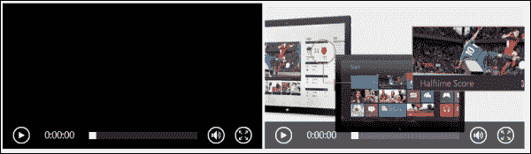
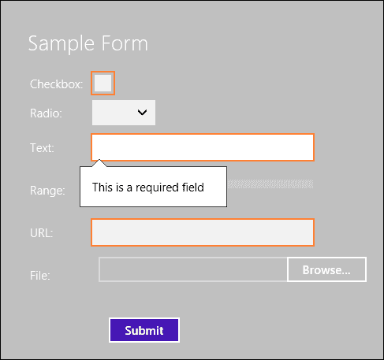

# 第一章： HTML5 结构

HTML5 引入了新的元素和属性，以更整洁的结构、更智能的表单和更丰富的媒体，这使得开发者的生活变得更加容易。HTML5 功能根据其功能分为几个组，新的结构元素属于语义组，包括结构元素、媒体元素、属性、表单类型、链接关系类型、国际化语义和附加语义的微数据。HTML5 有很多增加和增强的内容，所有这些都是为了更好地在网络上呈现内容。当你开发 Windows 8 应用时，你会使用其中许多功能；使用 Windows 8 开发的区别在于，至少在 Windows Store 应用层面，你不必担心浏览器的兼容性，因为 Windows 8 是一个使用最新网络标准的 HTML5 平台。你所使用的 HTML5 和 CSS3 的一切都为你代码中提供，并保证在应用程序中工作。最新版本的 Visual Studio（VS 2012）包括一个新 HTML 和 CSS 编辑器，提供对 HTML5 和 CSS3 元素和片段的全面支持。

在本章中，我们将涵盖以下主题：

+   语义元素

+   媒体元素

+   表单元素

+   自定义数据属性

# 理解语义元素

HTML5 标记语义比其前辈更强，这要归功于描述页面内容结构的新语义元素。语义元素的列表包括以下内容：

+   `<header>`标签定义了文档或节的头部。它在页面或节中包裹标题或一组标题，并且它还可以包含诸如徽标、横幅和主要导航链接等信息。在页面中你可以有多个`<header>`标签。

+   `<nav>`标签代表主要的导航链接。通常它绑定在头部。

+   `<section>`标签包裹可以按主题组合的相关内容。一个`<section>`标签可以包括一个`<header>`和`<footer>`标签。

+   `<footer>`标签代表关于页面或节的内容，例如，相关链接、隐私条款和版权信息。在页面中你可以有多个`<footer>`，它与`<header>`标签相同。

+   `<article>`标签代表可以独立于整个文档使用的独立内容，例如，一篇博客文章。`<article>`和`<section>`非常相似，因为两者都是独立的标签并包含相关内容；然而，如果它的内容可以通过原子或 RSS 提要进行联合（syndication），那么`<article>`元素更为合适。

+   `<aside>`标签代表与页面内容相关但分离的部分，因为它可以被移除而不会影响页面的主要内容。典型的用法是侧边栏。

+   `<address>`标签代表最近的`<article>`父元素的联系信息，如果存在的话，或者适用于整个文档的父`<body>`元素。

将这些新元素全部放在一个页面中会产生以下的标记：

```js
<!DOCTYPE html>
<html lang="en">
<head>
  <meta charset="UTF-8">
  <title>Developing for Windows 8</title>
</head>
<body>
  <header>
    <a href="default.html">
      <h1>The Courses</h1>
      
    </a>
    <nav>
      <ul>
        <li><a href="home.html">Home</a></li>
        <li><a href="about.html">About</a></li>
      </ul>
    </nav>
  </header>
  <section>
    <article>
      <h2></h2>
      <p></p>
      <address>
        Written by <a href="mailto:xyz@abc.com">Demo Author</a>.<br>
        Found at: Demo.com <br>
        Address, Street<br>
        UK
      </address>
    </article>
    <article>
      <h2></h2>
      <p>content</p>
    </article>
  </section>
  <aside>
    <h2></h2>
    <ul>
      <li></li>
      <li></li>
      <li></li>
    </ul>
    <p></p>
  </aside>
  <footer>
    <p></p>
    <p>Copyright &copy; 2013 Packt</p>
  </footer>
</body>
</html>
```

# 引入内置媒体元素

HTML5 引入了新的媒体元素，如`<audio>`和`<video>`，这些可以被认为是 HTML 早期版本中图像之后的媒体类型的新的革命。这两个元素使得在 HTML 页面/文档中嵌入媒体变得非常简单，并通过**HTML5 媒体元素 API**提供内置媒体支持。根据 W3C 最新的规范，我们可以这样定义`<video>`和`<audio>`：

+   `<video>`标签是一个媒体元素，用于播放视频或电影以及带字幕的音频文件。

+   `<audio>`标签是一个媒体元素，其媒体数据是音频，即声音或音频流。

`<audio>`和`<video>`元素分别播放音频和视频文件。它们之间的唯一区别是，`<audio>`元素没有用于视觉内容的播放区域，这与`<video>`元素相反。

在 HTML5 之前，我们需要一个插件来播放音频或视频文件，这需要编写大量的标记代码。没有 HTML5，嵌入媒体元素从未如此简单；只需放入一个`<audio>`标签，就可以得到带有播放控制的媒体播放器，仅需两行代码。它几乎与之前的``标签一样。参考以下代码：

```js
<audio src="img/audio.mp3" controls>
</audio>
```

上一个例子会在 Internet Explorer 9 (IE9)上看起来像以下的屏幕截图，并且可能因浏览器而异：


上面的代码展示了`<audio>`标签的最简单形式，但`<audio>`标签还有更多的属性和选项。参考以下代码：

```js
<audio controls autoplay loop>
  <p>Your browser does not support the audio element. Click <a href="content/Elsie.mp3"> here </a> to download the file instead.
  </p>
  <source src="img/audio.mp3" type="audio/mp3" />
  <source src="img/audio.ogg" type="audio/ogg" />
</audio>
```

首先，注意`<audio>`元素内的`<p>`标签中的内容。这部分内容是备用文本，只有在浏览器不支持`<audio>`标签时才会使用。它通过告知用户这个问题，为旧版网页浏览器提供一个优雅的回退方案，并且我们可以添加一个链接允许下载这个音频文件。这样，用户就不会只是站在那里想知道发生了什么。这是最简单的回退方式；你也可以用 JavaScript 达到同样的效果。

上面的代码片段还展示了一些`<audio>`元素的属性。根据 W3C 规范，`src`、`controls`、`autoplay`、`loop`、`preload`、`mediagroup`和`muted`是两个媒体元素（即`<audio>`和`<video>`）共同的属性。

+   `controls`属性在网页上显示音频的标准 HTML5 控件，控件的设计在不同浏览器代理之间可能会有所不同。

+   `autoplay`属性在 DOM 加载完成后自动播放音频文件。

+   `loop` 属性 enable 自动重复。

+   `mediagroup` 属性通过媒体控制器将多个媒体元素链接在一起。

+   `muted` 属性设置了音频文件默认静音状态。

+   `preload` 属性向用户代理提供了关于作者认为将导致最佳用户体验的提示。它的值可以是 `none`、`metadata` 或 `auto`。

    +   `none`：这个值提示浏览器，网页不期望用户需要媒体资源。

    +   `metadata`：这个值提示浏览器获取资源元数据（维度、轨道列表、持续时间等）。

    +   `auto`：这个值提示浏览器在没有任何风险的情况下优先考虑用户的需求。空值，如只是添加了 `preload` 属性，映射到 `auto` 值。

您可以像 `controls="controls"` 一样为属性指定值，这将具有相同的行为。但为了简化代码和减少代码量，您可以省略这个属性的值；同样的适用于 `loop`、`autoplay` 和 `muted`。您可以通过使用 `src` 属性或 `<source>` 元素来指定媒体资源。

### 注意

属性覆盖了元素。

媒体资源（音频或视频）有一个 MIME 类型，另外还有一个编解码器，如下代码所示：

```js
<source src="img/video.ogv" type="video/ogg; codecs="theora, vorbis" />
```

为 `type` 属性设置值必须在 `<source>` 元素内完成。如果浏览器/用户代理不支持其类型，将避免下载资源。您可以为不同的浏览器添加多种格式的音频/视频，以确保播放支持。浏览器代理将查看 `<source>` 元素；如果它无法渲染第一个类型，它将跳到下一个 `<source>` 以验证其类型，依此类推。为此，您必须检查不同浏览器中 `<audio>` 和 `<video>` 元素支持的 MIME 类型列表。浏览器不仅检查 MIME 类型，还检查指定的编解码器。所以，即使浏览器代理可以渲染资源类型，如果编解码器不受支持，视频/音频也不会加载。

以下表格列出了主要视频格式在主要浏览器中的支持情况：

| 格式 | IE9+ | Chrome | Firefox | Opera | Safari |
| --- | --- | --- | --- | --- | --- |
| WebM (VP8 编解码器) | 是 | 是 | 是 | 是 | 否 |
| MP4 (H.264 编解码器) | 是 | 是 | 否 | 否 | 是 |
| OGV (OGG THEORA 编解码器) | 否 | 是 | 是 | 是 | 否 |

从前面的表格列表中，我们可以得出结论，在您的 HTML5 视频中提供 WebM 和 MP4 格式的媒体资源将保证在所有主要浏览器的最新版本中加载。这个理论在 Visual Studio 2012 中得到了加强，它为 HTML5 标签提供了完整的 Intellisense 支持。当你插入以下 HTML5 `<video>` 元素的代码片段时，它在 `<video>` 标签内列出 3 个 `<source>` 元素：

```js
<video controls="controls">
  <source src="img/file.mp4" type="video/mp4" />
  <source src="img/file.webm" type="video/webm" />
  <source src="img/file.ogv" type="video/ogg" />
</video>
```

`<video>`元素还包括一个`poster`属性，用于指定在没有视频数据可用或直到用户点击播放按钮时在视觉内容区域显示的图像的路径。出于广告目的，你可以使用图像或视频中的帧，让用户了解视频的样子。如果你没有指定海报图像，并且`autoplay`属性没有设置，浏览器可能会显示一个填充`<video>`元素尺寸的黑色盒子。例如，以下代码显示了两个相似视频的代码示例之间的区别，第二个视频指定了海报：

```js
<video id="video" controls width="400">
  <source src="img/video.mp4" type="video/mp4" />
</video>
<video id="videoWithPoster" controls width="400" poster="http://msdn.microsoft.com/br211386.5_GetStarted_484x272px.jpg">
  <source src="img/video.mp4" type="video/mp4" />
</video>
```

这段标记输出的结果将在屏幕上产生以下内容：



你可能会注意到，在之前的示例中我们对两个视频指定了`width`值为`400`。`<video>`元素接受标准的 HTML`width`和`height`属性。如果没有设置`width`和`height`的值，视觉内容区域将扩展到视频的原生尺寸。建议在`<video>`元素上设置`width`和`height`属性，从而避免扩展到全尺寸，并且按照期望的观看尺寸对视频进行编码。

### 注意

`width`和`height`属性的值不接受单位。该值表示 CSS 像素，例如，`width=400`与`width=400px`相同。

有一些 JavaScript 方法、属性和 DOM 事件是 HTML5 标准的一部分，与这些新元素相关。你可以程序化地读取和设置属性，例如`src`路径和`<video>`标签的尺寸（`width`和`height`）。你可以使用 JavaScript 方法加载音频和视频，然后播放和暂停媒体资源。你还可以编写代码来处理媒体元素触发的不同 DOM 事件，例如`onplaying`、`onprogress`（加载进度）、`onplay`和`onpause`。例如，你可以通过移除`controls`属性并从单独的按钮调用播放和暂停媒体资源的函数来禁用元素显示的默认控件。

下面的代码列表显示了如何使用 JavaScript 播放和暂停视频。我们首先需要通过调用布尔属性`.paused`来检测视频文件当前的状态，如果为真，则相应地调用`play()`或`pause()`方法：

```js
var testVideo = document.getElementById('myVideo');
if (testVideo.paused)
  testVideo.play();
else
  testVideo.pause();
```

在之前的代码中，我们声明了一个变量`testVideo`，并将其赋值给 DOM 中的`myVideo`元素。假设该元素被分配了一个 ID，你可以使用名称、标签名或元素在 DOM 层次结构中的位置来检索元素。

## 高级媒体与 JavaScript

媒体元素拥有丰富的 API，可以纯 JavaScript 进行访问。利用 JavaScript，我们可以向媒体元素添加许多功能。您可以操纵媒体资源，给它样式，旋转视频，同步播放两个或更多的媒体元素，在媒体资源加载时显示进度条，动态调整视频大小等等。

以下代码示例为 `timeupdate` 事件添加了功能，该事件获取视频的当前播放时间（以秒为单位）并在一个单独的 div 中显示它。

以下是的 HTML 代码：

```js
<div id="tInfo"></div>
<video id="myVideo" autoplay controls>
  <source src="img/w8.mp4" type="video/mp4" />
</video>
```

以下的 JavaScript 代码：

```js
var video = document.getElementsById('myVideo');
var tInfo = document.getElementById('tInfo');
video.addEventListener('timeupdate',function(event){
tInfo.innerHTML = parseInt(video.currentTime);
}, false);
```

使用 JavaScript `addEventListener` 方法提供 `timeupdate` 事件的处理程序。它接受三个参数，具有以下基本语法：

```js
WinJS.Application.addEventListener(type, listener, capture);
```

`type` 参数指定了要注册的事件类型，而 `listener` 是与事件关联的事件处理函数，第三个参数 `capture` 是一个布尔值，用于指定事件处理程序是否注册在捕获阶段。

此外，您可以将 `<video>` 元素与画布结合使用，允许您实时操作视频数据并添加各种视觉特效。

# 介绍功能丰富的表单元素

表单和 `<form>` 元素是任何应用程序或网站的重要组成部分，从登录表单到完整的联系或注册表单。在 HTML4 中，`<form>` 元素非常简单，对于任何功能或高级样式，JavaScript 都是必需的。而对于任何交互，或者数据提交和验证，都要求服务器和客户端脚本，如果浏览器中禁用了脚本，其功能就会受到限制。HTML5 通过新的属性和输入类型对 `<form>` 元素进行了重大改进，并添加了诸如基于浏览器的验证和 CSS 样式等功能，为填写表单的用户提供了更好的体验，并为创建表单的开发人员提供了所有可能的简单性。

## 一个丰富的 `<input>` 标签

`<input>` 元素引入了 `type` 属性的新值。

HTML5 在 HTML4 我们已经熟悉的 `<input>` 类型中增加了 13 个新类型，如 `text` 和 `checkbox`。添加这些类型后，`<input>` 控制现在支持如 `range`、`date`、`number`、`telephone`、`email` 和 `URL` 等类型。而这些新的 `<input>` 类型为元素本身添加了智能行为。

以下是这些类型的表格列表：

| ```<input>``` 类型 | 描述 |
| --- | --- |
| ```---``` | ```---``` |
| ```tel``` | 它期望一个电话号码。 |
| ```search``` | 它提示用户输入他们想要搜索的文本，并在支持它的浏览器上向输入元素添加一个搜索图标。 |
| ```url``` | 它期望一个 URL。 |
| ```email``` | 它期望一个电子邮件地址或由逗号分隔的电子邮件地址列表。 |
| ```datetime``` | 它期望一个带有 UTC 时区的日期和时间。 |
| ```date``` | 它期望一个日期。 |
| ` | month | ` 它期望一个带有年份和月份的日期，但没有时区。 |
| ` | week | ` 它期望由周年号和周号组成的日期。 |
| ` | time | ` 它期望时间值，如小时、分钟、秒和分数秒。 |
| ` | datetime-local | ` 它期望日期和时间没有时区。 |
| ` | number | ` 它期望数字输入。 |
| ` | range | ` 它期望数字输入，并显示一个滑块。 |
| ` | color | ` 它期望颜色值，并显示颜色调色板以供选择。 |

除了向`<input>`类型添加新特性外，还增加了对新现有特性的支持，例如文件输入元素，现在支持使用`multiple`属性进行多文件选择。当表单提交时，**浏览**按钮将显示文件对话框，然后你可以从本地磁盘或`SkyDrive`中选择文件；文件可以作为表单数据的一部分发送到服务器。

您还可以利用表示任务进度的`progress`元素，如 W3C 所指定。它可以用来显示大文件正在上传或媒体资源正在加载的进度。任务的进度由此元素的两个属性决定：

+   `value`属性，表示进度已完成多少

+   `max`属性，表示直到任务完成所需的总工作量

以下代码使用`progress`元素和一个按钮，脚本将其参数中的值添加到其现有值中。当你加载示例并尝试它时，你将看到进度条 visually updating the completion progress。

以下是的 HTML 代码：

```js
<button id="clickBtn" onclick="updateProgress(10)">Update Progress</button>Progress: <progress id="prog" max="100"></progress>
```

以下是的 JavaScript 代码：

```js
<script>
//get the progress element and add the value to it with every click var progressBar = document.getElementById('prog');
function updateProgress(newValue){ 
progressBar.value = progressBar.value + newValue;
}
</script>
```

## 简单的验证

HTML5 的新`<input>`类型以及验证属性，如`required`和`pattern`，还有伪 CSS3 选择器允许基于浏览器的验证，这样你可以在不编写一行代码或脚本的情况下捕获表单的输入错误。这在过去是不可能的，需要自定义 JavaScript 代码或 JavaScript 库。基本上，它提供了无 JavaScript 的客户端表单验证。

我们将从最简单的验证开始，即填写一个必填字段。为了实现这一点，我们需要向`<input>`元素添加`required`属性。

`required`属性可以设置在类型为`text`、`URL`、`email`、`checkbox`或`radio`的`<input>`元素上，以及`select`和`textarea`元素上。它是一个布尔属性，只能设置在元素上。

我们通过简单地向`<input>`元素添加`required`属性来指定字段的值为必填。在下面的代码列表中，你会发现带有`required`属性的几个`<input>`元素：

```js
<form action="/" method="post">
  <label>Checkbox:</label>
    <input type="checkbox" required />
  <label>Radio:</label>
    <select>
      …
    </select>
  <label>Text:</label>
    <input type="search" required />
  <label>Range:</label>
    <input type="range" min="5" max="10" step="5" />
  <label>URL:</label>
    <input type="url"  required />
  <label>File:</label>
    <input type="file" accept=".mp3" />
    <input type="submit" name="submit" value=" Submit " />
</form>
```

一旦添加了`required`属性，然后当你点击**提交**按钮时，表单中的所有字段都将进行验证；如果任何字段不正确，将返回错误。必填字段会被突出显示，而且，默认消息会通知用户这些字段在表单中是必须的。

你可以看到下面的截图显示了前面代码的输出：



我们可以使用 CSS3 伪选择器`required`应用一个或多个样式（关于这方面的更多信息将在下一章中介绍）。例如，下面的样式添加了一个 CSS3 伪类`required`，它将寻找文档中具有`required`属性的所有`input`元素，并用`yellow` `border-color`来设置样式。

```js
input:required {
  border-color: Yellow;
}
```

如果你想对表单中所有非必填元素应用一种样式，那是非常简单的；只需添加`optional`伪类，并像我们对`required`类所做的那样给它一个样式。在下面的代码中，我们给所有没有`required`属性的`input`元素应用了`LightGray` `border-color`。

```js
input:optional {
  border-color: LightGray; 
}
```

HTML5 表单不仅对必填字段进行验证，而且还检查字段值的内容，并自动验证，就像在 URL 和`email`输入类型中一样，或者使用`pattern`属性。`pattern`属性使用正则表达式来定义元素值必须匹配的有效格式，例如，电话号码或社会保障号码。

下面的例子展示了`password`字段的语法，该字段是必填的，并且必须有有效的输入，最小长度为八个字符。在这里，默认的验证消息被`title`属性中提供的文本替换：

```js
<input type="password" required pattern="[^\s]{8}[^\s]*" title="Passwords must be at least 8 characters long."/>
```

还有更多属性可以增加验证技术，比如`placeholder`，它提供了一个在用户开始在元素内输入文字前以浅色文字显示的提示信息；这个提示可能是关于用户应该在字段中输入的值。例如，你可以在`email`字段中添加一个示例电子邮件地址，如：

```js
<input type="email" placeholder="email@example.com" />
```

你可以使用`maxlength`属性检查`text`或`textarea`输入中允许的最大字符数。此外，我们还有`min`、`max`和`step`属性与`range`元素一起使用，以验证该元素输入的值。`min`和`max`属性检查可以输入的最小和最大值，而`step`属性检查允许的值。

你还可以通过`accept`属性指定可接受的文件 MIME 类型。正如你在前面的代码列表中可能注意到的，`accept`属性被添加到了`<input type="file" />`元素中，这是唯一与之使用的元素。一旦你把这个属性添加到文件控件中，然后当你尝试使用 Windows 8 文件资源管理器浏览文件时，只有`accept`列表中的类型才会显示。

HTML5 表单验证是默认行为；不需要编写代码来激活它，但您可以通过在**提交**按钮或任何`<input>`元素上添加`formnovalidate`属性来关闭它。这个属性允许表单在没有经过验证的情况下提交。

# 分配自定义数据属性

随着 HTML5 的出现，我们现在有能力为任何 HTML5 元素分配自定义数据属性。W3C 将其定义为：

> **用于存储页面或应用程序私有自定义数据的属性，如果没有更合适的属性或元素，则可以使用该属性。**

这些新的自定义数据属性由两部分组成：

+   **属性名称**：它必须以`data-`前缀开头，后跟至少一个字符，且不应包含大写字母。

+   **属性值**：它必须是一个字符串值

让我们像下面的代码示例那样给`<div>`标签添加一个自定义属性：

```js
<div id="bookList" data-category="TechnicalBooks">
Developing for windows 8
</div>
```

你可以看到自定义属性名`data-category`和属性值`TechnicalBooks`被分配给`<div>`元素。这些数据可以通过使用原生的`getAttribute`和`setAttribute`方法来检索和更新，因为自定义数据属性被认为是它们所使用的页面的组成部分。下面的代码示例展示了如何使用原生的 JavaScript 来操作自定义属性：

```js
function getSetCategory() {
  var bookList = document.getElementById("bookList");
//get the value of the attribute
  var bookCategory = bookList.getAttribute('data-category');
//set the value for the attribute
  bookList.setAttribute('data-category', 'HealthBooks');
//remove the attribute
  bookList.removeAttribute('data-category');
}
```

HTML5 规范明确指出，数据属性不应用来替代已存在的属性或可能更具有语义 appropriate 的元素。例如，在`span`元素中添加一个 data-time 属性来指定时间值是不恰当的，如下面的代码所示：

```js
<span data-time="08:00">8am<span>
```

最合适且更具语义的元素是一个`time`元素，如下面的代码所示：

```js
<time datetime="08:00">8am</time>
```

当开发 Windows 8 应用时，我们可以使用 Windows 为 JavaScript 提供的库（`WinJS`）来实现将数据与 HTML 元素更高级的绑定。Win8 JavaScript 库利用 HTML 的`data-*`属性提供了一种简单的方式来程序化实现数据绑定。

# 概要

在 HTML5 中，有新的语义丰富的元素，可以传达它们使用的目的。有媒体元素允许您轻松地向应用程序添加音频和视频，还有新的输入类型和属性，您可以使用它们创建智能和交互式的表单，并实时地将它们与数据绑定，所有这些都比以往任何时候的标记和代码都要少。

在下一章中，我们将查看在为 Windows 8 开发时可用的丰富的新 CSS3 特性，以及我们如何使用它们来为我们的 HTML 应用样式和布局。
