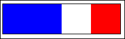
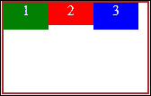
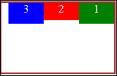
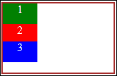
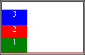

# 第二章．使用 CSS3 进行样式设计

HTML 定义了文档/页面结构并列出了包含的元素。但定义这些元素的布局、定位和样式是 CSS 的唯一责任。**层叠样式表（CSS）**，正如其名，基本上是一张包含一系列样式规则的表。每个 CSS 样式规则将一个**选择器**，它定义将要样式的内容，链接到一个声明块，其中包含一个或一组样式，进而定义要应用于相关选择器的效果(s)。基本样式规则的语法看起来像这样

```js
selector { property: value; property: value; }
```

在本章中，我们将回顾以下主题：CSS3 选择器、网格和 Flexbox、动画和转换，以及媒体查询。这些主题涵盖了在用 JavaScript 开发 Windows Store 应用时经常使用的 CSS3 的一些特性。

# CSS3 选择器的威力

CSS 选择器非常强大，在格式化 HTML 文档时非常方便。使用选择器有时会有些棘手，因为精确地选择你想要的内容，并确保应用的样式规则只影响你意图中的元素，是一项繁琐的任务。但是，当使用正确的选择器正确地完成时，结果是非常有价值的。掌握选择器的使用将导致更简单的 CSS，最小化冗余样式和通过类和 ID 对 HTML 进行过度定义的可能性，从而确保更好的性能。选择器可以是一个 HTML 元素、一个类、一个元素 ID，甚至可以是元素在 DOM 中的位置。

以下是一份 CSS 选择器的列表；我们将从基础的选择器开始，进而介绍 CSS3 中新增的选择器：

+   **星号(*)符号**：这是一个`万能`选择器，被称为通用类型选择器，用于定位文档中的每一个元素。它经常与 CSS 重置一起使用，以重置所有默认样式。

    ```js
    * { margin: 0; }
    ```

+   **HTML 元素**：它被称为类型选择器，用于根据它们的类型选择文档中的所有元素。例如，下面的选择器将定位 DOM 中的每一个`<p>`元素，把文本颜色改为红色，并加下划线。

    ```js
    p { color: red; text-decoration: underline; }
    ```

    ### 提示

    使用`<body>`元素作为选择器将定位文档的正文，从而选择每一个元素，就像你正在使用星号(*)一样。

+   **ID 选择器**：它由元素 id 属性中的值前缀哈希符号（`#`）指定。ID 应该是元素的名称，更重要的是，它必须是唯一的。名称应该是对元素的清晰引用。例如，对于一个`nav`元素来说，有一个`id`值为`mainMenu`会很清晰。例如：

    ```js
    <nav id="mainMenu"></nav>

    ```

    另外，唯一性意味着在页面上不应该有其他具有`id`值为`mainMenu`的元素。由于`id`应该始终是唯一的，选择器将在 HTML 文档中只针对一个元素。例如，如果你有如下的`<div>`元素，其`id`值为`logo`：

    ```js
    <div id="logo"></div>
    ```

    则相应的选择器将是：

    ```js
    #logo { float: left; width: 200px; } 
    ```

+   **类选择器**：它由一个类名前缀和一个点号（`.`）组成，目标是指具有匹配类名的所有元素。这个选择器的基本语法如下：

    ```js
    .highlighted { font-weight: bold; background-color:yellow; }
    ```

具有这个类名的任何元素都将拥有粗体文本和黄色背景颜色。当您想要为多个元素设置样式时，应该使用类，特别是有一组共通之处的元素。记住，与`id`属性相反，类名永远不能用来唯一标识一个元素。此外，`class`属性可能有多个值；同样，相同的类也可能适用于多个元素。尽管类选择器的使用可能看起来很通用，但您可以通过在前缀类型选择器来更具体地使用它。例如，下面的代码片段将只针对具有`highlighted`类的`<div>`元素：

```js
div.highlighted { font-weight: bold; background-color: yellow; } 
```

另外，您可以连锁类选择器来针对具有所有指定类名的所有元素。

## 属性选择器

属性选择器用于根据元素的属性来选择元素。它首先检查属性是否存在；如果存在，它再检查属性的值。属性应该被包含在方括号内。如果方括号内只包含属性名，它将检查该属性是否存在于元素中。这就是它也被称为存在选择器的原因。在下面的代码片段中，选择器将只针对具有`title`属性的锚元素：

```js
a[title] { text-decoration: none; color: #000; }
```

前面的语法在检查没有值的属性时很有帮助。如果你记得，在前一章节我们提到了一些属性不需要值，比如`<input>`元素的`required`属性，或者音频和视频元素的`loop`属性。下面的选择器将寻找所有具有`loop`属性的音频元素并隐藏它：

```js
audio[loop] { display: none; }
```

为了精确匹配指定的属性值，我们将使用带有等号（`=`）的等价属性，并将值用引号括起来。所以，如果我们想要针对所有`type`属性值为`email`的输入元素，语法将如下所示：

```js
input[type="email"] { text-decoration: none; color: #000; }
```

另外，在属性选择器类别下，我们有前缀选择器或“以...开始”的属性选择器，用于检查属性是否以某个值开始。以下语法将匹配所有`id`值以`home`开始的图片。例如，如果你想定位首页上的所有图片，可以将`home`添加到`id`中，从而有`homeLogo`、`homeBanner`等，并为其应用 10 像素的边距：

```js
img[id^='home'] { margin:10px; }
```

同样，我们有后缀选择器或“以...结尾”的属性选择器，它将选择所有属性值以你所指定的值结尾的元素。后缀选择器在等号（`=`）之前用美元（`$`）符号标记，语法如下：

```js
a[href$=".jpg"] { color: red; }
```

这将匹配所有`href`属性值以`.jpg`结尾的锚点元素：

另一个属性选择器是**子字符串**选择器，也称为“包含”选择器。正如其名，它匹配包含选择器中指定的值的属性值。它用星号（`*`）符号在等号（`=`）之前标记，语法如下：

```js
ul[id*="Nav"] { float: left; list-style-type: none; }
```

前面的语法将匹配所有含有`Nav`字符串的`<ul>`元素 ID。例如，你有多个用于导航目的的`<ul>`元素，并标记有诸如`secondaryNav`、`sidebarNav`等 ID：

我们也有一种**连字符**选择器，用`|=`标记，它用于匹配后面紧跟连字符的完全相等的属性值。你可能很少使用这个选择器，但它的典型用途是用于包含连字符的值，例如`lang`属性。下面的列表将目标定位在与"en"完全匹配，且后面紧跟连字符的元素上，并将返回`en`、`en-us`、`en-uk`等：

```js
ul[lang|="en"] { display: none; }
```

最后一个属性选择器将是**空白符**选择器，它针对的是在空格分隔的值列表中完全匹配指定属性值的元素。在以下代码片段中，我们有一个带有自定义`data-`属性的`<p>`元素，包含三个空格分隔的值，分别为`new events local`，选择器将匹配这个元素，因为它的`data-post-type`值与`events`完全匹配。

以下为 HTML 代码：

```js
<p data-post-type="new events local"></p>
```

CSS 代码如下：

```js
p[data-post-type~="events"] { float: left; color: red }
```

### 注意

注意，在 HTML5 中，任何以`data-`开头的属性都是有效的，与其前身只认为识别的属性有效的规定不同。

## 组合选择器

一个 CSS 选择器可以包含多个选择器，即简单选择器的组合。组合选择器包含多个简单选择器，由一个组合符连接。组合符是一个表示选择器之间关系的符号。CSS2 中已经有三个不同的组合符，CSS3 增加了一个额外的。以下列出四个选择器，所使用的组合符以及每个选择器匹配的内容：

| 选择器 | 组合符 | 目标 |
| --- | --- | --- |
| 后代 | 空格字符 | 匹配那些是指定元素后代的元素。 |
| 直接后代（子选择器） | > | 匹配那些是指定元素直接后代的元素。 |
| 相邻兄弟 | + | 匹配那些是指定元素相邻兄弟（紧随其后的）的元素。 |
| 一般兄弟 | ~ | 匹配那些是指定元素相邻兄弟的元素。 |

以下选择器描述如下：

+   **后代选择器**：由空格字符作为组合符，它将选择所有指定元素的后代元素。仿佛我们在第一个简单选择器上应用了一个额外的过滤器。第一个选择器代表父元素，第二个是要匹配的子（后代）元素。例如，以下代码片段会匹配所有`<li>`元素作为其父元素的锚点元素：

    HTML 代码如下：

    ```js
    <ul>
        <li><a href="#">Item 1</a></li>
        <li><a href="#">Item 2</a></li>
        <li><a href="#">Item 3</a></li>
    </ul>
    ```

    CSS 选择器如下：

    ```js
    li a { text-decoration: none; color: #000; } 
    ```

+   **直接后代选择器**：由大于号（`>`）作为组合符标记，基本形式为 E>F，匹配 E 元素的每个直接后代（子）F 元素。在以下代码片段中，只有`<div>`元素的直接子`<p>`元素会被染成蓝色，其余的则不会。

    HTML 代码如下：

    ```js
    <div>
        <p>some content inside a div</p>
    </div>
    <p> standalone content …</p>
    <div>
        <p> contentinside a div </p>
    </div>
    <header>
        <p> content inside a header </p>
    </header>
    ```

    CSS 代码如下：

    ```js
    div > p { color: Blue; } 
    ```

+   **相邻兄弟选择器**：由加号（`+`）作为组合符标记，匹配所有紧随父元素之后的兄弟元素。所以，兄弟元素之间不能有其他元素。如果这有点复杂，下面的例子会解释清楚。选择器只会把一个`<p>`元素染成红色。

    HTML 代码如下：

    ```js
    <h1>Heading</h1>
    <p>This p element is a sibling and adjacent to the h1 
    </p>
    <p>This p element is a sibling but not adjacent to the h1
    </p>
    ```

    CSS 代码如下：

    ```js
    h1 + p { color: Red; } 
    ```

+   **一般兄弟选择器**：由波浪号（`~`）作为组合符标记，是 CSS3 的新增功能。它用于选择所有给定元素的兄弟元素。所以，如果我们把选择器应用到前面的例子中的 HTML 代码上，两个`<p>`元素都会匹配并染成红色，因为它们都是`h1`的兄弟元素。

    ```js
    h1 ~ p { color: Red; } 
    ```

## 伪类选择器

伪类类似于类，但由于它是内置的，您不需要在 HTML 代码中显式添加它。此外，它在语法上也有所不同；类选择器前面有一个点（`.`），而伪类选择器前面有一个冒号（`:`）。在其基本形式中，伪类选择器将采用以下形式：

```js
selector:pseudo-class { property: value }
```

您可以指定没有选择器的伪类，它将调用默认类型选择器。所以，如果我们单独指定`:hover`，它将匹配所有元素，并将样式规则应用于文档中可以悬停的任何内容。否则，您可以更详细地将对特定 HTML 元素的伪类选择器。例如，以下代码片段将在悬停时为所有`<p>`元素应用粉红色：

```js
p:hover { color: pink; }
```

在 CSS3 之前，伪类就已经存在，您可能对著名的`:hover`、`:visited`和`:active`伪类很熟悉，这些伪类代表锚元素的不同的状态。CSS3 引入了许多更强大的伪类，如`:required`、`:valid`、`:nth-child(n)`、`:first-child`、`:last-child`、`:only-child`、`:first-of-type`、`:last-of-type`等。

## 伪元素选择器

伪元素代表元素的某些部分，如段落的第一行，或元素后面的部分。伪元素类似于一个伪类，它作为类的行为，但是内置的，不需要在 HTML 代码中定义。伪元素通过双冒号（`::`）来区分，这个语法是在 CSS3 中引入的。需要注意的是，在 CSS3 之前引入的所有伪元素都使用单个冒号（`:`），类似于伪类的语法。

以下代码片段将选择由`content`样式属性定义的`<p>`元素后的所有生成内容：

HTML 代码如下：

```js
<p>Paragraph content goes here</p>
```

CSS 代码如下：

```js
p::after {
  content: " 'I come after a paragraph' ";
  color: blue; background-color: yellow;
}
```

输出结果将是：

**段落内容放在这里 '我在段落后'**

下面是伪元素的表格：

| `::first-letter` | 匹配元素中的第一个字母。 |
| --- | --- |
| `::first-line` | 选择元素中的第一行。 |
| `::before` | 选择元素生成的内容之前。 |
| `::after` | 选择元素生成的内容之后。 |
| `::selection` | 选择用户可能已经高亮显示的任何内容，包括可编辑文本字段中的文本，如输入类型为文本的元素，或具有`contenteditable`属性的任何元素。 |

### 提示

虽然您可以通过使用 JavaScript 向您的 HTML 代码中添加类来以编程方式实现相同的行为，但通过向您的选择器中添加伪类和伪元素更为简单；此外，它还可以使您的代码更清晰。

# 使用 Grid 和 Flexbox 创建流体布局

当涉及到实施由 Microsoft 设定的构建吸引人、直观且互动的 Windows 8 应用的设计原则时，布局非常重要。通常，使用 HTML 结构元素（如`<div>`和`<table>`）和定位样式规则定义页面布局。

但是现在，使用 CSS3 高级布局功能（即**网格**布局和**Flexbox**（**灵活盒**）布局）有一种更灵活的方法来实现。这些布局系统允许您轻松实现适应性和流体布局。

## 网格布局

它为 Windows 8 应用提供了一种非常简单的方法来创建流体和适应性布局。由于网格可以自动扩展以填充所有可用空间，因此它非常适合实现全屏 UI。网格布局允许您使用 CSS 完全对齐和定位其子元素作为列和行，与它们在 HTML 代码中的顺序无关。与使用浮动或脚本的方法相比，它使布局更加流体。

下面的例子演示了我们传统上如何使用浮动来定位元素：

以下是 HTML 代码：

```js
<div class="container">
  <div class="leftDiv"></div>
  <div class="rightDiv"></div>
</div>
```

以下是 CSS 代码：

```js
.container { width: 200px; height:50px; border: 1px solid black; }
.leftDiv { float:left; width: 100px; height:50px;background-color:blue}
.rightDiv { float:right; width: 50px; height:50px;background-color:red}
```

前面的代码将导致以下多色盒子。容器有一个黑色边框围绕着里面的两个 div，左边的蓝色 div 和右边的红色 div，之间的空白是剩余未占用的空间：



网格布局通过将元素的`display`样式规则属性设置为`-ms-grid`来指定，或者您可以为内联级别网格元素使用`-ms-inline-grid`属性。您可能注意到了`-ms`这个厂商前缀（Microsoft-specific），这是因为这个 CSS 特性的状态仍然是一个工作草案；添加这个厂商前缀允许它在 Internet Explorer 10 和 Windows 8 中使用 JavaScript 构建的 Windows 商店应用中工作。以下是示例：

```js
.divGrid {
  display: -ms-grid;
  -ms-grid-columns: 120px 1fr;
  -ms-grid-rows: 120px 1fr;
}
.column1row1 {
  -ms-grid-column: 1;
  -ms-grid-row: 1;
}
.column2row1 {
  -ms-grid-column: 2;
  -ms-grid-row: 1;
}
```

`display: -ms-grid;`属性创建了一个网格；之后，我们定义了列和行，并使用以下属性指定它们的大小：`-ms-grid-column`和`-ms-grid-row`。`-ms-grid-columns`属性指定了每列的宽度，而`-ms-grid-rows`指定了每行的 height, 在那个网格中。这两个属性中的宽度和高度值分别由一个空格字符分隔。在前面的例子中，`-ms-grid-columns: 120px 1fr;`属性创建了两个列；第一个宽度为 120 px，第二个宽度值为 1 fr，即一个分数单位，这意味着第二列的宽度将自动填充所有剩余的可用空间。行也适用同样的概念。在前面的代码片段中剩下的两个类将使用`-ms-grid-column`和`-ms-grid-row`属性将具有这些类的元素定位到网格的列和行中。

### 注意

**分数单位（fr）** 表示可用空间应该如何根据它们的分数值在列或行之间进行划分。例如，如果我们有一个四列布局，如下所示：`-ms-grid-columns: 100px 100px 1fr 2fr;`，第 3 列占据一个分数，第 4 列占据两个分数的剩余空间。因此，剩余空间现在为 3 个分数；第 3 列被设置为 1 个分数除以总数（3），所以第 3 列和第 4 列（2 个分数）将分配剩余空间的三分之二。

在前面的示例中，我们使用了 px 和 fr 单位来指定列和行的尺寸。此外，我们还可以使用标准长度单位（如 px 或 em），或者元素的宽度和高度的百分比。还可以使用以下关键字：

+   `auto`: 这个关键字使得列或行的尺寸伸展以适应内部内容。

+   `min-content`: 这个关键字将列或行的尺寸设置为任何子元素的最小尺寸。

+   `max-content`: 这个关键字将列或行的尺寸设置为任何子元素的最大尺寸。

+   `minmax(a,b)`: 这个关键字将列或行的尺寸设置为 a 和 b 之间的值，尽可能利用可用空间。

以下表格列出了与网格布局相关的属性：

| **-ms-grid-column** | 用于指定元素在网格中的列。编号系统是基于**1 的索引**类型。 |
| --- | --- |
| **-ms-grid-columns** | 用于指定每个网格列的宽度值。 |
| **-ms-grid-column-span** | 用于指定元素在网格中占据的列数。 |
| **-ms-grid-column-align** | 用于设置元素在列内的水平对齐值。 |
| **-ms-grid-row** | 用于指定元素在网格中的行。编号系统是基于 1 的索引类型。 |
| **-ms-grid-rows** | 用于指定每个网格行的宽度值。 |
| **-ms-grid-row-span** | 用于指定元素在网格中占据的行数。 |
| **-ms-grid-row-align** | 用于设置元素在行内的垂直对齐值。 |

此外，网格布局暴露出一组丰富的属性，使您能够轻松地适应用户界面的视图状态和应用程序的方向变化。我们将在设计应用程序时讨论这一点。

## 弹性盒布局（Flexbox layout）

我们拥有的第二种布局模型是 Flexbox 模式，这是 CSS3 中的又一次近期添加。与 Grid 布局类似，Flexbox 布局通过设置`display`属性启用，并且由于它仍是一个**万维网联盟（W3C）**工作草案，因此还需要一个微软特定的供应商前缀。Flexbox 布局用于使元素的相对位置和大体保持不变，即使屏幕和浏览器窗口的大小发生变化。与浮动相比，Flexbox 为元素的位置和大小提供了更好的控制。使用 Flexbox 布局的优势在于，它使元素在其内部具有相对定位和尺寸，因为它考虑了可用空间。这允许您创建一个流体布局，维持元素之间的相对位置和大小；因此，当浏览器或应用程序窗口的大小发生变化时，Flexbox 容器内的元素可以重新调整大小和位置。Flexbox 布局非常适合构建显示任何数字印刷媒体的应用程序，例如报纸或杂志。

与 Grid 布局一样，通过将`display`属性设置为`-ms-flexbox`，很容易创建一个带有 Flexbox 布局的容器。创建 Flexbox 容器后，我们可以开始使用以下属性操纵它内部的元素：

+   `-ms-flex-direction`：它使用以下关键字值指定子元素的取向：`row`（初始值）、`column`、`row-reverse`和`column-reverse`。我们将逐一介绍每个值，并展示它应用的效果，在下面的示例中。那么，更好的解释方法是什么呢？所以，假设我们有以下的 HTML 和 CSS 代码片段：

    ```js
    <div class="flexit">
      <div>1</div>
      <div>2</div>
      <div>3</div>
    </div>

    .flexit {
      width:160px;
      height:100px;
      border:2px solid brown;
      display:-ms-flexbox;
      -ms-flex-direction: row;
    }
    .flexit div {
      background-color:red;
      width:50px;
      height:25px;
      text-align:center;
      color:white;
    }
    .flexit div:first-child {
      background-color:green;
      height:30px;
    }
    .flexit div:last-child {
      background-color:blue;
      height:30px;
    }
    ```

    前面的语法创建了一个带有`flexit`类的 Flexbox 容器，该容器以 Flexbox 布局包裹了标记有文本 1、2 和 3 的子`<div>`元素以进行跟踪。我们对一些子元素应用了一些样式和背景颜色。

    因此，在`-ms-flex-direction`属性中的以下值将给我们以下表格中的结果。注意元素的出现顺序和定位如何在不添加任何标记的情况下发生变化：

    | 属性 | Flexbox 容器 | 元素的出现顺序和定位 |
    | --- | --- | --- |
    | 行 |  | 子元素从左至右定位，与 HTML 标记中的出现顺序相同。 |
    | 行反转 |  | 子元素从右至左定位，与 HTML 标记中的出现顺序相反。 |
    | 列 |  | 子元素从上至下定位，与从左至右的 HTML 标记中的出现顺序相同。 |
    | column-reverse |  | 子元素从底部向上定位，按照 HTML 标记出现的顺序。 |

+   `-ms-flex-align`：此属性指定了 Flexbox 容器中子元素的对齐方式。它接受以下关键字值：`start`、`end`、`center`、`stretch` 和 `baseline`。对齐总是垂直于在 `-ms-flex-direction` 属性中定义的布局轴；因此，如果方向是水平的话，它将对齐设置为垂直，反之亦然。例如，如果方向是 `row`（水平），则值 `start` 将设置对齐为顶部（垂直）。

+   `-ms-flex-pack`：此属性指定了如何将 Flexbox 容器中子元素之间的可用空间分配给定义在 `-ms-flex-direction` 属性中的轴线，与前面描述的对齐属性不同。它接受以下关键字值：`start`、`end`、`center` 和 `justify`。

+   `-ms-flex-wrap`：此属性允许子元素溢出并在下一行或列中换行，并指定该流动的方向。它接受以下关键字值：`none`、`wrap` 和 `wrap-reverse`。

# CSS 驱动的动画

**CSS 转换** 允许你以前只能通过脚本实现的方式来操作 HTML 元素。它使元素的旋转、平移、缩放和倾斜成为可能，并允许在 2D 和 3D 中转换元素。CSS 动画使你能够在一段时间内平滑地改变样式属性，与基于 JavaScript 的动画相比，使你能够设计出复杂动画且具有更好的渲染性能。将两者结合使用，你可以在应用上施展魔法。

## CSS3 动画

CSS3 革命化了网页开发中的动画效果。在此之前，制作动画需要使用动画图片、Flash 这类插件，或者进行一些复杂的脚本编程。尽管 jQuery 和其他支持库让开发者用 JavaScript 制作动画变得稍微容易一些，但它在性能上仍然无法与 CSS 动画相匹敌。基本来说，动画定义了一个效果，允许元素在一段时间内改变一种或多种样式，如颜色、大小、位置、透明度等。此外，借助 CSS3 动画，你可以在动画过程中允许多种中间样式的变化，而不仅仅是动画开始和结束时指定的那些。

为了创建一个动画，你需要使用 `@keyframe` CSS 规则，该规则用于指定动画过程中将发生变化的样式。以下代码片段创建了一个名为 `demo` 的 `@keyframe` 规则，将背景颜色从红色变为黄色，在中间 50% 的地方，将透明度变为零：

```js
@keyframes demo {
  from { background: red;    }
  50% { opacity: 0;         }
  to { background: yellow; }
}
```

之后，我们将在`@keyframe`规则中定义的动画绑定到我们想要应用效果的元素（或选择器）上。如果动画不绑定到任何元素，它将不会在任何地方应用。在将动画绑定到选择器时，我们需要指定至少两个动画属性：

+   名称

+   持续时间

例如：

```js
#logo { animation: demo 4s }
```

前面的示例将我们使用`@keyframe`规则创建的名为`demo`的动画，持续时间为 4 秒，绑定到 ID 为`#logo`的元素上。

动画一旦在 DOM 中定义，就会自动触发。你可以指定一定的延迟时间来避免这种情况，或者可以通过代码来触发动画。动画有以下六个主要属性，如下所示：

```js
div {
  animation-name: demo;
  animation-duration: 3s;
  animation-timing-function: ease-in;
  animation-delay: 3s;
  animation-iteration-count: 2;
  animation-direction: normal;
}
```

或者我们可以使用动画简写属性，通过这个属性，我们可以将这些属性组合到一行中：

```js
div { animation: demo 3s ease-in 3s 2 normal; }
```

由于浏览器支持问题，开发者仍然对使用 CSS3 动画或其他 HTML5 特性持谨慎态度。为了解决浏览器兼容性问题，一些样式规则必须定义带有厂商前缀的版本。例如，一个动画定义将被复制以支持其他浏览器，每个浏览器都有它自己的厂商前缀，如下所示：

```js
-webkit-animation: 5s linear 2s infinite alternate;
-moz-animation: 5s linear 2s infinite alternate;
-o-animation: 5s linear 2s infinite alternate;
animation: 5s linear 2s infinite alternate;

```

但是在为 Windows 8 开发时，你可以将其减少到只有一个，这就是标准。担心多浏览器支持是最不需要担心的问题，因为 Windows 8 支持所有对 Internet Explorer 10 有效的标准。

## CSS3 转换

CSS3 的另一个优点是 2D 和 3D 转换的概念，它使你能够以使用 CSS 无法实现的方式操纵应用中的元素。它使你能够在 2D 和全新的 3D 空间中对 HTML 元素进行旋转、缩放、倾斜和翻译，而无需插件或脚本，这是由 W3C 在**CSS 转换**规范下定义的。

使用`transform`属性创建转换，该属性包含一个或多个（由空格分隔）的转换函数，应用于指定的元素。属性值可以设置为一个或多个（由空格分隔）的转换函数，它们将按照列表的顺序应用。以下是一个示例代码，应用了旋转函数的`transform`属性：

```js
div { transform: rotate(90deg) translateX(100px); }
```

前面`transform`属性的结果是，元素首先旋转 90 度，然后（水平）向右移动 100 像素。

`transform`属性可用的函数列表包括`matrix()`、`matrix3d()`、`perspective()`、`rotate()`、`rotate3d()`、`rotateX()`、`rotateY()`、`rotateZ()`、`scale()`、`scale3d()`、`scaleX()`、`scaleY()`、`scaleZ()`、`skew()`、`skewX()`、`skewY()`、`translate()`、`translate3d()`、`translateX()`、`translateY()`和`translateZ()`。这些函数在 Visual Studio 的 CSS3 智能感知功能中提供，因此，在编写`transform`属性时，你会被提示选择其中一个函数。

### 提示

Visual Studio 2012 通过提供如 Regions、IntelliSense、供应商前缀和内置片段等特性，增强了对 CSS 的支持，从而使得使用 HTML5 和 CSS 开发 Windows 8 应用变得非常简单和方便。

# 介绍媒体查询

你的 Windows 8 应用应该具有流畅和响应式的用户界面，因为同一个应用将会在平板电脑、带有大型显示器的 PC 或手机上下载和打开。你的应用应该适应不同的视图状态（全屏纵向或横向、填充或吸附），并相应显示。当用户在纵向和横向之间翻转屏幕、缩放、吸附应用时，应用应该看起来不错且功能良好。要关注的东西太多，你可能会说？不用担心，因为如果你正在使用 JavaScript 应用进行开发，所有你的担忧的答案就是**CSS 媒体查询**！

通过使用 CSS 媒体查询，你可以通过轻松定义不同的样式来管理当前媒体的大小和视图状态对布局的影响，这些样式将应用于你的应用中的 HTML 元素。你可以为每个视图状态定义一个单独的媒体查询，或者可以将媒体查询组合起来，将同一组样式应用于多个视图状态。媒体查询的基本语法如下：

```js
@media MediaType TargetMediaProperty{MediaRule}
```

它是一个逻辑表达式，要么是 `true`，要么是 `false`，并且由以下内容组成：

+   **@media**：这是一个指示媒体查询的关键字。

+   **媒体类型**：它用于指定我们正在针对的媒体类型，可以有以下值之一：`screen` 用于计算机屏幕，`print` 用于以打印模式查看的文档，`all` 用于所有设备。

+   **目标媒体属性**：通过添加如方向和大小等条件，它用于创建更具体的查询。

+   **媒体规则**：它用于指定在媒体查询评估为 `true` 时将应用的一个或多个样式规则。

一个简单的例子如下：

```js
@media screen and (max-width: 1024px) {
  body { 
    background-color: orange;
  }
}
```

前面的媒体查询将检查媒体是否是屏幕，且窗口的宽度不超过 400 像素。如果是 `true`，它将把橙色背景颜色应用到 body 元素上。

以下代码片段检查方向：

```js
@media all and (orientation: portrait) {
...
}
```

我们还可以包含 Microsoft 特定的供应商属性 `-ms-view-state` 以检查应用可以处理的不同的视图状态。例如：

```js
@media all and (-ms-view-state: snapped) {
...
}
```

# 总结

在本章中，我们尝试涵盖并从新的丰富的 CSS3 特性中学到尽可能多的内容，并描述在开发 Windows 8 应用时哪些是可用的。我们详细地查看了 CSS 选择器，并学会了根据我们的需要使用它们来过滤 DOM 元素。我们学习了使用 Grid 和 Flexbox 显示属性的新布局技术。

我们看到了动画和变换属性所能带来的魔法，也初步了解了媒体查询的强大，它能帮助我们构建响应式布局。简而言之，CSS3 就是一个奇妙的领域，你需要熟悉其特性才能充分利用它的力量。

在下一章，我们将学习 Windows 库为 JavaScript 提供的主要功能，这是使用 JavaScript 构建的 Windows 商店应用的骨架。
