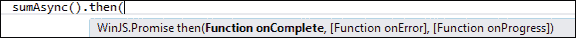
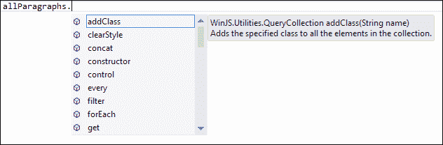

# 第三章： Windows 应用的 JavaScript

在本章中，我们将介绍由微软引入的**Windows 库 for JavaScript**（简称`WinJS`库）提供的一些功能，该库用于通过 JavaScript 访问 Windows 运行时，以便为 Windows 商店应用提供支持。Windows 库 for JavaScript 是一个 CSS 和 JavaScript 文件的库。它包含一组强大且功能丰富的 JavaScript 对象、函数和方法，这些对象、函数和方法按命名空间组织，旨在使开发人员更容易使用 JavaScript 创建 Windows 商店应用。

我们还将学习关于`WinJS`的异步编程，并了解我们如何可以使用`WinJS.Utilities`命名空间提供的函数查询文档中的元素并操作这些元素。接下来，我们将学习`xhr`函数及其使用，最后介绍由 Windows 库 for JavaScript 提供的一组 UI 控件。

# 使用 Promise 对象的异步编程

当构建一个 Windows 8 应用时，重点是拥有一个响应式 UI，这是 Windows 8 商店应用的主要特点之一。在第二章*使用 CSS3 进行样式设计*中，我们看到了我们如何在样式级别实现这一点。响应式 UI 还包括具有响应式功能，后台运行的代码不仅会突然阻塞应用的 UI，而且会使它在执行某些逻辑或功能时对任何用户输入不作出响应。

JavaScript 作为一种编程语言是单线程的，这意味着一个长时间运行的同步执行过程将阻塞所有其他执行，直到该过程完成。因此，你应该尽可能避免同步执行。这个困境的解决方案是异步处理，这对于创建响应式、高性能的应用程序至关重要。实现异步处理的一种方式是使用**回调函数机制**。回调函数用作一个钩子点，在之前的异步操作终止后继续处理。一个典型的例子是对服务器端后端的调用。

```js
//code sample using jQuery
function longRunningComputation(callbackFunc){
    setTimeout(function(){
        //computation
       //once finished, invoke the callback with the result
       callbackFunc(computationResult);
    }, 1000);
}
```

这个函数然后按照如下方式调用：

```js
longRunningComputation(function(compResult) {
    //do something meaningful with the result

});
```

回调函数是异步调用的典型解决方案，但它们有一个缺点：它们创建了深层链，特别是在你将多个异步操作放在一个链中，而后续函数又依赖于前一个计算结果时。Windows 库 for JavaScript 以及 Windows 运行时提供了一个更优雅的解决方案，使用了一种名为**Promise**的机制，它简化了异步编程。Promise，正如它的名字所暗示的，表示将来会发生一些事情，当这些事情完成后，Promise 就被认为是得到了满足。

在下面的代码示例中，我们创建了一个名为`sumAsync`的函数，它将返回一个`WinJS.Promise`对象，并在我们其在`clickMe()`函数中调用它时异步执行：

```js
function clickMe() {
   sumAsync().then(
        function complete(result) {
            document.getElementById("result").textContent = "The promise has completed, with the result: " + result;
        },
        function error(result) {
            document.getElementById("result").innerHTML = "An Error has occurred </br>" + result;
        },
        function progress(result) {
            document.getElementById("result").innerHTML += "The promise is in progress, hold on please." + result;
        })
}
function sumAsync() {
    return new WinJS.Promise(function (comp, err, prog) {
        setTimeout(function () {
            try {
                var sum = 3 + 4;
                var i;
                for (i = 1; i < 100; i++) {
                    prog(i);
                }
                comp(sum);
            } catch (e) {
                err(e);
            }
        }, 1000);
    });
}
```

从前面的代码示例中我们可以推断出，`Promise`基本上是一个对象。这个对象实现了一个名为`then`的方法，该方法又采取了以下三个函数作为参数：

+   一个在`Promise`对象完成并成功满足时会被调用的函数

+   一个在`Promise`对象被满足时会调用的函数，称为`未来`

+   一个在`Promise`被满足时会被调用的函数，以指示进度信息，称为`延迟`

在 Visual Studio 中，当你向一个函数添加一个`then`方法时，你将在 IntelliSense 弹出窗口中提示输入这些参数，如下面的屏幕截图所示：



你可以使用`then`方法与任何返回`Promise`的函数；因为它返回`Promise`，所以你可以链接多个`then`函数。例如：

```js
sumAsync() 
  .then(function () { return XAsync(); })
  .then(function () { return YAsync(); })
  .done(function () {  endProcessing();})
```

在前一个示例中，我们将多个`then`方法附加到函数上，并使用`done`方法完成处理。

### 注意

`done`方法接受与`then`相同的参数。然而，两者的区别在于`done`返回`undefined`而不是`Promise`，所以你不能链接它。此外，`done`方法如果在处理过程中没有提供`error`函数来处理任何错误，将抛出一个异常，而`then`函数不会抛出异常，而是返回`error`状态的`Promise`对象。

所有向 Windows Store 应用公开的 Windows 运行时 API 都被包装在`Promise`对象中，暴露出返回`Promise`对象的方法和函数，允许你在应用中轻松实现异步过程。

# 使用 WinJS.Utilities 查询 DOM

应用的界面由 HTML 和相应的样式描述。当应用启动时，你应该期待与界面不同的用户交互。用户将触摸应用的某些部分；他会滚动、缩放或添加/删除项目。此外，应用可能通过对话框或会话与用户交互，并通过在屏幕上发布通知来与用户交互。处理这些交互由代码完成，在我们的案例中，特别是由 JavaScript 代码完成。这时`WinJS.Utilities`就派上用场了，它提供了助手函数来完成这些任务；例如，添加/删除 CSS 类或插入 HTML 元素的功能。但在任何与用户交互之前，你必须使用 JavaScript 选择函数，这称为**查询 DOM**。

In Chapter 2, *Styling with CSS3*, we saw how to select parts of the DOM using CSS selectors. JavaScript has built-in functions to do so by using the traditional `document.getElementById` function. This function has a limited functionality and does not allow selecting from the DOM using the CSS selector syntax as the jQuery selectors do, however, now JavaScript includes `querySelector()` and `querySelectorAll()`. These two functions are more powerful and take CSS queries just as the jQuery selector syntax does. While the `querySelector()` function returns a single DOM element, the `querySelectorAll()` function returns a list of nodes. Both functions exist on the `document` and `element` objects. So, you can query the document to find all matching results in the entire document, or you can just query a single element to find all matching objects under it. For example:

```js
var postDiv = document.querySelector('#postDiv);
var allDivs = postDiv.querySelectorAll('div');
```

alongside these two JavaScript selection methods, the `WinJS.Utilities` namespace provides two functions with similar features for selecting elements, namely `id()` and `query()`. Basically, these functions wrap the `querySelector` and `querySelectorAll` functions but the return result value is different. The selector functions provided by `WinJS.Utilities` return a `QueryCollection` object, which in turn exposes various operations that perform actions over the elements of the collection, such as adding and removing a class and others.

The following code shows the syntax for using `id()` and `query()`. We first create a `WinJS.Utilities` object and call these two methods on it as shown:

```js
var utils = WinJS.Utilities; 
var postDiv = utils.id('postDiv');  
var allParagraphs = utils.query('p');
allParagraphs.setStyle("color", "red");
```

The following screenshot shows the IntelliSense window that lists the functions provided by the `WinJS.Utilities` namespace:



Querying the DOM is also useful when you need to apply a behavior to the elements of `document`. For example, you might want to add a functionality whenever the user clicks on a particular button. We do so by first querying for that element and then adding a `click` handler to it. The following code shows how:

```js
  WinJS.Utilities.id("Btn").listen("click", function () {
    var p = document.createElement("p");
    p.innerHTML = "i was just added";
    document.querySelector("#postDiv").appendChild(p);
});
```

In the previous code sample, the `listen()` method is used to wire an event handler to the `click` event of the button with the ID `Btn`; in this handler, we are creating a new `p` element and adding it to the `div` element with the ID `postDiv`.

### Note

The methods provided by the `WinJS.Utilities` namespace are like a simplified subset of the functions provided in jQuery.

The following is a list of some of the available methods that you can call on the objects returned in `QueryCollection`:

+   `addClass`

+   `clearStyle`

+   `getAttribute`

+   `hasClass`

+   `query(query)`

+   `removeClass`

+   `removeEventListener`

+   `setAttribute`

+   `setStyle`

+   `toggleClass`

+   `children`

# Understanding WinJS.xhr

The `xhr` function basically wraps the calls to `XMLHttpRequest` in a `Promise` object. The function is useful for cross-domain and intranet requests, as shown in the following code:

```js
  WinJS.xhr(options).then(
     function completed(result) {
….
      },
     function error(result) {
….
      },
     function progress(result) {
….
      },
```

由于`WinJS.xhr`函数异步处理并返回一个`Promise`对象，我们可以像 previous example 中所示，向它传递`then()`或`done()`方法。

你可以使用`WinJs.xhr`函数来连接 Web 服务并下载不同类型的内容，如文本或指定在`WinJS.xhr`的`responseType`选项中的 JSON 字符串。`responseType`选项取一个字符串值，指定从请求中期望的响应类型，类型如下：

+   `text`：这是默认值，期待一个字符串类型的响应。

+   `arraybuffer`：这期待一个用于表示二进制内容，如整数或浮点数数组的**ArrayBuffer**。

+   `blob`：这期待一个**Blob**（**Binary Large Object**），它是一个代表不可变原始数据的对象，通常文件大小较大。

+   `document`：这期待 XML 内容；也就是说，内容具有`text/xml`MIME 类型的内容。

+   `json`：这期待一个 JSON 字符串

+   `ms-stream`：这期待一个处理流数据的`msStream`对象，并用供应商特定的前缀（`ms`）标记，因为它尚未在 W3C 规范中定义。

除了`responseType`，还可以在`xhr`（`XMLHttpRequest`）对象上应用几个更多选项，这些都是可选的，除了`url`。这些选项如下：

+   `url`：这指定了一个字符串，它或者是 XML 数据或服务器端 XML Web 服务的绝对或相对 URL。

+   `type`：这指定了一个代表使用的 HTTP 方法的 string，例如`GET`、`POST`或`HEAD`。

+   `user`：这指定了一个代表用于身份验证的用户名的字符串，如果需要的话。

+   `password`：这指定了一个代表用于身份验证的密码的字符串，如果有的话。

+   `headers`：这指定了一个代表自定义 HTTP 头的对象。

+   `data`：这指定了一个包含将通过 HTTP 请求发送到服务器的数据的对象；这些数据直接传递给`XMLHttpRequest.send`方法。

+   `customRequestInitializer`：这指定了一个可以在`XMLHttpRequest`上用于预处理的函数。

让我们填充以下代码中如何从网站上检索一些文本的基本语法：

```js
WinJS.xhr(
{ url: 'http://www.msdn.microsoft.com/library', responseType: 'text' })
.done(function (request) 
{
    var text = request.responseText;
    document.getElementById("responseDiv").innerHTML = text;
},
function error(request) {
  var errorStatus = "Error returned: " + request.statusText;
  document.getElementById("errorDiv").innerHTML = errorStatus;
});
```

之前的代码示例将从一个指定的`url`字符串检索文本，并将其插入到`div`元素中，`responseDiv`；如果在处理过程中出现错误，我们通过`statusText`在错误处理函数中检索它。

### 注意

不建议使用`XMLHttpRequest`对象来请求可能需要很长时间才能完成的极其大型对象的传输，例如**Blob**和**FormData**对象。相反，你应该考虑使用 Windows 运行时 API 提供的文件上传 API 来进行此类操作。

# 引入一组新的控件

除了内容，您的应用程序还需要控件；常规的 HTML 控件，如按钮、选择列表和复选框；以及一些 Windows 8 独有的控件，如 AppBar 评分和设置。除了标准的内置 HTML 控件外，`WinJS`还提供了一组新的、功能丰富的控件，这些控件是为使用 JavaScript 的 Windows 商店应用程序设计的。这些控件基本上是`WinJS.UI`命名空间中可用的对象；因此，日期选择器控件看起来像`WinJS.UI.DatePicker`。以下是您在应用程序中使用的主要的`WinJS.UI`控件列表：

+   `DatePicker`：用于选择日期值的定制控件。

+   `TimePicker`：用于选择时间值的定制控件。

+   `Menu`：用于显示命令的菜单弹出控制。

+   `AppBar`：用于显示命令的应用程序工具栏。

+   `FlipView`：用于一次性显示一系列项目的集合。

+   `ListView`：用于以可自定义的网格或列表布局显示项目的控件。

+   `Flyout`：这是一个轻量级的控件，用于显示包含信息的弹出式控件，但它不会像对话框那样创建一个单独的窗口。

+   `Rating`：这是一个允许用户评分并可以显示三种类型评分—临时、平均或用户评分的控件。

+   `SemanticZoom`：这是一个可以让用户在缩放视图和放大视图之间缩放的控件，由两个提供每种视图的单独子控件提供：

+   `ToggleSwitch`：这是一个可以让用户在两个状态之间切换选项（开和关）的控制。

+   `Tooltip`：用于显示有关对象的弹出式控件，其中包含有关对象的更多信息，并支持丰富的内容（如图像）。

+   `ViewBox`：这是一个缩放其包含的单个子元素（不改变其宽高比）的控制，使其适合并填充可用空间。

    ### 注意

    这些控件会自动使用 Visual Studio 中创建的任何新的 Windows 8 商店应用程序项目中默认出现的两个样式表之一进行样式设计。这两个样式表（一个为深色主题，另一个为浅色主题）将给您的应用程序带来 Windows 8 的外观和感觉。

与标准的 HTML 控件不同，`WinJS.UI`控件没有专用的标记元素或属性标签；例如，您不能像正常添加标准 HTML 元素（如`<input/>`）那样，继续向您的标记中添加`WinJS.UI.Rating`元素（如`<rating/>`）。要添加一个`WinJS.UI`控件，您需要创建一个 HTML 元素，比如`div`，并使用`data-win-control`属性来指定您想要的控件类型。下面的代码显示了创建一个`WinJS.UI` `Rating`控件的语法：

```js
<div id="ratingControlDiv" data-win-control="WinJS.UI.Rating"> </div>
```

这将声明一个评分元素在标记中，但当你运行应用程序时，不会加载控件。为了激活你在标记中声明的任何`WinJS`控件，必须调用处理文档并初始化你创建的控件的`WinJS.UI.processAll()`函数。当你使用 Visual Studio 提供的任何模板创建应用程序时，`default.js`文件中在`app.onactivated`事件处理程序中包含了对`WinJS.UI.processAll`的调用。

当你运行应用程序时，你会看到如下的新`Rating`控件：


你也可以通过调用其构造函数并在构造函数中传递将托管此控件的 HTML 元素来在代码中创建`WinJS`控件。例如，如果我们有一个`div`元素，其`id`属性为`ratingControlDiv`，创建`Rating`控件的 JavaScript 将如下所示：

```js
var ratingHost = document.getElementById("ratingControlDiv");
var ratingControl = new WinJS.UI.Rating(hostElement);
```

在这种情况下，将无需调用`WinJS.UI.processAll`函数，因为你没有在标记中创建 JavaScript 控件。

此外，设置`WinJS`控件的属性与设置标准 HTML 控件的属性不同；后者有专门用于此目的的属性。例如，类型为`range`的`input`元素有`min`和`max`属性，其值可以在标记中如以下代码所示设置：

```js
<input type="range" min="2" max="10" />
```

对于 JavaScript 控件，我们必须在标记中使用`data-win-options`属性来设置属性，它是一个包含一个或多个属性/值对的字符串（多个属性以逗号分隔），在基本形式下如以下代码所示：

```js
data-win-options="{propertyName: propertyValue}"
```

下面的语法将显示如何为`WinJS.UI.Rating`控件设置`minRating`和`maxRating`属性：

```js
<div id="ratingHostDiv" data-win-control="WinJS.UI.Rating"
    data-win-options="{ minRating: 2, maxRating: 10}"> 
</div>
```

# 总结

我们已经瞥见了`WinJS`在 Windows 8 中的某些功能和强大特性。我们学习了如何使用`Promise`对象实现异步编程。

此外，我们还介绍了`WinJS.Utilities`命名空间中提供的方法，这些方法允许我们检索和修改 HTML 文档的元素。我们还介绍了使用`WinJS.xhr()`函数检索不同类型内容的方法。

最后，我们学习了`WinJS`库提供的新一组控件以及如何创建这些 JavaScript 控件并设置它们的属性。

在下一章中，我们将开始使用 JavaScript 开发应用程序，首先介绍所需的工具，然后学习为 Windows 8 JavaScript 应用程序提供的模板。此外，我们将创建一个非常基础的应用程序，并了解 JavaScript 应用程序的解剖结构。我们还将学习 ListView 控件。
