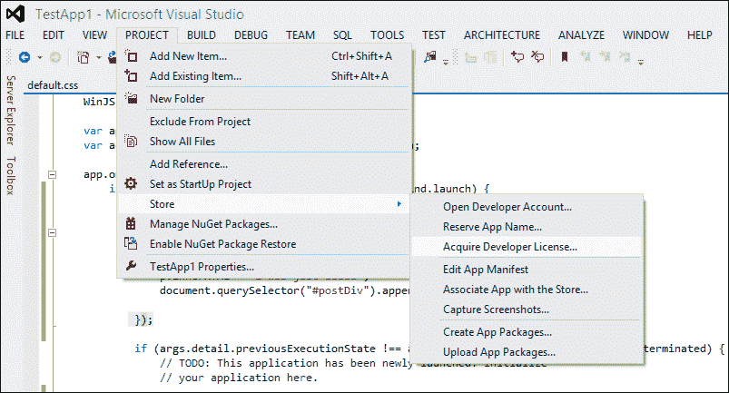
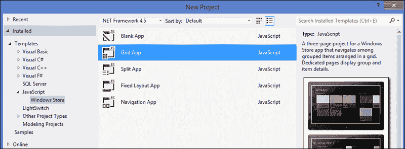
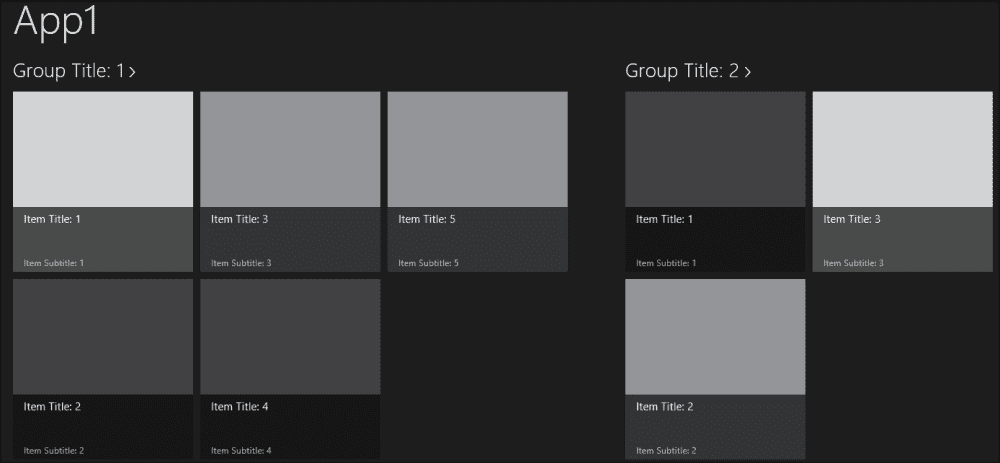
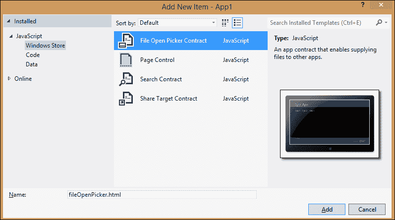
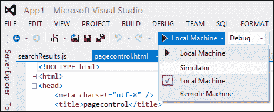
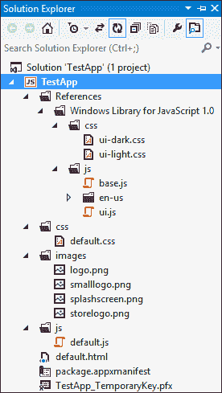
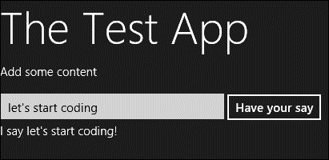
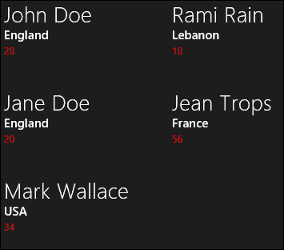

# 第四章：使用 JavaScript 开发应用程序

在本章中，我们将学习如何使用 JavaScript 开始开发 Windows 8 应用程序。首先，我们将学习有关工具的知识，然后我们将介绍如何获取开发者许可证。之后，我们将从为 Windows Store 应用程序开发提供的模板中选择一个，从一个空白模板构建一个示例应用程序，并对其进行修改，以便我们了解一些 JavaScript 应用程序的功能。

# 介绍工具

Windows 8 引入了一种新类型的应用程序——Windows Store 应用程序，这种应用程序只能在 Windows 8 上运行。所以，为了开始开发，你首先需要在你的电脑上安装 Windows 8，第二，你需要所需的开发工具。

获取 Windows 8 有两个选择；一种选择是从 MSDN 的订阅者下载处获取，如果你在那里有订阅的话。另一种选择是，如果你没有 MSDN 账户，你可以从通过 MSDN 网站上的[`msdn.microsoft.com/en-US/evalcenter/jj554510.aspx?wt.mc_id=MEC_132_1_4`](http://msdn.microsoft.com/en-US/evalcenter/jj554510.aspx?wt.mc_id=MEC_132_1_4)找到的*评估中心*获取 Windows 8 企业版的 90 天评估版本。

### 注意

请注意，评估版在过期后无法升级。

在安装 Windows 8 之后，你需要下载开发工具，这些工具在 MSDN 网站上免费提供，可以在[`msdn.microsoft.com/en-US/windows/apps/br229516.aspx`](http://msdn.microsoft.com/en-US/windows/apps/br229516.aspx)的*Windows 开发者中心*页面找到。Windows 开发者中心拥有全新的改进布局，是你获取所有工具和资源的首个起点，可以在**Windows Store 应用程序开发下载**部分找到。

必要的下载是包含 Visual Studio Express 的捆绑包，这将是你开发 Windows 应用程序的工具。这个下载的链接可以在**Windows 8 的 Visual Studio Express 2012**部分找到，并包括以下文件：

+   微软视觉工作室 Express 2012 for Windows 8

+   微软视觉工作室 2012 的 Blend

+   Windows 8 软件开发工具包（SDK）

+   Windows Store 应用程序项目模板（在微软视觉工作室 2012 中提供）

此外，你还可以在该页面上找到其他可用的下载，例如：

+   设计资源：这包括必要的 Photoshop 模板（`.psd`文件），其中包括模板、常用控件和常见组件，如合同、通知和磁贴，这些是设计应用程序所需的。

+   示例应用程序包：这包括数百个来自微软的代码示例，可以帮助你快速启动项目并了解大部分功能。这适用于所有或特定编程语言。

+   Windows 8 动手实验室：这包括一系列八个动手实验室模块，这些模块将引导您开发一个名为 Contoso Cookbook 的 Windows Store 应用。这包含了 Windows 8 中许多关键的新功能。这些实验室系列可通过 JavaScript 和 HTML，或 C#和**可扩展应用程序标记语言**（**XAML**）获得。

+   Live SDK：这包括一组控件和 API，我们可以使用它们来使应用与 Microsoft 账户集成**单点登录**（**SSO**），并访问来自 SkyDrive、Hotmail 和 Windows Live Messenger 的信息。

    ### 注意

    由于 Visual Studio 2012 仅支持 Windows 8 的 Windows Store 应用开发，因此即使安装了 Visual Studio 2012，您也无法在 Windows 7 上开发应用。而且，由于没有为 Windows Server 2012 提供开发者许可证，所以您也无法在 Windows Server 2012 上开发 Windows Store 应用。

    请注意，您可以使用 Visual Studio 2012 的其他任何版本来开发 Windows Store 应用，包括 Ultimate、Premium、Professional 和 Test Professional 版本。

## 获取免费开发者许可证

为了开始开发 Windows Store 应用，您需要拥有 Windows 8 的开发者许可证。这个许可证允许您在 Windows Store 测试和认证之前，在本地安装、开发、测试和评估应用。此外，开发者许可证是免费的，您不需要 Store 账户就可以获得一个；它只需要一个 Microsoft 账户，并且每个账户可以获取多个许可证。许可证在 30 天后过期，必须续订。如果您已经有了一个 Windows Store 账户，许可证将为您提供 90 天服务。在您在本地计算机上获得许可证之后，除非许可证过期或您删除它（可能通过格式化或卸载 Visual Studio），否则在该计算机上不会再提示您。获得一个许可证非常简单；您可以使用 Visual Studio 2012 来获取开发者许可证。当您第一次在 Windows 8 上运行它时，它会提示您获得一个开发者许可证；您只需要使用您的 Microsoft 账户登录即可。您总是可以尝试通过使用 Visual Studio 中的商店选项来获取或续订 Windows 8 的开发者许可证，我们将在第十章 *打包和发布* 中详细讨论打包和发布应用时，学习如何发布应用。

### 注意

请记住，如果您还没有这样做，第一次尝试运行应用时将被提示获取开发者许可证。

下面的屏幕截图显示了使用 Visual Studio 2012 Ultimate 的过程。请前往**项目** | **商店** | **获取开发者许可证**。



如果您使用的是 Express 版，您将在顶部菜单中直接有一个**商店**选项，而不是在**项目**下面。您只需前往**商店** | **获取开发者许可证**。

### 注意

选择不获取或续签开发者许可证，当你尝试在 Visual Studio 中构建或部署应用时，将会导致错误（代码 DEP0100）。

安装 Windows 8 和所需工具并获得开发者许可证后，您就可以开始构建您的第一个应用了。您开始时需要选择一种编程语言来使用。如我们之前提到的，Windows 8 允许您基于您的编程语言知识库进行构建，并用您已经知道的编程语言进行开发（除非您想学习新东西）。如果您从事网页开发，可以选择 JavaScript 作为您的编程语言，并使用最新的网页开发技术（例如 HTML5 和 CSS3），这本书就是关于这些内容。如果您来自.NET 背景，可以选择 Visual C#或 Visual Basic 和 XAML。您还有使用 C++选项，分别是 C++和 XAML，或者 C++和 DirectX。

# 使用 Visual Studio 及其模板

所以现在我们有了工具。有了 Visual Studio 作为我们的游乐场和 JavaScript 作为我们的编程语言，我们已经准备就绪可以开始开发了。我们将从为 Windows Store 创建一个新项目开始。点击**文件** | **新建项目**。向下钻取到**已安装**，然后到**模板**，再到**JavaScript** | **Windows Store**，并选择一个模板类型，如下面的屏幕截图所示：



正如你在之前的屏幕截图中所看到的，在**新建项目**对话框的中心面板上有五种模板可供选择。这些模板随 Visual Studio 2012 提供，为您提供了良好的起点，并帮助您快速启动和加速应用的开发。这些项目模板，按照它们在**新建项目**对话框中出现的顺序，如下所示：

+   **空白应用**：这是一个基本的工程项目模板，创建一个空的 Windows Store 应用，可以编译和运行。然而，它不包含任何用户界面控件或数据。

+   **网格应用**：这是一个提供网格视图格式的内容的工程项目。它是允许用户浏览数据类别以查找内容的应用程序的良好起点。其使用的一些例子包括 RSS 阅读器、购物应用、新闻应用和媒体画廊应用。

+   **分割应用**：这是一个提供内容分割视图的项目，其中数据以两栏的主/详细视图显示，列表数据在一侧，每个单一数据项的详细信息在另一侧，就像 Outlook 一样。其使用的一些例子包括新闻阅读器应用、体育比分应用和电子邮件应用。

+   **固定布局应用**：这是一个基本且最小的模板项目，类似于使用**空白应用**模板创建的应用，不同之处在于此布局中的内容针对固定布局视口，即当窗口大小变化时容器会自动调整大小以适应显示区域；这种缩放是通过使用`ViewBox`控件来保证的。

+   **导航应用**：这是一个创建采用单页导航模型（Windows Store 应用推荐使用）的项目。您不能仅通过在标记中添加`锚点`链接来实现导航模型；相反，导航模型是通过使用`navigator.js`文件来实现的，该文件也可以在网格和分屏模板中找到，而**空白应用**和**固定布局应用**模板则不包含此文件，因此您必须手动添加该文件。

    ### 注意

    **网格应用**和**分屏应用**模板不仅是一个构建应用程序的好起点，而且也是很好的学习模板，能让您对应用程序是如何构建的以及它由什么组成有一个很好的了解。

三个模板**空白应用**、**网格应用**和**分屏应用**可供 Windows Store 开发中所有可用的编程语言使用。每个项目模板都包含了实现它所代表功能的必要文件，无需您进行任何开发；例如，创建一个新的网格应用并运行它，将会得到如下应用程序：



结果是一个准备好用于 Windows Store 的应用程序，其中包含带有启用导航的示例数据，甚至支持**粘贴和填充布局**，这是当分辨率在并排的两个应用程序之间分配时应用程序存在的布局。所有这一切甚至不需要编写一行代码！所以，想象一下，如果您通过为布局应用不同的样式并在内容中显示真实数据（比如说，新闻网站的 RSS 源），对这个最小化的应用进行一些定制，您将很快拥有一个超过 75%准备好上架的应用程序（还缺少一些功能，比如语义缩放、应用栏和设置）。

您还可以直接从 Visual Studio 下载示例。这些示例提供了完整且可运行的代码示例，可以编译并作为 Windows Store 应用运行，旨在展示 Windows 8 中可用的各种新的编程模型、平台、功能和组件。

## 项目项模板

除了项目模板之外，还有特定于 Windows Store 应用的语言项模板，在我们的案例中，称为**JavaScript 项模板**。这些项模板是可以添加到已存在项目中的应用程序文件，包含常用的代码和功能（可以把它看作是一个用户控件），并且有助于减少开发时间。可以通过右键点击顶部菜单中的**项目**，然后选择**添加** | **新建项**，来添加项模板。有四个 JavaScript 项模板可供使用；它们如下所示：

+   **页面控制**：这包含了应用程序中页面的基本内容和标记。其中包括一个带有返回按钮的头部区域和一个主要内容区域。每个**页面控制**模板将包括三个要添加到项目的文件（一个包含所需标记的 HTML 文件，一个包含与页面相关的代码的 JavaScript 文件，以及一个为页面提供特定样式的 CSS 文件）。

+   **文件打开选择器合同**：这将添加一个功能，使应用程序能够使用**文件选择器**对话框将其数据作为文件列表提供给其他请求文件的应用程序。它还将文件显示在 ListView 控件中。这个合同的一个典型用途是在创建一个照片选择器对话框时。

+   **搜索合同**：这将添加一个允许应用程序响应来自 Windows 8 中搜索磁贴的搜索查询的搜索合同。它包含一个搜索结果页面，用于向用户展示结果。如果您的应用程序有一些可以搜索的数据，添加这个合同是很重要的。

+   **分享目标合同**：这将向应用程序添加一个分享合同，允许应用程序与其他应用程序共享数据，并使其与 Windows 8 中的分享磁贴集成。所以，如果应用程序具有此合同，它将出现在分享 UI 中的应用程序列表中。这个模板的典型用途是允许用户将链接或照片发布到 Facebook，Twitter 或任何其他接收共享内容的其他应用程序。反之亦然，它还将允许应用程序接收共享内容；因此，应用程序可以表现得像 Facebook 或 Twitter。

下面的屏幕截图显示了带有前面列出的项目模板的**添加新项**对话框：



### 注意

我建议您将每个项目模板添加到单独的文件夹中，并且文件夹名称与其相关联。由于每个项目模板都增加了三个相关文件，如果您将它们分组到单独的文件夹中，解决方案将更加整洁和有序。例如，为页面创建一个文件夹，并在其中为每个页面创建一个文件夹；合同部分也是如此。

选择一个应用程序模板并将其加载到 Visual Studio 之后，您基本上已经创建了一个非常简单的应用程序；这个应用程序可以直接编译和运行。使用 Visual Studio，您可以在本地计算机或模拟器上运行应用程序。要在本地计算机上运行它，只需按*F5*键来构建，部署并启动应用程序。

### 注意

请注意，您可以选择不部署解决方案，但是应用程序不能直接运行；您需要从开始菜单中的其他应用程序中找到它，然后手动启动它。

还有一种通过以太网电缆直接连接远程设备运行的方法。要使用模拟器，您只需要从运行菜单中选择以下屏幕截图所示的选项：



Windows 8 模拟器是一个极好的工具，能帮助你测试和调试应用；它允许你像在真实设备上一样测试功能，特别是如果你在开发过程中没有平板电脑或触控设备。它能让应用在横屏和竖屏之间改变分辨率，并在不同的应用布局和视图状态（嵌入式和全屏）之间切换。此外，你还可以测试应用对触摸和手势（如滑动和捏合缩放）的响应。在开发过程中，我们无法在笔记本电脑或 PC 上尝试所有这些功能和特性。

### 注意

当你在 Visual Studio 中以调试模式运行应用时，你可以更改代码和标记，并刷新应用以查看更改，而无需重新构建/重新运行。你可以使用**刷新 Windows 应用**按钮来实现，该按钮将在暂停、停止和重新启动调试按钮旁边出现，仅在你从 Visual Studio 中运行应用后出现。

# 开始使用空白应用

让我们使用**空白应用**模板开始创建一个最小应用；我们首先需要做的是启动 Visual Studio 2012，创建一个新项目，并前往**JavaScript** | **Windows Store** | **空白应用**。尽管空白应用在运行时看起来很空，但它包含了一些使用 JavaScript 创建的 Windows Store 应用所需的文件；其他所有模板都将包含这些文件。以下屏幕截图显示了此应用在**解决方案资源管理器**窗口中的结构：



此前的屏幕截图展示了简单应用的骨架，包括以下文件：

+   `Windows Library for JavaScript 1.0`：Windows Library for JavaScript 是一个 CSS 和 JavaScript 文件的库。当你深入这个文件夹时，你会看到它包含两个子文件夹，如下所示：

    +   `css`：此文件夹包括两个主要的 CSS 样式表，它们是`ui-dark.css`和`ui-light.css`，这些样式表为应用提供了 Windows 8 的外观和感觉。正如它们的名称所暗示的，第一个将应用一个深色主题，而第二个将应用一个浅色主题。你可以在 HTML 页面中引用其中的一个来选择。

    +   `js`：此文件夹包括`base.js`和`ui.js`；这两个文件包含了提供控件、对象和帮助函数的 JavaScript API，所有这些都组织成名称空间，这将使使用 JavaScript 的开发体验变得更加容易。

+   `default.css`：这是包含应用 CSS 样式的样式表。

+   `images`：此文件夹包含展示应用及其身份所需的图片（两个标志、启动屏幕图片和商店标志）。

+   `default.js`：此 JavaScript 文件实现了应用的主要功能，并包含了处理应用生命周期的代码。在这个文件中，你可以编写与`default.html`页面相关的任何附加代码。

+   `default.html`：这是应用程序的起始和主页，当应用程序运行时首先加载。它提供了内容宿主（主窗口中加载每个页面）的标记。

+   `package.appxmanifest`：这是清单文件。它基本上通过指定描述应用程序的属性，如名称、描述、起始页面等，来描述 Windows 上的应用程序包。

+   `TestApp_TemporaryKey.pfx`（`AppName_TemporaryKey.pfx`）：这个文件签署了`.appxmanifest`文件。

让我们来看一下`default.html`页面，这是应用程序的起始页面（在这个案例中，也是唯一页面）：

```js
<!DOCTYPE html>
<html>
<head>
  <meta charset="utf-8" />
  <title>TestApp</title>
    <!-- WinJS references -->
  <link href="//Microsoft.WinJS.1.0/css/ui-dark.css" rel="stylesheet" />
  <script src="img/base.js"></script>
  <script src="img/ui.js"></script>

  <!-- TestApp references -->
  <link href="/css/default.css" rel="stylesheet" />
  <script src="img/default.js"></script>
</head>
<body>
  <p>Content goes here</p>
</body>
</html>
```

从`Doctype html`可以看出，页面是 HTML5 的。我们在`<head>`中放置了应用程序的标题，然后是 JavaScript（`WinJS`）文件的引用。引用用`WinJS` `references`注释标记。首先引用`.css`文件，这样脚本的加载就不会延迟或阻碍样式的加载，如果`.js`文件对样式表进行了某些修改，需要在加载样式之前加载样式。这里应用了深色主题；你可以简单地将其更改为浅色主题，通过如下更改引用：

```js
<link href="//Microsoft.WinJS.1.0/css/ui-light.css" rel="stylesheet" />
```

### 注意

不要修改`WinJS`的 CSS 和 JavaScript 文件。最好创建样式或 JavaScript 函数，在不同文件中覆盖现有的样式和功能，并将它们应用于应用程序。

在`WinJS`引用下，有对应用程序特定的样式表和 JavaScript 文件的引用，这些引用通过注释清晰地区分。

然后是 body 部分。在这里，以空白应用程序为例，body 只包含简单文本。

如果你尝试以当前状态启动应用程序，你会看到屏幕上覆盖着黑色背景，还会看到文本：**内容在此处**。在这个页面出现之前，你会注意到一个启动屏幕出现几秒钟，显示在清单文件中指定的启动屏幕图像。让我们尝试通过修改我们的起始页面并向 body 添加一些标记，给这个空白应用程序带来一些生命，就像你之前处理过的任何 HTML 页面一样。

用以下内容替换现有的段落元素：

```js
<body>
  <h1>The Test App</h1>
  <p>Add some content </p>
  <input id="contentInput" type="text" />
  <button id="sayButton">Have your say</button>
  <div id="contentOutput"></div>
</body>
```

运行应用程序；它将显示我们刚刚添加的标记。我们可以在`input`元素中输入任何文本，但点击按钮将没有效果。所以让我们为这个按钮创建一个事件处理程序，在`div`中输出我们在`input`元素中添加的内容。我们需要在`default.js`文件中创建事件处理程序，因为那里是我们编写与`default.html`页面交互的额外代码的地方。

首先让我们来看一下这个`default.js`文件。你会注意到里面有一些用单个函数包裹的代码，如下所示：

```js
(function () {
   "use strict";
  …
})();
```

这段代码代表了一个自执行的匿名函数，它包含所有你的代码以避免任何命名冲突，并保持全局命名空间干净，没有不必要的标识符。匿名函数的第一行代码声明了关键字`use strict`，它为 JavaScript 代码开启了严格模式。这种严格模式提供了更好的错误检查，例如防止你给只读属性赋值。在这行之后，你会看到剩下的代码，它通过添加`app.onactivated`和`app.oncheckpoint`事件处理程序来处理应用程序的激活和检查点状态。我们添加在`app.onactivated`事件处理程序内部的代码将在应用程序启动时添加。

现在回到按钮事件处理函数；我们创建一个如下函数：

```js
function buttonClickHandler(eventInfo) { 
  var text = document.getElementById("contentInput").value; 
  var outputString = "I say " + text + "!";
  document.getElementById("contentOutput").innerText = outputString; 
}
```

在最底部的`app.start()`调用之前的匿名函数内部添加这个函数。这个函数从`input`元素中获取文本并将其添加到`div`元素中。为了将这个函数添加到按钮的事件中（在本例中，是`onclick`事件），我们需要为按钮注册一个事件处理程序。建议通过调用`addEventListener`方法来完成。当应用程序被激活时，我们需要注册这个事件处理程序。因此，我们应该在`app.onactivated`事件处理程序内部添加它。代码如下所示：

```js
var app = WinJS.Application;
var activation = Windows.ApplicationModel.Activation;

app.onactivated = function (args) {
  if (args.detail.kind === activation.ActivationKind.launch) {
       if (args.detail.previousExecutionState !== activation.ApplicationExecutionState.terminated) {
      // TODO: This application has been newly launched. Initialize
         // your application here.
    } else {
  // TODO: This application has been reactivated from suspension.
  // Restore application state here.
     }
     args.setPromise(WinJS.UI.processAll());

     // Retrieve the button and register our event handler.
     var sayButton = document.getElementById("sayButton");
     sayButton.addEventListener("click", buttonClickHandler, false);
}
};
```

`app`变量是一个全局变量，代表提供应用程序级别功能的`Application`类的实例；例如，处理不同的应用程序事件，如我们之前代码列表中看到的`onactivated`事件。

在`onactivated`处理程序内部，代码检查发生的是哪种类型的激活；在本例中，是启动激活，这意味着该应用程序在没有运行时被用户激活。然后调用`WinJS.UI.processAll()`。这将扫描`default.html`文件中是否有任何`WinJS`控件，并将初始化它们。由于按钮不是一个`WinJS`控件，而是一个基本的 HTML 控件，我们可以在调用`WinJS.UI.processAll()`之前添加它，但最好在之后注册事件处理程序。

运行应用程序，在文本框中输入一些文本，当点击按钮时显示内容，如下面的屏幕截图所示：



# 理解 ListView 控件

在上一章中，我们介绍了一个由 Windows 库为 JavaScript 提供的新控件集；这些控件中的一个是 ListView 控件，标记为`WinJS.UI.ListView`。这个对象的基本作用是显示可自定义的列表或网格中的数据项。要创建一个 ListView 控件，我们需要向`div`元素添加`data-win-control`属性，并将其属性设置为`WinJS.UI.ListView`。在`default.html`页面中，在`body`标签内部添加以下代码：

```js
<body>
  <div id="sampleListView" data-win-control="WinJS.UI.ListView">
  </div>
</body>
```

这将创建一个空的 ListView。所以，如果我们运行该应用，将看不到任何东西。由于这是一个`WinJS`控件，它将在我们调用`WinJS.UI.processAll`函数后才在标记 up 中渲染。

让我们给`sampleListView`控件添加一些数据以显示。这些数据可能来自网络数据库或 JSON 数据源，将手动创建数据源，最好在单独的 JavaScript 文件中，这样更容易维护。所以，在 Visual Studio 中，在`js`文件夹下，添加一个新项目并选择一个 JavaScript 文件；将其命名为`data.js`。打开这个新创建的文件，创建一个带有严格模式的匿名函数，就像我们在`default.js`文件中看到的那样；在这个函数内部，让我们创建一个由对象组成的样本数组，这些对象构成了我们需要的数据源。给数组中的每个对象赋予三个属性`firstName`、`lastName`和`Age`。

最终代码将如下所示：

```js
(function () {
    "use strict";
    //create an array for a sample data source
    var dataArray = [
    { name: "John Doe", country: "England", age: "28" },
    { name: "Jane Doe", country: "England", age: "20" },
    { name: "Mark Wallace", country: "USA", age: "34" },
    { name: "Rami Rain", country: "Lebanon", age: "18" },
    { name: "Jean Trops", country: "France", age: "56" }

    ];

    //create a list object from the array
    var sampleDataList = new WinJS.Binding.List(dataArray);
})();
```

接下来，我们使用刚刚创建的数组来创建一个 List 对象；然后我们需要通过声明一个命名空间并将其作为公共成员添加来暴露这个 List 对象：

```js
    // Create a namespace to make the data publicly
    // accessible. 
    var publicMembers =
        {
            itemList: sampleDataList
        };
    WinJS.Namespace.define("DataSample", publicMembers);
```

为了使 ListView 控件能够访问这个列表，我们使用了`WinJS.Namespace.define`函数来创建一个命名空间，并将列表作为其成员之一，从而使列表公开可用，因为它是匿名函数中创建的，这使其保持私有。`WinJS.Namespace.define`函数接受两个参数，正如你在之前的代码中注意到的那样。第一个参数是要创建的命名空间的名字，第二个参数表示包含一个或多个键/值对的对象（`publicMembers`）。

在创建数据源并使其被 ListView 控件访问后，下一步是将数据源连接到 ListView 控件。这必须在`default.html`文件中完成。让我们从我们留下的示例空白应用开始。我们需要添加对我们刚刚创建的数据文件的引用，如下所示：

```js
<!-- Sample data file. -->
<script src="img/data.js"></script>
```

然后我们将`data-win-options`属性添加到`div`元素中，并使用我们在`data.js`中创建的数据源来设置`data-win-options`属性内的`itemDataSource`属性。将 ListView 控件的`itemDataSource`属性设置为`DataSample.itemList.dataSource`，如下所示：

```js
<div id="sampleListView" data-win-control="WinJS.UI.ListView" 
 data-win-options="{ itemDataSource : DataSample.itemList.dataSource }">  
</div>
```

`DataSample.itemList.dataSource`命名空间包括`DataSample`，这是我们之前注册的命名空间；`itemList`，是我们注册在命名空间上的对象的属性名称；最后是`dataSource`，它是`WinJS.Binding.List`方法的一个属性（我们之所以能在`itemList`上调用它，是因为后者被分配给了我们从数组创建的 List 对象）。

如果我们现在运行该应用，我们会看到 ListView 控件以无格式的方式显示我们创建的数组，如下所示：

```js
    { name: "John Doe", country: "England", age: "28" }
    { name: "Jane Doe", country: "England", age: "20" }
    { name: "Mark Wallace", country: "USA", age: "34" }
    { name: "Rami Rain", country: "Lebanon", age: "18" }
    { name: "Jean Trops", country: "France", age: "56" }
```

我们可以通过覆盖 Windows Library for JavaScript 中定义的`win-listview`类中的默认样式来样式化这个 ListView 控件，以样式化 ListView 控件。为了覆盖默认样式并将一些样式应用到此 ListView 控件上，请复制`win-listview`类并将其前缀与我们要创建的`div`元素的特定 ID 一起使用，如下所示：

```js
#sampleListView.win-listview {
  width: 500px;
  border: 1px solid gray;
}
```

我们可以在 ListView 内部添加更多的样式，并且可以使用`WinJS.Binding.Template`定义项目模板，以定义我们要使用来显示每个列表项及其样式的标记。创建`WinJS.Binding.Template`控件非常简单；在 HTML 页面上，添加一个`div`元素并将数据属性`data-win-control`的属性设置为`WinJS.Binding.Template`。在其中，再添加一个将作为模板内容的父元素的`div`元素，因为`WinJS.Binding.Template`必须有一个单一的根元素。在这个父元素内部，我们添加将要创建的标记，ListView 将使用它来填充它包含的每个数据项。现在模板将看起来像这样：

```js
<body>
<div id="sampleTemplate" data-win-control="WinJS.Binding.Template"> 
      <div style="width:200px; height: 100px">    
           <div>    
              <!-- Displays the "name" field. -->
              <h2> </h2>
              <!-- Displays the "country" field. -->
              <h3> </h3>
              <!-- Displays the "age" field. -->
              <h6 style="color:red"> </h6>
           </div>    
      </div>
</div>
</body>      
```

为了将每个元素链接到特定的数据项属性，我们在每个显示数据的元素上使用`data-win-bind`属性。`data-win-bind`属性使用此语法：`data-win-bind="propertyName: dataFieldName"`。因此，要设置`h2`、`h3`和`h6`元素上的 name 属性，我们使用以下代码：

```js
<!-- Displays the "name" field. -->
<h2 data-win-bind="innerText: name"></h2>
<!-- Displays the "age" field. -->
<h3 data-win-bind="innerText: country"></h3>
<!-- Displays the "age" field. -->
<h6 style="color:red" data-win-bind="innerText: age"></h6>
```

请注意，列表项模板（`WinJS.Binding.Template`）在标记 up 中应该在 ListView 控件之前，仅仅是因为 HTML 标记是层次化的，每个 UI 元素都将按遇到它们的顺序进行渲染。因此，当 ListView 控件正在渲染并绑定到`itemTemplate`元素时，这个`itemTemplate`元素必须首先存在；否则它会抛出错误。

最后，我们需要将我们刚刚创建的绑定模板应用于 ListView 控件。因此，使用`select`语法将 ListView 的`itemTemplate`属性设置为`sampleTemplate`，如下所示：

```js
<div id="sampleListView" data-win-control="WinJS.UI.ListView" 
data-win-options="{ itemDataSource : DataSample.itemList.dataSource, itemTemplate: select('#sampleTemplate') }">
</div>
```

如果我们现在运行该应用程序，ListView 控件将以一种更合适的方式显示数据。它看起来会是这样：



# 概要

在本章中，我们已经介绍了使用 JavaScript 创建 Windows Store 应用程序的基础知识。我们了解了工具，以及我们需要的开发入门知识。然后我们了解了如何使用 Visual Studio 2012，并查看了为使用 JavaScript 进行开发提供的模板。

我们了解了如何从零开始构建一个应用程序，在过程中我们看到了 JavaScript Windows Store 应用程序的解剖结构；我们将这个空白应用程序修改为以最简单的方式进行交互，只需点击一个按钮。最后，我们学习了如何使用 ListView 控件来显示数据。

在下一章中，我们将学习如何获取我们想要显示的数据。
