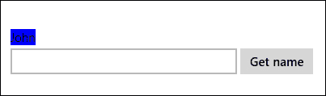
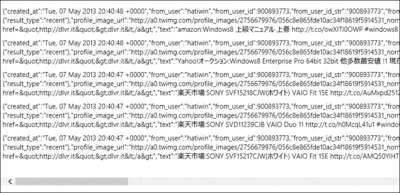
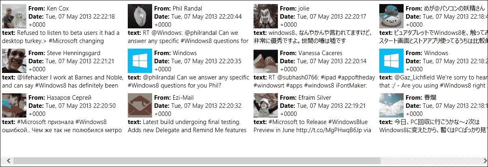
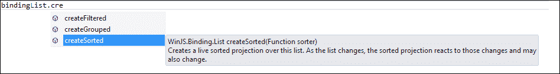
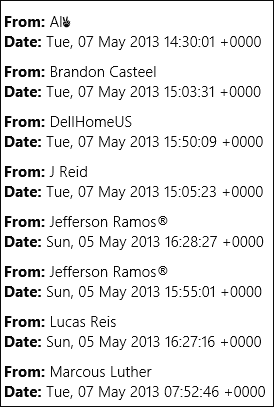
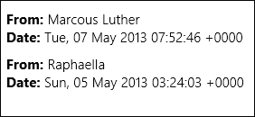

# 第五章：绑定数据到应用

在本章中，我们将学习如何从不同的数据源实现数据绑定到应用中的元素。Windows 库为 JavaScript 提供了数据源对象，可以用来填充`WinJS`控件如`ListView`或`FlipView`的不同类型的数据。我们有`WinJS.Binding.List`对象，用于访问数组和 JSON 数据，还有`StorageDataSource`对象，提供对文件系统信息的访问。这两个数据源对象使我们能够查询并在数据源中绑定项目。此外，我们还将学习如何对数据源进行排序和筛选，并使用`ListView`控件显示其数据。

# 获取数据

**Windows 库用于 JavaScript 绑定的**（`WinJS.Binding`）提供了一种将数据和样式绑定到 HTML 元素的方法。Windows 库提供的 JavaScript 绑定默认是单向的，所以当数据发生变化时，HTML 元素会被更新；然而，HTML 元素的任何变化都不会反映到绑定到的数据上。让我们通过实际操作来了解这一点，并且我们从最基本的绑定类型开始，即 HTML 元素与仅包含数据的简单 JavaScript 对象之间的声明性绑定。

首先，我们将检查`WinJS.Binding.optimizeBindingReferences`属性，如果尚未设置，则将其设置为`true`。

### 提示

在执行声明性绑定时，始终设置`WinJS.Binding.optimizeBindingReferences`属性为`true`非常重要。此属性决定是否应自动为元素的 ID 设置绑定。在使用`WinJS.Binding`的应用程序中，应将此属性设置为`true`。

我们将创建一个包含两个属性的 sample `person` JavaScript 对象，`name`和`badgeColor`，如下面的代码所示：

```js
var person = { name: "John", badgeColor: "Blue"};
```

现在，我们将使用数据属性`data-win-bind`将 HTML `span`元素绑定到`person`对象，如下面的代码所示：

```js
<span id="nameSpan" data-win-bind="innerText: name"></span>
```

为了使绑定发生并且随后在`span`元素中显示名称，我们必须调用`WinJS.Binding.processAll()`方法，并传递给它 DOM 元素和`dataContext`对象；它会从这个指定的元素开始寻找`data-win-bind`属性，然后遍历该元素的的所有后代。

以下代码从 DOM 中获取`span`元素，然后将参数传递给`WinJS.Binding.processAll()`方法：

```js
var nameSpan = document.getElementById("nameSpan");
WinJS.Binding.processAll(nameSpan, person);
```

### 提示

如果你正在使用这个示例的 default.HTML 页面，你需要在调用`args.setPromise(WinJS.UI.processAll())`之后添加代码，以便所有控件都已初始化，如在第三章 *JavaScript for Windows Apps*中解释的那样。

运行项目后，你将在屏幕上看到**John**这个名字。前面的代码只实现了一个静态绑定，这意味着文本不会受到数据变化的影响。这是因为 JavaScript 对象本身无法通知应用程序当它发生变化。我们可以使用`WinJS.Binding.as`将这个对象变为可观察的对象，这将使得数据源在对象中的项发生变化时得到通知。以下代码片段将创建一个`bindingSource`对象，它表示我们创建的`person`对象的观测实例；因此，对`bindingSource`的任何更改都将反映在与它绑定的 HTML 元素上：

```js
var bindingSource = WinJS.Binding.as(person);
```

让我们看看动态数据绑定的实际效果。首先，向输入姓名值和`button`元素的`input type`中添加代码，如下面的代码所示：

```js
<input type="text" id="nameInpt" />
<button id="setNameBtn">Get name</button>
```

然后，我们编写模拟`person`数据对象变化的代码。我们通过在`setNameBtn`按钮的点击事件中设置`person`对象的`name`属性为在`input`元素中输入的新值来实现，如下面的代码所示：

```js
document.getElementById("setNameBtn").onclick = function () {
  var newName = document.getElementById("nameInpt").value;
  bindingSource.name = newName;
}
```

运行项目，尝试在`input`元素中输入新值，然后点击按钮查看名称是否发生变化。

我们不仅可以将数据绑定到 HTML 元素上，还可以在样式级别应用绑定。回到上一个例子，让我们将`style.background`值添加到数据属性中，并绑定到`person`对象的`badgeColor`字段，如下面的代码所示：

```js
data-win-bind="innerHTML: name; style.background: badgeColor"
```

做出上述更改后，刷新应用，名字将会用蓝色高亮显示。当你运行应用时，输出应该看起来像下面的截图（如果你引用的是`ui-light.css`样式表，输出将会是蓝色的一种更深的阴影）：



在 Windows Store 应用中，还有其他几种数据访问和存储的方法；数据源可以是本地或远程，你选择的存储方式基本上取决于当前的场景。例如，一个需要保持连接并始终运行的 Windows Store 应用就需要访问来自远程在线源的数据。这些数据可能来源于网页 URL 或 RESTful 服务。理想情况下，使用我们在第三章*JavaScript for Windows Apps*中介绍的`WinJS.xhr`函数来消费这些网络服务。

`WinJS.xhr`函数将向一个 web URL 或服务发起异步请求，并在成功调用后返回响应中的数据。假设我们需要获取一些推文并解析结果；在这个案例中，调用非常直接。为此，提供 Twitter 搜索服务的 URL，该服务将搜索包含`windows 8`的所有推文，如下面的代码所示：

```js
WinJS.xhr({ 
url: "http://search.twitter.com/search.json?q=windows8"}).then(
function (result) {
});
```

输出将是一个包含与查询匹配的所有推文的 JSON 字符串，这是许多网站提供的数据格式。Windows 8 JavaScript 对 JSON 有原生支持，因此，我们可以通过调用`JSON.parse(jsonString)`将 JSON 字符串反序列化为一个对象。让我们将前面的代码添加如下：

```js
WinJS.xhr({
  url: "http://search.twitter.com/search.json?q=windows8"}).then(
  function (result) {
    var jsonData = JSON.parse(result.responseText);
  });
```

我们还可以使用 Windows 提供的`Windows.Storage` API 文件从文件中读取数据。如果我们有一个可读文件和一个代表它的`storageFile`实例，我们可以从文件中读取文本，或者我们可以使用缓冲区读取字节。为了从文件中读取文本，我们可以利用`fileIO`类提供的`readTextAsync(file)`函数，如下面的代码所示：

```js
Windows.Storage.FileIO.readTextAsync(sampleFile).then(
function (fileContents) {
  // some code to process the text read from the file
});
```

当之前的代码成功运行时，这个函数会返回一个通过变量`fileContents`传递的文本字符串，该字符串包含了文件的内容。

几乎同样的原则适用于从文件中读取字节；然而，我们调用`readTextAsync(file)`方法，并向其传递文件。在异步过程完成后，我们可以使用`then()`或`done()`方法捕捉响应中的缓冲区数据，如下面的代码所示：

```js
Windows.Storage.FileIO.readBufferAsync(sampleFile).then(
function (buffer) {
 var bufferData = Windows.Storage.Streams.DataReader.fromBuffer(buffer);
});
```

在前面的代码中，我们使用了`DataReader`类从缓冲区读取数据；这个类提供了从内存流读取字符串的功能，并处理缓冲区。

# 显示数据

我们已经学习了不同数据源的知识，并看到了几个获取数据的示例。现在我们将了解如何格式化和显示这些数据。在前面的示例中，我们看到了如何将数据绑定到任何 HTML 元素，但幸运的是还有更好的方法。更好的方法是使用 Windows 库 for JavaScript，它提供了控件和模板，使格式化和显示数据变得容易。最著名的控件是`ListView`和`FlipView`；在绑定和显示数据时，这两种方法应用相同的技巧，但在这个章节中我们将使用`ListView`。这不仅仅是因为个人偏好，而是利用`ListView`控件的功能，因为它提供了一种灵活的方式显示数据，并内置了对交叉滑动（触摸）手势的支持；此外，它还进行了性能优化。而且，它提供了一个与 Windows Store 应用一致的外观和行为。绑定和显示数据的步骤如下：

1.  获取数据。

1.  创建一个`WinJS.Binding.List`对象来包装数据。

1.  创建一个`ListView`元素。

1.  将`ListView`元素的`itemDataSource`设置为`WinJS.Binding.List`对象。

让我们继续使用之前用于通过网络 URL 获取推文的例子；代码返回了一个 JSON 字符串，这里就是我们的数据，所以下一步是创建一个`WinJS.Binding.List`对象，如下所示：

```js
WinJS.xhr({ 
  url: "http://search.twitter.com/search.json?q=windows8"}).then(
  function (result) {
    var jsonData = JSON.parse(result.responseText);
    //create a binding list object from the json
    var bindingList = new WinJS.Binding.List(json.results);
  });
```

我们刚刚完成了步骤 1 和 2；第 3 步涉及在 DOM 中创建一个`ListView`元素，并在 JavaScript 代码中获得它的实例。

在 HTML 中，我们使用如下内容：

```js
<div id="sampleListView" data-win-control="WinJS.UI.ListView" >
</div>
```

在 JavaScript 中，我们使用以下代码：

```js
//get an instance of the ListView Control
var listView = document.getElementById("sampleListView").winControl;
```

在第 4 步中，我们将`ListView`对象的`itemDataSource`属性设置为`bindingList`对象的`dataSource`属性，完整的代码将如下面的代码片段所示：

```js
WinJS.xhr({ 
  url: "http://search.twitter.com/search.json?q=windows8"}).then(
  function (result) {
    var jsonData = JSON.parse(result.responseText);
    //create a binding list object from the json
    var bindingList = new WinJS.Binding.List(jsonData.results);
    //get the list view element from the DOM
    var listView = 
    document.getElementById("sampleListView").winControl;
    //bind the data sources
    listView.itemDataSource = bindingList.dataSource
  });
```

如果您在`default.html`页面中添加`ListView`控件或其他`WinJS.UI`控件，请记得在函数`WinJS.UI.ProcessAll()`上的`then()`或`done()`调用中添加前面的代码，如下面的代码所示：

```js
args.setPromise(WinJS.UI.processAll().then(function () {
  //get the list view element from the DOM
  var listView = 
  document.getElementById("sampleListView").winControl;
  //bind the data sources
  listView.itemDataSource = bindingList.dataSource
}));
```

添加这段代码的原因是这个函数处理 Windows 库中的 JavaScript 控件并在 DOM 中渲染这些控件。

现在让我们构建并运行项目。输出将是一个包含推文的列表，每个推文都有其属性，如下面的截图所示：



尽管`ListView`控件可以自动绑定数据，但看起来很乱，需要格式化。`WinJS`控件提供了模板，可以与`ListView`和`FlipView`对象结合使用，指定每个项目应如何显示以及它将显示哪些数据。可以通过指定应出现的`div`元素或使用`render`方法创建自己的`div`元素来声明定义模板。让我们亲身体验一下。在 DOM 内部，添加一个`div`元素，并通过`data-win-control`属性将其分配给`WinJS.Binding.Template`，如下所示：

```js
<div id="listTemplate" data-win-control="WinJS.Binding.Template"></div>
```

然后通过首先添加一个根`div`元素，然后在该根`div`内部添加绑定元素来创建模板的内部结构，如下面的代码片段所示：

```js
<div id="listTemplate" data-win-control="WinJS.Binding.Template">
  <div class="templateItem" style ="width:300px; height:100px;">
    
    <b>From:</b><span data-win-bind="innerText: from_user_name"></span>
    <br />
    <b>Date:</b><span data-win-bind="innerText: created_at"></span>
    <br />
    <b>Text:</b><span data-win-bind="innerText: text"></span>
  </div>
</div>
```

您可能在之前的截图中注意到，列出的数据项包含用引号标记的属性，后面跟着一个冒号；例如，`"created_at":` 和 `"from_user":`。这些属性代表了从 Twitter 的 web 调用返回的`jsonData`对象中的数据，并且这些属性作为参数传递给`listTemplate`元素中的`data-win-bind`属性，以便在 DOM 中渲染。

接下来，我们应该将这个新创建的模板分配给前面创建的`ListView`控件，通过在`data-win-options`属性中指定一个`itemTemplate`值，如下面的代码所示：

```js
<div id="listViewSample" data-win-control="WinJS.UI.ListView" 
data-win-options="{ itemTemplate: select('#listTemplate') }">
</div>
```

运行项目后，您将看到与下一张截图类似的界面。由于正在从 Twitter 获取实时数据，值将根据特定查询而变化：



# 排序和过滤数据

我们获取了数据，并使用模板来展示它并将它绑定到`WinJS`控件上。现在，如果我们需要对数据项进行排序，甚至根据某个特定标准筛选掉不需要的项，该怎么办呢？`WinJS`库提供的绑定列表 API 无缝地使用内置方法如`createSorted`和`createFiltered`来处理这一点。如果我们回到之前编写的代码，获取推文并创建`bindingList`变量，这是一个`WinJS.Binding.List`的实例，并尝试调用`createSorted`方法，你会注意到自动完成功能列出了为此功能提供的其他两个内置函数，如下面的屏幕截图所示：



这两个方法将为它的数据创建一个名为“排序投影”的视图。`createSorted`方法将返回一个`SortedListProjection`对象，它代表了一个对其持有的数据进行排序的视图，同样，`createFiltered`方法将返回一个`FilteredListProjection`对象，代表了一个对其数据进行筛选的视图。这两个投影的主要优点是它们是完全可观察的，这意味着当列表中的数据发生变化时，其相应的投影将收到通知并更新自己。此外，当投影自身发生变化时，它会通知任何监听的对象其变化。

我们可以通过调用`createSorted`方法来对这个绑定列表进行排序，该方法接收处理排序逻辑的排序函数参数。让我们按用户名字母顺序排序我们获取的推文。使用以下代码：

```js
//to recall this was the bindinglist variable we had
var bindingList = new WinJS.Binding.List(json.results);
//create a sorted list instance from that bindingList
var sortedList = bindingList.createSorted(function (first, second) {
return (first.from_user_name).toString().localeCompare(second.from_user_name);
});
```

`createSorted`函数将在 sorter 函数参数内进行排序逻辑，在这个例子中，比较列表中的`from_user_name`字段并返回按字母顺序排序的列表。注意比较的字段是列表中数据项的字段。

一旦我们完成了排序，`ListView`控件的`itemDataSource`属性现在应该绑定到新创建的`sortedList`方法，以便看到以下代码：

```js
//pass the sortedList as a datasource
simpleListView.itemDataSource = sortedList.dataSource;
```

构建并运行项目，你会看到与以下屏幕截图类似的结果：



筛选是通过调用`createFiltered`方法来完成的，该方法创建了一个实时筛选投影，覆盖此列表。筛选投影将反应列表中的变化，并且可能相应地发生变化。此方法接收一个类型为`function`的参数，这个参数的基本作用是在列表中的每个元素上执行回调方法。例如，我们希望对`bindingList`应用一个筛选器，该筛选器将检查`from_user_name`字符串的第二个字符是否为`'a'`，并只返回列表中匹配的项。`createFiltered`的`function`类型的参数将对列表中的每个字符串进行检查；如果条件为真，则将该字符串包含在筛选列表中。要使用筛选器，请参考以下代码片段：

```js
//to recall this was the bindinglist variable we had
var bindingList = new WinJS.Binding.List(json.results);//create a sorted list instance from that bindingList
var filterdList = bindingList.createFiltered(function (filter) {
return filter.from_user_name.toString().charAt(1) == 'a';
});
simpleListView.itemDataSource = filteredList.dataSource; 
```

运行项目，您将看到列表已根据筛选条件进行了筛选（您可以随意更改筛选条件，以便更好地看到筛选器的效果）。结果将类似于以下屏幕截图：



# 总结

在本章中，我们已经涵盖了在 JavaScript 应用程序中处理数据的基本知识。我们学习了如何从本地对象获取数据，以及如何通过 Web 服务从 Web 获取数据，并处理返回响应中的数据。

然后我们介绍了如何显示我们从本地对象获取的数据，并将其绑定到`ListView`控件。最后，我们看到了如何在将数据显示在应用程序之前对其进行排序和筛选。

在下一章中，我们将学习如何使应用程序具有响应性，以便在视图状态发生变化时布局也发生变化，从而使内容始终以良好的格式呈现给用户。
