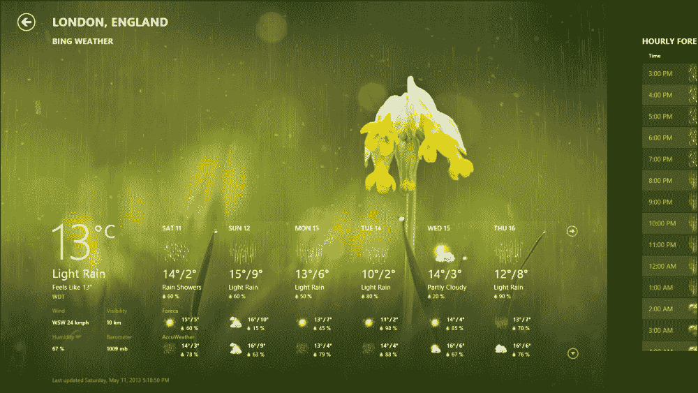
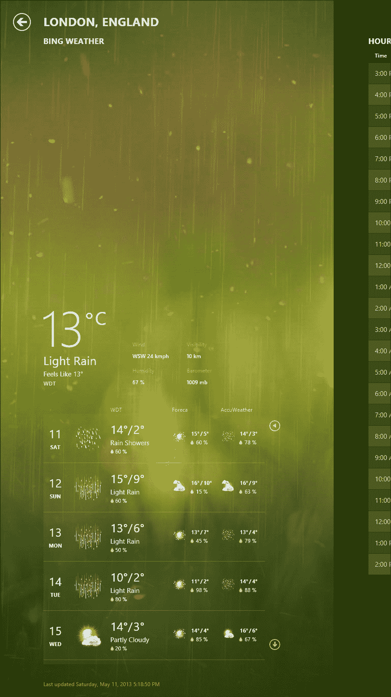
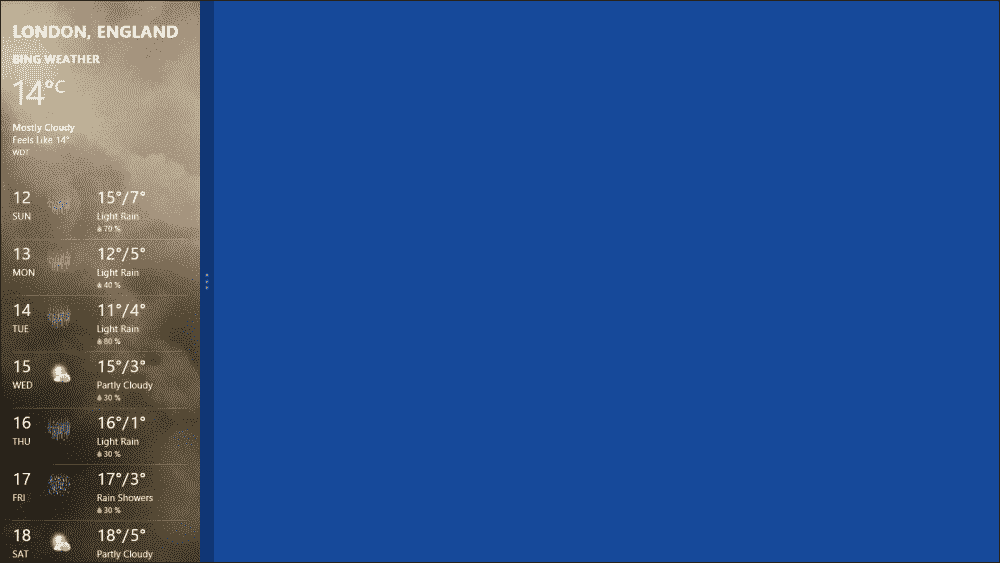
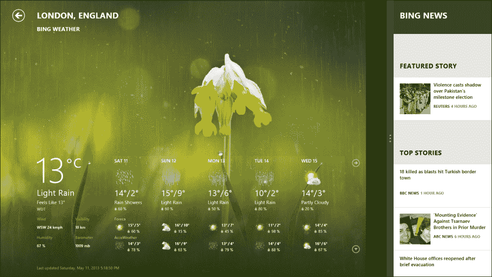
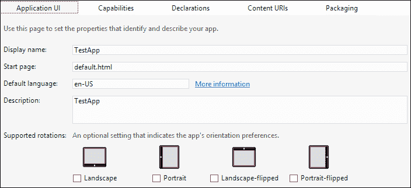
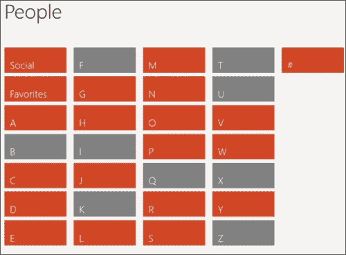
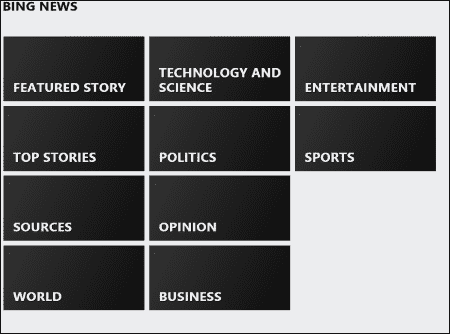

# 第六章：使应用具有响应性

在本章中，我们将学习应用程序可能存在的不同视图状态以及我们如何使应用程序适应这些视图状态以及各种外形因素和显示尺寸。Windows 8 针对不同的平台，并在具有不同尺寸的各种设备上运行，从大型高清显示器和大笔记本电脑到 10 英寸宽屏平板电脑和 4 英寸宽智能手机。因此，为了遵守 Windows 8 用户体验指南，当用户在这些不同设备上查看应用程序时，他们翻转屏幕以在纵向和横向之间切换，他们放大或缩小，或者应用程序在各种视图状态之间切换，应用程序应该保持相同的视觉感受和功能。应用程序应提供流畅灵活的布局，使其用户界面能够优雅地重新流动并适应这些变化。

在本章中，我们将学习如何使应用程序具有响应性，以便它能够处理屏幕大小和视图状态的变化，并响应放大和缩小。我们首先介绍应用视图状态的概念，然后学习如何使用 CSS 和 JavaScript 处理视图状态的变化。最后，我们将学习有关应用中的语义缩放的概念。

# 介绍应用视图状态

视图状态代表了用户可以选择以显示应用程序的方式。有四种可能的应用程序视图状态；它们在这里列出，每个的描述如下：

+   **全屏横向视图**：使用这种模式，应用会填满整个屏幕，这是所有 Windows 商店应用的默认状态。

+   **全屏纵向视图**：使用这种模式，应用会再次填满整个屏幕，但这次是纵向的。

+   **吸附视图**：使用这种模式，应用程序填满整个屏幕的狭窄区域（320px），位于屏幕的左侧或右侧；因此，屏幕将同时显示两个应用程序。

+   **填充视图**：使用这种模式，应用程序会与一个“吸附”的应用程序并排运行，并填充屏幕上未被该应用程序占据的区域；因此，屏幕将再次同时显示两个应用程序。

如果我们观察前面的图片，将会看到两个应用程序并排运行；一个处于“吸附”视图，另一个处于填充视图。用户通过将另一个应用程序（天气应用）或窗口拖到屏幕上，将一个应用程序（必应新闻）“吸附”到一边。第二个应用程序将成为当前运行的应用程序，并具有填充视图状态，而之前的全屏应用程序将被吸附到一边。现在，用户可以通过按下 Windows 键和句点（*.*）来切换这些应用程序的视图状态，在“吸附”和“填充”之间切换。

应用程序“吸附”后，其大小会被调整为 320 像素宽，这使得它可以与其他应用程序共享屏幕，从而实现同时显示两个应用程序，使用户能够多任务操作。

### 注意

只能在水平分辨率大于或等于 1366 相对像素的显示器上拥有吸附和填充视图。这是因为吸附视图将占用屏幕两侧的 320 像素。所以，剩下的 1046 像素将分配给分隔符（22 像素）和填充视图中的应用，填充视图中的应用必须始终具有 1024 相对像素或更大的水平分辨率。因此，1366 x 768 的大小被认为是参考点。

应用总是可以被手动或自动吸附，手动吸附是指用户将其吸附到屏幕的任一侧，自动吸附是指响应另一个应用被拖入全屏模式。因此，你不能阻止应用进入吸附视图。由于用户可以将每个应用吸附起来，如果你没有为应用的吸附视图状态设计，系统将会无论如何调整你的应用大小，可能会裁剪内容，使应用的外观变得混乱。

另一方面，旋转不是强制的，你可以选择让应用支持或不支持。所以，如果你的应用不支持纵向旋转，用户把设备翻转过来，你的应用也不会有任何变化；也就是说，应用不会随着新设备的旋转而旋转。话说回来，当然，为了拥有一个满意的用户，强烈建议支持旋转，毕竟，用户才是应用的目标。

当你点击并打开`package_appmanifest`文件时，你可以设置应用程序 UI 的选项；这些选项之一是**支持的旋转**，这是一个可选设置，表示应用的朝向偏好，有四个值：**横向**、**纵向**、**横向翻转**和**纵向翻转**，如下面的屏幕截图所示：



# 处理视图状态

为了适应吸附视图，有两种方法：使用 CSS3 媒体查询或使用 JavaScript 布局变化事件，有时两者都需要。我们用媒体查询来处理可以通过 CSS 样式的元素大小、元素显示（内联、块）和元素可见性来解决的布局变化。通过使用 CSS 媒体查询，可以非常容易地定义不同的样式，这些样式将根据应用的视图状态应用。你可以为每个视图状态使用一个单独的媒体查询，或者通过结合多个媒体查询将相同的样式集应用于多个视图状态。下面的代码展示了匹配不同视图状态的媒体查询的语法；第一个匹配吸附视图状态，第二个匹配视图状态的组合。

```js
@media screen and (-ms-view-state: snapped) {
}
@media screen and (-ms-view-state: fullscreen-landscape), 
  screen and (-ms-view-state: fullscreen-portrait), 
  screen and (-ms-view-state: filled) {
}
```

所以，如果我们有一组类和其他选择器在 UI 中指定样式，我们可以用每个媒体查询改变这些样式。例如，下面的代码显示了定义为 CSS 网格的两列的页面包装`div`；一旦进入`media`查询中的视图状态`snapped`，它就变成了单列布局：

```js
.appGrid {
display: -ms-grid;
-ms-grid-columns: 120px 1fr; /* 2 columns */
-ms-grid-rows: 120px 1fr;
width: 100vw;
height: 100vh;
margin-left: 120px;
}

@media (-ms-view-state: snapped) {
 /*styles that will be applied when in snapped view state*/
  .appGrid {
    display: -ms-grid;-ms-grid-columns: 1fr; /* 1 column fills the available space */
    -ms-grid-rows: 120px 1fr;
    width: 100%; height: 100%;
    margin-left: 20px; /* margin decreased from 120 to 20 px*/
}
}
```

前述代码中为宽度值和高度值设置的单位`vw`和`vh`分别代表视图宽度和视图高度，它们指定了应用占用的完整宽度和高度分辨率。

前面的代码示例展示了 CSS 网格的使用，这是实现流体和适应性 UI 布局的一种非常方便的方法，该布局可以处理视图状态的变化。这是因为网格会自动扩展以分配内容和填充可用空间，并且允许你仅通过 CSS 来指定其内部的元素位置，而与它们在 HTML 标记中的指定顺序无关。这使得指定不同屏幕大小或不同视图状态下的元素不同排列变得容易。

处理窗口大小变化的第二种方法是使用 JavaScript 事件，当需要处理行为和属性的变化时，这是最好的选择，这些变化不能用 CSS 样式来指定，比如`WinJS`列表视图控制器的滚动方向和控件变化（例如，将水平按钮列表更改为下拉列表控件）。如果我们以列表视图控制器为例，它使用网格模式以填充容器元素和可用空间的方式垂直和水平显示项目，当应用处于横屏、竖屏或填满状态。但是当应用被 snapped 时，列表视图控制器应该重新排列并仅垂直显示项目，以避免使用列表模式进行水平滚动。列表和网格模式不能在 CSS 中指定，因为它们是在`data-win-options`属性中定义的，如下所示：

```js
data-win-options="{ layout: {type: WinJS.UI.GridLayout} }
```

这里就是 JavaScript 事件发挥作用的地方，通过注册一个窗口大小变化事件的监听器，我们可以创建特定于视图的布局，该监听器查询由 WinRT 提供的`ViewManagement.ApplicationView.value`属性，直接查询应用的当前视图状态。下面的示例展示了窗口大小变化事件的监听器的代码：

```js
window.addEventListener("resize", function (e) {
   var viewState = Windows.UI.ViewManagement.ApplicationView.value;
   var snapped = Windows.UI.ViewManagement.ApplicationViewState.snapped;

   if (viewState === snapped) {
        that.listView.layout = new WinJS.UI.ListLayout();    
}
   else if (viewState!== snapped)
    {        
     that.listView.layout = new WinJS.UI.GridLayout(); 
}
});
```

### 注意

列表视图（ListView）和网格（Grid）是灵活的控制组件，它们能以最小的开发工作提供对用户界面的最大控制，因为两者都支持内置的灵活布局，并能自动安排和分布其内容。你应尽可能地尝试使用它们。

# 理解语义缩放

根据 Windows Store 应用的 UX 指南，内容是水平流动的，用户可以通过鼠标或触摸，从左向右或从右向左滚动内容（在某些语言中）。但想象一个场景，你有一个包含大量数据的内容，比如电话簿或者新闻文章列表，在这种情况下，滚动内容以导航变得对用户来说很繁琐。在电话簿应用中，联系人按字母顺序组织，用户必须滚动到最后才能找到一个以字母 z 开头的联系人；也就是说，在列表的末尾，而用户可以缩放到只列出字母的视图级别，并找到那个字母下具体的一个联系人。

同样的，对于一个按类别组织项目/文章的目录应用或新闻应用也适用；不必长时间滚动滚动条以达到所需内容，特别是那些恰巧位于列表末尾的类别，用户可以缩放到类别级别。下面的屏幕快照分别显示了 Windows 8 上的 People 应用和 Bing News 应用的“缩放出”视图：



以下是 Bing News 应用在 Windows 8 中的语义缩放视图：



### 注意

语义缩放交互是触摸优化的，因此可以通过捏合和拉伸手势来执行。另外，用户可以通过鼠标滚轮滚动或按住*Ctrl*键并按加号（+）或减号（-）键使用键盘来进行缩放。

这种技术称为**语义缩放**，Windows Store 应用使用它来在单个视图中呈现大量相关内容的两个详细级别，并提供更快的导航。这种技术使用同一内容的两个缩放级别来组织数据：一个“缩放进”的详细视图，这是应用显示的默认模式，以及一个“缩放出”视图，它根据某些元数据将项目分组显示。

为了给应用提供语义缩放功能，我们将需要定义这两种语义级别的模式。幸运的是，`WinJS.UI`为我们提供了使用`WinJS.UI.SemanticZoom`对象的最佳方式，该对象将渲染一个语义缩放控件，使用户能够缩放同一内容的两个不同的视图。缩放控件使用两个子控件来渲染这两个不同的视图；第一个子控件将提供缩放出视图，另一个将提供缩放进视图或相反。如以下代码所示，声明语义缩放控件在标记或脚本中非常简单：

在 HTML 中：

```js
<div data-win-control="WinJS.UI.SemanticZoom">
  <!-- zoomed-in view -->
  <!-- zoomed-out view -->
</div>
```

在 JavaScript 中：

```js
var object = new WinJS.UI.SemanticZoom(element, options);
```

定义了`SemanticZoom`控件之后，让我们向其中添加两个子控件，以容纳两个视图。

请注意，子控件应通过实现`IZoomableView`接口来支持语义缩放功能，这样控件就可以作为`SemanticZoom`控件的放大或缩小视图暴露出来。目前，Windows 库 for JavaScript 提供的唯一支持此功能的控件是 ListView 控件。因此，两个子控件将是两个 ListView 控件的实例，如下面的代码所示：

```js
<!-- zoomed-in view -->
  <div data-win-control="WinJS.UI.SemanticZoom">
    <div id="zoomedInView" data-win-control="WinJS.UI.ListView" >
    </div>

<!-- zoomed-out view -->
    <div id="zoomedOutView" data-win-control="WinJS.UI.ListView">
    </div>
  </div>
```

现在我们需要一些数据来在这些两个视图中显示。你还记得我们在第四章《使用 JavaScript 开发应用程序》中创建的数据数组吗？当我们开始介绍 ListView 控件时。好吧，让我们再次使用它并添加更多名称。随意添加你喜欢的任何内容；以下是为了参考再次给出的数据：

```js
var dataArray = [
    { name: "John Doe", country: "England", age: "28" },
    { name: "Jane Doe", country: "England", age: "20" },
    { name: "Mark Wallace", country: "USA", age: "34" },
    { name: "Rami Rain", country: "Lebanon", age: "18" },
    { name: "Ryan Air", country: "England", age: "18" },
    { name: "Foster Mane", country: "England", age: "18" },
    { name: "Doe Jane", country: "England", age: "18" },
    { name: "Bow Arrow", country: "England", age: "18" },
    { name: "Amy Sparrow", country: "Italy", age: "18" },
    { name: "Jean Trops", country: "France", age: "56" }

    ];
//create a list object from the array    
var bindingList = new WinJS.Binding.List(dataArray);
```

现在，我们需要创建一个包含分组信息的此数据源的版本。我们可以使用`createGrouped`方法来实现，该方法允许我们创建列表的组版本。我们在上一章学习了类似的方法，`createdFiltered`和`createSorted`。`createGrouped`方法在列表上创建一个分组投影，并接受以下三个函数参数：

+   `getGroupKey`：此方法接收列表中的一个项目，并返回该项目所属的分组键。

+   `getGroupData`：此方法接收列表中的一个项目，并返回代表该项目所属分组的对象的数据。

+   `compareGroups`：如果第一个组的价值小于第二个组，则返回负值；如果两个组的价值相同，则返回零；如果第一个组的价值大于第二个组，则返回正值。

以下代码将创建一个包含我们`bindingList`对象的组版本，该对象使用每个项目名称的第一个字母来定义元数据：

```js
// Sort the group
function compareGroups(leftKey, rightKey) {
return leftKey.charCodeAt(0) - rightKey.charCodeAt(0);   
}

// Get the group key that an item belongs to.
function getGroupKey(dataItem) {
return dataItem.name.toUpperCase().charAt(0);   
}

// Get a title for a group
function getGroupData(dataItem) {
return {
    title: dataItem.name.toUpperCase().charAt(0);
}; 
}
// Create the groups for the ListView from the item data and the grouping functions
    var groupedItemsList = bindingList.createGrouped(getGroupKey, getGroupData, compareGroups);
```

为了将分组数据绑定到放大视图的`ListView`控件上，我们将它的`itemDataSource`属性设置为`groupedItemsList.groups.dataSource`，它包含分组信息，并将放大视图的`ListView`控件的`itemDataSource`属性设置为`groupedItemsList.dataSource`，它包含要显示的项目，如下所示：

```js
var zoomedInView = document.getElementById("zoomedOutView").winControl;
var zoomedOutView = document.getElementById("zoomedOutView").winControl;

zoomedInView.itemDataSource = groupedItemsList.dataSource;

zoomedOutView.itemDataSource = groupedItemsList.groups.dataSource;
```

有了这些知识，你可以按照我们在第四章《使用 JavaScript 开发应用程序》中学到的内容，为视图创建模板，以便更好地展示数据。

# 总结

在本章中，我们介绍了用户可以选择显示应用程序的不同视图状态。然后，我们学习了如何通过 CSS 和媒体查询或使用检测窗口大小的 JavaScript 事件处理程序来适应这些视图状态的变化。

最后，我们学习了语义缩放以及如何轻松地将此功能集成到应用程序中。

在下一章节中，我们将学习关于动态磁贴的知识，如何向应用图标添加磁贴和徽章，以及如何使磁贴具有动态效果，并从应用向用户发送通知。
