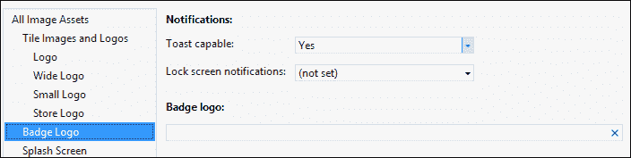

# 第七章： 用磁贴和通知让应用上线

Windows 8 的**开始**屏幕上闪烁着磁贴，这些磁贴不仅仅是与特定应用相关的大图标。在本章中，我们将学习应用磁贴的概念、磁贴类型以及每个磁贴的用途。此外，我们还将了解如何为应用定义这些磁贴。然后，我们将介绍通知以及不同的通知方法，并编写代码创建并实现应用的简单通知。

# 介绍磁贴、徽章和通知

Windows 8 应用的独特特性之一就是磁贴的概念。而且，正是这些磁贴使得 Windows 8 应用与众不同。应用用色彩的盛宴、标志和信息装饰**开始**屏幕。磁贴是应用在**开始**屏幕上的图形表示。另外，应用磁贴是应用的启动点；点击磁贴将启动应用程序，这与我们桌面上的 Windows 应用快捷方式类似。

以下是一张来自全新安装后的**开始**屏幕的截图，显示了几块应用磁贴：


每个已安装的应用都有一个默认磁贴，在安装后立即添加到**开始**屏幕上。这个默认磁贴有一个默认的标志图像，代表应用标志或任何其他品牌来识别应用。默认情况下，磁贴上显示静态内容，包含指定应用名称的文本和代表标志的图像。之前的截图展示了 Windows 8**开始**屏幕上基本应用磁贴的例子。你可以在之前的截图中注意到磁贴有两种尺寸：正方形（150x150）px 和矩形（310x150）px。按照 Windows 8 的命名约定，这两种尺寸分别是正方形和宽磁贴。正如你所看到的，这两种尺寸都显示文本和图像以及一个通知徽章来显示某种状态；我们稍后会看到徽章是什么。所有应用都默认支持正方形磁贴；支持宽磁贴是可选的。如果一个应用没有为默认磁贴提供宽标志图像，用户将无法从**开始**屏幕菜单中把应用磁贴放大。另外，如果应用包括了宽标志图像，Windows 8 会默认以宽格式显示磁贴。

用户可以通过切换宽磁贴和正方形磁贴来个性化他们的**开始**屏幕，只要应用磁贴包含两个版本。如果一个应用没有包含宽标志，用户将无法把磁贴放大。用户可以右键点击应用，**开始**屏幕应用栏将出现。从那里，用户可以点击**放大**选项来更改磁贴的大小。下面的截图展示了用户如何将**商店**应用的磁贴从正方形更改为宽磁贴。


Windows 8 只要没有通知要显示，就会显示默认磁贴图像，当通知到期时，或者当用户关闭实时通知时，它会恢复到默认图像。磁贴的大小和其他图像（如**小标志**，显示在搜索结果旁边应用名称旁边，和**商店标志**，显示在 Windows 商店上）都包含在应用包中，并在应用清单中的**应用 UI**面板的**磁贴图像和标志**设置下指定。在清单编辑器中，我们可以为磁贴指定背景颜色，显示在磁贴上的文本颜色，以及应用的简称；更重要的是，我们可以浏览（并选择）不同磁贴大小的图片，如下面的屏幕截图所示：


如果你检查你在前几章中创建的**开始**屏幕上的`test`应用，你会看到应用磁贴显示 150x150 像素默认标志的图片；它填满了方形磁贴，无法放大。尝试选择一个**宽标志**来运行应用，然后将应用磁贴放大以查看更改。磁贴的内容是基于 Windows 提供的一套模板在 XML 中定义的，以保持 Windows 8 的外观和感觉。磁贴的内容可以在这些模板中定义，通过提供相应的文本或图片，或者两者都有。磁贴还显示徽标或简称。

除了默认磁贴外，还有辅助磁贴，它允许用户在**开始**屏幕上显示特定应用的内容。辅助磁贴是通过应用栏中的**固定到开始**选项创建的，用户可以选择将应用的特定位置或内容固定到**开始**屏幕上。当从辅助磁贴启动应用时，用户会被引导到应用中的特定位置。例如，我们可以将**人**应用中的一个联系人固定下来，辅助磁贴会个性化**开始**屏幕，显示该联系人的更新信息；或者，也许我们可以固定一个城市的**天气**。辅助磁贴允许用户个性化对他们重要的**开始**屏幕信息。下面的屏幕截图显示了天气应用的两个磁贴；左边是显示当前位置**天气**的默认磁贴，右边是显示伦敦市天气的固定内容的辅助磁贴：


应用图块可以在应用未运行时传达与应用相关的状态信息，使用一个通知徽章来表达总结或状态信息，数值在 1 到 99 之间（数值大于 99 将显示为 99+）或者它可以是一组 Windows 提供的图像符号，称为**图标**。徽章出现在图块的右下角，并且可以同时在正方形和宽图块上展示。

应用的另一个与 UI 相关的概念是提示通知；这是一个出现在屏幕右上角的弹出通知。提示通知允许当应用不在屏幕上运行时，即使用户正在使用另一个应用，或者当在桌面而不是 Windows 8 的**开始**屏幕上时，应用向用户发送信息。

### 提示

需要注意的是，应用图块不应作为广告表面使用。根据 Windows 商店应用的条款，在大多数情况下，使用图块来展示广告是不允许的。

## 使用动态图块

应用图块是您应用的核心部分；很可能是它是最常被看到的部分。这就是为什么您应该利用这个图块来吸引用户注意力，并通过实现一个动态图块让他们回到应用中。动态图块是吸引用户到您应用的理想方式之一，通过展示显示应用内部最佳情况的的重要信息。例如，Windows 8 中的**人**应用有一个动态图块，它会定期间隔更改联系人的图片。

与静态图块显示不同，默认内容通常是一个完整的图块标志图像和指示应用名称的文本，动态图块可以更新默认图块以显示新内容。动态图块可以用来让用户了解他们的联系人，显示事件信息，或显示最新消息。此外，动态图块可以显示应用更新的摘要，例如未读邮件的数量，从而给用户一个启动应用的理由。

# 发送通知

图块、次要图块、锁屏图块和提示可以通过多种类型的通知进行更新。这些通知可以通过本地 API 调用或从运行在云上的某些服务调用生成。此外，有四种不同的通知传递方法可以发送图块和徽章更新以及提示通知。这些方法包括以下内容：

+   **本地**：当应用在屏幕上或后台运行时发送通知，以更新应用图块或徽章，或者弹出一个提示通知。

+   **定时发送**：在已知的时间发送通知，例如，即将到来的约会的提醒。

+   **周期性**：通过定期轮询固定时间间隔从云服务器获取新内容的方式发送通知；例如，每 12 小时更新一次天气。周期性通知与图块和徽章一起工作，但不适用于提示。

+   **推送通知**：它即使应用程序没有运行，也能直接从云服务器向屏幕发送通知。推送通知非常适合于包括实时数据的情况，比如社交网络更新或时间敏感信息，如即时消息或突发新闻。此通知方法可用于磁贴、徽章和弹出式通知。

默认情况下，本地磁贴通知不会过期，但可以给予并且理想情况下应该给予一个过期时间；然而，推送、周期性和计划性通知在提供后三天过期。通过指定一个过期时间，应用程序可以在磁贴在达到过期时间时仍然显示时，从磁贴中删除通知内容。

选择通知方法主要取决于您想要传递的信息以及应用程序的性质和内容。

### 小贴士

请记住，用户可以随时关闭或打开磁贴通知，因此要小心不要因不必要的弹出式通知而让用户感到困扰。

为了实现通知功能并允许应用程序传输弹出式通知，我们必须在清单文件中将应用程序声明为支持弹出式通知。一旦应用程序被声明为支持弹出式通知，它将被添加到**PC**设置中**通知**部分的 app 列表中。下面的屏幕截图显示了如何更改**支持弹出式通知**设置：



现在让我们编写一些代码来创建一个简单的本地弹出式通知。我们将需要非常频繁地使用`Windows.UI.Notifications`命名空间；因此，为了简化，让我们声明一个命名空间变量，如下所示：

```js
var notifications = Windows.UI.Notifications;
```

接下来，我们需要通过从 Windows 提供的模板中选择一个来提供`ToastTemplateType`；这些模板确保应用程序在弹出式通知中保持预期的 Windows 8 外观和感觉。有文本模板，如：**toastText01**、**toastText02**、**toastText03**、**toastText04**。图像和文本模板有：**toastImageAndText01**、**toastImageAndText02**、**toastImageAndText03**、**toastImageAndText04**。

`WinJS`为这些模板提供 IntelliSense，当我们对通知变量调用`ToastTemplateType`枚举时，这些模板将被列出，如下面的屏幕截图所示：


在这个例子中，我们将选择`toastText01`，它只包含一个文本字符串，最多跨越三行。如果文本超过三行，它将被截断。然后我们将获取一个 XML 文档的模板内容，如下面的代码所示：

```js
var template = notifications.ToastTemplateType.toastText01;
var templateXML = notifications.ToastNotificationManager.getTemplateContent(template);
```

`templateContent`变量将包含以下 XML 骨架：

```js
<toast>
  <visual>
    <binding template="toastText01">
      <text id="1"> </text>
    </binding>
  </visual>
</toast>
```

接下来我们需要做的是填充这个 XML 模板的内容，因此我们需要检索具有标签名`text`的元素，如下面的代码所示：

```js
var toastTextElements = templateContent.getElementsByTagName("text");
toastTextElements[0].appendChild(templateXML.createTextNode("This is a new toast notification"));
```

然后我们根据刚刚指定的 XML 内容创建弹出式通知，如下所示：

```js
var newToast = new notifications.ToastNotification(templateXML);
```

最后，我们将创建一个`toastNotifier`变量，它将把我们在以下代码中定义的`newToast`通知发送到屏幕：

```js
var toastNotifier = notifications.ToastNotificationManager.createToastNotifier();
toastNotifier.show(newToast);
```

在`WinJS.UI.processAll()`方法上调用`then()`函数时编写要执行的代码；因此，当应用程序启动时，就会出现弹出通知。如果我们现在运行应用程序，屏幕右上角将弹出以下通知：


### 提示

请注意，应用于通知的背景颜色是应用程序清单中为应用程序磁贴声明的颜色。

之前的代码允许我们实现一个最小的通知；您可以尝试使用其他的通知模板并比较结果。

# 总结

在本章中，我们介绍了磁贴、徽章和通知的概念，并学习了它们之间的区别以及我们可以使用它们的地方。

我们还学习了如何发送通知，并编写了一个示例代码，实现了向屏幕发送一个非常简单的通知。

在下一章中，我们将学习如何使用 Windows Live 服务来实现用户认证，并允许用户使用他们的电子邮件 ID 登录。
