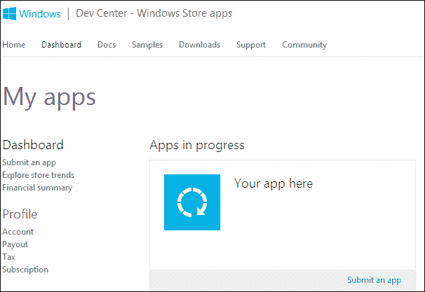

# 第八章．用户登录

一个 Windows 商店应用可以针对登录应用的个人用户进行个性化设置；因此，使得认证过程非常简单是非常重要的。Windows 8 允许用户使用 Microsoft 账户登录他们的设备，从而使开发者更容易为应用用户提供单点登录体验。此外，Windows 8 提供了一个**软件开发工具包**（**SDK**）和一组 API，以便 Windows 商店应用能够使用 Microsoft 账户实现单点登录，并与 Microsoft SkyDrive、Outlook.com 和 Windows Live Messenger 中的信息集成。在本章中，我们将学习关于 Live Connect API 以及如何使用此 API 登录用户并获取用户资料信息。我们将学习如何开始使用 Live Connect 集成应用，并展示一些代码，介绍 Live Connect API 可以执行的一些基本功能。

# 介绍 Live Connect

有很多场景，应用需要认证用户并访问他们的资料信息，从简单地显示带有用户姓名的欢迎信息，到访问他们的资料信息，并为用户提供个性化体验。此外，你可以通过与允许与文档和媒体协作并访问云上文件或与 Outlook 协作处理联系人和日历的产品和服务集成，构建提供强大功能的应用。你的应用需要与 Microsoft 账户集成认证的场景可以总结如下：

+   应用需要用户登录才能运行，例如，一个联系人应用

+   应用可以在用户不登录的情况下运行，但对于登录的用户，它能提供更加个性化的体验；例如，一个天气或新闻应用

+   应用包含一些与 SkyDrive 或 Hotmail 集成的功能，因此需要 Microsoft 账户登录

认证过程以及与 Microsoft 云服务（如 Microsoft SkyDrive 和 Outlook）的集成使用 Live Connect 实现。Live Connect 是一组 API，允许将应用与这些兼容服务集成。这些 API 由 Live SDK 提供，它是开发应用的 Microsoft 软件开发工具包之一。Live Connect API 利用一个开放标准，使你能够专注于实现功能，而不是在学习新概念上花费时间，而你想要做的只是实现由这个新概念引入的功能。例如，你可以使用**开放认证**（**OAuth**）标准与 Facebook 和其他社交网络 API 的认证服务集成，而无需了解这些社交网络 API 内部认证过程的工作原理；更重要的是，你可以使用你熟悉的编程语言进行调用。Live Connect 使用的开放标准包括以下内容：

+   **OAuth 2.0**：这是 OAuth 协议的最新版本，是一个开放标准，用于验证用户的凭据。包括 Live Connect 在内的社交网络 API 已采用 OAuth 作为其认证标准。OAuth 基本上允许用户使用 Live Connect 授权 Web 服务进行认证，而无需将他们的机密登录凭据与应用程序共享。

+   **代表性状态转换（REST）**：这是一种在实现网络服务时流行的架构风格。在 Windows 商店开发中，REST 允许我们通过 Live Connect API 轻松请求用户信息。这个 REST 实现支持标准的 HTTP 方法，如 GET、PUT、POST 和 DELETE。

+   **JSON**：这是**JavaScript 对象表示法**的缩写，是一种用于表示网络服务中信息的轻量级数据交换格式。Live Connect 以 JSON 格式交换用户信息。例如，当函数请求用户个人资料信息时，该信息将以包含`first_name`、`last_name`等字段的响应对象的形式返回。

在 Windows 8 中，用户可以通过使用他们的微软账户（Hotmail、Live 和 Outlook）登录设备，因此，应用程序可以利用这一功能提供单点登录体验。例如，Windows 8 的主要应用程序，如人脉、邮件和信息，以及微软网站，如 Outlook 和 Bing，都可以利用单点登录，所以用户在登录到电脑后不需要再登录这些应用程序和网站；这些过程将由系统代为完成。我们开发的应用程序可以通过实现 Live Connect API 的功能来实现相同的效果，这样如果用户已经登录到设备，他们就可以直接在我们的应用程序中进行认证。

在我们开始使用 Live Connect 功能之前，有两个先决条件：

+   在 Windows 商店注册应用程序

+   在 Windows 商店仪表板中为 Windows 商店应用程序配置 Live Connect 设置

首先，我们需要在 Windows 商店仪表板中注册应用程序，该仪表板可以通过以下链接访问：

[`appdev.microsoft.com/StorePortals/en-us/Home/Index`](https://appdev.microsoft.com/StorePortals/en-us/Home/Index)

登录到商店仪表板；为此你需要微软账户的凭据，然后你会看到以下屏幕：



这是您的整个应用列表的主页。同时也是新用户首次看到的屏幕。为了让应用开始使用 Live Connect API，必须对其进行注册并相应地配置其设置。此外，对于要使用 Live Connect 的 Windows Store 应用，它需要有一个包含包名和发布者的包身份，这将唯一标识该应用。要获取包身份，我们需要提交应用；这基本上是为您的应用预留一个名称，添加其描述，并提交认证。在这个阶段，我们不需要将应用提交到 Windows Store 进行认证；我们只需要在 Windows Store 开发者账户中为其输入一个名称。为此，我们将首先点击**提交应用**链接，这是您在上一个屏幕快照中注意到的左侧菜单下**仪表盘**下的第一个链接。您将被引导到**提交应用**页面，如下面的屏幕快照所示：


点击**应用名称**为应用提供一个唯一的名称，仅为此应用保留；其他应用不能使用它。如果应用没有完全提交到商店，预留将持续一年。请确保您有权使用该名称，因为应用将在 Windows Store 中以该名称列出。请注意，应用名称应与在应用清单文件中的**DisplayName**字段中输入的名称相同。要继续，请在提供的文本框中输入一个值，然后点击**预留应用名称**；现在名称已被预留；点击**保存**返回应用摘要页面。现在，应用将在仪表板上以包含**删除**和**编辑**链接的磁贴状框中列出。下面的屏幕快照显示了一个用于示例的测试应用：


接下来我们需要为应用配置 Live 服务。为此，请按照以下步骤操作：

1.  如果您在仪表板页面，找到您的应用并点击**编辑**。您将被引导到应用摘要页面。

1.  点击**高级功能**。

1.  点击**推送通知和 Live Connect 服务信息**。

1.  您将被引导到**推送通知和 Live Connect 服务信息页面**，并需要遵循标题下**如果您的应用使用 Live Connect 服务，请审查**的步骤。包括以下步骤：

    +   识别您的应用

    这包括在应用的清单中定义正确的身份值。这些值在我们预留应用名称时创建。我们可以用两种方式设置这些值：

    1.  我们可以通过使用 Visual Studio 2012 中的**商店**菜单为 Windows 8 应用设置应用的身份值。在一个打开的项目中，在顶部菜单中点击**项目**；然后从出现的菜单中选择**商店**，导航到子菜单，并点击**将应用与商店关联**。跟随并完成向导，该过程在下方的屏幕截图中说明：

        在向导的第一个步骤中，如前屏幕截图中数字 2 所标记的，你将会被提示使用你的 Microsoft 账号进行登录。

    1.  另外，我们也可以在应用清单文件中手动设置应用的包身份。用文本编辑器打开你的应用的 `AppManifest.xml` 文件，并使用 `Name` 和 `Publisher` 值设置 `<identity>` 元素的这些属性。当你在 Windows Store 上预留你的应用名称时，Windows Store 创建了这些值，你可以从 Windows Store 仪表板中获取。下面的代码显示了包含这些值的 XML 设置节的语法：

        ```js
        <Identity Name="19474XXX.BookTestApp" Publisher="CN=F0476225-496D-4EDF-946E-46F6247D5B9A"" />
        ```

        +   认证你的服务

    这一步骤包括获取客户端密钥值。Live Connect 服务使用客户端密钥来认证从你的服务器发出的通信，以保护你的应用的安全。下面将显示以下客户端密钥：

    **zqMKo4G0t3ICZe1h06ofrKYZ1/hVuZXn**。

    请注意，你总是可以回到该页面并创建一个新的客户端密钥，如果有需要的话。

    +   向 Live Connect 用户代表你的应用

        这是配置 Live Connect 服务信息的最后一步，涉及指定 Live Connect 服务用来提示用户授权访问和交互他们数据的意图对话框的设置。在这一步中，你可以提供他们到你自己的服务条款和隐私政策的链接，并上传你的应用标志在授权对话框中显示。

这就完成了在 Windows Store 上应用的注册和配置过程。现在进入编码部分；我们将看看如何实现基本的登录和认证功能。

# 将用户登录到应用

为了开始编码登录功能，我们需要在我们的应用解决方案中引用 Live Connect API；为此，我们首先应该下载并安装 Live SDK for Windows，如果你还没有安装的话。它可以通过以下链接从 *Live Connect 开发者中心* 找到并下载：

[`msdn.microsoft.com/en-us/live/ff621310.aspx`](http://msdn.microsoft.com/en-us/live/ff621310.aspx)

在那页面上，你也可以找到支持 Android 和 iOS 的 Live SDK 版本的下载链接。或者，你可以在 Visual Studio 中直接使用 NuGet 包管理器找到并安装 Live SDK 到你打开的解决方案中。

为此，打开在 Visual Studio 中的应用解决方案，从**解决方案资源管理器**中右键点击解决方案，然后点击**管理 NuGet 包…**

将出现一个对话框，在对话框顶部右上角提供的搜索文本框中输入`livesdk`；包管理器将在线搜索所有包含`livesdk`的相关匹配项。从搜索结果中找到**Live SDK**并单击**安装**。这将安装 Live SDK 包并将其包括在引用中。

下面的屏幕快照显示了屏幕上的**管理 NuGet 包**对话框：


接下来，我们在项目中添加对 Live Connect APIs 的引用。为此，请按照以下步骤操作：

1.  从**解决方案资源管理器**中，右键单击**References**，然后单击**添加引用**。

1.  点击**Windows** | **Extension SDKs** | **Live SDK**。

1.  点击**添加**，然后点击**关闭**。

一旦我们添加了对 Live SDK 的引用，解决方案中就会添加 JavaScript 文件`wl.js`。为了方便，我建议您将此文件复制并粘贴到您的`js`文件夹中。然后我们添加一个指向新添加的`wl.js`的`<script>`元素，这样我们就可以在`default.html`页面中使用 Microsoft IntelliSense for this API，如下面的代码所示：

```js
<script src="img/wl.js"></script>
```

请注意，为`src`属性设置的文件路径包含`///`；我们使用三个反斜杠（\）的原因是因为需要通过三个目录层次结构来到达位于`References`下的`LiveSDKHTML`下的`js`目录中的`wl.js`文件。

添加对此脚本文件的引用将在引用的 HTML 文件中启用 Microsoft IntelliSense。

此外，如果您想要在 JavaScript 层面启用 intelliSense，请在调用此 API 方法的头部的 JavaScript 文件中添加引用，如下面的代码所示：

```js
/// <reference path="///LiveSDKHTML/js/wl.js" />
```

### 提示

建议您将使用`wl.js`的代码写在单独的 JavaScript 文件中。这将使修改和调试应用程序更加容易。

让我们添加一个按钮，当点击时，将提示用户登录并响应同意对话框。

以下标记将添加一个具有 ID`signIn`的`button`和一个具有 ID`log`的`div`。这个`div`将用于在屏幕上显示点击**登录**按钮时发生的内容：

```js
<div id="liveSDK">
  <h1>Windows Live Connect</h1>
<div>
<div>
  The authentication in this section uses the Windows Live connect.
  <br />
  Sign in to your Microsoft account by clicking on the below button:
</div>
<button id="signIn">Sign in</button><br /><br />
<div id="log"><br /></div>
</div> 
</div>
```

首先，通过调用`WL.init`方法初始化 Live Connect APIs（应用程序必须在每页上都调用此函数，然后再调用库中的其他函数），然后在页面加载时订阅`auth.login`事件，如下面的代码所示：

```js
WL.init();
WL.Event.subscribe("auth.login", function () {
  if (WL.getSession()){
    log("You are now signed in!");
  }
});
```

在`auth.login`事件的回调函数中，我们使用`WL.getSession()`方法检查当前会话对象的状态；如果存在，则用户已登录。

接下来，我们将为按钮的点击和日志功能添加登录功能：

```js
document.querySelector("#signIn").onclick = function (e) {
  if (WL.getSession()){ 
    log("You are already signed in!");
}
  else {
    WL.login({ scope: "wl.signin" });
  }
};
//log what is happening
function log(info) {
  var message = document.createTextNode(info);
  var logDiv = document.querySelector("#log");
  logDiv.appendChild(message);
  logDiv.appendChild(document.createElement("br"));
}
```

在用户点击登录按钮时，我们首先检查是否有会话，以及用户是否已经登录。如果没有会话，我们尝试通过调用`WL.login`方法登录用户；这个方法需要一个参数`scope: "wl.signin"`。像`"wl.signin"`或`"wl.skydrive"`这样的作用域值用来表示如果用户同意，应用将能够访问用户数据的哪些部分。

在前面的代码行中，我们使用此格式定义了一个作用域：`scope: "wl.signin"`，这是一个字符串参数。我们也可以定义多个作用域，但格式略有不同，使用字符串值的数组，如下面的代码行所示：

```js
scope: ["wl.signin", "wl.skydrive", "wl.basics"]
```

作用域也可以在初始化库时设置，通过将其作为可选参数传递给`WL.init`方法。此外，`login`方法中输入的作用域值将覆盖并扩展在`init`方法中定义的作用域列表。而且，`WL.init`的作用域值在没有由`login`方法提供的作用域时使用。

`WL.login`函数只能在用户动作响应时调用，比如我们例子中的点击按钮，因为该函数可能导致启动同意页面提示。

`log`函数只接受文本，简单地将它追加到 ID 为`log`的`div`内容中，这样我们就可以获取发生了什么的状态信息。

现在运行应用。您将看到以下截图，提示您登录；随后会出现同意对话框：


按照前一个截图出现的步骤操作。最后，应用将显示消息：**您已登录！**

## 获取用户信息

`login`函数返回一个承诺对象，使我们能够在成功的情况下适当反应，即用户成功登录。我们的目标是获取用户的个人资料信息。因此，我们需要修改之前展示的`WL.login`调用，并请求额外的作用域，如`wl.basic`、`wl.birthday`和`wl.emails`，这将允许我们检索基本个人资料信息，如名字和姓氏，同时也获取用户的生日和电子邮件。在登录方法的成功的回调中，我们然后执行对`WL.api`函数的调用，它返回我们所需的用户个人资料信息。从技术上讲，`WL.api`函数对 Live Connect Representational State Transfer (REST) API 进行调用。`WL.api`调用的语法如下面的代码所示：

```js
WL.api({
    path: "me" ,
    method: "GET"
});
```

在前面的代码示例中，我们传递了`me`快捷方式以请求有关已登录用户的信息。路径参数指定了到 REST API 对象的路径，在本例中为对象`me`，它包含诸如`first_name`和`last_name`的属性；`WL.api`返回一个承诺对象，因此我们可以对其调用`then()`，并在成功回调中请求用户的名字和姓氏，这些信息由作用域`"wl.basic"`提供。代码如下所示：

```js
WL.api({
  path: "me" , method: "GET"
  }).then(
  function (response) {
    log("First Name: " + response.first_name);
    log("Last Name: " + response.last_name);
    log("Email: " + response.emails.preferred);
    log("Birthday: " + response.birth_day + "/" + response.birth_month);
}
```

将之前的代码添加到登录按钮点击处理程序中调用的 `WL.login` 的 `then` 方法中，完整的代码如下：

```js
document.querySelector("#signIn").onclick = function (e) {
  WL.login({
    scope: ["wl.signin", "wl.basic", "wl.birthday", "wl.emails"]
    }).then(
    function (response) {
      WL.api({
         path: "me", method: "GET"
         }).then(
         function (response) {
           log("First Name: " + response.first_name);
           log("Last Name: " + response.last_name);
           log("Emails: " + response.emails.preferred);
           log("Birthday: " + response.birth_day + "/" + response.birth_month);
           }
         );
     }
  );
};
```

现在运行应用，你会注意到同意对话将更改，请求访问有关你的出生日期和电子邮件地址的信息，如下面的屏幕截图所示：


当你批准同意提示后，点击**登录**按钮，应用将显示所请求的信息，如下面的屏幕截图所示：


### 提示

为了遵守微软为 Windows 商店应用设置的指南，你不应该在应用中的任何地方显示 Microsoft 账户登录或登出选项，除了**设置弹出**控件或任务的一部分。用户期望账户管理选项在设置磁贴中，改变其位置会导致用户体验不一致和意外。

# 摘要

在本章中，我们介绍了 Live Connect，并学习了其核心概念，还看到了我们可以使用这些 API 做些什么，应用启动调用 API 所需的设置，以及如何编写基本的代码来调用 API。

我们还涵盖了如何在商店中注册应用，以及如何在 Visual Studio 中与商店通信。

然后我们利用 Live Connect API 登录用户到应用。此外，我们还学会了在用户同意后如何获取会话信息。

在下一章中，我们将学习关于应用栏的知识，如何为应用创建一个应用栏，以及如何向其中添加菜单按钮。
