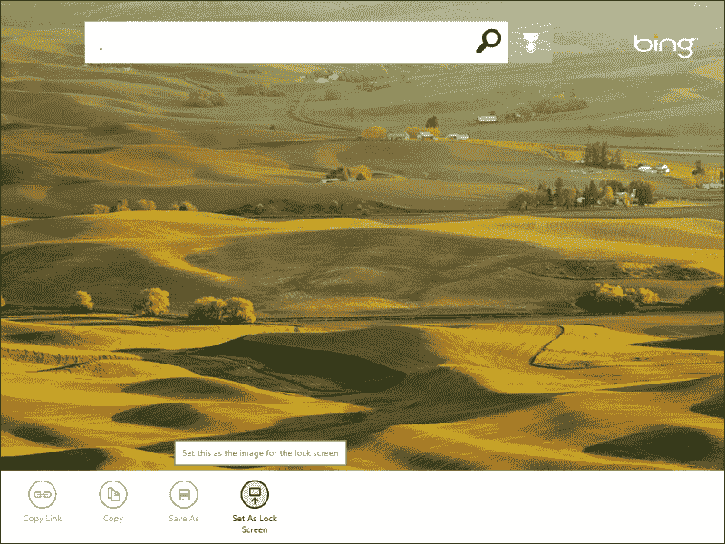
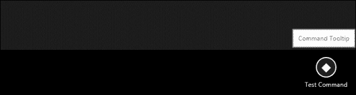
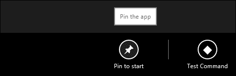

# 第九章：添加菜单和命令

在本章中，我们将学习关于应用栏的知识，并了解它是如何工作的，以及在哪里可以找到应用栏。此外，我们还将介绍如何声明应用栏以及向其添加控件。

# 了解应用栏

当你运行一个 Windows 商店应用时，你所看到的就是一个全屏应用，它让你能够沉浸在应用的内容中；然而，这时你可能自己会想所有的按钮和控件都去哪了。它们都包含并隐藏在应用栏中——当然，直到你需要它们为止——以避免分散注意力，并让屏幕上的每个像素都用于应用的内容。

应用栏位于屏幕底部，当用户触发时会出现。这可以通过触摸手势（通过从底部边缘向上轻触或滑动，或从顶部边缘向下轻触），使用鼠标（通过右键点击），或使用键盘（通过 Windows + *Z*快捷键）来完成。应用栏通常包含与当前屏幕相关的控件。默认情况下，控件在屏幕的左右两侧平均分配。左侧包含当前在应用中显示内容的特定命令，而右侧包含适用于应用所有页面的全局命令。应用栏也可以包含特定于应用中单个元素的命令。

让我们来看一个应用栏的示例。下面的屏幕截图显示了 Microsoft Bing 应用的应用栏，其中包含四个命令，分别是**复制链接**、**复制**、**另存为**和**设为锁屏背景**：



应用栏的隐藏机制使用户能够集中精力并沉浸在内容中，同时将干扰降到最低。它在用户需要时提供一致且易于访问的命令，并且他们可以轻松地显示或隐藏应用栏。

当我们尝试使用鼠标、触摸或键盘显示应用栏时，另一个栏会同时出现在屏幕顶部。这是导航栏，虽然它可能看起来很相似，但它并不是应用栏。导航栏用于显示帮助我们导航应用程序不同部分的控制器。

如果存在应用栏，它应该始终对用户可用，并因此适应用户界面在 snapped 和 portrait 视图之间的变化。例如，如果你在 snapped 视图上看不到所有的命令，你可以尝试将它们组合成菜单并提供命令的提示，尽管 Windows 会自动隐藏标签并相应地调整内边距。

### 提示

强烈建议你不要更改由`WinJS`提供的默认布局应用的按钮的大小或内边距，因为它是为了在所有支持屏幕大小上适配 10 个命令而设计的；更重要的是，它还支持触摸手势。因此，更改布局可能会打乱这种行为。

应用栏是由`WinJS`库使用`WinJS.UI.AppBar`对象提供的。

在标记中声明应用栏非常简单。我们从通过指定`data-win-control`属性中的`WinJS.UI.AppBar`控制来从一个简单的`div`元素创建一个应用栏开始。语法如下：

```js
<div id="testAppBar" data-win-control="WinJS.UI.AppBar"> </div>
```

前面的语法将创建一个空的应用于当通过鼠标或向上滑动触发时显示的应用栏。

应用栏是用来包含命令按钮的，所以让我们在应用栏中添加一个命令按钮。为了创建一个应用栏命令按钮，我们将使用一个`button`元素，并指定其`data-win-control`属性为`AppBarCommand`，如下面的代码所示：

```js
<div id="testAppBar" data-win-control="WinJS.UI.AppBar">
  <button data-win-control="WinJS.UI.AppBarCommand"></button>
</div>
```

前面的语法将在应用中显示一个空的命令按钮。我们可以通过在`data-win-options`属性中指定一些选项来给这个命令按钮添加功能。这些选项如下：

+   `type`：此选项用于从以下值指示命令的类型 - `button`、`toggle`、`separator`和`flyout`。

+   `Id`：此选项用于指定命令的 ID。

+   `label`：此选项用于指定应用栏上显示的文本。

+   `Icon`：此选项用于指定用于显示命令的图标，可以通过从 Windows 提供的`AppBarIcon`列表中选择一个值，例如`pin`、`unpin`、`accept`、`cancel`和`delete`，或者通过指定自定义 PNG 图像文件的路径来指定。

+   `section`：此选项用于指示命令所属的部分，可以是`selection`或`global`。`selection`部分会将命令放在应用栏的左侧，这是为上下文命令或页面特定命令保留的位置，而`global`部分会将命令放在应用栏的右侧，这是为全局命令或应用级别命令保留的位置。

+   `tooltip`：此选项用于指定当用户将鼠标悬停在命令上时显示的信息工具提示（提示）。

以下代码显示了在添加这些选项后，我们声明的前一个示例中的命令按钮的语法将如何：

```js
<button data-win-control="WinJS.UI.AppBarCommand" 
data-win-options="{type:'button', id:'testCmd', label:'Test Command', icon:'placeholder', section:'global', tooltip: 'Command Tooltip' }">
</button>
```

运行应用，您将看到一个应用栏，如图所示：



如您在前面的屏幕截图中所见，应用栏包含一个带有占位符图标的按钮，标记为**Test Command**；当鼠标悬停在上面时，将显示工具提示**Command Tooltip**。

## 为命令添加功能

我们刚刚创建的应用栏目前还不能做什么，所以让我们添加另一个命令并检查其他类型。但在那之前，我们需要在两个命令之间添加一个分隔符；可以通过应用栏默认包含的`hr`元素来创建它，除了命令按钮之外。

`hr`元素还需要设置`data-win-control="WinJS.UI.AppBarCommand"`属性。创建分隔符的语法如下所示：

```js
<hr data-win-control="WinJS.UI.AppBarCommand"data-win-options="{type:'separator', section:'global'}" />
```

在分隔符之后，我们将添加一个新的按钮命令，这次我们选择固定图标；语法将如下所示：

```js
<div id="testAppBar" data-win-control="WinJS.UI.AppBar">
<button data-win-control="WinJS.UI.AppBarCommand" data-win-options="{ type:'button', id:'pinCmd', label:'Pin to start', icon:'pin', section:'global', tooltip: 'Pin the app'}">
</button>
<hr data-win-control="WinJS.UI.AppBarCommand" data-win-options="{type:'separator', section:'global'}" />
<button data-win-control="WinJS.UI.AppBarCommand" data-win-options="{type:'button', id:'testCmd', label:'Test Command', icon:'placeholder', section:'global', tooltip: 'Command Tooltip' }">
</button>
</div>
```

现在运行应用，你应该会看到两个命令按钮，一个带有固定图标，另一个带有占位符图标，以及这两个之间的分隔符，看起来像一个`hr`元素。以下是当用户悬停在标有**固定到启动**的命令上时应用栏的结果屏幕快照：



这些命令在应用栏上看起来很不错，但点击后仍然什么也不做，所以让我们给**固定到启动**命令按钮添加一些功能并开始应用固定。

为了给命令按钮添加一些功能，我们需要从应用栏中获取它们，并为它们添加一个`click`事件处理程序。以下代码获取应用栏并将其设置为变量。然后，它使用应用栏的`Id`属性获取该应用栏中的特定命令，并将其点击事件附加到函数上：

```js
//get the appbar control
var appbar = document.getElementById("testAppBar").winControl;
//get the command and add an event handler to it
appbar.getCommandById("pinCmd").addEventListener("click", clickPin, false);
//function to be called when the command is clicked
function clickPin() {
var dialog = new Windows.UI.Popups.MessageDialog("The pin command in the bar has been clicked.");
dialog.showAsync();
}
```

现在运行应用，并点击**固定到启动**命令按钮；屏幕上将出现一个弹出消息对话框。

应用栏默认位于应用的底部，可以改为位于屏幕顶部；然而，它应该包含导航元素，以将用户移至不同的页面。根据 Windows 8 的 UX 指南，顶部的应用栏是一个导航栏。回到代码，我们可以通过简单地设置应用栏控件的`data-win-options`属性的`placement`属性的值，将应用栏的位置从底部更改为顶部，如下面的代码所示：

```js
<div id="testAppBar" data-win-control="WinJS.UI.AppBar" data-win-options="{placement:'top'}">
```

但是，再次说明，根据 UX 指南，默认和推荐的行为是将应用栏放在底部，因为顶部栏留给了导航命令。

在前面的示例中，我们已经将应用栏添加到了主页面`default.html`，但实际上我们应该选择包含我们应用栏的页面并不是随意的，它取决于其范围，如下所述：

+   如果应用栏包含全局命令，并且应该对所有页面可用，请将其添加到`default.html`页面。

+   如果某个页面（一个`PageControl`对象）包含特定于该页面的命令，并且与其他页面不同，那么请将应用栏添加到该页面。

另外，我们可以在主`default.html`文件中定义一个默认应用栏，然后在该特定页面的加载事件上对应用栏进行所需的修改，这需要与默认命令不同的命令。

# 总结

在本章中，我们了解了应用栏是什么以及我们可以在哪里放置应用的命令和控件。我们还学习了应用栏和导航栏之间的区别。我们看到了应用栏命令是什么以及它们可以持有的不同选项。然后，我们看到了如何创建一个包含命令和分隔符的简单应用栏。

最后，我们了解了如何向应用栏上的任何命令类型添加基本功能。

在下一章，我们将到达 Windows Store 应用的最终目的地；那就是，提交到商店本身，我们将学习如何从 Visual Studio 将应用发布到商店，并在仪表板上处理应用配置。
