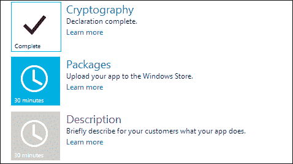
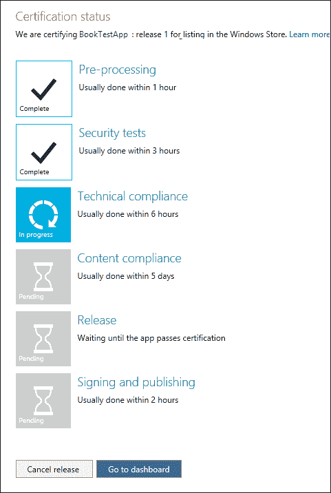
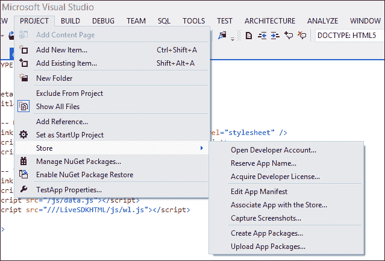
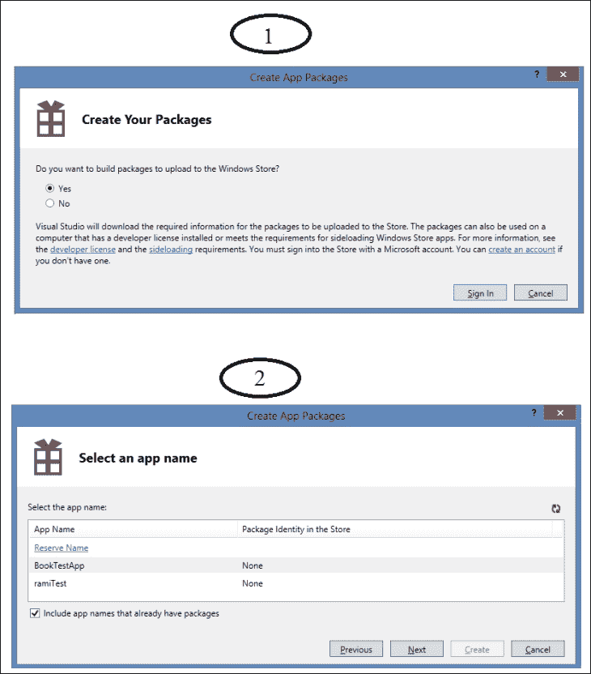
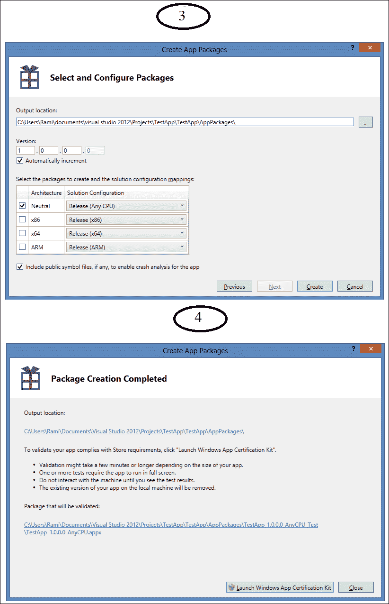
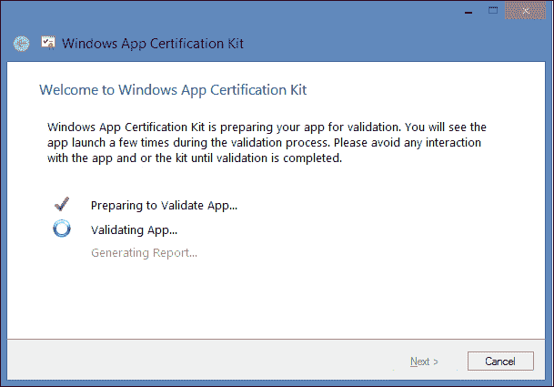
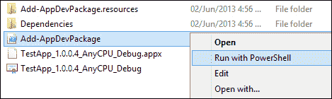
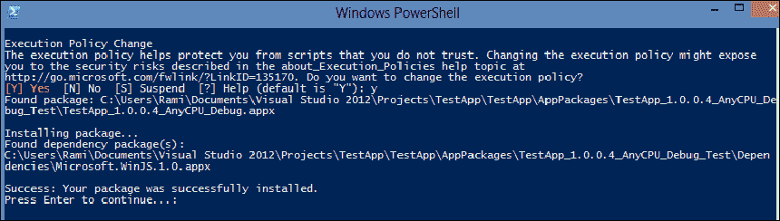

# 第十章：打包和发布

Windows Store 就像一个大型购物中心，你的应用一旦发布到商店，就会像购物中心里的一家小店；Windows Store 仪表板是你将为店铺设置所有品牌、广告和营销材料的地方。Visual Studio 是你的生产环境，商店是你的目的地，两者之间的所有内容都在 Windows Store 仪表板中。在本章中，我们将介绍商店，并学习如何使应用通过所有阶段进入发布。同时，我们还将了解如何在 Visual Studio 内部与商店进行交互。

# 介绍 Windows Store

开发 Windows Store 应用不仅仅是关于设计、编码和标记。导致应用成功的非常关键的一个过程是在 Windows Store 仪表板上完成的。这里是提交应用、为应用铺平市场道路以及监控其在市场上表现的地方。同时，你也可以在这里获取关于你现有应用的所有信息，并计划你的下一个应用。我们在第八章*用户登录*中已经预览了仪表板，当时我们学习了如何添加认证和登录功能。提交过程分为七个阶段，在第八章*用户登录*中，我们在发布概要页完成了第一步，即预留一个应用名称并向 Windows Store 注册应用。为了提交应用以进行认证，还有六个步骤需要完成。如果你还没有打开一个 Windows Store 开发者账户，现在就是打开它的时候，因为你需要它来访问你的仪表板。在注册之前，确保你有一张信用卡。即使你有 entitles you to a free registration 的注册码，Windows Store 也要求使用信用卡来开设开发者账户。

登录后，在主页面**进行中的应用**部分找到你的应用，并点击**编辑**。这将引导你到发布概要页，应用将被命名为**AppName: 发布 1**。每次为同一应用提交新版本时，发布编号将自动递增。发布概要页列出了为你的应用准备 Windows Store 认证的步骤。在这个页面上，你可以输入关于你的 Windows Store 应用的所有信息，并上传其用于认证的包。此刻，你将注意到页面底部的两个按钮，分别为**查看发布信息**和**提交应用以进行认证**，目前这两个按钮是禁用的，并且除非之前的所有步骤都标记为**完成**，否则它们将保持禁用状态。提交进度可以随时保存，以便以后继续，所以这不一定是一次性的任务。我们将逐一介绍这些步骤：

1.  **应用名称**：这是第一步，包括为应用预留一个独特的名称。

1.  **销售详情**：此步骤包括选择以下内容：

    +   **应用程序价格层**：此选项设置应用程序的价格（例如，免费或 1.99 美元）。

    +   **免费试用期**：这是客户可以在开始支付使用费用之前使用应用程序的天数。只有当**应用程序价格层**设置为**免费**时，此选项才启用。

    +   **市场**：在这里，你可以选择你希望应用程序在 Windows 商店中列表的**市场**。请注意，如果你的应用程序不是免费的，你的开发者账户必须为每个你选择的 国家/地区拥有有效的税务档案。

    +   **发布日期**：此选项指定了应用程序在 Windows 商店中列表的最早日期。默认选项是应用程序一旦通过认证就立即发布。

    +   **应用程序类别和子类别**：此选项表明你的应用程序将在商店中列出，进而将应用程序列在**类别**下。

    +   **硬件要求**：此选项将指定 DirectX 功能级别的最低要求以及系统 RAM。

    +   **可访问性**：这是一个复选框，当选中时，表示应用程序已经过测试，符合可访问性指南。

1.  **服务**：在这一步，你可以向你的应用程序添加服务，比如 Windows Azure 移动服务和 Live 服务（正如我们在第八章，*用户登录*中所做的那样）。你还可以提供客户可以在应用程序内购买的产品和功能，称为应用内购买。

1.  **年龄分级和评级证书**：在这一步，你可以从可用的 Windows 商店年龄分级中为应用程序设置一个年龄分级。另外，如果你的应用程序是一款游戏，你还可以上传特定于国家/地区的评级证书。

1.  **加密学**：在这一步，你需要指定你的应用程序是否调用、支持并包含或使用密码学或加密。以下是一些应用程序可能应用密码学或加密的示例：

    +   使用数字签名，如身份验证或完整性检查。

    +   对您的应用程序使用或访问的任何数据或文件进行加密。

    +   密钥管理、证书管理或与公钥基础设施交互的任何内容

    +   使用诸如 NTLM、Kerberos、**安全套接字层**（**SSL**）或**传输层安全**（**TLS**）等安全通信通道。

    +   对密码或其他信息安全形式进行加密。

    +   版权保护或**数字版权管理**（**DRM**）。

    +   防病毒保护

1.  **包**：在这一步，你可以通过上传在 Visual Studio 中创建包过程中创建的`.appxupload`文件，将应用程序上传到商店。我们很快就会看到如何创建一个应用程序包。最新的上传将在发布摘要页的包框中显示，并应标记为**验证完成**。

1.  **描述**：在此步骤中，您可以添加一个简要描述（必填）您的应用程序为客户做什么。描述有 10,000 个字符的限制，并将显示在应用程序列表在 Windows Store 中的**详情**页面。除了描述之外，此步骤还包括以下功能：

    +   **应用功能**：此功能为可选。它允许您列出应用程序的最多 20 个关键功能。

    +   **截图**：此功能为必填项，需要提供至少一张`.png`文件图片；第一张可以是代表您应用程序的图形，但所有其他图片必须是带有标题的直接从应用程序中截取的屏幕快照。

    +   **备注**：此功能为可选。输入您认为客户需要知道的其他信息；例如，更新中的变化。

    +   **推荐硬件**：此功能为可选。列出应用程序运行所需的硬件配置。

    +   **关键词**：此功能为可选。输入与应用程序相关的关键词，以帮助其在搜索结果中出现。

    +   **版权和商标信息**：此功能为必填项。输入将在应用程序列表页面向客户展示的版权和商标信息。

    +   **其他许可条款**：此功能为可选。输入任何对**标准应用程序许可条款**的更改，客户在获取此应用程序时需要接受。

    +   **推广图片**：此功能为可选。添加编辑用于在商店中展示应用程序的图片。

    +   **网站**：此功能为可选。如果有的话，输入描述应用程序的网页 URL。

    +   **支持联系方式**：此功能为必填项。输入支持联系的电子邮件地址或网页 URL，您的客户可以通过该地址寻求帮助。

    +   **隐私政策**：此功能为可选。输入包含隐私政策的网页 URL。

1.  **给测试人员的备注**：这是最后一步，包括添加关于此特定版本的备注，给那些将从 Windows Store 团队审查您应用程序的人。这些信息将帮助测试人员理解和使用此应用程序，以便快速完成测试并为您应用程序在 Windows Store 进行认证。

每个步骤将保持禁用状态，直到完成前一个步骤，并且正在进行中的步骤会被标记上大约需要完成的时间（分钟）。每当一个步骤的工作完成时，在摘要页面上会标记为**已完成**，如下面的屏幕快照所示：

## 提交应用程序以进行认证

在所有步骤都被标记为**完成**后，您可以提交应用程序进行认证。一旦您点击“**提交以进行认证**”，您将收到电子邮件通知，Windows 商店已经收到了您的应用程序进行认证。仪表板将提交应用程序，然后会将您引导到“**认证状态**”页面。在那里，您可以在应用程序进行认证过程中查看其进度，包括以下步骤：

+   **预处理**：这一步将检查您是否已经输入了所有发布应用程序所需的必要详细信息。

+   **安全测试**：这一步将您的应用程序测试是否含有病毒和恶意软件。

+   **技术合规性**：这一步使用 Windows 应用程序认证工具包来检查应用程序是否符合技术政策。同样的评估可以在本地使用 Visual Studio 运行，我们稍后会看到，在您上传包之前，可以进行此评估。

+   **内容合规性**：这一步由商店团队的质量保证人员完成，他们会检查应用程序中的内容是否符合由微软制定的内容政策。

+   **发布**：这一步涉及发布应用程序；除非您在**销售详情**中指定的发布日期是未来的，否则这个过程不会花费太多时间，在这种情况下，应用程序将保持在这个阶段直到那个日期到来。

+   **签名和发布**：这是认证过程的最后一步。在这个阶段，您提交的包将使用与您开发者账户技术细节相匹配的可信证书进行签名，从而向潜在的客户和观众保证该应用程序已通过 Windows 商店认证。

下面的屏幕快照显示了在 Windows Store 仪表板上的认证过程：

无需在那页等待；您可以点击“**前往仪表板**”按钮，您将被重定向到“**我的应用**”页面。在包含您刚刚提交的应用程序的框中，您会注意到“**编辑**”和“**删除**”链接已经消失，取而代之的只有“**状态**”链接，它将带您到“**认证状态**”页面。此外，这个页面将出现一个“**通知**”部分，并列出关于您刚刚提交的应用程序的状态通知，例如：

**BookTestApp: 发布 1 版已提交进行认证。6/4/2013**

当认证过程完成后，您将通过电子邮件收到通知。同时，在仪表板的主页上将添加一个通知，显示认证的结果，无论是失败还是成功，并带有指向认证报告的链接。如果应用程序失败，认证报告将显示需要重新审查的部分。此外，还有一些资源可以帮助您在认证过程中识别和修复可能出现的问题和错误；这些资源可以在以下位置找到：Windows Dev Center 页面的 Windows Store 应用程序部分：

[`msdn.microsoft.com/en-us/library/windows/apps/jj657968.aspx`](http://msdn.microsoft.com/en-us/library/windows/apps/jj657968.aspx)

此外，您随时可以通过仪表板检查应用在认证过程中的状态。

成功完成认证过程后，应用包将被发布到商店，其中包含所有相关数据，这些数据将显示在您的应用列表页面上。用户可以通过这个页面访问数百万 Windows 8 用户，他们可以找到、安装和使用您的应用。

一旦应用被发布到商店并且运行正常，您就可以开始收集遥测数据，了解它在商店中的表现；这些指标包括应用被启动的次数、运行时间以及是否发生崩溃或遇到 JavaScript 异常。一旦您启用了遥测数据收集，商店就会为您应用检索这些信息，分析它们，并在您仪表板上的非常具有信息性的报告中总结它们。

现在我们已经涵盖了将您的应用提交到 Windows 商店所需了解的几乎所有内容，让我们看看在 Visual Studio 中需要做些什么。

# Visual Studio 中的商店

您可以通过**商店**菜单从 Visual Studio 内部访问 Windows 商店。并非我们仪表板上完成的所有事情都可以在这里完成；创建应用包等一些非常重要的功能是由此菜单提供的。在 Visual Studio 2012 Ultimate 中，**商店**菜单位于菜单栏下的**项目**项下，如果您使用的是 Visual Studio 2012 Express，则可以直接在菜单栏中找到它，仅当您在 Windows 商店项目或解决方案上工作时，它才会出现。

我们将详细查看**商店**菜单提供的命令，以下屏幕截图展示了菜单的外观：

**商店**菜单中的命令选项如下：

+   **打开开发者账户...**：此选项将打开一个网页，引导您前往*Windows 开发者中心*，以获取 Windows 商店应用的开发者账户。

+   **保留应用名称...**：此选项将引导您前往 Windows 商店仪表板，并具体指向**提交应用**页面，您可以开始第一步，即保留我们之前在第八章中看到的*签名用户*一节中提到的应用名称。

+   **获取开发者许可证...**：此选项将打开一个对话窗口，提示您使用您的 Microsoft 账户登录；登录后，如果您的账户已经有许可证，它将检索或续签您的开发者许可证。

+   **编辑应用清单**：此选项将打开带有清单设计器的标签页，以便您可以编辑应用清单文件中的设置。

+   **将应用与商店关联...**：此选项将在 Visual Studio 中打开一个类似向导的窗口，其中包含将应用与商店关联所需的步骤。第一步将提示您登录；之后，向导将检索您用于登录的 Microsoft 帐户注册的应用。选择一个应用，向导将自动将以下值下载到本地计算机上当前项目的应用清单文件中：

    +   包的显示名称

    +   包的名称

    +   发布者 ID

    +   发布者的显示名称

+   **捕获屏幕截图...**：此选项将构建当前的应用程序项目并在模拟器中启动，而不是在启动屏幕上。一旦模拟器打开，你可以在模拟器侧边栏上使用**复制屏幕截图**按钮。这个按钮将用于捕获正在运行的应用程序的屏幕截图，并将其保存为`.png`文件。

+   **创建应用包...**：此选项将打开一个包含**创建应用包**向导的窗口，我们稍后会看到。

+   **上传应用包...**：此选项将打开一个浏览器，如果您设置了 Store 账户并且注册了应用，它将引导您到 Windows Store 仪表板的发布摘要页面。否则，它只会带您到登录页面。在发布摘要页面，您可以选择**包**，并从那里上传您的应用包。

## 创建应用包

在**商店**菜单中，最实用的工具之一是应用包创建，它将构建并创建一个我们可以稍后上传到商店的应用包。这个包包含了商店所需的所有与应用和开发者特定的详细信息。此外，开发者不必担心整个包创建过程的复杂性，这一切都为我们抽象化，并通过一个向导链接窗口提供。

在**创建应用包**向导中，我们可以直接为 Windows 商店创建应用包，或者创建用于测试或本地分发的应用包。此向导将提示您为应用包指定元数据。

以下屏幕截图显示了此过程的前两个步骤：

在第一步中，向导将询问您是否想要构建上传到 Windows 商店的包；如果您想为商店构建包，请选择**是**，如果您想为测试和本地使用构建包，请选择**否**。考虑第一种情况，点击**登录**以继续并使用您的 Microsoft 帐户完成登录过程。

成功登录后，向导将提示您**选择应用名称**（前一个屏幕的步骤 2）， either by clicking on the apps listed in the wizard or choosing the **Reserve Name** link that will direct you to the Windows Store Dashboard to complete the process and reserve a new app name. The following screenshot shows step 3 and step 4:

第 3 步包含**选择和配置包**部分，在这一部分我们将选择**输出位置**，它指的是包文件将被创建的地方。此外，在这一部分我们还可以为这个包输入一个版本号，或者选择使其每次打包应用时自动递增。此外，我们还可以从**通用**、**ARM**、**x64**和**x86**选项中选择我们希望为包设置的构建配置，默认情况下，将选择当前活动项目平台，并为所选的每个配置类型生成一个包。

本节最后的选项是**包括公共符号文件**。选择此选项将生成公共符号文件（*.pdb）并添加到包中，这将帮助商店后来分析你的应用，并将用于映射你的应用崩溃。最后，点击**创建**，等待包装处理完成。完成后，出现**包创建完成**部分（第 4 步），并将显示**输出位置**作为一个链接，将引导你到包文件。此外，还有一个直接启动**Windows 应用认证工具包**的按钮。**Windows 应用认证工具包**将根据商店要求验证应用包并生成验证报告。

下面的屏幕截图显示了包含**Windows 应用认证工具包**过程的窗口：

另外，还有一种创建应用包的第二种场景，但更多的是针对测试，除了在向导的第一页必须选择**否**，且不需要使用 Microsoft 账户登录之外，与刚刚看到的流程完全相同。这种选项将在包创建完成后结束向导并显示输出文件夹的链接，但你将无法启动**Windows 应用认证工具包**。使用这种选项创建的包只能在与安装了开发者许可证的计算机上使用。由于商店的包最好先在本地测试，所以这种场景会经常使用。在为测试或本地分发创建应用包之后，你可以在本地计算机或设备上安装它。

让我们在本地安装这个包。启动**创建应用包**向导；在第一步选择**否**，完成向导，然后在指定包位置的输出文件夹中找到刚刚创建的应用包文件。将此文件夹命名为`PackageName_Test`。这个文件夹将包含一个`.appx`文件、一个安全证书、一个 Windows PowerShell 脚本和其他文件。与应用包一起生成的 Windows PowerShell 脚本将用于测试安装包。导航到**输出**文件夹并安装应用包。定位并选择名为`Add-AppDevPackage`的脚本文件，然后右键点击，选择**以 PowerShell 运行**，如下图所示：

运行脚本后，它将执行以下步骤：

1.  它显示有关**执行策略更改**的信息，并询问是否更改执行策略。输入`Y`以继续。

1.  它检查你是否拥有开发者许可证；如果没有脚本，它会提示你获取一个。

1.  它检查并验证应用包和所需证书是否已存在；如果缺少任何项目，你将在安装开发包之前被通知安装它们。

1.  它检查并安装任何依赖包，如`WinJS`库。

1.  它显示消息**成功：您的包已成功安装**。

1.  按下*Enter*键继续，窗口将关闭。

上述步骤显示在以下屏幕截图中：

一旦脚本成功完成，你可以在**开始**屏幕上寻找你的应用并启动它。

### 提示

请注意，对于那些位于网络中且没有权限访问`Add-AppDevPackage` PowerShell 脚本文件所在目录的用户，可能会出现错误信息。这个问题可以通过在运行脚本之前将`output`文件夹的内容复制到本地机器来简单解决。另外，对于任何安全相关的问题，你可能需要咨询 Windows 开发者中心以获取解决方案。

# 总结

在本章中，我们了解了 Windows 商店仪表板的所有细节，并涵盖了将应用提交到商店的步骤。我们还学习了 Visual Studio 中的**商店**菜单以及它提供的与仪表板交互的选项。此外，我们还学习了如何创建应用包以及如何将应用本地下载以供测试。

在下一章中，我们将窥视硬币的另一面，使用 XAML 开发 Windows 8 应用，并了解它与使用 JavaScript 开发应用的相似之处，从而向您展示使用多种编程语言开发 Windows 8 应用的力量。
