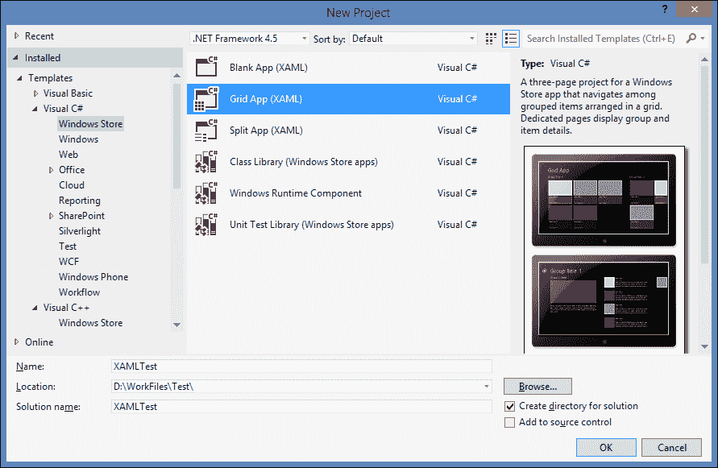
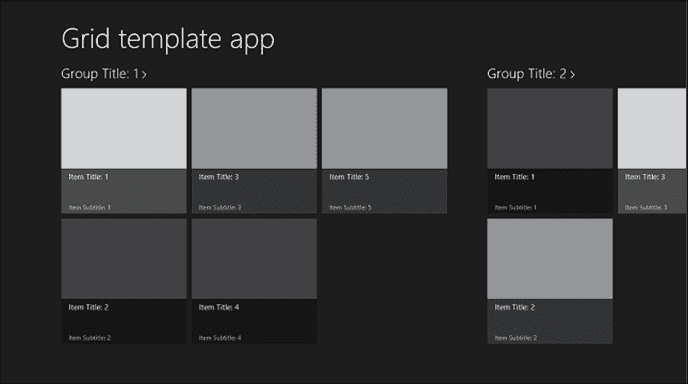
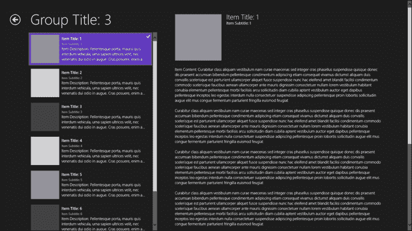
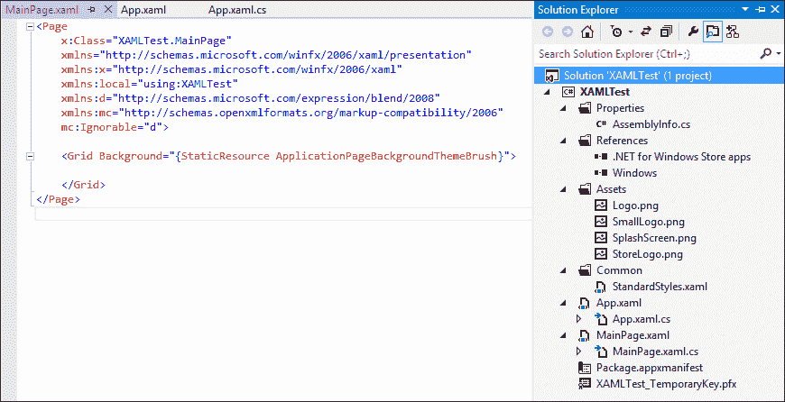
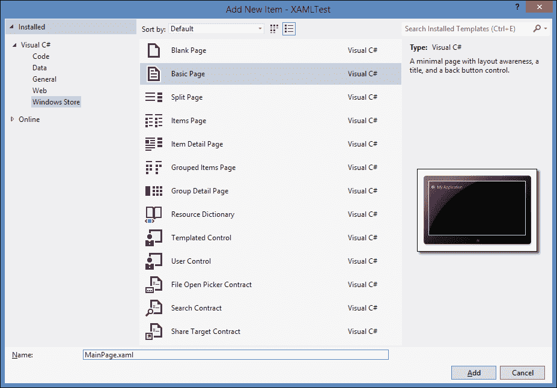
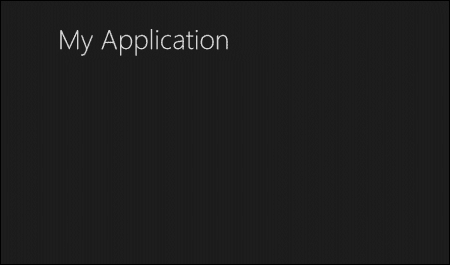
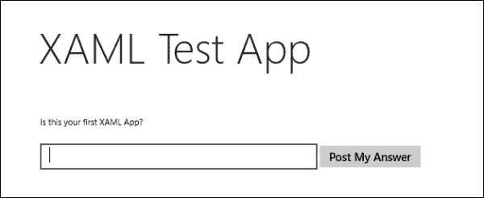
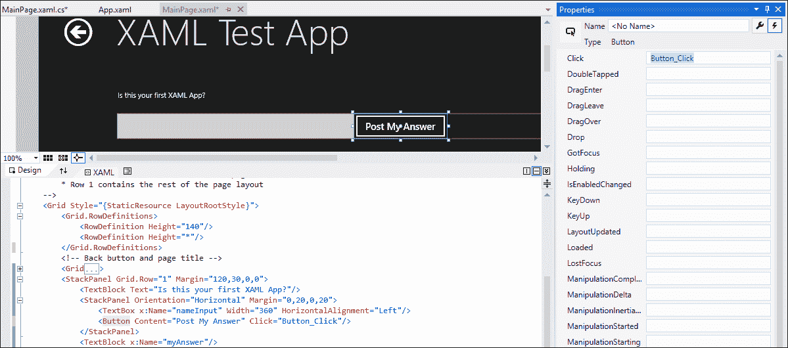

# 第十一章：使用 XAML 开发应用程序

开发 Windows 商店应用程序不仅限于 HTML5 和 JavaScript。微软提供了使用可扩展应用程序标记语言（XAML）和.NET 的其他选择，从而将更广泛的开发者和专业知识吸引到商店开发。无论你的背景如何，是网页还是 Windows 开发，都有一个适合你的地方——一个起点——因为无论你选择哪种编程语言，通往 Windows 商店的道路都是一样的。在前几章中，我们学习了如何使用 HTML5 和 JavaScript 开发应用程序和功能。但在本章中，我们将学习其他平台和编程语言，以及使用 XAML/C#创建应用程序的基础知识。

# 使用不同平台创建应用程序

Windows 8 最重要的进步之一是，你可以使用多种框架和编程语言开发应用程序，面向网页和 Windows 开发者。此外，开发者可以构建并利用他们现有的编程技能和知识来创建 Windows 商店应用，不一定需要掌握一套全新的技能。

网页开发者将能够利用他们的 HTML5、CSS3 和 JavaScript 技能，甚至可以轻松地将现有网站移植到商店应用中，而熟悉微软.NET 框架和 Silverlight 的 Windows 开发者可以运用他们的 XAML、C#和 Visual Basic 技能付诸实践。此外，Windows 8 针对熟悉 C++语法和本地库的开发者，通过提供使用 Visual C++/XAML 创建 Windows 商店应用的机会。而且，使用 C++，你可以创建 Direct2D 和 Direct3D 应用。总之，我们有 XAML 标记和 C#、VB.NET、C++，更不用说，Visual Studio 2012 为所有这些编程语言提供了项目模板和 Intellisense 支持。

同一个应用程序可以用 XAML 或 HTML5 来构建，部署和运行时，两个版本将以相同的方式运行。我们在前面的章节中学到的所有用 JavaScript 和 HTML5 为 Windows 商店应用程序编写的功能和特性，都可以用 C#、VB.Net 和 XAML 来实现。选择使用哪种编程语言是基于个人喜好、背景经验以及语言熟悉度，而不是其他因素。两种选择都需要一定的学习水平。熟悉 HTML 标记、使用 CSS 进行样式设计和使用 JavaScript 实现功能的网页开发者，需要学习 WinJS 特定的 JavaScript 函数和 HTML 数据属性及类。此外，有 XAML 经验的开发者会发现与 WPF 和 Silverlight 有很多相似之处，但需要学习为 Windows 商店设计和功能开发。然而，如我所说，当你从熟悉的领域开始 Windows 商店开发时，学习曲线是最小的。

# 介绍 XAML 应用程序

使用 XAML 开发的 Windows 商店应用的路线图与使用 JavaScript 开发的商店应用相同，从工具开始，通过设计指南获取开发者许可证，规划应用，最后进行打包并将应用发布到商店。

让我们使用 XAML 创建一个基本的 Windows 商店应用，并将其与使用 HTML5 创建的应用进行比较。在 Visual Studio 中，从顶部菜单，导航到 **文件** | **新建项目**。在 **新建项目** 对话框中，从左侧窗格下的 **已安装** | **模板** 中选择您喜欢的编程语言，然后选择 **Windows 商店**。接下来，我们选择一个列表中的 Windows 商店应用项目模板，并在 **名称** 文本框中为其输入一个名字。我将为这个演示选择 **Visual C#**；您也可以选择 **Visual Basic** 或 **Visual C++**。最后，点击 **确定** 创建项目：以下屏幕快照显示了刚刚讨论的过程：



前一个屏幕快照显示了随 XAML 提供的以下 Windows 商店应用模板：**空白应用 (XAML)**，**网格应用 (XAML)**，以及**分割应用 (XAML)**。

+   **空白应用 (XAML)**：此模板提供了一个空的 Windows 商店应用，它可以编译并运行，但其中没有用户界面控件或数据。当基于这个模板运行一个应用时，它将只显示一个包含占位符文本的黑屏。

+   **网格应用 (XAML)**：此模板提供了一个应用，使用户能够浏览不同的分类，并深入查看每个分类下的内容细节。此模板的好例子包括购物应用、新闻应用以及图片或视频应用。**网格应用 (XAML)** 模板从一块着陆主页开始，该主页将展示一系列组或分类。一个单独的组是一组命名项的集合；例如，一组名为“体育新闻”的新闻文章。当用户选择一个组时，应用将打开组详情页，该页面的右侧将显示该组包含的项列表。因此，当用户在主页或组详情页上选择一个单独的项时，应用将打开一个显示项详情的页面。

    以下屏幕快照显示了**网格应用 (XAML)** 的示例主页：

    

+   **分栏应用（XAML）**：此模板提供了一个允许用户浏览类别以找到特定内容的应用，与**网格应用（XAML）**模板类似；然而，使用**分栏应用（XAML）**模板，用户可以在同一页面的双栏分隔视图中查看项目列表和项目详细信息。这种分隔视图允许所有用户快速切换项目。此模板的使用示例包括新闻阅读器或电子邮件应用。此模板从显示组列表的起始主页开始，当用户选择一个组时，应用将打开一个分隔视图页面。下面的屏幕截图显示了一个示例分隔视图页面：

这三个项目模板与 Windows 商店 JavaScript 项目中提供的模板类似，但后者提供了两个额外的模板，分别是**固定布局应用**和**导航应用**。

我们将从**空白应用（XAML）**模板开始，该模板包含了运行应用所需的最小项目文件。**空白应用（XAML）**模板创建了一个空的 Windows 商店应用，其中没有用户界面，但可以编译并运行。创建空白应用后，导航到 Visual Studio 右侧的**解决方案资源管理器**，展开项目文件列表，以查看与此模板一起创建的默认文件。

下面的屏幕截图显示了**解决方案资源管理器**右侧的内容和打开在 XAML 文本编辑器中的`MainPage.xaml`文件，位于左侧：



我们刚刚创建的项目包含以下必需的文件夹和文件，这些文件对于所有使用 C#或 Visual Basic 的 Windows 商店应用来说是不可缺少的：

+   `Properties`：此文件夹包含应用程序汇编信息。

+   `References`：此文件夹包含项目引用文件，默认情况下，有以下两个 SDK 引用：**.NET 用于 Windows 商店应用**和**Windows**。

+   `Assets`：此文件夹包含以下图像：

    +   分别尺寸为 150 x 150 像素和 30 x 30 像素的大和小 logo 图像。

    +   **SplashScreen** 图像。

    +   尺寸为 50 x 50 像素的**商店 Logo**图像。

+   `Common`：此文件夹包含应用中的常用共享资源，如`StandardStyles.xaml`文件，该文件提供了一组默认样式，赋予了应用 Windows 8 的外观和感觉。此外，此文件夹还将包含实用工具和帮助器类的文件。

此模板还包括以下`.xaml`页面文件：

+   `App.xaml`：这是必需的主要应用文件，用于显示用户界面，在应用运行时首先加载。此页面声明了跨整个应用共享的资源，如样式，并为内容宿主提供标记。这个页面类似于在使用 JavaScript 的应用中`default.html`页面所代表的内容。

+   `App.xaml.cs`：这是`App.xaml`的代码隐藏文件，包含处理全局应用特定行为和事件的代码，例如应用的启动和挂起。这个文件与使用 JavaScript 的 app 中的`default.js`文件类似。

+   `MainPage.xaml`：这是应用的默认启动页面，并包含实例化页面的最小 XAML 标记和代码。

+   `MainPage.xaml.cs`：这是与`MainPage.xaml`文件对应的代码隐藏文件。

最后，还有`Package.appxmanifest`这个清单文件，它包含了与 JavaScript 模板中相同的应用程序描述和设置。

### 注意

微软建议不要删除`Common`文件夹中的文件。此外，它也不能重命名或修改，因为这会导致构建错误。如果需要修改这些文件，你可以创建原始文件的副本并进行修改。

那些之前没有听说过 XAML 的人可能会对刚才在应用和`MainPage.xaml`文件中看到的语法感到困惑。XAML 基于 XML 构建了一套基本的语法。当剥离掉冗余的部分，一个 XAML 文件就是一个显示对象之间层次关系的 XML 文档，并且为了被认为是有效的，它也必须是一个有效的 XML 文档。XAML 文件有一个`.xaml`文件扩展名，每个 XAML 文件都与其一个代码隐藏文件相关联，这个代码隐藏文件包含处理事件、操作在 XAML 中创建或声明的对象和 UI 元素的代码。代码隐藏文件与 XAML 页面的部分类结合构成了一个完整的类。这与 ASP.NET 网页的概念类似，`.aspx`文件包含标记和代码隐藏文件，后缀为`.cs`或`.vb`。此外，XAML 文件可以在 Microsoft Expression Blend 中打开和编辑。如果你是 XAML 的新手，不必太担心语法，因为 Visual Studio 会通过提供自动完成提示和建议列表来帮助你编写有效的标记，你会在学习过程中了解语法。

使用 XAML 标记，我们可以像使用 HTML 一样创建 UI 元素，但语法有所不同。让我们在`MainPage.xaml`文件中的`Grid`元素内使用以下语法添加以下 UI 元素：

```js
<TextBlock x:Name="pageTitle" Text="Test XAML App" ></TextBlock>
<TextBox Text="Input text here..." />
<CheckBox Content="Yes"/>
```

前面的代码列表显示了以下属性：`x:Name`，它指定了分配给`TextBlock`元素的名称；`Text`，它指定了作为文本的数据，将填充此元素；`Content`，它与`Text`类似，但指定作为文本的数据，将显示在`CheckBox`元素的旁边。

代码列表中的第一行声明了一个基本的`TextBlock`元素，它与 HTML 中的`label`元素类似。我们给这个元素一个名字，并为其`Text`属性输入一个值。第二个元素是`Textbox`，带有`Text`值，第三个元素是一个带有`Content`值的`Checkbox`元素。您可以手动编写语法，也可以从**工具箱**面板中选择一个控件，并将其直接拖到 XAML 文本编辑器或设计表面，这两个都在分屏视图中可见。

在设计窗口中，您可以操作这些 UI 控件，并按照以下屏幕截图所示安排它们在窗口中的位置：


您会注意到，在**设计**面板中操作控件会在下方的**XAML**面板中反映出来，因为正在为元素设置新的属性并更改现有的属性。如果您现在运行应用程序，您将看到一个包含我们刚刚添加到`MainPage.xaml`文件中的三个元素的黑色屏幕。

`MainPage.xaml`文件包含运行页面所需的最小标记和代码，但缺少所有实现 Windows Store 应用重要功能的附加代码和类，例如适应用户界面变化和处理应用程序的不同状态。幸运的是，Visual Studio 提供的其他页面模板，例如基本页面模板，包含了帮助您实现这些功能的代码和帮助类。为此目的，我们通常在处理空白应用程序（XAML）项目时，将那个空的`MainPage`模板替换为其他页面模板之一。要替换`MainPage.xaml`文件，请在**解决方案资源管理器**中右键点击它，然后点击**删除**。然后，在项目根节点上右键点击，点击**添加新项目项**，这将打开一个对话框窗口。从那里，在下拉列表中选择**Visual C#**（或如果您在示例开始时选择了不同的模板，选择 Visual Basic）下的**Windows Store**模板类型。接下来，选择**基本页面**，并将其命名为`MainPage.xaml`，否则项目将无法正确构建。以下屏幕截图说明了该过程：



然后，点击**添加**。如果这是您第一次将不同于**空白页面**模板的新页面添加到**空白应用（XAML）**模板中，将会显示一个带有警告的消息对话框，内容为**此添加依赖于项目中缺失的文件**。点击**是**以自动添加缺失的文件。此页的 XAML 和代码后置文件被添加到项目中，如果您展开`Common`文件夹，会发现原本只包含一个文件`StandardStyles.xaml`的文件夹现在包含了包含多个帮助器和实用类别的代码文件。新添加的页面在您构建项目/解决方案之前不会在设计器中显示，因此它会编译页面依赖的帮助类。让我们看看这次更改后应用的样子；按*F5*以构建并在调试模式下运行应用。

运行后，应用将显示为一个黑色屏幕，包含标题**我的应用**，如下图所示：



这里需要注意的是，此页面默认符合 Windows 8 的设计指南，而我们无需添加任何样式或标记。正如你所看到的，标题似乎是相同的字体大小，并且按照*Windows 8 应用商店应用的 Windows 8 UX 指南*页面中指定的确切边距进行定位：（[`www.microsoft.com/en-in/download/details.aspx?id=30704`](http://www.microsoft.com/en-in/download/details.aspx?id=30704)）。

## 添加标题、主题颜色和内容

让我们通过添加标题并更改其主题颜色来修改这个最小应用。然后，我们将添加一个简单的文本，并编写一些代码来处理基本按钮点击事件。

1.  要更改此应用的标题，请执行以下步骤：

    1.  打开`MainPage.xaml`文件。

    1.  在**XAML**设计面板中，选择标题**我的应用**，然后右键点击选择**编辑文本**，或者在**属性**窗口下`Common`中更改`Text`属性。如果默认情况下没有显示，**属性**窗口应该位于 Visual Studio 左侧，低于**解决方案资源管理器**面板。

1.  要更改此应用的主题颜色，请执行以下步骤。与使用 JavaScript 的应用程序类似，我们也可以在这里切换深色和浅色主题。在 JavaScript 应用程序中，`default.html`页面引用了两个 CSS 文件，`ui-dark.css`和`ui-light.css`。在 XAML 应用程序中，在`App.xaml`文件中如下进行主题切换：

    1.  打开`App.xaml`文件。

    1.  转到`<Application>`标签并在闭合标签之前添加`RequestedTheme`属性。

    1.  在标签的引号内点击，Visual Studio 的 Intellisense 将提示您两个属性值：**Light**和**Dark**。选择**Light**，`<Application>`标签将如下所示：

        ```js
        <Application
        x:Class="App1.App"

           RequestedTheme="Light">
        ```

    1.  运行应用以查看差异。

1.  现在要添加一些 UI 内容，打开`MainPage.xaml`文件，定位根`Grid`元素和它内部的`<VisualStateManager.VisualStateGroups>`标签。在这个标签之前添加以下 XAML 代码片段：

    ```js
    <StackPanel Grid.Row="1" Margin="120,30,0,0">
      <TextBlock Text="Is this your first XAML App?"/>
      <StackPanel Orientation="Horizontal" Margin="0,20,0,20">
        <TextBox x:Name="answerInput" Width="360"HorizontalAlignment="Left"/>
        <Button Content="Post My Answer"/>
      </StackPanel>
      <TextBlock x:Name="myAnswer"/>
    </StackPanel>
    ```

    上述 XAML 代码声明了一个`StackPanel`控件，该控件内部包含 UI 控件（可以把它想象成一个`div`元素）。在这个控件内部，我们添加了一个`TextBlock`元素并为其`Text`属性赋值，然后我们在父级`StackPanel`控件内嵌套了一个`StackPanel`控件（一个`div`内的`div`元素）。这个`StackPanel`元素将包含两个控件：一个`TextBox`元素用于输入我们为其`width`和`HorizontalAlignment`属性赋值的输入值，以及一个`Button`控件，我们为其`Content`属性赋值。最后，在内部`StackPanel`元素的外部添加另一个空的`TextBlock`元素。

    运行应用程序，它将看起来像以下屏幕快照：

    

1.  最后，让我们通过为在标记中声明的按钮添加事件处理程序来添加一些功能，具体步骤如下：

    1.  在 XAML 设计器或文本编辑器中点击**发布我的答案**按钮，它将在**属性**窗口中显示。

    1.  在**属性**窗口中，定位并点击左上角的**事件**按钮。

    1.  在列表顶部找到**Click**事件，双击或在文本框中按*Enter*键。

    这将创建事件处理方法。在文件`MainPage.xaml.cs`的代码编辑器中显示它。

    以下屏幕快照显示了该过程：

    

    自动生成的事件处理程序名字为`Button_Click`（如果按钮有一个为其`name`属性赋值，事件处理程序看起来可能像`ButtonName_Click`）。该方法将如下所示：

    ```js
    private void Button_Click(object sender, RoutedEventArgs e)
    {
    }
    ```

    让我们添加一些简单的代码，获取输入文本框中输入的文本并在名为`myAnswer`的空`TextBlock`中显示它。代码将如下所示：

    ```js
    private void Button_Click(object sender, RoutedEventArgs e)
    {
      myAnswer.Text = answerInput.Text;
    }

    ```

    如果我们回到 XAML 编辑器，我们会看到`Click`事件处理程序已经这样添加到了`Button`元素中：

    ```js
    <Button Content="Post My Answer" Click="Button_Click"/>
    ```

    现在，运行应用程序，在文本框中输入一些文本，并测试按钮。点击后，它将在屏幕上显示文本框内的任何内容。

XAML 的魅力远不止这个简单的演示，之前的例子仅仅展示了我们如何从一个非常基础的应用程序开始，逐步构建内容和功能。一旦我们熟悉了 XAML，它并不那么难；与其他编程语言一样，我们需要进行实践。然而，选择 XAML 还是 HTML5 完全取决于你。

使用 XAML 开发 Windows Store 应用的一个优点是，您可以使用微软提供的指南将**Windows Phone 7**应用迁移到 Windows 8。同样，微软也提供了一个指南，帮助您将现有的 Silverlight 或 WPF/XAML 代码通过 XAML 转换为 Windows Store 应用。这两个指南都可以在*Windows Phone Dev Center*页面找到([`developer.windowsphone.com/en-us`](http://developer.windowsphone.com/en-us))。

# 总结

在本章中，我们了解到了 Windows 8 为开发者提供的不同选择。此外，我们还介绍了 Windows Store 应用中的 XAML 语言和语法。

我们还介绍了如何使用 XAML 开始开发 Windows Store 应用，以及它与使用 JavaScript 开发的不同之处，这让我们对使用任一语言开发有了预期。

最后，我们创建了一个最小的应用，并向其添加了一些基本的 UI 内容和功能，使用了 XAML 标记语言。

在这本书中，我们介绍了 HTML5 和 CSS3 的新特性，并学习了这些特性如何在 Windows Store 应用中实现。我们还介绍了专为 Windows Store 应用设计的 JavaScript 控件功能。之后，我们学习了如何创建一个基本的 JavaScript 应用，以及如何使用 JavaScript 快速开始开发 Windows Store 应用。进一步地，我们了解了一些应用的重要特性以及如何实现这些特性。我们首先通过 WinJS 控件检索和显示数据。然后，我们介绍了应用的视图状态以及如何使应用响应这些视图状态的变化。之后，我们了解了 Windows 8 中的磁贴，并学习了如何添加动态磁贴并向应用发送通知。此外，我们还学习了如何将应用与 Windows Live 服务集成，以使用户能够使用他们的电子邮件账户进行认证和登录。我们还学习了 Windows Store 应用中的应用栏以及如何向其添加按钮。最后，我们介绍了 Windows Store，并学习了有关将应用打包并发布到商店的所有内容。
