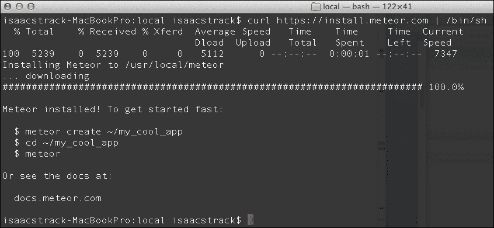
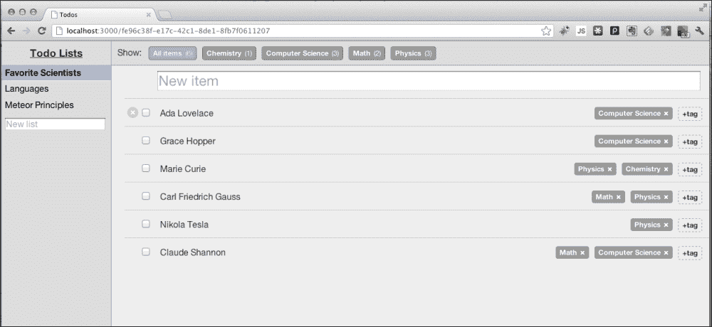
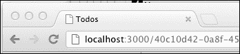
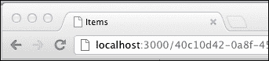
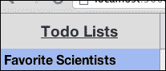
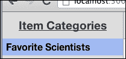
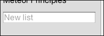
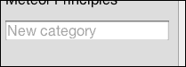

# 第一章：设置和安装

在底层，Meteor 其实只是一堆文件和脚本，旨在让构建 Web 应用程序变得更容易。这是描述某样东西如此优雅的一种糟糕方式，但它帮助我们更好地理解我们在使用什么。

毕竟，米拉·库尼斯其实只是一堆组织包裹在骨骼周围，里面有一些重要的器官。我知道你现在可能恨我因为这个描述，但你知道我的意思。她很美。Meteor 也是。但我们不能就停留在那。如果我们想要在我们的 own 上重现这种美丽，我们必须了解到底发生了什么。

所以，文件和脚本……我们将带你了解如何在你的 Linux 或 Mac OS X 系统上正确安装 Meteor 包，然后看看这个文件和脚本的包如何运行。请注意，Windows 支持即将推出，但截至本文写作时，只有 Linux 和 Mac 版本可用。

在本章中，你将学习到：

+   通过 curl 下载并安装 Meteor

+   加载一个示例应用程序

+   进行更改并观察 Meteor 的实际运行

# 使用 curl 安装

安装文件和脚本有几种方法。你可以手动下载和传输文件，你可以使用一个有很多“下一步”按钮的漂亮安装向导/包，或者你可以像*真正的*开发者那样做，使用命令行。这会让你变得更有男子气概。然而，我现在想想，这可能并不是一个非常想要的事情。好吧，没有头发；我撒谎了。但仍然，你想使用命令行，相信我。相信刚刚对你撒谎的那个人。

`curl`（如果你想弄得花哨一点，就是 cURL）是一个命令行工具，用于使用标准 URL 位置传输文件和运行脚本。你可能已经知道了，或者你可能不在乎。无论如何，我们描述了一下，现在我们继续使用它。

打开一个终端窗口或命令行，并输入以下内容：

```js
$ curl https://install.meteor.com | /bin/sh

```

### 提示

**下载示例代码**

你可以从你账户中下载你购买的所有 Packt 书籍的示例代码文件。[`www.PacktPub.com`](http://www.PacktPub.com)有你购买这本书以外的所有书籍的示例代码文件。如果你在其他地方购买了这本书，你可以访问[`www.PacktPub.com/support`](http://www.PacktPub.com/support)并注册，以便文件直接发送到你的邮箱。

这将会在你的系统上安装 Meteor。`curl`是去获取脚本的命令。[`install.meteor.com`](https://install.meteor.com)是脚本的 URL/位置，`/bin/sh`当然是脚本解释器“Shell”的位置，它将会运行脚本。

一旦你运行了此脚本，假设你有互联网连接和适当的权限，你就会看到 Meteor 包的下载和安装：



在前面的安装文本中我们要找的关键信息是 Meteor 的位置：

```js
Installing Meteor to /usr/local/meteor

```

这个位置将根据您是在 Linux 还是 Mac OS X 上运行而有所不同，但它将 Meteor 置于一个可以从其他任何地方访问 Meteor 脚本的位置。这将在一分钟内变得很重要。现在，让我们看看 Meteor 安装完成后会得到什么友好消息：

```js
Meteor installed! To get started fast:

 $ meteor create ~/my_cool_app
 $ cd ~/my_cool_app
 $ meteor

Or see the docs at:

 docs.meteor.com

```

太好了！您已成功安装 Meteor，并且您正在创建您的第一个 Meteor 网络应用程序的路上！

### 提示

你应该收藏[`docs.meteor.com`](http://docs.meteor.com) 作为您前进过程中宝贵的参考资料。

# 加载示例应用程序

Meteor 的了不起的人们包括几个示例应用程序，您可以快速创建并玩耍，帮助您更好地了解 Meteor 能做什么。

对于我们将要构建的应用程序来说，`todos`示例是最接近的匹配，所以我们将基于那个示例进行构建。我们将再次使用命令行，所以如果你还开着它，那真是太棒了！如果没有，打开一个终端窗口，然后按照以下步骤操作。

## 选择您的文件位置

为了以后能记住它们的位置，我们将把这本书的所有文件放在`~/Documents/Meteor`文件夹中。我们需要创建那个文件夹：

```js
$ mkdir ~/Documents/Meteor

```

现在，我们希望处于那个目录中：

```js
$ cd ~/Documents/Meteor

```

## 加载示例应用程序

现在，我们可以使用 Meteor `create`命令和`--example`参数来创建`todos`示例应用程序的本地副本：

```js
$ meteor create –-example todos

```

与 Meteor 安装本身一样，`create`命令脚本也有一个友好的成功消息：

```js
todos: created.
To run your new app:
 cd todos
 meteor

```

多么方便，甚至还有下一步要做什么的说明！让我们按照我们忠实的好命令行朋友的指示去做吧。

## 启动示例应用程序

要启动一个 Meteor 应用程序，我们需要处于应用程序目录本身。这是因为 Meteor 正在寻找运行应用程序所需的启动文件、HTML 和 JavaScript。所有这些都在应用程序文件夹中，所以让我们去那里：

```js
$ cd todos

```

这让我们进入了`~/Documents/Meteor/todos`文件夹，我们准备运行应用程序：

```js
$ meteor

```

是的，就是它。Meteor 为我们处理所有事情，阅读所有文件和脚本，并设置 HTTP 监听器：

```js
[[[[[ ~/Documents/Meteor/todos ]]]]]

Running on: http://localhost:3000/

```

现在，我们可以使用我们得到的 URL（`http://localhost:3000/`），并在网页浏览器中查看示例应用程序。

## 预览应用程序

打开您最喜欢的网页浏览器（我们将使用 Chrome，但任何现代更新过的浏览器都可以）并导航到`http://localhost:3000/`。

您应该看到以下屏幕，其中已经添加了一些待办事项列表：



如果你想的话，你可以去探索一下应用程序。给列表添加一个新项目，更改列表，添加一个新标签，或者标记项目为完成。随意操作，朋友！如果我们将来所做的更改与你如果在做很多更改的情况下屏幕上显示的完全一致，那是不可能的，但你会很顺利地跟上的。

## 救命！我改动太多了！

你是否害怕变化，希望你的屏幕看起来与我们的示例屏幕一模一样？没问题，只需从一个干净的实例开始。

1.  在命令行：

    ```js
    Ctrl + C

    ```

1.  这将停止运行的应用程序。现在向上移动一个目录：

    ```js
    $ cd ..

    ```

1.  删除`todos`应用程序：

    ```js
    $ rm –R todos

    ```

1.  再次创建 todos 示例应用程序：

    ```js
    $ meteor create --example todos

    ```

1.  切换到新目录，启动 Meteor，一切就绪：

    ```js
    $ cd todos
    $ meteor

    ```

# 进行代码更改

好了，我们的应用程序现在在浏览器中运行。现在我们想看看当我们做一些代码更改时会发生什么。

Meteor 最好的特性之一是响应式编程和热代码推送。

以下内容来自[`docs.meteor.com/#reactivity`](http://docs.meteor.com/#reactivity)：

### 注意

Meteor 采用响应式编程的概念。这意味着你可以用简单的命令式风格编写代码，当你的代码依赖的数据发生变化时，结果将自动重新计算。

更简单地说，这意味着你对 HTML、JavaScript 或数据库所做的任何更改都会自动被采纳并传播。

你不必重新启动应用程序，甚至不必刷新你的浏览器。所有更改都实时地被整合，应用程序被动地接受这些更改。

让我们来看一个例子。

## 从 todos 更改为 items

随着我们对 Meteor 的深入了解，我们希望建立一个可以工作的应用程序：一个有用且复杂到足以让我们体验 Meteor 的所有主要特性的应用程序。我们将构建一个借阅图书馆，我们可以跟踪我们拥有什么物品（例如，广告男人第一季），将这些物品组织成类别（例如，DVD），并跟踪我们借给这些物品的人。

为了看到这方面的开始，让我们将*todos*列表更改为*items*列表，并将*list*一词更改为*category*，因为这个词听起来更酷。

首先，确保应用程序正在运行。你可以通过打开一个浏览器窗口，指向`http://localhost:3000/`来进行此操作。如果应用程序正在运行，你将看到你的`todos`应用程序。如果你的应用程序没有运行，请确保按照*启动示例应用程序*部分中给出的步骤操作。

现在，我们需要打开并编辑`todos.html`文件。用你最喜欢的文本/代码编辑器打开`~/Documents/Meteor/todos/client/todos.html`。

1.  在`head`部分更改`title`：

    ```js
    <head>
      <title>Items</title>
    </head>
    ```

1.  接着保存文件，然后在浏览器中查看。页面将自动刷新，你会看到标题从**Todos**更改为**Items**：

    现在，标题将显示单词**Items**：

    

这就是 Meteor 在起作用！它正在监控任何文件的变化，当它看到一个文件发生变化时，它告诉你的浏览器有变化，并应该刷新自己以获取最新版本。

继续前进，我们将从头开始构建一个应用程序，因此我们不想对这个示例应用程序做太多更改。然而，我们仍然希望至少清理掉其他可见的`todo`和`list`引用。

1.  回到您的文本编辑器，对大约第 20 行的`<h3>`标签进行以下更改：

    ```js
    <template name="lists">
      <h3>Item Categories</h3>
    ```

    保存此更改，您将在浏览器中看到更改反映。左侧标题栏原本显示以下文本：

    

    现在它将更改为以下内容：

    

1.  我们还需要处理一个区域，我们已经成功将我们的`todos`应用程序转换为`items`应用程序。

    如果您注意到，在分类列表的底部，当前打开的盒子写着**新列表**：

    

    我们需要将其改为**新分类**。在第 39 行进行以下代码更改：

    ```js
    <div id="createList">
      <input type="text" id="new-list" placeholder="New category" />
    </div>
    ```

1.  保存您的更改，并检查您的工作：

# 摘要

太成功了！在本章中，你已经成功安装了 Meteor 框架，加载了一个示例应用程序，并对该应用程序进行了更改，熟悉了文件更改和 Meteor 的反应性质。你现在可以开始构建你自己的 Meteor 应用程序，并了解更多使用 Meteor 开发带来的优雅特性和优势。
