# 第二章．响应式编程…它是有生命的！

正如您在第一章中所学到的，*设置和安装*，Meteor 采用响应式编程模型。这意味着您的客户端/浏览器不仅关心显示数据，还关心数据的变化，这样它就可以“反应”这些变化。这些寻找数据变化的数据区域称为**响应式上下文**。

我们将开始我们的借贷图书馆应用程序，为未来的章节打下基础，并使用 Meteor 内置的响应式上下文来跟踪和传播我们应用程序的变化，以便所有监听的客户端都能接收到。

在本章中，您将学习到：

+   创建您的第一个真实应用程序

+   使用响应式编程来跟踪和自动更新变化

+   从多个浏览器窗口探索和测试您数据的变化

# 创建借贷图书馆

这个世界上有两种人。那些记得他们借给谁东西的人，和那些买了很多东西两次的人。如果你和你的 UPS 送货司机很熟，这个应用程序就是为你准备的！

使用 Meteor，我们将建立一个借贷图书馆。我们将跟踪我们所有的东西，以及我们借给了谁，这样下次我们记不起我们把线性压缩扳手放在哪里时，我们只需查找我们最后借给了谁，然后去向他们要回来。

而且当同一个朋友说，“你确定你借给我了吗？”我们可以回答，“是的，史蒂夫，我确定我借给了你！我看到你正在享受我的慷慨借出的线性压缩扳手带来的数字有线电视，为什么不自己去找它，这样我也可以在家享受数字有线电视的好处呢？！”

好吧，好吧，也许史蒂夫也忘记了。也许他是个骗子，他把你的扳手卖了来支付他的炸 Twinkies®习惯。无论如何，你都有自己的自定义 Meteor 应用程序，可以证明你并没有发疯。如果他确实为了油炸嘉年华食品而卖了它，至少你可以让他和他的存货一起分享，然后你可以在他家看比赛。

## 创建基本应用程序

我们首先要做的就是创建基本应用程序，然后我们可以根据需要进行扩展。

1.  首先，导航到您的应用程序文件夹。这可以随便放在哪里，但如前所述，我们将使用`~/Documents/Meteor`作为根文件夹：

    ```js
    $ cd ~/Documents/Meteor

    ```

1.  现在我们为我们的借贷图书馆应用程序创建基本文件夹结构：

    ```js
    $ meteor create LendLib

    ```

1.  像往常一样，我们将获得关于如何启动应用程序的说明。让我们先试试看，以确保一切都创建得正确：

    ```js
    $ cd LendLib
    $ meteor

    ```

    这将导航到借贷图书馆文件夹`~/Documents/Meteor/LendLib`并运行应用程序。

1.  打开一个浏览器，导航到`http://localhost:3000/`。你应该看到以下屏幕：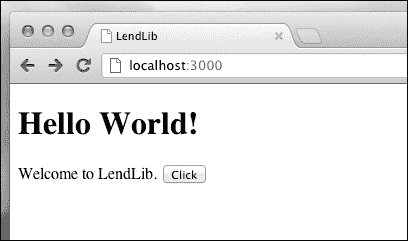

1.  你好世界是远远不够的，所以让我们把它改为借阅图书馆。在你的最喜欢的编辑器中打开`~/Documents/Meteor/LendLib/LendLib.html`。在顶部（第 9 行左右），你会看到负责我们问候的模板 HTML 代码片段。大胆把`Hello World`改为`Lending Library`：

    ```js
    <template name="hello">
      <h1>Lending Library</h1>
      {{greeting}}
      <input type="button" value="Click" />
    </template>
    ```

1.  保存那个更改，页面将刷新：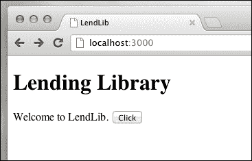

    欢迎信息不在 HTML 文件中，然而。如果你注意到了，它在一个名为 greeting 的模板函数中找到：

    ```js
    {{greeting}}
    ```

1.  我们也来改一下。打开`~/Documents/Meteor/LendLib/LendLib.js`，将问候模板函数更改如下：

    ```js
    if (Meteor.isClient) {
      Template.hello.greeting = function () {
      return "my list.";
      };
    ```

1.  保存更改，你的页面将更新：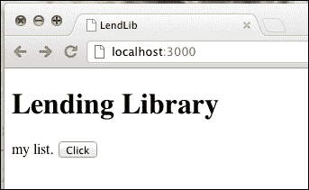

## 创建一个集合

好，你刚刚静态文件做了一些小改动，但我们真正想看到的是些动态的、响应式的编程，还有实时的 HTML！

我们需要附加一个数据源：一些可以跟踪我们项目的东西。通常，这确实是一个相当的过程，但 Meteor 使之变得简单，支持 Minimongo（MongoDB 的轻量级版本）内置。

### 提示

要了解更多关于 NoSQL 数据库（特别是 MongoDB，Meteor 内部默认使用的数据库）的信息，你可以访问以下网站：

更多信息请访问[`en.wikipedia.org/wiki/NoSQL`](http://en.wikipedia.org/wiki/NoSQL)

更多信息请访问[`www.mongodb.org/`](http://www.mongodb.org/)

更多信息请访问[`www.packtpub.com/books/all?keys=mongodb`](http://www.packtpub.com/books/all?keys=mongodb)

让我们创建我们的集合。在`LendLib.js`中，我们想添加以下作为第一行，然后保存更改：

```js
var lists = new Meteor.Collection("Lists");

if (Meteor.isClient) {
…
```

这将在 MongoDB 中创建一个新的集合。由于它在`LendLib.js`文件中的任何其他内容之前，所以集合可供客户端和服务器查看。如我们所见，它是持久的，一旦在其中输入值，任何访问页面的客户端都可以检索它们。

要查看这个持久对象，我们需要使用我们网页的控制台。

## 浏览器控制台的乐趣

**浏览器控制台**是大多数现代浏览器默认提供的调试工具，或者通过插件作为附加组件。

### 提示

要深入了解如何在 Chrome 中使用控制台，请查看[`developer.chrome.com/extensions/tut_debugging.html`](http://developer.chrome.com/extensions/tut_debugging.html)。

1.  由于我们使用的是 Chrome，控制台默认可用。在一个指向`http://localhost:3000/`的浏览器窗口中，输入快捷键组合*[command]* + *[option]* + *i*，或者你可以在页面的任何地方右键点击并选择**检查元素**：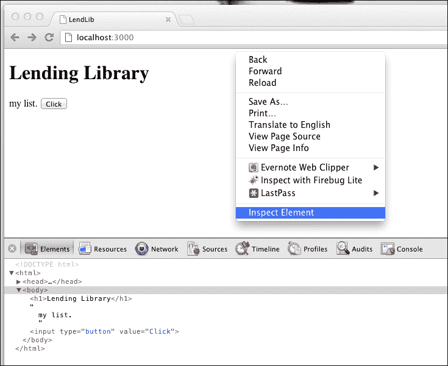

    这将打开我们的调试工具。我们现在想要进入控制台。

1.  点击调试菜单栏最右边的**控制台**图标：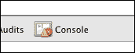

    你现在将有一个闪烁的光标，你准备检查我们新创建的集合！

1.  在控制台中输入以下命令并按*Enter*：

    ```js
    > lists

    ```

    你应该得到一个返回的对象，说 Meteor 集合：

    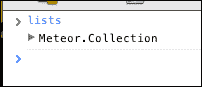

## 添加一些数据

这意味着我们的更改已被接受，我们有一个新的持久集合！它是空的，但让我们做点什么来改变这一点：

1.  在浏览器控制台中输入以下命令以创建几个示例类别：

    ```js
    > lists.insert({Category:"DVDs", items: {Name:"Mission Impossible",Owner:"me",LentTo:"Alice"}});
    > lists.insert({Category:"Tools", items: {Name:"Linear Compression Wrench",Owner:"me",LentTo: "STEVE"}});
    ```

    每个命令执行后，你将获得一个 GUID（类似于`f98c3355-18ce-47b0-82cc-142696322a06`），这是 Meteor 用来告诉你项目已正确保存的方式。我们作为天生的怀疑论者，将要检查这一过程。

1.  输入以下命令：

    ```js
    > lists.findOne({Category: "DVDs"});
    ```

    你应该得到一个对象，旁边有一个可扩展的图标。

1.  点击那个图标来展开，你应该有以下内容：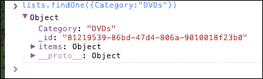

    我们可以通过输入命令`lists.findOne({Category:"Tools"})`来同样检查我们的工具集合，但我们不需要这样做。这次我们将相信 Meteor 已经正确地输入了。然而，我们确实希望检查对象是否持久存在。

    刷新网页。你的控制台将清空，但我们输入的类别已经保存在持久的 Meteor 集合中，因此我们可以再次检查它们是否还在。

1.  在控制台中输入以下命令：

    ```js
    > lists.find({}).count();

    ```

    这个命令查找`lists`集合中的所有记录，并给我们一个总数。如果一切按计划进行，你应该得到一个`2`的计数。

我们正在前进！我们已经创建了两个类别，每个类别中有一个项目。我们还验证了`lists`集合正在从会话到会话中保存。现在，让我们看看如何在我们的页面上显示这个。

## 在 HTML 中显示集合

我们现在将看到我们在初始化项目时创建的 HTML 页面中的集合栩栩如生。这个页面将使用模板，它们是响应式的，允许我们的集合发生变化时，页面无需刷新即可立即更新。这种类型的响应式编程，页面 DOM 可以无需刷新即可立即更新，称为**Live HTML**。

### 小贴士

要了解更多关于 Live HTML 的信息，请查阅以下网址的 Meteor 文档：

[`docs.meteor.com/#livehtml`](http://docs.meteor.com/#livehtml)

1.  在`~/Documents/Meteor/LendLib/LendLib.html`仍然打开的情况下，找到`body`标签，并添加一个新的**模板**声明：

    ```js
    <body>
      {{> hello}}
     <div id="categories-container">
     {{> categories}}
     </div> 
    </body>
    ```

    这将创建一个新的`div`，其内容由名为`categories`的`template partial`填充。

1.  现在，在页面的最底部，让我们添加类别`template partial`的骨架：

    ```js
    <template name="categories">
    </template>

    ```

    这不会改变页面的外观，但我们现在有一个`template partial`，我们可以列出我们的类别。

1.  让我们放入我们的节标题：

    ```js
    <template name="categories">
     <div class="title">my stuff</div>
    </template>
    ```

1.  现在让我们把我们的类别放进去：

    ```js
    <template name="categories">
      <div class="title">my stuff</div>
     <div id="categories">

     </div>
    </template>
    ```

    这样在`div`中创建了类别，我们可以遍历并列出所有类别。如果我们只有一个记录要处理，代码将如下所示：

    ```js
    <div class="category">
     {{Category}}
    </div>

    ```

1.  但是我们需要将其包装在一个循环中（在这个例子中，一个`#each`语句），这样我们才能获取所有类别：

    ```js
    <template name="categories">
      <div class="title">my stuff</div>
      <div id="categories">
     {{#each lists}}
     <div class="category">
     {{Category}}
     </div>
     {{/each}}
      </div>
    </template>
    ```

    注意我们正在告诉模板“对于`lists`集合中的每个记录”使用我们的`{{#each lists}}`命令，然后，“显示类别”使用`{{Category}}`。

1.  保存这些更改，然后查看网页：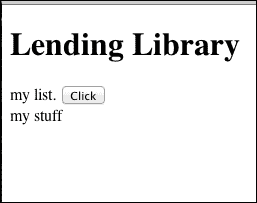

    看起来并没有太大不同。是的，我们有我们的头部（**我的东西**），但是我们刚刚创建的模板的类别在哪里？

    为了让类别显示出来，我们还需要完成一步。目前，我们刚刚创建的模板没有指向任何东西。换句话说，我们有一个 lists 集合，我们有一个模板，但我们没有连接它们的底层 JavaScript 函数。让我们处理一下那部分。

    在`~/Documents/Meteor/LendLib/LendLib.js`中我们可以看到一些`Template`函数：

    ```js
    Template.hello.greeting = function () {...

    ...

    Template.hello.events = { ...
    ```

    这些代码块正在将 JavaScript 函数和对象连接到 HTML hello`template`。Meteor 内置的`Template`对象使这成为可能，我们将遵循相同的模式来连接我们的 categories`template`。

1.  我们想要向任何监听的客户端声明，categories 模板有一个`lists`集合。我们通过在`Template.hello.events = {...}`代码块下方输入以下代码来实现：

    ```js
    Template.hello.events = {
    ...
    };

    Template.categories.lists = function () {
    };

    ```

    ### 提示

    Template 声明必须位于`if (Meteor.isClient) {...}`代码块内，以便客户端可以获取更改，而服务器会忽略它。

1.  现在我们已经为所有模板声明了`lists`集合，我们可以让函数返回来自`Meteor.Collection`查询的结果。我们使用`find()`命令来实现：

    ```js
    Template.categories.lists = function () {
     return lists.find({}, {sort: {Category: 1}});
    };
    ```

    这段代码将找到`lists`集合中的每个记录，并按`Category`（名称）对结果进行排序。保存这些更改，你现在将看到一个填充了类别的列表：

    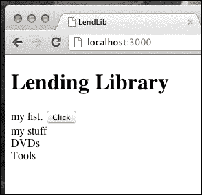

## 清理

我们正在快速接近一个可以工作的应用程序，我们希望它看起来超级光滑和干净。让我们对我们的代码进行一些清理，并添加一些 CSS 以提高可读性：

1.  我们不再需要问候语。让我们去掉它。从`LendLib.html`中删除以下高亮显示的行并保存页面：

    ```js
    <body>
     {{> hello}}
      <div id="categories">
        {{> categories}}
      </div>
    </body>

    <template name="hello">
     <h1>Lending Library</h1>
     {{greeting}}
     <input type="button" value="Click" />
    </template>
    <template name="categories">
    ```

    我们现在想保留`LendLib.js`中的 Template.hello 声明，作为参考。我们现在注释掉它们，稍后当它们不再需要时删除它们：

    ```js
    /*

    Template.hello.greeting = function () {
    ...
    };

    Template.hello.events = {
    ...
    };

    */

    ```

1.  现在，让我们添加 Twitter Bootstrap 框架，它让我们轻松拥有大量样式：

    1.  打开终端窗口，在`/LendLib/`中创建一个`client`文件夹：

        ```js
        $ mkdir ~/Documents/Meteor/LendLib/client

        ```

    1.  访问[`twitter.github.com/bootstrap/assets/bootstrap.zip`](http://twitter.github.com/bootstrap/assets/bootstrap.zip)下载最新的 Bootstrap 框架，然后将其解压到`~/Documents/Meteor/LendLib/client`文件夹中。

        因为 Meteor 会读取并使用应用程序文件夹中的每一个文件，我们希望消除这些冗余的文件。我们不必太担心效率问题，但有些事情确实令人羞愧，留下这么多无用的代码就是其中之一，与享受《暮光之城》系列电影没什么两样。

    1.  导航到 bootstrap 文件夹：

        ```js
        $ cd ~/Documents/Meteor/LendLib/client/bootstrap

        ```

    1.  删除不需要的文件：

        ```js
        $ rm js/bootstrap.js
        $ rm css/bootstrap.css
        $ rm css/bootstrap-responsive.css

        ```

        ### 提示

        如果你熟悉 Bootstrap，你可以直接复制`images`、`min.js`和`min.css`文件，而不是按照前面的说明操作。

    经过这些更改后，你的 UI 应该非常干净简洁：

    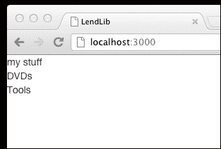

1.  让我们快速使其更加醒目和可读。在`LendLib.html`中，让我们将头部标签从`div`更改为`h2`：

    ```js
    <template name="categories">
    <h2 class="title">my stuff</h2>
    ```

1.  让我们把分类变成一个漂亮的按钮组：

    ```js
    <div id="categories" class="btn-group">
    {{#each lists}}
    <div class="category btn btn-inverse">
    {{Category}}
    </div>
       {{/each}}
    ```

    这给了我们一个独特、干净的页面：

    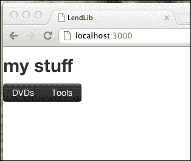

# 创建一个反应

在我们创建了基本模板和集合，并且 Meteor 将我们的`lists`集合放入了反应式上下文之后，我们现在可以继续观察反应式编程模型在实际工作中的表现。

导航到我们的借阅图书馆页面`http://localhost:3000/`，并打开浏览器控制台窗口。

在控制台中输入以下命令：

```js
> lists.insert({Category:"Fraggles"});

```

你会立刻看到页面更新。但注意，这次页面没有完全刷新！那是因为在幕后，Meteor 正在跟踪我们的反应式上下文（在这个例子中是`lists`集合）的变化，并在变化发生后立即更新`template`。

让我们再做些改动。再次输入相同的`Fraggles`命令：

```js
> lists.insert({Category:"Fraggles"});

```

与之前一样，一个新的**Fraggles**按钮立刻出现：

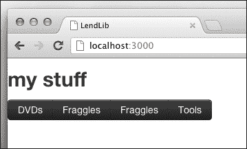

但我们现在的 Fraggles 分类太多了。确实有很多 Fraggles，但除非你是个奇怪的收藏家，否则你不需要*两个*分类。所以我们去掉它们：

```js
> lists.remove({Category:"Fraggles"})

```

这个命令查找任何`Category = "Fraggles"`的记录并将它们删除。

为了更好地管理我们的收藏品，添加一个收藏品集合条目可能更好，所以我们来这样做：

```js
> lists.insert({Category:"Collectibles"})

```

正如你所看到的，更改是即时的，无需页面刷新。

# 多个客户端

好的事物应该分享。Meteor 理解这一点，正如我们即将亲自看到的那样，反应式编程模型允许我们在多个客户端之间实时共享更新。

保持你的 Chrome 网页打开在`http://localhost:3000/`，然后打开一个新的浏览器标签页，导航到同一页面。

### 提示

如果你想更高级一点，可以用多个浏览器（Firefox、Opera 或 Safari）进行这个实验——每个会话都是实时的并且具有反应性！

你现在打开了两个客户端，它们模拟了不同的人、在不同的地点、使用不同的计算机打开应用程序。Meteor 的反应式模型允许你对所有客户端一视同仁，其中一个客户端所做的更改将会传播到所有其他客户端。

在关注新的第二个浏览器的同时，在浏览器#1 的控制台中输入以下命令：

```js
> lists.insert({Category:"Vinyl Records"})

```

你会注意到更改传播到了*两个*浏览器，再次没有刷新页面：

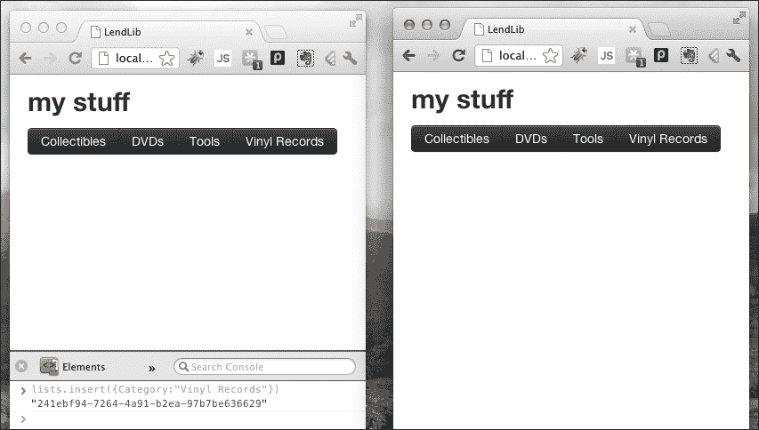

随意添加任何额外的集合，删除或重命名等。稍作实验，注意这些更改如何能够立即对所有监听的客户端生效。Meteor 遵循一个非常强大的范式，在下一章中，我们将能够确切地看到为什么这是 web 应用程序开发中的一个如此重要和具有颠覆性的变革。

# 总结

在本章中，你已经成功地为你的新 Meteor 应用创建了框架。你亲自见证了新的项目是如何迅速被创建的，而且你仅仅用几行代码就创建了一些主要的数据库和模板功能。你亲眼看到了实时 HTML 和反应式编程的实际应用，现在你准备更深入地了解 Meteor 引擎。你已经征服了冰山之巅，我的朋友。休息一下，喝杯冰镇饮料，为更深入的 Meteor 精彩做好准备！
