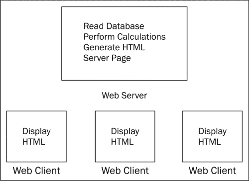
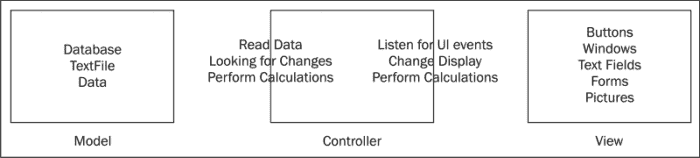
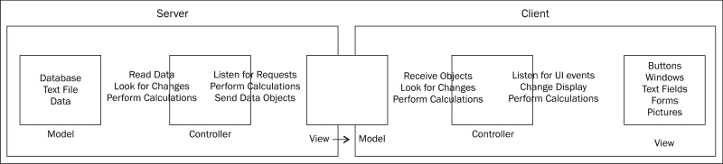
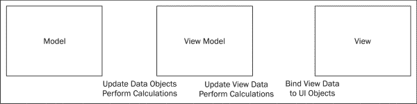
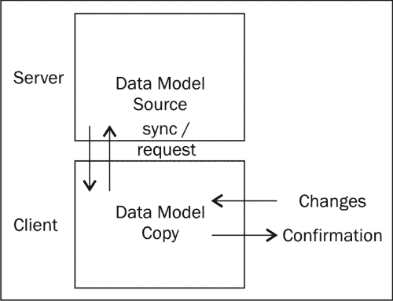
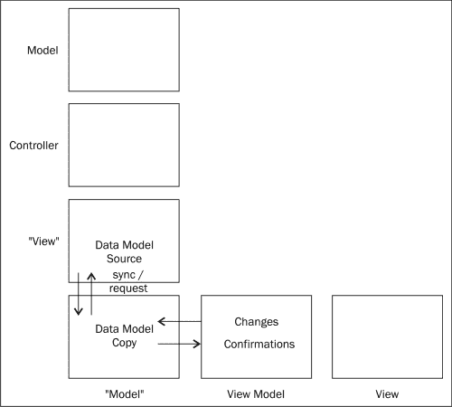
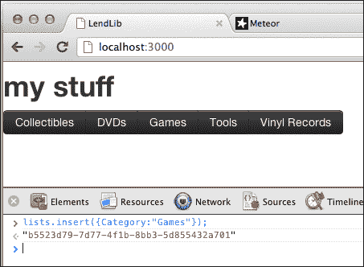
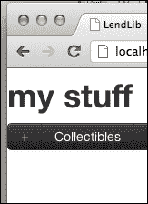
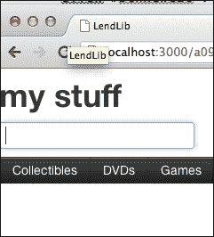
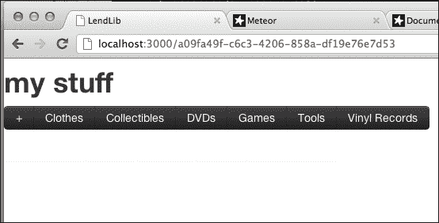

# 第三章：为什么 Meteor 如此出色！

Meteor 是一种具有颠覆性（以一种好的方式！）的技术。它使一种新类型的网络应用程序成为可能，这种应用程序采用了**模型-视图-视图模型**（**MVVM**）设计模式。

这一章解释了网络应用程序是如何改变的，为什么这很重要，以及 Meteor 是如何通过 MVVM 特别地使现代网络应用程序成为可能的。

到本章末尾，你将学到：

+   现代网络应用程序是什么样的

+   MVVM 意味着什么，以及它有何不同

+   如何使用 Meteor 的 MVVM 创建现代网络应用程序

+   在 Meteor 中使用模板——开始使用 MVVM

# 现代网络应用程序

我们的世界正在改变。

随着显示、计算和存储能力的不断进步，几年前还不可能实现的事情现在不仅成为可能，而且对于优秀的应用程序的成功至关重要。特别是网络领域经历了显著的变化。

## 网络应用程序的起源（客户端/服务器）

从一开始，网络服务器和客户端就模仿了**傻瓜终端**的计算方式，其中服务器具有比客户端多得多的处理能力，对数据执行操作（例如将记录写入数据库、进行数学计算、文本搜索等），将数据转换为可读格式（例如将数据库记录转换为 HTML 等），然后将结果服务于客户端，由用户显示使用。

换句话说，服务器做所有的工作，而客户端更多的是作为一个显示器，或者说是傻瓜终端。这种设计模式的名称是……等一下……叫做**客户端/服务器**设计模式：



这种设计模式源自 20 世纪 60 年代和 70 年代的傻瓜终端和大中型计算机，正是它促成了我们所知的网络的诞生，并且一直是我们思考互联网时所想到的设计模式。

## 机器的崛起（MVC）

在网络出现之前（以及自那以后），桌面能够运行如电子表格或文字处理程序等应用程序，而无需与服务器进行通信。这类应用程序能够在其强大的桌面环境中完成所需的一切。

在 20 世纪 90 年代初，桌面计算机变得更快更好。越来越多地配置了高性能的计算机。同时，网络也开始兴起。人们开始认为将高性能桌面应用程序（也就是**胖应用**）与网络客户端/服务器应用程序（也就是**瘦应用**）相结合，可以产生最好的效果。这种类型的应用程序——与傻瓜终端相反——被称为**智能应用**。

创建了许多面向商业的智能应用，但最简单的例子可以在计算机游戏中找到。**大型多人在线游戏**（**MMOs**）、第一人称射击游戏和实时战略游戏都是智能应用，在这些应用中，信息（数据**模型**）通过服务器在机器之间传递。在这种情况下，客户端做的不仅仅是显示信息。它执行大部分处理（或**控制**）并将数据转换为需要显示的内容（**视图**）。

这种设计模式很简单，但非常有效。它被称为**模型-视图-控制器**（**MVC**）模式。



模型拥有所有的数据。在智能应用的上下文中，模型是由服务器提供的。客户端从服务器请求模型。一旦客户端获得模型，它就在这些数据上执行操作/逻辑，然后准备将其显示在屏幕上。这个应用程序的部分（与服务器通信、修改数据模型以及准备数据显示的数据）被称为**控制器**。控制器向视图发送命令，视图显示信息，并在屏幕上发生某些事件（例如按钮点击）时向控制器报告。控制器接收那些反馈，执行逻辑，并更新模型。如此循环。

由于网络浏览器被设计成“愚蠢的客户端”，使用浏览器作为智能应用的想法是不可能的。相反，智能应用是建立在诸如微软.NET、Java 或 Macromedia（现 Adobe）Flash 之类的框架上。只要安装了框架，你就可以访问网页来下载/运行智能应用。

有时你可以在浏览器内运行应用程序，有时你可以在下载之前运行它，但无论如何，你都在运行一种新类型的网络应用程序，在这种应用程序中，应用程序可以与服务器通信并共享处理工作负载。

## 浏览器成长了（MVVM）

从 2000 年代初开始，MVC 模式出现了一个新的变化。开发者开始意识到，对于连接/企业级的“智能应用”，实际上有一个嵌套的 MVC 模式。

服务器（控制器）通过使用业务对象对数据库信息（模型）执行业务逻辑，然后将该信息传递给客户端应用程序（一个“视图”）。

客户端从服务器接收这些信息，并将其视为自己的个人“模型”。然后客户端将作为一个适当的控制器，执行逻辑，并将信息发送给视图以在屏幕上显示。

所以，对于服务器 MVC 的“视图”是第二个 MVC 的“模型”。



然后我想到，“为什么要止步于两个？” 没有理由说一个应用不能有*多个*嵌套的 MVC，每个视图都成为下一个 MVC 的模型。实际上，在客户端方面，这样做的确有一个很好的理由。

将实际显示逻辑（如“这个提交按钮放在这里”和“文本区域值已更改”）与客户端对象逻辑（如“用户可以提交这个记录”和“电话号码已更改”）分离，使得大部分代码可以被重用。对象逻辑可以移植到另一个应用程序中，您所做的只是更改显示逻辑，以将相同的模型和控制器代码扩展到不同的应用程序或设备。

从 2004-2005 年起，这个想法被马丁·福勒（Martin Fowler）和微软（Microsoft）针对智能应用进行了改进和修改（称为**展示模型**），称为**模型-视图-视图模型**（Model View View-Model）。虽然严格来说并不是嵌套 MVC 的同一件事，但 MVVM 设计模式将嵌套 MVC 的概念应用于前端应用程序。



随着浏览器技术（HTML 和 JavaScript）的成熟，创建直接在 HTML 网页内使用 MVVM 设计模式的智能应用变得可能。这种模式使得直接从浏览器运行完整尺寸的应用程序成为可能。不再需要下载多个框架或单独的应用程序。现在，您可以从访问一个 URL 获得与以前从购买包装产品获得相同的功能。

# 一个大型的 Meteor 出现了！

Meteor 将 MVVM 模式推向了新的高度。通过应用 `handlebars.js`（或其他模板库）的模板化，并利用即时更新，它真正使得网页应用程序能够像一个完整的、健壮的智能应用程序一样行动和表现。

让我们通过一些概念来了解 Meteor 是如何做到这一点的，然后我们开始将这个应用到我们的 Lending Library 应用程序中。

## 缓存和同步数据（模型）

Meteor 支持一种在客户端和服务器上相同的缓存和同步数据模型。



当客户端注意到数据模型的更改时，它首先在本地缓存这些更改，然后尝试与服务器同步。同时，它正在监听来自服务器的更改。这使得客户端能够拥有数据模型的本地副本，因此它可以快速地将任何更改的结果发送到屏幕，而无需等待服务器响应。

此外，您会注意到这是 MVVM 设计模式的开始，嵌套在一个 nested MVC 中。换句话说，服务器发布数据更改，并将其数据更改视为自身 MVC 模式中的“视图”。客户端订阅这些更改，并将其更改视为 MVVM 模式中的“模型”。



这个的一个代码示例在 Meteor 中非常简单（尽管如果您愿意，您可以使其更复杂，从而使其更具控制性）：

```js
var lists = new Meteor.Collection("lists");
```

这一行代码的作用是声明存在一个`lists`数据模型。客户端和服务器都会有它的版本，但它们对待自己的版本方式不同。客户端将订阅服务器宣布的变化，并相应地更新其模型。服务器将发布变化，并监听来自客户端的变化请求，并根据这些请求更新*它的*模型（它的主副本）。

哇。一行代码就能做到这么多！当然，还有很多我们没有提到，但这超出了本章节的范围，所以我们继续吧。

### 提示

为了更好地理解 Meteor 的数据同步，请参阅 Meteor 文档中“发布和订阅”部分的*发布和订阅*。[`docs.meteor.com/#publishandsubscribe`](http://docs.meteor.com/#publishandsubscribe)。

## 模板化的 HTML（视图）

Meteor 客户端通过使用模板来渲染 HTML。

HTML 中的模板也称为**视图数据绑定**。简单来说，视图数据绑定是如果数据变化，会以不同方式显示的一块共享数据。

HTML 代码有一个占位符。根据变量的值，将在该占位符中放置不同的 HTML 代码。如果这个变量的值发生变化，占位符中的代码也会随之变化，从而产生不同的视图。

让我们来看一个非常简单的数据绑定，这个你实际上不需要 Meteor 也能做到，来阐明这个观点。

在`LendLib.html`中，你会看到一个 HTML（Handlebar）模板表达式：

```js
<div id="categories-container">
 {{> categories}}
</div>
```

这个表达式是一个 HTML 模板的占位符，下面就是它：

```js
<template name="categories">
<h2 class="title">my stuff</h2>...
```

所以，`{{> categories}}`基本上是在说“在这里放`categories`模板中的任何东西。”具有相应名称的 HTML 模板正在提供这些内容。

如果你想看看数据变化会如何改变显示效果，将`h2`标签改为`h4`标签，并保存更改：

```js
<template name="categories">
<h4 class="title">my stuff</h4>...
```

你会在浏览器中看到效果（“我的东西”变得微小）。这是一个模板——或者说是视图数据绑定——在起作用！将`h4`改回`h2`并保存更改。除非你喜欢这个更改。这里没有判断...好吧，也许有一点判断。它又丑又小，很难阅读。说真的，你应该改回去，否则有人看到会嘲笑你的！

好吧，现在我们知道什么是视图数据绑定，让我们来看看 Meteor 是如何使用它们的。

在`LendLib.html`中的 categories 模板内，你还会找到更多的 Handlebar 模板：

```js
<template name="categories">
  <h4 class="title">my stuff</h4>
  <div id="categories" class="btn-group">
    {{#each lists}}
      <div class="category btn btn-inverse">
        {{Category}}
      </div>
    {{/each}}
  </div>
</template>
```

第一个 Handlebar 表达式是一对的一部分，是一个`for-each`语句。`{{#each lists}}`告诉解释器执行其下方的动作（在这个例子中，创建一个新的`div`）对于`lists`集合中的每个项目。`lists`是数据的一部分。`{{#each lists}}`是占位符。

现在，在`#each lists`表达式中，还有一个 Handlebar 表达式。

```js
{{Category}}

```

由于这位于`#each`表达式内部，`Category`是`lists`的隐含属性。也就是说`{{Category}}`等同于说`this.Category`，其中`this`是`for each`循环中的当前项目。因此，占位符表示“在这里添加`this.Category`的值。”

现在，如果我们查看`LendLib.js`，我们将看到模板背后的值。

```js
Template.categories.lists = function () {
  return lists.find(...
```

在这里，Meteor 声明了一个名为`lists`的模板变量，该变量位于名为`categories`的模板内。这个变量碰巧是一个函数。这个函数返回`lists`集合中的所有数据，我们之前定义了这个集合。记得这个命令吗？

```js
var lists = new Meteor.Collection("lists");
```

那个`lists`集合是由声明的`Template.categories.lists`返回的，因此当`lists`集合发生变化时，变量也会得到更新，模板的占位符也会相应地改变。

让我们实际操作一下。在指向`http://localhost:3000`的网页上，打开浏览器控制台并输入以下行：

```js
> lists.insert({Category:"Games"});
```

这将更新`lists`数据集合（模型）。模板将看到这个变化，并更新 HTML 代码/占位符。`for each`循环将额外运行一次，为`lists`中的新条目，然后你会看到以下屏幕：



关于 MVVM 模式，HTML 模板代码是客户端视图的一部分。任何数据的变化都会自动反映在浏览器中。

## Meteor 的客户端代码（视图模型）

如前一部分所述，`LendLib.js`包含了模板变量，它将客户端模型与 HTML 页面连接起来，这是客户端的视图。在`LendLib.js`内部，作为对视图或模型变化的反应的任何逻辑都是视图模型的一部分。

视图模型负责跟踪模型的变化并以一种视图可以拾取变化的方式呈现这些变化。它还负责监听来自视图的变化。

在这里，变化并不意味着按钮点击或文本被输入。相反，我们指的是模板值的改变。声明的模板是视图模型，或者说*视图的模型*。

这意味着客户端控制器拥有其模型（来自服务器的数据）并且知道如何处理这个模型，视图拥有其模型（一个模板）并且知道如何显示该模型。

# 让我们创建一些模板

现在我们将看到 MVVM 设计模式的实际例子，同时对我们的借阅图书馆进行操作。通过控制台添加类别是一个有趣的练习，但它不是长期的解决方案。让我们设法让我们可以在页面上进行此类操作。

打开`LendLib.html`，在`{{#each lists}}`表达式之前添加一个新按钮。

```js
<div id="categories" class="btn-group">
<div class="category btn btn-inverse" id="btnNewCat">&plus;</div>
{{#each lists}}
```

这将向页面添加一个加号按钮。



现在，如果我们点击它，我们想要将那个按钮换成文本字段。所以让我们使用 MVVM 模式构建这个功能，并使其基于模板中的一个变量的值。

添加以下代码行：

```js
<div id="categories" class="btn-group">
  {{#if new_cat}}
 {{else}}
      <div class="category btn btn-inverse" id="btnNewCat">&plus;</div>
  {{/if}} 
{{#each lists}} 
```

第一行`{{#if new_cat}}`检查`new_cat`是`true`还是`false`。如果是`false`，`{{else}}`部分触发，这意味着我们还没有表示我们想要添加一个新的类别，所以我们应该显示带有加号的按钮。

在这种情况下，由于我们还没有定义它，`new_cat`将变为`false`，所以显示不会改变。现在让我们添加 HTML 代码，如果我们想要添加一个新的类别：

```js
<div id="categories" class="btn-group">
  {{#if new_cat}}
    <div class="category">
      <input type="text" id="add-category" value="" />
 </div>
    {{else}}
      <div class="category btn btn-inverse" id="btnNewCat">&plus;</div>
  {{/if}} 
{{#each lists}} 
```

我们添加了一个输入字段，当`new_cat`为`true`时显示。除非它是，否则输入字段不会显示，所以现在它是隐藏的。那么我们如何使`new_cat`等于`true`呢？

如果您还没有保存更改，请保存您的更改，并打开`LendingLib.js`。首先，我们在列表模板声明下方声明一个`Session`变量。

```js
Template.categories.lists = function () {
  return lists.find({}, {sort: {Category: 1}});
};
// We are declaring the 'adding_category' flag
Session.set('adding_category', false);

```

现在，我们声明新的模板变量`new_cat`，它将是一个返回`adding_category`值的函数：

```js
// We are declaring the 'adding_category' flag
Session.set('adding_category', false);
// This returns true if adding_category has been assigned a value //of true
Template.categories.new_cat = function () {
 return Session.equals('adding_category',true);
};

```

保存这些更改，你会发现什么都没有变化。Ta-daaa!

实际上，这正是它应该的样子，因为我们还没有做任何改变`adding_category`值的事情。现在我们来做这件事。

首先，我们将声明我们的点击事件，它将改变我们的`Session`变量的值。

```js
Template.categories.new_cat = function () {
  return Session.equals('adding_category',true);
};
Template.categories.events({
 'click #btnNewCat': function (e, t) {Session.set('adding_category', true);Meteor.flush();
 focusText(t.find("#add-category"));
 }
});

```

让我们看看下一行：

```js
Template.categories.events({

```

这条线声明将在类别模板中找到事件。

现在让我们看看下一行：

```js
'click #btnNewCat': function (e, t) {

```

这条线告诉我们，我们在寻找 HTML 元素上的点击事件，其`id="btnNewCat"`（我们在`LendingLib.html`上已经创建了它）。

```js
Session.set('adding_category', true);
Meteor.flush();
focusText(t.find("#add-category"));

```

我们设置`Session`变量`adding_category = true`，我们刷新 DOM（清除任何不正常的内容），然后使用表达式`id="add-category"`将焦点设置到输入框。

还有一件事要做，那就是快速添加助手函数`focusText()`。在`if (Meteor.isClient)`函数的闭合标签之前，添加以下代码：

```js
/////Generic Helper Functions/////
//this function puts our cursor where it needs to be.
function focusText(i) {
 i.focus();
 i.select();
};

} //------closing bracket for if(Meteor.isClient){}
```

现在当你保存更改，并点击加号![让我们创建一些模板]按钮时，你会看到以下输入框：



太棒了！

它仍然没有用，但我们想要暂停一下，反思一下刚才发生了什么。我们在 HTML 页面中创建了一个条件模板，它将根据一个*变量*的值显示输入框或加号按钮。

这个变量属于视图模型。也就是说，如果我们通过点击事件改变变量的值，那么视图会自动更新。在 Meteor 应用程序中，我们刚刚完成了一个 MVVM 模式！

为了真正说明这一点，我们添加了对`lists`集合的更改（也是视图模型的一部分，记得吗？），并找出一个在完成后隐藏`input`字段的方法。

首先，我们需要为`keyup`事件添加一个监听器。换句话说，我们希望监听用户在框中输入内容并按下*回车*时。当发生这种情况时，我们希望能够根据用户输入的内容添加一个类别。首先，让我们声明事件处理程序。在`#btnNewCat`的`click`事件之后，让我们添加另一个事件处理程序：

```js
focusText(t.find("#add-category"));
},
'keyup #add-category': function (e,t){
 if (e.which === 13)
 {
 var catVal = String(e.target.value || "");
 if (catVal)
 {
 lists.insert({Category:catVal});Session.set('adding_category', false);
 }
 }
}
});
```

我们在点击函数的末尾添加一个`","`，然后添加了`keyup`事件处理程序。

```js
if (e.which === 13)

```

这一行检查我们是否按下了*Enter*/回车键。

```js
var catVal = String(e.target.value || "");
if (catVal)

```

这检查输入字段是否有什么值。

```js
lists.insert({Category:catVal});

```

如果这样做，我们希望在`lists`集合中添加一个条目。

```js
Session.set('adding_category', false);

```

然后我们希望隐藏输入框，这可以通过简单地修改`adding_category`的值来实现。

还有一件事要做，我们就完成了。如果我们点击`input`框以外的区域，我们希望隐藏它，并恢复加号按钮。到现在为止，我们已经知道如何在 MVVM 模式内部实现这一点，所以让我们添加一个快速函数来更改`adding_category`的值。在`keyup`事件处理程序之后再添加一个逗号，并插入以下事件处理程序：

```js
        Session.set('adding_category', false);
      }
    }
  },
  'focusout #add-category': function(e,t){
 Session.set('adding_category',false); 
 }
});
```

保存你的更改，让我们来看一下实际效果！在你的网页浏览器中，访问`http://localhost:3000`，点击加号符号——添加单词**衣服**并按下*回车*。

你的屏幕现在应该类似于以下内容：



如果你想添加更多类别，请随意添加。此外，尝试点击加号按钮，输入一些内容，然后点击输入框以外的区域。

# 总结

在本章中，你学习了网页应用程序的历史，并了解了我们从传统的客户端/服务器模型是如何发展到完整的 MVVM 设计模式的。你已经看到了 Meteor 如何使用模板和同步数据使管理变得非常容易，为我们提供了视图、视图逻辑和数据之间的清晰分离。最后，你向借阅图书馆添加了更多内容，添加了一个用于添加类别的按钮，而且你都是通过修改视图模型而不是直接编辑 HTML 来完成的。在下一章中，我们将真正开始工作，添加各种模板和逻辑，让我们的借阅图书馆焕发生机！
