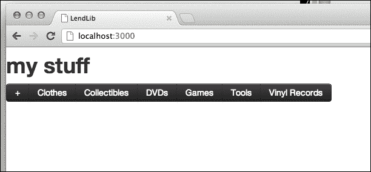
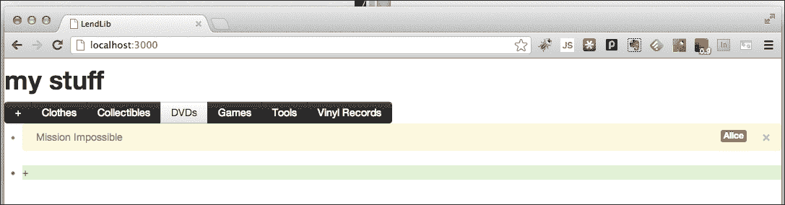
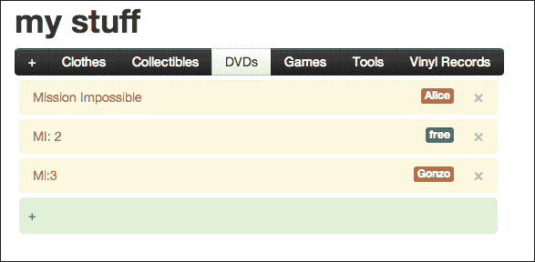
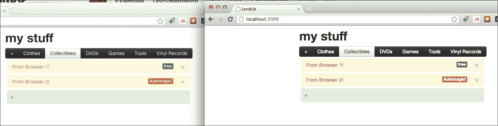

# 第四章：模板

到目前为止，我们只是对模板有了一个简单的了解，现在我们准备深入其中，使用 MVVM 设计模式创建一个工作应用程序。本章将深入介绍模板系统，并展示如何实现显示逻辑、向模型添加设计考虑（创建视图模型）以及处理数据流。

在本章中，您将完成以下任务：

+   完成借阅图书馆的核心功能

+   创建多个模板和模板逻辑

+   在数据模型中添加、删除和更新条目

+   观察响应性在实际工作中的应用，并在您的应用程序中使用它

# 一个新的 HTML 模板

我们已经通过使用`categories`模板创建了我们的分类。现在，我们想要将其提升到下一个级别，显示我们可能想让（除了 STEVE 之外的）人们借阅的实际项目。所以，当我们点击一个分类时，我们应该得到一个**项目**的**列表**。

让我们使用这个术语。我们需要一个地方来显示一个`list`。所以，让我们稍微修改一下`~/Documents/Meteor/LendLib/LendLib.html`代码的开头部分：

```js
<body>
 <div id="lendlib">
    <div id="categories-container">
      {{> categories}}
    </div>   
 <div id="list">
 {{> list}} 
 </div> 
 </div> 
</body>
```

通过添加这段代码，我们做了两件事：

1.  我们将`id="categories-container"`的`div`元素包裹在名为`lendlib`的`div`内。这是出于样式考虑，这样我们的`list`就能与`categories`模板大致对齐。

1.  我们在它下面添加了一个`div`，`id="list"`，并添加了一个对新模板的调用：`{{> list}}`。这是我们用于`items`的`list`的模板/占位符，我们将在接下来的部分中看到。

现在，我们已经创建了一个非常易于维护的结构，文档中有了明确的界限。我们知道`categories`（分类）将要放在哪里，我们也知道`items`（项目）的`list`（列表）将要放在哪里。

现在让我们来看看列表模板本身。虽然不简单，但仍然不难。在`LendLib.html`的最后，我们`categories`模板的闭合`</template>`标签下方，放置以下代码：

```js
<template name="list"> 
 <ul id="lending_list"> 
 {{#each items}} 
 <li class="lending_item alert"> 
 <button type="button" class="close delete_item" id="{{Name}}">×</button>

 {{Name}}

 {{#if lendee_editing}} 
 <input type="text" id="edit_lendee" class="span2 pull-right" value=""/> 
 {{else}} 
 <div class="lendee pull-right label {{LendClass}}"> {{Lendee}}</div> 
 {{/if}} 
 </li> 
 {{/each}} 
 {{#if list_selected}}
 <li class="alert-success" id="btnAddItem">&plus; 
 {{#if list_adding}}
 <input class="span4" id="item_to_add" size="32" type="text"> 
 {{/if}} 
 </li> 
 {{/if}} 
 </ul> 
</template>

```

让我们一步一步地来看，这样我们就明白每一行代码的作用：

```js
<template name="list"> 
 <ul id="lending_list"> 
 {{#each items}}
...

```

在这里，我们声明了一个 HTML`<template>`，名为`"list"`，以匹配我们在主体部分调用的列表模板。我们创建了一个无序列表`<ul>`，并给它一个`id`，这样我们以后如果需要的话就可以引用它。

然后我们开始一个模板化的`each`语句。这次，我们要遍历`items`。我们还没有创建 Meteor 的`items`模板，但我们应该很快就会做到。

```js
 <li class="lending_item alert"> 
 <button type="button" class="close delete_item" id="{{Name}}">×</button> 

 {{Name}}

```

现在，在`each`语句下，我们创建了一个`<li>`元素，并给它赋予了两个类名。`lending_item`这个类名是为了让我们能在视图模型（Meteor 模板代码）中引用它。`alert`这个类名是为了 Bootstrap，这样它就能漂亮地显示出来。

接下来，我们创建一个 `button`，如果我们选择删除项目，我们可以使用它。注意，我们给它一个 ID `id="{{Name}}"`。这将从 `items` View-Model 中读取，如果我们想从我们的 `items` 集合中删除 `item`，这将使我们的工作在未来变得容易得多。这个 `button` 上还有两个类名。`close` 是为 Bootstrap 添加的，`delete_item` 是添加的，这样我们可以在 View-Model 中引用它。

现在，就在那个下面，我们又有另一个模板占位符 `{{Name}}`。这样我们可以在显示元素内部使用项目的标题（例如，在 DVD 项目中，标题可能是 "Mission Impossible"）。我们很快就会看到它的实际应用。

现在我们开始了一系列条件语句。第一个条件语句与我们需要编辑谁在借阅我们的项目，或者 **借阅者** 有关：

```js
 {{#if lendee_editing}} 
 <input type="text" id="edit_lendee" class="span2 pull-right" value=""/> 
 {{else}} 
 <div class="lendee pull-right label {{LendClass}}"> {{Lendee}}</div> 
 {{/if}} 
 </li>
 {{/each}}

```

我们首先使用一个 `if` 语句来检查这个 `item` 的当前模式是否为 `lendee_editing`。也就是说，如果我们想编辑借阅者，我们就会处于 "lendee editing" 模式，因此（在我们的 JavaScript 文件中）`Template.list.lendee_editing` 会返回 `true`。如果是这种情况，我们需要一个文本框，因此包含了 `<input>` 元素，以及它的相关 `id`。

另一种情况——这也是默认情况——我们只想显示借阅者是谁，如果有的话。如果没有，我们可能想改变颜色或其他什么，但仍然希望它显示出来。所以，我们创建一个带有 Bootstrap 样式的 `label`，其形式为一个 `<div>` 元素。

在类声明的末尾，我们看到一个模板变量：`...{{LendClass}}"`。这个类添加是样式上的。它将告诉我们的 CSS 模板是显示为 "free"（有人可以借阅它）还是 "lent out"（借出）。如果是绿色，它是免费的，如果是红色，有人已经借走了。代表颜色的 CSS 类名将在 `LendLib.js` 中由 `item.LendClass` 属性确定，我们稍后会创建它。

然后我们来看一下 `div` 内的值：`{{Lendee}}`。这同样也是 `LendLib.js` 中的一个属性，作为 `item.Lendee` 属性，它会显示借阅者的名字，或者如果没有人借阅的话，显示 "free"。

然后我们有结束的 `</li>` 标签，以及 `each` 以 `{{/each}}` 结束。

现在，我们有了第二个 `if` 语句，而这个实际上是嵌套的 `if`。这个 `if` 语句在 `each` 语句之外，所以它不是针对特定项目的。这个 `if` 语句显示一个带 **+** 符号的浅绿色条，或者一个表单形式的 `<input>` 元素文本框，以便我们可以向我们的列表中添加项目：

```js
 {{#if list_selected}} 
 <li class="alert-success" id="btnAddItem">&plus; 
 {{#if list_adding}} 
 <input class="span4" id="item_to_add" size="32" type="text"> 
 {{/if}} 
 </li> 
 {{/if}} 
 </ul> 
</template>

```

所以我们看到第一个 `if` 语句，它取决于我们是否甚至显示任何列表项。如果我们正在显示，这意味着我们选择了一个列表。或者说，我们处于 `list_selected` 模式。跟踪这个是 View-Model 的工作的一部分，所以 `Template.list.list_selected` 可以在 `LendLib.js` 中找到。

然后我们创建一个`<li>`元素，用 Bootstrap 的`alert-success`类将其样式设置为绿色，并添加`+`号。

接下来是我们的嵌套（第二个）`if`。这个是检查我们是否在添加项列表。如果是，我们处于`list_adding`模式，因此我们将以`<input>`元素的形式显示文本框。如果不是，我们只会保留那个漂亮的浅绿色盒子，里面只有**+**号。

最后，我们结束嵌套的`if`，我们的`</li>`，我们的父级`if`，我们的`</ul>`，和我们的`</template>`。

# 粘合在一起

视图模型（MVVM）或控制器（MVC）或呈现器（MVP）被认为是 MV*应用程序模型的粘合剂。这是因为它将所有视图项，比如按钮或文本框，粘合到了模型上。

这个解释很复杂，是吧？好吧，你尝试着为它做更好的解释。它确实填补了空白，并将模型和视图粘合在一起。这个术语是别人发明的，不是我们，所以让我们抛开批判性观点，继续吧？

在本节中，我们将逐步讲解需要在`~/Documents/Meteor/LendLib/LendLib.js`中进行的所有更改，以将模板和数据模型粘合在一起。

## 我们的 items 视图模型

在我们在第二章创建的数据模型中，*响应式编程…它是有生命的！*，我们在创建几个`list`时添加了一些示例`items`。如果你还记得的话，我们是这样通过浏览器控制台操作的：

```js
> lists.insert({Category:"DVDs", items: [{Name:"Mission Impossible",Owner:"me",LentTo:"Alice"}]});
```

你会注意到那里有一个层级结构。`lists`集合中的每一个`list`都有一个`items`对象，它是一个数组：

```js
Items: [...]
```

我们需要将这个`items`数组呈现到我们的 HTML 模板中，但我们还需要一些额外的属性，以便视图知道如何处理它。具体来说，我们需要做的是：

+   返回借阅者姓名，如果没有借阅者则返回"free"（`item.Lendee`）

+   根据项目是否已借出（`item.LendClass`），返回 CSS 类（红色或绿色）。

所以，我们将从当前选定的列表中获取`items`集合，添加`Lendee`和`LendClass`属性，并使模板可用。

打开`~/Documents/Meteor/LendLib/LendLib.js`。

在`function focusText(...`的闭合`}`花括号后立即添加以下代码：

```js
};//<-----This is the end tag for focusText() -----

Template.list.items = function () {
 if (Session.equals('current_list',null)) return null; 
 else 
 { 
 var cats = lists.findOne({_id:Session.get('current_list')}); 
 if (cats&&cats.items) 
 { 
 for(var i = 0; i<cats.items.length;i++) { 
 var d = cats.items[i];  d.Lendee = d.LentTo ? d.LentTo : "free"; d.LendClass = d.LentTo ? 
 "label-important" : "label-success"; 
 }
 return cats.items; 
 }
 } 
};

```

我们将逐步讲解这个问题。

```js
Template.list.items = function () {
if (Session.equals('current_list',null)) return null; 
```

在这里，我们声明了`Template.list.items`函数，并检查是否选择了`list`。如果选择了`list`，`Session`变量`current_list`中将有一个值。如果没有，就没有返回任何东西的必要，所以我们直接返回 null。

### 提示

这就是视图模型在工作。它正在读取给定类别的内容，并根据用户是否选择了列表，将当前 UI 状态融入其中。这是粘合剂在工作。

如果选中了某个项目，我们首先需要找到类别。我们称之为`cats`，因为这个名字更短，尽管它不是严格意义上的最佳命名约定。但我们在乎吗？我们这样做是为了好玩，而且`cats`很棒！

```js
else 
{ 
  var cats = lists.findOne({_id:Session.get('current_list')}); 
```

我们正在使用 MongoDB 命令`findOne()`，并将`current_list`会话参数作为`_id`在选择器/查询中传递。如果有什么被选中，我们将得到一个单一的类别/列表。让我们确保我们确实这样做，并且我们还能得到`items`。

如果没有返回任何内容，或者该类别中没有`items`，我们真的需要确定`Lendee`或`LendClass`吗？所以让我们创建一个`if`语句，和一个在`if`内的`for`语句，只有在我们有值得迭代的元素时才会执行：

```js
    if (cats&&cats.items)
    { 
      for(var i = 0; i<cats.items.length;i++) {
        var d = cats.items[i]; 
  d.Lendee = d.LentTo ? d.LentTo : "free"; 
  d.LendClass = d.LentTo ? "label-important" : "label-success";
      }; 
      return cats.items; 
    }; 
  }; 
};
```

首先，我们检查`cats`和`cats.items`是否未定义/为空。

接下来，我们遍历`items`中的所有值（如果你还记得，`items`是一个数组）。为了更容易，我们声明变量`d = cats.item[i]`。

现在我们添加了`Lendee`属性，检查项目是否借给了任何人，`LentTo`属性。如果没有（如果`LentTo`不存在），我们将分配字符串`"free"`。

同样，如果`LentTo`存在，我们将红色 Bootstrap 标签类`label-important`作为`LendClass`。如果项目没有借出，我们将使用绿色 Bootstrap 类`label-success`。

最后，在我们的新`Lendee`和`LendClass`属性分配之后，我们将返回`cats.items`。我们没有将这些属性保存到我们的模型中。那是因为它们*不是*模型的一部分。它们由视图使用，因此我们只通过 View-Model 模板使它们可用。

## 附加视图状态

现在我们需要为所有不同的视图状态声明模板。也就是说，我们需要向 View-Model/session 添加属性，这样我们才能知道我们在看什么，我们在编辑什么，以及应该隐藏/显示什么。具体来说，我们需要在四种情况下访问状态值：

+   我们在看列表吗？（`list_selected`）

+   我们在看哪个列表？（`list_status`）

+   我们在向列表中添加项目吗？（`list_adding`）

+   我们在更新借阅人吗？（`lendee_editing`）

在`LendLib.js`中我们新创建的 items 模板/函数下方添加以下代码：

```js
      return cats.items; 
    }; 
  }; 
}; // <---- ending bracket for Template.list.items function ----

Template.list.list_selected = function() { 
 return ((Session.get('current_list')!=null) && (!Session.equals('current_list',null))); 
}; 

Template.categories.list_status = function(){ 
 if (Session.equals('current_list',this._id)) 
 return ""; 
 else 
 return " btn-inverse"; 
}; 

Template.list.list_adding = function(){ 
 return (Session.equals('list_adding',true)); 
}; 

Template.list.lendee_editing = function(){ 
 return (Session.equals('lendee_input',this.Name)); 
};

```

让我们逐一分析这些模板函数。

```js
Template.list.list_selected = function() { 
return ((Session.get('current_list')!=null) && (!Session.equals('current_list',null))); 
}
```

`Session`变量`current_list`可以是`undefined`或`null`。如果是`undefined`，`Session.equals('current_list'),null)`将返回`true`。所以我们需要检查这两种情况，很不幸。

```js
Template.categories.list_status = function(){ 
if (Session.equals('current_list',this._id)) 
return ""; 
else 
return "btn-inverse"; 
}; 
```

`list_status`用于告诉类别按钮是否应显示为选中状态。最容易的方法是通过一个 CSS 类。Bootstrap 使用`btn-inverse`显示黑白文本，但这是我们默认的按钮外观。因此，因为我们使用了完全相反的颜色方案，我们将使用 Bootstrap 的普通黑白外观来显示选中的类别。

换句话说，对于`current_list`，我们将返回`""`（默认按钮的外观和感觉）。对于所有其他列表/类别，我们将返回`"btn-inverse"`，以改变 CSS 样式。

你可能想知道`this._id`。在这个实例中，`this`指的是 MongoDB 记录（技术上来说是文档游标），而`._id`是那个“记录”的唯一 MongoDB 标识符。这称为**上下文**，在这种情况下使用 HTML 模板时，上下文是从哪里调用模板的列表/类别元素。

```js
Template.list.list_adding = function(){ 
  return (Session.equals('list_adding',true)); 
}
```

这个真的很直接。如果`Session`变量`list_adding`是`true`，我们在添加到列表。如果不是，我们就不添加。

```js
Template.list.lendee_editing = function(){ 
  return (Session.equals('lendee_input',this.Name)); 
}
```

为了检查我们是否应该进入借阅者编辑模式，我们将检查`Session`变量`lendee_input`，看它是否有值，以及这个值是否是我们刚刚点击物品的`Name`。再次说明，这是隐含的上下文。这次，不是列表，而是项目。我们怎么知道这个？因为函数是从哪里调用的。还记得 HTML 吗？

```js
<li class="lending_item alert"> 
  <button type="button" class="close delete_item" id="{{Name}}">×</button> 
{{Name}} 

{{#if lendee_editing}}
```

注意我们如何在`if`语句中使用`lendee_editing`，正好在我们使用`{{Name}}`之后。这显示了上下文。`LendLib.js`中的`this.Name`与`LendLib.html`中的`{{Name}}`具有相同的上下文。换句话说，`this.Name`引用了与`{{Name}}`相同的属性。

既然我们在 HTML 模板中，我们需要对 HTML 类别模板进行一次更改。我们等到现在，这样更改才有意义。当你做出以下代码更改时，你会看到模板`{{list_status}}`和`{{_id}}`的使用，以及为什么`this._id`的上下文突然变得有意义。

在`LendLib.html`中找到以下行（应该在第 27 行左右）：

```js
{{#each lists}}
  <div class="category btn btn-inverse">
    {{Category}} 
</div> 

{{/each}}
```

然后将其更改为如下代码片段的样子：

```js
{{#each lists}}
  <div class="category btn {{list_status}}" id="{{_id}}">
    {{Category}}
  </div> 

{{/each}}
```

## 添加事件

我们现在将连接所有事件。不是在 HTML（我们的视图）中这样做，而是在模板声明（我们的视图模型）中这样做。

第一个发生在`Template.categories.events`声明中，因为我们需要添加一个事件，来改变`Session`变量`current_list`。如果你记得的话，`current_list`帮助我们知道是否有选中的列表（`list_selected`）以及那个列表是什么（`list_status`）。

在`LendLib.js`中，在`Template.categories.events`函数的`'focusout #add-category'`事件声明和最后的`});`括号之间，添加以下代码：

```js
        Session.set('adding_category', false);
      } 
    } 
  }, 
  'focusout #add-category': function(e,t){
    Session.set('adding_category',false);
  }, 
 'click .category': selectCategory 
});
```

### 小贴士

不要忘记在`'focusout... function(e,t){...}`代码块后面加上逗号（`,`）。

这为具有 CSS 类`"category"`的每个按钮添加了点击事件，并调用`selectCategory()`函数。我们现在就声明那个函数。

在`focusText()`函数之后，在`Template.list.items`声明之前，添加以下代码：

```js
function selectCategory(e,t){ Session.set('current_list',this._id);
}  

Template.list.items = function () {
...
```

是的，你本可以把这个放在任何地方。是的，你本可以简单地在一个点击事件声明中嵌入一个通用函数。那么为什么放在这里呢？因为这样能让我们的代码更具可读性，而且我们需要一个部分来处理所有将要需要的添加/删除/更新调用，所以正好放在这里。

是的，很简单。它只是用`this._id`更新了`Session`变量`current_list`。这里`this`的上下文是类别/列表，因此`_id`是记录的 MongoDB 生成的 ID。

好的，现在我们已经处理了所有类别的 events，让我们来处理项目的 events。在`if (Meteor.is_client) {...`代码块的最后一行，在闭合的`}`括号内，放入以下代码：

```js
Template.list.lendee_editing = function(){ 
  ... 
} 	 

Template.list.events({ 
 'click #btnAddItem': function (e,t){
 Session.set('list_adding',true); 
 Meteor.flush(); 
 focusText(t.find("#item_to_add")); 
 }, 
 'keyup #item_to_add': function (e,t){ 
 if (e.which === 13) 
 { 
 addItem(Session.get('current_list'),e.target.value); 
 Session.set('list_adding',false); 
 } 
 }, 
 'focusout #item_to_add': function(e,t){ 
 Session.set('list_adding',false); 
 }, 
 'click .delete_item': function(e,t){ 
 removeItem(Session.get('current_list'),e.target.id); 
 }, 
 'click .lendee' : function(e,t){
 Session.set('lendee_input',this.Name); 
 Meteor.flush();
 focusText(t.find("#edit_lendee"),this.LentTo); 
 }, 
 'keyup #edit_lendee': function (e,t){ 
 if (e.which === 13) 
 { 
 updateLendee(Session.get('current_list'),this.Name,
 e.target.value); 
 Session.set('lendee_input',null); 
 } 
 if (e.which === 27) 
 {
 Session.set('lendee_input',null); 
 } 
 } 
});

}//<----this is the closing bracket for if(Meteor.is_client) ----
```

六个事件！看起来比实际更吓人。像往常一样，让我们一步步分解。

```js
Template.list.events({ 
  'click #btnAddItem': function (e,t){
    Session.set('list_adding',true); 
    Meteor.flush(); 
    focusText(t.find("#item_to_add")); 
  },
```

我们声明`Template.lists.events`，并枚举我们的事件。第一个是为添加一个项目。添加项目的按钮有趣的是，命名为`btnAddItem`，所以我们只需要添加声明，然后写我们的函数。

我们将`list_adding`设置为`true`。由于我们使用`Session.set()`，这种变化会通过我们的模板级联。这是一个反应，或者说反应式编程在起作用。我们还调用`Meteor.flush()`以确保清理 UI，然后，作为对用户的礼貌，我们将文本框（名为`item_to_add`）聚焦，这样我们的亲爱的用户就可以开始打字了。

```js
  'keyup #item_to_add': function (e,t){
    if (e.which === 13) 	   
    {
      addItem(Session.get('current_list'),e.target.value);
      Session.set('list_adding',false);
    }
  },
```

### 提示

你可以在 Meteor 文档中了解更多关于`Meteor.flush()`做的事情，地址是[`docs.meteor.com/#meteor_flush`](http://docs.meteor.com/#meteor_flush)。

下一个事件是基于我们的`item_to_add`文本框的`keyup`事件。如果我们按下*Enter*或 Return 键（`e.which === 13`），我们将调用`addItem()`函数来更新数据模型，然后我们将隐藏文本框。我们怎么做呢？当然设置`list_adding = false`。再次强调，通过`Session.set()`来做会使这种变化通过我们的模板级联。

你可能还漏掉了一件别的事情：记得我们曾在第二章, *响应式编程…它是有生命的！*, 使用控制台手动添加一个类别/列表吗？变化立刻反映在 HTML DOM 中。这里也是同样的道理。当`addItem()`更新数据模型时，这个变化会触发`Template.list.items`的模板刷新。

```js
  'focusout #item_to_add': function(e,t){
    Session.set('list_adding',false);
  }, 
```

触发器创造了一个情境，这样如果我们改变主意不想添加一个`item`，我们只需要点击离开它。如果文本框`item_to_add`触发了`focusout`事件，我们将设置`Session`变量`list_adding`为`false`，模板将会级联。

```js
  'click .delete_item': function(e,t){ 
    removeItem(Session.get('current_list'),e.target.id); 
  },
```

记得我们曾在 HTML`列表`模板中创建了那个小小的![Adding events]按钮吗？这个按钮属于 CSS 类`delete_item`，当用户点击它时，我们将调用`removeItem()`函数，传递`current_list`和被点击的 HTML 元素中的`id`，碰巧是`Name`项（我们在`LendingLib.html`的第 39 行添加了`id="{{Name}}"`）。

```js
  'click .lendee' : function(e,t){
    Session.set('lendee_input',this.Name); 
    Meteor.flush();
    focusText(t.find("#edit_lendee"),this.LentTo); 	
  }, 
```

现在，我们关注`lendee`部分/按钮。如果你还记得，我们在`LendingLib.html`中设置了一个带有 CSS 类`lendee`的`<div>`元素。我们现在声明，无论何时点击其中一个`<div>`元素，我们都将执行与想要向`list`添加`item`非常相似的操作：

1.  将控制文本框可见性的`Session`变量设置为`true`（`lendee_input`）。

1.  刷新 UI（`Meteor.flush()`）。

1.  设置文本框的焦点（`focusText()`）。

还有一个事件处理程序：

```js
  'keyup #edit_lendee': function (e,t){
    if (e.which === 13)
    {
      updateLendee(Session.get('current_list'),this.Name,
      e.target.value); 
      Session.set('lendee_input',null); 
    }
    if (e.which === 27) 
    { 		   
      Session.set('lendee_input',null); 	  
    }
  }
});
```

具有`id="edit_lendee"`的文本框有两个`keyup`条件。

如果我们按下*Enter*或 Return（`e.which === 13`），我们将使用`updateLendee()`更新数据模型上的`LentTo`属性。然后通过将`lendee_input`设置为`null`来隐藏文本框。记住，更新数据模型，设置一个`Session`变量将导致模板刷新（又是反应式编程）。

如果我们决定不喜欢这些更改，我们将按下*Esc*键（`e.which === 27`），在这种情况下，我们将`lendee_input`设置为`null`，让反应式编程隐藏文本框。

## 模型更新

我们还剩下两件事要做。我们需要照顾好让我们的应用变得漂亮（不过还不是现在），我们需要创建刚刚在`events`部分提到的`addItem()`、`removeItem()`和`updateLendee()`函数。

所以让我们开始工作！在`LendingLib.js`中的帮助器部分（正好在`Template.lists.items`上方，第 68 行左右），让我们添加我们的`addItem()`函数：

```js
function addItem(list_id,item_name){
 if (!item_name&&!list_id)
 return; 
 lists.update({_id:list_id}, 
 {$addToSet:{items:{Name:item_name}}}); 
}

Template.list.items = function () {
...
```

`addItem()`函数有两个参数：`list_id`和`item_name`。

`list_id`用于`update`语句的选择器（查询）部分，而`item_name`包含要添加到新`item`的`item.Name`属性的值。

但首先，我们需要检查是否有`item_name`和`list_id`的值。如果没有，我们就会`return`。

现在，我们将对`lists`集合调用 MongoDB 的`update()`函数。`{_id:list_id}`是选择器。我们告诉 MongoDB 找到具有`_id` `= list_id`的记录。然后我们告诉 MongoDB 我们将要执行哪种更新。在这种情况下，我们将使用`$addToSet`，它将追加到一个数组中。我们要追加什么？

`{items:...`表示我们正在更新`items[]`数组。`{Name:item_name}`是我们要添加的，它是`Name`属性。这相当于说`item.Name = item_name`。

一旦我们添加了这个功能，正如你现在可能已经猜到的那样，模板将自动更新，因为数据模型发生了变化。停下来思考一下。在六行代码中，我们执行了一个更新查询*并*将更改传播到我们的 UI。六行！这难道不是很神奇吗？

接下来我们处理`removeItem()`：

```js
function removeItem(list_id,item_name){ 
if (!item_name&&!list_id) 
return; 
lists.update({_id:list_id}, 
{$pull:{items:{Name:item_name}}}); 
}

Template.list.items = function () {
...
```

哇，这看起来与`addItem()`函数非常相似。事实上，我们确实使用了相同的`update()`函数，只是这次使用了不同的操作。这次我们将使用`$pull`，从`items[]`数组中删除一个元素，其中`Name == item_name`。再一次，我们只需要六行代码。数据模型和 UI 都将自动更新。

现在我们来处理`updateLendee()`，这有点复杂，但只是因为 Meteor 实际上使用的是 minimongo，这是 MongoDB 的一个简化版，且不支持游标变量。这意味着，我们不是使用类似于`items.$.Name`的东西，其中`$`是游标位置，而是需要遍历`items[]`数组，更新值，然后调用一个更新操作，用我们的更新后的数组替换整个`items[]`数组。下面是我们在`LendLib.js`中是这样做的：

```js
function updateLendee(list_id,item_name,lendee_name){
 var l = lists.findOne({"_id":list_id , 
 "items.Name":item_name}); 
 if (l&&l.items) 
 { 
 for (var i = 0; i<l.items.length; i++)
 { 
 if (l.items[i].Name === item_name)
 {
 l.items[i].LentTo = lendee_name;
 } 
 }
 lists.update({"_id":list_id},{$set:{"items":l.items}}); 
 } 
};

Template.list.items = function () {
...
```

我们获取了`list_id`、`item_name`和`lendee_name`，这样我们就可以找到正确的记录（我们用`list_id`和`item_name`来做到这一点），然后用`lendee_name`中的值更新`LentTo`属性。

为了节省一些打字，我们声明了一个变量`l`，使用了 MongoDB 的`findOne()`函数。这个函数需要一个由两部分组成的选择器语句：`_id:list_id`和`"items.Name":item_name`。这个选择器基本上是在说：“找到一个记录，其中`_id == list_id`且`items[]`数组中有一个记录，其中`Name == item_name`。”

如果`l`有一个值，并且`l`也有`items`，我们将进入我们的`for`循环。在这里，我们特别检查哪个数组元素具有`Name == item_name`。如果我们找到一个，我们将`LentTo`属性设置为`lendee_name`。

一旦我们完成了`for`循环，我们将调用 MongoDB 的`update()`函数，并使用`$set`操作用新的`{"items":l.items}`替换旧的`items[]`数组。自动更新再次发生，我们的 UI（视图）和数据文档（模型）再次保持同步。

## 样式更新

现在，你可以运行这个应用程序。它将是一场视觉灾难，因为我们还没有设置任何 CSS 样式，但让我们快速搞定这件事。我们都会盯着一场车祸看的，承认吧！确保你的应用程序正在运行（在控制台输入`> meteor`）并导航到`http://localhost:3000`：



点击**DVDs**，你应该会看到**Mission Impossible**的其中一个条目：



这并没有那么糟糕，除了有些宽度和高度问题，但那是因为我们使用了 Bootstrap。让我们继续解决剩下的 UI 问题。

首先，我们在`LendLib.js`中有一个最后的更改。更改`focusText()`函数（位于大约第 55 行）：

```js
//this function puts our cursor where it needs to be. 
function focusText(i) {
  i.focus();
  i.select(); 
};
```

现在应该是这样的：

```js
//this function puts our cursor where it needs to be. 
function focusText(i,val) {
  i.focus(); 
 i.value = val ? val : ""; 
  i.select(); 
};
```

这个更改只是使得当我们去编辑一个已经有值的东西（比如借阅人）时，这个值会传输到文本框中。这使得用户更容易看到当前借阅人是谁。`val ? val : ""`这个条件语句是必要的，因为如果`val`没有被传递或者是 null，`"undefined"`会被放进文本框中。

我们现在想要更新所有其他视觉特性的 CSS。我们在这里不会详细介绍 CSS，因为有更好的方法来处理它，而且我们不是 CSS 专家。所以只需将以下内容添加到`~/Documents/Meteor/LendLib/LendLib.css`中，并保存更改：

```js
/* CSS declarations go here */ 
#lendlib{ 
 width:535px; 
 margin:0 auto; 
} 
#categorybuttons{ 
 width:100%; 
} 
#lending_list{
 list-style:none; 
 margin:0; 
 padding:0; 
} 
#lending_list li{ 
 list-style:none; 
 margin:5px; 
} 
#lending_list li.lending_item:hover{ 
 background-color:#fc6; 
 color:#630; 
} 
#lending_item{
 vertical-align:middle; 
} 
#add_item{
 padding-left:5px; 
} 
#btnAddItem{
 padding:10px;
 border-radius:5px; 
} 
#btnAddItem:hover{
 background-color:#B7F099; 
} 
#edit_lendee{
 padding-top:0; 
 margin-top:-2px; 
} 

```

如果你保持了`http://localhost:3000`打开，你的浏览器将自动刷新。如果你没有，重新打开它（确保 Meteor 正在运行）并观察结果：



不要忘记测试你所有的新的功能！添加新的类别，将项目添加到列表中，更改借阅人，删除借阅人，删除项目等等，只是感受一下模型更新有多快和多干净。

现在，打开两个浏览器，都指向`http://localhost:3000`。你会注意到，在一个浏览器中做的更改在另一个浏览器中也会反映出来！就像之前一样，Meteor 正在处理客户端和服务器之间的数据模型同步，任何在客户端上的更改都会通过服务器传播到其他客户端。



一旦你创建了足够多的项目和列表，就可以继续下一章。

# 总结

在本章中，你已经完成了你借贷图书馆应用的模板、事件和数据模型部分。你已经创建了语句来添加、删除和更新你的记录，并实现了 UI 状态的改变。你亲自看到了响应式编程是如何工作的，并对你所使用的上下文有了坚实的基础。你现在能够从零开始创建一个应用，使用 Meteor 的核心功能快速开发并拥有健壮的功能。在下一章中，你将更深入地了解 Meteor 的数据缓存和同步方法，并加强你的应用。
