# 第五章：数据，Meteor 风格！

我们已经接近完成借阅图书馆应用程序的开发，而无需过多担心我们的数据是如何被存储的。Meteor 的数据缓存和同步方法故意构建，以使应用程序这部分尽可能简单，这样你就可以集中精力编写伟大的程序，而不是花很多时间处理数据库连接、查询和缓存。

然而，我们确实想回顾一下方法，并确保我们有一个坚实的基础，了解 Meteor 如何处理数据，这样我们就可以进行一些常见的优化，并且更快地构建我们的应用程序。

在本章中，你将学习以下主题：

+   MongoDB 和文档导向存储

+   广播变化——Meteor 如何使你的网络应用具有反应性

+   配置发布者——如何优化和保护你的数据

# 文档导向存储

Meteor 使用 MongoDB 的一个版本（minimongo）来存储来自你模型的所有数据。它能够使用任何其他 NoSQL/文档导向数据库，但 MongoDB 随 Meteor 安装包默认提供。这个特点使得你的程序更简单、更容易编写，并且非常适合快速、轻量级的数据存储。

## 那么，为什么不使用关系型数据库呢？

传统上，数据是使用关系模型进行存储的。关系模型，以及它所有的相关规则、关系、逻辑和语法，是现代计算的一个不可或缺且极其有价值的部分。关系型数据库那种严格结构，对每个记录、关系和关联的精确要求，为我们提供了快速搜索、可扩展性以及深入分析的可能性。

然而，那种精确性并不总是必要的。例如，在我们的借阅图书馆的情况下，一个完整的关系型数据库可能是杀鸡用牛刀。实际上，在某些情况下，拥有一个灵活的数据存储系统更为有效，这个系统你可以快速扩展，而不需要大量的重编码。

例如，如果你想要向你的`list`对象添加一个新属性，只是简单地添加新属性，让数据库去操心，而不是必须重构你的数据库代码、添加新列、更新你所有的 SQL 语句和触发器，并确保所有之前的记录都有这个新属性，要简单得多。

文档导向存储就此发挥作用。在文档导向存储系统中，你的数据存储由一系列键值对文档组成。那个文档的结构是怎样的？数据存储其实并不关心。它可能包含几乎任何东西，只要每个记录有一个唯一的键，以便它可以被检索到。

所以，在一个文档条目中，你可能会有一个非常简单的文档。也许是一个键值对。

```js
{name:phone_number}
```

然后在另一个文档条目（在同一个数据存储中），你可能会有一个复杂的对象，有嵌套数组、嵌套对象等等。

```js
{ people: [
  {firstname:"STEVE", lastname:"Scuba", phones :[
    {type:cell, number:8888675309},
    {type:home, number:8005322002}]
  },
  {firstname:...
    ...
  }]
}
```

毕竟，它可能是威廉·莎士比亚的全集。真的不重要。只要数据存储能够为那个文档分配一个唯一的键，它就可以被存储。

正如您可能已经猜到的那样，缺乏结构*可以*使查询、排序和操作那些文档的效率降低。但没关系，因为我们的主要关注点是编码的便利性和开发速度，而不是效率。

此外，由于我们的应用程序只有几个核心功能，我们可以快速确定我们将最经常使用的查询，并将文档架构围绕那个进行优化。这使得在某些情况下，面向文档的数据库实际上比传统的关系数据库表现得*更好*。

### 提示

市场上有一些相当复杂的面向文档的存储解决方案，有些人认为它们与标准的关系数据库一样有效，甚至更有效，但这个讨论超出了本书的范围。

鉴于面向文档的存储系统的灵活性，它非常适合快速更改，Meteor 提供的基础库使我们不必担心连接或结构。我们只需要对如何检索、添加和修改这些文档有高层次的理解，其余的都可以留给 Meteor。

## MongoDB

MongoDB——这个词是对“humongous”（巨大）的玩弄——是一个开源的 NoSQL（不仅仅是 SQL）数据库。它提供了如索引、链接和原子操作等复杂功能，但它的核心仍然是一个面向文档的存储解决方案。

### 提示

想要了解更多关于 MongoDB 的信息，请访问官方网站 [`www.mongodb.org`](http://www.mongodb.org)。

使用简单命令，我们可以查看哪些记录（哪些文档）可用，将那些记录转换成 JavaScript 对象，然后保存那些更改后的对象。把 MongoDB 记录想象成实际文本文档：

1.  查找并打开文档进行编辑（Meteor 等效：`lists.find (...)`）。

1.  修改文档（Meteor 等效：`lists.update({...})`）。

1.  保存文档（自动通过`.update()`函数完成）。

没那么简单，如果你想要成为 MongoDB 领域的专家，还有很多语法你需要学习，但你可以清晰地看到这种简单、干净的面向文档的方法：查找/创建一个记录，进行更改，并将记录保存/更新到数据存储中。

我们需要讨论一个最后一个概念，以帮助您更好地理解 MongoDB 是如何工作的。它被称为数据库，但把它想象成文档的集合更容易。集合是索引化的，可以快速访问，但它仍然是一个集合，而不是关系表/实体的组。就像你会在硬盘上想象一个文件夹，你把所有的文本文档都放在里面，把 MongoDB 想象成一个文档的集合，所有这些文档都可以访问并且可以“打开”，更改和保存。

## 使用直接命令

为了更好地了解 MongoDB 如何工作，让我们在命令行中玩得开心一些。

1.  首先，确保您的应用程序正在运行（打开一个终端窗口，`cd`到`~/Documents/Meteor/LendLib`目录，并执行`meteor`命令）。接下来，打开浏览器访问`http://localhost:3000`。

1.  现在，您可能想打开一个*额外的*终端窗口，`cd`到`~/Documents/Meteor/LendLib`目录，并运行以下命令：

    ```js
    meteor mongo

    ```

    您应该看到以下类似屏幕截图的消息：

    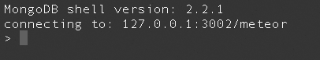

您现在已连接到您借阅图书馆应用程序的运行 MongoDB 数据库。让我们用几个命令四处看看。

1.  首先，让我们打开帮助屏幕。输入以下命令并按*Enter*：

    ```js
    > help

    ```

1.  您将获得一个命令列表，以及每个命令的简要说明。其中一个特别能让我们看到*更多*命令：`db.help()`。这将为我们提供数据库相关命令的列表。在您的终端窗口中输入以下内容，然后按*Enter*：

    ```js
    > db.help()

    ```

    不要被可能的命令数量吓到。除非您想成为 MongoDB 专家，否则您不需要了解所有这些。您只需要知道几个，但四处看看永远不会伤害任何人，所以让我们继续。

1.  如前所述，文档存储在 MongoDB 中的一个逻辑分组中，称为集合。我们可以亲眼看到这一点，并直接在终端窗口中查看我们的 lists 集合。要查看所有可用集合的列表，请输入以下内容：

    ```js
    > db.getCollectionNames()

    ```

1.  在您的响应中，您将找到您借阅图书馆集合的名称：`lists`。让我们继续查看`lists`集合。输入以下内容：

    ```js
    >  db.getCollection('lists')

    ```

1.  嗯，这并不是很有趣。我们得到的只是`meteor.lists`。我们希望能够对该集合执行一些查询。所以这次，让我们将集合分配给一个变量。

    ```js
    > myLists = db.getCollection('lists')

    ```

    看来我们得到了与上次相同的结果，但我们得到的远不止这些。现在，我们将`lists`集合分配给变量`myLists`。因此，我们可以在终端窗口中运行与我们在 Meteor 代码中相同的命令。

1.  让我们获取`Clothes`列表，该列表目前没有任何项目，但仍然存在。输入以下命令：

    ```js
    >  Clothes = myLists.findOne({Category:"Clothes"})

    ```

    这将返回一些非常基本的 JSON。如果您仔细看，将能够看到空的项目数组，表示为`"items" : [ ]`。您还会注意到一个`_id`键值，旁边有一个长数字，类似于以下内容：

    ```js
    "_id" : "520e4f45-8469-47b9-8621-b41e60723de0",
    ```

    我们没有添加那个`_id`。MongoDB 为我们创建了它。这是一个唯一键，因此如果我们知道它，我们就可以更改该文档，而不会干扰其他文档。我们实际上在我们借阅图书馆应用程序的多个位置使用这个。

如果您在`~/Documents/Meteor/LendLib/LendLib.js`中查看，您将看到以下用于向列表添加项目的函数：

```js
function addItem(list_id,item_name){
  if (!item_name&&!list_id)
    return;
  lists.update({_id:list_id},
  {$addToSet:{items:{Name:item_name}}}); 
}
```

注意，当我们调用`lists.update()`函数时，我们通过`_id`来识别我们要更新的文档。这确保了我们不会意外地更新多个文档。例如，如果你给两个列表赋予相同的类别名称（例如，"DVDs"），并使用类别作为选择器`({Category:"DVDs"}`），你将对这两个类别列表采取行动。如果你 instead 使用`_id`，它将只更新具有匹配`_id`的唯一文档。

回到终端，现在我们的`lists`集合有了变量`myLists`，我们将`Clothes`变量赋予了代表"Clothes"列表的`lists`集合中的文档。

注意一下目前`Clothes`列表在浏览器中的样子。

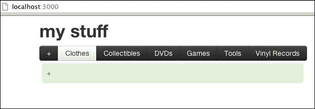

让我们继续将我们最喜欢的衬衫添加到`Clothes`列表中。我们将在终端窗口直接执行此操作。输入以下命令：

```js
>myLists.update({_id:Clothes._id},{$addToSet:{items:{Name:"Favorite Shirt"}}})

```

这个命令使用`Clothes._id`作为选择器更新`myLists`，并调用`$addToSet`，添加一个名为`Name:"Favorite Shirt"`的项目。Meteor 更新需要几秒钟，但很快您就会看到您最喜欢的衬衫已添加到列表中。

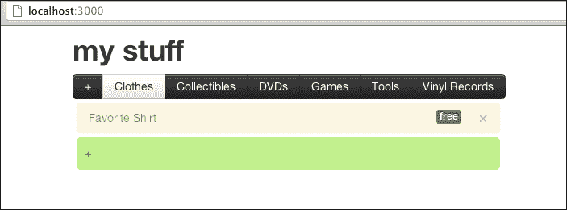

如果您重新运行`Clothes`赋值命令`Clothes = myLists.findOne({Category:"Clothes"})`，您现在会看到`items`数组有一个您最喜欢的衬衫的条目。

我们可以同样轻松地更新或删除一个项目，使用不同的参数调用`.update()`函数（`$pull`用于删除，`$set`用于更新）。

### 提示

对于代码示例，请参阅`LendLib.js`中的`removeItem()`和`updateLendee()`函数。

要深入了解 MongoDB 命令，请访问[`mongodb.org`](http://mongodb.org)并点击**TRY IT OUT**。

既然我们已经浏览了一些可以直接实施的命令，让我们重新审视一下我们的`LendLib.js`代码，讨论一下追踪我们集合变化的响应式代码。

# 广播变化

使用发布/订阅模型，Meteor 不断寻找集合和`Session`变量的变化。发生变化时，会触发一个变化事件（或发布）。回调函数监听（或订阅）正在广播的事件，当它订阅的特定事件发布时，函数中的代码将被激活。或者，数据模型可以与 HTML/Handlebars 模板的某些部分直接绑定，这样当发生变化时，HTML 将被重新渲染。

## 发布的事件

那么，何时发布事件呢？如前所述，当模型发生更改时会广播事件。换句话说，当集合或变量被修改时，Meteor 发布适当的变化事件。如果将文档添加到集合中，将触发一个事件。如果已存在于集合中的文档被修改并保存回集合中，将触发一个事件。最后，如果`Session`变量被更改，将触发一个事件。函数和模板正在监听（订阅）特定事件，并将适当地处理数据的更改。

如果您回想起来自第三章，*为什么 Meteor 如此棒！*，这是模型-视图-视图模型模式在起作用。在一个反应式上下文中，函数和模板会响应模型的更改。反过来，视图中的动作将通过视图模型逻辑创建对模型的更改：

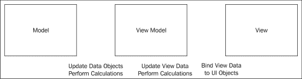

Meteor 的 MVVM 是一种干净、简洁的开发模式：

1.  设置订阅以监控模型更改（模型=集合、文档和`Session`变量）。

1.  创建逻辑来处理视图事件（视图事件=按钮点击、文本输入等）。

1.  更改模型，当逻辑需要时（更改=已发布的事件）。

一圈又一圈地转，按钮点击导致模型更改，然后触发一个事件，模板监听这个事件。根据模型更改更新视图。洗发水，冲洗。重复。

# 配置发布者

到目前为止，我们一直在使用`autopublish`。这意味着，我们没有为任何事件或集合编写特定的发布事件。这对于测试来说很好，但我们希望对发布的事件和文档有更多的控制，以便我们可以提高性能和安全性。

如果我们有一个大数据集，我们可能不希望每次都返回整个集合。如果使用`autopublish`，将返回整个集合，这可能会减慢速度，或者可能会暴露我们不想暴露的数据。

## 关闭 autopublish

是时候关闭`autopublish`了。如果您正在运行 Meteor 应用程序，请通过打开您运行`meteor`命令的终端窗口来暂时停止它。您可以按*Ctrl* + *C*键停止它。一旦它停止，请输入以下命令：

```js
> meteor remove autopublish

```

这移除了`autopublish`库，这个库负责 Meteor 内部所有事件的自动发布。

### 提示

通常建议从您的项目中移除`autopublish`。`autopublish`用于开发和调试，当您准备认真使用应用程序时应关闭。

通过关闭此功能，您实际上使您的应用程序什么也不做！恭喜您！您可以通过重新启动 Meteor 服务（输入`meteor`命令并按*Enter*键），然后打开/导航到`http://localhost:3000`来查看您的惊人进步。您将看到以下屏幕截图：

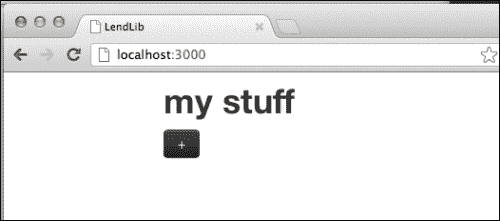

分类/列表消失了！你甚至可以在控制台进行检查。输入以下命令：

```js
> lists.find().count()

```

你应该看到一个`6`的计数，但你会发现计数是`0`：

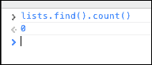

这是怎么回事呢？实际上，原因很简单。因为移除了`autopublish`库，服务器不再广播我们模型的任何更改。

我们为什么要这么做呢？破坏我们应用的目的是什么？啊！因为我们想要让我们的应用更高效。我们不是自动获取每个记录，而是只获取我们需要的记录，以及这些记录的最小数据字段集。

## 列出分类

在`LendLib.js`中，在`if(Meteor.isServer)`块内，创建以下`Meteor.publish`函数：

```js
Meteor.publish("Categories", function() {
 return lists.find({},{fields:{Category:1}}); 
});

```

这告诉服务器发布一个`"Categories"`事件。每当函数内部变量发生变化时，它都会发布这个事件。在这个例子中，是`lists.find()`。每当对`lists.find()`的结果产生影响的变化发生时，Meteor 将触发/发布一个事件。

如果你注意到了，`lists.find()`调用并不是空的。有一个选择器：`{fields:{Category:1}}`。这个选择器告诉`lists.find()`调用只返回`fields:`指定的内容。并且只指定了一个字段——`{Category:1}`。

这段 JSON 代码告诉选择器我们想要获取`Category`字段（`1`=真，`0`=假）。因为提到的唯一字段是`1`（真），Meteor 假定你希望排除所有其他属性。如果你有任何字段设置为`0`（假），Meteor 会假定你希望包括所有你没有提到的其他字段。

### 提示

有关`find()`函数的更多信息，请查阅 MongoDB 文档：[`www.mongodb.org/display/DOCS/Advanced+Queries`](http://http://www.mongodb.org/display/DOCS/Advanced+Queries)。

所以，如果你保存这个更改，你的浏览器会刷新，然后...显示没有任何变化！

为什么这么做呢？正如你可能会猜到的，移除`autopublish`库不仅仅是去除了`publish`事件。它还去除了监听器/订阅者。我们没有为`Categories`事件通道设置任何订阅者。因此我们需要添加一个订阅者事件，以便能够接收到`Categories`通道的信息。

在`if (Meteor.isClient)`函数的最顶部，在开括号内输入以下代码行：

```js
Meteor.subscribe("Categories");

```

保存这个更改，你现在将看到`Categories`回到了它们应该在的位置。

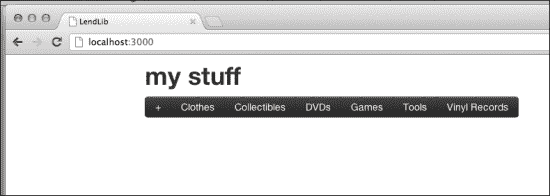

在我们庆祝之前，先点击**服装**分类。

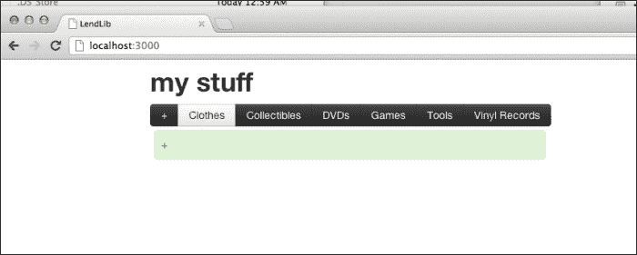

我们最喜欢的衬衫不见了！正如你现在可能已经猜到的，这是因为我们设置的发布事件非常具体。在`Categories`通道中发布的唯一字段是`Category`字段。包括我们的`items`（以及因此我们的最喜欢的衬衫）在内的所有其他字段都没有被广播。

让我们再检查一下。在浏览器中点击**+**按钮，在**Clothes**类别中输入`Red Hooded Sweatshirt`，然后按*Enter*。新条目会出现一瞬间，然后就会消失。这是因为本地缓存和服务器同步。

当你输入一个新的`item`时，本地缓存包含一个副本。那个`item`暂时对您的客户端可见。然而，当与服务器同步时，服务器更新只发布`Category`字段，所以当服务器模型更新本地模型时，`item`就不再包括在内。

再试一次，只是为了好玩。在你的终端窗口中，停止 Meteor 服务(*Ctrl* + *C*)。现在，在浏览器中，在**Clothes**类别中输入另一个`item`（我们用`Pumped Up Kicks`）。因为服务已经停止，所以没有与服务器的同步，所以您使用本地缓存，您的`item`就在那里。

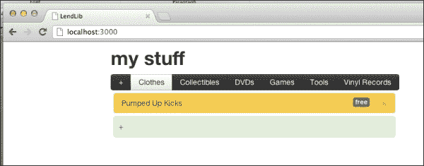

现在重新启动你的服务器。您的客户端将与服务器同步，然后你的`item`又消失了。


## 列出项目

这不行，因为我们想要看到我们的`items`。所以，让我们把`items`加回来，并在选择一个`Category`时获取适当的`items`列表。在`LenLib.cs`中，在我们第一个`Meteor.publish()`函数下面的`if(Meteor.isServer)`块中，添加以下函数：

```js
Meteor.publish("listdetails", function(category_id){
 return lists.find({_id:category_id}); 
});

```

这个`publish`函数将在`"listdetails"`通道上发布。任何监听器/订阅者都将提供变量`category_id`，以便我们的`find()`函数返回一个更轻的记录集。

请注意，到目前为止，我们的客户端还没有发生变化（您的`items`仍然不可见）。那是因为我们需要创建一个`subscribe`函数。

在我们的第一个`Meteor.subscribe()`函数下面，添加以下函数：

```js
Meteor.subscribe("Categories");

Meteor.autosubscribe(function() {
 Meteor.subscribe("listdetails", Session.get('current_list')); 
});

```

保存您的更改，然后查看您的**Clothes**收藏！

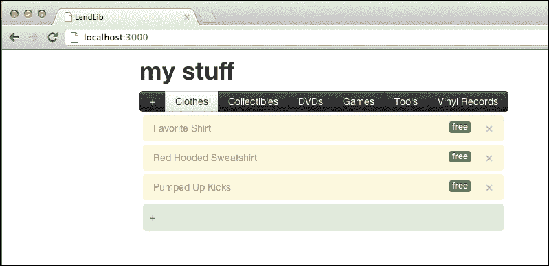

让我们花一分钟揭开这里面的奥秘，弄清楚刚才发生了什么。请注意，订阅使用了`Session.get('current_list')`。这个变量是在发布函数中传递的。换句话说，`Session`变量`current_list`中的值将作为`find()`函数选择器中的`category_id`使用。

如果你记得第四章，*模板*，我们已经设置了一个点击事件处理程序，用来监听`Category`的变化。例如，当你点击**Clothes**时，一个事件会被触发，`LendLib.js`中的`selectCategory()`函数处理该事件，并改变我们的`Session`变量。

```js
function selectCategory(e,t){
  Session.set('current_list',this._id); 
}
```

那个 `Session.set()` 触发了一个发布事件。我们将 `Meteor.subscribe()` 函数包裹在 `Meteor.autosubscribe()` 函数中，以便为 `"listdetails"` 通道提供 `Meteor.subscribe()` 函数。我们这样做是因为 `Session.set()` 事件将触发 `Meteor.autosubscribe()`，而那里正好有一个 `Meteor.subscribe()` 函数，专门为 `"listdetails"` 通道服务。

换句话说：

1.  `Session.set()` 触发一个事件。

1.  `Meteor.subscribe()` 监听这个事件，因为它使用了 `Session` 变量。

1.  流星在 `"listdetails"` 通道上重置了订阅监听器（因为它被包裹在 `Meteor.autosubscribe()` 中）。

1.  流星看到新的订阅监听器并触发了一个初始事件。

1.  `Meteor.subscribe()` 函数接收到这个事件，传入 `category_id` 变量，由于模型变化，UI 进行了刷新。

## 检查你的简化数据

现在显示与我们开始本章时没有区别。但在显示之下，模型要精简得多。选择 **服装** 类别，在浏览器控制台中运行以下命令：

```js
> lists.findOne({Category:"DVDs"})

```

展开对象，你会看到没有列出任何项目。

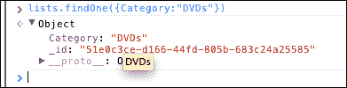

之所以没有项目，是因为我们的 `Session` 变量 `current_list` 被设置为 `Clothes`，而不是 `DVDs`。`find()` 函数只获取 `current_list` 的完整记录。

现在在浏览器控制台中输入以下命令并按 *Enter*：

```js
> lists.findOne({Category:"Clothes"})

```

展开对象，你会看到你的三个项目在一个数组中。

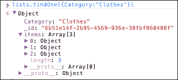

点击各个地方，为类别添加项目，添加新类别，并检查客户端可见的底层数据模型。你会发现你的列表现在明显可见性降低，因此更加安全和私密。这可能对你个人的借贷图书馆应用来说不会有问题，但随着我们在下一章中扩展这个应用，让多个人可以使用，简化和私密的数据将真正提高性能。

# 总结

在本章中，你已经了解了 MongoDB 是什么，面向文档的数据库是如何工作的，以及在命令行中进行了直接查询，熟悉了 Meteor 的默认数据存储系统。你还通过移除 `autopublish` 简化了你的应用，并且对内置于 Meteor 中的发布/订阅设计模式有了扎实的理解。

在下一章中，你将真正加强应用的安全性，允许多用户跟踪和控制他们自己的项目列表，并且你将了解如何通过使用文件夹进一步简化客户端和服务器代码。
