# 第六章：应用程序和文件夹结构

为了让你能够直接开始，Meteor 创建了一组默认库、默认文件夹结构和默认权限。这个默认配置非常适合快速开发、测试和学习。然而，它并不适合生产环境。

在这一章，我们将讨论你可能想要对默认配置进行的更改，以便你的应用性能更优、更安全、更容易管理。具体来说，你将学习到：

+   将你的应用程序的客户端、服务器和公共文件分离

+   启用数据库安全和用户登录

+   定制显示结果以保护隐私

# 客户端和服务器文件夹

到目前为止，我们把所有的 JavaScript 代码都放在了一个文件中：`LendLib.js`。

在 `LendLib.js` 中，我们有两个部分，由 `if` 语句分隔。面向客户端的代码位于 `if (Meteor.isClient) {...}` 块中，而服务器端代码位于 `if (Meteor.isServer) {...}` 块中。

这种结构对于一个非常简单的应用程序来说是可以的，但当我们编写一个更复杂的应用程序，或者我们有 multiple 人在同一个应用程序上工作时，尝试用条件语句共享一个文件很快就会变成一场噩梦。

另外，Meteor 会读取我们应用程序文件夹中的任何和所有文件，并尝试将 JavaScript 应用到客户端和服务器。如果我们想使用面向客户端的 JavaScript 库（例如，Twitter Bootstrap 或 jQuery），这就会造成一种奇怪的情况。如果我们把库放到根目录，Meteor 就会尝试在客户端和服务器上都实现这个文件。这要么因为我们在服务器上加载了它不需要的文件而造成性能问题，要么因为服务器不知道如何处理显示对象（服务器不显示任何东西）而产生错误。

相反，如果文件中包含面向客户端和服务器的服务器端代码，客户端可能会尝试实现该代码，这可能会造成各种问题，或者至少会让代码对客户端可见，这可能很快就会成为一个安全问题。有些文件和代码我们就是不想让客户端看到或访问。

让我们看看客户端代码被服务器处理的一个例子，然后把那部分代码移到一个只有客户端会尝试执行它的地方。在 `~/Documents/Meteor/` 中创建一个名为 `LendLibClient.js` 的新文件。打开 `LendLib.js` 并剪下以下高亮显示的代码块中的整个客户端代码块：

```js
var lists = new Meteor.Collection("lists");

if (Meteor.isClient) { 
...
}

if (Meteor.isServer){...
```

### 提示

你应该剪掉了大约 186 行代码。确保你找到了闭合的 `}` 括号！

现在把刚刚剪切的代码粘贴到 `LendLibClient.js` 中，然后保存对两个文件的更改。你会注意到这并没有对你的正在运行的应用程序产生任何视觉上的变化。那是因为 Meteor 正在处理这两个文件，而 `if` 条件阻止了服务器执行代码。

但让我们看看当我们移除`if`条件时会发生什么。在`LendLibClient.js`中，删除包含`if (Meteor.isClient) {`条件的第一行。同时，确保你也删除`if`条件的闭合括号（`}`）的最后一行。保存`LendLibClient.js`，然后去看看 Meteor 正在运行的控制台。

你会看到以下错误信息，或类似的内容：

```js
app/LendLibClient.js:21
   Meteor.subscribe("Categories");
          ^
TypeError: Object #<Object> has no method 'subscribe'
    at app/LendLibClient.js:21:11
...
Exited with code: 1
Your application is crashing. Waiting for file change.
```

移除`if`条件创造了一种情况，Meteor 的服务器部分试图运行面向客户端的代码。它不知道如何处理它，所以应用程序崩溃了。我们将通过使用文件夹结构来解决这个问题。

如果你还记得，当我们实现 Twitter Bootstrap 时，我们创建了`client`文件夹。Meteor 识别出`client`文件夹，并且将独占地运行在此文件夹中找到的任何 JavaScript 文件，作为面向客户端的代码，而不会在服务器端运行。

将`LendLibClient.js`文件从`~/Documents/Meteor/LendLib/`移动（剪切+粘贴，拖放，或使用`mv`命令）到`~/Documents/Meteor/LendLib/client/`。这将立即修复我们的崩溃应用程序，Meteor 再次快乐！你会在控制台看到以下内容：

```js
=> Modified -- restarting.
```

因为我们把`LendLibClient.js`移动到了`client`文件夹，所以不再需要`if`条件。由于文件位置，Meteor 知道该代码只打算在客户端运行，所以它不会尝试在服务器上运行它。

### 提示

你可能想刷新你的浏览器，指向`http://localhost:3000`。

这是因为你的应用程序崩溃了。悔改你的邪恶行为，刷新你的页面。

现在让我们对服务器端代码也做同样的事情。创建一个名为`server`的新文件夹。你可以通过 Finder 窗口，或者直接在命令行中如下操作：

```js
$ mkdir ~/Documents/Meteor/LendLib/server

```

我们知道我们应该直接在新生成的`server`文件夹中创建我们的 JavaScript 文件，但我们也是病态的好奇，喜欢破坏事物，所以我们打算创建一个可能引起问题的地方。

在`~/Documents/Meteor/LendLib`文件夹中创建一个名为`LendLibServer.js`的新文件。从`LendLib.js`中剪切`if (Meteor_is.server) { … }`块，粘贴到`LendLibServer.js`中，然后保存两个文件。

### 提示

此时，`LendLib.js`中应该只剩下一行代码了：

```js
var lists = new Meteor.Collection("lists");
```

与客户端代码的移动一样，在此阶段不会发生任何不良反应，因为我们仍然有`if`条件。让我们移除它，让应用程序崩溃继续！

在`LendLibServer.js`中，删除包含`if (Meteor.isServer) {`的第一行和包含闭合括号（`}`）的最后一行。

保存你的更改，让我们看看混乱场面！

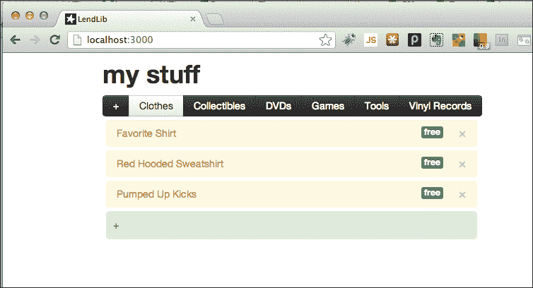

嗯。没有崩溃。应用程序仍然运行良好。真是让人失望...

让我们检查一下浏览器控制台：

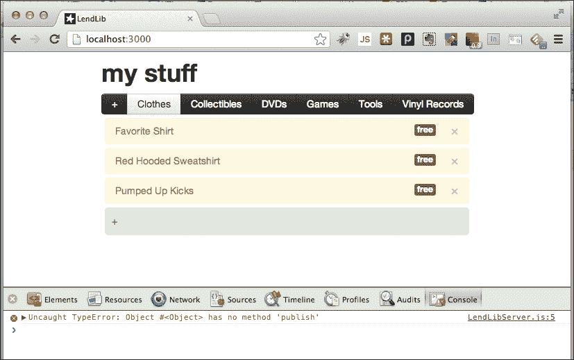

是的！我们*确实*做了坏事！这个行为（不幸的是）没有干扰或影响应用程序的其他部分，原因有两个：

+   是客户端（浏览器）抛出了错误。这不会影响服务器应用程序。

+   `LendLibServer.js`中的唯一代码是服务器代码。如果这段代码在客户端出错了，那也没关系，因为本来就不应该在客户端运行。

最终用户永远不知道错误的存在，但我们知道，所以让我们来修复它。将`LendLibServer.js`移动到`~/Documents/Meteor/LendLib/server/`目录下。错误将消失，我们小小的 Meteor 王国将再次一切安好。

## 公共文件夹

客户端文件夹（`client`）只能被客户端处理，服务器文件夹（`server`）只能被服务器处理，这是很逻辑的。但我们还需要考虑一个额外的因素，那就是**资源文件**（如图片、文本/内容文件等）。

资源文件仅在运行时需要。我们在任何逻辑或处理上都不依赖于它们，所以如果我们能将它们移开，Meteor 编译器就可以忽略它们，这能加快我们应用程序的处理和交付速度。

这就是`public`文件夹发挥作用的地方。当 Meteor 在为客户端和服务器编译 CSS 或 JavaScript 时，它会忽略`public`文件夹内的任何内容。然后，在所有的编译工作完成后，它会使用`public`文件夹来访问可能需要传递给客户端的任何内容。

让我们为我们的应用程序添加一个背景图片。慷慨和英俊的先生在[subtlepatterns.com](http://subtlepatterns.com)有很多选择，而且都是免费的，所以我们从中选择一个。我们将使用 Texturetastic Gray，因为它似乎符合我们的主题。访问[`subtlepatterns.com/texturetastic-gray/`](http://subtlepatterns.com/texturetastic-gray/)并下载图片。

### 小贴士

您可以使用任何背景图片。只需按照以下步骤操作您自定义的背景图片，并在我们声明`background-image`时将图片名称替换到 CSS 中。

在我们可以使用下载的背景之前，我们需要对`LendLib.css`做一次快速更改，并创建一个公共文件夹。

打开`LendLib.css`（除非您已将其移动到`client`文件夹中，这完全可以），并添加以下 CSS 声明：

```js
body {
 background-image: url(/texturetastic_gray.png); 
}

```

保存这个更改。现在还不会发生任何事情（译者注：暂时不变），我们稍后再处理。在`~/Documents/Meteor/LendLib`目录下创建一个名为`public`的文件夹。现在，打开下载的压缩包`texturetastic_gray.zip`，并将`texturetastic_gray.png`从压缩包中复制到我们刚创建的`public`文件夹中：

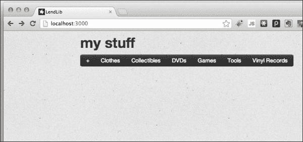

背景已经更换成了您的背景图片，现在我们拥有了一个更炫酷的界面！

这个文件被安全地保存在`public`文件夹中，所以 Meteor 编译器不需要处理它，但当需要服务于客户端以供显示时，它仍然可用并准备就绪。

### 小贴士

还存在其他文件夹，它们有不同的效果和目的。有关完整解释，请参阅 Meteor 文档中的[`docs.meteor.com/#structuringyourapp`](http://docs.meteor.com/#structuringyourapp)。

# 安全和账户

此时，我们的借阅图书馆应用程序完全是我们想要它做的。它记录了所有我们的物品以及我们借出物品给谁。如果我们把这个应用程序投入使用，然而，应用程序本身存在一些我们需要解决的安全问题。

首先，阻止某人访问我们的应用程序并从他们借阅的物品中删除他们的名字有什么阻止他们呢？那个恶棍 STEVE 可能会永远保留我们的线性压缩扳手，如果他有意的话，而我们将无法证明他是否还拥有它。

我们不能让这种盗窃和不诚实的行为不受惩罚！STEVE 必须为此负责！所以，我们需要实现安全措施。具体来说，我们需要执行两个操作：

+   只允许物品所有者在 UI 中进行编辑

+   确保数据库安全，防止通过网络控制台进行更改。

## 删除 insecure

实现这两个目标的第一步是删除 Meteor 中的`insecure`库。默认情况下，`insecure`库是包含在内的，这样我们就可以在制定安全策略并编写大部分代码之前构建我们的应用程序，而不用担心安全问题。

是时候了，我们知道我们希望实现的安全方面，所以让我们继续摆脱那个库。停止 Meteor 应用程序（在终端窗口中按*Ctrl* + *C*），然后输入以下命令（您需要位于`LendLib`目录中）：

```js
>meteor remove insecure

```

这将生成以下消息：

```js
insecure: removed
```

我们的应用程序现在很安全。实际上*太*安全了。重新启动 Meteor（在终端中输入`meteor`并按*Enter*键），然后在浏览器窗口中使用`http://localhost:3000`导航到我们的应用程序。一旦你到了那里，试着添加一个新项目；添加一个借阅者，或者甚至删除一个项目。我们将尝试把我们的最爱衬衫借给我们的性感美国女友，但是什么也不会发生；没有删除，没有添加，没有更改。现在什么都不起作用了！如果你打开浏览器控制台，你会发现每次尝试更新数据库都会显示**更新失败：访问被拒绝**的消息：

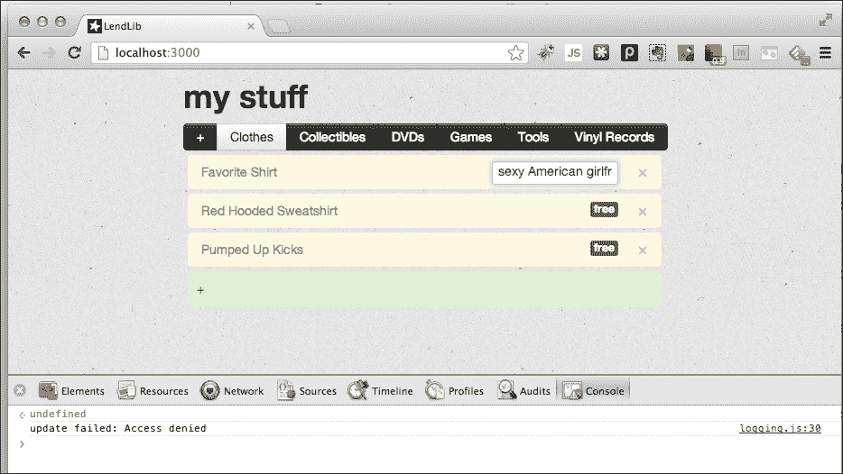

这个消息发生是因为我们禁用了 insecure 包。换句话说，不再允许匿名更改。因为我们还没有登录账户，我们所有的请求都是匿名的，因此将会失败。

## 添加管理员账户

为了重新启用更新功能，我们需要能够创建一个管理员账户，给管理员账户权限进行更改，并给用户提供一个找回丢失密码的方法。

我们首先需要添加三个内置的 Meteor 包。停止 Meteor 应用程序，在终端窗口中输入以下三个命令：

```js
$ meteor add accounts-base
$ meteor add accounts-password
$ meteor add email

```

这些命令将为我们的 Meteor 应用程序添加管理账户所需的包。

Meteor 还提供一个 UI 包，可以自动为我们的账户创建登录逻辑，这样我们就不用编写任何自定义的账户 UI 代码。既然如此，我们顺便添加这个包：

```js
$ meteor add accounts-ui

```

既然我们已经添加了`accounts-ui`包，我们只需要快速配置要显示的字段，并更新我们的 HTML 模板。打开`LendLibClient.js`，在文件的底部添加以下代码：

```js
Accounts.ui.config({
 passwordSignupFields: 'USERNAME_AND_OPTIONAL_EMAIL' 
});

```

这告诉`accounts-ui`包我们希望在注册表单中显示`username`和`email`字段，其中`email`字段是可选的（我们需要它来恢复丢失的密码）。

现在打开`LendLib.html`，在`<body>`标签的直接下方输入以下代码：

```js
<body>
  <div style="float: right; margin-right:20px;">
 {{loginButtons align="right"}}
 </div>
  <div id="lendlib">
```

这段 HTML 代码将在我们屏幕的右上角添加一个登录链接和上下文菜单框。让我们看看它的实际效果。保存所有更改，启动您的 Meteor 应用，在浏览器中导航到`http://localhost:3000`。注意以下屏幕截图的右上角：

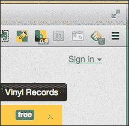

点击**登录**，然后点击弹出窗口右下角的**创建账户**：

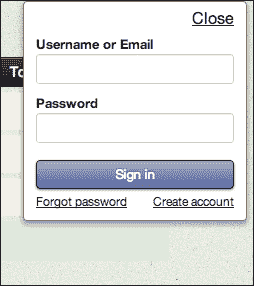

填写创建账户表单，确保为管理员输入一个用户名和一个有效的电子邮件地址，以便在需要时可以恢复您的密码。输入并确认您的新密码，然后点击**创建账户**：

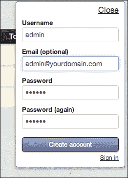

你现在将作为管理员登录，我们可以继续配置权限：

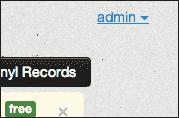

## 授予管理员权限

现在我们已经有了管理员账户，让我们允许该账户在 UI 中进行任何必要的更改，同时取消管理员账户未登录时在浏览器控制台进行更改的能力。

我们原始的`LendLib.js`文件目前里面只有一行代码。我们将向其中添加一些账户检查代码，确保只有管理员账户可以进行更改。

将以下代码添加到`LendLib.js`并保存您的更改：

```js
/*checks to see if the current user making the request to update is the admin user */

function adminUser(userId) {
 var adminUser = Meteor.users.findOne({username:"admin"});
 return (userId && adminUser && userId === adminUser._id);
}

lists.allow({
 insert: function(userId, doc){
 return adminUser(userId);
 },
 update: function(userId, docs, fields, modifier){
 return adminUser(userId);
 },
 remove: function (userId, docs){
 return adminUser(userId);
 }
});

```

`adminUser`函数在多个地方使用，因此创建一个公共函数是有意义的，该函数仅检查发出请求的`userId`是否与管理员账户的`_id`相同。

`lists.allow`设置了允许操作的条件，每个操作都有一个返回`true`以允许和`false`以拒绝的函数。例如，如果我们永远不想让任何人（包括管理员账户）删除类别，我们可以将`remove`函数检查设置为总是返回`false`。

目前，我们只是想让操作根据管理员账户是否登录并发起请求而有条件地执行，因此我们将每个函数设置为`return adminUser(userId);`。

在我们的浏览器中，我们现在可以测试我们的权限。添加一个新的类别（任何您喜欢的，但我们将会添加`玻璃器皿`），添加一个新项目，更改一个所有者，等等——只要您以管理员身份登录，所有操作都应该被允许。

让我们确保访问确实与我们的管理员账户相关联。通过点击右上角**管理员**旁边的**登出**按钮，然后点击**登出**按钮，退出应用程序：

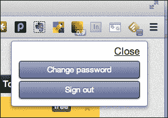

现在，在浏览器控制台中，输入以下命令（或等效于您添加的类别）：

```js
> lists.remove({Category:"glassware"})

```

您将收到一个**访问被拒绝**的消息：

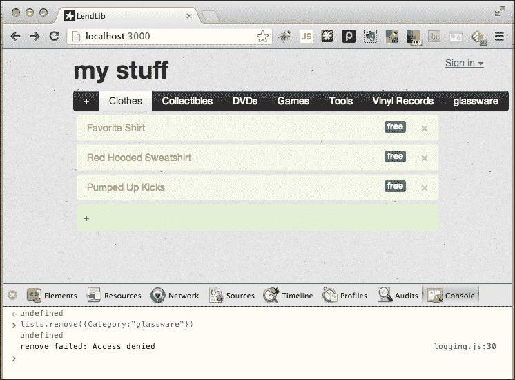

以管理员身份重新登录，再次运行该命令。这次分类将被删除。通过在`lists`级别设置权限和允许的操作，使用`lists.allow()`，我们使某人无法在不以管理员身份登录的情况下进行更改。现在，用户界面和浏览器控制台都受到了 STEVE，那个扳手小偷的邪恶阴谋的保障！

# 自定义结果

当我们考虑到应用程序的安全性和可用性时，还有一个我们需要考虑的问题。如果我们能够使多个用户可以使用借阅图书馆，而每个用户只能看到属于他们的物品，那会怎样呢？如果我们这样做，我们就可以阻止人们看到别人拥有什么样的东西，同时我们也可以让每个人跟踪自己的物品。我们最初的目标是为自己创建一个应用程序，但是稍作修改，我们就可以让任何人使用它，他们会觉得我们很棒，也许会请我们吃午饭！

## 修改 Meteor.publish()

为了准备让多个人使用我们的应用程序，我们需要确保没有人能看到别人的东西。这是在`Meteor.publish()`声明中为`Categories`完成的。逻辑上，如果我们限制用户可以看到的类别，这种限制将会传递到可见的项目，因为项目是在类别中找到的。

打开`LendLibServer.js`，修改大约在第 6 行附近找到的`find({})`块：

```js
Meteor.publish("Categories", function() {
  return lists.find({owner:this.userId},{fields:{Category:1}});
});
```

添加选择器`owner:this.userId`将检查我们`lists`存储库中的每个列表，并返回每个当前登录用户是列表所有者的每个实例的类别。保存此更改，您会发现所有当前的类别都消失了！

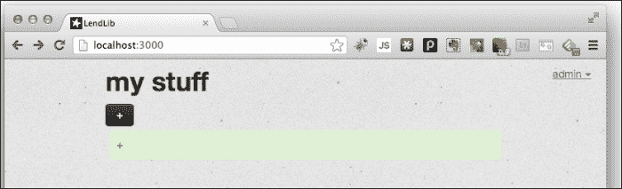

这是因为我们已经在应用程序中创建的列表没有任何所有者，而且我们以管理员身份登录。当我们尝试修改现有项目时，我们将遇到类似的问题，因为没有列表有任何所有者。

我们有几种方法可以解决这个问题，包括手动将管理员账户作为所有者添加，让管理员账户看到所有未认领的列表，或者直接重新开始。由于我们只借出了一件物品（可恶，STEVE！我们还我们的扳手！），现在是一个很好的时间清空我们的数据库，并在我们忘记谁有它之前重新添加我们的线性压缩扳手。

作为管理员登录到浏览器控制台，输入以下命令：

```js
>lists.remove({})

```

这将删除我们所有的列表，一旦我们给新创建的列表添加了所有者，我们就可以重新开始了。

### 提示

如果你也想清除所有用户，你可以通过停止 Meteor 应用程序，然后在终端窗口中运行`meteor reset`，然后再重新启动 Meteor 应用程序来完成。要小心！没有警告，也没有后悔药！

## 添加所有者权限

给任何新类别添加所有者是相当简单的。我们只需要更新我们的`lists.insert()`函数，并添加所有者字段。打开`LendLibClient.js`，找到`Templates.categories.events`声明。在`'keyup #add-category'`事件的事件代理中，你会看到`lists.insert()`函数的调用。按照以下方式修改该调用：

```js
if (catVal)
{
  lists.insert({Category:catVal,owner:this.userId});
  Session.set('adding_category', false);
}
```

每当添加一个新的列表时，我们不仅在添加一个类别字段，而是在添加一个所有者字段。这使得我们的`Meteor.publish()`代码能够正确地为我们创建的任何新列表工作。

让我们先恢复“工具”类别，输入项目“线性压缩扳手”，并将借阅者设为`STEVE`：

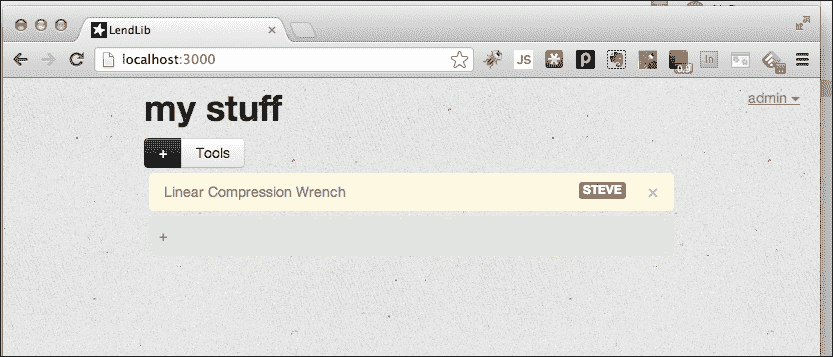

这样，我们就可以重新运行，并且在每个列表中都隐藏了一个所有者属性。当允许其他人创建和维护他们自己的列表时，这个属性就变得重要了。

## 启用多个用户

好的，现在一切都准备就绪，我们可以拥有一个定制化的、私有的个人物品视图，但目前只有管理员账户可以添加列表或项目，并将借阅者分配给一个项目。

我们将通过回到`LendLib.js`，并添加一些逻辑来检查当前登录的用户是否拥有列表，或者是否是管理员来解决这个问题。在`LendLib.js`中的`lists.allow()`代码块里，加入以下内容：

```js
lists.allow({
  insert: function(userId, doc){
    return (adminUser(userId) || (userId && doc.owner === userId)); 
  },
  update: function(userId, docs, fields, modifier){
    return adminUser(userId) ||
 _.all(docs, function(doc) {
 return doc.owner === userId;
 });
  },
  remove: function (userId, docs){
    return adminUser(userId) ||
 _.all(docs, function(doc) {
 return doc.owner === userId;
 });
  }
});
```

在`insert`中，我们检查当前`doc.owner`是否是登录的用户。在`update`和`remove`中，我们遍历所有要更新的记录（使用`_.all()`），并检查`doc.owner`是否是登录的用户。

现在你可能想要保存你的更改，并在`http://localhost:3000`上创建一个新的账户。尽情添加类别和项目吧。你可以随意在用户之间切换，并且可以添加尽可能多的用户和列表。

你会注意到，一个人的列表对另一个人是不可见的，因此也没有人能够操纵或删除另一个人的列表和记录。当 STEVE 最终得到你的应用程序时，他只能看到自己的东西（顺便说一下，这些都是不值得借的东西！）：

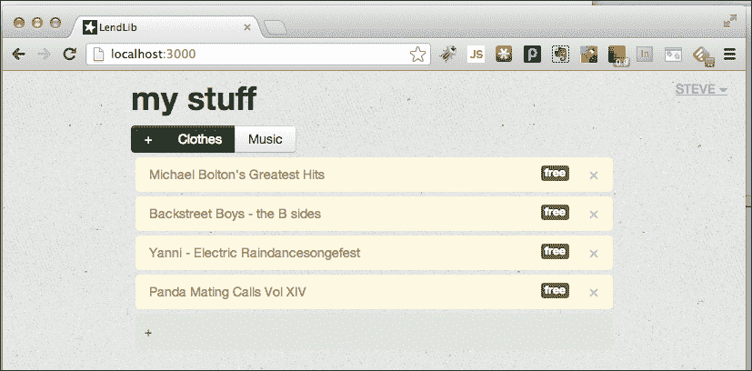

# 总结

在这一章节中，你已经学习了 Meteor 是如何编译和搜索 JavaScript 和 CSS 代码的，以及如何优化搜索。你已经学会了如何保护你的服务器代码，并保持运行流畅和高效。你已经学会了如何通过使用 Meteor 内置的 Accounts 包来保护你的数据库，并且你已经关闭了你的应用程序中的所有主要安全漏洞。最后，你启用了多个账户，这样任何人都可以使用你的借阅图书馆来跟踪他们的物品，而且你这样做并没有损害最终用户的隐私。

在下一章节中，你将学习如何将 Meteor 应用程序部署到一个生产环境中，并学习开始编写快速、健壮且适用于生产的 Meteor 应用程序的技术。
