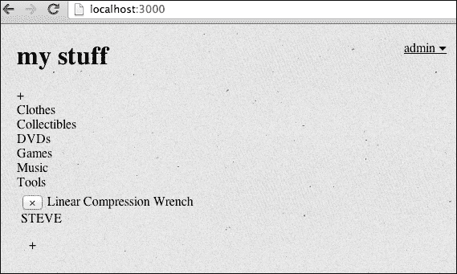
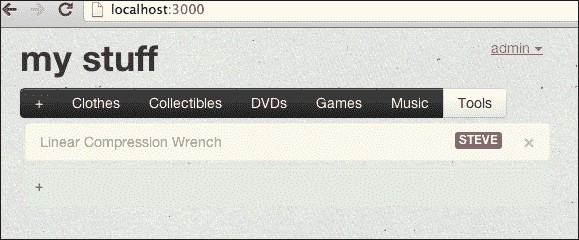
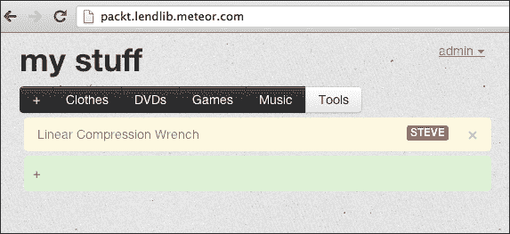
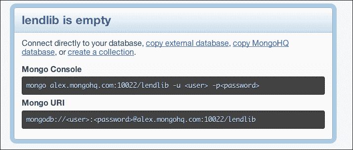
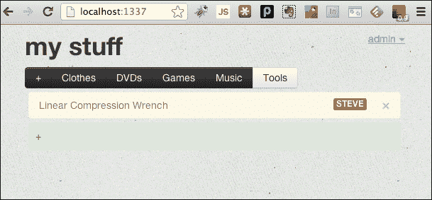

# 第七章：打包和部署

我们的应用程序看起来很棒。我们已经使它变得安全，易于使用，并且通过添加多重登录，现在任何人都可以使用借阅图书馆跟踪他们的物品。

在最后一章中，我们将介绍 Meteor 出色的包系统，这将加快未来的代码项目，并且我们会讨论部署应用程序的选项。你会学会如何：

+   添加和配置第三方包，如 jQuery，Backbone 和 Bootstrap

+   捆绑您的整个应用程序，以便可以部署

+   使用 Meteor 的公共服务器部署您的应用程序

+   将您的应用程序部署到自定义服务器

# 第三方包

**Meteor**正在为主要的 JavaScript 和预处理库添加包。这些包很智能，不仅包含基础的 JavaScript 或预处理库，而且它们还配置为直接与 Meteor 代码库交互。

这意味着对于您来说，添加您最喜欢的库几乎不需要任何努力，并且您可以确信它将与您的 Meteor 应用程序协同工作。

## 列出可用包

要查看带有简要说明的所有可用包列表，只需在终端中输入以下命令，然后按*Enter*：

```js
$ meteor list

```

这将为您提供安装的 Meteor 版本的的所有包的列表。

正如您所看到的，有很多最受欢迎的框架，包括 jQuery，Backbone，underscore 和 Twitter 的 Bootstrap！我们花了很多时间手动下载 Bootstrap，创建客户端文件夹，并提取 Bootstrap 文件。这是一个手动安装框架的好练习，但现在我们将学习如何作为包来安装它。

首先，让我们移除现有的 Bootstrap 安装。导航到`~/Documents/Meteor/LendLib/client/`并删除`bootstrap`目录。你的 Meteor 应用是否正在运行无关紧要（记住，Meteor 是动态更新的）。要么启动它，然后导航到`http://localhost:3000`，或者如果它已经在运行，直接导航那里。你会发现我们所有的漂亮格式都消失了！



现在我们将添加官方的 Meteor Bootstrap 包。再次强调，因为 Meteor 是动态更新的，除非我们想停止，否则我们不需要停止 Meteor 应用。要么打开一个新的终端窗口，或者暂时停止您的 Meteor 应用，并确保您在`~/Documents/Meteor/LendLib`文件夹中。一旦在那里，输入以下命令：

```js
$ meteor add bootstrap

```

您将收到一个非常简短的消息：

```js
bootstrap: UX/UI framework from Twitter

```

如果您使用了第二个终端窗口，只需打开浏览器（您甚至不必刷新页面）。如果您停止了您的 Meteor 应用程序，再次启动它，并导航到`http://localhost:3000`。您将能够看到 Bootstrap 格式现在已返回，一切都很正常：



真的就是这么简单。在你的终端中使用一个命令，你就可以向你的项目中添加一个库或框架，而无需担心链接、下载，并确保文件在正确的位置。只需运行`meteor add...`，然后就可以出发了！

### 小贴士

你可以通过在终端中输入以下命令来获取你已经在使用的包的列表：`meteor list --using`。

由于 Meteor 正在如此快速地添加包，保持你的 Meteor 安装最新是个好主意。时不时地在终端中运行以下命令：

```js
$ meteor update

```

如果你是最新的版本，它会告诉你，你正在运行哪个版本。如果有新版本，它会下载并为你安装它。

# 捆绑你的应用程序

遵循 Meteor 一贯的风格，将你的应用程序捆绑以便可以部署是极其简单的。如果应用程序正在运行，请停止它，确保你处于你的应用程序文件夹中（对于借贷图书馆来说，它是`~/Documents/Meteor/LendLib`），然后在终端中输入以下命令：

```js
$ meteor bundle lendlib.tgz

```

这需要一点时间来运行，但完成后你将在`LendLib`文件夹中得到一个`lendlib.tgz`的 tar 压缩包，然后你可以将其部署到你希望的任何地方。这是一个完整的包/捆绑。你部署这个捆绑的机器只需要安装了 Node.js 和 MongoDB 即可。你需要的其他所有东西都包含在捆绑包中。

# 部署到 Meteor 的服务器

Meteor 团队把部署工作又推进了一步，超出了甚至是一个付费产品，更不用说是一个免费产品的预期。Meteor 允许你直接在他们的部署服务器上部署你的应用程序。为你的应用选择一个名字（我们将使用`packt.lendlib`，但你需要想出自己的名字）并在终端中输入以下命令：

```js
$ meteor deploy [your app name].meteor.com

```

所以，在我们的案例中，我们输入了`meteor deploy` `packt.lendlib.meteor.com`。控制台会在捆绑、上传和部署应用程序时给出状态更新。完成后，它会给你一个类似于以下的消息：

```js
Now serving at [your app name].meteor.com

```

如果你在浏览器中导航到那个 URL（例如，[`packt.lendlib.meteor.com`](http://packt.lendlib.meteor.com)），你就会看到你的应用程序已经部署并运行起来了！



### 小贴士

在开始使用应用程序或向他人介绍之前，你可能想要创建一个`admin`登录账户。你不想让那个狡猾的`STEVE`控制你的应用！

## 更新 Meteor 的服务器

如果你做了改动，或者你发现了一个错误，并且你想更新在 Meteor 服务器上的应用程序代码，会怎样呢？正如你大概猜到的，这非常简单。只需重新运行你的`deploy`命令：

```js
$ meteor deploy [your app name].meteor.com

```

这不仅更新了您的应用程序，而且还保留了您的数据，因此如果您已经输入了大量信息，您不需要从头开始。很酷，对吧？Meteor 团队真正知道是什么让开发变得有趣，他们不遗余力地提供了一个您可以编码、玩耍并立即获得应用程序反馈的环境。

## 使用您自己的主机名

但是等等，还有更多！您甚至可以使用自己的主机名与部署在 Meteor 服务器上的应用程序。使用您的主机提供商设置一个指向`origin.meteor.com`的 CNAME，然后您可以部署到该主机名。例如，如果我们有一个子域`meteor.too11.com`作为 CNAME 指向`origin.meteor.com`，我们将在终端中运行以下命令：

```js
$ meteor deploy meteor.too11.com

```

如果你设置了正确的 CNAME，这将就像你直接部署到`[你的应用名称].meteor.com`一样进行部署，并且将使用你自定义的域名可用！

### 提示

咨询您的主机提供商关于设置 CNAME 路由。这因提供商而异，但做起来相当简单。

# 部署到自定义服务器

在撰写本文时，将 Meteor 应用程序部署到托管服务或个人计算机是一项相当繁重的任务。部署过程中存在版本问题，而且大多数托管服务仍处于支持 Meteor 捆绑包的早期阶段。

话说回来，我们将通过部署到自定义服务器的一个 Meteor 应用程序，并留给您探索托管服务（如 Heroku 或 AppFog）。

## 服务器设置

你从哪个服务器托管你的应用程序需要两样东西：

+   Node.js，版本 0.8 或更高版本

+   MongoDB（最新版本）

要安装 Node.js，请访问[`nodejs.org/`](http://nodejs.org/)并按照 Linux 或 Mac OS X 安装说明操作。

要安装 MongoDB，请访问[`docs.mongodb.org/manual/installation/`](http://docs.mongodb.org/manual/installation/)并按照您相应操作系统的说明操作。安装完成后，请确保设置一个名为`lendlib`的数据库。

一旦安装和配置了这两个产品，您将有一个 MongoDB 的默认位置。这将是类似于`mongodb://localhost:27017/lendlib`的东西。您需要在未来的一个步骤中使用该 URI，所以请确保记下或准备好供参考。

另外，你可以在远程服务器上设置 MongoDB，或者使用像 MongoHQ 这样的托管服务。（[`www.mongohq.com`](https://www.mongohq.com)）。如果您使用远程服务，设置一个新数据库，并记下您需要的 URI。以下是来自 MongoHQ 的一个示例：



## 部署您的捆绑包

如果你还记得，我们在这个章节开始时创建了一个 tarball。现在我们需要解压这个 tarball，然后进行一些修改，之后我们的应用就可以启动了。将`lendlib.tgz`复制到你的服务器上，在用于部署的目录中（例如`~/Sites/LendLib`）。一旦`lendlib.tgz`在正确的位置，你可以使用以下命令解压 tarball：

```js
$ tar –zxvf lendlib.tgz && rm lendlib.tgz

```

这将解压 tarball，你将得到一个名为`bundle`的新文件夹。

### 可选 – 不同平台

如果你开发应用的机器和你要部署到的机器不一样，你可能需要重新构建原生包。为此，进入`node_modules`目录：

```js
$ cd bundle/server/node_modules

```

一旦在那里，删除`fibers`目录：

```js
$ rm –r fibers

```

现在使用`npm`重新构建`fibers`：

```js
$ npm install fibers

```

这将安装特定于你部署平台的最新`fibers`版本。如果你开发的机器和部署的机器运行的是同一个平台，你不需要这样做。

## 运行你的应用

现在你的 bundle 已经被正确解压，你准备启动你的应用。启动应用你需要以下信息：

+   根 URL（例如，`http://lendlib.mydomain.com`或`http://localhost`）

+   你希望应用运行的端口（例如，`80`）

+   你的 MongoDB URI（例如，`mongodb://<user>:<password>@alex.mongohq.com:10022/lendlib`）

一旦你做出了决定并收集了这些信息，为你的应用启动 Node.js。导航到你的`root`文件夹（我们的文件夹是`~/Sites/LendLib`）并输入以下内容：

```js
$ PORT=80 ROOT_URL=http://localhost MONGO_URL=mongodb://<user>:<password>@alex.mongohq.com:10022/lendlib node bundle/main.js

```

让我们分解一下：

+   `PORT`设置了端口变量，这样 NodeJS 就知道你希望服务应用程序的哪个端口

+   `ROOT_URL`设置了`rootUrl`变量，这样 NodeJS 就知道请求是为你的应用程序指定的主机名

+   `MONGO_URL`告诉 NodeJS 在哪里可以找到我们的 MongoDB

+   `node`是调用的命令

+   `bundle/main.js`是 NodeJS 调用的起始 JavaScript 文件

如果你的所有信息都正确，应用将会运行，你可以使用浏览器来测试它：



你还可以更深入地了解部署，比如设置环境变量，以守护进程/服务的形式运行你的应用，甚至使用远程服务器公开托管你的应用。我们到目前为止所做的一切应该足以让你开始，并让你在使用 Meteor 的生产环境的道路上越走越远。

# 总结

你现在已经成为 Meteor 专家了！认真的。你知道如何从零开始构建一个 Meteor 应用。你理解 Meteor 背后的设计模式和数据库原理，你可以为你的应用进行定制、优化和保障，让它做任何你想要的事情。你还可以将 Meteor 部署到多个环境。你已经迈出了编写高效、稳定且可靠的 web 应用的正确道路。

因为 Meteor 非常新，所以拥有与你现在一样多的关于 Meteor 的实际操作知识的人非常少。按照定义，这使你成为了专家。现在，如何运用你的专业知识取决于你自己。建议在你的下一个开发项目中使用 Meteor，通过代码贡献、在论坛上回答问题以及制作你自己的教程来为 Meteor 社区做贡献。

Meteor 是一项突破性技术，越来越受到关注，而你现在拥有使用这项突破性技术来推进你的个人和职业开发项目的知识与经验，这使你能够保持领先，让你的开发者生活更加充实。
