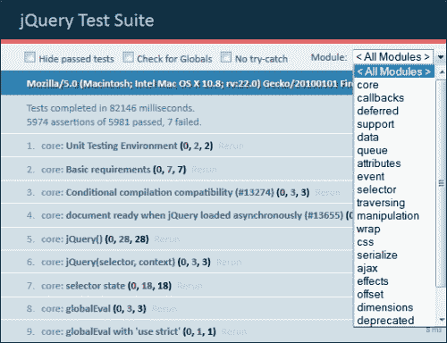

# 第一章： 使用 QUnit 即时测试

欢迎使用 QUnit 即时测试！

很长一段时间，JavaScript 并没有被认真对待。然而，随着 AJAX 的出现，事实证明使用 JavaScript 可以使网页的速度达到桌面软件 RIA 富互联网应用程序（[`en.wikipedia.org/wiki/Rich_Internet_application`](http://en.wikipedia.org/wiki/Rich_Internet_application)）的水平。即将到来的服务器端 JavaScript 证明应用程序可以完全用 JavaScript 编写。基于 JavaScript 的应用程序开始成长并变得复杂。即使优秀的开发者从事它们，任何复杂的软件仍然会有缺陷。测试工程师尽最大努力在产品发布前捕捉到这些问题，但手动检测所有缺陷几乎是不可能的。自动化测试是提高软件测试效率和覆盖面的最佳方法。此外，它在早期开发阶段揭示任何问题，大大降低了修复成本。

无论使用哪种技术，最佳的开发实践包括单元测试、集成测试、系统测试和功能测试的自动化。单元测试验证应用程序的最小功能部分是否如预期那样在孤立状态下工作。集成测试检查项目组件是否正确协作。系统测试检查整个应用程序—通常用于用户体验、性能/负载/压力、可伸缩性、兼容性和安全性等标准—而功能测试验证从用户的角度看应用程序 UI 是否正常。

目前，有许多工具旨在实现 JavaScript 的自动化测试。最受欢迎的测试框架之一是 QUnit。它足够强大，极其灵活，同时令人惊讶地容易上手。

这是一本实用的书，展示了如何使用 QUnit 及其插件对你的 JavaScript 应用程序进行有益的自动化测试，如何使用 QUnit 进行自动化的跨浏览器测试，以及如何将 QUnit 与开发自动化和持续集成工具结合使用。

本书为所有贡献的任务提供了框架不可知的 Vanilla JS 示例，这些任务之一可以很容易地跟随。源代码按任务分类，并可在[`www.packtpub.com/support`](http://www.packtpub.com/support)下载。因此，无论你以前的经验如何，无论你使用哪些库，你都可以很快掌握这些任务。

# 设置 QUnit（简单）

在本食谱中，我们将下载 QUnit 测试框架组件并创建一个测试运行器 HTML。我们将研究 QUnit 测试运行器如何报告成功和失败的测试案例。我们还将考虑框架文件结构的一些最佳实践。

## 准备就绪

该框架包括 QUnit JavaScript 模块、测试运行器 HTML 和样式表。测试运行器是一个测试套件执行器。它加载其他 QUnit 组件并生成报告页面。我们可以直接在测试运行器 HTML 中包含我们的测试，或者在一个外部文件中包含。组件模型如下所示：


我们也可以简单地从[www.qunitjs.com](http://www.qunitjs.com)复制粘贴测试运行器代码，以及下载 CSS 和 JavaScript 组件。实际上，如果不下载，可以使用以下链接在测试运行器中使用 jQuery CDN：

+   [`code.jquery.com/qunit/qunit-git.css`](http://code.jquery.com/qunit/qunit-git.css)

+   [`code.jquery.com/qunit/qunit-git.js`](http://code.jquery.com/qunit/qunit-git.js)

## 如何操作

嗯，它是如何工作的？

1.  创建一个`index.html`文件，内容如下：

    ```js
    <!DOCTYPE html>
    <html>
    <head>
        <meta charset="UTF-8" />
        <title>Test Suite</title>
        <link rel="stylesheet" href="http://code.jquery.com/qunit/qunit-git.css" type="text/css" media="screen">
    </head>
    <body>
        <h1 id="qunit-header">Test Suite</h1>
        <h2 id="qunit-banner"></h2>
        <div id="qunit-testrunner-toolbar"></div>
       <h2 id="qunit-userAgent"></h2>
        <ol id="qunit-tests"></ol>
        <div id="qunit-fixture">test markup</div>

        <div id="sandbox">
            <!--Put here sandbox HTML if needed -->
        </div>

        <script type="text/javascript" src="img/qunit-git.js"></script>
        <script type="text/javascript">
            QUnit.test( "Test example", function( assert ){
                assert.ok( true );
            });
        </script>
    </body>
    </html>
    ```

1.  在浏览器中加载 HTML。你会看到类似于以下屏幕截图的东西！如何操作

    那么页面上有什么呢？首先是我们在 HTML 中分配的标题。下面是一个条，如果所有测试成功，它会是宁静的绿色；如果有任何失败，它会变成警告的红色。如果测试失败，我们将看到类似于以下屏幕截图的东西：

    

    此外，我们可以看到一个工具箱。它包含了以下选项：

    +   **隐藏已通过的测试**复选框，当你运行大量测试并只想关注那些失败的时候非常有用。

    +   **检查全局变量**复选框，它允许你在测试期间测试全局对象是否被修改。

    +   **不使用 try-catch**复选框，它触发测试在 try-catch 块外运行，显示本地的异常。这在调试旧版浏览器时非常有用。

    在工具箱的正下方，QUnit 显示了用户代理的详细信息。之后，我们有一个报告区域，展示了总体统计信息和每个测试的结果列表。

## 它是如何工作的

你可能想知道幕后到底发生了什么。当 QUnit JavaScript 模块正在被处理时，它会在`window.onload`事件上订阅一个处理程序。该处理程序初始化`QUnit`对象，并将测试运行器布局的占位符用构建报告页所需的元素填充。最后，它调用`QUnit.start`方法，该方法实际上运行了当时可用的测试。因此，默认情况下，QUnit 尝试在页面 DOM 就绪时运行测试。如果你使用模块化的 JavaScript，如 AMD 和 CommonJS，所有的模块（包括测试）都是异步加载的。这种情况下需要手动启动测试运行器，可以通过使用以下代码中描述的配置选项来完成：

```js
QUnit.config.autostart = false;
require(
  [ "test-module1", "test-module2" ],
  function() {
    QUnit.start();
  }
);
```

## 还有更多

在前一个示例中，我们把伪测试代码直接放入测试运行器的 HTML 中。对于一个简短的例子来说，这是可以的，但对于一个有很多测试的真实项目来说，就不合适了。你必须想出一个合适的文件结构。我建议在你的项目`wwwroot`中创建一个专门的子目录（tests）。在那里，你可以为每个被测试的项目模块添加子目录。这些子目录包含模块测试的代码和必要的测试相关文件。

通常，测试运行器简单地命名为`index.html`，因为它聚合了项目的所有 QUnit 测试。我会把不同类型的测试封装到各自的运行器中，如`unit-tests.html`、`functional-tests.html`和`acceptance-tests.html`。

因此，我们可以每次提交代码时都快速运行单元测试（例如，通过持续集成服务器），并在任何部署之前运行功能和验收测试。当你把功能测试和验收测试分开时，也能提高测试的可读性。

```js
app-wwwroot/
  ├── js/
  │   └── moduleA.js
  └── tests/
      ├── moduleA/
      │    ├── dummies.js
      │    ├── stubs.js
      │    ├── mocks.js
      │    ├── fixtures.js
      │    └── unit-tests.js
      └── unit-tests.html
```

# 测试断言（简单）

断言是测试中使用的主要方法。在本食谱中，我们将查看 QUnit 拥有的所有断言方法。此外，我们还将查看一些由流行的 QUnit 插件提供的断言方法。

## 准备好了

如果我们能在学习断言的同时测试真实代码，那将更有用。以下两个辅助函数非常适合显示断言使用的离散案例：

```js
var utils = (function() {
  "use strict";
  return {
    /**
     * Port of PHP trim function which differ from EcmaScript 5 String.prototype.trim
     * Strip whitespace (or other characters) from the beginning and end of a string
     * Without the second parameter, trim() will strip these characters:
     * " " (ASCII 32 (0x20)), an ordinary space.
     * «\t» (ASCII 9 (0x09)), a tab.
     * "\n" (ASCII 10 (0x0A)), a new line (line feed).
     * "\r" (ASCII 13 (0x0D)), a carriage return.
     * "\0" (ASCII 0 (0x00)), the NUL-byte.
     * "\x0B" (ASCII 11 (0x0B)), a vertical tab.
     * @param {string} str
     * @param {string} charlist
     * @return {string}
     */
    trim: function( str, charlist ) {
      charlist = charlist || " \t\n\r\0\x0B";
      return str.replace( new RegExp( "^[" + charlist + "]+|[" + charlist + "]+$", "g" ), '' );
    },
    /**
     * Emulate class-based inheritance.
     * <example>
     * ClassA = function() {}
     * ClassB = utils.extendClass(ClassA, {
     *   prop: true
     * });
     * </example>
     */
    extendClass: function( SuperType, subType ) {
      var prop,
          F = function(){};
      F.prototype = new SuperType();
      F.prototype.constructor = SuperType;
      for ( prop in subType ) {
        if ( subType.hasOwnProperty( prop ) ) {
          F.prototype[ prop ] = subType[ prop ];
        }
      }
      return F;
    }
  };
}( this ));
```

第一个函数是 PHP `trim`函数的模拟。它从所提供字符串的开始和结束移除任何空白字符。第二个函数实现基于类的继承。因此，你可以为这个函数创建一个新的类（`constructor`），通过扩展给定的类（`SuperType`）和一个特定的对象（`subType`）。

## 如何做到这一点

1.  如下定义带有所需断言的测试范围：

    ```js
    QUnit.test( "Test title", function( assert ) {
      assert.<assertion-method>( comparison of actual and expected values, "assertion title" );
    });
    ```

    在这里，测试的范围定义了一个或多个断言。QUnit 提供了如`equal`、`notEqual`、`strictEqual`、`notStrictEqual`、`ok`、`deepEqual`和`notDeepEqual`的断言方法。

    ### 注意

    你可能会在互联网上找到大量使用简化接口的示例。QUnit 方法当然是有命名空间的，但它们也作为全局对象的快捷方式函数暴露出来。所以，你可以按照以下方式放置代码：

    ```js
    test( "Test title", function() {
     <assertion-method>( comparison of actual and expected values, "assertion title" );
    });
    ```

    然而，我建议不要这样做。正如你所见，它几乎不缺少代码，但它可能会干扰其他脚本添加的全局属性，并且你无法这种方式访问插件断言。

1.  用等式断言测试`utils.trim`。如果我们给前一个示例中的`utils.trim`函数传递一个字符串作为参数，我们期望输出的字符串去掉所有的前导和尾随空白。如果空白还存在，那么这个函数就没有按预期工作。这可以通过应用以下常见的模式来测试

    ```js
    QUnit.test( "Test utils.trim function", function( assert ) {
      assert.eq ual( utils.trim(" .. "), "..", "trims spaces" );
      assert.notEqual( utils.trim(" .. "), " .. ", "does not ignore trimming" );
    });
    ```

1.  使用严格相等断言测试`utils.trim`。当然，只用一两个断言是无法正确测试这个函数的，但无论如何这个例子展示了你可以使用`equal`和`notEqual`方法。`strictEqual`和`notStrictEqual`的方法与最后两个方法相同，只是它们检查相等性更加严格（比如说正确的方式）。这就是`==`和`===`JavaScript 比较运算符之间的区别。第一个被称为糟糕的 JavaScript 部分（参见*JavaScript: The Good Parts, Douglas Crockford, O'Reilly Media*）并且应该避免，除非你真的意味着/fals 比较。因此，我们最好重写`utils.trim`测试，如下面的代码：

    ```js
    QUnit.test( "Test utils.trim function", function( assert ) {
      assert.strictEqual( utils.trim(" .. "), "..", "trims spaces" );
      assert.notStrictEqual( utils.trim(" .. "), " .. ", "does not ignore trimming" );
    });
    ```

1.  检查使用弱相等断言的风险：

    ```js
    assert.notEqual( " \n\r\t ", false ); // fails
    assert.notStrictEqual( " \n\r\t ", false ); // passes
    ```

1.  使用布尔断言测试`utils.extendClass`。首先，我们必须为该方法编写客户端代码。我们定义一个伪类（构造函数加上一些添加到原型上的成员）并将其传递给`utils.extendClass`。我们需要测试派生的伪类是否能够实例化我们扩展的内容。在这里我们不能使用相等性断言方法，但 QUnit 提供了`ok`断言方法，该方法验证提供的表达式是否为真，很可能被使用。

    ```js
    QUnit.test( "Test utils.extendClass function", function( assert ) {
      var ClassA = function() {
        this.propA = true;
      },
      ClassB = utils.extendClass( ClassA, {
        propB: true
      }),
      ClassC = utils.extendClass( ClassB, {
        propC: true
      }),
      obj = new ClassC();

      assert.ok( obj instanceof ClassA, "it is an instance of ClassA" );
      assert.ok( obj instanceof ClassB, "it is an instance of ClassB" );
      assert.ok( obj instanceof ClassC, "it is an instance of ClassC" );

    });
    ```

1.  使用深度相等断言测试两个相同的对象。至此，我们已经尝试了 QUnit 核心断言方法的全部。然而，QUnit API 还包括辅助方法`deepEqual`和`notDeepEqual`，允许你对数组、对象、正则表达式、日期和函数等复杂类型的相等性进行断言。当你需要比较两个相同的对象时，这很有用。相等性方法（`equal`/`strictEqual`）除非引用相同的对象，否则永远不会确认相同的对象。相反，`deepEqual`递归比较两个提供的类型的成员。以下是比较两个数组是否相同的断言示例：

    ```js
    QUnit.test( "Examine deepEqual", function( assert ) {
      var dummy1 = {
        propA: true,
        propB: true
      },
      dummy2 = {
        propA: true,
        propB: true
      };

      assert.notStrictEqual( dummy1, dummy2, "that is not refernces on the same object" );
      assert.deepEqual( dummy1, dummy2, "but they are identical" );
    });
    ```

## 还有更多

除了 QUnit 核心断言方法外，您还可以使用由众多 QUnit 插件提供的断言方法。在这里我们将查看最受欢迎的一些。

大多数 xUnit 测试框架都有所谓**参数化单元测试**（**PUTs**）的功能。这些测试提供了一组任意数量的测试输入值。在测试执行过程中，这些值会反复作为参数传递给测试。因此，单元会使用所有必要的输入案例进行测试。**Parameterize**插件（[`github.com/AStepaniuk/qunit-parameterize`](https://github.com/AStepaniuk/qunit-parameterize)）为 QUnit 带来了这些功能。

你还记得我们测试过`utils.trim`函数吗？为了确保字符串被正确地截断，在许多情况下我们需要写很多几乎相同的代码重复出现在测试范围内。这可以通过使用 Parameterize 插件显著简化。以下是一个示例：

```js
QUnit
        .cases([
            { str: ' string ', charlist: null, expected : 'string' },
            { str: '  string  ', charlist: null, expected : 'string' },
            { str: '\t\n\rstring  ', charlist: null, expected : 'string' },
            { str: '||string|', charlist: "|", expected : 'string' },

        ])
        .test("Test trim", function( params ) {
            var expected = utils.trim( params.str, params.charlist );
            strictEqual( expected, params.expected );
        });
```

如果你需要断言两个浮点数在某种程度上是相等的，在 JavaScript 中实现这一点并不容易。这是语言的另一个“缺点”。考虑以下代码片段：

```js
var a = 1.1234,
    b = 1.1230;

console.log( ( Math.round( parseFloat( a ) * 1000 ) / 1000 ) === 
    ( Math.round( parseFloat( b ) * 1000 ) / 1000 ) );
```

另一方面，**Close** 插件（[`github.com/JamesMGreene/qunit-assert-close`](https://github.com/JamesMGreene/qunit-assert-close)）提供了更方便的方式来做到这一点，如下代码所示：

```js
assert.close(actual, expected, maxDifference, message);
assert.notClose(actual, expected, minDifference, message);
```

这里 `actual` 和 `expected` 是我们比较的浮点数，`maxDifference` / `minDifference` 是我们比较它们的程度，`message` 是一个可选项的断言描述。所以，测试可能看起来像以下代码：

```js
(function(){
    'use strict';
    var closeToPi = 3.141,
        notCloseToPi = 3.1;

    test('Test closeToPi is close to PI till 1/1000', function( assert ) {
        assert.close( closeToPi, Math.PI, 0.001 );
    });
    test('Test notCloseToPi isn\'t close to PI till 1/1000', function( assert ) {
        assert.notClose( 3.1, Math.PI, 0.001 );
    });

}( this )); 
```

有时，我们必须确保函数以定义好的顺序被调用，例如，兼容 AMD 的模块加载器异步工作，但在它们按顺序排列时必须解析依赖关系。**Step** 插件（[`github.com/JamesMGreene/qunit-assert-step`](https://github.com/JamesMGreene/qunit-assert-step)）允许我们断言代码应执行的正确顺序。以下示例验证 `bar` 函数在 `foo` 函数之前被调用：

```js
(function(){
    'use strict';
    test('Test "foo" is invoked after "bar"', function( assert ) {
         function foo() {
            assert.step( 2 );
         }
         function bar() {
            assert.step( 1, "bar is invoked first" );
         }
         bar();
         foo();
    });
}( this )); 
```

现在，canvas 元素广泛用于渲染图表、简单的动画和基于浏览器的游戏。显然，这意味着大量的代码测试。然而，对 canvas 区域进行断言似乎并不是一件容易的任务。**Canvas** 插件（[`github.com/JamesMGreene/qunit-assert-canvas`](https://github.com/JamesMGreene/qunit-assert-canvas)）提供了断言方法来测试 canvas 中的单个像素值。在以下示例中，我们在页面定义一个 canvas 区域并绘制一个黑色矩形。然后，我们断言矩形上有黑色点的颜色。

```js
<div id="sandbox"><canvas width="5" height="5"></canvas></div>
<script type="text/javascript" src="img/qunit-git.js"></script>
<script type="text/javascript" src="img/qunit-assert-canvas.js"></script>
<script type="text/javascript">
(function( window ){
    'use strict';
    var document = window.document,
        canvas = document.getElementById('sandbox').firstChild,
        context = canvas.getContext('2d');

    test('Test the dot at 0,0 is black', function( assert ) {
      context.fillStyle = 'rgba(0, 0, 0, 0)';
      context.fillRect( 0, 0, 10, 10 );
      assert.pixelEqual( canvas, 0, 0, 0, 0, 0, 0 );
    });

}( this ));
</script>
```

HTML5 容忍类似于 HTML 的宽松特性，比如未闭合的元素和非转义的属性值。这使得在浏览器中平等处理的两个不同的 HTML 字符串之间的比较变得困难。HTML 插件（[`github.com/JamesMGreene/qunit-assert-html`](https://github.com/JamesMGreene/qunit-assert-html)）以下这种方式解决了问题：

```js
(function( global ){
        'use strict';

        test('Test HTML strings are equal', function(assert) {
            assert.htmlEqual('<B TITLE=test>test</B>', '<b title="test">test</b>');
        });

}( this ));
```

# 编写自定义断言插件（高级）

这个食谱将引导你基于创建 QUnit 插件。我们将创建一个自定义断言方法并添加到公共 QUnit 断言服务中。

## 准备

QUnit 入门很容易，因为它只提供了几个必要的断言方法。然而，你可以通过使用 QUnit 插件拥有尽可能多的方法。互联网上已经有很多可用的插件。此外，你可能需要自己的自定义插件。幸运的是，QUnit 有一个回调 API，这使得操作变得简单。你只需在每一个测试作用域（测试套件、模块和测试）的入口和出口点上注册自己的处理程序，或在每次在测试中执行断言时订阅一个处理函数；例如，PhantomJS（[www.phantomjs.org](http://www.phantomjs.org)）常被用来在控制台运行 QUnit 测试。然而，QUnit 将测试结果作为 HTML 报告输出在 DOM 中，这使得在命令行中无法使用。PhantomJS 运行器 JavaScript（NodeJS）工具通过将 QUnit 输出转换为与命令行界面兼容的格式来解决此问题。它使用 `QUnit.log` 方法注册回调来收集和存储每次断言的结果。它还在 `QUnit.done` 中订阅了一个处理程序，在测试套件完成事件上输出所需的方式积累结果。

然而，如果你只编写一个断言方法，在大多数情况下你可以不用回调 API。你只需在 `QUnit.assert` 对象中添加你的方法。

## 如何做到

1.  编写一个断言方法。想象一下，我们需要一个方便的断言方法来断言一个提供的元素是可见的。这个方法非常简单——它只是检查元素是否通过样式属性的 visibility 和 display 隐藏。

    ```js
    function isVisible( node ) {
      return node.style.visibility !== "hidden" &&
              node.style.display !== "none";
    }
    ```

1.  使用 `QUnit.assert` 对象扩展这个新方法。由于 `QUnit` 已经提供了 `extend` 助手，所以我们不需要使用第三方库或编写自己的助手来扩展对象。

    ```js
    (function( global ){
        "strict mode";
        var QUnit = global.QUnit;
        QUnit.extend( QUnit.assert, {
            /**
             * Check if a supplied element is visible
             *
             * @example assert.isVisible(document.getElementById("#id"));
             * @param {object} HTMLElement
             */
            isVisible: function( node ) {
                this.ok( node.style.visibility !== "hidden" && 
                  node.style.display !== "none" )
            }
        });
    }( this ));
    ```

1.  将此代码保存到 `qunit-assert-is-visible.js` 文件中。

1.  提供如下测试运行器 HTML：

    ```js
    <!DOCTYPE html>
    <html>
    <head>
        <meta charset="UTF-8" />
        <title>Plugin Usage Example</title>
        <link rel="stylesheet" href="http://code.jquery.com/qunit/qunit-git.css" type="text/css" media="screen">
    </head>
    <body>
        <h1 id="qunit-header">Plugin Usage Example</h1>
        <h2 id="qunit-banner"></h2>
        <div id="qunit-testrunner-toolbar"></div>
        <h2 id="qunit-userAgent"></h2>
        <ol id="qunit-tests"></ol>
        <div id="qunit-fixture">test markup</div>

        <div id="sandbox">
          <div id="myTarget"><!-- --></div>
        </div>

        <script type="text/javascript" src="img/qunit-git.js"></script>
        <script type="text/javascript" src="img/qunit-assert-is-visible.js"></script>
        <script type="text/javascript">
            "strict mode";
            QUnit.test( "Test myTarget is visible", function( assert ){
              var node = document.getElementById("myTarget");
                assert.isVisible( node );
            });
        </script>
    </body>
    </html>
    ```

1.  在浏览器中加载测试运行器，并检查以下屏幕截图中显示的结果：

# 测试异常（中等）

在这个菜谱中，我们将学习如何处理函数的异常行为，如何定义自定义异常，以及如何测试异常确实为无效输入和这些是预期类型的异常被抛出。

## 准备开始

我们已经学会了如何测试一个函数是否执行了预期的业务逻辑。但是，它的异常行为又如何呢？比如说我们提供了无效的输入参数。我们期望这个函数能警告我们。最佳实践应该是检查参数是否已经传递到函数的入口点，并在任何参数无效时抛出异常。我们也需要一种测试这种逻辑的方法。

你还记得 `utils.trim` 函数示例吗？我们现在必须修改它，以检查输入参数的有效性：

```js
var trim = function( str, charlist ) {

  if ( typeof str !== "string" ) {
    throw new this.InvalidTypeException("str argument must be a string");
  }
  if ( charlist && typeof charlist !== "string" ) {
    throw new this.InvalidTypeException("charlist argument must be a string");
  }
  if ( !str.length ) {
    throw new this.InvalidReferenceException("str argument must be empty");
  }

  charlist = charlist || " \t\n\r\0\x0B";
  return str.replace( new RegExp( "^[" + charlist + "]+|[" + charlist + "]+$", "g" ), '' );
}
```

嗯，这个函数在检测到无效输入时会抛出异常，但这些是必须定义的自定义异常。这可以通过声明从标准 JavaScript 错误继承的新错误对象构造函数来实现。请在本例中找到此实现的代码：

```js
"strict mode";
var utils = (function( global ) {
  "use strict";
  return {
    /**
     * Port of PHP trim function 
     * @param {string} str
     * @param {string} charlist
     * @return {string}
     */
    trim: function( str, charlist ) {
    // function body from the example above
   },
    /**
    * @constructor
    */
    InvalidReferenceException: function( message ) {
       this.name = "InvalidReferenceException";
       this.message = message || "InvalidReferenceException thrown";
    },
    /**
    * @constructor
    */
    InvalidTypeException: function( message ) {
       this.name = "InvalidTypeException";
       this.message = message || "InvalidTypeException thrown";
    }
  };
}());

 // Inherit from ReferenceError
utils.InvalidReferenceException.prototype = new ReferenceError();
utils.InvalidReferenceException.prototype.constructor = utils.InvalidReferenceException;
// Inherit from TypeError
utils.InvalidTypeException.prototype = new TypeError();
utils.InvalidTypeException.prototype.constructor = utils.InvalidTypeException;  
```

## 如何做到

1.  定义测试范围和预期抛出异常的断言。在这种情况下，QUnit 提供了`throws`方法，可以用以下代码描述：

    ```js
    QUnit.test( "Test title", function( assert ) {
      assert.throws( "callback throwing exception, expected exception", "assertion title" );
    });
    ```

1.  测试`utils.trim`是否验证输入参数并抛出预期的异常：

    ```js
    QUnit.test( "Test utils.trim contract violation", function( assert ){
      assert.throws( function() {
          utils.trim("");
        }, utils.InvalidReferenceException, 
        "str agrument must not be empty" 
      );
      assert.throws( function() {
          utils.trim( 1 );
        }, utils.InvalidTypeException, 
        "str agrument must be a string" 
      );
      assert.throws( function() {
          utils.trim( "string", 1 );
        }, utils.InvalidTypeException, 
        "charlist agrument must be a string" 
      );
    });
    ```

1.  在浏览器中加载测试运行器，并检查以下屏幕截图显示的结果：

# 测试异步调用（中等）

在本食谱中，我们将了解 QUnit 如何处理异步回调。我们将为异步调用的函数编写一个断言测试。我们还将通过模拟传输方法来测试与 XHR 相关联的函数的示例。

## 准备

JavaScript 最伟大的特性之一是其异步调用函数的能力。你可以很容易地使多个函数同时执行，如下所示：

```js
window.setTimeout( function() {
    yourFunc1( param1, paramN );
}, 0);
```

正如你所理解的，这些函数不能像我们以前那样进行测试。我们不能在函数启动后直接对其进行断言。否则，我们可能会在函数完成之前就对其进行断言。测试订阅事件的事件处理程序和甚至使用与事件相关联的 JavaScript 对象时，我们也会遇到同样的问题；例如，XHR。

## 如何做到

1.  定义测试范围。对于异步调用函数的测试，QUnit 提供了`asyncTest`方法，与测试方法相比，它接收一个额外的参数，该参数包含预期的断言数量。因此，QUnit 只有在执行了提供的断言数量后，才会将测试设置为完成。

    ```js
      /**
       * Test async. called function
       * @param {string} test title
       * @param {number} number of expected assertions
       * @param {function) test scope
       */
    QUnit.asyncTest( "Test title", 1, function( assert ){
    });
    ```

1.  在异步回调中进行断言。由于我们异步地进行断言，因此一旦完成最后一个断言，我们就必须调用`QUnit.start`方法。这将让 QUnit 知道它可以在下一个测试上跳转。

    ```js
      /**
       * Test async. called function
       * @param {string} test title
       * @param {number} number of expected assertions
       * @param {function) test scope
       */
      QUnit.asyncTest( "Test async control", 1, function( assert ){
          window.setTimeout( function() {
            assert.ok( true, "captured" );
            QUnit.start();
          }, 0);
      });
    ```

1.  在浏览器中加载测试运行器，并检查以下屏幕截图显示的结果：

## 还有更多

所描述的方法对于测试友好的代码来说很好用。我的意思是接受测试回调注入或在其上注册事件的异步调用代码。当你与黑盒代码工作时，除非你模拟你熟悉的传输实用程序的接口，否则你无法对异步调用进行断言；例如，在单元测试依赖于 XHR 的函数时，我们必须模拟执行请求的帮助程序。无论如何，我们必须这样做，因为它包括跨网络通信，并超出单元范围。假设要测试的函数使用 jQuery.get 方法。我们知道它的接口，并可以用自己的方法覆盖它，该方法只向 QUnit 报告。您可以在以下示例中看到这一点：

```js
var
  /**
   * Object representing an abstract RSS Feed
   * @constructor
   */
  RssFeed = function() {
    var xml;
    return {
      /**
       * Load data from a remote source
       * @param {string} url
       */
      loadData: function( url ) {
          $.get( url, function( rsp ){
            xml = rsp;
          });
      },
      /**
       * Get last loaded data
       */
      getData: function() {
        return xml;
      }
    };
  };

  QUnit.asyncTest( "Test RssFeed.loadData requests remote source", 1, function( assert ){
      var feed = new RssFeed();

       /**
        * Mock XHR helper just for the case
        * @param {string} url
        * @param {function} callback
        */
       $.get = function( url, callback ) {
         window.setTimeout( function(){
               callback("data");
               assert.ok( true, "data requested" );
               QUnit.start();
           }, 0 );
       };
      feed.loadData("http://google.com");
  });
```

`RSSFeed`构造函数产生一个可以从远程源加载数据的对象。数据通过使用`$.get`异步加载。为了测试这个方法，我们用我们自己的方法覆盖了`$.get`。我们的实现如预期的`jQuery.get`一样调用提供的回调，并通过使用`setTimeout`异步执行。最后，它进行断言并通知 QUnit 测试已完成。

# 组织测试用例（简单）

在本食谱中，我们将学习如何通过使用`QUnit.module`方法来保持测试逻辑上的组织。

## 准备中

在实际项目中工作时，测试的数量可能相当巨大；例如，jQuery 测试套件包含大约 6000 个测试，如下面的屏幕截图所示：



在没有分组能力的列表上进行导航将是一项艰巨的任务。幸运的是，QUnit 提供了模块方法，它允许我们将测试组织成特定的测试组并单独运行。

想象我们有一个应用程序处理与登录表单和密码重置表单的用户交互。现在我们不需要任何实现细节，但以下是一个高级概念：

```js
var ResetPasswordForm = function() {
    return {
      /** Render and synchronize UI */
      init: function() {
      },
      /** Show panel */
      show: function() {},
      /** Hide panel */
      hide: function() {},
      /** Validate form input */
      validateInput: function() {}
    };
  },
  SignInForm = function() {
    return {
      /** Render and synchronize UI */
      init: function() {
      },
      /** Show panel */
      show: function() {},
      /** Hide panel */
      hide: function() {},
      /** Validate form input */
      validateInput: function() {}
    };
  }
```

因此，我们有两个对象构造函数和三个方法，每个都需要进行测试。让我们把测试分成两组，一组用于登录表单，一组用于重置密码表单。

## 如何操作

1.  为`SignInForm`构造函数定义一个测试组（`module`）。

    ```js
    QUnit.module("SignInForm");
    ```

1.  将所有与组相关的测试放在下面。

    ```js
    QUnit.test( "show method", function( assert ){
        // Stub assertion
        assert.ok( true );
      });
      QUnit.test( "hide method", function( assert ){
        // Stub assertion
        assert.ok( true );
      });
      QUnit.test( "validateInput method", function( assert ){
        // Stub assertion
        assert.ok( true );
      });
    Repeat the flow for the ResetPasswordForm constructor.
    // Define the group
      QUnit.module("ResetPasswordForm");
      QUnit.test( "show method", function( assert ){
        // Stub assertion
        assert.ok( true );
      });
      QUnit.test( "hide method", function( assert ){
        // Stub assertion
        assert.ok( true );
      });
      QUnit.test( "validateInput method", function( assert ){
        // Stub assertion
        assert.ok( true );
      });
    ```

1.  在浏览器中加载测试运行器，并检查下面屏幕截图中显示的结果：

# 使用共享设置（中等）

在本食谱中，我们将指导您进行测试组操作，例如共享预先任务以及如何在测试执行之间保持测试环境清洁。

## 准备中

在编写越来越多的测试时，您将意识到为了获得清晰的结果，您需要在运行每个测试之前反复将环境设置为特定的状态，并在运行测试后恢复其原始状态。这是一个耗时的任务，涉及到代码重复。包括 QUnit 在内的大多数测试框架都支持所谓的共享设置代码。因此，您可以为测试组定义两个回调。第一个（`setup`）负责在锻炼组的每个测试之前重新创建所需的的环境状态。第二个（`teardown`）在每项测试完成后清理对环境所做的更改。

为了考虑这种方法的优点，让我们拿一个测试模块的样本：

```js
/**
   * @constructor
   * @returns {object}
   */
  var SignInForm = function( boundingBox ) {
    return {
      /** Show panel */
      show: function() {
        boundingBox.style.display = "inline-block";
      },
      /** Hide panel */
      hide: function() {
        boundingBox.style.display = "none";
      }
    };
  };
```

产生`SignInForm`的构造函数可以隐藏或显示。在初始化过程中，对象（`SignInForm`）绑定到元素。`SignInForm`的实例期待 HTML 布局中的一个元素来绑定。`SignInForm`方法被允许在边界框元素内修改 DOM。从理论上讲，每秒第二次测试开始于不同的 DOM，这可能会影响测试结果。我们可以通过在测试设置中添加一个干净的边界框到 DOM 树上并在拆卸时移除它来防止这个问题。

## 如何做到这一点

1.  定义一个测试组（`module`）用于`SignInForm`构造函数，如下所示：

    ```js
    QUnit.module("SignInForm");
    ```

1.  模块方法的第二个参数`QUnit.module`期望一个称为共享设置配置的对象。

    ```js
      QUnit.module("SignInForm", {
        setup: function() {
        },
        teardown: function() {
        }
    });
    ```

1.  将附加边界框元素的代码添加到 DOM 树中的设置，并在拆卸时从 DOM 树中移除代码，如下所示：

    ```js
    QUnit.module("SignInForm", {
        // set up testing environment
        setup: function() {
          this.fixture = document.createElement("div");
          document.getElementsByTagName('body')[ 0 ].appendChild( this.fixture );
        },
        // restore the initial state
        teardown: function() {
          document.getElementsByTagName('body')[ 0 ].removeChild( this.fixture );
        }
    });
    ```

1.  将`SignInForm`实例创建代码移动到共享设置中，因为该代码组中的每个测试都会重复使用。

    ```js
    ..
        setup: function() {
          this.fixture = document.createElement("div");
          document.getElementsByTagName('body')[ 0 ].appendChild( this.fixture );
          this.form = new SignInForm( this.fixture );
        },
    ..
    ```

1.  编写测试以断言`SignInForm`方法。

    ```js
    // Test hide method
      QUnit.test( "hide method", function( assert ){
        this.form.hide();
        assert.strictEqual( this.fixture.style.display, "none" );
      });
      // Test show method
      QUnit.test( "show method", function( assert ){
        this.form.show();
        assert.notStrictEqual( this.fixture.style.display, "none" );
    });
    ```

1.  在浏览器中加载测试运行器并检查以下屏幕截图显示的结果：

# 测试用户行为（中等）

在这个食谱中，我们将编写一个简单的计算器小部件。通过测试，我们将模拟最终用户的行为并断言预期的应用程序行为。

## 准备就绪

在跳转到测试之前，我们绝对需要一个期望用户行为的应用程序。让它成为一个简单的计算器，它不能进行复杂操作，但将两个提供的数字相加，如下面的屏幕截图所示：


为了使其工作，我们订阅了一个处理程序，用于处理**计算**按钮的`click`事件。处理程序获取第一和第二个字段的值，将它们相加，并将结果放在第三个字段中。代码的实现如下：

```js
"strict mode";

this.utils = {
    /**
     * Fire a suplied event on a given element
     * @param {object} el instance of HTMLElement
     * @param {string} eventName
     */
    trigger: function( el, eventName ) {
        var e = document.createEvent("Event");
        e.initEvent( eventName, true, true );
        el.dispatchEvent( e );
    },
    /**
     * Subscribe handler for event on a supplied element
     * @param {object} el instance of HTMLElement
     * @param {string} eventName
     * @param {function} handlerCb
     */
    subscribe: function( el, eventName, handlerCb ) {
        el.addEventListener( eventName, function( e ) {
            handlerCb( e ); 
        }, false );
    }
};

(function( global ){
  var document = global.document,
      utils = global.utils;

  utils.subscribe( global, "load", function() {
    utils.subscribe( document.getElementById("calc"), "click", function( e ) {
      var num1 = document.getElementById("num1"),
          num2 = document.getElementById("num2"),
          sum = document.getElementById("sum");

      e.preventDefault();
      sum.value = parseInt(num1.value, 10) +
        parseInt(num2.value, 10);
    });  
  });
}( this )); 
```

让我们将源代码保存到`calc.js`文件中，并从 HTML 布局中加载它：

```js
<!DOCTYPE html>
<html lang="en">
    <head>
        <meta charset="UTF-8" />
        <title>Calc</title>
        <link href="//netdna.bootstrapcdn.com/twitter-bootstrap/2.3.1/css/bootstrap-combined.min.css" rel="stylesheet">
        <style>
          .container {
            margin: 32px;
          }
        </style>
    </head>
    <body>
    <div class="container">
      <form class="form-inline">
        <input id="num1" type="text" class="input-small" placeholder="Summand">
        <span>+</span>
        <input id="num2" type="text" class="input-small" placeholder="Summand">
        <span>=</span>
        <input id="sum" type="text" class="input-small" placeholder="Sum">
        <button  id="calc" type="button" class="btn btn-primary">Calculate</button>
        <button type="reset" class="btn btn-danger">Reset</button>
      </form>
    </div>
    <script src="img/calc.js"></script>
    </body>
</html>
```

现在，我们在浏览器中运行这个 HTML 并手动测试它。输入数字，点击按钮，接收结果，我们现在准备好为刚刚执行的操作编写自动化测试。

## 如何做到这一点

1.  订阅一个处理程序到 DOM 就绪事件，并获取涉及的元素的引用。为了模仿用户输入数字并点击按钮，我们需要引用输入和按钮。然而，元素只有在 DOM 树构建后才可用。因此，我们在处理程序中获取元素的引用，该处理程序在 DOM 就绪事件中被调用。为此，我们使用样本应用程序中引入的帮助器如下：

    ```js
    utils.subscribe( global, "load", function() {
                 var calc =  document.getElementById("calc"),
                     num1 = document.getElementById("num1"),
                     num2 = document.getElementById("num2"),
                     sum = document.getElementById("sum");
    });
    ```

1.  定义一个测试范围并模拟用户行为。在范围内，我们将测试值分配给输入并触发点击事件。由于应用程序立即对点击事件做出响应，我们可以同步断言结果字段中的值等于我们提供的数字之和。

    ```js
    utils.subscribe( global, "load", function() {
                 var calc =  document.getElementById("calc"),
                     num1 = document.getElementById("num1"),
                     num2 = document.getElementById("num2"),
                     sum = document.getElementById("sum");

                QUnit.test( "Test that calc sums up typed in numbers by click", function( assert ){
                    num1.value = "5";
                    num2.value = "7";
                    utils.trigger( calc, "click" );
                    assert.strictEqual( sum.value, "12" );
                });
      });
    ```

1.  在浏览器中加载测试运行器并检查以下屏幕截图显示的结果：

# 在控制台运行 QUnit（高级）

在这个菜谱中，我们将使用无头浏览器 PhantomJS 从命令行运行 QUnit 测试。

## 准备好了

我们已经学会了如何在浏览器中运行 QUnit，这在开始时是合适的。然而，在一个先进的发展周期中，测试正在被像构建自动化软件或**VCS**（**版本控制系统**）这样的工具执行。因此，我们需要在控制台运行我们的测试。这可以通过使用无头浏览器进行 QUnit 测试来实现。

让我们看看**PhantomJS**（[`github.com/ariya/phantomjs`](https://github.com/ariya/phantomjs)）。首先，我们必须安装这个包。在 Mac OS 或 Unix/Linux 中使用包管理器来安装这个包是非常简单的。例如，在 Mac OS 上使用 Homebrew，你可以这样做：

```js
brew install phantomjs

```

在 Windows 上，你可以简单地从[`phantomjs.org/download.html`](http://phantomjs.org/download.html)下载可执行文件，并将其位置添加到 Windows 路径中：

1.  按*Win*和*Pause*。

1.  点击**高级系统设置**。

1.  点击**环境变量**。

1.  将`C:\phantomjs`添加到*Path*变量。

我们还需要 PhantomJS Runner 脚本（[`github.com/ariya/phantomjs`](https://github.com/ariya/phantomjs)），它插件到 QUnit，将报告输出转换为与命令行兼容的格式。

## 如何做到这一点

1.  安装 PhantomJS。

1.  下载 PhantomJS Runner 并将其保存为`runner.js`。

1.  使用以下命令运行测试套件：

    ```js
    phantomjs runner.js test-suite.html 

    ```

1.  查看以下屏幕截图中显示的结果：

## 还有更多

你可能会在 GitHub（[`github.com`](https://github.com)）上找到许多使用**Travis CI**（[`travis-ci.org`](https://travis-ci.org)）持续集成服务器的项目。当有人破坏了构建时，Travis CI 会向项目成员报告。这意味着如果你在项目代码中做了一些更改，并使用推送命令提交到 GitHub，Travis CI 可以自动检查更改后的代码是否仍然符合风格指南和代码审查要求，单元测试是否仍然通过，等等。它是如何工作的？每次代码提交时，Travis CI 都会从 GitHub 拉取项目的 working directory，并运行**Grunt**任务运行器（[www.gruntjs.com](http://www.gruntjs.com)）。Grunt 执行配置文件（`Gruntfile.js`）中提供的任务。在其他任务中，你可以分配 QUnit 测试。Travis CI 将测试结果存储在构建报告中，并在构建失败时通知提交。

让我们看看我们如何利用这种方法：

1.  安装 Node.js。对于 Mac OS X，我们再次求助于 Homebrew：

    ```js
    brew install node

    ```

    其他平台安装说明可以在这一页找到：

    [`github.com/joyent/node/wiki/Installing-Node.js-via-package-manager`](https://github.com/joyent/node/wiki/Installing-Node.js-via-package-manager)

1.  安装 Grunt。现在我们有了`Node.js`包管理器，这很容易完成：

    ```js
    npm install -g grunt-cli

    ```

1.  移动到项目 working directory。

1.  使用`package.json`配置项目。

    ```js
    {
      "name": "project-name",
      "description": "Project description",
      "version": "0.0.1",
      "devDependencies": {
        "grunt": "~0.4.1",
        "grunt-contrib-qunit": "~0.2.1",
        "qunitjs": "1.x"
      }
    }
    ```

1.  安装所需的依赖项：

    ```js
    npm install 

    ```

1.  设置`Grunt`任务来在`test-suite.html`中启动 QUnit 测试运行器：

    ```js
    module.exports = function(grunt) {
      grunt.loadNpmTasks("grunt-contrib-qunit");

      grunt.initConfig({
        qunit: {
          all: ["tests/test-suite.html"]
        }
      });

      grunt.registerTask("test", ["qunit"]);
      grunt.registerTask("default", ["test"]);

    };
    ```

1.  检查以下屏幕截图中显示的结果：

# 跨浏览器分布式测试（高级）

本食谱将指导你使用命令行工具**Bunyip**来自动化客户端跨平台/浏览器测试。

## 准备开始

与服务器端软件相比，JavaScript 应用程序在客户端执行，因此取决于用户浏览器。通常，项目规格包括应用程序必须支持浏览器和平台列表。列表越长，跨浏览器兼容性测试越困难。例如，jQuery 支持不同平台上的 13 种浏览器。项目在每种声明的环境中每个提交都会完全测试。这得益于分布式测试工具 TestSwarm（[swarm.jquery.org](http://swarm.jquery.org)）。你也可能听说过其他工具，如 Js TestDriver（[code.google.com/p/js-test-driver](http://code.google.com/p/js-test-driver)）或 Karma（[karma-runner.github.io](http://karma-runner.github.io)）。我们选择 Bunyip（[`github.com/ryanseddon/bunyip`](https://github.com/ryanseddon/bunyip)），因为它最近迅速获得了人气。

它是如何工作的？你启动测试运行器 HTML 的工具，它提供连接端点（`IP:端口`）并启动本地安装的浏览器（如果配置了）。一旦你在浏览器中启动地址，客户端就被 Bunyip 捕获，并建立连接。在你的确认下，Bunyip 在每个连接的浏览器中运行测试，以收集和报告结果。请参考以下图表：


Bunyip 是建立在 Yeti 工具之上的（[www.yeti.cx](http://www.yeti.cx)），与**YUI Test**、QUnit、**Mocha**、**Jasmine**或 DOH 配合使用。Bunyip 可以与 BrowserStack 配合使用。因此，拥有 BrowserStack 的付费账户（[www.browserstack.com](http://www.browserstack.com)），你可以让 Bunyip 在数百个远程托管的浏览器上运行你的测试。

安装工具时，在控制台输入以下内容：

```js
npm install -g bunyip

```

这里，我们求助于`Node.js`包管理器是`Node.js`的一部分。所以如果你没有安装`Node.js`，请找到以下页面的安装说明：

[`github.com/joyent/node/wiki/Installing-Node.js-via-package-manager`](https://github.com/joyent/node/wiki/Installing-Node.js-via-package-manager)

现在，我们准备好开始使用 Bunyip 了。

## 如何进行

1.  向 QUnit 测试套件（`test-suite.html`）添加以下配置选项，以防止在插件回调设置之前自动启动：

    ```js
    if (QUnit && QUnit.config) { 
        QUnit.config.autostart = false; 
    }
    ```

1.  在端口 9000 上启动 Yeti 中心（默认配置）并使用`test-suite.html`。

    ```js
    bunyip -f test-suite.html

    ```

1.  从输出中复制连接器地址（例如，`http://127.0.0.1:9000`），并在不同的浏览器中启动它。你可以使用 Oracle VirtualBox([www.virtualbox.org](http://www.virtualbox.org))在每个需要的平台上启动虚拟机中的浏览器。

1.  查看以下屏幕截图中显示的结果：

# 构建 Web 项目（高级）

虽然在 JavaScript 项目中进行构建可能听起来很奇怪，但在这里却是相当相关的。使用构建，我们可以用一条命令执行与项目相关的许多任务。现在常见的做法是使用构建脚本，手动或使用持续集成工具来运行诸如 JavaScript 校验、代码标准验证、CSS 预处理和 API 文档更新的任务。这个食谱展示了如何将 qUnit 测试任务添加到项目构建脚本中。

## 准备中

对于这个任务，我们将使用**Apache Ant（** [`ant.apache.org/`](http://ant.apache.org/) **）**进行构建自动化。在 Mac OS X 上，Ant 是默认可用的。在 Unix/Linux 上，它可在端口上使用，你可以使用包管理器来安装 Ant。至于 Windows，你可以找到安装说明在官方手册中[ant.apache.org/manual/index.html](http://ant.apache.org/manual/index.html)。

由于 Ant 在命令行上运行 qUnit 测试，我们将使用 PhantomJS，如所讨论的。然而，如果要满足执行构建脚本的第三方软件，例如持续集成工具，我们需要将 QUnit 报告格式化为特定格式。大多数工具接受**JUnit XML**。我们可以使用名为**JUnit Logger**的插件（[`github.com/jquery/qunit-reporter-junit`](https://github.com/jquery/qunit-reporter-junit)）将 QUnit 输出翻译为 JUnit 格式。因此，我们在测试运行器 HTML 中添加了插件 JavaScipt 模块和以下配置选项：

```js

QUnit.jUnitReport = function(report) {
console.log(report.xml);
};
```

但这里又出现了另一个问题。PhantomJS 运行器脚本现在用其自己的报告版本打破了 JUnit XML。你可以在`runner.js`的末尾简单地注释掉`QUnit.done`和`QUnit.testDone`回调函数中的`console.log`出现，并将其保存为`runner-muted.js`。

## 如何做到这一点

1.  在项目工作目录的根目录下设置构建脚本为`build.xml`：

    ```js
    <?xml version="1.0"?>
    <!DOCTYPE project>
    <project name="tree"  basedir="." default="build">
    <target name="build" description="runs QUnit tests using PhantomJS">
      <!-- Clean up output directory -->
      <delete dir="./build/qunit/"/>  
      <mkdir dir="./build/qunit/"/>  
      <!-- QUnit Javascript Unit Tests -->
      <echo message="Executing QUnit Javascript Unit Tests..."/>

    </target>
    </project>
    ```

1.  使用构建目标扩展以运行 qUnit 测试：

    ```js
    <?xml version="1.0"?>
    <!DOCTYPE project>
    <project name="tree"  basedir="." default="build">
    <target name="build" description="runs QUnit tests using PhantomJS">
      <!-- Clean up output directory -->
      <delete dir="./build/qunit/"/>
      <mkdir dir="./build/qunit/"/>
      <!-- QUnit Javascript Unit Tests -->
      <echo message="Executing QUnit Javascript Unit Tests..."/>
      <exec executable="/usr/local/bin/phantomjs" output="./build/qunit/qunit-results.xml">
        <arg value="./vendors/Runner/runner-muted.js" />
        <arg value="http://test.dev/qunit/tests/test11/index.html" />
      </exec>
    </target>
    </project>
    ```

1.  在`build.xml`文件所在的相同目录中运行 Ant：

    ```js
    ant

    ```

1.  查看以下屏幕截图中显示的结果：

# qUnit 和持续集成 - 设置 Jenkins（高级）

持续集成是一种自动化预部署相关任务的实践，使团队成员能够频繁地将工作整合到项目中。作为一种方法，CI 不需要任何特定的工具，但与持续集成服务器一起使用时收益最大。你现在可以找到许多开源服务器。然而 Jenkins（直到 2011 年称为 Hudson；[www.jenkins-ci.org](http://www.jenkins-ci.org)）似乎是最受欢迎的解决方案。它已成为**CruiseControl**（第一个原始 CI 自动化概念的实现）的更好替代方案，并赢得了众多开源奖项。Jenkins 非常容易设置，并拥有大量插件，可将服务器与各种第三方工具集成。

现在我们将安装一个 Jenkins 持续集成服务器，并为其设置一个 QUnit 测试运行器作业。

## 准备

解释持续集成的最佳方式就是通过一个例子来展示。假设你是项目中的一名开发者。你使用版本控制系统，因此你的代码协作进行得很顺利。然而每当打上稳定版本标签时，你不可避免地会遇到问题（集成地狱）。你尝试构建发布版本，并对结果感到惊讶。在与前端合作时，“构建”作为一个术语可能听起来很奇怪，但在这里却非常相关。在发布过程中，必须执行许多任务：代码质量分析，代码标准违规检查，测试，CSS 预处理，CoffeScript 或 TypeScript 编译，API 文档生成，图像优化，JS/CSS 合并和压缩（参见[H5bp Ant Build Script](https://github.com/h5bp/ant-build-script)一文）。在服务器端源代码方面更是如此：测量项目大小，计算软件度量，进行混乱检测，识别代码重复（参见[Jenkins PHP 项目作业模板](http://jenkins-php.org/index.html)）。这就是我们所说的构建。我们使用特殊软件（如 Apache Ant，Maven，Grunt，Phing 和 Bash）来自动化构建处理。

CI 服务器监听版本控制仓库的更新。无论何时你提交代码，服务器都会拉取项目的当前版本并运行**构建脚本**。它收集执行构建任务的工具的报告，并通过电子邮件让你知道构建是否成功。因此，你知道立即你所做的更改是否在集成过程中引起任何麻烦。

为了更好地掌握 CI，我们安装 Jenkins 服务器并定义一个运行 QUnit 测试的作业。

## 如何做到持续集成

1.  安装 Jenkins。如果你在 MacOS X 下工作，只需运行：

    ```js
    sudo brew install jenkins 

    ```

    要安装 Jenkins 在 Unix/Linux 上，请参阅[`wiki.jenkins-ci.org/display/JENKINS/Use+Jenkins`](https://wiki.jenkins-ci.org/display/JENKINS/Use+Jenkins)的说明，以及 Windows 上的说明[`wiki.jenkins-ci.org/display/JENKINS/Installing+Jenkins+as+a+Windows+service`](https://wiki.jenkins-ci.org/display/JENKINS/Installing+Jenkins+as+a+Windows+service)。

1.  为服务器守护进程创建一个专用用户`Jenkins`。

1.  在浏览器中启动`http://localhost:8080`（默认配置）。

1.  检查下面的屏幕截图中显示的 Jenkins 仪表板页面：

1.  启用 Git 插件。

    1.  导航到**Jenkins** | **管理 Jenkins** | **管理插件** | **可用**，并选择**Git 插件**。

    1.  通过点击页面底部的**确定**按钮确认您的选择。

1.  向 Jenkins 添加新作业。

    1.  进入**Jenkins 仪表板**页面，并点击**添加新作业**链接。

    1.  在显示的表单中指定项目（`job`）名称。

    1.  选择如下屏幕截图所示的**构建自由风格软件项目**：

    1.  检查以下屏幕截图中的下一个屏幕：

    1.  选择**源代码管理** / **Git** 部分，并输入您的 Git 远程仓库（例如，`git@dsheiko.local:repo/tree`）

    1.  在**构建后操作**下拉框中选择**发布 JUnit 测试结果报告**，并指定我们构建生成的报告文件的位置（`build/qunit/qunit-results.xml`）

    1.  通过点击**保存**按钮确认更改。

1.  返回**Jenkins 仪表板**页面，并点击**立即构建**链接。

1.  在 Jenkins 侧边栏菜单的**构建历史**块中找到添加的新记录。

1.  打开链接并检查**构建详情**页面。

1.  点击底部的**测试结果**链接以获取报告详情。

1.  检查以下屏幕截图中显示的其他结果：

1.  为持续集成配置作业

    1.  打开项目页面并点击**配置**。

    1.  在**构建触发器**中选择需要的构建通知方法，并在**计划**字段中指定运行计划，如下面的屏幕截图所示：

    1.  从**构建后操作**下拉框中选择**电子邮件通知**，并输入您的电子邮件地址。

1.  在您的项目中提交更改，并将其推送到 Git 服务器，如果 QUnit 测试失败，将自动通知您。

## 还有更多内容

如果你是 Git 服务器上授权的`jenkins`用户，你将无法使用 Git 插件进行构建。你需要一对 SSH 密钥，以便在`git`和`jenkins`用户之间进行交换，具体请参考*Git 文档*章节（[`git-scm.com/book/ch4-4.html`](http://git-scm.com/book/ch4-4.html)）。如果你使用的是 Mac，文章*在 Mac OSX 上设置 Git 服务器*（[`blog.smitec.net/posts/setting-up-a-git-server-on-osx/`](http://blog.smitec.net/posts/setting-up-a-git-server-on-osx/)）将对你有很大帮助。

为了在 Unix/Linux 下使用 Jenkins Git 插件，我们需要以`jenkins`用户登录并创建一对 RSA 密钥：

```js
cd ~/.ssh
ssh-keygen -f jenkins_rsa -C 'Some comment' -N '' -t rsa -q

```

然后，我们将`jenkins_rsa.pub`文件复制到 Git 服务器上。

```js
scp jenkins_rsa.pub git@our-git-server.com:/home/git/.ssh

```

我们还需要编辑`~/.ssh/config`文件以配置 SSH 客户端：

```js
Host git@our-git-server.com 
 IdentityFile ~/.ssh/jenkins_rsa

```

现在，Jenkins 应该可以在 Git 服务器上自动授权。
