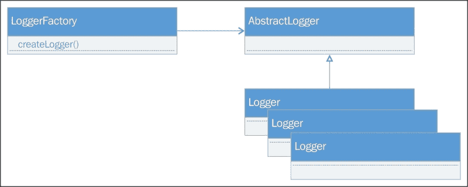
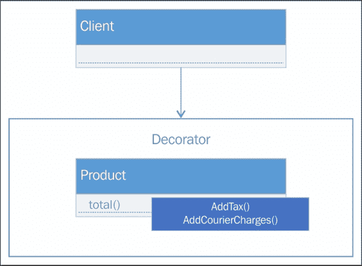
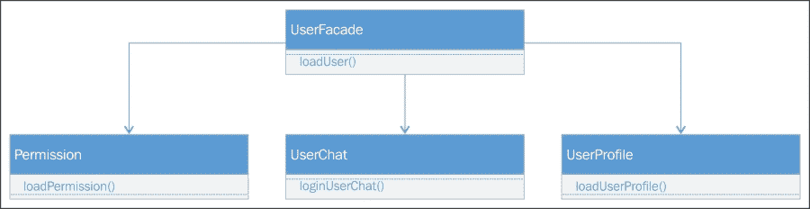
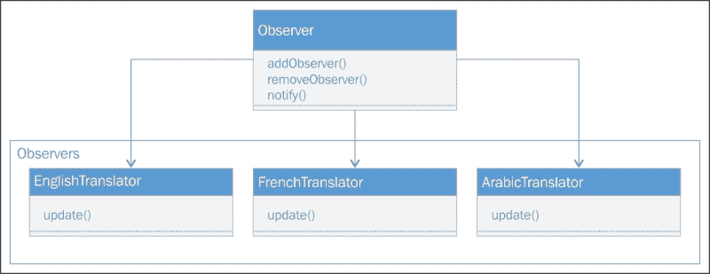
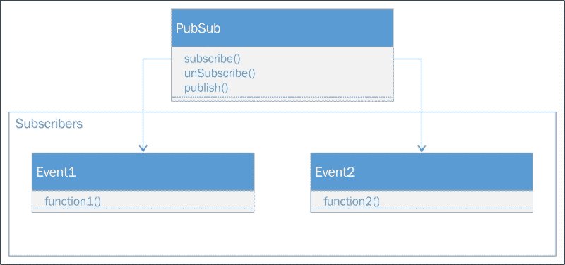
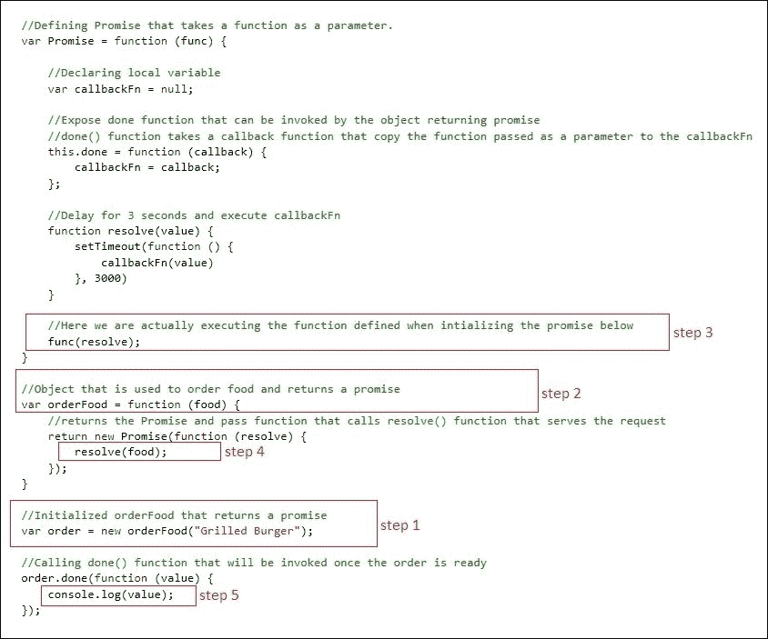

# 七、JavaScript 设计模式

在每个大中型项目中，良好的体系结构和设计在处理复杂场景和提高产品可维护性方面始终扮演着重要角色。设计模式是专业开发人员为解决特定问题而开发和使用的最佳实践。如果在应用中针对特定场景使用了设计模式，那么它可以避免在开发过程中或在生产中运行应用时可能遇到的许多问题。设计模式通过提供指导方针来解决问题，这些指导方针是处理问题或实现或实现任何需求的行业最佳实践。例如，单例模式用于仅创建一个在所有实例之间共享的实例，而原型用于通过添加更多属性和方法等扩展对象的现有功能。设计模式分为三类，即创造模式、结构模式和行为模式。我们将在本章中介绍的主题如下：

*   **创作模式**：以下是我们将在本章中讨论的创作模式：
    *   单例模式
    *   工厂模式
    *   抽象工厂模式
    *   原型模式
*   **结构模式**：以下是我们将在本章讨论的结构模式列表：
    *   适配器模式
    *   装饰者模式
    *   外观模式
    *   桥型
*   **行为模式**：以下是我们将在本章讨论的行为模式列表：
    *   责任链
    *   观察者模式
    *   发布/订阅模式
    *   承诺

# 创作模式

创建模式用于对象实例化。它们用于情况，即对象创建的基本形式可能导致设计问题或增加设计的复杂性。在下一节中，我们将讨论前面提到的所有四种创建模式，以及如何在 JavaScript 中实现它们。

## 单体设计模式

Singleton 是使用最广泛的模式。它用于需要在不同对象之间共享同一个类或函数实例（就 JavaScript 而言）的场景。它确保在任何点上只能全局访问特定对象的一个实例：


在单例模式中，构造函数应该是私有的，这将限制用户使用`new`关键字创建对象，并公开一个创建实例并验证仅存在一个实例的方法。一个简单的示例可能是将日志写入浏览器控制台窗口的 logger 对象：

```js
<script>
    var Logger = (function () {

        //private variable
        var instance;

        //private method
        function initializeInstance() {
            //closure returns the public access to the writeLog function that can be accessible by the singleton object
            return {
                writeLog: function (message) {
                    console.log(message);
                }
            };
        };
        //closure that returns the public access to the getInstance method that returns the singleton object
        return {
            //This is a public method that returns the singleton instance
            getInstance: function () {
                if ( !instance ) {
                    instance = initializeInstance();
                }
                return instance;
            },
        };
    })();

    var logger = Logger.getInstance();
    logger.writeLog("Hello world");
</script>
```

### 提示

在 JavaScript（ES5 标准）中，类仍然通过函数表示。

在 JavaScript 中，为了实现单例，我们可以使用闭包。闭包是内部对象，可以访问函数的私有成员，例如访问父函数中定义的变量和方法，并且可以从闭包访问。

最后一条语句中的括号`()`用于指定返回给记录器变量的对象，而不是函数本身。这实际上限制了对象通过`new`关键字进行初始化。

在前面的脚本中，函数首先返回包含一个`getInstance()`方法的闭包，该方法实际检查私有成员变量实例，如果未初始化，则调用`initializeInstance()`方法，该方法返回另一个包含`writeLog()`方法的闭包。我们可以添加更多用逗号分隔的方法或变量，它们可以通过 logger 对象访问。以下是`initializeInstance()`方法的修改版本，它还有一个方法`showAlert()`和一个变量`logEnabled`：

```js
function initializeInstance() {
            //closure returns the public access to the writeLog function that can be accessible by the singleton object
            return {
                writeLog: function (message) {
                    if(this.logEnabled)
                     console.log(message);
                },  
                showAlert: function (message) {
                    if(this.logEnabled)
                        alert(message);
                },
                logEnabled: false
            };
        };
```

## 工厂模式

工厂模式将对象实例化委托给集中类。我们调用返回所请求对象类型的`factory`方法，而不是使用`new`关键字实例化对象：



以下是基于记录器类型创建记录器实例的`LoggerFactory`示例：

```js
//LoggerFactory to instantiate objects based on logger type
    function LoggerFactory() {
        var logger;
        this.createLogger = function (loggerType) {
            if (loggerType === "console") {
                logger = new ConsoleLogger();
            }
            else if (loggerType === "alert") {
                logger = new AlertLogger();
            }
            return logger;
        }
    }

    //Console logger function
    var ConsoleLogger= function(){
        this.logMessage=function(message){
            console.log(message);
        } 
    };

    //Alert logger function
    var AlertLogger= function(){
        this.logMessage= function(message){
            alert(message);
        } 
    };

    var factory = new LoggerFactory();

    //creating Console logger object using LoggerFactory
    var consoleLogger = factory.createLogger("console");
    consoleLogger.logMessage("Factory pattern");

    //create Alert logger object using LoggerFactory
    var alertLogger = factory.createLogger("alert");
    alertLogger.logMessage("Factory pattern");
```

在我们的示例中，工厂类是`LoggerFactory`，它创建`ConsoleLogger`和`AlertLogger`对象的实例。`LoggerFactory`公开了一个`createLogger()`方法，该方法将记录器的类型作为参数来确定需要实例化哪个对象。每种类型的记录器都有自己的`logMessage()`方法来登录控制台窗口或显示警报消息。

## 抽象工厂模式

抽象工厂模式封装工厂集合以创建实例。实例公开了工厂可以调用的相同方法。下面是两个工厂`ShapeFactory`和`CarFactory`的示例，每个工厂返回两种类型的实例。`ShapeFactory`返回`Circle`和`Square`实例，`CarFactory`返回`HondaCar`和`NissanCar`实例。每个实例都有相同的方法`make()`，可以为任何实例调用：


以下是`ShapeFactory`的代码：

```js
<script>
    //Shape Factory to create instances of Circle and Square
    var ShapeFactory = function() {
        var shape;
        this.createShape = function (shapeType) {
            if (shapeType === "circle") {
                return new CircleShape();
            }
            else if (shapeType === "square") {
                return new SquareShape();
            }
        }
    }

    //Circle object to draw circle
    var CircleShape = function () {
        this.make = function () {
            var c = document.getElementById("myCanvas");
            var ctx = c.getContext("2d");
            ctx.beginPath();
            ctx.arc(100, 75, 50, 0, 2 * Math.PI);
            ctx.stroke();
        }
    }

    //Square object to draw square
    var SquareShape = function () {
        this.make = function () {
            var c = document.getElementById("myCanvas");
            var ctx = c.getContext("2d");
            ctx.beginPath();
            ctx.rect(50, 50, 50, 50);
            ctx.stroke();
        }
    }
```

以下是创建本田和日产汽车实例的`CarFactory`的代码：

```js
    //Car factory to create cars
    var CarFactory= function() {
        var car
        this.createCar = function (carType) {
            if (carType === "honda") {
                return new HondaCar();
            }
            else if (carType === "nissan") {
                return new NissanCar();
            }
        }
    }

    //Honda object
    var HondaCar = function () {
        this.make = function () {
            console.log("This is Honda Accord");
        }
    }

    //Nissan object
    var NissanCar = function () {
        this.make = function () {
            console.log("This is Nissan Patrol")
        }
    }
```

我们在一个按钮点击事件上调用`execute`方法，该事件创建实例并将它们保存在一个数组中。最终将执行 objects`make()`方法，在 HTML 画布上绘制圆圈，并在控制台上写入消息。与 JavaScript 一样，我们不能定义抽象方法；我们必须明确定义相同的方法，例如在我们的案例中完成抽象工厂模式的`make()`：

```js
    function execute() {
        //initializing an array to hold objects
        var objects = [];

        //Creating Shape Factory to create circle shape
        var shapeFactory = new ShapeFactory();
        var circleShape = shapeFactory.createShape("circle");

        //Creating Car Factory to create cars
        var carFactory = new CarFactory();
        var hondaCar= carFactory.createCar("honda");
        var nissanCar = carFactory.createCar("nissan");

        //Adding all the instances created through factories
        objects.push(circleShape);
        objects.push(hondaCar);
        objects.push(nissanCar);

        //Calling make method of all the instances. 
        for (var i = 0; i < objects.length; i++) {
            alert(objects[i]);
            objects[i].make();
        }
    }

</script>
```

以下是包含画布和按钮的 HTML 代码：

```js
    <div>
        <input type="button" onclick="execute()" value="Execute" />
    </div>
    <div>
        <canvas id="myCanvas"></canvas>
    </div>
```

按钮点击事件的输出如下。圆圈将被画出并在本田和日产汽车对象的控制台窗口上打印两条信息：


## 原型模式

原型模式用于创建现有实例的克隆实例。它用于需要使用某些特定值或属性自动配置对象的场景，用户不必显式定义：


以下是实现原型模式的代码：

```js
<script>

    function Car(make, model, year, type)
    {
        this.make = make;
        this.model = model;
        this.year = year;
        this.type = type;

        this.displayCarDetails = function(){

        }

    }

    function CarPrototype(carPrototype) {
        var car = new Car();

        this.getPrototype = function () {
            car.make = carPrototype.make;
            car.model = carPrototype.model;
            car.year = carPrototype.year;
            car.type = carPrototype.type;
            return car;
        }

    }

    (function () {
        var car = new Car("Honda", "Accord", "2016","sedan");
        var carPrototype = new CarPrototype(car);
        var clonedCar = carPrototype.getPrototype();

    })();
</script>
```

在前面的代码片段中，有一个 car 对象，它接受四个参数，`make`、`model`、`year`和`type`。`CarPrototype()`是一个函数，它接受`car`对象并返回`car`对象的克隆版本。此模式具有较高的性能效率，只需调用原型对象的 clone 方法，即可节省开发人员创建对象克隆副本的时间。用户不需要关心在对象实例化之后填充属性；它在创建对象时初始化，并获得与原始对象相同的值。在需要克隆处于特定状态的对象实例的情况下使用，可以通过调用的`getProtoype()`方法轻松克隆。

# 结构模式

结构模式用于简化对象之间的关系。在下面的部分中，我们将讨论前面提到的所有四种结构模式，以及如何在 JavaScript 中实现它们。

## 适配器模式

适配器模式用于我们的应用依赖于属性和方法频繁更改的任何对象的情况，我们希望避免修改代码来使用它们。适配器模式允许我们按照客户机的期望包装特定对象的接口，而不是更改整个实现，我们只需调用包装器对象，该对象包含修改版本的代码。此包装器对象称为适配器。让我们看一个基本示例，它使用`PersonRepository`通过执行 Ajax 请求来保存`person`对象：


以下是`PersonRepository`对象的旧接口：

```js
// old interface
    function PersonRepository(){
        this.SavePerson= function(name, email, phoneNo){
            //Call ajax to save person
            console.log("Name: " + name + ", Email: " + email + ", Phone No: " + phoneNo);
        }
    }
```

前面的接口有一个`SavePerson()`方法，该方法有三个参数：`name`、`email`和`phoneNo`。以下是使用`SavePerson()`方法的原始代码：

```js
var execute = function () {

        var personRepository = new PersonRepository();
        personRepository.SavePerson("John", "john@email.com", "1201111111");

    }
```

假设此接口已更改，并且新的 person repository 接口接受`person`JSON 对象，而不是将值作为参数传递。一种方法是修改函数本身，并将这些参数封装在 JSON 对象中并发送。或者，我们可以实现一个适配器模式，其中包含一个适配器函数，该函数接受三个参数，调用新的`PersonRepository`对象并传递 JSON 对象。

以下为`PersonRepository`新增界面：

```js
function PersonRepository() {
        this.SavePerson = function (person) {
            //call ajax to send JSON person data
          console.log("Name: " + person.name + ", Email: " + person.email + ", Phone No: " + person.phoneNo);
        }
    }
```

下面是将参数封装在 JSON 对象中并调用新的`PersonRepository`接口的适配器模式：

```js
    function PersonRepositoryAdapter() {
        this.SavePerson = function (name, email, phoneNo) {
            var person = { "name": name, "email": email, "phoneNo": phoneNo };

            var personRepository = new PersonRepository();
            //calling new Person Repository
personRepository.SavePerson(person);
        }
    }
```

下面是修改后的版本，它调用适配器模式，而不是调用旧`PersonRespository`接口：

```js
    var execute = function () {

    //old interface
// var personRepository = new PersonRepository();
  // personRepository.SavePerson("John", "john@email.com", "1201111111");

      //calling adapter pattern
        var personAdapter = new PersonRepositoryAdapter();
        personAdapter.SavePerson("John", "john@email.com", "1201111111");

    }
```

## 装饰图案

decorator 模式用于在运行时更改对象的行为。装饰器就像 C#中的注释属性。同样，我们也可以在一个对象上添加多个装饰器。decorator 模式可以通过创建 decorator 对象并将其与行为需要更改的目标对象关联来实现：



以下是在`Product`对象上添加`Tax`和`Courier`电荷装饰器的装饰器示例：

```js
<script>

    var Product= function (code, quantity, price) {
        this.code = code;
        this.quantity = quantity;
        this.price = price

        this.total = function () {
            this.price = price * quantity;
            return this.price;
        }

    }

    //Decorator that takes product and percent as parameter to apply Tax
    function AddTax(product, percent) {
        product.total = function () {
             product.price = product.price + (product.price * percent / 100);
            return  product.price;
        }
    }

    //Decorator to add Courier charges in the total amount.
    function AddCourierCharges(product, amount) {
        product.total = function () {
            product.price = product.price + amount;
            return product.price;
        }
    }

    var execute = (function () {
        var prod = new Product("001", 2, 20);
        console.log("Total price: " + prod.total());
        AddTax(prod, 15);
        console.log("Total price after Tax: " + prod.total());
        AddCourierCharges(prod, 200);
        console.log("Total price after Courier Charges: " + prod.total());
    })();
```

`product`对象取三个参数`code`、`quantity`和`price`、，并根据`quantity`和`price`计算总价。`AddTax()`和`AddCourierCharges()`是两个装饰对象 product object，后跟一个参数，用于对更改总价进行具体计算。`AddTax()`方法根据提供的价值征税，而`AddCourierCharges()`将快递费金额加到总价中。当页面呈现并在控制台窗口中显示以下输出时，将立即调用`Execute()`方法：


## 立面图案

façade 模式用于将各种接口或子系统简化为一个统一的接口。它向用户简化了事情，用户可以调用`façade`接口执行特定操作，而不是理解不同子系统的复杂性。

让我们看看下面的示例，它有三种方法来加载权限、用户配置文件和成功登录时的用户聊天窗口。它有三个接口，通过 façade，我们可以将其简化为一个统一的接口。这允许用户在登录成功时只调用`UserFacade`一次，并从一个界面加载权限、用户聊天和用户档案：



```js
<script>
    var Permission = function () {
        this.loadPermission = function (userId) {
            //load user permissions by calling service and populate HTML element
            var repo = new ServiceRepository();
            repo.loadUserPermissions(userId);
        }
    }

    var Profile = function () {
        this.loadUserProfile = function (userId) {
            //load user profile and set user name and image in HTML page
            var repo = new ServiceRepository();
            repo.loadUserProfile(userId);
        }
    }

    var Chat = function () {
        this.loginUserChat = function (userId) {
            //Login user chat and update HTML element
            var repo = new ServiceRepository();
            repo.loadUserChat(userId);
        }
    }

    var UserFacade = function () {
        this.loadUser = function (userId) {
            var userPermission = new Permission();
            var userProfile = new Profile();
            var userChat = new Chat();

            userPermission.loadPermission(userId);
            userProfile.loadUserProfile(userId);
            userChat.loginUserChat(userId);

        }
    }

    var loginUser = (function (username, password) {

            //Service to login user
            var repo = new ServiceRepository();
            //On successfull login, user id is returned
            var userId = repo.login(username, password);

            var userFacade = new UserFacade();
            userFacade.loadUser(userId);

    })();
<
```

## 桥型

桥接模式用于将抽象与其实现解耦，并使具体实现独立于接口。这是通过在接口和具体实施者之间提供桥梁来实现的：


以下代码显示了桥接模式的实现：

```js
<script>

    var Invitation = function (email) {
        this.email = email;
        this.sendInvite = function () {
            this.email.sendMessage();
        }
    }

    var Reminder = function (sms) {
        this.sms = sms;
        this.sendReminder = function () {
            this.sms.sendMessage();
        }
    }

    var SMS = function () {
        //send SMS
        this.sendMessage = function () { console.log("SMS sent"); }

    }

    var Email = function () {
        //send email
        this.sendMessage = function () { console.log("Email sent");}
    }

    var execute = (function () {
        var email = new Email();
        var sms = new SMS();

        var invitation = new Invitation(email);
        var reminder = new Reminder(sms);

        invitation.sendInvite();
        reminder.sendReminder();
    })();
</script>
```

前面的示例的目的是将通知类型（`Invitation`和`Reminder`与通知网关（`Email`和`SMS`）分开。因此，任何通知都可以通过任何网关发送，并且可以处理将网关与通知类型分离的任何通知，并禁用与通知类型的绑定。

# 行为模式

行为模式用于在对象之间委派职责。在下一节中，我们将讨论前面提到的所有四种行为模式，以及如何在 JavaScript 中实现它们。

## 责任链模式

责任链模式提供了一个对象链，当它们被链接以满足任何请求时，按顺序执行。ASP.NET 开发人员的一个很好的例子是 OWIN 管道，它将组件或 OWIN 中间件链接在一起，并基于正在执行的相应请求处理程序：


让我们来看一个非常基本的例子，它执行对象链并显示 2、3 和 4 的表：

```js
<script>

    //Main component
    var Handler = function (table) {
        this.table = table;
        this.nextHandler = null;
    }

    //Prototype to chain objects
    Handler.prototype = {
        generate: function (count) {
            for (i = 1; i <= count; i++) {
                console.log(this.table + " X " + i + " = " + (this.table * i));
            }
            //If the next handler is available execute it
            if (this.nextHandler != null)
                this.nextHandler.generate(count);
        },
        //Used to set next handler in the pipeline
        setNextHandler: function (handler) {
            this.nextHandler = handler;
        }
    }

    //function executed on Page load
    var execute = (function () {

        //initializing objects
        var handler1 = new Handler(2),
         handler2 = new Handler(3),
         handler3 = new Handler(4);

        //chaining objects
        handler1.setNextHandler(handler2);
        handler2.setNextHandler(handler3);

        //calling first handler or the component in the pipeline
        handler1.generate(10);

    })();
<script>
```

让我们进入一个更实际的例子，它获取金额并检查在管道中链接的对象中的预算所有者。下面的代码有一个主处理程序对象，它接受预算金额，预算所有者设置`Line Manager`、`Head of Department`、`CTO`和`CEO`的预算金额。最后，我们可以通过调用`handler1`方法设置链中的主要入口点，该方法首先检查金额是否在直线经理的预算之下，然后是部门主管的预算之下，然后是 CTO 的预算之下，最后是 CEO 的预算之下：

```js
<script>

    //Main component
    var Handler = function (budget, budgetOwner) {
        this.budget = budget;
        this.budgetOwner = budgetOwner;
        this.nextHandler = null;
    }

    //Prototype to chain objects
    Handler.prototype = {
        checkBudget: function (amount) {
            var budgetFound = false;
            if (amount <= this.budget) {
                console.log("Amount is under " + this.budgetOwner + " level");
                budgetFound = true;
            }

            //If the next handler is available and budget is not found
            if (this.nextHandler != null && !budgetFound)
                this.nextHandler.checkBudget(amount);
        },

        //Used to set next handler in the popeline
        setNextHandler: function (handler) {
            this.nextHandler = handler;
        }
    }

    //funciton executed on Page load
    var execute = (function () {

        //initializing objects
        var handler1 = new Handler(10000, "Line Manager"),
         handler2 = new Handler(50000, "Head of Department"),
         handler3 = new Handler(100000, "CTO"),
         handler4 = new Handler(1000000, "CEO");

        //chaining objects
        handler1.setNextHandler(handler2);
        handler2.setNextHandler(handler3);
        handler3.setNextHandler(handler4);

        //calling first handler or the component in the pipeline
        handler1.checkBudget(20000);

    })();
</script>
```

以下为输出：


## 观察者模式

observer 模式广泛用于实现发布者/订阅者模型，在该模型中，如果任何对象的状态发生变化，它会通知所有订阅的观察者。观察者模式有三种方法，即对`add`、`remove`和`notify`观察者：



以下是实现观察者模式的代码片段：

```js
<script>

    //Sample function to convert text to French language
    function translateTextToFrench(value) {
        // call some service to convert text to French language
        return value;
    }

    //Sample function to convert text to Arabic language
    function translateTextToArabic(value) {
        //cal some service to convert text to Arabic language
        return value;

    }

    //Helper function used by the Observer implementors 
    var HelperFunction = function (type) {

        var txtEntered = document.getElementById("txtEntered");

        var englishText = document.getElementById("englishText");
        var frenchText = document.getElementById("frenchText");
        var arabicText = document.getElementById("arabicText");

        if (type == "english") {
            englishText.innerText = txtEntered.value;
        } else if (type == "french") {
            frenchText.innerText = translateTextToFrench(txtEntered.value);
        } else if (type == "arabic") {
            arabicText.innerText = translateTextToArabic(txtEntered.value);
        }
    }

    var EnglishTranslator = {
        update: function () {
            //Call helper function to change text to English
            HelperFunction("english");
        }
    }

    var FrenchTranslator = {
        update: function () {
            //Call helper function to change text to French
            HelperFunction("french");
        }
    }

    var ArabicTranslator = {
        update: function () {
            //Call helper function to change text to Arabic
            HelperFunction("arabic");
        }
    }

    //Observer function that contains the list of observer handlers
    function Observer() {
        this.observers = [];
    }

    //to add observer
    Observer.prototype.addObserver = function (object) {
        console.log('added observer: ' + object);
        this.observers.push(object);
    };

    //to remove observer
    Observer.prototype.removeObserver = function (object) {
        console.log("removing observer");
        for (i = 0; i < this.observers.length; i++) {
            if (this.observers[i] == object) {
                this.observers.splice(object);
                return true;
            }
        }
        return false;
    };

    //To notify all observers and call their update method
    Observer.prototype.notify = function () {
        for (i = 0; i < this.observers.length; i++) {
            this.observers[i].update();
        }
    }

    //Adding objects as observers that implements the update method
    var observer = new Observer();
    observer.addObserver(EnglishTranslator);
    observer.addObserver(FrenchTranslator);
    observer.addObserver(ArabicTranslator);

    //Execute will be called on button click to notify observers
    var execute = function () {
        observer.notify();
    };

</script>
<body>
    <div>
        Specify some text: <input type="text" id="txtEntered" />
        <input type="button" onclick="execute()" value="Notify" />
    </div>
    <div>
        <span id="englishText"></span>
        <span id="frenchText"></span>
        <span id="arabicText"></span>
    </div>
</body>
```

在上面的示例中，我们采用了一个场景，该场景为添加为观察者对象的所有语言翻译文本。我们扩展了`Observer`对象，通过原型定义了`addObserver()`、`removeObserver()`和`notify()`三种方法。通过原型添加方法消耗更少的内存，并且每个方法在所有实例之间共享。这些方法创建一次，然后由每个实例继承。另一方面，每次创建新实例时都会创建构造函数中定义的方法，并消耗更多内存。

`addObserver()`方法用于在观察者列表中添加任何对象，`removeObserver()`用于从观察者列表中删除特定对象，`notify()`执行观察者的`update()`方法。

`EnglishTranslator`、`FrenchTranslator`和`ArabicTranslation`是已经实现`update()`方法的对象，该方法在执行`notify()`时被调用。在页面加载时，我们已将所有翻译器对象注册为观察者，并提供了一个带有按钮的文本框，用户可以通过该按钮在文本框上键入任何文本，在按钮单击事件中，它将调用观察者的`notify()`方法，最终调用注册观察者的`update()`方法。

## 发布/订阅模式

pub/sub 模式是观测者模式的一种替代模式，其实现方式略有不同。在观察者模式中，`Observer`对象可以调用所有观察者的`notify()`方法，而在发布者/订阅者模式中，有一个集中式事件系统，用于向订阅者发布事件。在这种模式中，发布者和订阅者是松散绑定的，发布者和订阅者都不知道消息发送或接收给谁。

下面的示例实现了一个包含二维数组的发布/订阅模式。用户可以基于事件名称和回调函数添加事件。它有三种方法：`subscribe()`订阅事件数组中的事件；`unsubscribe()`从数组中删除事件；`publish()`调用特定事件名称的回调函数：



以下是一段代码片段，用于在 JavaScript 中实现发布/订阅模式：

```js
var PubSub = function () {
        this.events = [];
        this.subscribe = function (eventName, func) {
            this.events[eventName] = this.events[eventName] || [];
            this.events[eventName].push(func);
        };

        this.unsubscribe = function (eventName, func) {
            if (this.events[eventName]) {
                for (i = 0; i < this.events[eventName].length; i++) {
                    if (this.events[eventName][i] === func) {
                        this.events[eventName].splice(i, 1);
                        break;
                    }
                }
            }
        };

        this.publish = function (eventName, data) {
            console.log(data);
            if (this.events[eventName]) {
                this.events[eventName].forEach(function (event) {
                    event(data);
                })
            }
        };
    };

    var execute = (function () {
        var pubSub = new PubSub();
        pubSub.subscribe("myevent1", function () {
            console.log("event1 is occurred");
        });

        pubSub.subscribe("myevent1", function () {
            console.log("event1 is occurred");
        });

        pubSub.subscribe("myevent2", function (value) {
            console.log("event2 is occurred, value is "+ value);
        });

        pubSub.publish("myevent1", null);

        pubSub.publish("myevent2", "my event two");
    })();
```

在前面的示例中，我们有一个对象，它为`subscribe`、`unsubscribe`和`publish`事件提供了三种方法。`Subscribe()`方法用于订阅任何事件，并获取两个参数，事件名称和函数，并将它们添加到特定事件名称的数组中。如果事件名称不存在，将为该事件名称初始化一个新数组，否则将检索现有实例以添加该项。通过传递事件名称和发布事件时将执行的匿名函数体，用户可以注册任意数量的事件。要发布事件，可以调用`publish()`方法，该方法获取事件名称和要传递给相应函数的数据，该函数已执行。

## 承诺

承诺是 JavaScript API 和框架中广泛使用的最流行的模式之一，用于简化异步调用。JavaScript 中的异步操作需要一个回调函数寄存器，该寄存器在返回值时调用。使用 Promissions，当您进行任何异步调用时，它会立即返回一个 Promission，并在解析结果值时提供诸如`then`和`done`之类的对象来定义函数。在现实世界中，承诺就像是你在快餐店点的食物的代币或收据，而收据保证你在食物准备好的时候就能送到。承诺是确认您收到特定请求响应的令牌：


在 JavaScript 中，承诺被 API 和框架广泛使用，如 AngularJS、Angular2 等。让我们看一下以下实现 promise 模式的示例：

```js
//Defining Promise that takes a function as a parameter.
    var Promise = function (func) {
        //Declared member variable 
        var callbackFn = null;

        //Expose done function that can be invoked by the object returning promise
        //done() function takes a callback function which can be define when using done method.
        this.done = function (callback) {
           callbackFn = callback;
        };

        function resolve(value) {
            setTimeout(function () {
                callbackFn(value)
            },3000)
        }

        //Here we are actually executing the function defined when initializing the promise below.
        func(resolve);
    }

    //Object that is used to order food and returns a promise
    var orderFood = function (food) {
        //returns the Promise instance and pass anonymous function that call resolve method which actually serve the request after delaying 3 seconds.
        return new Promise(function (resolve) {
            resolve(food);
        });
    }

    //Initialized orderFood that returns promise
    var order = new orderFood("Grilled Burger");
    //Calling done method which will be invoked once the order is ready
    order.done(function (value) {
        console.log(value);
    });
```

在前面的示例中，我们开发了一个`Promise`函数，其中包含`done`和`resolve`方法，其中`done`用于调用消费者对象实现的回调函数，而`resolve`在内部被调用以执行实际任务。第二个函数是`orderFood`，它返回一个`promise`对象，并在使用者初始化`orderFood`时调用`resolve`方法来实际运行任务。以下快照显示了如何执行此代码的步骤：



如果您已经注意到，在前面的示例中，我们使用了`setTimeout()`函数将响应延迟 3 秒。我们必须使用`setTimeout()`来表示一个异步场景，其中`setTimout()`和`done`回调处理程序的注册是并行执行的。

前面的代码片段是承诺模式的一个非常基本的实现。然而，我们可以实现 promise 模式的其他部分以使其健壮。承诺有状态，下面是修改后的版本，不仅维护了`inprogress`、`done`、`failed`的状态，还提供了失败处理程序捕捉异常。以下是对这些州的描述：

*   **进行中**：调用`resolve`方法时，状态设置为`in progress`。此状态将持续，直到我们注册`done`和`failed`场景的处理程序。
*   **完成**：当`done`被调用时，状态设置为`done`。
*   **失败**：当异常发生时，状态设置为`fail`。

以下是`orderFood`示例的修改版本：

```js
    //Defining Promise that takes a function as a parameter.
    var Promise = function (func) {

        //Default status when the promise is created
        var status = 'inprogress';
        var error = null;

        //Declared member variable 
        var doneCallbackFn = null;
        var failedCallbackFn = null;

        //Expose done function that can be invoked by the object returning promise
        this.done  = function (callback) {
            //Assign the argument value to local variable
            doneCallbackFn = callback;
            if (status === "done") {
                doneCallbackFn(data);
            } else {
                doneCallbackFn(status);
            }
            //return promise to register done or failed methods in chain
            return this;
        };

        //Expose failed function to catch errors
        this.failed = function (callback) {
            if (status === "failed") {
                failedCallbackFn(error);
            }
            //return promise instance to register done or failed methods in chain
            return this;
        };

        function prepareFood() {
            setTimeout(function () {
                status = "done";
                console.log("food is prepared");
                if (doneCallbackFn) {
                    doneCallbackFn(data);
                }
            }, 3000);

        }

        function resolve(value) {
            try {
                //set the value
                data = value;

                //check if doneCallbackFn is defined
                if (doneCallbackFn) {
                    doneCallbackFn(value);
                }
                prepareFood();

            } catch (error) {
                //set the status to failed
                status = "failed";
                //set the exception in error
                error = error;
                //check if failedCallbackFn is defined
                if (failedCallbackFn) {
                    failedCallbackFn(value);
                }
            }
        }
        //Here we are actually executing the function defined when initializing the promise below.
        func(resolve);
    }

    //Object that is used to order food and returns a promise
    var orderFood = function (food) {
        //returns the Promise instance and pass anonymous function that call resolve method which 
        //actually serve the request after delaying 3 seconds.
        return new Promise(function (resolve) {
            resolve(food);
        });
    }

    //Initialized orderFood that returns promise
    var order = new orderFood("Grilled Burger").done(function (value) { console.log(value); }).failed(function (error) { console.log(error);})
```

# 总结

在本章中，我们学习了设计模式在小规模到大规模应用中的重要性，以及如何有效地使用它们来解决特定问题。我们为每个类别介绍了四种类型的设计模式，例如创建对象时、构建对象时以及向对象添加行为更改或状态时。还有各种更多的设计模式可供使用并记录在案，可在此处参考：[http://www.dofactory.com/javascript/design-patterns](http://www.dofactory.com/javascript/design-patterns) 。

在下一章中，我们将了解在服务器端运行 JavaScript 的 Node.js。我们将了解如何使用 Visual Studio 2015 在 Node.js 中开发 web 应用，并探索一些流行的框架，查看它提供的引擎。