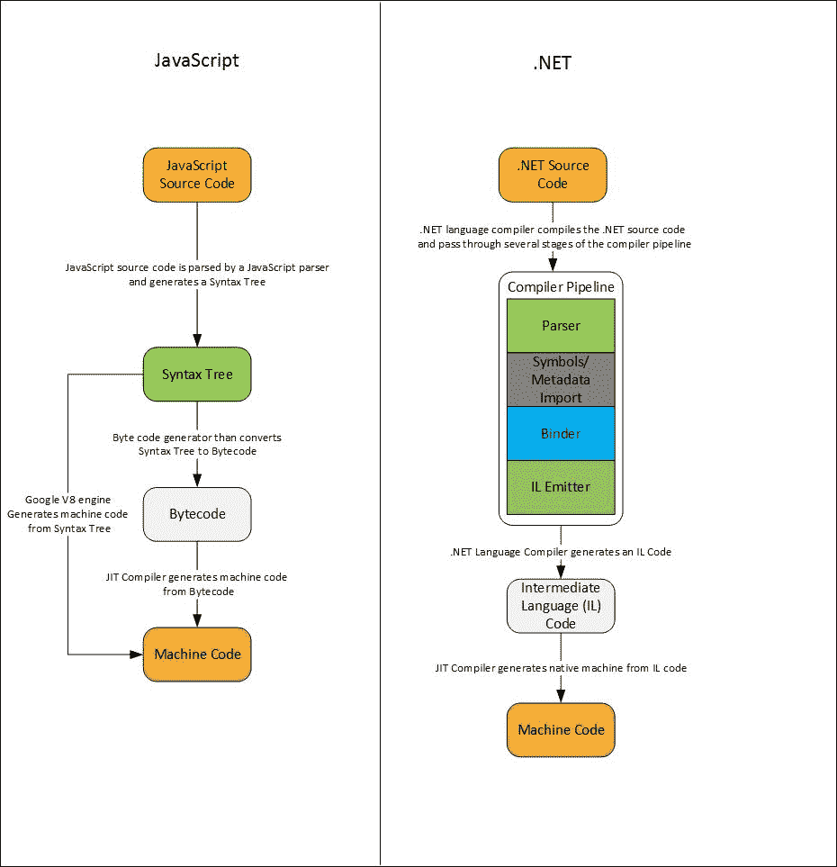
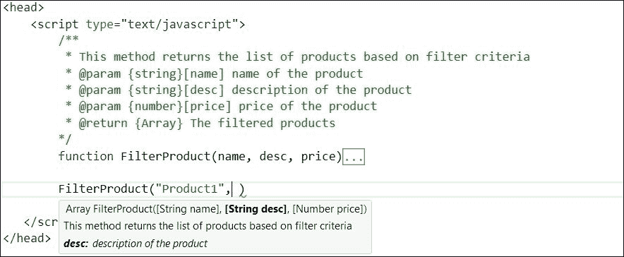
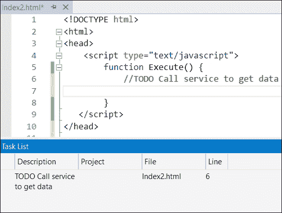
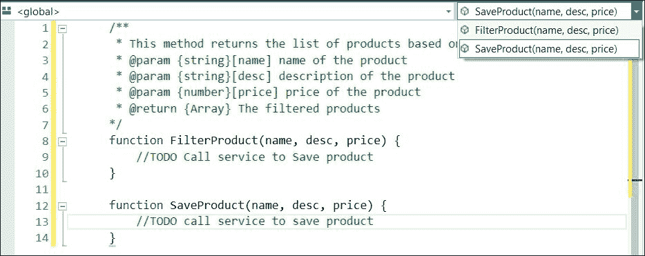
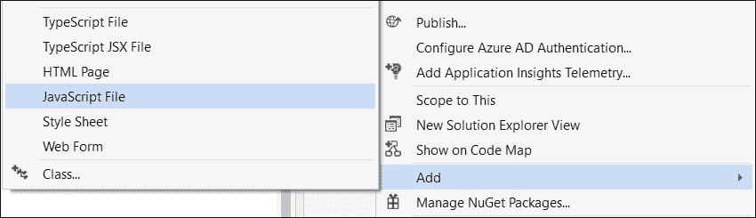
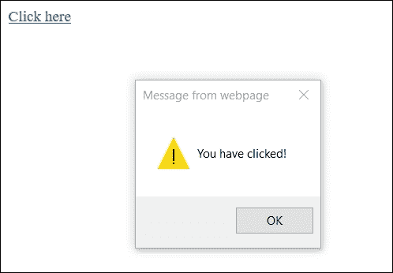
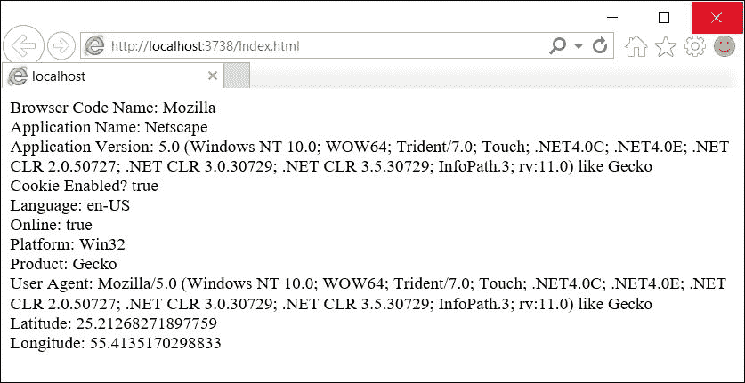
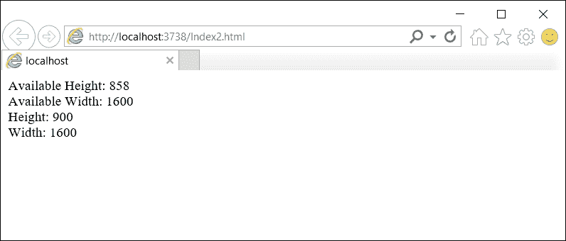

# 第一章：为现代网络应用程序的 JavaScript

近年来，网络开发以惊人的速度发展。大多数在桌面平台上开发的企业应用程序现在都转移到了网络平台，原因是访问的便捷性和网络平台不断添加的丰富功能。通常，任何提供桌面应用程序特征的网络应用程序都被认为是富网络应用程序。因此，它涉及大量使用 JavaScript 及其框架和库。

JavaScript 在开发富应用程序中扮演着重要的角色，并允许开发人员减少服务器端的回调并通过 ajaxified 请求调用服务器端函数。不仅如此，现在许多公司和社区都在开发像 Angular、Knockout、ReactJS 这样的优秀框架，带来最先进和突破性的功能。微软还发布了**WinJS**库，使从移动浏览器上运行的网页应用程序能够访问移动原生设备功能，如相机、存储等。**myNFC** 也是一个很棒的 JavaScript 库，它允许开发人员为智能手机创建应用程序。

# JavaScript 的重要性

所有客户端框架都是基于 JavaScript 的。作为一名 ASP.NET 开发者，在使用或将其集成到我们的应用程序之前，我们应该对 JavaScript 有扎实的概念。JavaScript 是客户端脚本语言，是有史以来最受欢迎的编程语言之一，在浏览器上运行。当在 web 开发项目中工作时，这种语言以许多更好的方式为您服务，使**用户界面**（**UI**）具有响应性。通过 JavaScript，您可以操作 HTML 页面**文档对象模型**（**DOM**）元素，通过 ajaxified 请求调用服务器端代码，并向您的客户带来新的丰富体验。在 JavaScript 库的核心进行了许多创新，并且已经开发出了不同的框架和各种库。

## JavaScript 是什么？

JavaScript 是一种由 Brendden Eich 在 1995 年创造的编程语言。最初，它只被 Netscape Browser 支持，但后来他们决定发布一个被称为 ECMA 规范的标准，让其他浏览器实现并提供引擎来在其浏览器上执行 JavaScript。提供这个标准的原因是为了让遵循方拥有完整的规格细节并保持行为的一致性。

最初，它主要针对在浏览器上执行，并执行与 HTML 页面一起工作的客户端操作，如操作 DOM 元素、定义事件处理程序和其他功能。后来，在近年来，它已经成为一种强大的语言，并不仅限于客户端操作。通过 Node.js，我们可以在服务器端使用 JavaScript，并且 Node 提供了各种模块和插件来执行 I/O 操作、服务器端事件等。

## 比较运行时

由于本书针对.NET 开发者，让我们将 JavaScript 运行时与.NET 运行时进行比较。有一些共同之处，但基本的运行时不同。

在.NET 中，**公共语言运行时**（**CLR**）对正在运行的代码进行**即时编译**（**JIT**）并提供内存管理。JIT 编译是在你构建项目后生成的一次性编译的**中间语言**（**IL**）代码上进行的。

在 JavaScript 世界中，浏览器引擎是 JavaScript 语言的运行时。每个浏览器都以自己的方式解释 JavaScript，但都遵循 ECMA 脚本标准。不同的浏览器有不同的实现，例如，Microsoft Edge 使用 Chakra 引擎，Chrome 使用 V8，Firefox 有 Monkey 引擎。最初，JavaScript 被实现为一种解释型语言，但现在很少有现代浏览器进行 JIT 编译。每个引擎都提供一套服务，如内存管理、编译和处理。

以下图表展示了两种架构的比较：



JavaScript 解析器解析和标记 JavaScript 代码，将其转化为语法树。所有浏览器（除了 Google V8）解析语法树并生成字节码，最终通过 JIT 编译转换成机器码。另一方面，Google V8 引擎解析语法树，而不是首先生成字节码，它直接生成机器码。

`.NET`源代码由其自己的语言编译器编译，例如 C#或 VB.NET 编译器，并经过编译器管道的几个阶段生成 IL 代码。然后 JIT 编译器读取这个 IL 代码并生成原生机器代码。

# 设置你的环境

在阅读本书之前，让我们设置一下你的环境。市场上有很多著名的编辑器可用于创建 JavaScript 项目，如 Sublime Text、Komodo IDE、NetBeans、Eclipse 等，但我们将继续使用 Visual Studio 2015，它带来了一些很好的改进，帮助开发者比以前更好地工作在 JavaScript 上。

接下来，让我们下载并安装 Visual Studio 2015。你可以从[`www.visualstudio.com/`](https://www.visualstudio.com/)下载 Visual Studio 2015 社区版，这是一个免费版本，并提供以下章节中描述的某些改进。

## Visual Studio 2015 IDE 中的 JavaScript 新编辑体验

新的 Visual Studio 2015 IDE 为开发网络应用程序提供了许多丰富的功能，并且有各种模板可用于根据不同框架和应用程序模型创建项目。早期版本已经支持 IntelliSense、着色和格式化，但新的 Visual Studio 2015 IDE 还有一些更多的改进，如下所示：

+   增加了对 ECMAScript 6 脚本语言的支持，正式名称为 ES2015。有了新的 ES2015，添加了许多功能，现在您可以定义类、lambda 表达式、展开操作符和代理对象。因此，借助 Visual Studio 2015，您可以在 JavaScript 代码中使用这些功能并获得所有 IntelliSense。

+   支持流行的 JavaScript 客户端框架，如 Angular、ReactJS 等。

+   文档注释可以帮助您为 JavaScript 方法添加注释，并在使用它们时显示描述：

+   对新的 JavaScript API（如触摸事件和 Web 音频 API）的支持。

+   您可以使用诸如`//TODO`、`//HACK`和`//UNDONE`之类的标记，它会在**任务列表**窗口中为您提供列表，帮助您追踪待办事项：

+   有了 JavaScript 文件，Visual Studio 2015 提供了我们在编写任何.NET 语言类时所熟悉的导航栏。使用此功能，选择并导航到不同的 JavaScript 方法要容易得多：

# 在 JavaScript 中编程

JavaScript 是最强大的语言之一，在任何网页开发项目中都发挥着至关重要的作用，提供客户端支持并实现丰富的功能。在本节中，我们将讨论在 JavaScript 中编写程序的核心概念，并将其应用于网页应用程序中。

## JavaScript 的核心基础知识

```js
<script></script> tags defined within the <head></head> section:
```

```js
<html>
  <head>
    <script>
      alert("This is a simple text");
    </script>
  </head>
</html>
```

页面加载时，会显示弹出消息和一段文字，如**这是一个简单的文本**。浏览器执行定义在`<script>`标签下的任何脚本，并运行此块内的语句。定义在脚本标签直接下方的任何语句在页面加载时都会执行。

同样，我们也可以在 HTML 页面的`<body>`部分定义 JavaScript：

```js
<html>
  <body>
    <script>
      alert("hello world");
    </script>
  </body>
</html>
```

### 提示

将脚本放在页面底部是一个好主意，因为编译可能会减慢页面加载速度。

通常，在每一个项目中，无论项目规模大小，将`<script>`部分与 HTML 分离可以使代码看起来更整洁，也更容易维护。JavaScript 文件扩展名称为`.js`，您还可以在一些脚本文件夹中单独创建这些文件，并在我们的 HTML 页面中引用它们。

在 Visual Studio 中，您可以使用**添加** | **JavaScript 文件**选项轻松创建 JavaScript 文件，如下所示：



文件创建完成后，我们就可以直接编写 JavaScript 语法，而无需使用`<script></script>`标签。JavaScript 文件可以通过在 HTML 页面中使用`<script></script>`标签的`src`属性来引用。在这里，我们在 HTML 页面中引用了`test.js`：

```js
<script src="img/test.js">
</script>
```

将`<script>`标签放在`<head>`或`<body>`部分取决于页面。如果您的页面引用一些大的 JavaScript 文件需要很长时间来加载，最好将它们定义在`<body>`部分的末尾。这是一个更好的方法，因此当浏览器开始解析您的页面时，它不会因为下载脚本而卡住，导致渲染延迟。另一方面，我们只有在它们不会影响性能或页面生命周期的情况下，才能在`<head>`部分定义 JavaScript 文件。在底部定义的脚本在整个页面加载后进行解析。我们还可以在`<script>`标签内使用一些属性，如`async`和`defer`，大多数浏览器支持这些属性。

以下是一个使用`async`在`<script>`标签中的示例：

```js
<script src="img/test1.js" async></script>
<script src="img/test2.js" async></script>
```

使用`async`定义的脚本异步执行，不会阻塞浏览器加载页面。然而，如果存在多个脚本，那么每个脚本都将异步执行且同时进行。这可能导致第二个脚本在第一个脚本完成之前就完成了，如果其中一个脚本依赖于另一个脚本，可能会抛出一些错误。例如，当使用某些客户端框架时，如 Angular 框架，使用 Angular 组件的 JavaScript 代码依赖于 AngularJS 库；在这种情况下，如果我们的自定义 JS 文件在它们依赖的 AngularJS 库之前被加载，它们将会抛出一个异常。

为了克服这种情况，我们可以使用`defer`按顺序执行脚本。我们可以这样使用`defer`：

```js
<script src="img/test1.js" defer></script>
<script src="img/test2.js" defer></script>
```

`async`和`defer`之间的基本区别是，`async`在 HTML 解析期间下载文件，并在完全下载后暂停 HTML 解析器执行它，而`defer`在 HTML 解析期间下载文件，并在 HTML 解析器完成后执行它。

### JavaScript 中的语句

语句是执行特定任务的单词、表达式和操作符的集合。与其他编程语言一样，JavaScript 中的语句也可以是给变量赋值、执行算术操作、实现条件逻辑、遍历集合等。

例如：

```js
var a; //variable declaration
a = 5; //value assignment
a = 5 * b; //value assignment
a++; // equivalent to a= a+1
a--; // equivalent to a= a-1
var method = function () { … } // declare function
alert("Hello World") // calling built-in function
if(…) {…} else {…}
for (…) {…}
while(…) {…}
```

然而，您可以在`do while`循环中使用分号：

```js
do {…} while (…);
function statement
function (arg) { //to do }
```

### 提示

如果同一行中定义了多个语句，它们应该用分号分隔，否则它们将被视为一个语句。在不同行中，分号不是必须的，但使用分号是一个好习惯。

### 字面量和变量

JavaScript 中有两种类型的值：字面量或固定值和变量。

字面量可以是数字、字符串或日期对象。

例如：

```js
Numbers
22.30
26
Strings
"John"
"10/Jan/2015"
```

变量用于存储值。在 JavaScript 中，我们可以使用`var`关键字定义变量。JavaScript 不是一种类型安全的语言，变量的类型在分配值时确定。

例如：

```js
var x=6;
var x="Sample value";
```

### 数据类型

每种编程语言都有特定的数据类型可用于存储特定数据。例如，在 C#中，我们可以使用`String`来存储字符串值，`int`来存储 32 位整数值，`DateTime`来存储日期和时间的值等等。JavaScript 没有提供像 C#和其他编程语言那样的强数据类型，它是一种松散类型的语言。根据最新的 ECMA 6 标准，JavaScript 提供了六个原始数据类型和一个对象。所有的原始数据类型都是不可变的，这意味着分配新值将会分配到单独的内存中。对象是可变的，其值可以被改变。

原始类型如下：

+   **Boolean**: 这持有逻辑值`true`或`false`。

+   **Null**: 这持有`null`值。

+   **Undefined**: 这是没有分配值并且值为 undefined 的变量。

+   **Number**: 这持有数值。`number`类型的尺寸是双精度 64 位，其中数值（分数）从 0 存储到 51 位，指数从 52 存储到 62 位，符号位是 63 位。

+   **String**: 这持有任何类型的文本值。

复杂类型被称为**对象**。在 JavaScript 中，对象是以 JSON 格式编写的。

#### JavaScript 中的数组

数组用于存储数据集合。你可以在 JavaScript 中简单地定义一个数组，如下所示：

```js
var browsers = ["Microsoft Edge", "Google Chrome", "Mozilla Firefox", "Safari"];
```

你可以通过数组索引来访问它们。索引从 0 开始，直到数组中的项目数。

我们可以如下访问数组项目：

```js
var a= browsers[0]; //returns Microsoft Edge
var b= browsers[1]; //returns Google Chrome
var c= browsers[3]; //returns Safari
```

为了获取数组中项目总数，你可以使用`length`属性：

```js
var totalItems = browsers.length;
```

以下是一些最常用方法的列表：

| 方法 | 描述 |
| --- | --- |
| `indexOf()` | 这会返回数组中等于特定值的元素的第一个索引，如果没有找到则返回`-1`。 |
| `lastIndexOf()` | 这会返回数组中等于指定值的元素的最后一个索引，如果没有找到则返回`-1`。 |
| `pop()` | 这会从数组中删除最后一个元素并返回那个元素。 |
| `push()` | 这会在数组中添加一个元素并返回数组长度。 |
| `reverse()` | 这会反转数组中元素的顺序。第一个元素变成最后一个，最后一个元素变成第一个。 |
| `shift()` | 这会删除第一个元素并返回那个元素。 |
| `splice()` | 这用于向数组中添加或删除元素。 |
| `toString()` | 这会返回所有元素的字符串表示。 |
| `unshift()` | 这会将元素添加到数组的前端并返回新长度。 |

### 提示

**下载示例代码**

下载代码包的详细步骤在本书的前言中提到。请查看。

本书的代码包也托管在 GitHub 上，地址为[`github.com/PacktPublishing/JavaScript-For-.NET-Developers`](https://github.com/PacktPublishing/JavaScript-For-.NET-Developers)。我们还有来自我们丰富书籍和视频目录的其他代码包，可在[`github.com/PacktPublishing/`](https://github.com/PacktPublishing/)找到。去看看吧！

### JSON 是什么？

**JavaScript 对象表示法**（**JSON**）是定义 JavaScript 中对象的轻量级、可交换格式。任何类型的对象都可以通过 JSON 定义，并用于构建通用数据结构。无论是简单对象、数组、嵌套数组还是复杂对象，都可以在 JSON 格式中处理。

#### JSON 中的简单对象

```js
person object that has three properties, namely name, email, and phone:
```

```js
var person = {
  "name" : "John Martin",
  "email": johnmartin@email.com,
  "phone": "201892882"
}
```

我们可以按以下方式访问这些对象属性：

```js
person.name;
person.email;
person.phone;
```

#### 在 JSON 中声明数组

以下代码片段显示了在 JSON 中声明数组的方式：

```js
var persons =
[{ 
  "name":"John",
  "email": "john@email.com",
  "phone":"201832882"
},
{
  "name":"Steve",
  "email": "steve@email.com",
  "phone":"201832882"
},
{
"name":"Smith",
"email": "smith@email.com",
"phone":"201832882"
}]
```

根据前面声明的数组，可以按以下方式访问：

```js
//returns name of the first item in the collection i.e. John
Persons[0].name
//returns email of the first item in the collection i.e. john@email.com
Persons[0].email
//returns name of the second item in the collection i.e. Steve
Persons[1].name
```

#### 在 JSON 中嵌套数据

JSON 格式可以轻松处理嵌套数组。让我们看看包含`employee`对象的复杂对象，该对象包含`Experiences`数组，该数组包含嵌套数组以持有项目，每个项目都有一个嵌套数组以持有每个项目中所使用的技术：

```js
var employee=
{
  "ID":"00333",
  "Name":"Scott",
  "DateOfJoining":"01/Jan/2010",
  "Experiences":[
    {
      "companyName":"ABC",
      "from":"Nov 2008",
      "to":"Oct 2009",
      "projects" :[
        {
        "title":"Sharepoint Migration",
        "noOfTeamMembers":5,
        "technologyUsed":[{"name":"SharePoint Server"}, {"name":"C#"}, {"name":"SQL Server"}]
        },
        {
        "title":"Messaging Gateway",
        "noOfTeamMembers":5,
        "technologyUsed":[{"name":"ASP.NET"}, {"name":"C#"}, {"name":"SQL Server"}]
        }
      ]
    },
    {
      "companyName":"XYZ",
      "from":"Nov 2009",
      "to":"Oct 2015",
      "projects" :[
        {
        "title":"ERP System",
        "noOfTeamMembers":5,
        "technologyUsed":[{"name":"ASP.NET"}, {"name":"C#"}, {"name":"SQL Server"}]
        },
        {
        "title":"Healthcare System",
        "noOfTeamMembers":4,
        "technologyUsed":[{"name":"ASP.NET"}, {"name":"C#"}, {"name":"SQL Server"}]
        }
      ]
    }
  ]
}
```

```js
First assign the string to the res variable:
```

```js
var res="Hello World";
```

然后将数字分配给同一个`res`变量：

```js
res= 2;
```

最后，将字符串`3`连接到持有以下数字的`res`变量中，但由于数值具有更高的优先级，结果值变成了`5`：

```js
var result = res + "3"
```

因此，无论最初分配给它的变量类型是什么，它都会根据赋值改变其类型，并动态处理转换。

## JavaScript 的元素

以下是我们在开始用 JavaScript 编程之前必须学习的 JavaScript 的一些重要元素。

### JavaScript 中的常量

JavaScript 中的常量可以用`const`关键字定义。常量是在编译时已知的不可变值，在整个程序的生命周期中值不会改变。

以下是显示常量变量赋值的 JavaScript 代码。当使用`const`时，不需要`var`，您只需使用`const`关键字即可声明常量值：

```js
const pi= 3.42
```

### 注释

注释可以用`//`和`/* */`添加。要注释单行，可以使用`//`，否则使用`/* */`来注释代码块。

以下是用 JavaScript 代码注释单行或代码块的方式：

```js
<script type="text/javascript">

function showInformation() {

  //var spObj = window.document.getElementById("spInfo");
  spObj.innerHTML =
    "Available Height: " + screen.availHeight + "<br>" +
    /*"Available Width: " + screen.availWidth + "<br>" +
    "Height: " + screen.height + "<br>" +*/
    "Width: " + screen.width + "<br>"
}

</script>
```

### 大小写敏感性

JavaScript 是一种大小写敏感的语言，它遵循 Pascal 命名约定来定义变量和方法。

例如，如果方法名是`doWork()`，只能通过以确切的大小写调用它，而调用`DoWork()`或`Dowork()`将不起作用并抛出异常。

### 字符集

JavaScript 基于 Unicode 字符集，并遵循 Unicode 标准。

### 注意

**什么是 Unicode 标准？**

它是一个全球编码标准，大多数语言都会使用。C# 和 VB.NET 遵循相同的 Unicode 标准。它为每一个字符提供了一个唯一的数字，例如，`A = 41`，`a = 61`，等等。

当前的 Unicode 标准版本是 Unicode 8.0.0，相关文档可访问 [`www.unicode.org/versions/Unicode8.0.0/`](http://www.unicode.org/versions/Unicode8.0.0/)。

## 表达式

表达式可以被认为是将某些值赋给变量的代码语句。表达式分为两种类型。

第一种表达式可以称为简单表达式，它将值赋给变量：

```js
var x = 2;
```

前一个示例表示将数值 `2` 赋给变量 `x` 的简单表达式。

第二种类型的表达式可以称为对右侧值进行任何算术或字符串操作，并将它们赋给任何变量。这类表达式在赋值给变量之前先执行操作：

```js
var x = 2+3
var x = "Hello" + "World";
```

这是第二种类型的表达式的示例，它将两个数字相加，并将结果值赋给 `x` 变量。第二个语句执行字符串连接操作，并将 `Hello World` 值赋给 `x` 变量。

### 这个关键字

就像 C# 和其他面向对象的语言一样，JavaScript 也有对象，并且有一些定义类、函数等等的方法，我们将在本章后面学习。就像在 C# 中一样，在 JavaScript 中，我们可以通过 `this` 关键字访问对象及其属性。让我们看看一些显示 JavaScript 中 `this` 关键字作用域的例子。

以下是一个包含几个属性和 `this` 关键字使用的 `customer` 对象：

```js
var customer =
  {
    name: "John Marting",
    email: "john@xyz.com",
    mobile: "109293988844",
    show: function () {
      alert("Name: "+this.name + " Email: " + this.email + " Mobile: " + this.mobile);
    }
  }
```

在前一个例子中，我们定义了一个包含三个属性和一个函数的 JavaScript 对象。要访问这些属性，我们可以像在 C# 中一样使用 `this` 关键字。然而，我们也可以使用 `customer` 变量来访问属性，如下所示：

```js
var customer =
  {
    name: "John Marting",
    email: "john@xyz.com",
    mobile: "109293988844",
    show: function () {
      alert("Name: "+ customer.name + " Email: " + customer.email + " Mobile: " + customer.mobile);
    }
  }
```

`this` 关键字的范围限制在对象的范围之内。然而，在前一个例子中的 `customer` 变量可能定义在页面的其他地方，可能导致不当的行为。尽可能使用 `this` 关键字并避免直接使用对象变量是一个更好的方法。

直接定义在 `<script>` 标签下的所有变量和函数称为全局变量和函数。我们也可以通过 `this` 关键字访问它们。在这种情况下，`this` 将被称为全局窗口对象，而不是前面例子中使用的子对象，即 `customer` 对象：

```js
<script type="text/javascript">
  var name = "";

  function ShowMessage() {
    alert(this.name);
  }
</script>
```

```js
alert(window.name);
```

让我们看看完整的示例，其中我们定义了全局变量，以及子对象，`this` 的作用域将根据其调用的上下文来确定：

```js
<script type="text/javascript">
  var name = "Scott Watson";

  var customer =
    {
      name: "John Marting",
      email: "john@xyz.com",
      mobile: "109293988844",
      show: function () {
        alert("Name: " + this.name + " Email: " + this.email + " Mobile: " + this.mobile);
      }
    }
  function ShowMessage() {
    alert("Global name is " + this.name);
    alert("Customer info is " + customer.show());
  }
</script>
```

在前面的示例中，我们将收到两个 JavaScript 警告消息。第一个警告将显示**Scott Watson**，它是全局定义的，第二个弹出窗口显示客户姓名、电子邮件地址和手机号码。因此，我们可以在两个地方使用`this`，但作用域是根据它从中调用的上下文确定的。

### 在 JavaScript 中的代码执行顺序

在 JavaScript 编程中，我们必须保持定义事物的顺序，然后再调用它们。考虑前面的示例，如果我们定义`customer`对象在`ShowMessage()`方法之后，它将不会被识别，什么也不会显示。

### 在调用方法上使用 this 关键字

让我们来看看一个名为`Multiply`的示例 HTML 页面，它有一个 JavaScript 函数，接受两个参数：`obj`和`val`。当用户在文本框中输入任何内容时，此方法将被调用，并将文本框控件的引用作为第一个参数传递。可以通过`this`关键字传递：

```js
<html>
<head>
  <script type="text/javascript">
    function Multiply(obj, val) {
      alert(obj.value * val);
    }
  </script>
</head>
<body>
  <input type="text" onchange ="Multiply(this, 2);" />
</body>
</html>
```

### 函数声明和表达式

函数声明是定义 JavaScript 中方法的一种方式。每个函数都有一个签名，包括名称和传入的参数。在 JavaScript 中，函数可以通过多种方式声明。例如，以下是`GetPerson(id)`函数的示例，该函数根据作为参数传递的 ID 返回`person`对象。这是在 JavaScript 中声明函数的正常方式：

```js
<script>

  function GetPerson(id) {
    return service.GetPerson(id);
  }

</script>
```

`function` 的返回类型是在运行时计算的，而不是函数签名的一部分。返回值不是强制的，你可以保持函数不返回任何值。

另一方面，匿名函数没有名称，它们可以作为其他函数的参数传递，或者没有函数名称定义。以下是无名函数的示例：

```js
var showMessage = function(message){
  console.log(message);
}
showMessage("Hello World");
```

定义匿名函数并将其作为参数传递的另一个示例如下：

```js
function messageLogger(message ,logMessage) {
  logMessage();
}

function consoleMessage() {
  alert("Hello World");
}
messageLogger(consoleMessage());
```

函数表达式与函数等价，唯一的区别是它不应该以函数名开始。

### 类声明和表达式

随着 ECMAScript 6，我们可以在 JavaScript 中创建类。与其他编程语言一样，我们可以使用`class`关键字创建类。借助于此，我们可以比在 ECMAScript 的早期版本中用函数表示类的方式写出更清晰的代码。

让我们来看看计算面积的`Rectangle`类：

```js
<script>
  class Rectangle {
    constructor(height, width) {
      this.height=height;
      this.width=width;
    }
    get Area() {
      return this.calcArea();
    }
    calcArea(){
      alert("Area is "+ this.height * this.width);
    }
  }
</script>
```

每个类应该有一个构造函数，如果指定了多个构造函数，则应该报错。类表达式是定义类的一种另一种方式。就像匿名函数一样，我们可以用类似的方式定义类。

让我们来看看前面定义的同一个类的示例：

```js
<script>
  var Rectangle = class{
    constructor(height, width) {
      this.height=height;
      this.width=width;
    }
    get Area() {
      return this.calcArea();
    }
    calcArea(){
      alert("Area is "+ this.height * this.width);
    }
  }
</script>
```

下一章将详细介绍类以及构建它们的属性和关键字。

### 分组运算符

对于任何算术表达式，JavaScript 使用**BODMAS**规则。优先级将首先给括号，然后是乘法、除法、加法和减法。分组运算符用于给表达式中任何成员的默认优先级更高的表达式更高的优先级。

例如：

```js
var a = 1;
var b = 2;
var c = 3;
var x = a + b * c;
```

结果`x`将是`7`，因为乘法有更高的优先级。然而，如果我们需要先进行加法呢？

我们可以像下面这样使用分组运算符，结果为`9`：

```js
var x = (a + b) * c;
```

### new

与 C#一样，`new`关键字用于在 JavaScript 中实例化任何对象。为了创建任何用户定义或预定义类型的实例，使用`new`关键字：

```js
var obj=new objectType();
```

### super

`super`关键字用于调用父对象的方法。在 C#中，我们使用`base`关键字来调用基类的方法或属性。在 JavaScript 中，我们可以这样使用：

```js
super.functionOnParent();
```

## 运算符

运算符是用来操作操作数值的对象。例如，`1 + 2`的结果是`3`，其中`1`和`2`是操作数，`+`是一个运算符。在 JavaScript 中，我们可以使用几乎所有的运算符来连接字符串，进行算术运算等。在本节中，让我们看看在 JavaScript 语言编程时我们可以使用哪些类型的运算符。

我们将在本节讨论以下运算符：

+   赋值运算符

+   算术运算符

+   一元运算符

+   比较运算符

+   逻辑运算符

+   位运算符

+   位移运算符

+   类型 of 运算符

+   空值运算符

+   删除运算符

+   杂项运算符

### 赋值运算符

赋值运算符表示为（`=`），并且赋值是从右到左进行的。

例如，`x=y`意味着`y`的值被赋给`x`。

### 算术运算符

以下是一系列你可以用来进行加法、减法、除法和乘法以及与赋值语句一起使用的算术运算符：

| 名称 | 运算符 | 意义 |
| --- | --- | --- |
| 加法 | `x + y` | `x`的值加上`y` |
| 减法 | `x – y` | `x`的值减去`y` |
| 除法 | `x / y` | `x`的值除以`y` |
| 乘法 | `x * y` | `x`的值乘以`y` |
| 取模运算符 | `x % y` | `x`的值除以`y`，返回余数 |
| 加法赋值运算符 | `x += y` | `x = x + y`，即`x`和`y`的值相加，结果赋值给`x` |
| 减法赋值运算符 | `x -= y` | `x = x - y`，即`x`和`y`的值相减，结果赋值给`x` |
| 乘法赋值运算符 | `x *= y` | `x = x * y`，即`x`和`y`的值相乘，结果赋值给`x` |
| 除法赋值运算符 | `x /= y` | `x = x / y`，即`x`的值除以`y`，结果赋值给`x` |
| 取模赋值运算符 | `x %= y` | `x = x % y`，即`x`的值除以`y`，余数赋值给`x` |
| 幂运算赋值 | `x **= y` | 即`x = x ** y`，`x`的值将 exponentially 乘以两次`y`并赋值给`x` |

### 一元运算符

一元运算符只与一个操作数一起使用。它可以用于递增、递减、取反等：

| 名称 | 运算符 | 意义 |
| --- | --- | --- |
| 递增运算符 | `x++` | `x`的值将增加`1` |
| 递减运算符 | `x--` | `x`的值将减少`1` |
| 逻辑补码运算符 | `!(x)` | 这将`x`的值取反 |

### 比较运算符

```js
number1 is equal to number2 and the summation of number1 and number2 is equal to number3 to return true:
```

```js
<script>
  function CheckNumbers(number1, number2, number3) {
    if ((number1 == number2) && ((number1 + number2) == number3)) {
      return true;
    }
  }
<script>
```

#### 逻辑或

```js
10, it will return true:
```

```js
<script>
  function AnyNumber10(number1, number2, number3) {
    if ((number1 ==10 || number2 == 10 || number3 ==10) {
      return true;
    }
  }
</script>
```

#### 逻辑非

```js
number1, number2, and number3 are equal to 10, the method will return false. If they are different, the return value will be true:
```

```js
<script>
  function AnyNumber10(number1, number2, number3) {
    return !(number1 ==10 && number2 == 10 && number3==10) {
    }
  }
</script>
```

### 按位运算符

按位运算符将每个数字或操作数视为二进制（`0`和`1`的组合）。每个数字都有特定的二进制对应。例如，数字`1`的二进制表示为`0001`，`5`表示为`0101`。

按位运算符对 32 位数字进行操作，任何数值操作数首先转换为 32 位数字，然后转换回 JavaScript 数字。

按位运算符在二进制中进行操作并返回数字结果。

例如，`x`是`1`，`y`是`9`。

`1`表示为`0001`。

`9`表示为`1001`。

#### 按位与

按位与表示为`&`，下面是操作数`1`和`9`的每位比较。如果每个位上的值都是`1`，结果将是`1`，否则为`0`：

| 数字 = 1 | 数字 = 9 | 结果 |
| --- | --- | --- |
| 0 | 1 | 0 |
| 0 | 0 | 0 |
| 0 | 0 | 0 |
| 1 | 1 | 1 |

在 JavaScript 代码中，我们可以如下使用它：

```js
<script>
  var a = "1";
  var b = "9";
  var c = a & b;
</script>
```

最后，结果值将是`0001`，等于`1`。

#### 按位或

按位或表示为`|`，下面是按位或的运算方式：

| 数字 = 1 | 数字 = 9 | 结果 |
| --- | --- | --- |
| 0 | 1 | 1 |
| 0 | 0 | 0 |
| 0 | 0 | 0 |
| 1 | 1 | 1 |

下面的代码片段展示了在 JavaScript 中的使用：

```js
<script>
  var a = "1";
  var b = "9";
  var c = a | b;
</script>
```

最后，结果值将是`1001`，等于`9`。

#### 按位非

按位非表示为`~`，它作用于单个操作数并反转每个二进制位。

例如，如果数字`9`表示为`1001`，它将转换为 32 位数字，然后按位非将其变为`11111111111111111111111111110110`，等于`-10`。

以下是一个代码片段：

```js
<script>
  var a = ~9;
</script>
```

#### 按位异或

按位异或表示为`^`，它与两个或更多操作数一起工作。

下面的表格展示了按位异或是如何进行的：

| 数字 = 1 | 数字 = 9 | 结果 |
| --- | --- | --- |
| 0 | 1 | 1 |
| 0 | 0 | 0 |
| 0 | 0 | 0 |
| 1 | 1 | 0 |

下面的代码片段展示了在 JavaScript 中的使用：

```js
<script>
  var a = "1";
  var b = "9";
  var c = a ^ b;
</script>
```

最后，结果值将是`1000`，等于`8`。

### 按位移位运算符

有三种按位移位运算符，如下：

+   按位左移运算符

+   按位右移运算符

#### 按位左移

它表示为`<<`，用于将位从右侧移到任何数字的二进制值。

例如，数字`9`表示为`01001`，如果我们使用位左移，结果值将是`10010`，从右边移动了一位。

以下代码片段展示了在 JavaScript 中的使用：

```js
<script>
  var a = 9;
  var result = a << 1;
</script>
```

最后，结果值将是`10010`，等于`18`。

#### 位右移

它表示为`>>`，用于将位从左侧移动到任何数字的二进制值。

例如，数字`9`表示为`1001`，使用位右移将结果值给出为`0100`。

以下代码片段展示了在 JavaScript 中的使用：

```js
<script>
  var a = "9";
  var result = a >> 1;
</script>
```

最后，结果值将是`0100`，等于`4`。

### 类型 of 操作符

这用于检查变量的类型是否为对象、未定义、数字等。在 JavaScript 中，我们可以这样使用：

```js
<script>
  if (typeof a=="number") {
    alert("this is a number");
  }
</script>
```

以下是 `typeof` 操作符可能返回的值列表：

| ```Value returned``` | 描述 |
| --- | --- |
| ```---``` | --- |
| ```"number"` | 如果操作数是一个数字 |
| ```"string"` | 如果操作数是一个字符串 |
| ```"boolean"` | 如果操作数是一个布尔值 |
| ```"object"` | 如果操作数是一个对象 |
| ```null``` | 如果操作数是 null |
| ```"undefined"` | 如果操作数未定义 |

### void 操作符

```js
void operator to display alert message when the link is clicked. Here, the alert expression is evaluated once the user clicks on the link:
```

```js
<html>
<head></head>
<body>
  <a href="javascript:void(alert('You have clicked!'));">
  </a>
</body>
</html>
```

当页面运行且用户点击链接时，将显示以下警告消息框：



此外，在 `void` 方法内传递 `0` 作为表达式将不做任何事情：

```js
<html>
<head></head>
<body>
  <a href="javascript:void(0);">
  Do Nothing
  </a>
</body>
</html>
```

另一个例子是使用 `void` 添加两个数字，并返回给定操作数的 `undefined`：

```js
<script>
  var n1 = 6;
  var n2 = 7;
  var n3;
  var result = void (n3 = n1 + n2);
  alert ("result=" + result + "and n3 =" + n3);
</script>
```

### 删除操作符

`delete` 操作符用于删除对象及其属性，但不删除局部变量。以下示例展示了如何在 JavaScript 中使用 `delete` 操作符：

```js
var country = { id: 1, name: "USA" };

  delete country.id;

  alert(country.id);
```

调用 `country.id` 将返回 `undefined`，因为这在之前的语句中已经被删除。另一方面，如果我们删除 `country` 对象，它不会被删除并显示国家 ID 为 `1`：

```js
var country = { id: 1, name: "USA" };

  delete country;

  alert(country.id);
```

### 杂项操作符

```js
compareValues() function that takes two parameters, and an alert will be displayed stating whether both the parameters are equal or not equal:
```

```js
<script>
  function compareValues(n1, n2)
    (n1 == n2) ? alert("Both values are equal") : alert("Passed values are not equal");
</script>
```

#### 展开操作符

展开操作符表示为（`…`）。当期望在函数调用中传递多个参数时使用。

例如，如果你的函数需要五个参数，你可以一个接一个地传递这些值作为调用该方法时的参数值，或者将它们放在一个数组中，并通过展开操作符传递该数组。

以下代码片段展示了在 JavaScript 中的实际示例：

```js
function multipleArgs(a, b, c, d, e){
}
var args = [1,2,3,4,5]
multipleArgs(…args);
```

## 在 JavaScript 中的内置显示方法

以下是 JavaScript 中可用的显示方法，用于以不同形式向用户提供通知和消息。

### 显示消息

以下是三种弹出对话框类型：

+   警告消息框

+   确认消息框

+   提示消息框

#### 警告框

使用 `window.alert()`，我们可以弹出一个警告对话框：

```js
<!DOCTYPE html>
<html>
<body>

  <h1>My First Web Page</h1>
  <p>My first paragraph.</p>

<script>
  window.alert(5 + 6);
</script>

</body>
</html>
```

#### 确认框

使用`window.confirm()`，我们可以弹出一个确认对话框，返回用户所采取的事件结果。当确认对话框弹出时，它提供两个动作事件：**确定**和**取消**。如果用户点击**确定**，将返回`true`，否则返回`false`。以下代码展示了在您的 HTML 页面上使用确认对话框的方法。

```js
 saving a record:
```

```js
<!DOCTYPE html>
<html>
<body>

<script>
  var r = window.confirm("are you sure to save record");
  if(r==true){
    alert("Record saved successfully");
  }
  else {
    alert("Record couldn't be saved");
  }
</script>

</body>
</html>
```

#### 提示框

提示对话框在需要用户提供值的情况下使用。它可以在需要用户输入的条件下来使用。

下面的代码片段展示了在 JavaScript 程序中使用提示消息框的方法：

```js
<!DOCTYPE html>
<html>
<body>

<script>
  var name = window.prompt("Enter your name","N/A");
  if(name !=null){
    alert("hello "+ name "+, how are you today!");
  }
</script>

</body>
</html>
```

### 页面上的写入

我们可以使用`document.write()`方法在屏幕上写入任何内容。

下面的代码片段展示了在 JavaScript 中在网页上编写任何文本的方法：

```js
<!DOCTYPE html>
<html>
<body>
  <script>
  document.write("Hello World");
  </script>
</body>
</html>
```

### 向浏览器的控制台窗口写入

使用`console.log()`，我们可以将任何文本写入浏览器的控制台窗口。

下面的代码片段展示了在 JavaScript 中为了追踪或调试目的向浏览器控制台窗口写入文本的方法：

```js
<!DOCTYPE html>
<html>
<body>
  <h1>My First Web Page</h1>
  <p>My first paragraph.</p>
  <script>
  console.log("Entered into script execution context");
  </script>
</body>
</html>
```

## 浏览器对象模型在 JavaScript 中

JavaScript 提供了一些预定义的全局对象，您可以使用它们来操作 DOM、关闭浏览器等。以下是我们可以用来执行不同操作的浏览器对象：

+   窗口

+   导航器

+   屏幕

+   历史

+   位置

### 窗口

窗口对象指的是浏览器中打开的窗口。如果在 HTML 标记中定义了一些 iframes，将会创建一个单独的窗口对象。通过窗口对象，我们可以访问以下对象：

+   所有全局变量

+   所有全局函数

+   DOM

以下是一个从窗口对象访问 DOM 并访问文本框控制的示例。

### 文档

`window.document`返回文档对象，我们可以出于特定原因使用其属性和方法：

```js
<html>
<body>
  <input type="text" name="txtName" />
  <script>
  var textbox = Window.document.getElementById("txtName");
  textbox.value="Hello World";
  </script>
</body>
</html>
```

`window`对象本身包含许多方法，其中一些如下：

| 事件 | 描述 | 语法 |
| --- | --- | --- |
| 关闭 | 关闭当前窗口 | `window.close();` |
| 打开 | 打开新窗口 | `window.open();` |
| 移动 | 将窗口移动到指定的位置 | `window.moveTo();` |
| 调整大小 | 将窗口调整到指定的宽度和高度 | `window.resizeTo();` |

### 导航器

这个对象提供了关于浏览器的信息。当你需要根据浏览器版本运行特定的脚本或者对浏览器进行特定的操作时，它是有益的。我们来看看它暴露的方法。

#### 属性

属性如下描述：

+   `appCodeName`：这返回浏览器的代码名称

+   `appName`：这返回浏览器的名称

+   `appVersion`：这返回浏览器的版本

+   `cookieEnabled`：这确定浏览器是否启用了 cookies

+   `geoLocation`：这获取访问页面的用户的位置

+   `language`：这返回浏览器的语言

+   `online`：这确定浏览器是否在线

+   `platform`：这返回浏览器编译的平台

+   `product`: 这返回浏览器的引擎名称。

+   `userAgent`: 这返回浏览器发送到服务器的主机代理头。

以下是一个示例代码：

```js
<!DOCTYPE html>
<html>
<head>
  <script type="text/javascript">
    function showInformation() {
      var spObj = window.document.getElementById("spInfo");
      spObj.innerHTML =
      "Browser Code Name: " + navigator.appCodeName + "<br>" +
      "Application Name: " + navigator.appName + "<br>" +
      "Application Version: " + navigator.appVersion + "<br>" +
      "Cookie Enabled? " + navigator.cookieEnabled + "<br>" +
      "Language: " + navigator.language + "<br>" +
      "Online: " + navigator.onLine + "<br>" +
      "Platform: " + navigator.platform + "<br>" +
      "Product: " + navigator.product + "<br>" +
      "User Agent: " + navigator.userAgent;
      navigator.geolocation.getCurrentPosition(showPosition);
    }
    function showPosition(position) {
      var spObj = window.document.getElementById("spInfo");
      spObj.innerHTML =  spObj.innerHTML + "<br> Latitude: " + position.coords.latitude +
      "<br>Longitude: " + position.coords.longitude;
    }
  </script>
</head>
<body onload="showInformation();">
  <span id="spInfo"></span>
</body>
</html>
```

输出如下所示：



### 屏幕

通过屏幕对象，你可以获取有关用户屏幕的信息。这有助于了解用户从哪个屏幕查看内容。如果是移动浏览器或标准桌面屏幕，你可以获取尺寸和其他信息，并按需修改内容。

#### 属性

属性如下描述：

+   `availHeight` : 这返回屏幕的高度。

+   `availWidth`: 这返回屏幕的宽度。

+   `colorDepth`: 这返回显示图像的颜色调色板比特深度。

+   `height`: 这返回屏幕的总高度。

+   `pixelDepth`: 这返回屏幕的颜色分辨率（每像素比特数）。

+   `width`: 这返回屏幕的总宽度。

示例代码如下：

```js
<!DOCTYPE html>
<html>
<head>
  <script type="text/javascript">
    function showInformation() {
      var spObj = window.document.getElementById("spInfo");
      spObj.innerHTML =
      "Available Height: " + screen.availHeight + "<br>" +
      "Available Width: " + screen.availWidth + "<br>" +
      "Height: " + screen.height + "<br>" +
      "Width: " + screen.width + "<br>"
    }
  </script>
</head>
<body onload="showInformation();">
  <span id="spInfo"></span>
</body>
</html>
```

输出如下所示：



### 历史

这包含用户访问的 URL。你可以通过`window.history`对象访问它。

你可以使用这个对象导航到最近访问的链接。

#### 方法

方法如下描述：

+   `Window.history.back()`: 这加载历史列表中的上一个 URL。

+   `Window.history.forward()`: 这加载历史列表中的最近 URL。

+   `Window.history.go()`: 这加载历史列表中特定的 URL。

### 位置

位置对象提供了关于当前 URL 的信息。就像历史一样，它也可以通过`window.location`访问。有一些方法和属性，你可以用来执行特定操作。

#### 属性

属性如下描述：

+   `window.location.host`: 这返回 URL 的主机名和端口号。

+   `window.location.hostname`: 这只返回 URL 的主机名。

+   `window.location.href`: 这提供完整的 URL。

+   `window.location.origin`: 这返回 URL 的主机名、端口号和协议。

+   `window.location.pathname`: 这返回 URL 的路径名。

+   `window.location.port`: 这返回 URL 的端口号。

+   `window.location.protocol`: 这返回 URL 的协议，例如 HTTP 或 HTTPS。

+   `window.location.search`: 这返回 URL 的查询字符串。

#### 方法

方法如下描述：

+   `window.location.assign()`: 这加载新文档。

+   `window.location.reload()`: 这重新加载当前 URL。

+   `window.location.replace()`: 这可以用来用新 URL 替换当前 URL。替换不会刷新页面，它只能改变 URL。

# 摘要

在本章中，我们讨论了 JavaScript 的基本概念以及如何在我们的网络应用程序中使用它。我们讨论了声明变量和实现数组、函数和数据类型的核心基础，以开始用 JavaScript 编写程序。在下一章中，我们将讨论一些关于面向对象编程的高级概念，以及与闭包、作用域和原型函数的实际应用一起工作。
