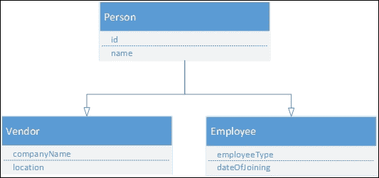

# 第二章：高级 JavaScript 概念

JavaScript 在最初设计时，并没有预料到会成为 Web 开发的核心编程语言。它通常被用来执行一些基本的客户端操作，这些操作需要对**文档对象模型**（**DOM**）元素进行一些操作。后来，随着 Web 开发的最近步伐，事情已经发生了很大的变化。现在，许多应用程序纯粹使用 JavaScript 和 HTML 来处理复杂的情况。有时，随着不同版本的出现，增加了不同的特性，根据 ECMAScript 6 的规范，你现在可以有类，可以进行继承，就像你用 C#或 Java 任何其他编程语言一样。闭包、原型函数、属性描述符等等，我们将在本章讨论的内容，使它更加强大和健壮。

在上一章中，我们学习了 JavaScript 编程的核心概念和一些基本的基本原理，以及它作为一门语言提供的特性。在本章中，我们将重点关注更高级的主题，这些主题有助于我们在大型和复杂的应用程序中使用这些概念。

我们还将重点关注作用域和提升变量、面向对象编程、原型函数、属性描述符、闭包、异常处理等。一些主题，如承诺、异步模式和**异步 JavaScript 和 XML**（**Ajax**）技术，是更广泛的主题，在其他章节中进行覆盖。

# 变量 - 作用域和提升

我们已经知道如何在 JavaScript 中使用`var`关键字声明变量。任何使用`var`关键字声明的变量都被称为提升变量，*提升*是 JavaScript 的默认行为，将声明移动到顶部。当 JavaScript 通过 JavaScript 引擎编译时，所有使用`var`关键字声明的变量都放在其作用域的顶部。这意味着如果变量在函数块内声明，它将被放在函数顶部；否则，如果它声明在任何函数之外并在脚本的根部，它将变得全局可用。让我们看看这个例子来澄清我们的理解。

假设以下代码是一个简单的程序，它返回传递给函数参数的国家名称的 GMT：

```js
function getCountryGMT(countryName) {
  if (countryName == "Pakistan") {
    var gmt = "+5.00";
  }
  else if (country == "Dubai") {
    var gmt = "+4.00";
  } else {
    return null;
  }
}
```

当 JavaScript 引擎编译脚本时，`var gmt`变量将被放在顶部：

```js
function getCountryGMT(countryName) {
  var gmt; 
  if (countryName == "Pakistan") {
    gmt = "+5.00";
  }
  else if (country == "Dubai") {
    gmt = "+4.00";
  } else {
    return null;
  }
}
```

这称为提升，其中`var`变量被放在其作用域的顶部。此外，如果您尝试在最后一个`else`条件中访问变量值，它将给出一个未定义的值，并且在每个条件块中都可能可用。

这段代码显示了另一个声明`gmt`变量全局和在代码底部声明的例子：

```js
function getCountryGMT(countryName) {
  if (countryName == "Pakistan") {
    gmt = "+5.00";
  }
  else if (country == "Dubai") {
    gmt = "+4.00";
  } else {
    return null;
  }
}

var gmt;
```

当脚本编译时，它将在代码顶部放置`gmt`的声明：

```js
var gmt;

function getCountryGMT(countryName) {
  if (countryName == "Pakistan") {
    gmt = "+5.00";
  }
  else if (country == "Dubai") {
    gmt = "+4.00";
  } else {
    return null;
  }
}
```

为了克服 ECMAScript 6 中的这种行为，引入了一个新的 `let` 关键字来声明变量，其作用域保留在定义的位置。这些变量在其作用域外不可访问。

### 提示

请注意，ECMAScript 6 不被老旧的浏览器版本支持，但 Microsoft Edge、Google Chrome 11 和 Mozilla Firefox 支持它。

## 声明 `let` 变量

与 `var` 一样，你可以用 `let` 以相同的方式声明变量。你可以在你的程序中使用这个关键字，但它将仅在其定义的作用域内可访问。所以，例如，如果某个变量在条件块内定义，它将无法在其作用域之外访问。

让我们来看以下示例，其中在条件块内部声明了一个变量，在编译后的最终输出保持不变。这在您想在一个特定逻辑或场景内声明变量的条件下非常有用。在 `else` 条件中，`gmt` 将不可访问，因为它是在 `if` 条件内定义的：

```js
function getCountryGMT(countryName) {
  if (countryName == "Pakistan") {
    let gmt = "+5.00";
  }
  else {
    return null;
  }
}
```

一旦在函数或脚本的作用域内声明了 `let` 变量，它就不能被重新声明。另外，如果使用 `var` 关键字声明变量，则不能使用 `let` 重新声明。

这段代码不会抛出异常，因为作用域不同。然而，在同一块中，它不能被重新声明：

```js
function getCountryGMT(countryName) {
  var gmt;
  if (countryName == "Pakistan") {
    let gmt = "+5.00";
  }
  else {
    return null;
  }
}
```

### 在使用 `let` 关键字时效率较高的条件

以下是使用 `let` 的条件。

#### 循环中的函数

如果在循环中的函数内部使用 `var` 变量，这些变量会产生问题。考虑以下示例，其中有一个值数组，并通过循环在每个数组的索引处插入一个函数。这将导致错误并将 `i` 变量作为引用传递。所以，如果你遍历每个索引并调用函数，将会打印出相同的值，即 `10`：

```js
var values = [];
for(var i=0;i<10;i++)
  {
    values.push(function () { console.log("value is " + i) });
  }
  values.forEach(function(valuesfunc) {
    valuesfunc();
  })
```

```js
let is as follows:
```

```js
var values = [];
  for(let i=0;i<10;i++)
  {
    values.push(function () { console.log("value is " + i) });
  }
  values.forEach(function(valuesfunc) {
    valuesfunc();
  })
```

# JavaScript 中的事件

事件在任何一个商业应用程序中扮演着重要的角色，你希望在按钮点击事件上保存记录，或者显示一些消息，或者改变某个元素的背景颜色。这些事件可以从控件级别本身定义，或者通过脚本直接注册。

让我们来看一个例子，当鼠标进入时，这个例子会改变 `div` 控件内部的 `html` 代码：

```js
<html>
  <body>
    <div id="contentPane" style="width:200px; height:200px;">
    </div>
    <script>
      var divPane = document.getElementById("contentPane");
      divPane.onmouseenter = function () {
        divPane.innerHTML = "You are inside the div";
      };
      divPane.onmouseleave = function () {
        divPane.innerHTML = "You are outside the div";
      };
    </script>
  </body>
</html>
```

前面的示例在 HTML `div` 控件的脚本侧注册了两个事件。如果鼠标进入了函数或离开了 `div` 的边界，它会改变文本。另外，我们也可以在控件本身上注册事件，这个示例展示了如何在按钮点击事件上显示一条消息。如果你注意到脚本块是在 `div` 面板之后定义的，原因是当页面加载时，它会尝试执行脚本并抛出一个错误，因为当时 `contentPane` 元素尚未创建：

```js
<html>
  <body>
    <script>
      function displayMessage() {
        alert("you have clicked button");
      }
    </script> 
    <input type="button" onclick="displayMessage();" />
  </body>
</html>
```

在这个例子中，脚本块定义在页面的顶部。在这种情况下，它可以定义在页面的任何位置，因为它只有在用户点击按钮时才会执行。

# 函数参数

我们已经知道 JavaScript 函数可以有参数。然而，在创建函数时无法指定参数的类型。JavaScript 在调用函数时既不会对参数值进行类型检查，也不会验证传递的参数数量。所以，例如，如果一个 JavaScript 函数接受两个参数，像这段代码所示，我们甚至可以不传递任何参数值，或者传递任何类型的值，或者传递比定义的预期参数数量更多的值：

```js
function execute(a, b) {
  //do something
}

//calling without parameter values
execute();

//passing numeric values
execute(1, 2);

//passing string values
execute("hello","world");

//passing more parameters
execute(1,2,3,4,5);
```

缺少的参数被设置为未定义，而如果传递了更多参数，这些参数可以通过 arguments 对象访问。arguments 对象是 JavaScript 中的一个内置对象，它包含了一个数组，该数组是在调用函数时使用的参数。我们可以像这段代码中这样使用它：

```js
function execute(a, b) {
  //do something
  alert(arguments[0]);
  alert(arguments[1]);
  alert(arguments[2]);
  alert(arguments[3]);
  alert(arguments[4]);
}

  //passing more parameters
  execute(1, 2, 3, 4, 5);
}
```

参数按值传递；这意味着如果在函数内部改变了参数的值，它将不会改变原始参数的值。

# 在 JavaScript 中的面向对象编程

所有的 JavaScript 对象都是从某个对象继承来的。JavaScript 提供了不同的模式，以便在构建应用程序时遵循**面向对象编程**（**OOP**）原则。这些模式包括构造器模式、原型模式和对象字面量表示法，以及 ECMAScript 6 中通过类和使用 `extends` 关键字继承基类来表示对象的一种完全新的方式。

在本节中，我们将了解如何使用不同的方法实现 OOP 原则。

## 创建对象

类表示对象的结构，每个类都有某些由对象使用的方法和属性，而对象是类的实例，被称为类实例。

JavaScript 是一种基于原型的语言，并且基于对象。在像 C# 和 Java 这样的类式语言中，我们必须首先定义一个包含一些方法和属性的类，然后使用其构造函数来创建对象。在 JavaScript 中，任何对象都可以作为模板来创建新对象，并使用其中定义的属性或方法。新对象也可以定义自己的属性或方法，并可以作为另一个对象的原型。然而，ECMAScript 6 在 JavaScript 中引入了类，这是对现有范式的语法糖，使开发者能够更容易地编写更简单、更干净的代码来创建对象。在下一节中，我们将看到在 JavaScript 中创建对象的不同方法。

### 使用对象字面量表示法定义对象

对象字面量是使用花括号括起来的由逗号分隔的名称值对列表。

对象字面量使用以下语法规则定义：

+   冒号将属性名与值分隔开来：

+   值可以是任何数据类型，包括数组字面量、函数和嵌套对象字面量：

+   每个名称值对之间用逗号与下一个名称值对分隔：

+   姓氏值对之后不应该包含任何逗号

以下是在对象字面量表示法中一个`person`对象的基本表示：

```js
var person = {id: "001", name: "Scott", isActive: true, 
  Age: 35 };
```

以下是用对象字面量表示法展示的`personModel`对象的另一种表示，其中包含`savePerson()`方法：

```js
var personModel = {id: "001", name: "Scott", isActive: true, 
  Age: 35, function: savePerson(){ //code to save person record } };
```

### 使用构造模式定义对象

在 JavaScript 中，可以使用函数来定义类。这段代码展示了用 JavaScript 定义客户类的一种简单方式：

```js
var person = new function(){};
```

前面的代码只是定义了一个空的类，有一个默认构造函数，没有属性和方法。可以使用 new 关键字来初始化对象，如下面的代码所示：

```js
var p1 = new person();
```

同一个函数可以用常规函数声明风格定义：

```js
function person(){};
```

使用常规函数声明，JavaScript 引擎知道在需要时获取函数。例如，如果您在脚本中在函数声明之前调用它，它会调用这个函数，而变量定义方法需要在调用它之前先声明变量。

#### 使用类关键字

ECMAScript 6 提供了一种新的定义类的方法，并引入了一个类关键字，可以像在其他编程语言中一样使用。这段代码是定义一个客户对象的表示。默认构造函数是`constructor()`，不带任何参数，可以根据需求用更多参数覆盖。每个类允许您定义只有一个构造函数，如果覆盖了构造函数，默认构造函数将不会用来实例化对象：

```js
class Person {
  constructor() { }
}
```

### 属性

属性用于存储和返回值。我们可以在初始化函数时定义属性，每次创建对象时这些属性都将可用。

#### 使用对象字面量表示法定义属性

属性可以在对象中定义为字面量字符串。例如，在这段代码中，有一个包含两个属性和一个方法的客户对象。这种方法的缺点是没有构造函数，我们无法限制用户在初始化对象时提供属性值。它可以设置为硬编码，如所示，或者在初始化对象后：

```js
var person = {
  id: "001",
  name:"Person 1",
  savePerson: function(){
  }

}
```

#### 使用构造模式定义属性

构造函数模式允许您定义参数，限制用户在实例化对象时传递属性值。考虑这个例子，它包含一个具有`id`和`name`两个属性的客户对象：

```js
var person = function(id, name){
  this._id = id;
  this._name = name;
}
```

`this`关键字指的是当前对象，在类内部调用时可以使用`this`来访问属性，或者通过实例变量，如下面的代码所示：

```js
var p1 = new person("001","Person 1");
console.log("Person ID: "+ p1.PersonID);
console.log("Person Name: "+ p1.name);
```

属性值也可以在初始化对象后设置，如下面的代码所示：

```js
var person = function(){
}
var p1 = new person();
p1.id="001";
p1.name="Person 1";
```

这段代码也代表了定义一个接受两个参数的人对象的相同方法。在下一节中，当我们处理原型时，我们将看到这种方法的局限性：

```js
function person(id, name){
  this.id = id;
  this.name = name;
  this.logToConsole: function(){
    console.log("Person ID is "+ this.id  +",Name: "+ this.name);
  };
}
```

#### 使用 setter/getter 在 ECMAScript 6 中定义属性

在 ECMAScript 6 中，有一种新的定义属性的方法，它遵循其他编程语言的标准方式：

```js
class Person {
  constructor(id, name) {
    this.id = id;
    this.name = name;
  }
}
var p1 = new person("001", "Person 1");
console.log ("Person ID: " + p1.id);
```

与这种方法不同，我们也可以使用`set`和`get`关键字定义 setter 和 getter。在 JavaScript 中定义类时，构造函数是可选的；如果没有定义构造函数，对象初始化时会调用默认构造函数`constructor()`。让我们看一个包含`personName`属性的例子，该属性用于 setter 和 getter：

```js
class Person {
  set Name(name) {
    this.personName = name;
  }
  get Name() {
    return this.personName;
  }
}
var p1 = new Person();
p1.Name = "Person 1";
console.log("personName " + p1.Name);
```

#### JavaScript 属性描述符

每个属性都有属性描述符，用于配置，其含义如下：

+   **Writable**：这个特性用于设置代码为只读或可写。`false`关键字使其只读，值不能被修改。

+   **Enumerable**：这个特性用于隐藏/显示属性，使其可访问或可序列化。将此属性设置为`false`，在遍历对象成员时不会显示属性，并且在使用`JSON.stringify`时也不会被序列化。

+   **Configurable**：这个特性用于`on`和`off`的配置更改。例如，将此属性设置为`false`将防止属性被修改或删除。

所有这些特性默认都是`true`，但可以被覆盖，如下例所示。这个例子有一个`car`对象，包含两个属性，分别是`name`和`color`：

```js
var car = {
  name: "BMW",
  color: "black"
};
```

##### 显示属性描述符

你可以使用以下语句显示现有属性：

```js
display(Object.getOwnPropertyDescriptor(car, 'name'));
```

##### 管理属性描述符

任何对象的属性都可以像以下代码那样进行管理：

```js
Object.defineProperty(car, 'color',{enumerable: false});
Object.defineProperty(car, 'color',{configurable: false});
Object.defineProperty(car, 'color',{writable: false});
```

##### 使用 getter 和 setter

通过`Object.defineProperty`，我们还可以为属性添加 setter 和 getter。这个例子通过连接`make`和`name`并分割`name`来添加汽车的完整名称，然后通过两个不同的属性获取模型和名称：

```js
var car = { name: { make: "honda",  brand: "accord"} };
Object.defineProperty(car, 'fullname', 
{
  get: function(){
    return this.name.make + ' ' + this.name.brand 
  },
  set: function (value) {
    var names= value.split(' ');
    this.name.make = names[0];
    this.name.brand = names[1];
  }
});
car.fullname = "Honda Accord";
display(car.fullname);
```

### 方法

方法是可以在对象上执行的动作。在 JavaScript 中，它可以表示为一个包含函数定义的属性。让我们看看定义 JavaScript 对象方法的不同方法。

#### 通过对象字面量表示法定义方法

以下是一个示例，展示了对象字面量表示法中定义的`logToConsole()`方法：

```js
var person = {
  id: "001",
  name:"Person 1",
  logToConsole: function()
  {
    console.log("Person ID is "+ this.id  +", Customer Name: "+ this.name);
  }
}
```

#### 使用构造函数函数定义对象

通过`constructor`函数定义方法的代码如下：

```js
var person = function (id, name) {
  this._id = id;
  this._name = name;
  this.LogToConsole= function(){
    console.log("Person Name is "+ this._name);
  }
}
var p1 = new person("001", "Person 1");
p1.LogToConsole();
```

另一种方法是声明`constructor`函数，如下所示：

```js
function person(id, name) {
  this._id = id;
  this._name = name;
  this.LogToConsole= function(){
    console.log("Name is "+ this._name);
  }
}
var p1 = new person("001","Person 1");
p1.LogToConsole();
```

在 ECMAScript 6 中，定义方法的语法更为优雅。以下是一个示例代码片段：

```js
class Person {

  constructor() {

  }

  set Name(name) {
    this._name = name;
  }

  get Name() {
    return this._name;
  }

  logToConsole() {
    console.log("Person Name is " + Name);
  }
}

var p1 = new Person();
p1.Name = "Person 1";
p1.logToConsole();
```

定义方法时不需要指定方法返回类型，它基于方法体实现。

### 扩展属性和方法

每个 JavaScript 对象都有一个称为原型的对象。原型是指向另一个对象的指针。这个原型可以用来扩展对象属性和方法。例如，如果你尝试访问一个对象的某个未定义属性，它会查看原型对象并通过原型链继续查找，直到找到或者返回 undefined。因此，无论使用字面量语法方法还是构造函数方法创建对象，它都会从称为`Object.prototype`的原型继承所有方法和属性。

例如，使用`new Date()`创建的对象从`Date.prototype`继承，依此类推。然而，基本对象本身没有原型。

我们可以很容易地向对象添加属性和函数，如下所示：

```js
var Person = function (name) {
  this.name = name;
}
var p1 = new Person("Person 1");
p1.phoneNo = "0021002010";
alert(p1.name);
```

不初始化对象而扩展现有函数是通过原型对象完成的。让我们来看这个例子，我们在`Person`函数上添加了一个方法`logToConsole()`和一个`phoneNo`属性：

```js
var Person = function (name) {
  this.name = name;
}
Person.prototype.phoneNo = "";
Person.prototype.logToConsole = function () {
  alert("Person Name is " + this.name +" and phone No is "+ this.phoneNo)
};
var p1 = new person("Person 1");
p1.phoneNo = "XXX"
p1.logToConsole();
```

### 私有和公共成员

在 JavaScript 中，没有像我们在 C#中那样的访问修饰符。所有定义为`this`或具有原型的一切成员都可以从实例中访问，而其他以某种其他方式定义的成员是不可访问的。

让我们来看这个例子，它只允许`y`和`y1()`方法在函数外部被访问：

```js
function a() {
  var x = 1;
  this.y = 2;
  x1 = function () {
    console.log("this is privately accessible");
  }
  this.y1 = function () {
    console.log("this is publicly accessible");
  }
}
```

### 继承

继承是面向对象编程的核心原则。在 JavaScript 中，如果你使用的是不遵守 ES6 标准的旧版本，它是通过基于原型的编程来实现的。

基于原型的编程是一种不使用类，而是通过原型链来扩展对象或继承的面向对象编程模型。这意味着每个对象都有一个内部的`prototype`属性，它指向一个特定的对象，如果没有使用则为 null。这个属性不能通过程序访问，并且对 JavaScript 引擎来说是`private`的。所以，例如，如果你调用某个属性，比如`customer.getName`，它会首先在对象本身上查找`getName`属性，否则通过原型属性链接对象来查找。如果没有定义属性，它会返回 undefined。

考虑以下**实体-关系模型**（**ERD**），它有一个具有某些通用属性的基本 person 对象和两个子对象，分别是**Vendor**和**Employee**，具有特定的属性：



为了用 JavaScript 构造函数方法表达相同的继承，我们可以像这段代码一样，将`Vendor`和`Employee`的`prototype`属性添加到 person 对象上：

```js
var Person = function (id, name) {
  this.id = id;
  this.name = name;
}

var Vendor = function (companyName, location) {
  this.companyName = companyName;
  this.location = location;
}

var Employee = function (employeeType, dateOfJoining) {
  this.employeeType = employeeType;
  this.dateOfJoining = dateOfJoining;
}

Vendor.prototype = new Person("001", "John");
Employee.prototype = new Person("002", "Steve");

var vendorObj = new Vendor("ABC", "US");
alert(vendorObj.id);
```

在前一个示例中，`vendorObj`是从`Vendor`构造函数创建的对象。`Vendor`构造函数既是对象又是函数，因为函数在 JavaScript 中是对象，而`vendorObj`对象可以有自己的属性和方法。它还可以从`Vendor`对象继承方法和属性。

通过构造函数将`Vendor`和`Employee`对象的`prototype`属性设置为`Person`实例，它继承了`Person`对象的属性和方法，并成为`Vendor`和`Employee`对象可访问的。

使用`prototype`对象定义的对象属性和方法被所有引用它的实例所继承。因此，在我们的例子中，我们通过`prototype`属性扩展了`Vendor`和`Employee`对象并将它们分配给`Person`实例。这样，无论何时创建`Vendor`或`Employee`对象的任何实例，它都可以访问`Person`对象的属性和方法。

还可以通过对象添加属性和方法；例如，我们可以向`Vendor`对象添加一个属性，如下面的代码所示，但这将变成静态属性，`Vendor`实例无法访问：

```js
Vendor.id="001";
```

另一方面，我们也可以向`Vendor`实例添加属性和方法，但这将仅对该特定实例可用：

```js
var vendorObj = new Vendor("ABC", "US");
vendorObj.id="001";
```

实现继承的另一种技术是通过将父对象的`prototype`分配给子对象的`prototype`对象，如下所示：

```js
Vendor.prototype = Person.prototype; 
```

使用这种技术，在`Person`原型中添加的任何方法或属性都将可通过`Vendor`对象访问：

```js
var Person = function (id, name) {
  this.id = id;
  this.name = name;
}

//Adding method to the Person's prototype to show message
Person.prototype.showMessage = function (message) {
  alert(message);
}

var Vendor = function (companyName, location) {
  this.companyName = companyName;
  this.location = location;
}

//Assigning the parent's prototype to child's prototype
Vendor.prototype = Person.prototype;
var vendorObj = new Vendor("XYZ", "Dubai");
vendorObj.showMessage(vendorObj instanceof Person);
```

运行此脚本后，它将在警告消息中显示`true`。这是因为`Vendor`对象成为`Person`对象的实例，并且在任何对象中添加的任何方法或属性都可以被两个对象访问。

如果我们修改前面的示例，在将`Person`原型分配给`Vendor`原型之后，通过`Vendor`原型属性添加另一个方法，它将可通过`Person`对象访问。这是因为，在 JavaScript 中，当子对象的原型被设置为父对象的原型时，在分配后添加到任一对象中的任何方法或属性都将可通过两个对象访问。

让我们在`Vendor`对象中通过`prototype`属性添加一个`showConsoleMessage()`方法，并通过`Person`实例访问它，如这段代码所示：

```js
var Person = function (id, name) {
  this.id = id;
  this.name = name;
}

//Adding method to the Person's prototype to show message
Person.prototype.showMessage = function (message) {
  alert(message);
}

var Vendor = function (companyName, location) {
  this.companyName = companyName;
  this.location = location;
}

//Assigning the parent's prototype to child's prototype
Vendor.prototype = Person.prototype;

//Adding method to the Vendor's prototype to show at console
Vendor.prototype.showConsoleMessage = function (message) {
  console.log(message);
}

var personObj = new Person("001", "John");
//Person object access the child's object method
personObj.showConsoleMessage("Console");
```

#### JavaScript 中的构造函数链

在前面的例子中，我们看到了如何继承对象。然而，如果某个基对象有一些重载构造函数，接受属性将需要一些额外的努力。JavaScript 中的每个函数都有一个`call`方法，用于将构造函数链接到对象。我们可以使用`call`方法来链接构造函数并调用基构造函数。因为`Person`对象接受两个参数，我们将修改`Vendor`函数和两个属性`id`和`number`，在创建`Vendor`对象时可以传递这些属性。所以，无论何时创建`Vendor`对象，都会创建`Person`对象并填充值：

```js
var Person = function (id, name) {
  this.id = id;
  this.name = name;
}

var Vendor = function (companyName, location, id, name) {
  this.companyName = companyName;
  this.location = location;
  Person.call(this, id, name);
}

var employee = function (employeeType, dateOfJoining, id, name) {
  this.employeeType = employeeType;
  this.dateOfJoining = dateOfJoining;
  Person.call(this, id, name);
}

Vendor.prototype = Person.prototype;
Employee.prototype = Person.prototype;

var vendorObj = new Vendor("ABC", "US", "V-01","Vendor 1");
alert(vendorObj.name);
```

#### 使用`Object.create()`继承

使用 ECMAScript 5，你可以通过`Object.create()`方法轻松地继承你的基对象。这个方法接受两个参数，一个作为原型的对象和一个包含新对象应具有的属性和方法的对象。`Object.create()`方法改进了基于构造函数的继承。它是一个创建对象而不必通过其构造函数的好方法。让我们看看使用`Object.create()`方法的`Vendor`和`Employee`继承`Person`对象的示例：

```js
var Person = function (id, name) {
  this.id = id;
  this.name = name;
}

var Vendor = function (companyName, location, id, name) {
  this.companyName = companyName;
  this.location = location;
  Person.call(this, id, name);
}

var Employee = function (employeeType, dateOfJoining, id, name) {
  this.employeeType = employeeType;
  this.dateOfJoining = dateOfJoining;
  Person.call(this, id, name);
}

Vendor.prototype = Object.create(Person.prototype);
Employee.prototype = Object.create(Person.prototype);

var vendorObj = new Vendor("ABC", "US", "V-01", "Vendor 1");
alert(vendorObj.name);
```

在前面的例子中，我们使用了`Object.create()`来继承`Person`对象到`Vendor`和`Employee`对象。无论何时创建`Vendor`或`Employee`实例，它们都可以访问`Person`对象的属性。`Object.create()`方法自动实例化其在`call`方法中定义的参数的对象实例。

#### `Object.create()`的预定义属性

`Object.create()`方法不会执行`Person`函数；相反，它只是将`Person`函数设置为客户函数的原型。下面代码中展示了客户对象的另一种表示形式，包含一个名为`CustomerCode`的属性：

```js
var customerObj = Object.create(Object.prototype, {
  customerCode: {
    value: "001",
    enumerable: true,
    writable: true,
    configurable: true
  }
});
alert("" + customerObj.customerCode);
```

在这里，value 代表实际的用户代码值，而`enumerable`、`writable`和`configurable`是预定义的属性。

#### 使用类定义继承

在前面的章节示例中，我们已经看到了如何使用 ECMAScript 6 定义类。就像 Java 一样，我们可以使用`extends`关键字来继承一个父类。

使用`extends`的一个示例在这里展示：

```js
class Person {

  constructor(id, name) {
    this._id = id;
    this._name = name;
  }

  get GetID() {return this._id;}
  get GetName() {return this._name;}
}

class Vendor extends Person {
  constructor(phoneNo, location, id, name){
    super(id, name);
    this._phoneNo = phoneNo;
    this._location = location;

  }
  logToConsole() {
    alert("Person ID is " + this.GetID);
  }
}

var vendorObj = new Vendor("XXX", "US", "V-01", "Vendor 1");
vendorObj.logToConsole();
```

有了 ECMAScript 6，你可以真正领略到在类中声明静态变量和方法的精髓。让我们看看下面的例子，其中包含一个静态方法`logToConsole()`，并且从继承`Person`类的客户类中调用它，而无需在继承后初始化其对象：

```js
class Person {
  static logToConsole() {
    console.log("Hello developers!");
  }
}

class Vendor extends Person {
}

Vendor.logToConsole();
```

### 封装

在上面的例子中，`Vendor`对象不需要知道`Person`类中`logToConsole()`方法的实现，并可以使用该方法。除非有特定的原因需要覆盖，否则`Vendor`类不需要定义这个方法。这称为封装，其中`Vendor`对象不需要知道`logToConsole()`方法的实际实现，每个`Vendor`对象都可以使用这个方法来记录到控制台。就是这样通过封装来完成的，每个类都被封装成一个单一的单元。

### 抽象

抽象用于隐藏与对象相关的所有信息，除了数据，以减少复杂性并提高效率。这是面向对象编程的核心原则之一。

在 JavaScript 中，没有内置的对抽象的支持，并且它不提供如接口或抽象类之类的类型来创建接口或抽象类以实现抽象。然而，通过某些模式，你可以实现抽象，但这种模式仍然不限制并确保所有抽象方法都被具体类或函数完全实现。

让我们来看一下下面的例子，其中我们有一个`person`控制器，它接受一个具体对象作为参数，然后调用其具体的实现：

```js
var person = function (id, name) {
  this._id = id;
  this._name = name;
  this.showMessage = function () { };
}
var vendor = function (companyName, location, id, name) {
  this._companyName = companyName;
  this._location = location;
  person.call(this, id, name);
  this.showMessage = function () {
    alert("this is Vendor");
  }
}
var employee = function (employeeType, dateOfJoining, id, name) {
  this._employeeType = employeeType;
  this._dateOfJoining = dateOfJoining;
  person.call(this, id, name);
  this.showMessage = function () {
    alert("this is Employee");
  }
}
vendor.prototype = Object.create(person.prototype);
employee.prototype = Object.create(person.prototype);
var personController = function (person) {
  this.personObj = person;
  this.showMessage = function () {
    this.personObj.showMessage();
  }
}

var v1 = new vendor("ABC", "USA", "V-01", "Vendor 1");
var p1 = new personController(v1);
p1.showMessage();
```

另外，借助 ECMAScript 6，我们可以实现同样的场景，如下面的代码所示：

```js
class person {
  constructor(id, name) {
    this._id = id;
    this._name = name;
  }
  showMessage() { };
}
class vendor extends person {
  constructor(companyName, location, id, name) {
    super(id, name);
    this._companyName = companyName;
    this._location = location;

  }
  showMessage() {
    alert("this is Vendor");
  }
}
class employee extends person {
  constructor(employeeType, dateOfJoining, id, name) {
    super(id, name);
    this._employeeType = employeeType;
    this._dateOfJoining = dateOfJoining;
  }
  showMessage() {
    alert("this is Employee");
  }
}
class personController {
  constructor(person) {
    this.personObj = person;
  }
  showMessage() {
    this.personObj.showMessage();
  }
}

var v1 = new vendor("ABC", "USA", "V-01", "Vendor 1");
var p1 = new personController(v1);
p1.showMessage();
```

### new.target

`new.target`属性用于检测函数或类是否使用`new`关键字调用。如果调用，它将返回对函数或类的引用，否则为`null`。考虑上面例子中的例子，我们可以通过使用`new.target`来限制创建`person`的`call`对象：

```js
class person {
  constructor(id, name) {
    if(new.target === person){
      throw new TypeError("Cannot create an instance of Person class as its abstract in nature");
    }
    this._id = id;
    this._name = name;
  }

  showMessage() { };
}
```

### 命名空间

ECMAScript 6 通过模块引入了命名空间，并使用`export`和`import`关键字，但它们仍然处于草案阶段，到目前为止没有实现。

然而，在早期版本中，可以通过局部对象来模拟命名空间。例如，下面是定义一个表示命名空间的局部对象的语法，我们可以在其中添加函数和对象：

```js
var BusinessLayer = BusinessLayer || {};
```

我们可以在上面显示的代码中添加函数：

```js
BusinessLayer.PersonManager = function(){
};
```

此外，还可以定义更多嵌套的命名空间层次，如下面的代码所示：

```js
var BusinessLayer = BusinessLayer || {};
var BusinessLayer.Managers = BusinessLayer.Managers || {};
```

## 异常处理

JavaScript 正在成为开发大型应用程序的强大平台，异常处理在处理程序中的异常和按需传播它们方面发挥着重要作用。就像 C#或其他任何编程语言一样，JavaScript 提供了`try`、`catch`和`finally`关键字来注解用于错误处理的代码。JavaScript 提供了使用嵌套的`try catch`语句和条件在`catch`块中处理不同条件的相同方式。

当一个异常发生时，会创建一个代表所抛出错误的对象。就像 C#一样，我们有不同类型的异常，如`InvalidOperationException`、`ArgumentException`、`NullException`和`Exception`。JavaScript 提供六种错误类型，如下所示：

+   `Error`

+   `RangeError`

+   `ReferenceError`

+   `SyntaxError`

+   `TypeError`

+   `URIError`

### `Error`

`Error`对象代表通用异常，主要用于返回用户定义的异常。一个`Error`对象包含两个属性，分别是 name 和 message。Name 返回错误类型，message 返回实际错误信息。我们可以抛出错误异常，如下所示：

```js
try{ }catch{throw new Error("Some error occurred");}
```

### `RangeError`

如果任何数字的范围被超出，将抛出`RangeError`异常。例如，创建一个负长度的数组将抛出`RangeError`：

```js
var arr= new Array(-1);
```

### `ReferenceError`

`ReferenceError`异常发生在访问一个不存在的对象或变量时；例如，以下代码将抛出一个`ReferenceError`异常：

```js
function doWork(){
  arr[0]=1;
}
```

### `SyntaxError`

正如名称所示，如果 JavaScript 代码中存在任何语法问题，就会抛出`SyntaxError`。所以，如果有些闭合括号缺失，循环结构不正确，等等，这都将归类为`SyntaxError`。

### 类型错误

当一个值不是期望的类型时，会发生`TypeError`异常。以下代码抛出一个`TypeError`异常，因为对象试图调用一个不存在的函数：

```js
var person ={};
person.saveRecord();
```

### URIError

当`encodeURI()`和`decodeURI()`中指定了一个无效的 URI 时，会发生`URIError`异常。以下代码抛出此错误：

```js
encodeURIComponent("-");
```

## 闭包

闭包是 JavaScript 最强大的特性之一。闭包提供了一种暴露位于其他函数体内内部函数的方式。当一个内部函数被暴露在包含它的函数外部，并且在外部函数执行后可以执行，并且可以使用外部函数调用时的相同局部变量、参数和函数声明时，一个函数可以被称为闭包。

让我们来看一下以下示例：

```js
function Incrementor() {
  var x = 0;
  return function () {
    x++;
    console.log(x);
  }
}

var inc= Incrementor();
inc();
inc();
inc();
```

这是一个简单的闭包示例，其中`inc()`成为引用内部函数的闭包，该内部函数增加外层函数中定义的`x`变量。`x`变量将在每次调用时增加，最后调用的值为`3`。

闭包是一种特殊类型的对象，它将函数和函数创建的环境结合起来。所以，多次调用它将使用相同的环境，以及在之前调用中更新的值。

让我们来看另一个示例，其中有一个表格生成函数，它接受一个表格号并返回一个函数，该函数可用于获取任何数字与提供的表格号相乘的结果：

```js
function tableGen(number) {
  var x = number;
  return function (multiplier) {
    var res = x * multiplier;
    console.log(x +" * "+ multiplier +" = "+ res);
  }
}

var twotable = tableGen(2);
var threetable = tableGen(3);

twotable(5);
threetable(6);
```

调用`twotable()`和`threetable()`方法后的结果值将是`10`和`18`。这是因为`twoTable()`函数对象是通过将`2`作为参数传递给`tableGen()`函数进行初始化的。当通过`twoTable()`和`threetable()`方法调用执行时，这个`tableGen()`函数将传递的参数值存储在`x`变量中，并将其与第二次调用传递的变量相乘。

因此，`twoTable(5)`函数调用的输出将是`10`，如下所示：


第二条语句`threeTable(6)`的输出将是`18`，如下所示：


### 实际使用

我们已经了解了闭包是什么以及我们如何实现它们。然而，让我们考虑它们的实际影响。闭包让你可以将某些环境与在那种环境或数据中操作的函数相关联。

在 JavaScript 中，函数大多在发生任何事件或用户执行任何操作时执行。让我们看看以下闭包在`console`和`dialog`窗口上实际使用示例，以记录消息：

```js
<body>
  <input type="text" id="txtMessage" />
  <button id="consoleLogger"> Log to Console </button>
  <button id="dialogLogger">Log to Dialog </button>
  <script>

    function getLogger(loggerType) {
      return function () {
        var message = document.getElementById("txtMessage").value;
        if (loggerType == "console")
        console.log(message);
        else if (loggerType == "dialog")
        alert(message);
      }
    }
    var consoleLogger = getLogger("console");
    var dialogLogger = getLogger("dialog");
    document.getElementById("consoleLogger").onclick = consoleLogger;
    document.getElementById("dialogLogger").onclick = dialogLogger;
  </script>
</body>
```

在前面的示例中，我们有两个日志闭包：一个记录到控制台，另一个记录到弹出对话窗口。我们可以初始化这些闭包，并在程序中使用它们来记录消息。

## JavaScript 类型数组

客户端开发在 JavaScript 已经成为一个强大的平台，并且有一些 API 和库可供使用，允许你与媒体文件、Web 套接字等进行交互，并在二进制中处理数据。当处理二进制数据时，需要将其保存在其特定的格式中。这时就轮到类型数组发挥作用了，它允许开发者在原始二进制格式中操纵数据。

### 类型数组架构

类型数组将数据分为两部分，即缓冲区和视图。缓冲区包含二进制中的实际数据，但没有视图无法访问。视图提供了有关缓冲区的实际元数据信息和上下文，例如数据类型、起始偏移量和元素数量。

#### 数组缓冲区

数组缓冲区是一种用于表示二进制数据的数据类型。在它被分配给一个视图之前，其内容无法被操纵。视图以特定格式表示缓冲区，并对数据执行操作。

有不同类型的类型数组视图，如下所示：

| 类型 | 字节大小 | 描述 |
| --- | --- | --- |
| `Int8Array` | 1 | 这是一个 8 位有符号整数数组。 |
| `UInt8Array` | 1 | 这是一个 8 位无符号整数数组。 |
| `Int16Array` | 2 | 这是一个 16 位有符号整数数组。 |
| `UInt16Array` | 2 | 这是一个 16 位无符号整数数组。 |
| `Int32Array` | 4 | 这是一个 32 位有符号整数数组。 |
| `UInt32Array` | 4 | 这是一个 32 位无符号整数数组。 |
| `Float32Array` | 4 | 这是一个 32 位 IEEE 浮点数数组。 |
| `Float64Array` | 8 | 此数组是 64 位的 IEEE 浮点数。 |
| `UInt8ClampedArray` | 1 | 此数组是 8 位无符号整数（夹紧）。 |

接下来，让我们通过一个示例来看看我们如何通过视图在缓冲区中存储数据并操作它。

#### 创建缓冲区

首先，我们需要创建一个缓冲区，如下面的代码所示：

```js
var buffer = new ArrayBuffer(32);
```

上述声明分配了 32 字节的内存。现在我们可以使用任意一种类型数组视图来操作它：

```js
var int32View= new Int32Array(buffer);
```

最后，我们可以像这样访问字段：

```js
for(var i=0;i< int32View.length; i++){
  int32View[i] = i;
}
```

这段代码将在视图中进行八个条目的操作，从`0`到`7`。输出将如下所示：

```js
0 1 2 3 4 5 6 7
```

同一个缓冲区也可以使用其他视图类型进行操作。例如，如果我们想要用一个 16 位数组视图读取已填充的缓冲区，结果将像这样：

```js
var Int16View =new Int16Array(buffer);
for(var i=0;i< int16View.length;i++){
  console.log(int16View[0]);
}
```

输出将如下所示：

```js
0 0 1 0 2 0 3 0 4 0 5 0 6 0 7 0
```

这就是我们如何可以轻松地使用多种不同类型的视图来操作单个缓冲区数据，并与包含多种数据类型的数据对象交互。

## 映射、集合、弱映射和弱集合

映射（Maps）、弱映射（weak maps）、集合（sets）和弱集合（weak sets）都是代表集合的对象。映射是键值对的键 ed 集合，而集合存储任何类型的唯一值。我们将在接下来的章节中讨论它们每一个。

### 映射和弱映射

`Map`对象提供了一个简单的键/值映射，并且根据插入的顺序进行迭代。首先插入的值将被首先检索。弱映射是不可枚举的，仅保存对象类型。在弱映射中不允许有原始类型，每个键代表一个对象。让我们看看以下使用映射作为货币的示例：

```js
var currencies = new Map();
currencies.set("US", "US Dollar");
currencies.set("UK", "British Pound");
currencies.set("CA", "Canadian Dollar");
currencies.set("PK", "Rupee");
currencies.set("UAE", "Dirham");
for (var currency of currencies) {
  console.log(currency[0] + " currency is " + currency[1]);
}
```

`Map`对象上可用的其他属性和方法如下所示：

```js
currencies.get("UAE"); // returns dirham
currencies.size; // returns 5 
currencies.has("PK") // returns true if found 
currencies.delete("CA") // delete Canada from the list
```

弱映射（weak maps）中保存的是对象，其键被表示为弱键（weak keys）。这是因为如果一个弱映射值中存储的对象没有被引用，并且在垃圾回收（garbage collection）时被回收，那么这个键就会变成弱键。它通常被用来存储对象的私有数据或者隐藏实现细节。

在上一节中，我们了解到实例级别和原型级别上暴露的都是公共的（public）。下面是一个实际例子，包含了一个用于验证来自 Twitter 账户用户的函数：对于**开放认证**（**OAuth**），Twitter 需要两个密钥：消费者 API 密钥和一个密钥秘密。我们不想暴露这些信息并让用户更改。因此，我们使用弱映射来保存这些信息，然后在`prototype`函数中检索它来验证用户：

```js
var authenticatorsecrets = new WeakMap();

function TwitterAuthenticator() {
  const loginSecret = {
    apikey: 'testtwitterapikey',
    secretkey: 'testtwittersecretkey'
  };
  authenticatorsecrets.set(this, loginSecret);
}

TwitterAuthenticator.prototype.Authenticate = function () {
  const loginSecretVal = authenticatorsecrets(this);
  //to do authenticate with twitter
};
```

### 集合和弱集合

集合是值的集合，每个值应该是唯一的。所以，例如，如果你在任何索引上已经有了一个值`1`，已经定义，你不能将它插入到同一个集合实例中。

集合是无类型的，你可以放入任何数据，不考虑任何数据类型：

```js
var set = new Set();
set.add(1);
set.add("Hello World");
set.add(3.4);
set.add(new Date());
```

另一方面，弱集合是独特对象的集合，而不是任意类型的任意值。就像弱映射一样，如果没有其他对存储的对象的引用，它将被处置并回收。与弱映射类似，它们是不可枚举的：

```js
var no = { id: 1 };
var abc = { alphabets: ['a', 'b', 'c'] };

var x = new WeakSet();
x.add(no);
x.add(abc);
```

### 严格模式

`strict`模式是 ECMAScript 5 中引入的字面表达式。它用于编写安全的 JavaScript，并在脚本中出现任何小错误时抛出错误，而不会忽视它们。其次，它的运行速度比普通 JavaScript 代码快，因为它有时会修复错误，这有助于 JavaScript 引擎进行优化，使您的代码运行得更快。

我们可以在全局脚本级别或函数级别调用`strict`模式：

```js
"use strict;"
```

例如，在以下代码中，它会抛出错误，因为`x`变量未定义：

```js
"use strict";
x=100;
function execute(){
  "use strict;"
  x=100;
}
```

对于较大的应用程序，使用`strict`模式是一个更好的选择，如果缺少或不定义某些内容，它会抛出错误。以下表格显示了使用`strict`模式会导致错误的一些场景：

| Code | Error 原因 |
| --- | --- |
| `x=100;` | 这段代码中变量未声明。 |
| `x= {id:1, name:'ABC'};` | 这段代码中对象变量未声明。 |
| `function(x,x){}` | 在此代码中参数名称重复导致了错误。 |
| `var x = 0001` | 这段代码中使用了八进制数字字面量。 |
| `var x=\0001` | 转义是不允许的，因此发生了错误。 |
| `var x = {get val() {return 'A'}};` `x.val = 'B'` | 在此代码中，向`get`值写入导致了错误。 |
| `delete obj.prototype;` | 删除对象原型是不允许的，因此发生了错误。 |
| `var x= 2;` `delete x;` | 删除变量是不允许的，因此发生了错误。 |

此外，还有一些保留关键字，如`arguments`、`eval`、`implements`、`interface`、`let`、`package`、`private`、`protected`、`public`、`static`和`yield`，也是不允许的。

# 总结

在本章中，我们学习了 JavaScript 的一些高级概念，如提升的变量及其作用域、属性描述符、面向对象编程、闭包、类型数组以存储数据类型，以及异常处理。在下一章中，我们将学习最广泛使用的库 jQuery，以非常简单和容易的方式进行 DOM 遍历和操作、事件处理等。
