# 第三章：使用 jQuery 在 ASP.NET 中

我们将从这个章节开始，先对 jQuery 作一个简短的介绍。jQuery 是一个 JavaScript 库，旨在通过编写更少的代码来提供更好的开发体验和更快的编程体验，与纯 JavaScript 相比，它可以更快地执行复杂操作。然而，当编写特定原因的自定义脚本时，JavaScript 仍然存在。因此，jQuery 可以帮助你进行 DOM 操作，根据类、元素名称等选择元素，并提供一个更好的事件处理模型，使开发者在他们的日常项目中使用更为简单。

与 JavaScript 相比，另一个优点是跨浏览器问题。它提供了跨浏览器的 consistent behavior。另一方面，每个浏览器对 JavaScript 的实现都不一样。此外，为了在 JavaScript 中处理跨浏览器问题，开发者倾向于编写一些条件逻辑来检查 JavaScript 正在运行的浏览器版本并相应地处理；而 jQuery 处理了浏览器的所有重活，并提供了 consistent behavior。

在本章中，我们将讨论 jQuery 的一些强大功能，如下：

+   使用选择器

+   操作 DOM 元素

+   处理事件

# 开始使用 jQuery

jQuery 库可以从[`jquery.com`](http://jquery.com)下载。jQuery 的最新版本是 3.0.0，如果你目标是现代浏览器，例如，IE 9 和 Microsoft Edge 支持这个版本，你可以使用这个库。对于较旧版本—例如，IE 6-8—你可以下载 jQuery 1.x。

一旦 jQuery 被下载，你可以将其添加到你的项目中并引用，如下所示：

```js
<head>
  <script src="img/jquery.js"></script>
</head>
<body>
</body>
```

## 使用内容交付网络

Instead of loading jQuery from your server, we can also load it from some other server, such as the Microsoft server or Google server. These servers are called the **content delivery network** (**CDN**) and they can be referenced as shown here:

+   引用微软 CDN：

    ```js
    <script src="img/jquery-2.0.js">
    </script>
    ```

+   引用谷歌 CDN：

    ```js
    <script src="img/jquery.min.js"></script>
    ```

### 使用 CDN

实际上，这些 CDN 非常普遍，大多数网站已经在使用它们。当运行任何引用 CDN 的应用程序时，有可能其他网站也使用了微软或谷歌的同一个 CDN，相同的文件可能会在客户端缓存。这提高了页面渲染性能。另外，再次从本地服务器下载 jQuery 库时，使用的是 CDN 的缓存版本。而且，微软和谷歌提供了不同地区的服务器，用户在使用 CDN 时也能获得一些速度上的好处。

然而，有时 CDN 可能会宕机，在这种情况下，你可能需要参考并从你自己的服务器下载脚本。为了处理这种场景，我们可以指定回退 URL，它检测是否已经从 CDN 下载；否则，它从本地服务器下载。我们可以使用以下脚本来指定回退：

```js
<script src="img/jquery.min.js"></script>

<script>if (!window.jQuery) { document.write('<script src="img/jquery"><\/script>'); }
</script>
```

`window.jQuery` 实例告诉我们 jQuery 是否已加载；否则，它在 DOM 上写入脚本，指向本地服务器。

或者，在 ASP.NET Core 中，我们可以使用 `asp-fallback-src` 属性来指定回退 URL。ASP.NET Core 1.0 提供了一系列广泛的标签助手。与 HTML 助手相比，这些助手可以通过向页面元素添加 HTML 属性来使用，并为开发者提供与编写前端代码相同的体验。

在 ASP.NET 中可以用一种简单的方式编写代码来处理回退场景：

```js
<script src="img/jquery-2.1.4.min.js"
  asp-fallback-src="img/jquery.min.js"
  asp-fallback-test="window.jQuery">
</script>
```

在 ASP.NET Core 中，还有一个标签助手 `<environment>`，可以用来根据 `launchSettings.json` 文件中设置的当前环境加载脚本：

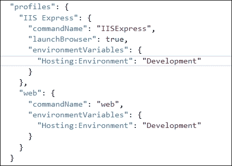

根据项目配置文件中设置的当前环境，我们可以加载脚本来满足调试和生产场景的需求。例如，在生产环境中，最好指定 JavaScript 库的压缩版本，因为它移除了所有空白字符并将变量重命名为更紧凑的尺寸，以便快速加载。然而，就开发体验而言，标准的非压缩版本对于调试目的来说要好得多。因此，我们可以使用以下代码所示的环境标签助手，在开发应用程序时加载生产环境和标准版本：

```js
<environment names="Development">
  <script src="img/jquery.js"></script>
  <script src="img/bootstrap.js"></script>
  <script src="img/site.js" asp-append-version="true"></script>
</environment>
<environment names="Staging,Production">
  <script src="img/jquery-2.1.4.min.js"
    asp-fallback-src="img/jquery.min.js"
    asp-fallback-test="window.jQuery">
  </script>
  <script src="img/bootstrap.min.js"
    asp-fallback-src="img/bootstrap.min.js"
    asp-fallback-test="window.jQuery && window.jQuery.fn && window.jQuery.fn.modal">
  </script>
  <script src="img/site.min.js" asp-append-version="true"></script>
</environment>
```

## 文档就绪事件

jQuery 库可以通过一个 `$` 符号或者简单地写 `jQuery` 来访问。然而，最好是由开发者使用美元符号访问。它还提供了一种在 DOM 层次结构完全加载时捕获事件的方法。这意味着一旦 DOM 结构加载完成，你可以捕获这个事件来执行不同的操作，如将 CSS 类与控件关联和操作控件值。当页面加载时，DOM 层次结构不依赖于图像或 CSS 文件，并且无论图像或 CSS 文件是否下载，`document ready` 事件都会并行触发。

我们可以使用文档就绪事件，如这段代码所示：

```js
<html>
  <head>
    <script src="img/jquery-1.12.0.min.js"></script>
    <script>
      $(document).ready(function () {
        console.log("Document is lo	aded");
      });
    </script>
  </head>
</html>
```

如前所述的代码解释，`$` 是访问 jQuery 对象的方式。它需要一个作为参数传递的 `document` 对象，而 `ready` 则是检查一旦文档对象模型层次结构完全加载。最后，它接受一个匿名函数，我们可以在其中编写所需的操作。在前面的例子中，当 DOM 层次结构加载时，我们只是显示一个简单的文本消息。

## jQuery 选择器

对于 DOM 操作，jQuery 选择器起着重要作用，并提供了一种更简单、易行的一行方法来选择 DOM 中的任何元素并操作其值和属性，例如，使用 jQuery 选择器更容易搜索具有特定 CSS 类的元素列表。

jQuery 选择器可以用美元符号和括号来书写。我们可以使用 jQuery 选择器根据元素的 ID、标签名、类、属性值和输入节点来选择元素。在下一节中，我们将逐一通过实际例子来看这些元素。

### 通过 ID 选择 DOM 元素

以下示例展示了选择具有 ID 的`div`元素的方法：

```js
<!DOCTYPE html>
<html>
  <head>
    <script src="img/jquery-1.12.0.min.js"></script>
    <script>
      $(document).ready(function () {
        $('#mainDiv').html("<h1>Hello World</h1>");

      });
    </script>
  </head>  
  <body>
    <div id="mainDiv">

    </div>
  </body>
</html>
```

选择元素后，我们可以调用各种方法来设置值。在给定示例中，我们调用了`html()`方法，该方法接受`html`字符串并设置第一个标题为`Hello World`。另一方面，可以通过调用此代码来检索`html`内容：

```js
<script>
  $(document).ready(function () {
    var htmlString= $('#mainDiv').html();

  });
</script>
```

### 通过 TagName 选择 DOM 元素

在 JavaScript 中，我们可以通过调用`document.getElementsByTagName()`来检索 DOM 元素。这个函数返回与标签名匹配的元素数组。在 jQuery 中，这种方式可以更简单实现，并且语法相当简单。

考虑以下示例：

```js
$('div') //returns all the div elements 
```

让我们通过以下示例来阐明我们的理解：

```js
<!DOCTYPE html>
<html>
  <head>
    <script src="img/jquery-1.12.0.min.js"></script>
    <script>
      $(document).ready(function () {
        $('div').css('text-align, 'left');
      });
    </script>
  </head>  
  <body>
    <div id="headerDiv">
      <h1>Header</h1>
    </div>
    <div id="mainDiv">
      <p>Main</p>
    </div>
    <div id="footerDiv">
      <footer>Footer</footer>
    </div>
  </body>
</html>
```

之前的示例将所有`div`子控件的对齐设置为左对齐。如果你注意这里，我们并没有必要遍历所有的`div`控件来设置背景颜色，而且样式已经应用于`all`。然而，在某些情况下，你可能需要根据每个元素的索引设置不同的值，这可以通过在`div`上使用`each()`函数来实现。例如，下面的脚本展示了如何使用`each`函数为每个`div`控件分配一个`index`值作为`html`字符串：

```js
<script>
  $(document).ready(function () {
    $('div').each(function (index, element) {
      $(element).html(index);
    });
  });
</script>
```

每个函数都带有一个参数，该参数是一个带有索引和元素的函数。我们可以使用美元符号访问每个元素，如前代码所示，并通过调用`html`方法将索引设置为内容。输出将类似于以下屏幕截图：

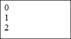

让我们来看另一个示例，它将在控制台窗口中显示每个`div`控件的内容。在这里，`each()`函数不需要参数，每个循环中的项目可以通过`this`关键字访问：

```js
<!DOCTYPE html>
<html>
  <head>
    <script src="img/jquery-1.12.0.min.js"></script>
    <script>
      $(document).ready(function () {
        $('div').each(function () {
          alert($(this).html());
        });
      });
    </script>
  </head>  
  <body>
    <div id="headerDiv">
      <h1>Demo </h1>
    </div>
    <div id="mainDiv">
      <p>This is a demo of using jQuery for selecting elements</p>
    </div>
    <div id="footerDiv">
      <footer> Copyright - JavaScript for .Net Developers </footer>
    </div>
  </body>
</html>
```

输出如下：

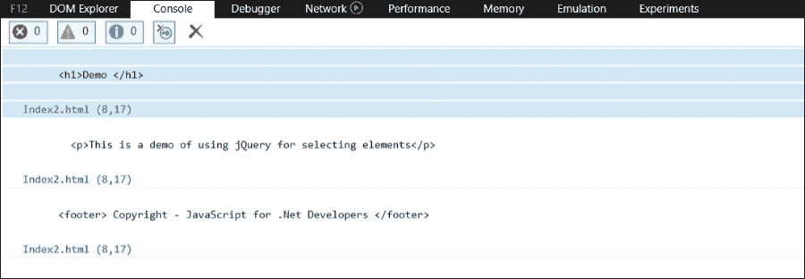

还有其他各种方法可供使用，您可以在 jQuery 文档中查阅。因此，使用选择器，我们可以更快、更高效地搜索 DOM 中的任何元素。

另一个例子是使用标签名选择多个元素，如下所示。

```js
<html>
  <head>
    <script src="img/jquery-1.12.0.min.js"></script>
    <script>
      $(document).ready(function () {
        $('div, h1, p, footer').each(function () {
          console.log($(this).html());
        });
      });
    </script>
  </head>  
  <body>
    <div id="headerDiv">
      <h1>Demo </h1>
    </div>
    <div id="mainDiv">
      <p>This is a demo of using jQuery for selecting elements</p>
    </div>
    <div id="footerDiv">
      <footer> Copyright - JavaScript for .Net Developers </footer>
    </div>
  </body>
</html>
```

```js
bootstrap theme and apply different classes to the buttons. With the help of the class name selector, we can select controls and update the class name. The following example will return two elements based on the selection criteria specified:
```

```js
<!DOCTYPE html>
<html>
  <head>
    <link rel="stylesheet" type="text/css" href="Content/bootstrap.css" />
    <script src="img/jquery-1.12.0.min.js"></script>
    <script>
      $(document).ready(function () {
        var lst = $('.btn-primary');
        alert(lst.length);
      });
    </script>
  </head>  
  <body>
    <div class="container">
      <p></p>
      <button type="button" class="btn btn-primary active">Edit </button>
      <button type="button" class="btn btn-primary disabled">Save</button>
      <button type="button" class="btn btn-danger" value="Cancel">Cancel</button>
    </div>
  </body>
</html>
```

与访问类名不同，我们可以通过在点号和类名之前指定标签名来限制搜索。您可以使用`$('button.active')`来查找所有激活的按钮。

### 通过属性值选择

在某些情况下，您可能需要根据属性或其值来选择元素。jQuery 库提供了一种非常简洁的方式来根据属性及其值搜索元素。

使用此选择器的语法是先指定元素名称，然后是包含属性名称和值的方括号，这是可选的：

```js
$(elementName[attributeName=value])
```

例如，以下代码选择所有具有`type`属性的元素：

```js
<!DOCTYPE html>
<html>
  <head>
    <link rel="stylesheet" type="text/css" href="Content/bootstrap.css" />
    <script src="img/jquery-1.12.0.min.js"></script>
    <script>
      $(document).ready(function () {
        var lst = $('input[type]');
        console.log(lst.length);
      });
    </script>
  </head>  
  <body>

    <div class="container">
      <p></p>
      <input type="text" value="hello world" />
      <input type="text" value="this is a demo" />
      <input type="button" value="Save" />
    </div>
  </body>
</html>
```

在这个例子中，我们有三个具有`type`属性的输入控件。所以，结果将是`3`。同样，如果您想搜索具有等于`hello world`的值的元素，我们可以使用以下代码：

```js
<script>
  $(document).ready(function () {
    var lst = $('input[value="hello world"]');
    alert(lst.length);
  });
</script>
```

需要注意的是，属性值是大小写敏感的，因此，在使用此表达式时，您应该考虑属性值的确切大小写。然而，还有其他方法，那就是使用`^`来搜索包含、开始或结束特定文本的值。

让我们来看一个基于搜索以表达式开始的值的`alert`例子：

```js
<!DOCTYPE html>
<html>
  <head>
    <link rel="stylesheet" type="text/css" href="Content/bootstrap.css" />
    <script src="img/jquery-1.12.0.min.js"></script>
    <script>
      $(document).ready(function () {
        var lst = $('input[value^="Pr"]');
        alert(lst.length);
      });
    </script>
  </head>
  <body>

    <div class="container">
      <p></p>
      <input type="text" value="Product 1" />
      <input type="text" value="This is a description" />
      <input type="button" value="Process" />
    </div>
  </body>
</html>
```

另一方面，我们也可以使用`$`符号来搜索以文本结尾的值。以下是搜索以`1`结尾的文本的代码：

```js
<script>
  $(document).ready(function () {
    var lst = $('input[value$="1"]');
    alert(lst.length);
  });
</script>
```

最后，搜索包含某些文本的文本可以使用`*`实现，以下是运行此例子的代码：

```js
<script>
  $(document).ready(function () {
    var lst = $('input[value*="ro"]');
    alert(lst.length);
  });
</script>
```

### 选择输入元素

HTML 中的输入控件有很多不同的控件。`textarea`、`button`、`input`、`select`、`image`和`radio`等控件都是输入控件。这些控件通常用于基于表单的应用程序中。因此，jQuery 专门提供了基于不同标准的输入控件的选择选项。

这个选择器以美元符号和`input`关键词开头，后跟属性和值：

```js
$(':input[attributeName=value]);
```

然而，在上一节中，我们已经看到了如何搜索具有属性名称和值的任何元素。所以，如果我们想要搜索所有类型等于文本的输入控件，这是可以实现的。

这个选择器在某些场景下性能效率较低，它搜索出所有输入组中的控件，并找到属性及其值；然而，这个选择器只会搜索输入控件。在编写程序时，如果有什么东西专门针对输入控件属性，使用这种方法是一个更好的选择。

让我们来看一个在 ASP.NET Core MVC 6 中的例子，该例子在文档完全加载后应用 CSS 属性：

```js
@model WebApplication.ViewModels.Book.BookViewModel
@{
  ViewData["Title"] = "View";
}
<script src="img/jquery-1.12.0.min.js"></script>
<script>
  $(document).ready(function () {
    $(':input').each(function () {
      $(this).css({ 'color': 'darkred', 'background-color': 'ivory', 'font-weight': 'bold' });    });
  });
</script>
<form asp-action="View" class="container">
  <br />
  <div class="form-horizontal">
    <div class="form-group">
      <label asp-for="Name" class="col-md-2 control-label"></label>
      <div class="col-md-10">
        <input asp-for="Name" class="form-control" />
        <span asp-validation-for="Name" class="text-danger" />
      </div>
    </div>
    <div asp-validation-summary="ValidationSummary.ModelOnly" class="text-danger"></div>
    <div class="form-group">
      <label asp-for="Description" class="col-md-2 control-label"></label>
      <div class="col-md-10">
        <textarea asp-for="Description" class="form-control" ></textarea>
        <span asp-validation-for="Description" class="text-danger" />
      </div>
    </div>
    <div class="form-group">
      <div class="col-md-offset-2 col-md-10">
        <input type="submit" value="Save" class="btn btn-primary" />
      </div>
    </div>
  </div>
</form>

<div>
  <a asp-action="Index">Back to List</a>
</div>
```

### 选择所有元素

**jQuery 库**为您提供了一个特殊的选择器，它能够获取 DOM 中定义的所有元素的集合。除了标准控件之外，它还会返回诸如`<html>`、`<head>`、`<body>`、`<link>`和`<script>`之类的元素。

获取所有元素语法是`$("*")`，下面的例子在浏览器的控制台中列出了 DOM 的所有元素：

```js
<!DOCTYPE html>
<html>
  <head>
    <link rel="stylesheet" type="text/css" href="Content/bootstrap.css" />
    <script src="img/jquery-1.12.0.min.js"></script>
    <script>
      $(document).ready(function () {
        $("*").each(function () {
          console.log($(this).prop('nodeName'));
        });    
      });
    </script>
  </head>  
  <body>
    <form class="container">
      <div class="form-group">
        <label>Name</label>
        <input type="text" class="form-control"/>
      </div>
    </form>  
  </body>
</html>
```

在前面的代码中，我们使用了`prop`方法，该方法需要属性名来显示元素名称。在这里，`prop`方法可以使用`tagName`或`nodeName`来显示名称类型。最后，在浏览器的控制台中，将显示一个登录页面，如下所示：

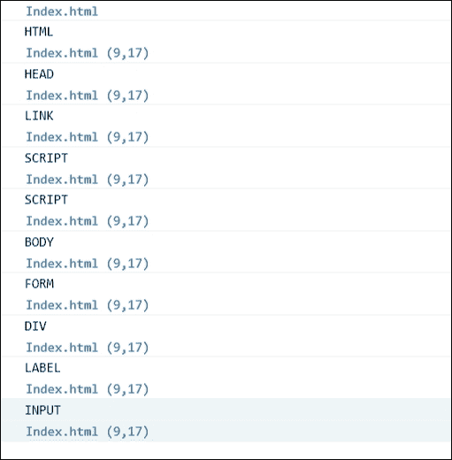

### 选择第一个和最后一个子元素

**jQuery 库**提供了特殊的选择器来选择它们父元素的所有第一个或最后一个元素。

选择所有父元素的第一个子元素的语法如下：

```js
$(elementName:first-child);
```

选择所有父元素的最后一个子元素的语法如下：

```js
$(elementName:last-child);
```

下面的例子向您展示了更改选择选项的第一个和最后一个孩子的字体样式的方法：

```js
<!DOCTYPE html>
<html>
  <head>
    <link rel="stylesheet" type="text/css" href="Content/bootstrap.css" />
    <script src="img/jquery-1.12.0.min.js"></script>
    <script>
      $(document).ready(function () {
        $('option:first-child').css('font-style', 'italic');
        $('option:last-child').css('font-style', 'italic');
        alert(lst.length);
      });
    </script>
  </head>
  <body>
    <select>
      <option>--select--</option>
      <option>USA</option>
      <option>UK</option>
      <option>Canada</option>
      <option>N/A</option>
    </select>
  </body>
</html>
```

输出结果如下：

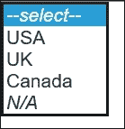

### jQuery 中的**包含选择器**

`contains`选择器用于查找 HTML 容器元素中的文本，如`<div>`和`<p>`。这个选择器搜索特定类型的所有元素，并找到传递给`contains()`函数的参数的文本。下面显示了包含`div`元素文本的代码示例。这个选择器区分大小写，因此在搜索时请确保大小写正确。

下面的代码将显示一个带有值`2`的警告框，因为它找到了两个包含文本`demo`的`div`元素：

```js
<!DOCTYPE html>
<html>
  <head>
    <link rel="stylesheet" type="text/css" href="Content/bootstrap.css" />
    <script src="img/jquery-1.12.0.min.js"></script>
    <script>
      $(document).ready(function () {
        var lst = $('div:contains("demo")');
        alert(lst.length);
      });
    </script>

  </head>
  <body>
    <div>
      This is a sample demo for contains selector
    </div>
    <div>
      Demo of the selector 
    </div>
    <div>
      Sample demo
    </div>
  </body>
</html>
```

### 选择偶数行和奇数行的选择器

这类选择器适用于表格中的行，通常用于通过将每行奇数行的颜色改变为灰色，使其看起来更像网格。我们可以使用以下语法类型的选择器：

```js
$('tr:even');
$('tr:odd');
```

让我们来看一个将表格中所有行颜色改为灰色的例子：

```js
<!DOCTYPE html>
<html>
  <head>
    <link rel="stylesheet" type="text/css" href="Content/bootstrap.css" />
    <script src="img/jquery-1.12.0.min.js"></script>
    <script>
      $(document).ready(function () {
        $('tr:odd').css('background-color', 'grey');
      });
    </script>

  </head>
  <body>
    <table>
      <thead>
        <tr><th>Product Name</th><th>Description</th><th>Price</th></tr>
      </thead>
      <tbody>
        <tr><td>Product 1</td><td>This is Product 1</td><td>$100</td></tr>
        <tr><td>Product 2</td><td>This is Product 2</td><td>$500</td></tr>
        <tr><td>Product 3</td><td>This is Product 3</td><td>$330</td></tr>
        <tr><td>Product 4</td><td>This is Product 4</td><td>$50</td></tr>
        <tr><td>Product 5</td><td>This is Product 5</td><td>$1000</td></tr>
        <tr><td>Product 6</td><td>This is Product 6</td><td>$110</td></tr>
        <tr><td>Product 7</td><td>This is Product 7</td><td>$130</td></tr>
        <tr><td>Product 8</td><td>This is Product 8</td><td>$160</td></tr>
        <tr><td>Product 9</td><td>This is Product 9</td><td>$20</td></tr>
        <tr><td>Product 10</td><td>This is Product 10</td><td>$200</td></tr>
      </tbody>
    </table>
  </body>
</html>
```

## 操作 DOM

在本文档的这一部分，我们将通过 jQuery 方法看到一些操作 DOM 的例子。jQuery 库提供了一个广泛的库，可以对 DOM 元素执行不同的操作。我们可以轻松地修改元素属性、应用样式，以及遍历不同的节点和属性。我们在上一节中已经看到了一些例子，这一节将专门关注 DOM 操作。

### 修改元素的属性

当使用客户端脚本语言时，修改元素属性和读取它们是一项基本任务。使用普通的 JavaScript，这可以通过编写几行代码来实现；然而，使用 jQuery，可以更快、更优雅地实现。

选定要修改的元素的任何属性都可以通过前面章节列出的各种选项来完成。下表中列出的每个属性都提供了`get`和`set`选项，设置时需要参数，而读取时不需要参数。

在 jQuery 中，有一些可用于修改元素的常见方法，例如`html`、`value`等。要了解更多信息，可以参考[`api.jquery.com/category/manipulation/`](http://api.jquery.com/category/manipulation/)。

| 获取方法 | 设置方法 | 描述 |
| --- | --- | --- |
| `.val()` | `.val('any value')` | 这个方法用于读取或写入 DOM 元素的任何值。 |
| `.html()` | `.html('any html string')` | 这个方法用于读取或写入 DOM 元素的任何 HTML 内容。 |
| `.text()` | `.text('any text')` | 这个方法用于读取或写入文本内容。在这个方法中不会返回 HTML。 |
| `.width()` | `.width('any value')` | 这个方法用于更新任何元素的宽度。 |
| `.height()` | `.height('any value')` | 这个方法用于读取或修改任何元素的高度。 |
| `.attr()` | `.attr('attributename', 'value')` | 这个方法用于读取或修改特定元素属性的值。 |
| `.prop()` | `.prop()` | 这个方法与`attr()`相同，但在处理返回当前状态的`value`属性时更高效。例如，`attr()`复选框提供默认值，而`prop()`给出当前状态，即`true`或`false`。 |
| `.css('style-property')` | `.css({'style-property1': value1, 'style-property2': value2, 'style-propertyn':valueN }` | 这个方法用于设置特定元素的样式属性，如字体大小、字体家族和宽度。 |

让我们来看一下下面的例子，它使用了`html()`、`text()`和`css()`修饰符，并使用`html`、`text`和`increaseFontSize`更新了`p`元素：

```js
<!DOCTYPE html>
<html>
  <head>
    <link rel="stylesheet" type="text/css" href="Content/bootstrap.css" />
    <script src="img/jquery-1.12.0.min.js"></script>
    <script>
      function updateHtml() {
        $('p').html($('#txtHtml').val());
      }

      function updateText() {
        $('p').text($('#txtText').val());
      }

      function increaseFontSize() {
        var fontSize = parseInt($('p').css('font-size'));
        var fontSize = fontSize + 1 +"px";
        $('p').css({'font-size': fontSize});
      }
    </script>
  </head>
  <body >
    <form class="form-control">
      <div class="form-group">
        <p>this is a book for JavaScript for .Net Developers</p>

      </div>
      <div class="form-group">
        Enter HTML: <input type="text" id="txtHtml" />
        <button onclick="updateHtml()">Update Html</button>
      </div>
      <div class="form-group">
        Update Text: <input type="text" id="txtText" />
        <button onclick="updateText()">Update Text</button>
      </div>
      <div class="form-group">
        <button onclick="increaseFontSize()">Increase Font Size</button>
      </div>
    </form>
  </body>
</html>
```

前面 HTML 代码的结果如下：

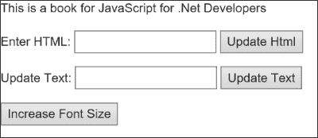

你可以通过点击**更新 Html**按钮来更新 HTML，通过点击**更新文本**按钮来更新纯文本：

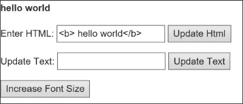

最后，可以通过点击**增加字体大小**按钮来增加字体大小：

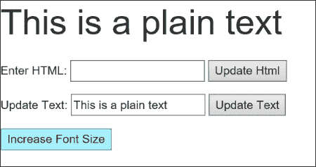

### 创建新元素

jQuery 库提供了一种创建新元素的智慧方式。可以使用相同的`$()`方法并传递`html`作为参数来创建元素。创建元素后，除非将其添加到 DOM 中，否则它无法显示。有各种方法可用于附加、插入后或插入前任何元素等。下面表格展示了用于将新元素添加到 DOM 的所有方法：

| 获取方法 | 描述 |
| --- | --- |
| `.append()` | 此方法用于向调用它的元素中插入 HTML 内容 |
| `.appendTo()` | 此方法用于将每个元素插入到调用它的末尾 |
| `.before()` | 此方法用于在调用它的元素之前插入 HTML 内容 |
| `.after()` | 此方法用于在调用它的元素之后插入 HTML 内容 |
| `.insertAfter()` | 此方法用于在调用它的每个元素之后插入 HTML 内容 |
| `.insertBefore()` | 此方法用于在调用它的每个元素之前插入 HTML 内容 |
| `.prepend()` | 此方法用于在调用它的元素的起始位置插入 HTML 内容 |
| `.prepend()` | 此方法用于向每个元素的开始位置插入 HTML 内容 |

以下示例创建了一个包含两个字段（`Name`和`Description`）和一个按钮来保存这些值表单：

```js
<!DOCTYPE html>
<html>
  <head>
    <link rel="stylesheet" type="text/css" href="Content/bootstrap.css" />
    <script src="img/jquery-1.12.0.min.js"></script>
    <script>
      $(document).ready(function () {
        var formControl = $("<form id='frm' class='container' ></form>");
        $('body').append(formControl);
        var nameDiv = $("<div class='form-group'><label id='lblName'>Enter Name: </label> <input type='text' id='txtName' class='form-control' /></div>");
        var descDiv = $("<div class='form-group'><label id='lblDesc'>Enter Description: </label> <textarea class='form-control' type='text' id='txtDescription' /></div>");
        var btnSave = $("<button class='btn btn-primary'>Save</button>")
        formControl.append(nameDiv);
        formControl.append(descDiv);
        formControl.append(btnSave);      
      });
      </script>
    </head>       
  <body>
  </body>
</html>
```

这段代码将产生以下输出：

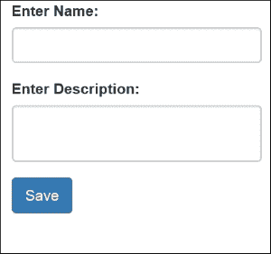

### 删除元素和属性

在使用不同的方法来创建和渲染 DOM 中的元素时，jQuery 还提供了一些用于从 DOM 中删除元素的方法。以下表格是我们可以用来删除特定元素、一组元素或所有子节点的方法的列表：

| 方法 | 描述 |
| --- | --- |
| `.empty()` | 此方法从元素中移除内部 HTML 代码 |
| `.detach()` | 此方法从 DOM 中删除一组匹配的元素 |
| `.remove()` | 此方法从 DOM 中删除一组匹配的元素 |
| `.removeAttr()` | 此方法从元素中移除特定的属性 |
| `.removeClass()` | 此方法从元素中移除一个类 |
| `.removeProp()` | 此方法从元素中移除一个属性 |

`remove()`和`detach()`的区别在于，`remove`永久性地从 DOM 中删除内容；这意味着如果元素有特定的事件或数据关联，这些事件或数据也将被删除。然而，`detach`只是将元素从 DOM 中分离并返回你可以保存在某个变量中以供以后附着的内容：

```js
@model WebApplication.ViewModels.Book.BookViewModel
@{
  ViewData["Title"] = "View";
}
<script src="img/jquery-1.12.0.min.js"></script>
<script>
  var mainDivContent=undefined
  $(document).ready(function () {
    $('button').click(function () {
      if (mainDivContent) {
        mainDivContent.appendTo('#pageDiv');
        mainDivContent = null;
      } else {
        mainDivContent = $('#mainDiv').detach();
      }
    });
  });
</script>
<div id="pageDiv" class="container">
  <br />
  <div id="mainDiv" class="form-horizontal">
    <div class="form-group">
      <label asp-for="Name" class="col-md-2 control-label"></label>
      <div class="col-md-10">
        <input asp-for="Name" class="form-control" />
      </div>
    </div>
  </div>
  <div class="form-group">
    <div class="col-md-offset-2 col-md-10">
      <button class="btn btn-primary"> Detach/Attach</button>
    </div>
  </div>
</div>
```

在分离后，输出将如下所示：

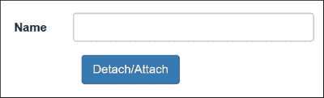

在附着后，输出将类似于以下屏幕截图：

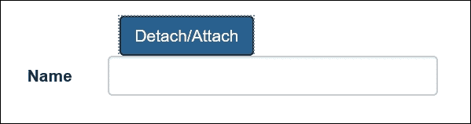

## jQuery 中的事件处理

jQuery 事件模型为处理 DOM 元素上的事件提供了更好的方法。程序化地，如果开发者想要注册用户操作的任何事件；例如，按钮的点击事件当使用纯 JavaScript 时可能是一个繁琐的过程。这是因为不同的浏览器有不同的实现，并且语法彼此之间有所不同。另一方面，jQuery 库提供了一个更简洁的语法，开发人员不必处理跨浏览器问题。

### jQuery 中注册事件

在 jQuery 中，有许多快捷方式可以注册事件到不同的元素上。下面的表格展示了所有这些事件及其具体的描述：

| 事件 | 描述 |
| --- | --- |
| `click()` | 此事件在鼠标点击时使用 |
| `.dblclick()` | 此事件在双击时使用 |
| `.mousedown()` | 此事件在鼠标任何按钮被按下时使用 |
| `.mouseup()` | 此事件在鼠标任何按钮被释放时使用 |
| `.mouseenter()` | 此事件在鼠标进入区域时使用 |
| `.mouseleave()` | 此事件在鼠标离开区域时使用 |
| `.keydown()` | 此事件在键盘按键被按下时使用 |
| `.keyup()` | 此事件在键盘按键被释放时使用 |
| `.focus()` | 此事件在元素获得焦点时使用 |
| `.blur()` | 此事件在元素失去焦点时使用 |
| `.change()` | 此事件在项目被更改时使用 |

还有许多其他事件，您可以在[`api.jquery.com/category/events`](http://api.jquery.com/category/events)上查看。

使用 jQuery 注册事件相当简单。首先，必须通过选择任何选择器来选择元素，然后通过调用特定的事件处理程序来注册事件；例如，以下代码片段将为按钮注册点击事件：

```js
$(document).ready(function({
  $('#button1').click(function(){
    console.log("button has been clicked");
  });
)};
```

在前面的示例代码之后，注册`.asp.net`按钮的点击事件，并调用 ASP.NET 中`Home`控制器的`Contact`动作：

```js
<script src="img/jquery-1.12.0.min.js"></script>
<script>
  var mainDivContent=undefined
  $(document).ready(function () {
    $('#btnSubmit').click(function () {
      window.location.href = '@Url.Action("Contact", "Home")';  
    });
  });
</script>
<div id="pageDiv" class="container">
  <br />

  <div class="form-group">
    <div class="col-md-offset-2 col-md-10">
      <button id="btnSubmit" class="btn btn-primary"> Submit</button>
    </div>
  </div>
</div>
```

在前面的示例中，我们通过 Razor 语法使用了 HTML 助手`Url.Action`，生成了 URL 并将其设置为窗口当前位置的`href`属性。现在，点击下面屏幕截图中的按钮：


以下联系页面将被显示：

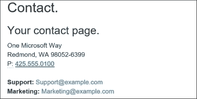

这里的一个示例将改变所有输入控件的背景颜色到`aliceblue`，当控件获得焦点时，并在它失去焦点时恢复为白色：

```js
@model WebApplication.ViewModels.Book.BookViewModel
@{
  ViewData["Title"] = "View";
}
<script src="img/jquery-1.12.0.min.js"></script>
<script>
  var mainDivContent=undefined
  $(document).ready(function () {
    $('#btnSubmit').click(function () {
      window.location.href = '@Url.Action("Contact", "Home")';  
    });

    $('input').each(function () {
      $(this).focus(function () {
        $(this).css('background-color', 'aliceblue');
      })
      $(this).blur(function () {
        $(this).css('background-color', 'white');

      });
    });
  });
</script>
<div id="pageDiv" class="container">
  <br />
  <div id="mainDiv" class="form-horizontal">
    <div class="form-group">
      <label asp-for="Name" class="col-md-2 control-label"></label>
      <div class="col-md-10">
        <input asp-for="Name"  class="form-control" />
      </div>
    </div>
    <div class="form-group">
      <label asp-for="Description" class="col-md-2 control-label"></label>
      <div class="col-md-10">
        <input asp-for="Description" class="form-control" />
      </div>
    </div>
  </div>
  <div class="form-group">
    <div class="col-md-offset-2 col-md-10">
      <button id="btnSubmit" class="btn btn-primary"> Submit</button>
    </div>
  </div>
</div>
```

### 使用 on 和 off 注册事件

除了直接通过调用事件处理程序来注册事件，我们还可以使用`on`和`off`来注册它们。这些事件为特定元素注册和注销事件。

这是一个使用`on`绑定点击事件到按钮的简单示例：

```js
$(document).ready(function () {
  $('#btnSubmit').on('click', function () {
    window.location.href = '@Url.Action("Contact", "Home")';
  });
});
```

这是一个非常实用的技术，可以在你希望注销任何事件的情况下使用。例如，商务应用程序大多数与表单处理相关，而表单可以通过某个按钮提交请求到某个服务器。在某些条件下，我们必须限制用户在第一次请求处理完成前多次提交。为了解决这个问题，我们可以使用`on()`和`off()`事件在用户第一次点击时注册和注销它们。以下是一个在第一次点击时注销按钮点击事件的示例：

```js
<script src="img/jquery-1.12.0.min.js"></script>
<script>
  $(document).ready(function () {
    $('#btnSubmit').on('click', function () {
      $('#btnSubmit').off('click');       
    });
  });
</script>
```

`preventDefault()`事件就是我们以前在.NET 中使用的取消事件。这个事件用于取消事件的执行。它可以像下面这样使用：

```js
<script src="img/jquery-1.12.0.min.js"></script>
<script>
  $(document).ready(function () {
    $('#btnSubmit').on('click', function (event) {
      event.preventDefault();
    });
  });
</script>
```

`on()`方法与以前版本 jQuery 中使用的`delegate()`方法等效。自 jQuery 1.7 起，`delegate()`已被`on()`取代。

还有一个重载方法`on`，它接受四个参数：

```js
$(element).on(events, selector, data, handler);
```

在这里，`element`是控件名称，`events`是你想要注册的事件，`selector`是一个新东西，可以是父控件的子元素。例如，对于一个表格元素选择器，它可能是`td`；而且在每个`td`的点击事件上，我们可以做如下操作：

```js
@model IEnumerable<WebApplication.ViewModels.Book.BookViewModel>
<script src="img/jquery-1.12.0.min.js"></script>
<script>
  $(document).ready(function () {
    $('table').on('click','tr', null, function() {
      $(this).css('background-color', 'aliceblue');
    });
  });
</script>

<p>
  <a asp-action="Create">Create New</a>
</p>
<table class="table">
  <tr>
    <th>
      @Html.DisplayNameFor(model => model.Description)
    </th>
    <th>
      @Html.DisplayNameFor(model => model.Name)
    </th>
    <th></th>
  </tr>

  @foreach (var item in Model) {
    <tr>
      <td>
        @Html.DisplayFor(modelItem => item.Description)
      </td>
      <td>
        @Html.DisplayFor(modelItem => item.Name)
      </td>
      <td>
        <a asp-action="Edit" asp-route-id="@item.Id">Edit</a> |
        <a asp-action="Details" asp-route-id="@item.Id">Details</a> |
        <a asp-action="Delete" asp-route-id="@item.Id">Delete</a>
      </td>
    </tr>
  }
</table>
```

```js
 output would be similar to the following screenshot. When the user clicks on any row, the background color will be changed to Alice blue:
```

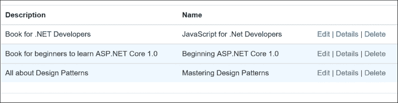

### 使用 hover 事件

我们可以利用鼠标悬停在特定元素上或离开时的 hover 事件。它可以通过在 DOM 的任何元素上调用`hover()`方法来使用。调用此方法的语法如下：

```js
$(selector).hover(mouseEnterHandler, mouseExitHandler);
```

以下示例在鼠标悬停在输入文本控件上时改变边框颜色：

```js
@{
  ViewData["Title"] = "View";
}
<script src="img/jquery-1.12.0.min.js"></script>
<02>
  $(document).ready(function () {
    $("input[type = 'text']").hover(function () {
      $(this).css('border-color', 'red');
    },
    function () {
      $(this).css('border-color', 'black');
    }
  });
  </script>
  <div id="pageDiv" class="container">
    <br />

  <div id="mainDiv" class="form-horizontal">
    <div class="form-group">
      <label asp-for="Name" class="col-md-2 control-label"></label>
      <div class="col-md-10">
        <input asp-for="Name" class="form-control" />
      </div>
    </div>
    <div class="form-group">
      <label asp-for="Description" class="col-md-2 control-label"></label>
      <div class="col-md-10">
        <input asp-for="Description" class="form-control" />
      </div>
    </div>
  </div>
  <div class="form-group">
    <div class="col-md-offset-2 col-md-10">
      <button id="btnSubmit" class="btn btn-primary"> Submit</button>
    </div>
  </div>
</div>
```

# 总结

在本章中，你学习了 jQuery 的基础知识以及如何在 Web 应用程序中使用它们，特别是在 ASP.NET 核心 1.0 中。这是一个非常强大的库。它消除了跨浏览器问题，并在所有浏览器中提供一致的行为。这个库提供了简单易用的方法来选择元素、修改属性、附加事件以及通过编写更干净、更精确的代码来执行复杂操作。在下一章中，我们将探讨使用 jQuery 和纯 JavaScript 进行 Ajax 请求的各种技术以执行服务器端操作。
