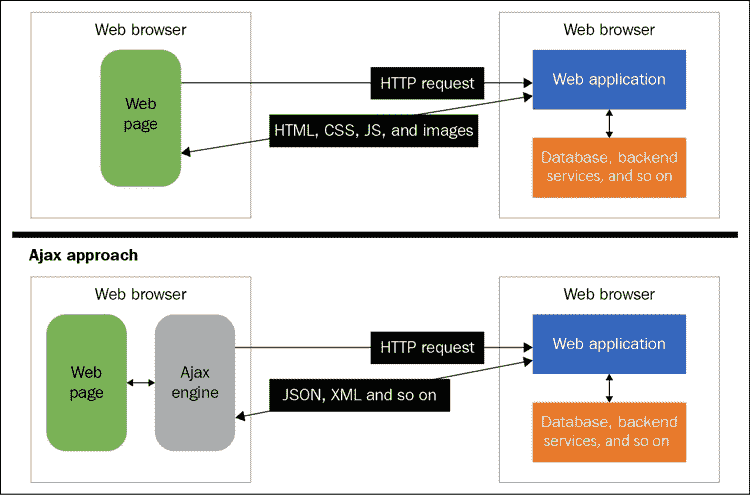
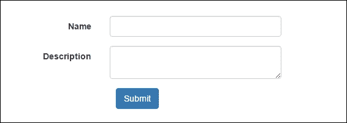
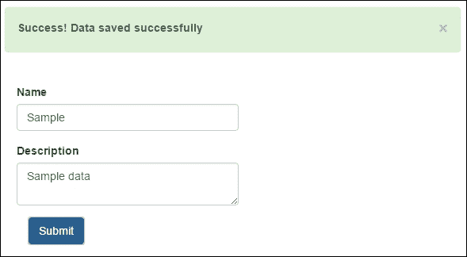
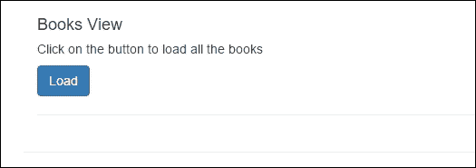
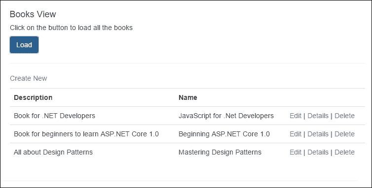
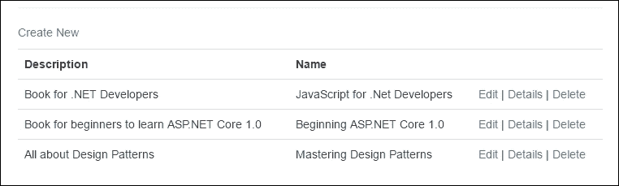
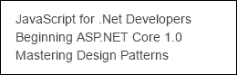
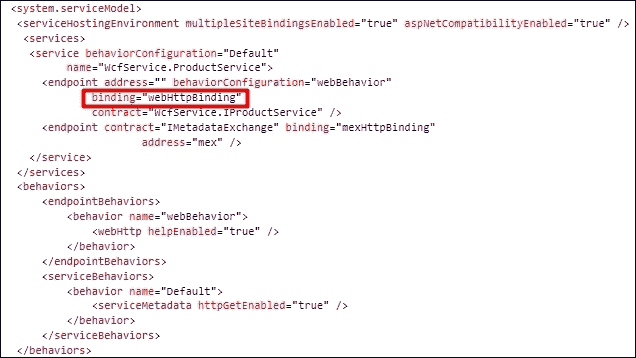
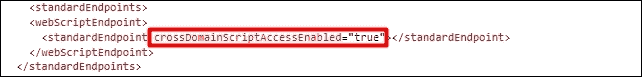
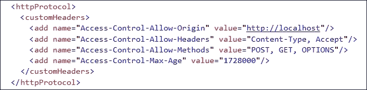

# 第四章．Ajax 技术

使网页应用程序具有响应性的核心特征之一就是 Ajax。在服务器端回发传统方式中，无论用户执行任何操作，表单中提供的信息都会发送回服务器，并且同一页面会再次加载，包含在客户端重新加载的所有图像、CSS 和 JavaScript 文件。这种方法在客户端和服务器之间发送的请求和响应大小方面相当沉重。因此，应用程序变得不那么响应式，用户每次执行任何操作时都必须等待页面刷新。在本章中，我们将讨论如何通过 Ajax 简化整个过程，并避免沉重的服务器端回发。

# 介绍 Ajax

**Ajax**代表**异步 JavaScript 和 XML**；它能在不重新发送和渲染整个页面的情况下，在服务器端创建异步请求，而它只发送需要发送到服务器的少量信息，并以特定格式接收响应，通过 JavaScript 更新特定部分或 DOM 元素。这使得开发者能够开发响应式网页应用程序，并动态更新页面内容，而无需每次特定动作时重新加载页面。例如，在主从页面关系中，子内容依赖于父项的选择；而采用传统方法，每次选择父项时，页面都会被发送回服务器端，服务器端执行一些后端任务来填充子部分，并返回 HTML 代码，然后客户端对其进行渲染。通过 Ajax，这可以通过异步请求发送所选信息并更新页面内容的指定部分来实现。

## Ajax 如何工作

Ajax 使用**XMLHttpRequest**（**XHR**）对象异步调用服务器端方法。XHR 是由微软开发的，最初在 Internet Explorer 5 中提供。最初通过调用`ActionXObject`实例来创建一个实例；然而，在现代版本中，每个浏览器都支持通过`XMLHttpRequest`对象初始化 XHR 对象。

以下图表展示了 Ajax 工作的架构视图：



传统上，当客户端执行任何操作时，整个数据都会发送回服务器，一旦收到响应，数据会在客户端重新加载。除非实现了某种缓存机制，否则需要更新的数据（包括所有静态文件，如 CSS、JavaScript 和图片）会从服务器重新加载并在客户端呈现，而不是更新实际需要更新的数据。使用 Ajax，我们可以以 JSON 字符串或 XML 的形式发送数据，并根据服务器返回 JSON、XML、HTML 或其他格式的响应。我们还可以在发送请求时使用请求头，如`Accept`，因此服务器知道客户端接受什么；根据格式化器，它还可以将数据序列化为特定格式。在 ASP.NET MVC 6 中，默认实现了两个格式化器，分别为 JSON 和 XML 发送数据，根据请求的`Accept`头序列化对象。还可以在服务器级别实现自定义格式化器来处理特定场景。

### 使用经典的 XHR 对象进行 Ajax 请求

所有浏览器，包括 Internet Explorer、Chrome、Firefox 和 Safari，都提供这个对象，可以从 JavaScript 中使用它来执行 Ajax 请求。

在 JavaScript 中，我们可以如下初始化`XMLHttpRequest`对象：

```js
var xhr = new XMLHttpRequest();
```

每个请求都可能是`GET`或`POST`请求。一旦从服务器收到响应，一些属性会填充，事件处理程序会被调用，这些事件处理程序在执行 Ajax 请求时可以配置为 XHR 对象。

让我们深入了解 XHR 对象提供的方法、属性和事件。

#### XHR 方法

XHR 对象提供了各种方法，但启动 Ajax 化请求最重要的两个方法是`open()`和`send()`：

+   **发送请求**：

    请求可以是`GET`或`POST`。在执行任何请求时，我们首先必须调用`open`方法并指定 HTTP 方法，如`GET`或`POST`，以及服务器的 URL。其余参数，如`async`位、`user`和`password`，是可选的。

    `open`方法的字段如下：

    ```js
    void Open(

      DOMString method, 
      DOMString URL, 
      optional boolean async, 
      optional DOMString user?, 
      optional DOMString password

    );
    ```

    `send`方法用于将请求发送到服务器。这是实际的方法，它接受各种格式的数据并向服务器发送请求。

    以下表格展示了`send`方法的可重载方法：

    | 方法 | 描述 |
    | --- | --- |
    | `void send()` | 此方法用于发送`GET`请求 |
    | `void send (DOMString? Data)` | 当以字符串形式传递数据时使用此方法 |
    | `void send(Document data)` | 当传递文档数据时使用此方法 |
    | `void send(Blob data)` | 此方法用于传递 blob 数据或二进制数据 |
    | `void send(FormData data)` | 此方法用于传递整个表单 |

+   **取消请求**：

    在某些情况下，开发者可能需要取消当前请求。这可以通过调用 XHR 对象的`abort()`函数来实现：

    ```js
    var xhr = new XMLHttpRequest();
    xhr.abort();
    ```

+   **设置请求头部**：

    XHR 提供了几种 Ajax 请求的方法。这意味着在根据服务器实现需要发送 JSON、XML 或某种自定义格式的数据时，存在一些情况。例如，当与 ASP.NET MVC 6 一起工作时，有两种默认格式化器实现，分别是 JSON 和 XML，如果你想要实现自己的自定义格式化器，这也是可能的。当发送特定格式的数据时，我们需要通过请求头部告诉服务器该格式。这有助于服务器识别必须加载以序列化响应和处理请求的格式化器。

    以下表格显示了可以与 Ajax 请求一起提供的默认头部：

    | 头部 | 描述 |
    | --- | --- |
    | `Cookie` | 此头部指定客户端设置的任何 cookie |
    | `Host` | 此头部指定页面的域名 |
    | `Connection` | 此头部指定连接的类型 |
    | `Accept` | 此头部指定客户端可以处理的内容类型 |
    | `Accept-charset` | 此头部指定客户端可以显示的字符集 |
    | `Accept-encoding` | 此头部指定客户端可以处理的编码 |
    | `Accept-language` | 此头部指定作为响应接受的首选自然语言 |
    | `User-Agent` | 此头部指定一个用户代理字符串 |
    | `Referer` | 此头部指定页面的 URL |

    通过 XHR 对象，我们可以使用`setRequestHeader()`函数设置请求头部，如下面的代码所示：

    ```js
    var xhr= new XMLHttpRequest();
    xhr.setRequestHeader('Content-Type', 'application/json');
    ```

+   **获取响应头部**：

    当服务器返回响应时，我们可以使用以下两种方法来读取响应头部：

    ```js
    var xhr= new XMLHttpRequest();
    function callback(){
      var arrHeaders = xhr.getAllResponseHeaders();
      //or
      var contentType = xhr.getResponseHeader('Content-Type');
    }
    ```

    `getAllResponseHeaders()`函数返回所有响应头部的列表，而`getResponseHeader()`函数接受头部名称并返回提供的头部名称的值。

#### XHR 事件

在 XHR 对象中最有用的事件处理程序，当`readystate`属性的值发生变化时调用，是`onreadystatechange`事件。在初始化请求时，我们可以将函数与这个事件处理程序关联并读取响应：

```js
var xhr= new XMLHttpRequest();
xhr.onreadystatechange = callback;

function callback(){
  //do something
}
```

另一个核心事件处理程序是`ontimeout`，可以在处理请求超时场景时使用。在初始化 XHR 请求时，有一个`timeout`属性，通过该属性可以将超时设置为毫秒，如果请求超过超时值，将调用`ontimeout`事件处理程序。例如，将超时设置为 5,000 毫秒，如果超过`timeout`属性，将调用`timeout`处理函数，如下所示：

```js
var xhr = new XMLHttpRequest();
xhr.timeout = 5000; 
xhr.ontimeout = timeouthandler;
function timeouthandler(){
  //do something
}
```

#### XHR 属性

以下是为`XMLHttpRequest`对象可用的属性列表：

+   **GET 请求状态**：

    这个属性返回关于响应的状态信息。它通常用于根据请求状态采取行动：

    ```js
     var xhr=new XMLHttpRequest();
     xhr.readystate;
    ```

    以下表格给出了可用于`readystate`属性的状态及其含义的列表：

    | 状态值 | 状态 | 描述 |
    | --- | --- | --- |
    | `0` | `UNSENT` | 在此状态下，创建了`XMLHttpRequest`对象，但未调用`open()`方法 |
    | `1` | `OPENED` | 在此状态下，调用`open`方法 |
    | `2` | `HEADERS_RECEIVED` | 在调用`send()`并接收到头部时发生此状态 |
    | `3` | `LOADING` | 当响应正在下载时发生此状态 |
    | `4` | `DONE` | 当响应完成时发生此状态 |

+   **获取响应数据**：

    可以通过调用`response`或`responseText`属性来检索响应。这两个属性的区别在于，`responseText`属性返回响应作为一个字符串，而`response`属性返回响应作为一个`response`对象。`response`对象可以是一个文档、blob 或 JavaScript 对象：

    ```js
    var xhr= new XMLHttpRequest();
    xhr.response;
    //or 
    xhr.responseText;
    ```

+   **获取响应状态**：

    可以通过调用`status`或`statusText`属性来检索响应状态。这两个属性的区别在于，`status`属性返回数值值，例如，如果服务器成功处理了请求，则返回`200`；而`statusText`属性包括完整的文本，例如`200 OK`等：

    ```js
    var xhr= new XMLHttpRequest();
    xhr.status;
    or 
    xhr.statusText;
    ```

让我们来看一个使用 ASP.NET MVC 6 中的 XHR 对象进行表单`POST`请求的例子。以下表单有两个字段，**Name**和**Description**：



以下代码片段使用 XHR 对象将请求发送到服务器端。这个例子发送的是 JSON 数据：

```js
@model WebApplication.ViewModels.Book.BookViewModel
@{
  ViewData["Title"] = "View";
}
<script>
  var xhr = null;
  function submit() {
    xhr = new XMLHttpRequest();
    xhr.open("POST", '/Book/SaveData');
    var name = document.getElementById("Name").value;
    var description = document.getElementById("Description").value;
    var data =
    {
      "Name": name,
      "Description": description
    };
    xhr.setRequestHeader('Content-Type', 'application/json; charset=utf-8');
    xhr.onreadystatechange = callback;
    xhr.send(JSON.stringify(data));
  }

  function callback() {
    if (xhr.readyState == 4) {
      var msg = xhr.responseText;r 
      document.getElementById("msg").innerHTML = msg;
      document.getElementById("msgDiv").style.display = 'block';
    }
  }
</script>

<form asp-action="SaveData" id="myForm">
  <p> </p>
  <div id="msgDiv" style="display:none" class="alert alert-success">
    <a href="#" class="close" data-dismiss="alert" aria-label="close">&times;</a>
    <strong>Success!</strong> <label id="msg"></label>
  </div>
  <div id="pageDiv" class="container">
    <br />
    <div id="mainDiv" class="form-horizontal">
      <div class="form-group">
        <label asp-for="Name" class="col-md-2 control-label"></label>
        <div class="col-md-10">
          <input asp-for="Name" class="form-control" />
        </div>
      </div>
      <div class="form-group">
        <label asp-for="Description"  class="col-md-2 control-label"></label>
        <div class="col-md-10">
          <textarea asp-for="Description" class="form-control" ></textarea>
        </div>
      </div>
    </div>
    <div class="form-group">
      <div class="col-md-offset-2 col-md-10">
        <button id="btnSubmit" onclick="submit()" type="submit" class="btn btn-primary"> Submit</button>
      </div>
    </div>
  </div>
</form>
```

在 ASP.NET Core 中，对于 JSON 和 XML，我们必须显式地为复杂类型添加`[FromBody]`属性。这是因为 MVC 6 首先在不管它是复杂类型还是基本类型的情况下搜索查询字符串中的值。对于 JSON 和 XML 数据，我们需要显式地将方法参数添加`[FromBody]`属性，以便数据可以没有任何问题地轻松绑定：

```js
public IActionResult SaveData([FromBody]BookViewModel bookViewModel)
{
  return Content("Data saved successfully"); 
}
```

```js
document.getElementById and then made a JSON string to pass the form data in a JSON format.
```

输出将如下所示：



然而，谷歌提供了一个库，通过调用`serialize()`函数来序列化表单数据。唯一的区别是设置请求头`'Content-Type'`为`'application/x-www-form-urlencoded'`，并添加以下脚本文件：

```js
<script src=http://form-serialize.googlecode.com/svn/trunk/serialize-0.2.min.js />
```

以下代码是`submit`函数的修订版，它通过`serialize()`函数序列化表单数据，并将数据作为表单编码值发送：

```js
function submit() {
  xhr = new XMLHttpRequest();
  xhr.open('POST', '/Book/SaveData');
  xhr.setRequestHeader('Content-Type', 'application/x-www-form-urlencoded');
  var html = serialize(document.forms[0]);
  xhr.onreadystatechange = callback;
  xhr.send(html);
}
```

对于表单编码的值，我们将删除`[FromBody]`属性。这是因为表单编码的值作为查询字符串中的名称值对发送：

```js
public IActionResult SaveData(BookViewModel bookViewModel)
{
  return Content("Data saved successfully"); 
}
```

在 ASP.NET Web API 的前几个版本中，如果 Web API 控制器的`action`方法包含一个复杂类型，Web API 框架会自动绑定请求体中的值。而随着 ASP.NET Core 的出现，Web API 和 MVC 已经合并为一个统一的框架，模型绑定不再与我们在 Web API 前几个版本中的那样相等。

在前面的例子中，我们看到了如何轻松地发送一个`POST`请求并发送 JSON 和表单编码的值。现在，让我们看一个例子，在这个例子中，我们将根据从服务器发送的 JSON 响应加载部分视图。

以下屏幕截图是包含一个按钮以在表格中加载书籍列表的 ASP.NET 页面：



以下是主页的代码片段：

```js
@model WebApplication.ViewModels.Book.BookViewModel
@{
  ViewData["Title"] = "Books";
}
<script>
  var xhr = null;
  function loadData() {
    xhr = new XMLHttpRequest();
    xhr.open('GET', '/Book/Books',true);
    xhr.onreadystatechange = callback;
    xhr.send();
  }
  function callback() {
    if (xhr.readyState == 4) {
      var msg = xhr.responseText;
      document.getElementById("booksDiv").innerHTML = msg;
    }
  }
</script>
<div class="container">  
  <button id="btnLoad" onclick="loadData()" type="submit" class="btn btn-primary">Load</button>
  <hr />
  <div id="booksDiv">
  </div>
</div>
```

以下是一个显示书籍列表的表格的部分视图：

```js
@{ 
  Layout = null;
}
@model IEnumerable<WebApplication.ViewModels.Book.BookViewModel>
<script src="img/jquery-1.12.0.min.js"></script>
<script>
  $(document).ready(function () {
    $('table').on('click','tr', null, function() {
      $(this).css('background-color', 'aliceblue');
    });
  });
</script>

<p>
  <a asp-action="Create">Create New</a>
</p>
<table class="table">
  <tr>
    <th>
      @Html.DisplayNameFor(model => model.Description)
    </th>
    <th>
      @Html.DisplayNameFor(model => model.Name)
    </th>
    <th></th>
  </tr>

@foreach (var item in Model) {
  <tr>
    <td>
      @Html.DisplayFor(modelItem => item.Description)
    </td>
    <td>
      @Html.DisplayFor(modelItem => item.Name)
    </td>
    <td>
      <a asp-action="Edit" asp-route-id="@item.Id">Edit</a> |
      <a asp-action="Details" asp-route-id="@item.Id">Details</a> |
      <a asp-action="Delete" asp-route-id="@item.Id">Delete</a>
    </td>
  </tr>
}
</table>
```

```js
Books controller that contains the Books action method that returns a list of books:
```

```js
public class BookController : Controller
{
  // GET: /<controller>/
  public IActionResult Index()
  {
    return View();
  }

  public IActionResult Books()
  {
    List<BookViewModel> books = new List<BookViewModel>();
    books.Add(new BookViewModel { Id = 1, Name = "JavaScript for .Net Developers", Description = "Book for .NET Developers" });
    books.Add(new BookViewModel { Id = 1, Name = "Beginning ASP.NET Core 1.0", Description = "Book for beginners to learn ASP.NET Core 1.0" });
    books.Add(new BookViewModel { Id = 1, Name = "Mastering Design Patterns", Description = "All about Design Patterns" });
    return View(books);
  }

  public IActionResult Create()
  {
    return View();
  }
}
```

所以，有了这个设置，当用户点击`加载`按钮时，请求将被发送到服务器，ASP.NET MVC 控制器`Books`动作方法将被调用，它返回一个`视图`，该视图渲染部分视图，该视图将在主页上的`booksDiv`元素内渲染：



### 使用 jQuery 发送 Ajax 请求

在前几节中，我们讨论了如何使用普通的`XMLHttpRequest`对象发送 Ajax 请求，这在所有浏览器中都是可用的。在本节中，我们将了解 jQuery 在发送 Ajax 请求方面提供了什么，以及如何通过 jQuery 对象使用 HTTP `GET`和`POST`请求。

#### jQuery.ajax()

此方法用于发送`GET`和`POST`异步请求。以下代码是此方法的签名，它接受两个参数：`URL`和`options`。`URL`参数是实际的服务器 URL，而`options`以 JSON 表示形式传递配置请求头和其他属性：

```js
$.([URL],[options]);
$.( [options]);
```

以下示例显示了如何对 MVC 控制器进行异步请求，并在从服务器成功返回响应时显示一个警告框：

```js
<script src="img/jquery-1.12.0.min.js"></script>
<script>
  $(document).ready(function () {
    $.ajax('/Book/Books', {
      success: function (data) {
        $('#booksDiv').html(data);
      },
      error: function (data) {
        $('#booksDiv').html(data);
      }
    });
  });
</script>
```

`Books`动作方法返回 ASP.NET MVC 视图，其中传递了将在`booksDiv` DOM 元素内填充的书籍列表：



### Ajax 属性

以下表格显示了您可以指定的一些核心属性，以配置 Ajax 请求：

| 名称 | 类型 | 描述 |
| --- | --- | --- |
| `accepts` | `PlainObject` | 此属性告诉服务器客户端将接受哪种类型的响应。 |
| `async` | `Boolean` | 默认情况下，此属性为`true`（用于异步请求），但它可以设置为`false`（同步）。 |
| `cache` | `Boolean` | 如果将此属性设置为`false`，浏览器将不会缓存强制请求的页面。 |
| `contents` | `PlainObject` | 此属性用于指定解析响应的正则表达式。 |
| `contentType` | `String` 或 `Boolean` | 这个属性告诉服务器传入请求的数据类型。默认值是`application/x-www-form-urlencoded; charset=UTF-8`。 |
| `crossDomain` | `Boolean` | 如果您想强制执行跨域请求，则将此属性设置为`true`。 |
| `data` | `PlainObject`、`String` 或 `Array` | 这个属性可以用来以 JSON、XML 或其他任何格式传递数据。 |
| `dataType` | `String` | 这个属性指定了期望从服务器返回的数据类型。一些核心数据类型包括 XML、JSON、脚本和 HTML。 |

#### 预过滤 Ajax 请求

这是一个很好的功能，可以在发送之前过滤现有的请求选项和配置属性。它提供了两个重载方法：一个接收一个函数，该函数注入`options`、`originalOptions`和`jqXHR`对象，另一个接收一个字符串，您可以在此字符串中过滤出特定请求的配置属性，后面跟着接受`options`、`originalOptions`和`jqXHR`参数的函数。下面是这两个重载方法的签名：

```js
$.ajaxPrefilter(function(options, originalOptions, jqXHR){
  //Modify options, originalOptions and store jqXHR
}
$.ajaxPrefilter('dataType', function(options, originalOptions, jqXHR){
  //Modify options, originalOptions and store jqXHR
}
```

前面的代码中的对象如下解释：

+   `options`：这些对象与 Ajax 请求中提供的请求选项相同，但可以被覆盖和相应地过滤。

+   `originalOptions`：这些对象提供了 Ajax 请求中实际传递的选项。它们可以用来引用，但不能修改。任何配置的更改都可以通过使用`options`对象来实现。

+   `jqXHR`：这个对象与 jQuery 中的`XMLHttpRequest`对象相当。

让我们来看一下以下示例，该示例通过添加`fromAjax`参数来告诉 MVC 控制器请求是从 JavaScript 执行的：

```js
<script>
  $(document).ready(function () {

    $.ajaxPrefilter(function (options, originalOptions, jqXHR) {
      options.url += ((options.url.indexOf('?') < 0) ? '?' : '&')+ 'fromAjax=true';
    });

    $.ajax('/Book/Books', {
      success: function (data) {
        $('#booksDiv').html(data);
      },
      error: function (data) {
        $('#booksDiv').html(data);
      }
    });
  });
</script>
```

下面的代码是控制器动作方法，如果请求是 Ajax 请求，则返回书籍列表：

```js
public IActionResult Books(bool fromAjax)
{
  if (fromAjax)
  {
    List<BookViewModel> books = new List<BookViewModel>();
    books.Add(new BookViewModel { Id = 1, Name = "JavaScript for .Net Developers", Description = "Book for .NET Developers" });
    books.Add(new BookViewModel { Id = 1, Name = "Beginning ASP.NET Core 1.0", Description = "Book for beginners to learn ASP.NET Core 1.0" });
    books.Add(new BookViewModel { Id = 1, Name = "Mastering Design Patterns", Description = "All about Design Patterns" });
    return View(books);
  }
  return Content("Request to this method is only allowed from Ajax");
}
```

有关选项的各个属性，您可以在[`api.jquery.com`](http://api.jquery.com)上参考。

#### 为所有未来的 Ajax 请求设置默认值

使用`$.ajax.setup`函数，我们可以为通过`$.ajax()`或`$.get()`函数进行的所有未来请求设置配置值。这可以用来在调用`$.ajax()`函数之前设置默认设置，`ajax`函数将选择在`$.ajaxSetup()`函数中定义的设置。

调用`$.ajax.setup`的签名如下：

```js
$.ajaxSetup({name:value, name:value, name:value, …});
```

下面的示例设置了通过`$.ajax`函数进行的`ajax`请求的默认 URL：

```js
<script>
  $(document).ready(function () {

    $.ajaxSetup({ url: "/Book/Books"});

    $.ajax({
      success: function (data) {
        $('#booksDiv').html(data);
      },
      error: function (data) {
        $('#booksDiv').html(data);
      }
    });
  });
</script>
```

### 通过 jQuery 的 get 函数加载数据

jQuery 库提供了不同的函数，用于从服务器检索数据。例如`$.get()`函数，可以用来通过 HTTP `GET`请求加载数据，而`$.getJSON()`专门用来加载编码为 JSON 的数据，`$.getScript()`用来加载并执行来自服务器的 JavaScript。

#### 使用 jQuery.get()

`$.get()` 函数是 `$.ajax()` 的简写函数，只允许 `GET` 请求。它将大多数配置值抽象为默认值。与 `$.ajax()` 函数类似，它将数据返回给 `callback` 函数，但不提供错误回调。因此，如果在请求处理过程中发生任何错误，它无法被追踪。

它接受四个参数，`URL`、`data`、`callback` 和 `type`。其中 URL 是请求发送到的地址，data 是一个在请求时发送到服务器的字符串，callback 指的是当请求成功时执行的函数，type 指定了从服务器期望的数据类型，如 XML、JSON 等。

`$.get()` 函数的以下是其签名：

```js
$.get('URL',data, callback, type);
```

以下示例加载包含 `net` 字符串在其标题中的书籍：

```js
<script>
  $(document).ready(function () {

    $.get('/Book/Books', {filter : "net"}, function (data) {
        $('#booksDiv').html(data);
      }
    );

  });
</script>
```

#### 使用 jQuery.getJSON()

`jQuery.getJSON()` 函数用于从服务器加载 JSON。可以通过调用 `$.getJSON()` 函数来使用它：

```js
$.getJSON('URL', {name:value, name:value, name:value,…});
```

以下示例通过调用一个 `action` 方法来加载 JSON，该方法返回 JSON 响应并在 `booksDiv` 元素中显示书名：

```js
<script>
  $(document).ready(function () {

    $.getJSON('/Book/Books', function (data) {
      $.each(data, function (index, field) {
        $('#booksDiv').append(field.Name + "<br/> ");
      });
    }
  );
</script>
```

`Action` 方法如下返回 JSON 响应：

```js
public IActionResult Books()
{
  List<BookViewModel> books = new List<BookViewModel>();
  books.Add(new BookViewModel { Id = 1, Name = "JavaScript for .Net Developers", Description = "Book for .NET Developers" }
  books.Add(new BookViewModel { Id = 1, Name = "Beginning ASP.NET Core 1.0", Description = "Book for beginners to learn ASP.NET Core 1.0" });
  books.Add(new BookViewModel { Id = 1, Name = "Mastering Design Patterns", Description = "All about Design Patterns" });
  return Json(books);

}
```

页面上的书籍标题将按如下截图所示呈现：



#### 使用 jQuery.getScript()

`jQuery.getScript()` 函数是 `$.ajax()` 的简写，专门用于从服务器加载脚本。以下是 `$.getScript()` 函数的签名：

```js
$.getScript(url, callback);
```

以下示例在文档加载完成后加载自定义 `.js` 文件：

```js
<script>
  $(document).ready(function () {

  $.getScript("/wwwroot/js/custom.js");
</script>
```

### 使用 post 函数 将数据发送到服务器

与 `$.get()` 函数类似，jQuery 还提供了一个 `$.post()` 函数，它是 `$.ajax()` 的简写，专门用于仅发送 HTTP `POST` 请求。

以下是 `$.post()` 函数的签名：

```js
$.post(url, data, callback, type);
```

以下示例使用 `$.post()` 函数提交表单数据：

```js
<script>

  function submit() {
    $.post('/Book/SaveData', $("form").serialize(), function (data) {
      alert("form submitted");

    });
  }
</script>
```

```js
Book controller's SaveData action method that takes the object and returns the response as a string:
```

```js
public IActionResult SaveData(BookViewModel bookViewModel)
{
  //call some service to save data 
  return Content("Data saved successfully")
}
```

同样，我们可以通过指定类型为 `json` 来传递 JSON 数据：

```js
<script>
  function submit() {
    $.post('/Book/SaveData', {Name:"Design Patterns", Description: "All about design patterns"}, function (data) {
    },'json' );
  }
</script>
```

### Ajax 事件

Ajax 事件分为本地事件和全局事件。当使用 `$.ajax` 函数进行 Ajax 请求时可以声明本地事件，如 `success` 和 `error` 这样的事件被称为本地事件，而全局事件则与页面中执行的每个 Ajax 请求一起工作。

#### 本地事件

以下是本地事件列表，它与 `$.ajax()` 函数特别相关。其他简写函数，如 `$.get()` 和 `$.post()`，没有这些方法可用，因为每个函数都有特定的参数传递和配置属性值：

+   `beforeSend`：在 `ajax` 请求发送之前触发此事件。

+   `success`：当从服务器成功响应时发生此事件。

+   `error`：在 `ajax` 请求过程中发生错误时触发此事件。

+   `complete`：当请求完成时发生此事件。它不检查是否发生错误或者响应是否成功，而是在请求完成后执行。

#### 全局事件

以下是全局事件列表，它与其他缩写函数一起工作，例如`$.post()`、`$.get()`和`$.getJSON`：

+   `ajaxStart`：当管道中没有`ajax`请求且第一个`ajax`请求正在启动时使用此事件。

+   `ajaxSend`：当向服务器发送`ajax`请求时使用此事件。

+   `ajaxSuccess`：当服务器返回的任何成功响应时使用此事件。

+   `ajaxError`：当任何`ajax`请求发生错误时，此事件将被触发。

+   `ajaxComplete`：当任何`ajax`请求完成时使用此事件。

以下是一个 ASP.NET 简单的示例代码，它调用`BookController`的`Books`动作方法，返回书籍列表并触发全局和局部事件：

```js
@model WebApplication.ViewModels.Book.BookViewModel
@{
  ViewData["Title"] = "Books";
}
<script src="img/jquery-1.12.0.min.js"></script>
<script>

  $(document).ready(function () {

    $(document).ajaxComplete(function (e) {
      alert("Ajax request completed");
    }).ajaxSend(function () {
      alert("Ajax request sending");
    }).ajaxSend(function () {
      alert("Ajax request sent to server");
    }).ajaxStop(function () {
      alert("Ajax request stopped");
    }).ajaxError(function () {
      alert("Some error occurred in Ajax request");
    }).ajaxSuccess(function () {
      alert("Ajax request was successful");
    })
    $('#btnLoad').click(function(){
      $.ajax('/Book/Books', {
        success: function (data) {
          $('#booksDiv').html(data);
        },
        error: function (data) {
          $('#booksDiv').html(data);
        }
      });

    });

  });
</script>
<div class="container">
  <br />
  <h4>Books View</h4>
  <h5>Click on the button to load all the books</h5>
  <button id="btnLoad" type="submit" class="btn btn-primary">Load</button>
  <hr />
  <div id="booksDiv">
  </div>
</div>
```

## 跨源请求

```js
geo service and specifies a callback parameter, which points to the jsonCallback function defined in the script. This script will be loaded when the page loads and executes the src URL, which finally calls the jsonCallback method and passes the response.
GET request that uses the Bing API to get the location information based on the latitude and longitude values provided:
```

```js
<script>
  var scrpt = document.createElement('script');

  scrpt.setAttribute('src',' http://dev.virtualearth.net/REST/v1/Locations/latitudeNo,longitudeNo?o=json&key=BingMapsKey);
  document.body.appendChild(scrpt);
  function jsonCallback(data) {
    alert("Cross Origin request got made");
  }
</script>
```

另一方面，使用 jQuery 时，可以通过在`$.ajax`调用中指定`dataType`属性为`jsonp`和`crossDomain`为`true`来发起跨源请求：

```js
$.ajax({
  url: serviceURL,
  type: "GET",
  dataType: "jsonp",
  method:"GetResult",
  crossDomain: true,
  error: function () {
    alert("list failed!");
  },
  success: function (data) {
    alert(data);
  }
});
```

### CORS

另外，当发起跨源请求时，CORS 是更为推荐的方式。它是一个 W3C 标准，允许服务器从任何域发送跨源请求。这需要在服务器端启用。

ASP.NET Core 为在服务器端启用 CORS 提供了简单的方法，这可以通过通过`NuGet`添加`Microsoft.AspNet.WebApi.Cors`，或者通过修改`project.json`并添加以下依赖项来完成：

```js
"Microsoft.AspNet.Cors": "6.0.0-rc1-final"
```

使用`Startup`类中的`ConfigureServices`方法启用 CORS 服务：

```js
public void ConfigureServices(IServiceCollection services
{
  services.AddCors();
}
```

在`Configure`方法中使用`UseCors()`方法添加 CORS 中间件。`UseCors`方法提供两个重载方法：一个接受 CORS 策略，另一个接受委托，可以作为构建器来构建策略。

### 注意

请注意，在`UseMVC`之前应添加`UseCors()`。

通过 CORS 策略，我们可以定义允许的源、头和方式。CORS 策略可以在定义中间件时的`ConfigureServices`或`Configure`方法中定义。

#### 在服务级别指定 CORS 策略

本节将介绍在`ConfigureServices`方法中定义策略并在添加中间件时引用的方法。`AddPolicy`方法有两个参数：策略的名称和一个`CorsPolicy`对象。`CorsPolicy`对象允许链式调用方法，并允许您使用`WithOrigins`、`WithMethods`和`WithHeaders`方法定义源、方法和头。

以下是一个允许所有源、方法和头的示例代码片段。所以无论请求的源（域）和 HTTP 方法或请求头是什么，请求都将被处理：

```js
public void ConfigureServices(IServiceCollection services)
{     
  services.AddCors(options => {
    options.AddPolicy("AllowAllOrigins", builder => builder.AllowAnyOrigin().AllowAnyMethod().AllowAnyHeader());
  });

}
```

在前面的代码中，`Origins`代表域名，`Method`代表 HTTP 方法，`Header`代表 HTTP 请求头。它可以在`Configure`方法中简单使用，如下所示：

```js
public void Configure(IApplicationBuilder app, IHostingEnvironment env, ILoggerFactory loggerFactory
{

  app.UseCors("AllowAllOrigin");
}
```

我们还可以定义多个策略，如下所示：

```js
public void ConfigureServices(IServiceCollection services)
{
  services.AddCors(options => {
    options.AddPolicy("AllowAllOrigins", builder => builder.AllowAnyOrigin().AllowAnyMethod().AllowAnyHeader());
      options.AddPolicy("AllowOnlyGet", builder => builder.WithMethods("GET").AllowAnyHeader().AllowAnyOrigin());
  });
```

#### 在 Configure 方法上启用 CORS

另外，我们可以在`Configure`方法本身定义 CORS 策略。`UseCors`方法有两个重载方法：一个接受已经在`ConfigureServices`方法中定义的策略名称，另一个是`CorsPolicyBuilder`，通过它可以在`UseCors`方法本身直接定义策略：

```js
public void Configure(IApplicationBuilder app, IHostingEnvironment env, ILoggerFactory loggerFactory)
{
  app.UseCors(policyBuilder => policyBuilder.WithHeaders("accept,content-type").AllowAnyOrigin().WithMethods("GET, POST"));
}
```

在`ConfigureMethod`类上定义 CORS 策略可以使整个应用程序都应用 CORS 策略。 instead of using the `EnableCors` attribute, we can specifically define the policy name per controller, and action level as well, and use the policy defined in the `ConfigureServices` method.

通过特性定义是一个替代方案，它从`ConfigureServices`方法中引用策略名称，并忽略中间件级别定义的策略。以下是在控制器、操作和全局级别启用 CORS 的方法：

+   在控制器级别启用 CORS：

    下面的代码在 MVC 控制器级别启用了 CORS 策略：

    ```js
    [EnableCors("AllowAllOrigins")]
    public class BookController : Controller
    {
      //to do
    }
    ```

+   在操作级别启用 CORS：

    下面的代码在 MVC 操作方法级别启用了 CORS 策略：

    ```js
    [EnableCors("AllowAllOrigins")]
    public IActionResult GetAllRecords(
    {
      //Call some service to get records
      return View();
    }
    ```

+   全局启用 CORS：

    全局来说，可以通过在中间件级别定义来启用 CORS，正如我们在`Configure`方法中看到的那样。否则，如果它是在`ConfigureServices`级别定义的，可以通过使用`CorsAuthorizationFilterFactory`对象在全局启用它，如下所示：

    ```js
    public void ConfigureServices(IServiceCollection services)
    {
      services.AddCors(options => {
        options.AddPolicy("AllowAllOrigins", builder => builder.AllowAnyOrigin().AllowAnyMethod().AllowAnyHeader());
        options.AddPolicy("AllowOnlyGet", builder => builder.WithMethods("GET").AllowAnyHeader().AllowAnyOrigin());
      });

      services.Configure<MvcOptions>(options =>
      {
        options.Filters.Add(new CorsAuthorizationFilterFactory("AllowOnlyGet"));
      });
    }
    ```

```js
AllowAllOrigins and AllowOnlyGet, and through CorsAuthorizationFilterFactory, we can pass the AllowOnlyGet policy as the policy name and make it global.
```

# 从 JavaScript 调用 WCF 服务

为了从 JavaScript 调用 WCF 服务方法，我们需要将它们作为接受和返回 JSON 或 XML 格式的 RESTful 服务方法公开。这有助于开发人员像使用 REST 服务一样轻松地使用 WCF 服务，并使用 jQuery `$.ajax`或`$.getJSON`（`$.ajax`的简写方法）方法。为了将 WCF 服务公开为 REST 服务，我们需要使用`WebGet`或`WebInvoke`属性注解 WCF 服务方法。`WebGet`属性主要用于任何 HTTP `GET`请求，而`WebInvoke`用于所有 HTTP 请求方法。

下面的代码展示了在 WCF 操作合同上使用`WebGet`属性，根据方法调用期间传递的`productCode`返回产品的表示：

```js
[OperationContract]
[WebGet(ResponseFormat = WebMessageFormat.Json, BodyStyle = WebMessageBodyStyle.Wrapped, UriTemplate = "json/{productCode}")]
Product GetProduct(string productCode);
```

我们也可以使用`WebInvoke`来表示相同的方法，如下面的代码所示：

```js
[OperationContract]
  [WebInvoke(Method ="GET",  ResponseFormat = WebMessageFormat.Json, BodyStyle = WebMessageBodyStyle.Wrapped, UriTemplate = "products/{productCode}")]
Product GetProduct(string productCode);
```

下面的代码展示了使用`WebInvoke`对 HTTP `POST`请求的表示：

```js
[OperationContract]
[WebInvoke(Method = "POST", ResponseFormat = WebMessageFormat.Json, RequestFormat = WebMessageFormat.Json, BodyStyle = WebMessageBodyStyle.Wrapped, UriTemplate = "products /SaveProduct")]
bool SaveProduct(Product product);
```

如果你注意到了，`POST`方法包含`RequestFormat`和`ResponseFormat`属性，这两个属性告诉服务器在执行任何 HTTP `POST`请求时提供数据的类型以及根据定义的`ResponseFormat`类型返回响应。

当与 RESTful 服务一起工作时，请确保绑定设置为`webHttpBinding`，如下面的屏幕截图所示。此外，与.NET 框架 4 及以上版本，微软引入了另一个属性，称为`crossDomainScriptAccessEnabled`，可以设置为`true`以处理跨源请求：



此外，为了启用 CORS，你可以在`system.serviceModel`下如下的屏幕截图中指定`standardEndpoints`：



如下添加自定义头。指定星号（`*`）允许一切，而出于安全目的，原点、头信息和请求方法可以被明确地定义为用逗号分隔的具体值：



下面的表格显示了每个访问控制键的描述：

| 访问控制键 | 描述 |
| --- | --- |
| `Access-Control-Allow-Origin` | 此键用于允许从何处调用服务的客户端域 |
| `Access-Control-Allow-Headers` | 此键用于指定当客户端发起请求时允许的头信息 |
| `Access-Control-Allow-Method` | 使用此键，当客户端发起请求时允许的 HTTP 方法 |
| `Access-Control-Max-Age` | 此键采用秒为单位值，以查看响应预检请求可以在不发送另一个预检请求的情况下缓存多久 |

要调用`SaveProduct`方法，我们可以使用 jQuery 的`$.ajax()`方法，并提供以下参数，如以下代码所示。如果你注意到了，我们还定义了`contentType`以及`dataType`。区别在于`contentType`是用来告诉服务器客户端发送的数据类型的，而`dataType`是用来让服务器知道客户端期望在响应中接收的数据类型的。`dataType`的值可以是`json`、`jsonp`、`xml`、`html`或`script`：

```js
function SaveProduct(){
  var product = {
    "ProductName":"Product1",
    "ProductDescription":"This is Product A"
  };

  $.ajax({
    type:"POST",
    url:"http://localhost/products/SaveProduct",
    data:JSON.stringify(product),
    contentType: "application/json",
    dataType:"json",
    processData:true,
    success: function(data, status, xhr){
      alert(data);

    },
    error: function(error){
      alert(error);

    }

  });
}
```

为了调用另一个域，我们可以使用`jsonp`，所以服务器将 JSON 数据包裹在一个 JavaScript 函数中，这被称为一个`callback`函数，当响应返回给客户端时，它会自动调用`success`方法。处理跨源请求的前述方法的修改版本如下所示。

在此代码中，我们修改了 URL，并把`callback=?`查询字符串作为参数传递。此外，`crossDomain`属性用来确保请求是`crossDomain`。当服务器响应时，`?`在`callback`查询中指定，字符串将由函数名替换，例如`json43229182_22822992`，并将调用`success`方法：

```js
function SaveProduct(){
  var product = {
    "ProductName":"Product1",
    "ProductDescription":"This is Product A"
  };

  $.ajax({
    type:"POST",
    url:" http://localhost:4958/ProductService.svc/products/SaveProduct?callback=?",
    data:JSON.stringify(product),
    contentType: "application/json",
    dataType:"jsonp",
    crossDomain: true, 
    processData:true,
    success: function(data, status, xhr){
      alert(data);

    },
    error: function(error){
      alert(error);

    }

  });
}
```

同样，我们也可以按照如下代码调用`GetProduct`方法：

```js
(function () {
  var productCode= "Prod-001";
  var webServiceURL = "http://localhost:4958/ProductService.svc/products/GetProduct/"+productCode;
  $.ajax({
    type: "GET",
    url: webServiceURL,
    dataType: "json",
    processData: false,
    success: function (data) {
      alert(data);
    },
    error: function (error) {
      alert(error);
    }
  });
});
```

对于跨域，可以按照如下方式修改：

```js
(function () {
  var productCode= "Prod-001";
  var webServiceURL = "http://localhost:4958/ProductService.svc/products/GetProduct/"+productCode;
  $.ajax({
    type: "GET",
    url: webServiceURL+"?callback=?",
    dataType: "jsonp",
    crossDomain:true,   
    processData: false,
    success: function (data) {
      alert(data);
    },
    error: function (error) {
      alert(error);
    }
  });
});
```

Alternatively, for the preceding solution, we can also override the `callback` function name in a `jsonp` request, and the value specified in `jsonpCallback` will be used instead of `callback=?` passed in a URL. The following code snippet calls your local function whose name is specified in the `jsonpCallback` value:

```js
function callbackFn(data){

}

(function () {
  var productCode= "Prod-001";
  var webServiceURL = "http://localhost:4958/ProductService.svc/products/GetProduct/"+productCode;
  $.ajax({
    type: "GET",
    url: webServiceURL,
    dataType: "jsonp",
    crossDomain:true,   
    processData: false,
    jsonpCallback: callbackFn,
    success: function (data) {
      alert(data);
    },
    error: function (error) {
      alert(error);
    }
  });
});
```

# 总结

在本章中，我们讨论了 Ajax 技术以及使用`XMLHttpRequest`对象的概念。我们已经了解了 Ajax 请求的基本处理架构以及它提供的事件和方法。同样，我们还讨论了 jQuery 提供了什么以及它拥有的广泛库，用于执行不同类型的 HTTP `GET`和`POST`请求。在下一章中，我们将讨论`TypeScript`的基础知识，以及最受欢迎的客户端框架之一，Angular 2。我们还将通过使用 ASP.NET Core MVC 6 和 Angular 2 作为前端框架以及 Entity Framework 7 进行后端操作来开发一个简单的应用程序。
