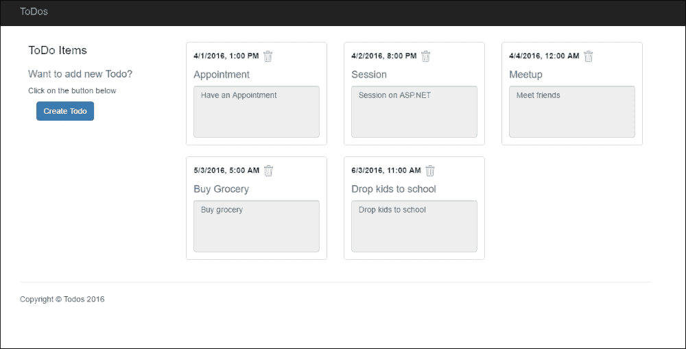
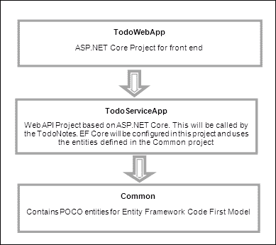
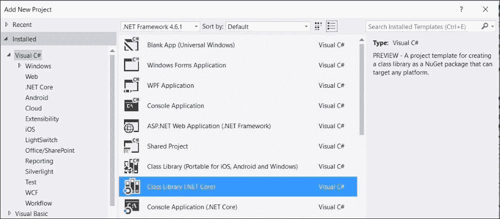
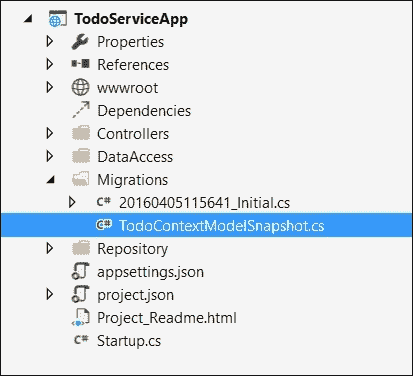
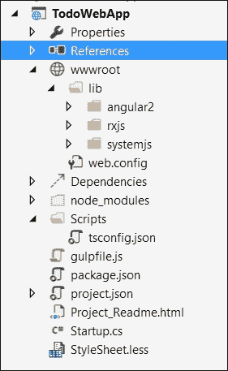
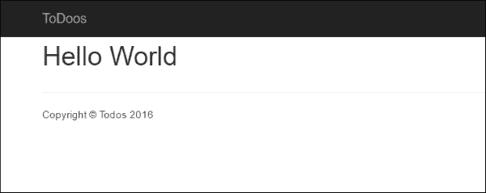
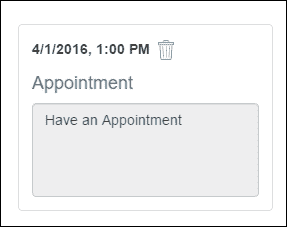

# 第五章：使用 Angular 2 和 Web API 开发 ASP.NET 应用程序

在本章中，我们将使用 MVC 6 在 ASP.NET Core 上开发一个完整的应用程序，使用 Web API 进行网络服务。对于客户端，我们将使用 Angular 2，这是客户端开发中最受欢迎的框架之一。Angular 2 是用 TypeScript 编写的，但它提供了用 JavaScript 和 Dart 编写代码的选项。在本章中，我们将使用 TypeScript，因为它遵循 ECMAScript 6 标准，并在构建项目时提供生成 ECMAScript 3，ECMAScript 4 和 ECMAScript 5 标准的 JavaScript 的能力。TypeScript 是 JavaScript 的超集，两者的大部分内容是相同的；实际上，TypeScript 提供了一些在许多浏览器中（除了 Mozilla Firefox）没有实现的 JavaScript 特性。

本章将重点介绍基本概念，并通过一个示例应用程序来介绍如何使用 Angular 2 与 ASP.NET Core 和 MVC 6 一起使用。

# TypeScript

TypeScript 是由微软开发的一种语言，是 JavaScript 的超集。TypeScript 在编译时转换成 JavaScript。Visual Studio 2015 会自动将 TypeScript 构建成 JavaScript 文件，并将其放在配置了`TypeScript.tsconfig`配置文件的文件夹中。它提供的功能远超过 JavaScript，但开发者仍然可以使用在 TypeScript 中使用的 JavaScript 中的某些类型和对象。然而，TypeScript 生成的代码更干净、更优化，然后由 Angular 2 框架执行。所以，当 TypeScript 编译时，它会生成 JavaScript 并存储一个映射文件以处理调试场景。假设你想从 Visual Studio 2015 调试你的 TypeScript 代码；这个映射文件包含了源 TypeScript 文件和生成的 JavaScript 文件在 Angular 页面中运行的映射信息，并且可以在 TypeScript 文件上设置断点。

## TypeScript 的编译架构

TypeScript 编译器通过几个阶段来编译 TypeScript 文件并生成 JavaScript 文件。

编译过程从预处理器开始，该预处理器通过遵循`/// <reference path=…/>`标签和`import`语句来确定需要包含哪些文件。一旦确定了文件，解析器就会解析和标记源代码到一个抽象语法树（AST）。

一个抽象语法树（AST）以树状节点的格式表示源代码的语法结构。绑定器然后遍历 AST 节点并生成和绑定符号。每个命名实体创建一个符号，如果有多个具有相同名称的实体，它们将具有相同的符号。

符号代表命名实体，如果找到多个声明，它会合并多个文件。为了表示所有文件的全局视图，构建了一个程序。程序是类型系统和代码生成的入口点。一旦创建了程序，就可以创建类型检查器和发射器。

类型检查器是 TypeScript 系统的核心部分，它将多个文件中的所有符号集中到一个视图中，并构建一个符号表。这个符号表包含了每个识别并合并成一个公共符号的符号的类型。类型检查器包含关于哪个符号属于哪个节点、特定符号的类型等完整信息。

最后，通过程序，TypeScript 编译器使用发射器（emitter）来生成输出文件：`.js`、`.js.map`、`.jxs` 或 `d.ts`。

## TypeScript 的优点

以下是一些使用 TypeScript 配合 Angular 2 的核心好处。

### JavaScript 的超集

TypeScript 是 JavaScript 的一个带类型超集，可以编译成 JavaScript。作为超集的基本优势在于，它提供了许多浏览器尚不支持的 JavaScript 最新特性。开发者在应用程序开发过程中使用诸如异步函数（async functions）、装饰器（decorators）等特性，这些特性编译后形成针对 ECMAScript 4 或 ECMAScript 3 版本的 JavaScript 文件，浏览器可以轻松理解和解释。

### 支持类和模块

TypeScript 支持 `class`、`interface`、`extends` 和 `implements` 关键字。

以下是 TypeScript 中如何定义类的示例：

```js
class Person {
  private personId: string = '';
  private personName: string = '';
  private dateOfBirth: Date;
  constructor() {}
  getPersonName(): string {
  return this.personName;
  }
  setPersonName(value): void {
  this.personName = value;
}}
```

以下是 TypeScript 编译成 JavaScript 的版本：

```js
var Person = (function () {
function Person() {
  this.personId = '';
  this.personName = '';
}
Person.prototype.getPersonName = function () {
  return this.personName;
};
Person.prototype.setPersonName = function (value) {
  this.personName = value;
};
  return Person;
})();
```

### 静态类型检查

使用 TypeScript 的主要好处是静态类型检查。当你构建你的项目时，TypeScript 编译器会检查语义，并在编译时给出错误以避免运行时错误。例如，以下代码将在编译时给出错误：

```js
var name: string
name =2;//give error
```

以下是一个在编译时扩展 `Person` 类并给出类型不匹配错误的示例：

```js
class Person {
  constructor(name: string) {
  }
}
class Employee extends Person{
  constructor() {
  super(2); //error 
  }
}
```

### 支持 ECMAScript 6 特性

在撰写本文时，大多数浏览器仍然不支持 ECMAScript 6 完全，但是有了 TypeScript，我们可以编写代码并使用 ECMAScript 6 特性。由于 ECMAScript 6 支持向后兼容，我们可以通过 TypeScript 配置文件设置目标版本，根据所指定的版本生成 JavaScript。这帮助开发者使用 ECMAScript 6 特性编写代码，生成的 JS 文件将基于 ECMAScript 3、ECMAScript 4 或 ECMAScript 5 标准。

### 可选类型

TypeScript 支持严格类型检查，并在编译时验证类型，但使用严格类型不是强制的。你甚至可以不指定变量的类型，在赋值时会解决它。

### 在 TypeScript 中声明类型

以下是没有声明变量类型的声明示例：

```js
private sNo = 1;
private text = 'Hello world';
```

以下是声明具有类型的变量的示例：

```js
private sNo: number = 1;
private text: string = 'Hello world';
```

## TypeScript 的核心元素

本节讨论 TypeScript 的核心元素：

+   声明变量

+   类型

+   类和接口

+   函数

+   迭代器

+   模块和命名空间

### 声明变量

变量声明与我们在 JavaScript 中做的相当。然而，由于 TypeScript 遵循 ECMAScript 6 标准，它也提供了强类型。强类型可以通过在变量名后加上冒号 (`:`) 和其类型来声明。

以下是在 JavaScript 中的一个简单变量声明：

```js
var name;
```

它可以在 TypeScript 中如下声明：

```js
var name: string;
```

变量可以通过以下方式在 TypeScript 中初始化：

```js
var name: string = "Hello World";    
```

### 类型

TypeScript 中大多数类型与 JavaScript 类型相当。以下表格包含所有可用类型的列表，以及使用它们的代码片段：

| 类型 | 描述 | 代码片段 |
| --- | --- | --- |
| 数字 | TypeScript 提供了一个数字类型，可以持有所有类型的十进制、十六进制、二进制和八进制值。 |

```js
let decimal: number = 2;
let hex: number = 0x001;
let binary: number = 0b1010;
let octal: number = 0o744;
```

|

| 字符串 | 这与我们在其他任何语言中使用的一样。字符串值可以用单引号或双引号括起来。 |
| --- | --- |

```js
let x: string = 'Hello';
let y: string = "Hello";
```

|

| 数组 | TypeScript 支持简单数组和泛型数组。 |
| --- | --- |

```js
let countries = ['US', 'UK', 'UAE'];
let countries<string> = ['US', 'UK', 'UAE'];
```

|

| 元组 | 通过元组，我们可以定义一个元素类型已知的数组。 |
| --- | --- |

```js
let val: [string, number, Date];
val = ['Hello World', 10, new Date()];
val[0];//print Hello World
```

|

| 枚举 | 用以给数值命名。默认情况下，指定的第一个值是 `0`，但可以显式设置为任何数字。 |
| --- | --- |

```js
enum Status {InProcess, Active, Ready, Success, Error}
let s: Status = Status.Active;
//specify values explicitly
enum Status {InProcess=1, Active=2, Ready=3, Success=4, Error=5}
```

|

| 任何 | 这个类型可以在不知道类型并且依赖于赋值的情况下使用。 |
| --- | --- |

```js
let x: any;
x=['Hello', 1, 2]; //tuple;
x=1; //number
x='Hello World'; //string
```

|

### 类和接口

以下是在 TypeScript 中定义接口、派生类和接口以及编写泛型类的方法。

#### 定义接口

就像 C# 一样，TypeScript 允许你定义接口，这些接口可以在 TypeScript 类中实现，并强制实现类实现接口中定义的所有成员。

以下是在 TypeScript 中定义接口的代码：

```js
interface IShape {
  shapeName: string;
  draw();
}
class TodoService implements IShape  {
  constructor(private http: Http) {
  this.shapeName = "Square";
  }

  shapeName: string;

  draw() {
  alert("this is " + this.shapeName);
  }
}
```

#### 派生类和接口

就像 C# 一样，类和接口可以通过从基类或接口派生来扩展。要扩展任何类，我们可以使用 `extends` 关键字，而对于接口，我们可以使用 implements，如下所示：

```js
interface IPerson {
  id: number;
  firstName: string;
  lastName: string;
  dateOfBirth: Date;
}

interface IEmployee extends IPerson{
  empCode: string;
  designation: string;
}

class Person implements IPerson {
  id: number;
  firstName: string;
  lastName: string;
  dateOfBirth: Date;
}

class Employee extends Person implements IEmployee {
  empCode: string;
  designation: string;
}
```

```js
IPerson and IEmployee. IPerson contains common properties such as id, firstName, lastName, and dateOfBirth, which can be used in all derived interfaces, such as IEmployee or any other.
```

然后，我们在 `Person` 类中实现了 `IPerson` 接口，最后从 `Person` 派生了 `Employee` 类并实现了 `IEmployee` 接口。如果你注意到了，由于 `Person` 类已经实现了 `IPerson` 接口，我们不需要再次实现它，只需要在 `Employee` 类中实现属性，比如 `empCode` 和 `designation`。

#### 泛型类

泛型类用于定义一个类型是泛型的特定类，并在调用时确定它的类型。泛型类可以通过使用 `<T>` 加上类名来定义。

以下是一个简单示例，展示了泛型类的过程，可以根据初始化时指定的类型工作。`getTypeInfo()` 方法将根据初始化的对象类型打印特定的消息：

```js
class Process<T>{
  value: T;
  getTypeInfo(){
  if (typeof this.value == "string")
    console.log("Type is a string");
  else if (typeof this.value == "number")
    console.log("Type is a number");
  else alert("type is unknown");

  }
}

let pString = new Process<string>();
pString.getTypeInfo(); //print Type is a string
let pNumber = new Process<number>();
pNumber.getTypeInfo(); //print Type is a number
```

### 函数

函数可以像 JavaScript 一样定义。TypeScript 支持命名和匿名函数。在 TypeScript 中，函数参数可以是类型参数，如下所示：

```js
function concat(x: string, y: string): string {
  return x +" "+ y; 
}
```

函数也可以有可选参数，并且可以使用`(?)`来声明，如下所示：

```js
function concat(x: string, y: string, z?: string): string {
  return x + " " + y + " " + z; 
}
```

有了这个选项，我们可以通过传递两个参数或三个参数来调用函数，因为第三个参数是可选的。

#### 泛型函数

TypeScript 允许你定义泛型函数，它接受任何类型的参数或返回类型。泛型函数可以通过在函数名后指定`<T>`来定义，如下面的代码所示，参数或返回类型也可以是泛型的，并引用相同的`T`类型。这对于定义接受所有类型参数并按预期工作的特定函数很有用。以下示例展示了基于参数类型进行字符串拼接或相加的函数过程：

```js
function process<T>(x: T, y: T): string{
  if (typeof x == "string")
  return x + " " + y;
  else if (typeof x == "number")
  return "Sum is: "+ x + y ;
  else 
  return "Type in unknown";
}
```

### 迭代器

除了 for、`while`等标准循环，TypeScript 还提供了两种 for 语句，`for..of`和`for..in`。这两种语句都用于遍历集合。这两种之间的区别在于，`for..of`语句返回对象的键，而`for..in`返回值：

```js
countries = ['USA', 'UK', 'UAE'];  
  //this loop will display keys 0, 1, 2
for (let index in this.countries) {
  console.log(index);
}
//this loop will display values USA, UK, UAE
for (let index of this.countries) {
  console.log(index);
}
```

### 模块和命名空间

ECMAScript 6 引入了模块的概念。模块可以被看作是具有自己作用域的逻辑容器。模块内部声明的任何类、变量或方法都局限于其自己的容器范围内，只有显式允许时才能被其他模块访问。在 TypeScript 中，任何包含导入或导出声明的文件都被视为模块。模块通过模块加载器相互导入，运行时模块加载器负责加载模块内定义的所有依赖项。模块可以通过使用`export`关键字导出，其他模块可以通过使用`import`关键字导入。

以下是在 TypeScript 中定义和导出一个模块的示例：

```js
//BaseManager.ts
export class BaseManager{
}
```

在其他区域使用模块需要使用`import`关键字，如下所示：

```js
//ServiceManager.ts
export class ServiceManager extends BaseManager{
}
```

可以通过使用`import`关键字导入模块。导入任何模块时，你必须使用`import`关键字，后面跟着类名的大括号`{}`，后面跟着包含类的实际文件名。例如，以下代码展示了将`ServiceManager`导入到`Main.ts`的方式：

```js
//Main.ts
import {ServiceManager} from "./ServiceManager"
```

我们也可以给类起一个友好的名字，如下所示：

```js
//Main.ts
import {ServiceManager as serviceMgr} from "./ServiceManager"
```

另一方面，命名空间是用来分类类、方法等的逻辑模块。就像 C#一样，它们可以使用`namespace`关键字来定义。一个命名空间可以跨越不同的 TypeScript 文件，这为开发者提供了一种方便的方式来将特定的文件分类到单个命名空间中。以下示例展示了如何将 TypeScript 文件分类到单个命名空间中并使用它们：

```js
//PersonManager.ts
namespace BusinessManagers{
  export class PersonManager{}
}
//SecurityManager.ts
namespace BusinessManagers{
  export class SecurityManager(){
}
}
//main.ts
/// <reference path="personmanager.ts" />
  ///  <reference path="SecurityManager.ts" />
personObj = new BusinessManagers.PersonManager();
securityObj =new BusinessManagers.SecurityManager();
```

如果你注意到了，我们使用了三斜线指令，它用于在执行 TypeScript 文件中的代码之前引用依赖文件。因此，由于这些文件存在于其他地方，我们不得不在前面的代码中显式引用它们。

总结来说，命名空间是比模块更好的使用方法，因为它们通过提供友好名称来逻辑地分类文件，并在处理中到大型项目时允许开发者正确地组织代码。

我们也可以给一个不友好的命名空间一个简短的名字，使用`import`关键词如下所示：

```js
namespace BusinessManagers {
  export class PersonManager {

  }
}

import mgr = BusinessManagers;
let personObj = new mgr.PersonManager();

To LC: Apply code to:
"namespace BusinessManagers {
  export class PersonManager {

  }
}

import mgr = BusinessManagers;
let personObj = new mgr.PersonManager();
```

所以这总结了 TypeScript 的核心主题。要了解更多关于 TypeScript 的信息，你可以参考[`www.typescriptlang.org/`](http://www.typescriptlang.org/)。

# Angular 2 简介

Angular 2 是一个用于构建网络应用程序的客户端框架。在移动端和网络平台的使用上非常灵活。使用 Angular 的一个基本优势在于它遵循 ECMAScript 6 标准，开发者可以进行面向对象编程，定义类和接口，实现类，并使用**普通旧 JavaScript 对象**（**POJO**）来绑定数据定义数据结构。在性能方面，单向数据流是一个很大的优势。与 Angular 1.x 不同，Angular 2 提供了双向数据绑定或单向数据绑定的选项。在某些情况下，单向绑定对性能有利。例如，提交表单时，与控件的双向绑定可能过于复杂。

## Angular 2 架构

Angular2 包含许多组件。每个组件可以通过选择器绑定到页面，例如`<my-app> </my-app>`，或者路由模块。每个组件都有一个选择器，模板 HTML 或模板引用链接，指令，提供程序，和一个控制器类，其属性和方法可以在关联视图中访问。当网络应用程序第一次启动时，`System.import`加载应用程序的主要组件，引导根组件。这是一个引导 Angular 应用的主组件示例：

```js
//Loading module through Import statement
Import {AppComponent} from 'path of my component'
bootstrap(AppComponent, [Providers]);
```

提供程序可以在方括号内定义。有各种可用的提供程序，我们将在后面的章节中讨论。

这个`bootstrap`对象在`angular2/platform/browser`中，可以用`import`命令导入 TypeScript 文件：

```js
import {bootstrap} from 'angular2/platform/browser';
```

这个`bootstrap`对象指导 Angular 加载其中定义的组件。当组件被加载时，组件的所有属性或元数据都被评估。每个组件都应该有`@Component`注解，一些定义组件元数据的属性，以及一个或多个被称作组件控制器的类，它们包含可以通过定义在`@Component 模板`或`templateUri`属性中的模板访问的属性和方法。

这是一个包含选择器、模板和类的`app.component.ts`示例，类名为`AppComponent`：

```js
//app.component.ts
import { Component, View} from 'angular2/core';
  import {bootstrap} from 'angular2/platform/browser';
  @Component({
  selector: "my-app",
  template: `<p>This is a first component</p>`,
  })  
  class AppComponent  {
  }
  bootstrap(AppComponent);
```

### 组件生命周期事件

当组件初始化时，它会经历几个事件，并有一个非常结构化的生命周期过程。我们可以实现这些事件来执行特定的操作。下面的表格展示了我们可以在组件控制器类中使用的 Events 列表：

| 事件 | 描述 |
| --- | --- |
| `ngOnInit()` | 组件初始化后且控制器构造函数执行时调用。 |
| `ngOnDestroy()` | 用于在组件被销毁时清理资源。 |
| `ngDoCheck()` | 用于覆盖指令的默认变更检测算法。 |
| `ngOnChanges(changes)` | 当组件选择器属性值中的任何一项被修改时调用。(选择器的自定义属性可以通过输入定义。) |
| `ngAfterContentInit()` | 当指令的内容被初始化时调用。(指令稍后定义。) |
| `ngAfterContentChecked()` | 每次检查指令的内容时都会被调用。 |
| `ngAfterViewInit()` | 当视图完全初始化时调用。 |
| `ngAfterViewChecked()` | 在每次检查组件视图时调用。 |

### 模块

模块代表一个包含类、接口等内容的容器，用于导出功能，以便其他模块可以使用`import`语句导入。例如，这是用于执行不同算术操作的 `math.ts`：

```js
//math.ts
import {Component} from 'angular2/core';
@Component({

})
export class MathService {
  constructor() {
  }
  public sum(a: number, b: number): number {
  return a + b;
  }
  public subtract(a: number, b: number): number {
  return a - b;
  }
  public divide(a: number, b: number): number {
  return a / b;
  }
  public multiply(a: number, b: number): number {
  return a * b;
  }
}
```

### 组件

组件是`@Component`注解定义元数据属性和相关控制器类的组合，该控制器类包含实际的代码，如类构造函数、方法和属性。`@Component`注解包含以下元数据属性：

```js
@Component({
  providers: string[],
  selector: string,
  inputs: string[],
  outputs: string[],
  properties: string[],
  events: string[],
  host: { [key: string]: string },
  exportAs: string,
  moduleId: string,
  viewProviders: any[],
  queries: { [key: string]: any },
  changeDetection: ChangeDetectionStrategy,
  templateUrl: string,
  template: string,
  styleUrls: string[],
  styles: string[],
  directives: Array < Type | any[] >,
  pipes: Array < Type | any[] >,
  encapsulation: ViewEncapsulation
})
```

## Angular 2 组件的核心属性

在定义组件时，我们可以指定各种属性，如前所述。在这里，我们将看到一些在创建 Angular 2 组件时通常需要的核心属性：

+   模板和选择器

+   输入和输出

+   指令

+   提供商

### 模板和选择器

下面的真实示例包含了在组件类中定义的模板和选择器。当按钮被点击时，它会调用`logMessage()`方法，该方法打印`<p>`元素中的消息。如果你注意到了，我们没有使用与类一起的`export`关键字，因为我们已经在同一个文件中引导了组件，而这个组件不需要在其他任何地方引用：

```js
import { Component, View } from 'angular2/core';
import {bootstrap} from 'angular2/platform/browser';
@Component({
  selector: "my-app",
  template: "<p> {{message}}</p><button (click)='logMessage()'>Log Message</button>"
})
class AppComponent {
  logMessage() {
    this.message = "Hello World";
  }
  message: string = "";
}
bootstrap(AppComponent);
```

应用选择器可以在 HTML 页面或 `index.cshtml` 页面中任何地方使用，如果是在 ASP.NET 项目中工作，并且模板将在其中渲染。以下是为自定义标签 `my-app` 使用的一个示例：

```js
<html>
<body>
  <my-app></my-app>
</body>
</html>
```

一旦页面运行，它将渲染以下生成的源输出的输出：

```js
<html>
<body>
  <p>Hello World</p>
  <button (click)='logMessage()'>Log Message</button>
</body>
</html>
```

### 输入和输出

```js
child.component.ts and contains the selector as child; the template displays the Boolean values of the logToConsole and showAlert attributes specified in the child tag. The inputs contain the list of string variables that will be defined as the child tag attributes:
```

```js
//child.component.ts
import { Component} from 'angular2/core';
@Component({
  selector: 'child',
  template: `<div> Log to Console: {{logToConsole}}, Show Alert: {{showAlert}} <button (click)="logMessage()" >Log</button> </div>`,
  inputs: ['logToConsole', 'showAlert'],
})
```

下面是包含`logToConsole`和`showAlert`布尔变量的`ChildComponent`类。这些变量实际上持有从通知标签传递的值。最后，我们有一个`logMessage()`方法，当按钮点击事件发生时将被调用，并根据在层次结构中由父组件设置的值，在开发者的控制台日志消息或显示一个警告消息：

```js
export class ChildComponent {
  public logToConsole: boolean;
  public showAlert: boolean;

  logMessage(message: string) {
    if (this.logToConsole) {
      console.log("Console logging is enabled");
    }
    if (this.showAlert) {
      alert("Showing alert message is enabled");
    }

  }
}
```

在`app.component.ts`文件中，我们定义了主要的`AppComponent`，我们可以像下面的代码那样使用子选择器。在定义子选择器时，我们可以为`ChildComponent`中定义的自定义输入`logToConsole`和`showAlert`设置值。这样，父组件就可以通过输入向子组件指定值。以下是`AppComponent`的完整代码：

```js
//app.component.ts
import { Component, View } from 'angular2/core';
import {bootstrap} from 'angular2/platform/browser';
import {ChildComponent} from './child.component';

@Component({
  selector: "my-app",
  template: `<child [logToConsole]=true [showAlert]=true></child>`,
  directives: [ChildComponent]
})
export class AppComponent {
}
bootstrap(AppComponent);
```

### 提示

```js
ChildComponent:
```

```js
  //child.component.ts
import { Component, EventEmitter, Output} from 'angular2/core';
@Component({
  selector: 'child',
  template: `<div> Log to Console: {{logToConsole}}, Show Alert: {{showAlert}}  <button (click)="logMessage()" >Log</button> </div>`,
  inputs: ['logToConsole', 'showAlert']
})
export class ChildComponent {
  public logToConsole: boolean;
  public showAlert: boolean;
  @Output() clickLogButton = new EventEmitter();

  logMessage(message: string) {
    this.clickLogButton.next("From child");
  }
}
```

`@Output`属性列出了`clickLogButton`作为`ChildComponent`可以发出的自定义事件，其父组件`AppComponent`将会接收。

我们在`import`语句中添加了`EventEmitter`。`EventEmitter`是随 Angular 一起提供的内置类，提供定义和触发自定义事件的方法。一旦执行了`logMessage()`方法，它将执行来自`ChildComponent`的`clickLogButton.next()`方法，最终调用`AppComponent`中注册的事件。

我们在`AppComponent`中添加了`clickLogButton`，如图下的代码所示。在 Angular 2 中，我们可以通过在括号`()`中指定事件名称，后跟当事件被触发时将被调用的方法，来指定事件。这就是事件注册的方式。在这里，`logMessage`是在`AppComponent`中定义的本地方法：

```js
(clickLogButton)="logMessage($event)"

Here is the code snippet for AppComponent:

  //app.component.ts 
import { Component, View } from 'angular2/core';
import {bootstrap} from 'angular2/platform/browser';
import {ChildComponent} from './child.component';

@Component({
  selector: "my-app",
  template: `<child [logToConsole]=true [showAlert]=true (clickLogButton)="logMessage($event)" ></child>`,
  directives: [ChildComponent]
})
export class AppComponent {

  logMessage(value) {
    alert(value);
  }
}
bootstrap(AppComponent);
```

`logMessage`方法是在从`ChildComponent`触发事件时将被调用的方法。

### 指令

指令是自定义标签，在运行时渲染 HTML，但将渲染内容封装在指令本身中。我们可以将其与 ASP.NET 中的标记帮助器相比较。指令分为三种：组件、结构型指令和属性指令：

+   **组件**：这是一个带有模板的指令。

+   **结构型指令**：这是一个用于添加或删除 DOM 元素的指令。Angular 提供了一些内置的结构型指令，如`ngIf`、`ngSwitch`和`ngFor`。

+   **属性指令**：它改变任何 DOM 元素的外观。

#### 创建一个简单的 Hello World 指令

指令可以像创建组件一样简单地创建，并且可以通过其选择器标签在调用组件中引用。

下面是`HelloWorldComponent`的示例，它定义了一个简单的指令，以标题格式显示“`Hello world`”消息：

```js
//helloworld.component.ts
import {Component} from 'angular2/core';

@Component({
  selector: "helloworld",
  template: "<h1>Hello world</h1>"
})

export class HelloWorldComponent {

}
```

下面的示例是使用此指令的组件。使用任何指令时，首先必须通过`import`语句导入，然后需要设置`@Component`元数据属性，才能在相关模板中访问它：

```js
import { Component, View, provide, Inject } from 'angular2/core';
  import {bootstrap} from 'angular2/platform/browser';
  import {HelloWorldComponent} from './helloworld.component';

  @Component({
    selector: "my-app",
    template: `<helloworld></helloworld>`,
    directives: [, HelloWorldComponent],
  })
  export class AppComponent{

  }
  bootstrap(AppComponent);
```

此指令可以在页面上的使用如下：

```js
<helloworld></helloworld>
```

### 结构指令

结构指令可以用来添加或移除 DOM 元素。例如，我们可以通过`*ngFor`添加一个国家列表作为表格，如下面的代码所示，并通过`*ngIf`指令隐藏或显示 div：

```js
  <div *ngIf="display">
    <table>
      <thead>
        <tr>
          <th>
            Country
          </th>
          <th>
            Currency
          </th>
        </tr>
      </thead>
      <tbody *ngFor="#country of countries">
        <tr><td>{{country.CountryName}}</td><td>{{country.Currency}}</td></tr>
      </tbody>
    </table>
  </div>
```

以下是后端`countries.component.ts`文件，它使用 HTTP 模块调用 ASP.NET Web API 服务。它返回一个国家列表，分配给`countries`数组。`display`的默认值设置为`true`，生成表格。通过将`display`值设置为`false`，将不会生成表格：

```js
///<reference path="../../node_modules/angular2/typings/browser.d.ts" />
import {Component} from 'angular2/core';
import {Http, Response} from 'angular2/http';

@Component({
  selector: 'app',
  templateUrl: 'Countries'
})
export class TodoAppComponent {
  countries = [];
  display: boolean = true;
  //constructor
  constructor(private http: Http) {
  }

  //Page Initialized Event Handler
  ngOnInit() {
    this.getCountries();
  }
  getCountries() {
    this.http.get("http://localhost:5000/api/todo").map((res: Response) => res.json())
      .subscribe(data => {
        this.countries = data;
      },
      err => console.log(err),
      () => console.log("done")
      );
  }

}
```

这就是如何在 Angular 2 中使用结构指令。在下一章中，我们将开发一个示例应用程序，并讨论每个艺术品以使用 Angular 2 进行 HTTP `GET`和`POST`请求。

### 属性指令

属性指令需要构建一个用`@Directive`注解标记的控制器类，并定义一个选择器来识别与它关联的属性。在下面的示例中，我们将开发一个简单的`myFont`指令，当它应用于任何页面元素时，会将文本更改为斜体。以下是`font.directive.ts`文件的内容：

```js
import { Directive, ElementRef, Input } from 'angular2/core';
@Directive({ selector: '[myFont]' })
export class FontDirective {
  constructor(el: ElementRef) {
    el.nativeElement.style.fontStyle = 'italic';
  }
}
```

```js
myFont directive applied.
```

在页面级别，它可以如下使用：

```js
<p myFont>myFont is an Attribute directive</p>
```

### 提供者

提供者用于注册通过 Angular 2 的依赖注入框架实例化的类型。当组件初始化时，Angular 创建一个依赖注入器，它注册提供者数组中指定的所有类型。然后在构造函数级别，如果提供者数组中有任何类型，它将得到初始化并在构造函数中注入。

下面的示例是`MathComponent`，它将被注入到主应用组件构造函数中，并调用 sum 方法将两个数字相加：

```js
//math.component.ts
import { Component } from 'angular2/core';
@Component({})

export class MathComponent {

  public sum(a: number, b: number) : number{
    return a + b;
  }
  public divide(a: number, b: number): number {
    return a / b;
  }
  public subtract(a: number, b: number): number {
    return a - b;
  }
  public multiply(a: number, b: number): number {
    return a * b;
  }

}
```

下面的例子是`AppComponent`，展示了如何导入一个`math`组件，然后定义提供者并在构造函数级别注入它：

```js
//app.component.ts
import { Component, View } from 'angular2/core';
import {bootstrap} from 'angular2/platform/browser';
import {MathComponent} from './servicemanager.component';
  @Component({
    selector: "my-app",
    template: "<button (click)="add()" >Log</button>",
    providers: [MathComponent]
  })  
  export class AppComponent  {
    obj: MathComponent;
    constructor(mathComponent: MathComponent) {
      this.obj = mathComponent;
    }
    public add() {
      console.log(this.obj.sum(1, 2));
    }
  }
  bootstrap(AppComponent);
```

还可以用稍微不同的方式通过注入 Angular 模块注入其他基本类型。我们还可以使用`provide`关键字定义一个类型，它需要一个键和值：

```js
providers: [provide('Key', {useValue: 'Hello World'})]
```

前面的语法也可以在提供程序中定义类型时使用，如下所示：

```js
providers: [provide(MathComponent, {mathComponent: MathComponent })]
```

定义`providers`时使用`provide`关键字的一个主要好处是在测试时。在测试应用程序时，我们可以用模拟或测试组件替换实际组件。例如，假设我们有一个类，它通过某种付费网关调用短信服务发送短信，在测试周期中我们不想使用生产短信网关组件，而是希望有一个自定义的测试组件，它只是将短信插入到本地数据库中。在这种情况下，我们可以将某个模拟类，如`SMSTestComponent`，与测试场景关联。

以下示例将字符串值注入到构造函数中。我们需要按照以下代码添加 Inject 模块，然后使用`@Inject`注入与键关联的值：

```js
  //app.component.ts
import { Component, View, provide, Inject } from 'angular2/core';
  import {bootstrap} from 'angular2/platform/browser';
  import {MathComponent} from './servicemanager.component';
  @Component({
    selector: "my-app",
    template: `button (click)="logMessage()" >Log</button>`,
    providers: [MathComponent, provide('SampleText', {useValue: 'Sample Value'})]
  })
  export class AppComponent{
    obj: MathComponent;
    Val: string;
    constructor(mathComponent: MathComponent, @Inject('SampleText') value) {
      this.obj = mathComponent;
      this.Val = value;
    }

  public logMessage() {
    alert(this.kVal);
  }
  }
  bootstrap(AppComponent);
```

## 在 Angular 中的依赖注入

```js
MathComponent in the providers array of the ChildComponent, and as it is defined in the ParentComponent, it is already injected by the Angular dependency injection module.
AppComponent (parent):
```

```js
  //app.component.ts
  import { Component} from 'angular2/core';
  import {bootstrap} from 'angular2/platform/browser';
  import {MathComponent} from './servicemanager.component';
  import {ChildComponent} from './child.component';
  @Component({
    selector: "my-app",
    template: `<button (click)="callChildComponentMethod()">Log</button>`,
    providers: [MathComponent, ChildComponent]
  })
  export class AppComponent  {
    childObj: ChildComponent;
      constructor(childComponent: ChildComponent) {
      this.childObj = childComponent;

  }
    public callChildComponentMethod() {
      this.childObj.addNumbers(1, 2);   

    }
  }
  bootstrap(AppComponent);
```

```js
MathComponent, which contains some basic arithmetic operations:
```

```js
//math.component.ts
import { Component } from 'angular2/core';
@Component({})
export class MathComponent {

  public sum(a: number, b: number) : number{
    return a + b;
  }
  public divide(a: number, b: number): number {
    return a / b;
  }
  public subtract(a: number, b: number): number {
    return a - b;
  }
  public multiply(a: number, b: number): number {
    return a * b;
  }
}
```

最后，以下是`ChildComponent`的代码，其中没有在`providers`数组中定义`MathComponent`提供者：

```js
//child.component.ts
import {Component} from 'angular2/core';
import {MathComponent} from './servicemanager.component';
@Component({
  selector: 'child-app',
  template: '<h1>Hello World</h1>'
})
export class ChildComponent {
  obj: MathComponent;
  constructor(mathComponent: MathComponent) {
    this.obj = mathComponent;
  } 
  public addNumbers(a: number, b: number) {
    alert(this.obj.sum(a, b));
  }
}
```

## Angular 中的路由

在处理大型应用程序时，路由起着至关重要的作用。路由用于导航到不同的页面。路由可以在三个步骤中定义：

1.  在任何组件级别定义`@RouteConfig`：

    ```js
    @RouteConfig([
      { path: '/page1', name: 'Page1', component: Page1Component, useAsDefault: true },
      { path: '/page2', name: 'Page2', component: Page2Component }]
    )
    ```

1.  在锚点 HTML 标签上使用`[routerLink]`属性，并指定在`@RouteConfig`中配置的路由名称。

1.  最后，添加`<router-outlet>`标签以在当前导航到的路劲上渲染页面。

以下示例包含两个组件，`Page1Component`和`Page2Component`，主`AppComponent`定义了如下路由：

```js
//app.component.ts
import {Component} from 'angular2/core';
import {RouteConfig, ROUTER_DIRECTIVES} from 'angular2/router';
import {Page1Component} from './page1.component';
import {Page2Component} from './page2.component';

@Component({
  selector: "my-app",
  template: `{{name}}
    <a [routerLink]="['Page2']">Page 2</a>
    <router-outlet></router-outlet>`,
  directives: [ROUTER_DIRECTIVES],
})
@RouteConfig([
  { path: '/', name: 'Page1', component: Page1Component, useAsDefault:true },
  { path: '/page2', name: 'Page2', component: Page2Component }]
)
export class AppComponent {
}
```

在前面的代码中，我们首先从`angular2/router`导入`RouteConfig`和`ROUTER_DIRECTIVES`，然后为页面 1 和页面 2 定义`RouteConfig`。在内联模板中，我们放置了锚点标签并为页面 2 定义了路由名称。当应用程序运行时，页面 1 被设置为根路径`/`上的默认页面，因此将在路由出口处显示页面 1 内容。当用户点击`Page2`链接时，将在同一位置渲染页面 2 的内容。

以下是`page1.component.ts`的代码：

```js
//page1.component.ts
import {Component} from 'angular2/core';
@Component({
  template:'<h1>Page1 Content</h1>'
})
export class Page1Component {
}
```

以下是`page2.component.ts`的代码：

```js
//page2.component.ts
import {Component} from 'angular2/core';

@Component({
  template: '<h1>Page2 Content</h1>'
})

export class Page2Component {
}
```

# 在 ASP.NET Core 中开发待办事项应用程序

我们已经学习了 Angular 2 的核心功能以及如何用 TypeScript 编写程序。现在该是用 Angular 2 和 ASP.NET Core 开发一个简单的待办事项应用程序的时候了。ASP.NET Core 是微软最新的网络开发平台，它比之前的 ASP.NET 版本更加优化和模块化。它提供了一种使用全局.NET Framework 的选项，或者是一个新的.NET Core，它基于应用程序运行，甚至包含在发布的 Web 应用程序文件夹中的框架二进制文件。使用新的 ASP.NET Core，我们不再依赖 IIS 来运行我们的应用程序，还有其他几种服务器可供跨平台使用 Kestrel。要了解更多关于 ASP.NET Core 的信息，请参考[`docs.asp.net`](http://docs.asp.net)。

我们将通过一个逐步教程来构建一个可用的待办事项应用程序。下面的屏幕截图展示了主页的一个快照。用户登录后，它会显示所有可用的待办事项列表。用户可以通过点击**创建待办事项**按钮来添加一个新的待办事项，也可以删除现有的待办事项。在本章中，我们不会涵盖安全认证和授权模块，而是专注于如何使用 Angular 2 与 ASP.NET Core：



在这个应用程序中，我们将有三个项目。`TodoWebApp`调用`TodoServiceApp`，`Common`被 Web API 使用，包含实体模型。以下图表显示了如何开发这三个项目以及配置和使用 Angular 2：



## 创建一个 Common 项目

`Common`项目包含 Entity framework 将使用的实体，以便创建数据库。稍后我们在 Web API 项目中引用这个程序集：

1.  创建.NET Core 类库项目：

1.  添加一个新文件夹`Models`，并添加一个`TodoItem`类如下：

    ```js
    using System;
    using System.Collections.Generic;
    using System.Linq;
    using System.Threading.Tasks;

    namespace Common
    {
      public class TodoItem
      {
        public int Id { get; set; }
        public string Title { get; set; }
        public string Description { get; set; }
        public DateTime DueDateTime { get; set; }
        public int UserId { get; set; }
      }
    }
    ```

    前面的`TodoItem`类包含`Id`（主键）和`Title`、`Description`、`DueDateTime`以及`UserID`，用于为特定用户保存待办事项。

## 创建一个 TodoServiceApp 项目

在这个项目中，我们将创建一个 Web API，它将引用包含`TodoItem` POCO 模型的`Common`项目。在这个项目中，我们将公开服务并创建一个数据库仓库，该仓库将使用 Entity Framework Core 在 Microsoft SQL Server 数据库中执行**创建、读取**、**更新**和**删除**（**CRUD**）操作：

1.  创建一个新的 Web API 项目，选择 ASP.NET Core 模板。Web API 和 ASP.NET MVC 已经合并为一个统一的框架，因此没有单独的 Web API 项目模板。在这种情况下，我们将使用 ASP.NET Core 项目模板中的空项目模型。

1.  打开`project.json`并添加对我们的`Common`程序集的引用：

    ```js
    "dependencies": {
      "Microsoft.NETCore.App": {
        "version": "1.0.0-rc2-3002702",
        "type": "platform"
      },
      "Microsoft.AspNetCore.Server.IISIntegration": "1.0.0-rc2-final",
      "Microsoft.AspNetCore.Server.Kestrel": "1.0.0-rc2-final",
      "Common": "1.0.0-*"
    }
    ```

### 在 Web API 项目中启用 MVC

为了启用 MVC 项目，我们必须在`ConfigureServices`方法中调用`AddMvc()`，在`Configure`方法中调用`UseMvc()`：

1.  在`project.json`中添加 MVC 包：

    ```js
    "Microsoft.AspNetCore.Mvc": "1.0.0-rc2-final"
    ```

1.  从`ConfigureServices`方法中调用`AddMvc()`：

    ```js
    public void ConfigureServices(IServiceCollection services)
      {
        services.AddMvc();
      }
    ```

1.  最后，从`Configure`方法中调用`UseMvc()`：

    ```js
    public void Configure(IApplicationBuilder app)
      {
        app.UseMvc();
      }
    ```

### 安装 Entity Framework

以下是在项目中安装 Entity Framework 的步骤：

1.  添加两个 Entity Framework 程序集，`Microsoft.EntityFrameworkCore.SqlServer`和`Microsoft.EntityFrameworkCore.Tools`，如下所示：

    ```js
      "dependencies": {
      "Microsoft.NETCore.App": {
        "version": "1.0.0-rc2-3002702",
        "type": "platform"
      },
      "Microsoft.AspNetCore.Server.IISIntegration": "1.0.0-rc2-final",
      "Microsoft.AspNetCore.Server.Kestrel": "1.0.0-rc2-final",
      "common": "1.0.0-*",
      "Microsoft.AspNetCore.Mvc": "1.0.0-rc2-final",
      "Microsoft.EntityFrameworkCore.SqlServer": "1.0.0-rc2-final",
      "Microsoft.EntityFrameworkCore.Tools": {
        "type": "build",
        "version": "1.0.0-preview1-final"
      }
    }
    ```

### 添加 AppSettings 以存储连接字符串

ASP.NET Core 为存储应用程序设置提供了各种选项。默认的配置文件现在是`appsettings.json`，以 JSON 格式存储数据。然而，还有其他方法可用于将数据存储在环境变量、XML 和 INI 格式中。在这个项目中，我们将把连接字符串存储在`appsettings.json`文件中：

1.  添加 ASP.NET 配置文件`appsettings.json`并指定连接字符串如下：

    ```js
    {
      "Data": {
        "DefaultConnection": {
          "ConnectionString": "Data Source =.; Initial Catalog = tododatabase; Integrated Security = True;MultiSubnetFailover = False; "
        }
      }
    }
    ```

1.  在`project.json`中添加以下包：

    ```js
    "Microsoft.Extensions.Configuration.Json": "1.0.0-rc2-final",
    "Microsoft.Extensions.Options.ConfigurationExtensions": "1.0.0-rc2-final",
    ```

### 在 Startup 类中配置 AppSettings

ASP.NET Core 的新配置系统基于`System.Configuration`。为了在我们的项目中使用设置，我们将在我们的`Startup`类中实例化一个`Configuration`对象，并使用`Options`模式访问个别设置。

`Options`模式将任何类转换为设置类，然后我们可以通过 ASP.NET 内置的依赖注入将该类注入到控制器中。通过`options`类，开发者可以访问设置键和值，如下所示：

1.  在`Startup`类构造函数中，我们将使用`ConfigurationBuilder`对象添加`appsettings.json`文件。`ConfigurationBuilder`允许添加不同的提供程序，并有一个构建方法，该方法在不同提供程序中构建配置存储，并返回`IConfigurationRoot`实例：

    ```js
    public Startup()
      {
        // Set up configuration sources.
        var builder = new ConfigurationBuilder()
          .AddJsonFile("appsettings.json")
        Configuration = builder.Build();
      }

      public IConfigurationRoot Configuration { get; set; }
    ```

    ### 提示

    如果多个提供程序有相同的键，将使用在`ConfigurationBuilder`中指定的最后一个。

1.  现在我们可以使用`Configuration`属性来访问连接字符串，如下所示：

    ```js
    Configuration["Data:DefaultConnection:ConnectionString"];
    ```

### 在 Web API 中添加数据访问

在本节中，我们将添加一个`TodoContext`和`TodoRepository`类来执行 CRUD 操作：

1.  添加一个新文件夹，`DataAccess`，并添加`TodoContext`类，该类将从`DbContext`类派生。这是 Entity Framework 用于创建数据库的主要`TodoContext`类：

    ```js
    using Common;
    using Microsoft.Data.Entity;
    using System;
    using System.Collections.Generic;
    using System.Linq;
    using System.Threading.Tasks;

    namespace TodoServiceApp.DataAccess
    {
      public class TodoContext : DbContext
      {
        public DbSet<TodoItem> TodoItem { get; set; }
      }
    }
    ```

1.  我们现在需要覆盖`OnConfiguring()`方法，并调用`DbContextOptionsBuilder`对象的`UseSqlServer()`方法。每次`Context`对象被初始化时都会调用`OnConfiguring()`方法，它配置了指定的选项。`UseSqlServer()`方法接收在`appsettings.json`文件中定义的连接字符串，我们已在`Startup`类中对其进行了配置。现在我们想要将 app 设置对象注入到这个类中。为此，我们将使用`Options`模式。根据选项模式，我们不应该直接使用在`Startup`类中定义的`Configuration`属性，而是将创建一个包含我们 app 设置文件中相同键的定制 POCO 类，并重载默认的`TodoContext`构造函数，该构造函数接受`IOptions<T>`，其中`T`是我们的自定义 POCO 应用设置类。

1.  因为连接字符串定义在一个嵌套对象中，所以我们的`Data`类将是这样的：

    ```js
    using System;
    using System.Collections.Generic;
    using System.Linq;
    using System.Threading.Tasks;

    namespace TodoServiceApp
    {
      public class Data
      {
        public DefaultConnection DefaultConnection { get; set; }
      }

      public class DefaultConnection {

        public string ConnectionString { get; set; } 
      }
    }
    ```

1.  在`Startup`类中，我们将调用`services.Configure()`方法，用`appsettings.json`文件中指定的键填充这个`Data`对象，并在我们接下来要创建的存储库中注入它。

1.  创建一个`TodoRepository`类，其中包含一个`ITodoRepository`接口及其实现，`TodoRepository`。这个类将使用`TodoContext`对象执行数据库操作。以下是`TodoRepository`类的代码片段：

    ```js
    using Common;
    using System;
    using System.Collections.Generic;
    using System.Linq;
    using System.Threading.Tasks;
    using TodoServiceApp.DataAccess;

    namespace TodoServiceApp.Repository
    {
      public interface ITodoRepository
      {
        void CreateTodo(TodoItem todoItem);
        void DeleteTodo(int todoItemId);
        List<TodoItem> GetAllTodos(int userId);
        void UpdateTodo(TodoItem todoItem);
      }

      public class TodoRepository : ITodoRepository
      {
        private TodoContext context;
        public TodoRepository()
        {
          context = new TodoContext();
        }
        public List<TodoItem> GetAllTodos(int userId)
        {
          return context.TodoItems.ToList();
        }
        public void CreateTodo(TodoItem todoItem)
        {
          context.TodoItems.Add(todoItem);
          context.SaveChanges();
        }
        public void DeleteTodo(int todoItemId)
        {
          var item = context.TodoItems.Where(i => i.Id == todoItemId).FirstOrDefault();
          context.Remove(item);
          context.SaveChanges();
        }
        public void UpdateTodo(TodoItem todoItem)
        {
          context.Update(todoItem);
          context.SaveChanges();
        }

      }
    }
    ```

1.  在`Startup`类中，在`ConfigureServices()`方法中添加实体框架，如下面的代码所示。我们的 Web API 控制器将有一个带参数的构造函数，接收`ITodoRepository`对象。我们将使用`services.AddScoped()`方法在需要`ITodoRepository`的地方注入`TodoRepository`。最后，调用`services.Configure()`方法，用`appsettings.json`文件中指定的键填充`Data`对象：

    ```js
    public void ConfigureServices(IServiceCollection services)
    {
      string connString = Configuration["Data:DefaultConnection:ConnectionString"];
      services.AddDbContext<TodoContext>(options => options.UseSqlServer(connString));

      services.AddMvc();

      services.AddScoped<ITodoRepository, TodoRepository>();
      services.Configure<Data>(Configuration.GetSection("Data"));

    }
    ```

### 在 ASP.NET Web API 中启用 CORS

在前一章中，我们学习了 CORS；我们必须在我们的 Web API 项目中启用 CORS，这样从 Angular 服务中我们就可以请求访问`TodoService`方法：

1.  在`Startup`类的`ConfigureServices`方法中调用`services.AddCors()`：

    ```js
    services.AddCors(options => { options.AddPolicy("AllowAllRequests", builder => builder.AllowAnyOrigin().AllowAnyMethod().AllowAnyHeader()); });
    ```

1.  在`Startup`类的`Configure`方法中调用`app.UseCors()`：

    ```js
    app.UseCors("AllowAllRequests");
    ```

### 运行数据库迁移

我们使用实体框架代码优先模型，所以现在我们想在 Microsoft SQL Server 中创建一个数据库。为此，我们首先将在`TodoServiceApp`的`project.json`文件中添加实体框架工具支持，然后运行.NET CLI 命令以添加迁移并创建数据库：

1.  在`project.json`文件中添加`Microsoft.EntityFrameworkCore.Tools`，如下所示：

    ```js
    "tools": {
      "Microsoft.AspNetCore.Server.IISIntegration.Tools": {
        "version": "1.0.0-preview1-final",
        "imports": "portable-net45+win8+dnxcore50"
      },
      "Microsoft.EntityFrameworkCore.Tools": {
        "imports": [ "portable-net451+win8" ],
        "version": "1.0.0-preview1-final"
      }
      },
    ```

1.  现在我们可以运行命令，创建迁移并更新数据库。

1.  要创建迁移，请打开命令提示符，导航到包含`project.json`的`TodoServiceApp`项目中。

1.  然后，运行`dotnet ef migrations add Initial`命令，其中`Initial`是创建的迁移的名称。运行此命令将在`Migrations`文件夹中添加一个包含有关 DDL 操作的代码的类。

    下面的屏幕快照显示了在运行前面的命令后创建的`Migrations`文件夹，以及创建的`20160405115641_Initial.cs`文件，该文件包含实际迁移代码片段，用于从数据库应用或移除迁移：

    

1.  要创建数据库，我们需要在`TodoServiceApp`项目的`project.json`文件所在的同一目录中执行另一个命令：

    ```js
    dotnet ef database update –verbose 

    ```

1.  这将创建一个数据库，然后我们可以添加一个控制器来处理不同的 HTTP 请求并访问数据库。

### 创建控制器

按照以下步骤创建一个控制器：

1.  在项目中添加一个新的`Controllers`文件夹，并添加一个名为`TodoController`的类。

1.  以下是对`TodoController`类的代码片段：

    ```js
    using System;
    using System.Collections.Generic;
    using System.Linq;
    using System.Threading.Tasks;
    using Microsoft.AspNetCore.Mvc;
    using Common;
    using TodoServiceApp.Repository;

    namespace TodoApi.Controllers
    {
      [Route("api/[controller]")]
      public class ToDoController : Controller
      {
        ITodoRepository repository;
        public ToDoController(ITodoRepository repo)
        {
          repository = repo;
        }
        // GET: api/values
        [HttpGet]
        public IEnumerable<string> Get()
        {
          return repository.GetAllTodos();
        }
        // GET api/values/5
        [HttpGet("{id}")]
        public IEnumerable<TodoItem> Get(int id)
        {
          return repository.GetAllTodos(id);
        }
        // POST api/values
        [HttpPost]
        public void Post([FromBody]TodoItem value)
        {
          repository.CreateTodo(value);
        }
        // PUT api/values/5
        [HttpPut("{id}")]
        // DELETE api/values/5
        [HttpDelete("{id}")]
        public void Delete(int id)
        {
          repository.DeleteTodo(id);
        }
      }
    }
    ```

现在我们已经完成了`TodoService`项目，接下来我们将开发一个待办事项网页应用程序项目，并配置 Angular 2。

## 创建 TodoWebApp 项目

我们将开发一个单页应用程序，并使用 MVC 视图用 Angular 2 渲染它。这个应用程序将有一个主要页面，列出特定用户的全部待办事项，而要添加一个新的待办事项，新的页面将在模态对话框窗口中打开：

1.  首先，让我们使用 Visual Studio 2015 中可用的 ASP.NET Core 项目模板创建一个空项目，并将其命名为`TodoWebApp`。

1.  在`project.json`中添加 MVC 参考：

    ```js
    "Microsoft.AspNetCore.Mvc": "1.0.0-rc2-final",
    "Microsoft.AspNetCore.StaticFiles": "1.0.0-rc2-final",
    ```

1.  在`Startup`类中，在`ConfigureServices`方法中添加`AddMvc()`方法，在`Configure`方法中添加`UseMvc()`方法。以下是`Startup`类的代码片段：

    ```js
    namespace TodoWebApp
    {
      public class Startup
      {
        // This method gets called by the runtime. Use this method to add services to the container.
        // For more information on how to configure your application, visit http://go.microsoft.com/fwlink/?LinkID=398940
        public void ConfigureServices(IServiceCollection services)
        {
          services.AddMvc();
        }
        // This method gets called by the runtime. Use this method to configure the HTTP request pipeline.
        public void Configure(IApplicationBuilder app)
        {
          app.UseStaticFiles();
          app.UseMvc(routes =>
          {
            routes.MapRoute(name: "default", template: "{controller=Home}/{action=Index}/{id?}");
        }
    }
    ```

### 在 TodoWebApp 项目中配置 Angular 2

Angular 2 是 Node 模块的一部分，我们可以通过**Node 包管理器**（**NPM**）配置文件`package.json`添加 Node 包。在`package.json`中，我们可以在`devDependencies`节点和`dependencies`节点添加包。`devDependencies`节点包含开发过程中使用的包，例如`Gulp`，它可以用来合并和压缩 JavaScript 和 CSS 文件，TypeScript 用于开发 Angular 2 组件，以及`rimraf`用于删除文件。在`dependencies`节点中，我们将指定如`angular2`、`systemjs`、`reflect-metadata`、`rxjs`和`zone.js`等包，这些包在应用程序运行时使用：

1.  从 Visual Studio 项目模板选项**NPM 配置文件**中添加一个新的`package.json`文件，并添加以下 JSON 片段：

    ```js
    {
      "name": "ASP.NET",
      "version": "0.0.0",
      "dependencies": {
      "angular2": "2.0.0-beta.9",
      "systemjs": "0.19.24",
      "reflect-metadata": "0.1.3",
      "rxjs": "5.0.0-beta.2",
      "zone.js": "0.6.4"
      },
      "devDependencies": {
        "gulp": "3.8.11",
        "typescript": "1.8.7",
      }
    }
    ```

1.  视觉工作室会自动下载并恢复`package.json`文件中指定的包，在项目本身创建一个`node_modules`文件夹，并将所有的包放在那里。`Node_modules`文件夹在视觉工作室中默认是隐藏的，但可以通过启用`ShowAllFiles`选项使其可见。

### 依赖项

以下是带有描述的依赖项列表：

+   `angular2`：这是 Angular 2 的包。

+   `systemjs`：它提供了`System.import`来连接 Angular 的主入口点。

+   `reflect-metadata`：这是一个添加装饰器到 ES7 的提案。通过这个，我们可以在 Angular 2 中指定我们类的元数据。

+   `rxjs`：它是一个反应式流库，允许处理异步数据流。

+   `zone.js`：它提供了一个在异步任务之间持续存在的执行上下文。

#### 开发依赖项

以下是开发依赖项及其描述的列表：

+   `gulp`：用于将文件复制到`wwwroot`文件夹

+   `typescript`：用于编写 TypeScript 程序

#### 配置 TypeScript

配置 TypeScript，请执行以下步骤：

1.  添加一个`Scripts`文件夹，其中包含所有 TypeScript 文件。在当前版本的 ASP.NET 中，对命名此文件夹`Scripts`有一个限制，它应该添加到项目的根目录中；否则，TypeScript 文件将不会被转换成 JavaScript 文件。

1.  添加`Scripts`文件夹后，添加 TypeScript 配置文件（`tsconfig.json`）并在其中添加以下配置：

    ```js
    {
      "compilerOptions": {
      "noImplicitAny": false,
      "noEmitOnError": true,
      "removeComments": false,
      "sourceMap": true,
      "target": "es5",
      "module": "commonjs",
      "moduleResolution": "node",
      "outDir": "../wwwroot/todosapp",
      "mapRoot": "../scripts",
      "experimentalDecorators": true,
      "emitDecoratorMetadata": true
      },
      "exclude": [
        "node_modules",
        "wwwroot"
      ]
    }
    ```

`compilerOptions`节点中定义的配置在您构建项目时被 Visual Studio 使用。根据配置，JavaScript 文件被生成并存储在输出目录中。以下表格展示了前述代码中每个属性的描述：

| 编译器选项 | 描述 |
| --- | --- |
| `noImplicitAny` | 如果为`true`，则警告隐含`any`类型的表达式 |
| `noEmitOnError` | 如果为`true`，则在 TypeScript 中存在错误时不会生成 JavaScript |
| `removeComments` | 如果为`true`，在生成 JavaScript 文件时移除注释 |
| `sourceMap` | 如果为`true`，则生成相应的映射文件 |
| `Target` | 设置目标 ECMA 脚本版本，如 ES5 |
| `modulez` | 指定生成代码的模块，如 `commonjs`、`AMD` 或 `system` |
| `moduleResolution` | 指定模块解析策略，如 node |
| `outDir` | 生成的 JavaScript 文件将被倾倒的路径 |
| `mapRoot` | 地图文件将位于的路径 |
| `experimentalDecorators` | 如果为`true`，则启用对 ES7 实验性装饰器的支持 |
| `emitDecoratorMetadata` | 如果为`true`，则在源中为装饰器声明发射设计类型的元数据 |

#### 配置 Gulp

在本节中，我们将使用 Gulp 对 TypeScript 编译器生成的 JavaScript 进行压缩：

1.  添加 Gulp 配置文件`gulpfile.js`。

1.  Gulp 用于运行任务，Visual Studio 提供了一个任务运行窗口，列出了`gulpfile.js`中指定的所有任务，还允许我们将这些任务绑定到构建事件。

1.  在`gulpfile.js`中添加以下脚本：

    ```js
    /// <binding Clean='clean' />
    "use strict";

    var gulp = require("gulp")

    var paths = {
      webroot: "./wwwroot/"
    };
    var config = {
      libBase: 'node_modules',
      lib: [
        require.resolve('systemjs/dist/system.js'),
        require.resolve('systemjs/dist/system.src.js'),
        require.resolve('systemjs/dist/system-polyfills.js'),
        require.resolve('angular2/bundles/angular2.dev.js'),
        require.resolve('angular2/bundles/angular2-polyfills.js'),
        require.resolve('angular2/bundles/router.dev.js'),
        require.resolve('angular2/bundles/http.dev.js'),
        require.resolve('angular2/bundles/http.js'),
        require.resolve('angular2/bundles/angular2'),
        require.resolve('rxjs/bundles/Rx.js')
      ]
    };
    gulp.task('build.lib', function () {
      return gulp.src(config.lib, { base: config.libBase })
      .pipe(gulp.dest(paths.webroot + 'lib'));
    });
    ```

在前面的`gulpfile.js`中，我们首先声明了 Gulp 的对象。然后路径变量定义了静态文件的根目录（`./wwwroot`）。在 ASP.NET Core 中，所有静态文件都应该存放在`wwwroot`文件夹下；否则，它们无法被访问。现在我们需要将 Angular 和其他相关 JavaScript 文件复制到`wwwroot`文件夹。因此，我们添加了任务`build.lib`，调用`gulp.src()`，并链接了`gulp.dest()`方法，以从`node_modules/*`文件夹复制文件到`wwwroot/lib`文件夹。以下是`wwwroot`文件夹的截图，当你运行前面的步骤时，它创建了`lib`文件夹：



### 小贴士

任务可以通过 Visual Studio 中的任务运行窗口运行。

### 添加 Angular 组件

我们已经安装了 Angular 包并配置了 Gulp 以将打包的 JavaScript 文件复制到`wwwroot`文件夹。现在我们将向 Angular 组件中添加内容，以定义我们的主要应用选择器并在其中渲染 ASP.NET 页面：

1.  在`Scripts`文件夹中，创建两个文件夹，`app`和`services`。`app`文件夹包含我们将用在视图中的组件，而`services`文件夹包含用来调用 Web API 方法的服务。

1.  添加一个主 TypeScript 文件，它将引导主要的`TodoAppComponent`。以下是`main.ts`的代码：

    ```js
    //main.ts
    import {bootstrap} from 'angular2/platform/browser';
    import {TodoAppComponent} from './apps/todoapp.component';
    import {HTTP_PROVIDERS} from 'angular2/http';
    import 'rxjs/add/operator/map';

    bootstrap(TodoAppComponent, [HTTP_PROVIDERS]);  
    ```

```js
bootstrap component to bootstrap our first TodoAppComponent. HTTP_PROVIDERS contains all the providers to make any HTTP request. It is provided while bootstrapping, so the TodoAppComponent or the chain of components in the following hierarchy can do HTTP-based operations. Rxjs/add/operator/map is a dependent package for HTTP_PROVIDERS, which needs to be added as well:
```

1.  添加一个新的 TypeScript 文件，并将其命名为`todoapp.component.ts`。

1.  在`TodoAppComponent`中添加以下代码片段。为了首先测试一切是否配置正确，我们将仅仅添加一个显示`Hello World`的示例标题标签：

    ```js
    //todoapp.component.ts
    ///<reference path="../../node_modules/angular2/typings/browser.d.ts" />
    import {Component} from 'angular2/core';

    @Component({

      selector: 'todo',
      template: '<h1>{{message}}</h1>'
    })

    export class TodoAppComponent {
      message: string = "Hello World";

    }
    ```

1.  现在我们将添加两个文件，`importer.js`和`angular_config.js`。`importer.js`调用`System.import`并指向引导应用程序组件的主文件。`angular_config.js`持有允许默认 JavaScript 扩展设置为`true`的配置属性。

    ```js
    importer.js:
    ```

    ```js
      System.import('todosapp/Main')
        .then(null, console.error.bind(console));
    ```

    以下是`angular_config.js`的代码：

    ```js
    System.config({ defaultJSExtensions: true });
    ```

1.  现在我们需要添加 MVC 布局页面并添加所有脚本。添加以下脚本：

    ```js
    //_Layout.cshtml

      <environment names="Development">
        <link rel="stylesheet" href="~/lib/bootstrap/dist/css/bootstrap.css" />
        <link rel="stylesheet" href="~/css/site.css" />
        <script src="img/angular2-polyfills.js"></script>
        <script src="img/system.js"></script>
        <script src="img/angular_config.js"></script>
        <script src="img/Rx.js"></script>
        <script src="img/angular2.dev.js"></script>
        <script src="img/router.dev.js"></script>
        <script src="img/http.js"></script>
        <script src="img/importer.js"></script>
        <script src="img/jquery-2.1.4.min.js"
          asp-fallback-src="img/jquery.min.js"
          asp-fallback-test="window.jQuery">
        </script>
        <script src="img/bootstrap.min.js"
          asp-fallback-src="img/bootstrap.min.js"
          asp-fallback-test="window.jQuery && window.jQuery.fn && window.jQuery.fn.modal">
        </script>
      </environment>
    ```

1.  现在我们来添加`HomeController`和视图`Index.cshtml`。

1.  在`Index.cshtml`中，添加待办事项选择器`todo-app`：

    ```js
    @{
      ViewData["Title"] = "Todo Applications";
      Layout = "~/Views/Shared/_Layout.cshtml";

    }
    <div id="myCarousel" class="container" data-ride="carousel" data-interval="6000">
      <todo-app>Loading...</todo-app>
    </div>
    ```

1.  构建并运行应用程序，它将显示**Hello World**：

#### 添加待办事项服务组件

现在我们将添加`services`文件夹内的组件，这些组件将负责通过调用`Todo`服务获取数据：

1.  首先，添加`BaseService`组件，其中包含`baseURL`。所有服务组件都将从`BaseService`派生，以便它们可以使用基本 URL 属性进行 Ajax 请求。添加一个新的 TypeScript 文件，命名为`baseservice.component.ts`。以下是`baseservice.component.ts`的代码片段：

    ```js
    //baseservice.component.ts
    import {Component} from 'angular2/core';
    import {Http, Headers} from 'angular2/http';

    @Component({})
    export class BaseService {
      baseUrl: string;
      constructor() {
        this.baseUrl = "http://localhost:7105/api/";
      }
    }
    ```

1.  现在添加`todoservice.component.ts`，其中包含获取所有待办事项、添加新待办事项和删除现有待办事项的方法。以下是`TodoService`的代码片段：

    ```js
    //todoservice.component.ts
    import {Component} from 'angular2/core';
    import {Http, Headers} from 'angular2/http';
    import {BaseService} from '../services/baseservice.component';

    @Component({
      providers: [TodoService]
    })

    export class TodoService extends BaseService {
      constructor(private http: Http) {
        super();
      }
      public getTodoItems() {
        return this.http.get(this.baseUrl + 'todo/1');
      }
      public createTodo(item) {
        var path = this.baseUrl + 'todo';
        const headers = new Headers({ 'Content-Type': 'application/json' });
        return this.http.post(path, JSON.stringify(item), { headers: headers });
      }

      public deleteTodo(itemId) {
        var path = this.baseUrl + 'todo';
        return this.http.delete(path + "/" + itemId);
      }
    }
    ```

    ```js
    TodoApp.Component.ts:
    ```

    ```js
    //todoApp.component.ts
    ///<reference path="../../node_modules/angular2/typings/browser.d.ts" />
    import {Component} from 'angular2/core';
    import {Http, Response} from 'angular2/http';
    import {CreateTodoComponent} from '../apps/createTodo.component';
    import {TodoService} from '../services/todoservice.component';

    @Component({
      selector: 'todo-app',
      templateUrl: 'Todo',
      directives: [CreateTodoComponent],
      providers: [TodoService]
    })
    export class TodoAppComponent {
      //member variables
      todos = [
      ];

      //constructor
      constructor(private http: Http, private todoService: TodoService) {
      }

      //Page Initialized Event Handler
      ngOnInit() {
        this.getTodoItems();
      }

      //Member Functions
      getTodoItems() {
        this.todoService.getTodoItems().map((res: Response) => res.json())
          .subscribe(data => {
            this.todos = data
            this.parseDate();
          },
          err  => console.log(err),
          () => console.log('done')
          );
      }
      deleteTodoItem(itemID) {
        var r = confirm("Are you sure to delete this item");
        if (r == true) {
          this.todoService.deleteTodo(itemID)
            .map(r=> r.json())
            .subscribe(result => {
              alert("record deleted");
        });
      }
      this.getTodoItems();
      }

      parseDate() {
        for (let todo of this.todos) {
          let todoDate = new Date(todo.DueDateTime);
          todo.DueDateTime = todoDate;
        }
      }

      handleRefresh(args) {
        this.getTodoItems();
      }
    }
    ```

    在`TodoAppComponent`中，我们首先添加了`CreateTodoComponent`指令，我们稍后在`Todo/Index.cshtml`页面中使用。我们实现了`ngOnInit()`事件处理程序，获取待办事项列表并将其绑定到`todos`数组对象。`getTodoItems()`方法调用`TodoService`获取待办事项列表，而`deleteTodoItem()`用于删除项目。

    Angular 中的每个请求都返回一个提供`map`方法的`Observable`响应对象，告诉 Angular 以特定格式解析响应。映射还返回`Observable`对象，可以用来在解析为 JSON 格式后订阅数据，正如我们的情况一样。最后，我们调用了`subscribe`方法，并将 JSON 响应数据发送到`todos`数组。为了处理错误，我们可以将调用与`err`方法链起来。无论响应状态是成功还是错误，都会调用匿名`expression()`方法。这意味着无论结果是成功还是错误，定义在匿名`expression()`方法下的代码都将执行。

    为了创建新的待办事项，我们稍后会创建另一个`CreateTodoComponent`，它将通过`Outputs`事件调用`handleRefresh()`方法来刷新列表，并在主页上反映新添加的项目。

### 创建主要待办事项页面

我们已经创建了将在 MVC 视图中使用的 Angular 组件。我们在上一节中已经引导了 Angular 组件，并在 `Home/Index.cshtml` 页面（我们应用程序的登录页面）中放置了 `<todo-app>` 标签。接下来，我们将创建一个自定义标签帮助器，然后添加一个 `TodoController`，并在索引页中使用这个标签帮助器。

#### 创建一个自定义待办事项标签帮助器

在主页上，我们将列出特定用户的全部待办事项。为此，我们将在 ASP.NET 中创建一个自定义标签帮助器：



执行以下步骤来创建此标签帮助器：

1.  在 `TodoWebApp` 项目的根目录下创建一个新的 controls 文件夹，并添加一个 `TodoTagHelper` 类。以下是 `TodoTagHelper` 的代码，它使用 Angular 2 `ngControl` 将 Angular `TodoAppComponent` 的值绑定到表单：

    ```js
      [HtmlTargetElement("todo")]
      public class TodoTagHelper : TagHelper
      {
        public override void Process(TagHelperContext context, TagHelperOutput output)
        {
          string todo = "<div class='thumbnail'><div class='caption'><nav class='nav navbar-inverse' role='navigation'></nav>";

          todo += "<label class='date'>{{todo.DueDateTime | date:'short'}}</label> ";

          todo += "<h4><a href='#'>{{todo.Title}}</a></h4>";
          todo += "<textarea readonly class='form-control' style='resize:none;' rows='4' cols='28'>{{todo.Description}}</textarea></div></div>";
          output.Content.AppendHtml(todo);
        }
      }
    ```

1.  在 `_ViewImports.cshtml` 中添加标签帮助器：

    ```js
    @addTagHelper "*, TodoWebApp"
    ```

#### 添加一个待办事项 MVC 控制器

在 `TodoWebApp` 项目中添加 `TodoController` 并指定两个方法用于索引视图，这是显示所有项目的主要视图以及创建新的待办事项项：

```js
using System.Linq;
using Microsoft.AspNetCore.Mvc;
using TodoNotes.Models;

namespace TodoNotes.Controllers
{
  public class TodoController : Controller
  {
    public TodoController()
    {
      _context = context;  
    }
    // GET: Todo
    public IActionResult Index()
    {
      return View();
    }

    // GET: Todo/Create
    public IActionResult Create()
    {
      return View();
    }

}
```

#### 为 TodoController 操作方法生成视图

```js
Todo/Index.cshtml:
```

```js
@{
  Layout = null;
}
<div class="col-md-3">
  <p class="lead">ToDo Items</p>
  <div class="list-group">
    <h4>
      <a href="#">Want to add new Todo?</a>
    </h4>
    <p>Click on the button below</p>
    <div class="col-md-3">
      <a class="btn btn-primary" data-toggle="modal" data-target="#todoModal">Create Todo</a>

    </div>
  </div>
</div>
<div id="todoModal" class="modal fade" role="dialog">
  <div class="modal-dialog">

    <!-- Modal content-->
    <div class="modal-content">
      <div class="modal-header">
        <button type="button" class="close" data-dismiss="modal">&times;</button>
        <h4 class="modal-title">Insert Todo</h4>
      </div>
      <div class="modal-body">
      <createTodo (refreshTodos)="handleRefresh($event)"></createTodo>
      </div>

    </div>
  </div>
</div>
<div class="col-md-9">
  <div class="row" >
    <div class="col-sm-4 col-lg-4 col-md-4" *ngFor="#todo of todos">
      <todo></todo>
     </div>

  </div>
</div>
```

在前面的 HTML 标记中，我们首先定义了一个按钮，该按钮会打开一个模态对话框 `todoModal`。在 `todoModal` 对话框的标记中，我们使用了 `createTodo` 指令，该指令定义在与此页面关联的 `todoapp.component.ts` 文件中，并且该链接实际上指向了 `Todo/Create MVC` 视图，该视图将在路由出口处渲染。通过路由链接和路由出口的组合，我们可以渲染模板。在 `todoapp.component.ts` 中，我们将看到如何在 Angular 中使用路由。最后，我们使用了自定义标签帮助器 `<todo>` 来显示待办事项列表中的每个项目。

#### 开发待办事项创建组件

在本节中，我们将添加 Angular 组件，并将其命名为 `CreateTodoComponent`。这是因为我们将通过自定义 `createTodo` 选择器在一个模态对话框中打开一个新的 MVC 视图，并且 `CreateTodoComponent` 有一个保存数据库中新待办事项的方法，如下面的代码所示。

在 `Scripts>apps` 文件夹下添加一个新的 `createtodo.component.ts`，然后添加以下代码片段：

```js
//createtodo.component.ts
///<reference path="../../node_modules/angular2/typings/browser.d.ts" />
import {Component} from 'angular2/core';
import {Http, Response} from 'angular2/http';
import {FormBuilder, Validators} from 'angular2/common';
import {TodoService} from '../services/todoservice.component';

@Component({
  selector: 'createTodo',
  templateUrl: 'Todo/Create'
})

export class CreateTodoComponent {

  @Output() refreshTodos = new EventEmitter();

  addTodoForm: any;

  constructor(fb: FormBuilder, private todoService: TodoService) {
    this.addTodoForm = fb.group({
      title: ["", Validators.required],
      description: ["", Validators.required],
      dueDateTime: ["", Validators.required]
    });
  }
  addTodoItem(): void {
    this.todoService.createTodo(this.addTodoForm.value)
      .map(r=> r.json())
      .subscribe(result => {});
    this.refreshTodos.next([]);
    alert("Record added successfully");
  }

}
```

```js
Http and Response objects to handle the response received from TodoService. In the @Component annotation, we have defined the selector that is used in the parent TodoAppComponent component to render the Create Todo view inside the modal dialog.
```

`FormBuilder` 和 `Validator` 用于定义具有特定验证器的属性，这些属性可以通过 `ngControl` 指令绑定到 HTML 表单。最后，我们有一个 `addTodoItem` 方法，它将在表单提交时被调用，通过调用 `TodoService` 在数据库中添加一个待办事项。

现在让我们在 `Create.cshtml` 中添加以下代码：

```js
@{
  Layout = null;
}

<form [ngFormModel]="addTodoForm" (submit)="addTodoItem($event)" class="container" >
  <div class="form-horizontal">
    <div class="form-group">
      <label class="col-md-2 control-label">Title</label>
      <div class="col-md-10">
        <input ngControl="title" class="form-control" id="Title" placeholder="Enter Todo Title" [(ngModel)]="title" />
      </div>
    </div>
    <div class="form-group">
      <label class="col-md-2 control-label">Description</label>
      <div class="col-md-10">
        <textarea ngControl="description"  class="form-control" placeholder="Enter Description"></textarea>
        {{description}}
      </div>
    </div>
    <div class="form-group">
      <label class="col-md-2 control-label">Due Date</label>
      <div class="col-md-10">
        <input ngControl="dueDateTime" class="form-control" type="datetime-local" placeholder="Enter Due Date" />
      </div>
    </div>
    <div class="form-group">
      <div class="col-md-offset-2 col-md-10">
        <input type="submit" value="Create" class="btn btn-primary" />
      </div>
    </div>
  </div>
</form>
@section Scripts {
  <script src="img/jquery.min.js"></script>
  <script src="img/jquery.validate.min.js"></script>
  <script src="img/jquery.validate.unobtrusive.min.js"></script>
}
```

```js
ngFormModel to the model we defined in the createtodo.component.ts and the submit form, and we are calling the addTodoItem method, which sends all the values bound with the ngControl directive. ngControl is a new directive introduced in Angular 2 that provides unidirectional binding. With forms, ngControl not only binds the value, but also tracks the state of the control. If the value is invalid, it updates the control with special CSS classes to tell the user that the value is invalid.
```

# 总结

在本章中，我们学习了 TypeScript 的核心组件以及如何使用 TypeScript 编写程序。我们还了解了 Angular 2 框架的核心基础和概念，并使用 ASP.NET Core、Angular 2、MVC 6（用于 Web API）和 Entity Framework Core（用于数据访问提供者）开发了一个简单的待办事项应用程序。在下一章中，我们将学习由微软开发的**Windows JavaScript Library**（**WinJS**），并了解我们如何可以访问 Windows 运行时特性，更改 HTML 控件的外观，以及这个库中可用的其他选项。
