# 第六章．探索 WinJS 库

网页开发已经导致了革命性的体验。有了像 bootstrap、material 等框架，我们如今能够使 Web 应用程序在不同的屏幕尺寸上运行得最好，并相应地调整其内容。开发者将 Web 应用程序目标定为不同的平台，为他们的客户提供一致的体验。例如，任何使用 bootstrap 和其他框架的 Web 应用程序都可以在浏览器、平板电脑和移动设备上运行，提供前所未有的最佳用户体验。有了这些好处，新的前景被引入，允许 Web 应用程序针对不同的设备，这也带来了访问客户端特定特性和布局的需要。有了这些革命性的体验，公司开始引入基于 JavaScript 的库，这些库不仅改变了在设备上运行应用程序的外观和感觉，还允许开发者使用特定设备的功能，如发送弹窗通知、访问相机上传图片等等，从而提升用户体验。

# WinJS 简介

**Windows JavaScript**（**WinJS**）库是由微软开发的开源 JavaScript 库。它在 2014 年 4 月的微软构建会议上发布，随着 Windows 10 的发布，微软正式发布了 4.0 版本。目前它是开源的，并受到 Apache 2.0 许可的约束。

它最初是为基于 JavaScript、CSS 和 HTML 的 Windows 商店应用设计的，后来也支持现代浏览器。今天，开发者可以使用 JavaScript、CSS 和 HTML 为任何平台开发移动应用程序，包括 Windows 应用、Android 应用和 iOS 应用，并可以使用这个库将**用户界面**（**UI**）转换为具有访问 Windows 运行时功能的本地移动界面。WinJS 库不仅暴露了 Windows 运行时模块，还为 Web 应用程序提供了 Windows UI 控件设置。WinJS 提供了 Windows 运行时特性，如类和运行时组件，它们可以通过 JavaScript 代码访问。用户可以构建应用程序以访问设备功能，如相机、存储、地理位置、文件系统，并样式化应用程序以提供最佳用户体验。它还提供了一层安全性，使设备功能保持安全并保护它们免受恶意攻击。至于浏览器兼容性，所有现代浏览器，包括 Microsoft Edge、Google Chrome 等，都支持这个库。基本优势是，现在 Web 开发者可以使用 WinJS 控件套件和库来使用 Windows 运行时特性构建 Windows 商店应用程序。此外，微软还授权 WinJS 库与 AngularJS、Knockout、Ember 和 Backbone 等流行的客户端框架集成，您可以在 HTML 中使用 WinJS 指令与其他控件指令一起使用，并且按预期工作。

## WinJS 特性

WinJS 不仅是为了服务于基于 HTML 和 JavaScript 的通用 Windows 应用而设计的，它也是一个通用的 JavaScript 库，可以与 Web 应用程序一起使用。WinJS 带来了各种功能，我们将在接下来的章节中讨论。

### JavaScript 编程和语言模式

WinJS 提供了定义自定义命名空间和类的编程模式，以及执行绑定实现和承诺的编程模式。

### 样式表

它提供了两套样式表，分别是 UI-dark 和 UI-light，可以与 HTML 元素一起使用，给特定的 Windows 应用带来主题外观。此外，它允许你处理不同的屏幕大小和方向，如景观和肖像。

### Windows 运行时访问

我们可以访问 Windows 运行时功能，如文件系统、相机、地理定位等，这些功能可以通过本地应用程序 API 来使用。

### 安全性

通过提供启用 Windows 运行时功能的选项，WinJS 也限制了对设备上敏感数据的访问。

### 应用模型

应用模型提供了由 Windows 应用程序发起的事件，可以在我们的 JavaScript 中注册以执行特定操作。例如，挂起、恢复和初始化是一些我们可以在 WinJS 中注册以处理特定任务的有用事件。

### 数据绑定

就像其他框架如 AngularJS、KnockOut 等一样，WinJS 也提供了特定的数据绑定指令和语法，用于将 HTML 控件与在 JavaScript 代码中提供的数据绑定。

### 控件

WinJS 提供了除了扩展的 HTML 元素属性之外的特定控件。这些控件可以在本地 Windows 应用项目中使用，并且我们可以通过 WinJS 将它们用于我们的 HTML 页面，带来相同的体验。

### 实用工具

WinJS 提供了几个实用工具来执行本地化、动画和 DOM 选择器。

## WinJS 的使用

微软已经使用 WinJS 库开发了各种应用程序。像 Skype、Store、Weather、News 等应用程序都是使用 HTML、CSS 和 JavaScript 以及 WinJS 库开发的。Web 开发的现代时代使 JavaScript 成为开发响应迅速且功能丰富的应用程序的核心框架，这些应用程序可以在任何平台和设备上运行。这使得微软对 WinJS 进行了大量投资，并使这个库对希望创建 Windows 应用或从 Web 应用中使用 Windows 平台功能的 Web 开发者变得有用。随着**通用 Windows 平台**（**UWP**）的发布，微软发布了新的**通用应用平台**（**UAP**），它是 Windows 8 应用程序所使用的 WinRT 平台的一个超集。通过 UWP 引入了新的托管应用概念，它允许任何 Web 应用程序通过非常少的配置属性转换为 Windows 应用。

# 在 ASP.NET 应用程序中添加 WinJS 库

WinJS 可以通过 Node 包管理器（NPM）、NuGet 以及引用 CDN 来添加。这取决于你是否希望将文件保存在服务器上的本地还是作为 CDN 的引用。

## CDN

以下是在你的应用程序中可以添加的包含 JavaScript 和 CSS 文件的 CDN 库：[`cdnjs.com/libraries/winjs`](https://cdnjs.com/libraries/winjs)。

## NPM

要使用 NPM 安装它，你可以运行`npm install winjs`，或者在 ASP.NET 核心应用程序中工作时，只需在`package.json`文件中添加`winjs`包。

## NuGet

要通过 NuGet 安装它，你可以在 NuGet 包管理器控制台中添加 WinJS 包，或者在 ASP.NET 应用程序中运行以下命令：

```js
Install-Package WinJs

```

WinJS 包包括一组 JavaScript 文件和 CSS 样式表，用于更暗或更亮的 UI。以下表格定义了文件及其用途：

| 文件 | 类型 | 使用 |
| --- | --- | --- |
| `Base.js` | JavaScript | 这是一个核心模块，它被`UI.js`用来提供 Windows 运行时特性 |
| `UI.js` | JavaScript | 包含 UI 控件 |
| `WinJS.intellisense.js` | JavaScript | 在使用 WinJS 组件时提供 intellisense |
| `ui-dark.css` | CSS | 用于更暗的 UI 主题的样式表 |
| `ui-light.css` | CSS | 用于更亮的 UI 主题的样式表 |

# 开始使用 WinJS

微软在 Visual Studio 中提供了一些模板，以使用 JavaScript 和 HTML 开发商店应用程序，另一方面，我们也可以将其添加到我们的 ASP.NET 应用程序中，以带来 Windows 运行时特性的一些功能或相应地改变外观和感觉。

## 在 ASP.NET 应用程序中使用 WinJS

你可以通过添加 JavaScript 来使用 Windows 运行时特性以及 CSS 来让 UI 看起来像 Windows 应用程序来开始使用 WinJS。在 ASP.NET 网络应用程序中，你可以通过 NPM 添加包，通过创建一个条目，如下所示：

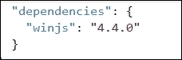

保存文件后，包将自动在 Visual Studio 2015 中的`node_modules\npm`文件夹中下载。

以下是 WinJS 库包含的文件夹的屏幕截图。JS 包含`winjs`模块、`css`和`fonts`，可以用来改变 UI 的外观和感觉：

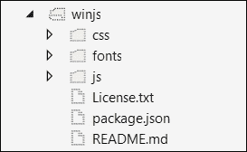

你可以使用`Gulp.js`将`css`和`js`文件复制到`wwwroot`文件夹并在页面上引用它们，我们可以在按钮点击事件中添加以下示例代码来显示`You have clicked!`文本：

```js
<!DOCTYPE html>
<html>
<head>
    <meta charset="utf-8" />
    <title></title>
    <script src="img/base.js"></script>
    <script src="img/ui.js"></script>
    <script src="img/winjs.intellisense-setup.js"></script>
    <script src="img/winjs.intellisense.js"></script>
    <script src="img/jquery-1.9.0.js"></script>
    <link rel="stylesheet" href="lib/winjs/css/ui-dark.css" />
</head>
<body>    
    <div class="win-container">
        <button class="win-button" id="btn">Show</button>
        <span id="txtMessage"></span>
    </div>
    <script>
        (function () {
            WinJS.UI.processAll().done(function () {
                $('#btn').click(function () {
                    $('#txtMessage').text("You have clicked!");
                });
            });
        })();
    </script>
</body>
</html>
```

以下是输出结果：


页面加载时，将会执行一个函数，当所有 WinJS 控件都被处理时，为按钮注册点击事件。`WinJS.UI.processAll()`方法解析整个文档对象模型（DOM），寻找需要处理的 WinJS 控件，并在所有控件的绑定完成后返回一个承诺。

在幕后，`WinJS.UI.processAll()`只处理`isDeclarativeControlContainer`属性设置为`true`的控制器。这告诉 WinJS 需要与 WinJS 库绑定的控制器。如果您使用自定义控制器，则需要指定这个`isDeclarativeControlContainer`属性，以便它可以被 WinJS 处理。

事件可以通过声明性绑定或通过从 JavaScript 注册事件来注册。在前面的代码中，我们通过 JavaScript 注册了按钮点击事件；然而，在声明性方面，您也可以设置事件并调用一些可以在按钮被点击时调用的 JavaScript 函数。

## 在 Visual Studio 中现有的 Windows 应用模板

```js
default.js:
```

```js
<!DOCTYPE html>
<html>
<head>
    <meta charset="utf-8" />
    <title>App1</title>

    <!-- WinJS references -->
    <link href="WinJS/css/ui-dark.css" rel="stylesheet" />
    <script src="img/base.js"></script>
    <script src="img/ui.js"></script>

    <!-- App1 references -->
    <link href="/css/default.css" rel="stylesheet" />
    <script src="img/default.js"></script>
</head>
<body class="win-type-body">
    <p>Content goes here</p>
</body>
</html>
```

```js
for default.js:
```

```js
(function () {
  "use strict";

  var app = WinJS.Application;
  var activation = Windows.ApplicationModel.Activation;

  app.onactivated = function (args) {
    if (args.detail.kind === activation.ActivationKind.launch) {
      if (args.detail.previousExecutionState !== activation.ApplicationExecutionState.terminated) {
      } else {
      }
      args.setPromise(WinJS.UI.processAll());
    }
  };

  app.oncheckpoint = function (args) {
  };

  app.start();
})();
```

# 探索 WinJS 核心基础

在使用 WinJS 库的任何项目之前，最好了解核心概念，帮助我们编写高质量的程序并充分利用库的最佳功能。

## 类和命名空间

通过 WinJS，我们可以使用一些特殊的语法来创建类和命名空间。这是 WinJS 库提供的，用于处理复杂场景。正如我们所知，类和命名空间是 ECMAScript 6 的功能，但不幸的是，目前还没有浏览器有适当的实现。然而，借助 WinJS，我们可以定义类和命名空间，并且在需要的地方使用它们是一个有用的选择。

### 在 WinJS 中定义类

在 WinJS 中，可以通过`WinJS.Class.define()`方法定义类。以下是 WinJS 中类的示例代码：

```js
<script>
        var Logger = WinJS.Class.define(function (value) {
            //constructor
            console.log("Constructor is executing, value passed is: " + value );
        }     
        );
   //Initializing Logger class object    
    var log = new Logger("Hello World");
</script>
```

在前面的代码中，我们创建了一个名为`Logger`的类，其中第一个函数的参数是构造函数，第二个是任何`instanceMembers`如属性和方法，第三个是`staticMembers`以定义静态成员和属性。以下是`define`方法的签名：

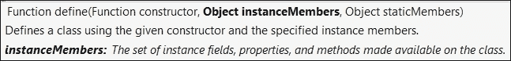

现在让我们在同一个类`Logger`中添加属性`message`和`LogMessage()`方法：

```js
<script>
        var Logger = WinJS.Class.define(function (value) {
               this.logName = value;
               this.enabled;
         //constructor
            console.log("Constructor is executing, value passed is " + value );
        }, {
            logMessage: function (message) {
                if (this.logEnabled) {
                    alert("The message is" + message);
                }
            },
  logEnabled: {
                 get: function () { return this.enabled; },
                 set: function (value) { this.enabled = value; }
             }
        }
        );

       var log = new Logger("Sample log");
       log.logEnabled = true;
       log.logMessage("Hello World");
<script>
```

定义类的方法语法的名称后面跟着一个冒号（`:`）和函数体，如下所示：

```js
logMessage: function (message) {
              alert("The message is" + message);
       }
```

属性可以通过`get`和`set`函数方法定义，如下面的代码所示：

```js
logEnabled: {
                get: function () { return this.enabled; },
                set: function (value) { this.enabled = value; }
            }
```

可以在相同的方式下定义多个属性和方法， separated with comma，如下面的代码所示：

```js
  logEnabled: {
                get: function () { return this.enabled; },
                set: function (value) { this.enabled = value; }
             },

            logType: {
                get: function () { return this.loggerType; },
                set: function (value) { this.loggerType = value;}
            }
```

### 在 WinJS 中派生类

在 WinJS 中，可以通过使用`WinJS.class.derive()`方法来派生类。考虑前面的例子，我们也可以在基类上添加`logEnabled`和`logType`属性，然后从`BaseLogger`类派生出`Logger`类。以下是 WinJS 中派生类的代码：

```js
<script>
        var BaseLogger = WinJS.Class.define(function (logName) {
            this.enabled;
            this.loggerType;
            this.loggerName = logName;
        }, {
            logEnabled: {
                get: function () { return this.enabled; },
                set: function (value) { this.enabled = value; }
            },

            logType: {
                get: function () { return this.loggerType; },
                set: function (value) { this.loggerType = value; }
            }
        });

        var Logger = WinJS.Class.derive(BaseLogger, function (logName) {
            //calling base constructor and passing the LogName to the base constructor
            BaseLogger.call(this, logName);
        },
        {
            logMessage: function (message) {
                if (Object.getOwnPropertyDescriptor(BaseLogger.prototype, "logEnabled").get.call(this) == true) {
                    alert("The message is " + message);
                }
            },

        }
        );

        var log = new Logger("Hello World");
        log.logEnabled = true;
        log.logType = "Alert";
        log.logMessage("hello");
</script>
```

在上面的脚本中，我们将`logType`和`logEnabled`这两个属性都移到了基类`BaseLogger`中。在 WinJS 中，基属性可以通过以下语法访问：

```js
Object.getOwnPropertyDescriptor(BaseLogger.prototype, "logEnabled").get.call(this)
```

通过在`getOwnPropertyDescriptor()`方法调用后调用`set`方法进行设置：

```js
Object.getOwnPropertyDescriptor(BaseLogger.prototype, "logEnabled").set.call(this) = true;
```

现在，如果您想要在`BaseLogger`类上采用`logMessage()`方法，我们可以通过原型化来实现，如下所示：

```js
BaseLogger.prototype.logMessage.call(this);
```

### WinJS 中的命名空间

在面向对象编程中，命名空间在组织类和分类代码方面发挥着重要作用。例如，服务可以位于 `ApplicationName.Services` 命名空间下；模型可以位于 `ApplicationName.Models` 命名空间下，等等。

我们应该尽可能地使用命名空间，因为它可以解决许多在中型到大型项目中可能出现的问题。例如，我们在页面上添加的两个 JavaScript 文件具有相似的属性或函数名称。如果有相同的名称，后来引用的将覆盖先前的成员函数或变量。

WinJS 提供了逻辑上组织类到命名空间的简单方法，你可以通过调用 `WinJS.Namespace.define("命名空间名称", {})` 来定义一个命名空间。

以下示例将 `BaseLogger` 和 `Logger` 类封装到 `Demo.App.Utilities` 命名空间中：

```js
WinJS.Namespace.define("DemoApp.Utilities", {
            //BaseLogger class
            BaseLogger: WinJS.Class.define(function (logName) {
                this.enabled;
                this.loggerType;
                this.loggerName = logName;
            }, {
                logEnabled: {
                    get: function () { return this.enabled; },
                    set: function (value) { this.enabled = value; }
                },

                logType: {
                    get: function () { return this.loggerType; },
                    set: function (value) { this.loggerType = value; }
                },
            }),

            //Logger class
            Logger: WinJS.Class.derive(BaseLogger, function (logName) {
                //calling base constructor and passing the LogName to the base constructor
                BaseLogger.call(this, logName);
            },
            {
                logMessage: function (message) {
                    if (Object.getOwnPropertyDescriptor(BaseLogger.prototype, "logEnabled").get.call(this) == true) {
                        alert("The message is " + message);
                    }
                },

            })
        });
```

现在，可以通过指定其命名空间来访问 `Log` 类，如下面的代码所示：

```js
var log = new DemoApp.Utilities.Logger("Sample Logger");
        log.logEnabled = true;
        log.logType = "Alert";
        log.logMessage("hello");
```

## 混入

大多数语言不支持多重继承。然而，在 WinJS 中，我们可以通过混入（mixins）来实现。与类一样，`mixin` 是一组方法和属性的集合，但混入的对象不能被实例化。它用于与类混合，带来混入所具有的方法和属性。例如，以下是一个包含 `logMessage()` 方法的混入 `logMixin`：

```js
  var logMixin = {
     logMessage: function (message) {
                alert(message);
            }
        };

        var SampleClass = WinJS.Class.define(function(){

        });

        WinJS.Class.mix(SampleClass, logMixin);

        var sample = new SampleClass();

        sample.logMessage("Mixin");
```

在调用 `mix` 方法时，我们可以添加尽可能多的混入。如果有两个或更多的混入具有共同的方法或属性，后来的将覆盖现有的。让我们看看两个混入（分别为 `logMixin` 和 `logConsoleMixin`）以及一个 `SampleClass` 都有一个相同的 `logMessage()` 方法。根据规范，方法将被覆盖，当调用 `logMessage()` 时，它将在控制台日志上写入一条消息：

```js
        //First Mixin
        var logMixin = {
            logMessage: function (message) {
                alert(message);
            }
        };

        //Second Mixin
        var logConsoleMixin = {
            logMessage: function (message) {
                console.log(message);
            }
        }

        //Class
        var SampleClass = WinJS.Class.define(function () {

        },

        logMessage= function(message){
        var result = confirm(message);
        });

        WinJS.Class.mix(SampleClass, logMixin, logConsoleMixin);

        var sample = new SampleClass();
        sample.logMessage("Mixin");
```

## WinJS 中的事件

WinJS 提供了 `eventMixin` 对象，可以通过以下基本步骤注册、注销和分发事件：

1.  首先，我们需要调用分发事件的类需要添加 `WinJS.Utilities.eventMixin`。我们可以通过 `WinJS.Class.mix` 方法添加它，如下所示：

    ```js
    WinJS.Class.mix(SampleClass, WinJS.Utilities.eventMixin);
    ```

1.  一旦 `eventMixin` 被 `SampleClass` 继承，我们就可以调用 `dispatchEvent()` 方法在特定动作上分发事件。以下是 `Sample` 类在调用 `execute` 方法后分发事件的代码：

    ```js
            var SampleClass = WinJS.Class.define(function () {
            },
            {
                execute: function(message){
                    this.dispatchEvent("executeInvoked", { message: "Executed" });
                }
            });
    ```

1.  接下来，我们可以添加 `addEventListener()` 方法，并提供将在分发消息被调用时调用的 `eventHandler()`：

    ```js
            var sampleClass = new SampleClass();
            var sampleEventHandler = function (event) {

                alert(event.detail.message);
            };
            sampleClass.addEventListener("executeInvoked", sampleEventHandler);

            sampleClass.execute("hello");       
    ```

## Databinding

WinJS 提供了将任何 JavaScript 数据源绑定到 HTML 元素的简单方法。任何 JavaScript 数据源都可以使用 HTML 元素上的 `data-win-bind` 属性进行绑定。数据绑定有助于将数据与视图分离，并允许您编写更少的代码，并使用 WinJS 将数据与元素绑定，WinJS 提供了以下三种数据绑定类型。

### 一次性数据绑定

一次性数据绑定用于将 HTML 页面上的元素从 JavaScript 数据源绑定。它是单向的，这意味着如果 JavaScript 数据源被更新，它不会反映在绑定到的 HTML 上。

以下是具有两个控件的 HTML 代码，它将名称和描述属性与您在 JavaScript 中定义的视图模型绑定：

```js
<div id="rootDiv">
        <div> Course Name:
            <span id="divForm" data-win-bind="innerText: name">loading</span>
        </div>
        <div>
            Course Description:
            <span id="divForm" data-win-bind="innerText: description">loading</span>
        </div>
    </div>
Below is the JavaScript code which defines the view model
let ViewModel = WinJS.Class.define(function () {
                this.nameProp;
                this.descProp;
            },
            {
                name: {
                    get: function () { return this.nameProp; },
                    set: function (value) { this.nameProp = value; }
                },
                description: {
                    get: function () { return this.descProp; },
                    set: function (value) { this.descProp = value; }
                }
            });

            let viewModel = new ViewModel();
            viewModel.name = "WinJS databinding";
            viewModel.description = "Introduction to WinJS databinding";
            var personDiv = document.querySelector('#rootDiv');
            WinJS.Binding.processAll(personDiv, viewModel);
```

### 单向绑定

单向绑定是一种单向绑定。一旦 HTML 元素被绑定到 JavaScript 数据源，数据源的任何更改都会在 HTML 页面上反映出来，但如果在 HTML 元素上进行了更新，它不会更新后端 JavaScript 数据源。单向绑定可以通过使源模型可观察来实现。所以如果源对象上有什么变化，它就会更新与之绑定的 UI 元素。这可以通过使用`WinJS.binding.as()`方法或在与源类添加`observableMixin`来实现。

以下是一个单向绑定的示例，它将属性`Name`和`Description`绑定到按钮点击事件上，更新 HTML 元素并设置从后端数据源设置的值。在之前的 HTML 页面中添加按钮，如*一次性数据绑定*部分所示：

```js
//HTML markup
<button id="btnUpdate">Click</button>

//JavaScript
   let ViewModel = WinJS.Class.define(function () {
                      this.nameProp;
                      this.descProp;
           },
           {
 name: {
    get: function () { return this.nameProp; },
    set: function (value) { this.nameProp = value; }
        },
 description: {
    get: function () { return this.descProp; },
    set: function (value) { this.descProp = value; }
        }
 });

let viewModel = new ViewModel();
viewModel.name = "WinJS databinding";
viewModel.description = "Introduction to WinJS databinding";
var personDiv = document.querySelector('#rootDiv');

let observableViewModel = WinJS.Binding.as(viewModel);

   WinJS.Binding.processAll(personDiv, observableViewModel);

document.querySelector('#btnUpdate').onclick = function () {
   observableViewModel.name = "new name";
  observableViewModel.description ="new description";
}
```

### 双向数据绑定

双向数据绑定在两个方向上起作用。一旦 JavaScript 对象被绑定到 HTML 控件上，无论在控件本身上进行任何更改，还是在 JavaScript 对象的价值发生更改时，控件值都将被更新，反之亦然。在 WinJS 中实现双向绑定不是一件简单的事。我们需要有一种单向绑定在位，以反映后端数据源上发生的任何变化，并反映在前端，同时也要从任何在 UI 元素上进行的更改更新后端数据源。这可以通过实现`onPropertyChange()`、`onKeyDown()`、`onChange()`、`onClick()`以及其他基于 HTML 元素的函数来完成：

```js
someTextboxElement.onpropertychange=function(){
      someModel.property = someTextboxElement.value;
}
```

另一种方法是实现一个自定义绑定初始化器，如以下代码所示：

```js
<input type="text" data-win-bind="value: someProperty Binding twoWayBinding" />
```

让我们创建一个自定义的双向绑定初始化器，并扩展相同的`viewModel`以通过文本框接受名称和描述的更新。以下是我们的自定义双向绑定初始化器的代码：

```js
//Defining Binding initializer to support two way binding
WinJS.Namespace.define("Binding.Mode", {
      twoway: WinJS.Binding.initializer(function 
                        (source, sourceProperties, destination, destinationProperties) {
          WinJS.Binding.defaultBind(source, sourceProperties, destination, destinationProperties);
          destination.onchange = function () {
              var destValue = destination[destinationProperties[0]];
              source[sourceProperties[0]] = destValue;
          }
      })
  });
```

然后创建一个包含两个属性的类，分别为`name`和`description`：

```js
//Defining class
let ViewModel = WinJS.Class.define(function () {
                      this.nameProp;
                      this.descProp;
                  },
{
name: {
get: function () { return this.nameProp; },
set: function (value) { this.nameProp = value; }
},
description: {
get: function () { return this.descProp; },
set: function (value) { this.descProp = value; }
}
});

//Initializing class Instance
let viewModel = new ViewModel();
viewModel.name = "WinJS databinding";
viewModel.description = "Introduction to WinJS databinding";

var rootDiv = document.querySelector('#rootDiv');
let observableViewModel = WinJS.Binding.as(viewModel);
WinJS.Binding.processAll(rootDiv, observableViewModel);
```

在上面的代码中，我们首先使用`WinJS.Binding.initializer`定义了绑定初始化器。定义此初始化器时，我们必须传递四个属性，分别是源元素及其属性对象和目标元素及其属性。例如，在我们的情况下，源元素是一个文本框，源属性是它的值，而目标元素将是一个`span`，`innerText`作为其目标属性。`WinJS.Binding.defaultBind`创建单向绑定，然后我们可以注册源属性的`onchange()`事件，以更新目标属性。然后我们定义了一个类，并通过初始化一个实例来初始化值。最后，我们将模型转换为可观察模型，以提供双向绑定。

现在，在 HTML 元素中，我们可以像下面这样添加绑定：

```js
<div id="rootDiv">
            <div
 <input type="text" data-win-bind="value: name Binding.twoWayBinding" />
            </div>
            <div>
                Course Name:
                <span id="spanName" data-win-bind="innerText: name">loading</span>
            </div>
            <div>
<input type="text" data-win-bind="value: description Binding.twoWayBinding" />
            </div>
            <div>
                Course Description:
                <span id="spanDesc" data-win-bind="innerText: description">loading</span>
            </div>
            </div>
```

### 数据绑定的工作模型

当在 WinJS 中完成数据绑定时，如果使用 WinJS，则必须调用`WinJS.processAll()`方法。该方法扫描所有指定`data-win-bind`属性的元素。对于每个元素，它检查与元素绑定的数据是否可观察。这是一个关键步骤，它确定了绑定的类型，并声明绑定是单向绑定、一次性绑定还是双向绑定。

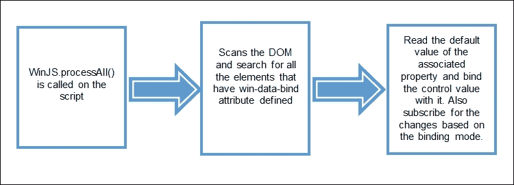

## 承诺

承诺代表一个可能随时包含值的对象的承诺。这是一个承诺，满足消费者资源将可用，消费者可以在不等待资源的异步方式中完成其余工作。

它作为 C#的异步/等待功能。承诺允许消费者在做其他工作而不是等待值返回的同时，提供某些方法来确认承诺一旦收到。在某些情况下，由于某些错误，有可能响应不会返回，这也可以通过实现特定的回调来处理。

在 WinJS 中，承诺是一个具有`then`和`done`函数的对象。我们可以这样初始化承诺：

```js
var promise = new WinJS.Promise(function (completed, error, progress)

//Call if we need to update consumer that still in progress
progress("progress");

//Call if any error occurs
error("error");

//Call when the function is completed
completed("completed");
}
);
```

前面的代码是定义一个返回 promise 的函数的方式。如果我们还没有完成方法并且需要通知消费者如果正在进行中，我们可以调用一个`progress`方法。一旦定义了 promise，我们可以使用`then`和`done`方法来实现由 promise 触发的回调方法。`then`方法返回一个 promise，表示操作的中间阶段，而`done`是操作的最后阶段，不返回`promise`：

```js
promise.then(
function () { console.log("completed"); }, 
function () { console.log("error") }, 
function () { console.log("promise") }
);
```

下面的示例显示了在处理 promise 后显示表格在控制台窗口中并返回完成的函数：

```js
function executeTable(table, max)
{
  return new WinJS.Promise(function(completed, error, progress){
  for (i = 1; i < max; i++) {
     console.log(table +' X '+ i +' = ' + (table * i ));
  }
  completed("executed table")
 });
 };

  executeTable(2, 10).then(
            function (completedVal) {
                    console.log(completedVal);
             }, function (errorVal) {
                    console.log(errorVal);
             },
             function (onProgressVal) {
                    console.log(onProgressVal);
             }

   )
```

以下是输出：

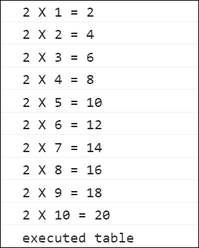

现在让我们修改同一个示例，并调用`progress`在每个迭代中将中间结果发送给消费者。前一个方法是同步的，返回承诺并不意味着该方法将异步执行。为了使这个方法异步运行，我们可以通过`setImmediate()`函数包装代码块。

`setImmediate()`是 JavaScript 函数，用于中断函数的执行，并立即返回回调函数，最终在我们的情况下调用承诺的`onProgress()`函数。以下是带有`setImmediate()`和`onProgress()`方法的修改版本：

```js
function executeTable(table, max)
            {
                return new WinJS.Promise(function (completed, error, onProgress) {
                    window.setImmediate(function () {
                        for (i = 1; i <= max; i++) {
                            var row = table + ' X ' + i + ' = ' + (table * i);
                            onProgress(row);
                        }
                        completed("executed table")
                    }, 0);
                });
            }; 

  executeTable(2, 10).then(
            function (completedVal) {
                    console.log(completedVal);
             }, function (errorVal) {
                    console.log(errorVal);
             },
             function (onProgressVal) {
                    console.log(onProgressVal);
             }

   )
```

前一段代码片段的结果将与前一个示例中的结果相同。然而，使用`setImmediate()`函数允许`onProgress()`方法异步地将消息写入控制台窗口，并且在性能方面更有效率。

### 承诺的其他操作

承诺上有几个其他方法可以用来取消任何承诺、链式调用承诺、超时、包装等。让我们看看每个方法是如何使用的。

#### 承诺链式调用和错误处理

可以使用`then`链式调用多个承诺，并根据它们被链式调用的顺序一个接一个地顺序执行。以下是一个使用`WinJS.xhr()`方法的简单示例来加载网页。此方法是内置方法，返回一个承诺，我们可以使用此方法来发起 HTTP 请求：

```js
var promise1 = function () { return WinJS.xhr({ url: "http://microsoft.com" }) };
            var promise2 = function () { return WinJS.xhr({ url: "http://google.com" }) };
            var promise3 = function () { return WinJS.xhr({ url: "http://techframeworx.com" }) };
            var promise4 = function () { return WinJS.xhr({ url: "http://msdn.microsoft.com" }) };

            promise1().then(function (dataPromise1) {
                console.log("got the response from promise 1");
                return promise2();
            }).then(function (dataPromise2) {
                console.log("got the response from promise 2");
                return promise3();
            }).then(function (dataPromise3) {
                console.log("got the response from promise 3");
                return promise4();
            }).done(function (dataPromise4) {
                console.log("got the response from promise4");
                console.log("completed the promise chain");
            });
```

在前一个代码中，我们在每个承诺链执行块中返回下一个承诺。当链式调用承诺时需要这样做，否则它不会调用管道中的下一个承诺。对于管道中的最后一个承诺，我们使用了`done`而不是`then`，这实际上告诉我们链中没有下一个承诺，现在无法进行链式调用。另一个好处是执行错误处理。在`done`方法中，我们可以获取链中任何承诺抛出的所有错误。如果我们不使用`done`，那么我们将无法访问承诺链中抛出的任何错误。以下示例是带有错误处理的先前示例的修改版本：

```js
            var promise1 = function () { return WinJS.xhr({ url: "http://microsoft.com" }) };
            var promise2 = function () { return WinJS.xhr({ url: "http://google.com" }) };
            var promise3 = function () { return WinJS.xhr({ url: "htt://techframeworx.com" }) };
            var promise4 = function () { return WinJS.xhr({ url: "http://msdn.microsoft.com" }) };

            promise1().then(function (dataPromise1) {
                console.log("got the response from promise 1");
                return promise2();
            }).then(function (dataPromis2) {
                console.log("got the response from promise 2");
                return promise3();
            }).then(function (dataPromise3) {
                console.log("got the response from promise 3");
                return promise4();
            }).done(function (dataPromise4) {
                console.log("got the response from promise 4");
                console.log("completed the promise chain");
            }, function (error) {
                console.log("some error occurred, cause: " + error);
            });
```

在前一个示例中，我们在链中的最后一个承诺中使用了`done`。现在，如果你注意到了，承诺 2 的 URL 是不有效的，并且有一个拼写错误。现在如果我们执行前一个代码，`promise1`和`promise2`将被执行，并将消息写入控制台日志窗口。然而，承诺将不会执行，但`error`方法将在`done`方法下定义并被调用，并将错误描述写入控制台日志窗口：

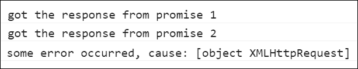

#### 取消承诺

可以通过调用`promise`对象的`cancel`方法来取消承诺。以下是一个取消任何承诺的示例：

```js
var promiseGoogle = function () { return WinJS.xhr({ url: "http://google.com" }) };
            googlePromiseObj = promiseGoogle();
            googlePromiseObj.cancel();
```

只有在承诺没有完成并且一旦取消就进入错误状态时，才能取消承诺。

#### 结合承诺

多个承诺可以结合起来，当它们都完成后返回。我们可以像下面的代码那样结合承诺。

```js
   var promise1 = function () { return WinJS.xhr({ url: "http://microsoft.com" }) };
            var promise2 = function () { return WinJS.xhr({ url: "http://googe.com" }) };
            var promise3 = function () { return WinJS.xhr({ url: "http://techframeworx.com" }) };
WinJS.Promise.join([promise1, promise2, promise3])
.done(function(){
  console.log("All the promises are finished");
});
```

当需要知道`any`方法中定义的任何一个承诺是否执行时，可以使用`Promise.any()`：

```js
var promise1 = function () { return WinJS.xhr({ url: "http://microsoft.com" }) };
var promise2 = function () { return WinJS.xhr({ url: "http://googe.com" }) };
var promise3 = function () { return WinJS.xhr({ url: "http://techframeworx.com" }) };
WinJS.Promise.any([promise1, promise2, promise3])
.done(function(){
  console.log("One of the promises is finished");
});
```

#### 检查承诺

`WinJS.Promise.is()`是一个方法，它接受一个值作为参数，并检查该值是否是一个承诺。例如，在`WinJS.Promise.is()`方法中调用`WinJS.xhr`将返回`true`：

```js
WinJS.Promise.is(WinJS.xhr({ url: "http://microsoft.com" }));
```

#### 将非承诺包装成承诺

任何函数都可以通过使用`WinJS.Promise.as()`方法将其包装成承诺。下面的代码将非承诺`displayMessage()`方法包装成一个承诺：

```js
function displayMessage() {

                console.log("This is a non promise function")
            }
            var promiseDisplayMessage = WinJS.Promise.as(displayMessage);
            promiseDisplayMessage.done(function () { console.log("promise is executed") });
```

# 探索 WinJS 控件和样式

微软的 JavaScript 库提供了一系列丰富的控件、数据绑定选项、承诺，在本节中，我们将探索一些流行的控件和样式选项。

没有一个 WinJS 控件有单独的标记，而是 WinJS 库提供了几个属性，可以用现有的 HTML 元素。

## 添加 WinJS 控件

正如我们所看到的，没有为 WinJS 控件添加任何标记，它们可以通过在 HTML 元素上添加属性来实现。

在下面的例子中，我们将一个简单的 HTML 按钮元素变成在商店应用中通常看到的后退按钮。这可以通过添加`data-win-control`属性和将完全限定名设置为`WinJS.UI.BackButton`来实现。

这里是 HTML 标记：

```js
<button data-win-control="WinJS.UI.BackButton">WinJS button</button>
```

当你运行它时，它将在页面上渲染一个后退按钮，如下面的图所示：

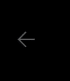

它不仅改变了外观，还提供了箱式导航功能。

## 设置 WinJS 控件的属性

每个 HTML 元素都有几个属性，可以通过指定值通过属性来寻址。例如，评分控件允许用户对任何项目进行评分，我们可以设置显示星星的`max`和`min`范围属性：

```js
<div id="ratingControl" data-win-control="WinJS.UI.Rating"
         data-win-options="{minRating: 1, averageRating : 5, maxRating: 10}"></div>
```

前一个标记输出的结果将生成一个评分控件，如下面的图所示：


还有其他的 Windows 特定控件，如`ListView`、`FlipView`和`Zoom`，你可以在页面中使用它们，在大量集合或对象上带来高性能。你可以在 Windows 开发者中心的网站上了解更多关于控件的信息：[`msdn.microsoft.com/en-us/library/windows/apps/mt502392.aspx`](https://msdn.microsoft.com/en-us/library/windows/apps/mt502392.aspx)

# 使用 Windows 运行时特性

WinJS 提供了完整的 API 来使用 Windows 运行时功能和设备特定功能。当使用 WinJS 访问设备特定功能时，Web 应用程序应作为 Windows 应用程序运行，从浏览器访问将导致错误。此外，微软还发布了 Hosted apps 的概念，它使任何 Web 应用程序能够通过几步配置作为 Windows 应用程序托管。

## Hosted apps 和访问摄像头

```js
package.json:
```

```js
{
  "version": "1.0.0",
  "name": "ASP.NET",
  "private": true,
  "dependencies": {
    "winjs": "4.4.0"
  },
  "devDependencies": {
    "gulp": "³.9.1"
  }
   }
```

我们可以在依赖项部分添加 WinJS，并在保存`package.json`文件时，包将自动下载。我们还需要添加 gulp，以复制相关库和 CSS 文件到`wwwroot`文件夹中。之后，添加`gulpfile.js`并添加以下脚本：

```js
/// <binding Clean='clean' />
"use strict";
var gulp = require("gulp");
var paths = {
    webroot: "./wwwroot/"
};
var config = {
    libBase: 'node_modules',
    lib: [
       require.resolve('winjs/js/base.js'),
       require.resolve('winjs/js/ui.js'),
       require.resolve('winjs/js/winjs.intellisense.js'),
       require.resolve('winjs/js/winjs.intellisense-setup.js')
    ],
    libCss: [require.resolve('winjs/css/ui-dark.css'),
        require.resolve('winjs/css/ui-light.css')
    ]
};
gulp.task('build.lib', function () {
    return gulp.src(config.lib, { base: config.libBase })
    .pipe(gulp.dest(paths.webroot + 'lib'));
});
gulp.task('build.libCss', function () {
    return gulp.src(config.libCss, { base: config.libBase })
    .pipe(gulp.dest(paths.webroot + "lib"));
});
```

当你通过 Visual Studio 2015 中的任务运行器标签运行`build.lib`和`build.LibCss`任务时，它将在`wwwroot`文件夹内复制 WinJS 库和`CSS`文件：

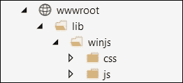

在这个应用程序中，我们将有一个简单的 HTML 页面，我们可以直接添加到`wwwroot`文件夹中，为此我们需要在`Configure()`方法中调用`app.UseStaticFiles()`方法，并在`project.json`中添加包：

```js
"Microsoft.AspNet.StaticFiles": "1.0.0-rc1-final"
```

让我们在`wwwroot`文件夹中添加`Index.html`页面，并在 HTML 头元素中添加以下脚本：

```js
    <script src="img/base.js"></script>
    <script src="img/ui.js"></script>
    <script src="img/winjs.intellisense-setup.js"></script>
    <script src="img/winjs.intellisense.js"></script>
    <script src="img/jquery-1.9.0.js"></script>
```

我们将使用浅色 Windows 主题，因此添加`ui-light.css`，如下所示：

```js
    <link rel="stylesheet" href="lib/winjs/css/ui-light.css" />
```

现在添加包含一个`Capture`按钮以捕获图像的页面内容，以及一个图像元素来显示捕获的图像：

```js
  <div id="rootDiv">
        <div class="col-md-4">
           Click to capture image <input type="button" value="Capture" onclick="return CaptureCamera();" />
        </div>
        <br />
        
     </div>
```

以下是要输出的页面：

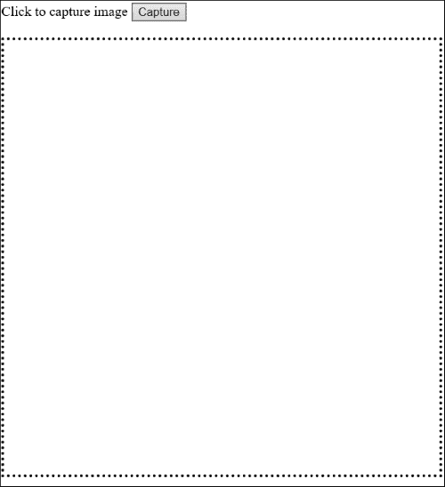

现在添加以下脚本以访问摄像头并将捕获的图像附加到图像元素：

```js
      <script>
            if (window.Windows) {
                function CaptureCamera() {
                    var notifications = Windows.UI.Notifications;
                    var dialog = new Windows.Media.Capture.CameraCaptureUI();
                    var aspectRatio = { width: 1, height: 1 };
                    dialog.photoSettings.croppedAspectRatio = aspectRatio;
                    dialog.captureFileAsync(Windows.Media.Capture.CameraCaptureUIMode.photo).done(function (capturedImage) {
                        if (capturedImage) {
                            var imageURL = URL.createObjectURL(capturedFile, { oneTimeOnly: true });
                            document.getElementById("img").src = imageURL;
                        }
                        else {
                            WinJS.log && WinJS.log("No image captured yet", "WinJSTestApp", "Status");
                        }
                    }, function (err) {
                        WinJS.log && WinJS.log(err, "WinJSTestApp", "Error");
                    });
                }
            } else {
                function CaptureCamera() {
                    alert("Cannot access camera, it should be hosted as a windows application");
                }
            }
    </script>
```

### 使用 Hosted app 概念将 ASP.NET 应用程序转换为 Windows 应用程序

将任何 Web 应用程序转换为 Windows 应用程序非常简单。在 Visual Studio 2015 中，您可以开始使用**空白应用（通用 Windows）**模板创建一个简单的基于 JavaScript 的 Windows 应用程序，如下所示：

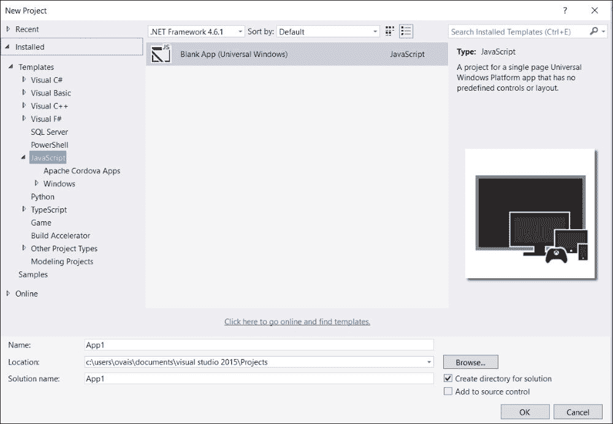

当你添加一个项目时，它会添加`css`、`images`、`js`和`winjs`文件夹。我们必须删除`css`、`js`和`winjs`文件夹，因为我们在这个项目中不会使用任何文件，并配置上面创建的 Web 应用程序，将其转换为 Windows 应用程序。

打开`package.appxmanifest`窗口。在**启动页面**文本框中添加 URL，如下所示。我们上面创建的示例 ASP.NET 应用程序托管在端口`41345`上：

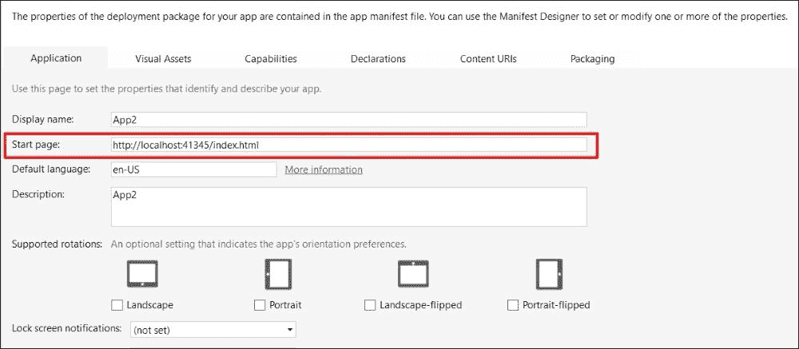

在**内容 URI**标签中，添加我们网络应用程序的 URI，并在**WinRT 访问**下选择**全部**。您可以指定任何应该被托管在某处的网络应用程序的 URL。在前面的截图中，我们使用 localhost，它实际上指的是本地托管的网络应用程序：

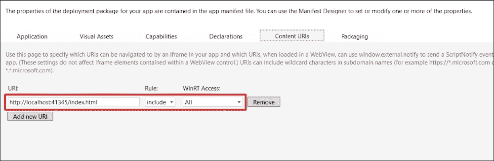

此窗口允许我们指定对 WinRT 功能的访问规则，我们可以将其设置为`None`、`All`或仅`Web 允许`。

构建并运行应用程序将在我们的网络应用程序`index.html`页面上显示窗口应用程序对话框：

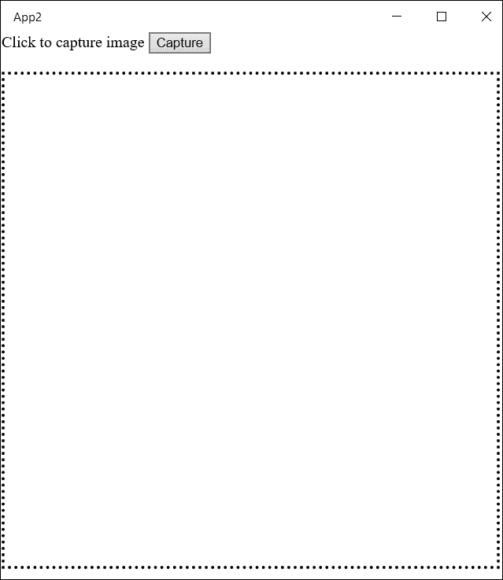

点击**捕获**按钮将弹出另一个对话框以拍摄快照，如下所示：

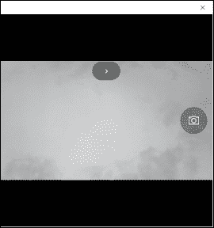

在拍摄所需的照片后，它将通过勾选和交叉按钮询问您是否保存或拒绝：

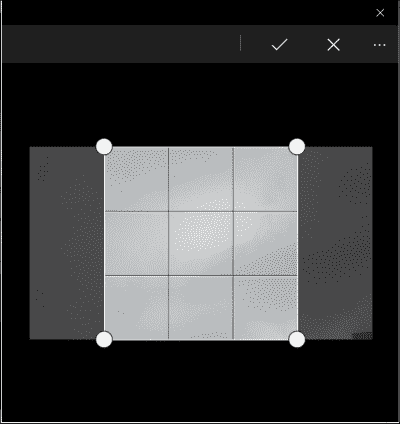

选择勾选框将在`img` HTML 元素中渲染照片，如下所示：

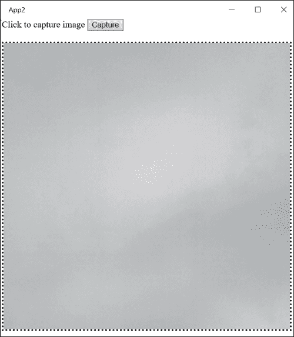

# 总结

在本章中，我们探索了 WinJS Windows 库，这是一个开源且遵循 Apache 许可的 JavaScript 库。我们学习了定义类、命名空间、继承类、混合模式和承诺的核心概念。我们还研究了数据绑定技术，以及如何使用 HTML 元素中的窗口控件或属性来改变控件的行为和外观。最后，我们使用了 WinRT API 在我们的网络应用程序中访问设备摄像头，并学习了宿主应用程序的概念，以及如何使用 Visual Studio 2015 中的通用窗口模板将任何网络应用程序转换为 Windows 应用程序。在下一章中，我们将学习一些可以在 JavaScript 中实现的设计模式，以满足特定需求。
