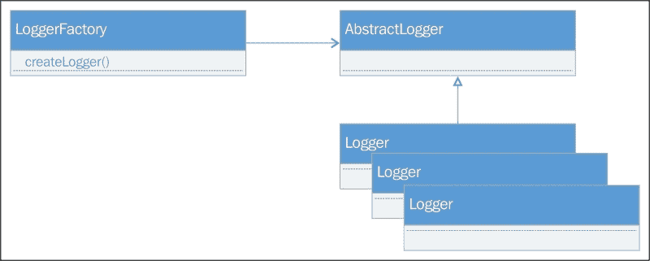
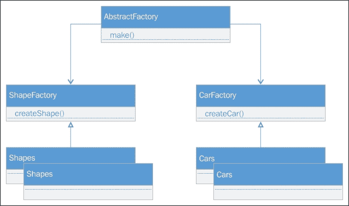
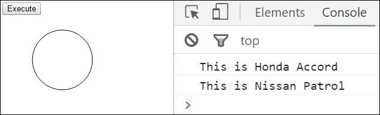
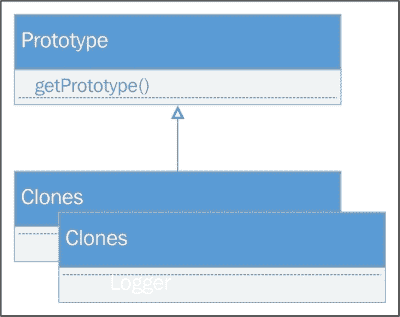
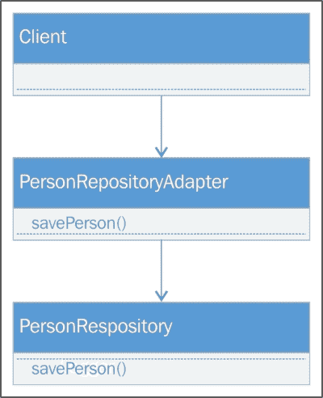
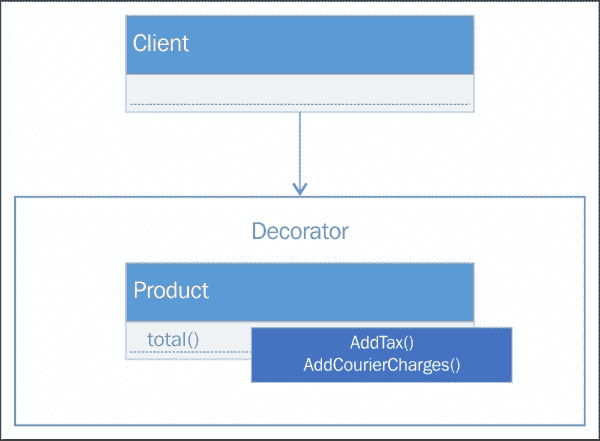
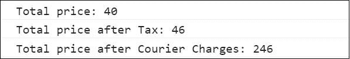
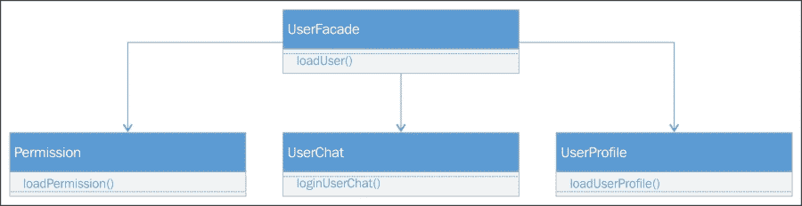
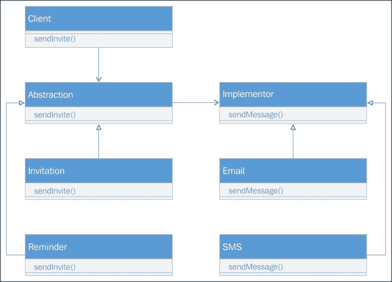
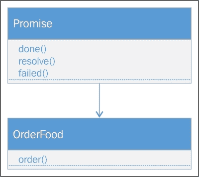

# 第七章：JavaScript 设计模式

在每一个中等到大型的项目中，良好的架构和设计总是在处理复杂场景和提高产品的可维护性方面发挥重要作用。设计模式是开发者和专业开发人员为解决特定问题而开发和使用的最佳实践。如果一个设计模式已经用于应用程序的特定场景，它可以在开发过程中或生产环境中运行时避免许多问题。设计模式通过提供行业最佳实践的指导来解决问题或实现需求。例如，单例模式用于创建一个被所有对象共享的唯一实例，而原型模式则通过添加更多属性和方法来扩展对象现有功能。设计模式分为三类，即创建型、结构型和行为型模式。本章我们将覆盖的主题如下：

+   **创建型模式**：以下是本章我们将讨论的创建型模式列表：

    +   单例模式

    +   工厂模式

    +   抽象工厂模式

    +   原型模式

+   **结构型模式**：以下是本章我们将讨论的结构型模式列表：

    +   适配器模式

    +   装饰器模式

    +   外观模式

    +   桥接模式

+   **行为型模式**：以下是本章我们将讨论的行为型模式列表：

    +   责任链模式

    +   观察者模式

    +   发布/订阅模式

    +   承诺（Promises）

# 创建型模式

创建型模式用于对象实例化。它们用于对象创建的基本形式可能导致设计问题或增加设计复杂性的情况。在下一节中，我们将讨论前面提到的所有四个创建型模式，以及如何在 JavaScript 中实现它们。

## 单例设计模式

单例是最常用的模式。它用于需要在不同对象之间共享类或函数（就 JavaScript 而言）的同一实例的场景。它确保了特定对象的只有一个实例可以在任何时候全局访问：


在单例模式中，构造函数应该是私有的，这限制了用户使用`new`关键字创建对象，并暴露一个创建实例并验证只有一个实例存在的的方法。一个简单的例子可能是一个写日志到浏览器控制台窗口的日志对象：

```js
<script>
    var Logger = (function () {

        //private variable
        var instance;

        //private method
        function initializeInstance() {
            //closure returns the public access to the writeLog function that can be accessible by the singleton object
            return {
                writeLog: function (message) {
                    console.log(message);
                }
            };
        };
        //closure that returns the public access to the getInstance method that returns the singleton object
        return {
            //This is a public method that returns the singleton instance
            getInstance: function () {
                if ( !instance ) {
                    instance = initializeInstance();
                }
                return instance;
            },
        };
    })();

    var logger = Logger.getInstance();
    logger.writeLog("Hello world");
</script>
```

### 小贴士

在 JavaScript（ES5 标准）中，类仍然通过函数表示。

在 JavaScript 中，要实现单例，我们可以使用闭包。闭包是内部对象，它们可以访问函数的私有成员，例如访问在父函数内定义的变量和方法，并且可以从闭包中访问它们。

最后语句中的括号`()`用于将对象返回给日志变量，而不是函数本身。这实际上限制了通过`new`关键字初始化对象。

在前面的脚本中，函数首先返回一个闭包，其中有一个`getInstance()`方法，该方法实际上检查私有成员变量 instance，如果它未初始化，则调用`initializeInstance()`方法，该方法返回另一个包含`writeLog()`方法的闭包。我们可以添加更多方法或变量，用逗号分隔，它们将通过日志对象访问。以下是`initializeInstance()`方法的修改版本，其中有一个额外的方法`showAlert()`和一个变量`logEnabled`：

```js
function initializeInstance() {
            //closure returns the public access to the writeLog function that can be accessible by the singleton object
            return {
                writeLog: function (message) {
                    if(this.logEnabled)
                     console.log(message);
                },  
                showAlert: function (message) {
                    if(this.logEnabled)
                        alert(message);
                },
                logEnabled: false
            };
        };
```

## 工厂模式

工厂模式将对象实例化委托给中心化的类。而不是使用`new`关键字实例化对象，我们调用返回请求对象类型的`factory`方法：



以下是基于日志类型创建日志实例的`LoggerFactory`示例：

```js
//LoggerFactory to instantiate objects based on logger type
    function LoggerFactory() {
        var logger;
        this.createLogger = function (loggerType) {
            if (loggerType === "console") {
                logger = new ConsoleLogger();
            }
            else if (loggerType === "alert") {
                logger = new AlertLogger();
            }
            return logger;
        }
    }

    //Console logger function
    var ConsoleLogger= function(){
        this.logMessage=function(message){
            console.log(message);
        } 
    };

    //Alert logger function
    var AlertLogger= function(){
        this.logMessage= function(message){
            alert(message);
        } 
    };

    var factory = new LoggerFactory();

    //creating Console logger object using LoggerFactory
    var consoleLogger = factory.createLogger("console");
    consoleLogger.logMessage("Factory pattern");

    //create Alert logger object using LoggerFactory
    var alertLogger = factory.createLogger("alert");
    alertLogger.logMessage("Factory pattern");
```

在我们的示例中，工厂类是`LoggerFactory`，它创建`ConsoleLogger`和`AlertLogger`对象的实例。`LoggerFactory`暴露一个`createLogger()`方法，该方法接受日志类型作为参数，以确定需要实例化哪个对象。每种日志类型都有自己的`logMessage()`方法，用于在控制台窗口上记录日志或显示警告消息。

## 抽象工厂模式

抽象工厂模式封装了一系列工厂以创建实例。实例暴露相同的方法，可以被工厂调用。以下是两个工厂的示例，`ShapeFactory`和`CarFactory`，每个工厂都返回两种类型的实例。`ShapeFactory`返回`Circle`和`Square`实例，而`CarFactory`返回`HondaCar`和`NissanCar`实例。每个实例都有相同的方法`make()`，可以对任何实例进行调用：



以下是`ShapeFactory`的代码：

```js
<script>
    //Shape Factory to create instances of Circle and Square
    var ShapeFactory = function() {
        var shape;
        this.createShape = function (shapeType) {
            if (shapeType === "circle") {
                return new CircleShape();
            }
            else if (shapeType === "square") {
                return new SquareShape();
            }
        }
    }

    //Circle object to draw circle
    var CircleShape = function () {
        this.make = function () {
            var c = document.getElementById("myCanvas");
            var ctx = c.getContext("2d");
            ctx.beginPath();
            ctx.arc(100, 75, 50, 0, 2 * Math.PI);
            ctx.stroke();
        }
    }

    //Square object to draw square
    var SquareShape = function () {
        this.make = function () {
            var c = document.getElementById("myCanvas");
            var ctx = c.getContext("2d");
            ctx.beginPath();
            ctx.rect(50, 50, 50, 50);
            ctx.stroke();
        }
    }
```

以下是创建 Honda 和 Nissan 汽车实例的`CarFactory`代码：

```js
    //Car factory to create cars
    var CarFactory= function() {
        var car
        this.createCar = function (carType) {
            if (carType === "honda") {
                return new HondaCar();
            }
            else if (carType === "nissan") {
                return new NissanCar();
            }
        }
    }

    //Honda object
    var HondaCar = function () {
        this.make = function () {
            console.log("This is Honda Accord");
        }
    }

    //Nissan object
    var NissanCar = function () {
        this.make = function () {
            console.log("This is Nissan Patrol")
        }
    }
```

我们在按钮点击事件上调用`execute`方法，该方法创建实例并将它们保存在数组中。最终，对象的`make()`方法将被执行，在 HTML 画布上绘制圆并在控制台上写入消息。与 JavaScript 一样，我们不能定义抽象方法；我们必须明确定义相同的方法，例如在我们的案例中完成的抽象工厂模式中的`make()`：

```js
    function execute() {
        //initializing an array to hold objects
        var objects = [];

        //Creating Shape Factory to create circle shape
        var shapeFactory = new ShapeFactory();
        var circleShape = shapeFactory.createShape("circle");

        //Creating Car Factory to create cars
        var carFactory = new CarFactory();
        var hondaCar= carFactory.createCar("honda");
        var nissanCar = carFactory.createCar("nissan");

        //Adding all the instances created through factories
        objects.push(circleShape);
        objects.push(hondaCar);
        objects.push(nissanCar);

        //Calling make method of all the instances. 
        for (var i = 0; i < objects.length; i++) {
            alert(objects[i]);
            objects[i].make();
        }
    }

</script>
```

以下是包含画布和按钮的 HTML 代码：

```js
    <div>
        <input type="button" onclick="execute()" value="Execute" />
    </div>
    <div>
        <canvas id="myCanvas"></canvas>
    </div>
```

在按钮点击事件上，输出将如下所示。将绘制一个圆并在控制台窗口上打印 Honda 和 Nissan 汽车对象的两次消息：



## 原型模式

原型模式用于创建现有实例的克隆实例。它用于需要自动为对象配置某些特定值或属性的场景，用户无需显式定义：



以下是实现原型模式的代码：

```js
<script>

    function Car(make, model, year, type)
    {
        this.make = make;
        this.model = model;
        this.year = year;
        this.type = type;

        this.displayCarDetails = function(){

        }

    }

    function CarPrototype(carPrototype) {
        var car = new Car();

        this.getPrototype = function () {
            car.make = carPrototype.make;
            car.model = carPrototype.model;
            car.year = carPrototype.year;
            car.type = carPrototype.type;
            return car;
        }

    }

    (function () {
        var car = new Car("Honda", "Accord", "2016","sedan");
        var carPrototype = new CarPrototype(car);
        var clonedCar = carPrototype.getPrototype();

    })();
</script>
```

```js
 is a car object that accepts four parameters, make, model, year and type. CarPrototype() is a function that accepts the car object and returns the cloned version of the car object. This pattern is performance efficient and saves developers time creating a clone copy of the object by just calling the prototype object's clone method. The user does not need to care about populating the properties after object instantiation; it initializes when the object is created and gets the same values as the original object. It is used in conditions where we need to clone instances of objects when they are in a specific state and can be easily cloned by calling the getProtoype() method.
```

# 结构模式

结构模式用于简化对象之间的关系。在以下部分，我们将讨论前面提到的所有四种结构模式，以及如何在 JavaScript 中实现它们。

## 适配器模式

适配器模式用于应用程序依赖于属性和方法频繁变化的对象的情况，我们想避免修改使用它们的代码。适配器模式允许我们将特定对象的接口包装为我们期望的接口，而无需改变整个实现，我们只需调用包含修改后版本代码的包装器对象。这个包装器对象称为适配器。让我们来看一个使用`PersonRepository`通过执行 Ajax 请求保存`person`对象的简单示例：



以下是`PersonRepository`对象的旧接口：

```js
// old interface
    function PersonRepository(){
        this.SavePerson= function(name, email, phoneNo){
            //Call ajax to save person
            console.log("Name: " + name + ", Email: " + email + ", Phone No: " + phoneNo);
        }
    }
```

前一个接口有一个`SavePerson()`方法，该方法接受三个参数：`name`、`email`和`phoneNo`。以下是使用`SavePerson()`方法的原始代码：

```js
var execute = function () {

        var personRepository = new PersonRepository();
        personRepository.SavePerson("John", "john@email.com", "1201111111");

    }
```

假设这个接口发生了变化，新的人员仓库接口接受`person` JSON 对象，而不是通过参数传递值。一种方法是直接在这里修改函数，将这些参数封装在 JSON 对象中并发送。另一种方法是实现一个适配器模式，该模式包含一个适配器函数，该函数接受三个参数，调用新的`PersonRepository`对象并传递 JSON 对象。

以下是`PersonRepository`的新接口：

```js
function PersonRepository() {
        this.SavePerson = function (person) {
            //call ajax to send JSON person data
          console.log("Name: " + person.name + ", Email: " + person.email + ", Phone No: " + person.phoneNo);
        }
    }
```

以下是一个将参数封装在 JSON 对象中并调用新`PersonRepository`接口的适配器模式：

```js
    function PersonRepositoryAdapter() {
        this.SavePerson = function (name, email, phoneNo) {
            var person = { "name": name, "email": email, "phoneNo": phoneNo };

            var personRepository = new PersonRepository();
            //calling new Person Repository
personRepository.SavePerson(person);
        }
    }
```

以下是调用适配器模式而不是调用旧的`PersonRespository`接口的修改版本：

```js
    var execute = function () {

    //old interface
// var personRepository = new PersonRepository();
  // personRepository.SavePerson("John", "john@email.com", "1201111111");

      //calling adapter pattern
        var personAdapter = new PersonRepositoryAdapter();
        personAdapter.SavePerson("John", "john@email.com", "1201111111");

    }
```

## 装饰器模式

装饰器模式用于在运行时改变对象的行为。装饰器在 C#中类似于注解属性。同样，我们也可以在一个对象上添加多个装饰器。装饰器模式可以通过创建一个装饰器对象并将该对象与需要改变行为的目标对象关联来实现：



以下是一个添加了`Tax`和`Courier`费用装饰器的`Product`对象的示例：

```js
<script>

    var Product= function (code, quantity, price) {
        this.code = code;
        this.quantity = quantity;
        this.price = price

        this.total = function () {
            this.price = price * quantity;
            return this.price;
        }

    }

    //Decorator that takes product and percent as parameter to apply Tax
    function AddTax(product, percent) {
        product.total = function () {
             product.price = product.price + (product.price * percent / 100);
            return  product.price;
        }
    }

    //Decorator to add Courier charges in the total amount.
    function AddCourierCharges(product, amount) {
        product.total = function () {
            product.price = product.price + amount;
            return product.price;
        }
    }

    var execute = (function () {
        var prod = new Product("001", 2, 20);
        console.log("Total price: " + prod.total());
        AddTax(prod, 15);
        console.log("Total price after Tax: " + prod.total());
        AddCourierCharges(prod, 200);
        console.log("Total price after Courier Charges: " + prod.total());
    })();
```

`product`对象接受三个参数，`code`、`quantity`和`price`，根据`quantity`和`price`计算总价。`AddTax()`和`AddCourierCharges()`是两个装饰器对象， followed product object with a parameter to apply specific calculation on change the total price. The `AddTax()` method applies the tax based on the value supplied, whereas `AddCourierCharges()` will add the courier charge amount to the total price. The `Execute()` method will be called immediately when the page renders and displays the following output in the console window:



## 外观模式

外观模式用于将各种接口或子系统简化为一个统一的接口。它简化了事物对用户来说，而不是理解不同子系统的复杂性，用户可以调用`façade`接口来执行特定操作。

让我们看看以下示例，它有三个方法来加载登录成功后的权限、用户资料和用户聊天窗口。它有三个接口，通过外观我们可以简化为一个统一的接口。这允许用户如果登录成功，只需调用一次`UserFacade`，它将从一个接口加载权限、用户聊天和用户资料：



```js
<script>
    var Permission = function () {
        this.loadPermission = function (userId) {
            //load user permissions by calling service and populate HTML element
            var repo = new ServiceRepository();
            repo.loadUserPermissions(userId);
        }
    }

    var Profile = function () {
        this.loadUserProfile = function (userId) {
            //load user profile and set user name and image in HTML page
            var repo = new ServiceRepository();
            repo.loadUserProfile(userId);
        }
    }

    var Chat = function () {
        this.loginUserChat = function (userId) {
            //Login user chat and update HTML element
            var repo = new ServiceRepository();
            repo.loadUserChat(userId);
        }
    }

    var UserFacade = function () {
        this.loadUser = function (userId) {
            var userPermission = new Permission();
            var userProfile = new Profile();
            var userChat = new Chat();

            userPermission.loadPermission(userId);
            userProfile.loadUserProfile(userId);
            userChat.loginUserChat(userId);

        }
    }

    var loginUser = (function (username, password) {

            //Service to login user
            var repo = new ServiceRepository();
            //On successfull login, user id is returned
            var userId = repo.login(username, password);

            var userFacade = new UserFacade();
            userFacade.loadUser(userId);

    })();
<
```

## 桥接模式

桥接模式用于将抽象与其实现解耦，并使具体实现与接口独立。这是通过在接口和具体实现者之间提供一个桥梁来实现的：



下面的代码展示了桥接模式的实现：

```js
<script>

    var Invitation = function (email) {
        this.email = email;
        this.sendInvite = function () {
            this.email.sendMessage();
        }
    }

    var Reminder = function (sms) {
        this.sms = sms;
        this.sendReminder = function () {
            this.sms.sendMessage();
        }
    }

    var SMS = function () {
        //send SMS
        this.sendMessage = function () { console.log("SMS sent"); }

    }

    var Email = function () {
        //send email
        this.sendMessage = function () { console.log("Email sent");}
    }

    var execute = (function () {
        var email = new Email();
        var sms = new SMS();

        var invitation = new Invitation(email);
        var reminder = new Reminder(sms);

        invitation.sendInvite();
        reminder.sendReminder();
    })();
</script>
```

前一个示例的目标是将通知类型（`Invitation`和`Reminder`）与通知网关（`Email`和`SMS`）分离。因此，任何通知都可以通过任何网关发送，并且可以处理任何通知，将网关与通知类型分离，并禁用与通知类型的绑定。

# 行为型模式

行为型模式用于在对象之间委派责任。在以下部分，我们将讨论前面提到的所有四种行为型模式，以及如何在 JavaScript 中实现它们。

## 责任链模式

责任链模式提供了一串按顺序执行的对象链，它们被串联起来以满足任何请求。ASP.NET 开发者一个很好的例子是 OWIN 管道，它将组件或 OWIN 中间件串联在一起，基于适当的请求处理器被执行：


让我们来看一个非常基本的示例，它执行对象链并显示 2、3 和 4 的表格：

```js
<script>

    //Main component
    var Handler = function (table) {
        this.table = table;
        this.nextHandler = null;
    }

    //Prototype to chain objects
    Handler.prototype = {
        generate: function (count) {
            for (i = 1; i <= count; i++) {
                console.log(this.table + " X " + i + " = " + (this.table * i));
            }
            //If the next handler is available execute it
            if (this.nextHandler != null)
                this.nextHandler.generate(count);
        },
        //Used to set next handler in the pipeline
        setNextHandler: function (handler) {
            this.nextHandler = handler;
        }
    }

    //function executed on Page load
    var execute = (function () {

        //initializing objects
        var handler1 = new Handler(2),
         handler2 = new Handler(3),
         handler3 = new Handler(4);

        //chaining objects
        handler1.setNextHandler(handler2);
        handler2.setNextHandler(handler3);

        //calling first handler or the component in the pipeline
        handler1.generate(10);

    })();
<script>
```

让我们进入一个更实际的示例，该示例获取金额并在管道中的对象中检查预算所有者。以下代码有一个主处理对象，它接受预算金额和预算所有者，以设置`Line Manager`、`Head of Department`、`CTO`和`CEO`的预算金额。最后，我们可以通过调用`handler1`方法设置链中的主入口点，该方法首先检查金额是否在 line manager 的预算范围内，然后是部门经理的、CTO 的，最后是 CEO 的：

```js
<script>

    //Main component
    var Handler = function (budget, budgetOwner) {
        this.budget = budget;
        this.budgetOwner = budgetOwner;
        this.nextHandler = null;
    }

    //Prototype to chain objects
    Handler.prototype = {
        checkBudget: function (amount) {
            var budgetFound = false;
            if (amount <= this.budget) {
                console.log("Amount is under " + this.budgetOwner + " level");
                budgetFound = true;
            }

            //If the next handler is available and budget is not found
            if (this.nextHandler != null && !budgetFound)
                this.nextHandler.checkBudget(amount);
        },

        //Used to set next handler in the popeline
        setNextHandler: function (handler) {
            this.nextHandler = handler;
        }
    }

    //funciton executed on Page load
    var execute = (function () {

        //initializing objects
        var handler1 = new Handler(10000, "Line Manager"),
         handler2 = new Handler(50000, "Head of Department"),
         handler3 = new Handler(100000, "CTO"),
         handler4 = new Handler(1000000, "CEO");

        //chaining objects
        handler1.setNextHandler(handler2);
        handler2.setNextHandler(handler3);
        handler3.setNextHandler(handler4);

        //calling first handler or the component in the pipeline
        handler1.checkBudget(20000);

    })();
</script>
```

以下是输出结果：


## 观察者模式

```js
implements the observer pattern:
```

```js
<script>

    //Sample function to convert text to French language
    function translateTextToFrench(value) {
        // call some service to convert text to French language
        return value;
    }

    //Sample function to convert text to Arabic language
    function translateTextToArabic(value) {
        //cal some service to convert text to Arabic language
        return value;

    }

    //Helper function used by the Observer implementors 
    var HelperFunction = function (type) {

        var txtEntered = document.getElementById("txtEntered");

        var englishText = document.getElementById("englishText");
        var frenchText = document.getElementById("frenchText");
        var arabicText = document.getElementById("arabicText");

        if (type == "english") {
            englishText.innerText = txtEntered.value;
        } else if (type == "french") {
            frenchText.innerText = translateTextToFrench(txtEntered.value);
        } else if (type == "arabic") {
            arabicText.innerText = translateTextToArabic(txtEntered.value);
        }
    }

    var EnglishTranslator = {
        update: function () {
            //Call helper function to change text to English
            HelperFunction("english");
        }
    }

    var FrenchTranslator = {
        update: function () {
            //Call helper function to change text to French
            HelperFunction("french");
        }
    }

    var ArabicTranslator = {
        update: function () {
            //Call helper function to change text to Arabic
            HelperFunction("arabic");
        }
    }

    //Observer function that contains the list of observer handlers
    function Observer() {
        this.observers = [];
    }

    //to add observer
    Observer.prototype.addObserver = function (object) {
        console.log('added observer: ' + object);
        this.observers.push(object);
    };

    //to remove observer
    Observer.prototype.removeObserver = function (object) {
        console.log("removing observer");
        for (i = 0; i < this.observers.length; i++) {
            if (this.observers[i] == object) {
                this.observers.splice(object);
                return true;
            }
        }
        return false;
    };

    //To notify all observers and call their update method
    Observer.prototype.notify = function () {
        for (i = 0; i < this.observers.length; i++) {
            this.observers[i].update();
        }
    }

    //Adding objects as observers that implements the update method
    var observer = new Observer();
    observer.addObserver(EnglishTranslator);
    observer.addObserver(FrenchTranslator);
    observer.addObserver(ArabicTranslator);

    //Execute will be called on button click to notify observers
    var execute = function () {
        observer.notify();
    };

</script>
<body>
    <div>
        Specify some text: <input type="text" id="txtEntered" />
        <input type="button" onclick="execute()" value="Notify" />
    </div>
    <div>
        <span id="englishText"></span>
        <span id="frenchText"></span>
        <span id="arabicText"></span>
    </div>
</body>
```

在上述示例中，我们采取了一个场景，为所有添加为观察者对象的语言翻译文本。我们扩展了`Observer`对象，并通过原型定义了三个方法，分别是`addObserver()`、`removeObserver()`和`notify()`。通过原型添加方法可以节省内存，每个方法都被所有实例共享。这些方法一次性创建，然后被每个实例继承。另一方面，在构造函数函数内定义的方法每次创建新实例时都会被创建，消耗更多内存。

`addObserver()`方法用于将任何对象添加到观察者列表中，`removeObserver()`用于从观察者列表中移除特定对象，`notify()`执行观察者的`update()`方法。

`EnglishTranslator`、`FrenchTranslator`和`ArabicTranslation`是实现了`update()`方法的对象，当`notify()`执行时会调用该方法。在页面加载时，我们已经将所有翻译器对象注册为观察者，并提供了一个文本框和一个按钮，用户可以在文本框中输入任何文本，在按钮点击事件时，它会调用观察者的`notify()`方法，最终调用注册观察者的`update()`方法。

## 发布/订阅模式

```js
 implement the pub/sub pattern in JavaScript:
```

```js
var PubSub = function () {
        this.events = [];
        this.subscribe = function (eventName, func) {
            this.events[eventName] = this.events[eventName] || [];
            this.events[eventName].push(func);
        };

        this.unsubscribe = function (eventName, func) {
            if (this.events[eventName]) {
                for (i = 0; i < this.events[eventName].length; i++) {
                    if (this.events[eventName][i] === func) {
                        this.events[eventName].splice(i, 1);
                        break;
                    }
                }
            }
        };

        this.publish = function (eventName, data) {
            console.log(data);
            if (this.events[eventName]) {
                this.events[eventName].forEach(function (event) {
                    event(data);
                })
            }
        };
    };

    var execute = (function () {
        var pubSub = new PubSub();
        pubSub.subscribe("myevent1", function () {
            console.log("event1 is occurred");
        });

        pubSub.subscribe("myevent1", function () {
            console.log("event1 is occurred");
        });

        pubSub.subscribe("myevent2", function (value) {
            console.log("event2 is occurred, value is "+ value);
        });

        pubSub.publish("myevent1", null);

        pubSub.publish("myevent2", "my event two");
    })();
```

在之前的示例中，我们有一个`PubSub`对象，它提供了三个方法：`subscribe`、`unsubscribe`和`publish`，用于处理事件。`Subscribe()`方法用于订阅任何事件，并接受两个参数：事件名称和函数，并将它们添加到特定事件名称的数组中。如果事件名称不存在，则会为该事件名称初始化一个新的数组；否则，将检索现有实例以添加项目。用户可以通过传递事件名称和匿名函数体来注册尽可能多的事件，当事件发布时将执行该函数体。要发布事件，可以调用`publish()`方法，该方法接受事件名称和要传递给相应函数的数据，该函数将被执行。

## 承诺

承诺是 JavaScript API 和框架中广泛使用的一种最流行的模式，用于使异步调用更简单。在 JavaScript 中，异步操作需要有一个回调函数注册，当值返回时调用。使用承诺时，当你进行任何异步调用，它立即返回一个承诺，并提供诸如`then`和`done`的对象来定义当结果值解析时执行的函数。在现实世界中，承诺就像在快餐店订购食物时得到的 tokens 或收据，那个收据保证你在食物准备好时能够获得食物。承诺是确认你针对特定请求获得响应的 tokens：



在 JavaScript 中，承诺（promises）被广泛用于 API 和框架，如 AngularJS、Angular 2 等。让我们来看一下以下实现承诺模式的示例：

```js
//Defining Promise that takes a function as a parameter.
    var Promise = function (func) {
        //Declared member variable 
        var callbackFn = null;

        //Expose done function that can be invoked by the object returning promise
        //done() function takes a callback function which can be define when using done method.
        this.done = function (callback) {
           callbackFn = callback;
        };

        function resolve(value) {
            setTimeout(function () {
                callbackFn(value)
            },3000)
        }

        //Here we are actually executing the function defined when initializing the promise below.
        func(resolve);
    }

    //Object that is used to order food and returns a promise
    var orderFood = function (food) {
        //returns the Promise instance and pass anonymous function that call resolve method which actually serve the request after delaying 3 seconds.
        return new Promise(function (resolve) {
            resolve(food);
        });
    }

    //Initialized orderFood that returns promise
    var order = new orderFood("Grilled Burger");
    //Calling done method which will be invoked once the order is ready
    order.done(function (value) {
        console.log(value);
    });
```

```js
promise pattern. However, there are other parts of the promise pattern that we can implement to make it robust. Promises have states and the following is the modified version that not only maintains the states for inprogress, done, and failed but also provides the failed handler to catch exceptions. The following is the description of the states:
```

+   **进行中**：当调用`resolve`方法时，状态将被设置为`in progress`。这个状态将持续，直到我们为`done`和`failed`场景注册处理程序。

+   **已完成**：当调用`done`时，状态将被设置为`done`。

+   **失败**：当发生任何异常时，状态将被设置为`fail`。

以下是对`orderFood`示例的修改版本：

```js
    //Defining Promise that takes a function as a parameter.
    var Promise = function (func) {

        //Default status when the promise is created
        var status = 'inprogress';
        var error = null;

        //Declared member variable 
        var doneCallbackFn = null;
        var failedCallbackFn = null;

        //Expose done function that can be invoked by the object returning promise
        this.done  = function (callback) {
            //Assign the argument value to local variable
            doneCallbackFn = callback;
            if (status === "done") {
                doneCallbackFn(data);
            } else {
                doneCallbackFn(status);
            }
            //return promise to register done or failed methods in chain
            return this;
        };

        //Expose failed function to catch errors
        this.failed = function (callback) {
            if (status === "failed") {
                failedCallbackFn(error);
            }
            //return promise instance to register done or failed methods in chain
            return this;
        };

        function prepareFood() {
            setTimeout(function () {
                status = "done";
                console.log("food is prepared");
                if (doneCallbackFn) {
                    doneCallbackFn(data);
                }
            }, 3000);

        }

        function resolve(value) {
            try {
                //set the value
                data = value;

                //check if doneCallbackFn is defined
                if (doneCallbackFn) {
                    doneCallbackFn(value);
                }
                prepareFood();

            } catch (error) {
                //set the status to failed
                status = "failed";
                //set the exception in error
                error = error;
                //check if failedCallbackFn is defined
                if (failedCallbackFn) {
                    failedCallbackFn(value);
                }
            }
        }
        //Here we are actually executing the function defined when initializing the promise below.
        func(resolve);
    }

    //Object that is used to order food and returns a promise
    var orderFood = function (food) {
        //returns the Promise instance and pass anonymous function that call resolve method which 
        //actually serve the request after delaying 3 seconds.
        return new Promise(function (resolve) {
            resolve(food);
        });
    }

    //Initialized orderFood that returns promise
    var order = new orderFood("Grilled Burger").done(function (value) { console.log(value); }).failed(function (error) { console.log(error);})
```

# 总结

在本章中，我们已经学习了设计模式在小到大型应用程序中的重要性，以及我们如何有效地使用它们来解决特定问题。我们已经涵盖了每个类别的四种设计模式，例如创建对象、结构化对象以及向对象添加行为变化或状态。还有许多其他的设计模式可供参考，具体可以参考这里：[`www.dofactory.com/javascript/design-patterns`](http://www.dofactory.com/javascript/design-patterns)。

在下一章中，我们将学习 Node.js，它可以在服务器端运行 JavaScript。我们将了解如何使用 Visual Studio 2015 在 Node.js 中开发网络应用程序，并探索一些流行的框架以及它提供的视图引擎。
